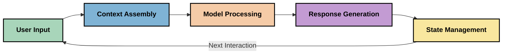
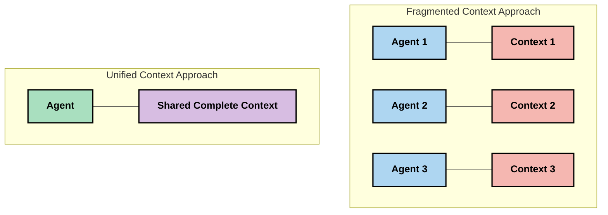
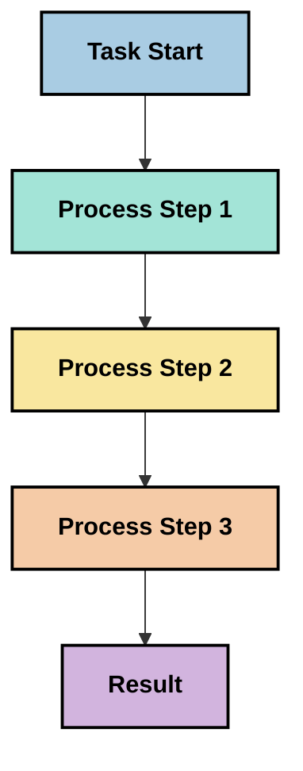
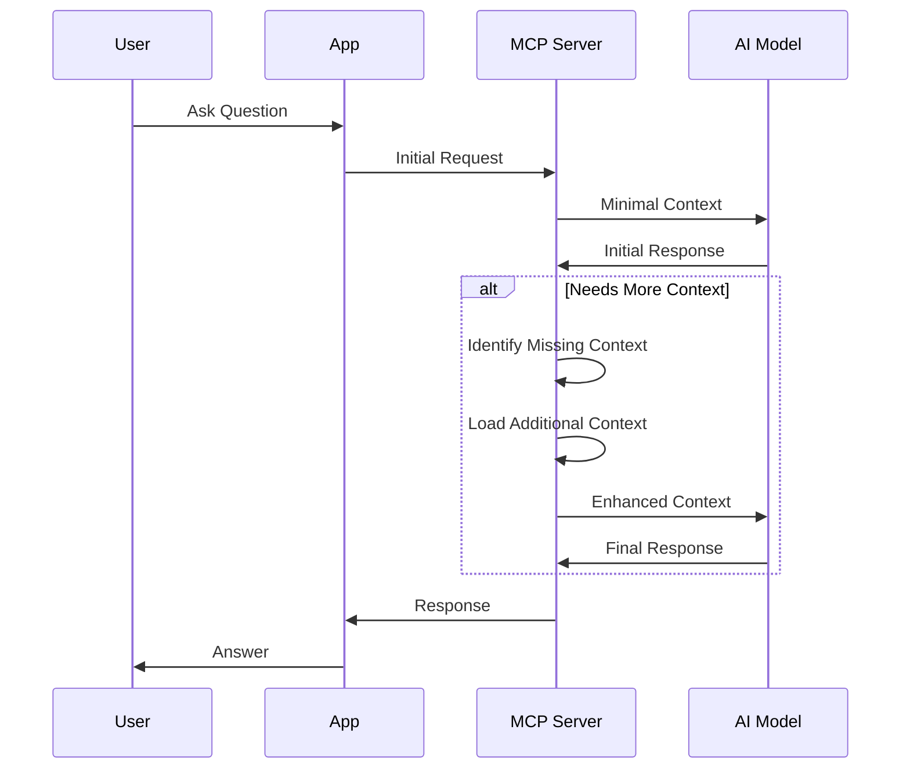
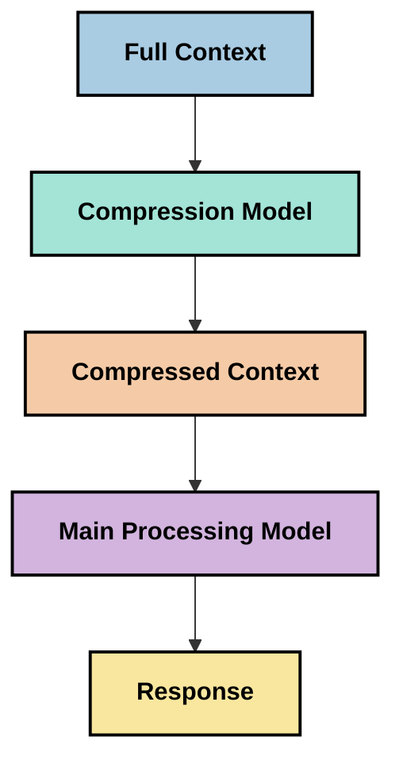

<!--
CO_OP_TRANSLATOR_METADATA:
{
  "original_hash": "5762e8e74dd99d8b7dbb31e69a82561e",
  "translation_date": "2025-07-17T01:44:13+00:00",
  "source_file": "05-AdvancedTopics/mcp-contextengineering/README.md",
  "language_code": "pa"
}
-->
# Context Engineering: MCP ਇਕੋਸਿਸਟਮ ਵਿੱਚ ਇੱਕ ਉਭਰਦਾ ਹੋਇਆ ਸੰਕਲਪ

## ਝਲਕ

Context engineering AI ਖੇਤਰ ਵਿੱਚ ਇੱਕ ਉਭਰਦਾ ਹੋਇਆ ਸੰਕਲਪ ਹੈ ਜੋ ਇਹ ਸਮਝਦਾ ਹੈ ਕਿ ਜਾਣਕਾਰੀ ਕਿਵੇਂ ਬਣਾਈ ਜਾਂਦੀ ਹੈ, ਪੇਸ਼ ਕੀਤੀ ਜਾਂਦੀ ਹੈ ਅਤੇ ਗਾਹਕਾਂ ਅਤੇ AI ਸੇਵਾਵਾਂ ਦੇ ਵਿਚਕਾਰ ਹੋਣ ਵਾਲੀਆਂ ਗੱਲਬਾਤਾਂ ਦੌਰਾਨ ਕਿਵੇਂ ਸੰਭਾਲੀ ਜਾਂਦੀ ਹੈ। ਜਿਵੇਂ ਜਿਵੇਂ Model Context Protocol (MCP) ਇਕੋਸਿਸਟਮ ਵਿਕਸਤ ਹੋ ਰਿਹਾ ਹੈ, context ਨੂੰ ਪ੍ਰਭਾਵਸ਼ਾਲੀ ਢੰਗ ਨਾਲ ਸੰਭਾਲਣ ਦੀ ਸਮਝ ਹੋਣਾ ਵਧਦਾ ਜਾ ਰਿਹਾ ਹੈ। ਇਹ ਮਾਡਿਊਲ context engineering ਦੇ ਸੰਕਲਪ ਨੂੰ ਜਾਣੂ ਕਰਵਾਉਂਦਾ ਹੈ ਅਤੇ MCP ਅਮਲਾਂ ਵਿੱਚ ਇਸ ਦੇ ਸੰਭਾਵਿਤ ਉਪਯੋਗਾਂ ਦੀ ਖੋਜ ਕਰਦਾ ਹੈ।

## ਸਿੱਖਣ ਦੇ ਲਕੜੇ

ਇਸ ਮਾਡਿਊਲ ਦੇ ਅੰਤ ਤੱਕ, ਤੁਸੀਂ ਸਮਰੱਥ ਹੋਵੋਗੇ:

- context engineering ਦੇ ਉਭਰਦੇ ਹੋਏ ਸੰਕਲਪ ਅਤੇ MCP ਐਪਲੀਕੇਸ਼ਨਾਂ ਵਿੱਚ ਇਸ ਦੀ ਸੰਭਾਵਿਤ ਭੂਮਿਕਾ ਨੂੰ ਸਮਝਣਾ
- context ਪ੍ਰਬੰਧਨ ਵਿੱਚ ਮੁੱਖ ਚੁਣੌਤੀਆਂ ਦੀ ਪਛਾਣ ਕਰਨਾ ਜਿਨ੍ਹਾਂ ਨੂੰ MCP ਪ੍ਰੋਟੋਕੋਲ ਡਿਜ਼ਾਈਨ ਹੱਲ ਕਰਦਾ ਹੈ
- context ਸੰਭਾਲਣ ਵਿੱਚ ਸੁਧਾਰ ਲਈ ਤਕਨੀਕਾਂ ਦੀ ਖੋਜ ਕਰਨਾ ਜੋ ਮਾਡਲ ਦੀ ਕਾਰਗੁਜ਼ਾਰੀ ਨੂੰ ਬਿਹਤਰ ਬਣਾਉਂਦੀਆਂ ਹਨ
- context ਦੀ ਪ੍ਰਭਾਵਸ਼ੀਲਤਾ ਨੂੰ ਮਾਪਣ ਅਤੇ ਮੁਲਾਂਕਣ ਕਰਨ ਦੇ ਤਰੀਕੇ ਸੋਚਣਾ
- MCP ਫਰੇਮਵਰਕ ਰਾਹੀਂ AI ਅਨੁਭਵਾਂ ਨੂੰ ਬਿਹਤਰ ਬਣਾਉਣ ਲਈ ਇਹ ਉਭਰਦੇ ਹੋਏ ਸੰਕਲਪ ਲਾਗੂ ਕਰਨਾ

## Context Engineering ਦਾ ਪਰਿਚਯ

Context engineering ਇੱਕ ਉਭਰਦਾ ਹੋਇਆ ਸੰਕਲਪ ਹੈ ਜੋ ਉਪਭੋਗਤਾਵਾਂ, ਐਪਲੀਕੇਸ਼ਨਾਂ ਅਤੇ AI ਮਾਡਲਾਂ ਵਿਚਕਾਰ ਜਾਣਕਾਰੀ ਦੇ ਪ੍ਰਵਾਹ ਦੇ ਜਾਣ-ਬੂਝ ਕੇ ਡਿਜ਼ਾਈਨ ਅਤੇ ਪ੍ਰਬੰਧਨ 'ਤੇ ਧਿਆਨ ਕੇਂਦ੍ਰਿਤ ਕਰਦਾ ਹੈ। ਜਿਵੇਂ ਕਿ prompt engineering ਵਰਗੇ ਸਥਾਪਿਤ ਖੇਤਰ ਹਨ, context engineering ਅਜੇ ਵੀ ਪ੍ਰਯੋਗਕਰਤਾਵਾਂ ਵੱਲੋਂ ਪਰਿਭਾਸ਼ਿਤ ਕੀਤਾ ਜਾ ਰਿਹਾ ਹੈ ਜੋ AI ਮਾਡਲਾਂ ਨੂੰ ਸਹੀ ਸਮੇਂ 'ਤੇ ਸਹੀ ਜਾਣਕਾਰੀ ਦੇਣ ਦੀਆਂ ਵਿਲੱਖਣ ਚੁਣੌਤੀਆਂ ਨੂੰ ਹੱਲ ਕਰਨ ਦੀ ਕੋਸ਼ਿਸ਼ ਕਰ ਰਹੇ ਹਨ।

ਜਿਵੇਂ ਵੱਡੇ ਭਾਸ਼ਾ ਮਾਡਲ (LLMs) ਵਿਕਸਤ ਹੋਏ ਹਨ, context ਦੀ ਮਹੱਤਤਾ ਵੱਧਦੀ ਗਈ ਹੈ। ਅਸੀਂ ਜੋ context ਦਿੰਦੇ ਹਾਂ ਉਸ ਦੀ ਗੁਣਵੱਤਾ, ਸਬੰਧਤਾ ਅਤੇ ਬਣਤਰ ਸਿੱਧਾ ਮਾਡਲ ਦੇ ਨਤੀਜਿਆਂ 'ਤੇ ਪ੍ਰਭਾਵ ਪਾਉਂਦੀ ਹੈ। Context engineering ਇਸ ਸੰਬੰਧ ਨੂੰ ਸਮਝਦਾ ਹੈ ਅਤੇ ਪ੍ਰਭਾਵਸ਼ਾਲੀ context ਪ੍ਰਬੰਧਨ ਲਈ ਸਿਧਾਂਤ ਵਿਕਸਤ ਕਰਨ ਦੀ ਕੋਸ਼ਿਸ਼ ਕਰਦਾ ਹੈ।

> "2025 ਵਿੱਚ, ਮਾਡਲ ਬਹੁਤ ਹੀ ਬੁੱਧਿਮਾਨ ਹਨ। ਪਰ ਸਭ ਤੋਂ ਚਤੁਰ ਮਨੁੱਖ ਵੀ ਆਪਣੇ ਕੰਮ ਨੂੰ ਪ੍ਰਭਾਵਸ਼ਾਲੀ ਢੰਗ ਨਾਲ ਨਹੀਂ ਕਰ ਸਕੇਗਾ ਜੇਕਰ ਉਹਨਾਂ ਨੂੰ ਉਹ ਸੰਦਰਭ ਨਾ ਮਿਲੇ ਜਿਸ ਵਿੱਚ ਉਹ ਕੰਮ ਕਰ ਰਹੇ ਹਨ... 'Context engineering' prompt engineering ਦਾ ਅਗਲਾ ਪੱਧਰ ਹੈ। ਇਹ ਇੱਕ ਗਤੀਸ਼ੀਲ ਪ੍ਰਣਾਲੀ ਵਿੱਚ ਇਸ ਨੂੰ ਆਟੋਮੈਟਿਕ ਤਰੀਕੇ ਨਾਲ ਕਰਨ ਬਾਰੇ ਹੈ।" — Walden Yan, Cognition AI

Context engineering ਵਿੱਚ ਸ਼ਾਮਲ ਹੋ ਸਕਦਾ ਹੈ:

1. **Context ਚੋਣ**: ਕਿਸੇ ਕੰਮ ਲਈ ਕਿਹੜੀ ਜਾਣਕਾਰੀ ਸਬੰਧਿਤ ਹੈ ਇਹ ਨਿਰਧਾਰਿਤ ਕਰਨਾ  
2. **Context ਬਣਤਰ**: ਜਾਣਕਾਰੀ ਨੂੰ ਇਸ ਤਰ੍ਹਾਂ ਸੰਗਠਿਤ ਕਰਨਾ ਕਿ ਮਾਡਲ ਨੂੰ ਵਧੀਆ ਸਮਝ ਆਵੇ  
3. **Context ਪ੍ਰਦਾਨਗੀ**: ਜਾਣਕਾਰੀ ਮਾਡਲਾਂ ਨੂੰ ਕਿਵੇਂ ਅਤੇ ਕਦੋਂ ਭੇਜੀ ਜਾਵੇ ਇਸ ਨੂੰ ਸੁਧਾਰਨਾ  
4. **Context ਸੰਭਾਲ**: ਸਮੇਂ ਦੇ ਨਾਲ context ਦੀ ਸਥਿਤੀ ਅਤੇ ਵਿਕਾਸ ਦਾ ਪ੍ਰਬੰਧਨ ਕਰਨਾ  
5. **Context ਮੁਲਾਂਕਣ**: context ਦੀ ਪ੍ਰਭਾਵਸ਼ੀਲਤਾ ਨੂੰ ਮਾਪਣਾ ਅਤੇ ਸੁਧਾਰਨਾ

ਇਹ ਧਿਆਨ ਦੇ ਖੇਤਰ MCP ਇਕੋਸਿਸਟਮ ਲਈ ਖਾਸ ਤੌਰ 'ਤੇ ਮਹੱਤਵਪੂਰਨ ਹਨ, ਜੋ ਐਪਲੀਕੇਸ਼ਨਾਂ ਨੂੰ LLMs ਨੂੰ context ਦੇਣ ਦਾ ਇੱਕ ਮਿਆਰੀਕ੍ਰਿਤ ਤਰੀਕਾ ਪ੍ਰਦਾਨ ਕਰਦਾ ਹੈ।

## Context ਯਾਤਰਾ ਦਾ ਨਜ਼ਰੀਆ

Context engineering ਨੂੰ ਸਮਝਣ ਦਾ ਇੱਕ ਤਰੀਕਾ ਇਹ ਹੈ ਕਿ ਜਾਣਕਾਰੀ MCP ਪ੍ਰਣਾਲੀ ਵਿੱਚ ਕਿਵੇਂ ਯਾਤਰਾ ਕਰਦੀ ਹੈ:



### Context ਯਾਤਰਾ ਦੇ ਮੁੱਖ ਪੜਾਅ:

1. **ਉਪਭੋਗਤਾ ਇਨਪੁੱਟ**: ਉਪਭੋਗਤਾ ਵੱਲੋਂ ਕੱਚੀ ਜਾਣਕਾਰੀ (ਟੈਕਸਟ, ਚਿੱਤਰ, ਦਸਤਾਵੇਜ਼)  
2. **Context ਇਕੱਠਾ ਕਰਨਾ**: ਉਪਭੋਗਤਾ ਇਨਪੁੱਟ ਨੂੰ ਸਿਸਟਮ context, ਗੱਲਬਾਤ ਇਤਿਹਾਸ ਅਤੇ ਹੋਰ ਪ੍ਰਾਪਤ ਜਾਣਕਾਰੀ ਨਾਲ ਜੋੜਨਾ  
3. **ਮਾਡਲ ਪ੍ਰਕਿਰਿਆ**: AI ਮਾਡਲ ਇਕੱਠੇ ਕੀਤੇ context ਨੂੰ ਪ੍ਰਕਿਰਿਆ ਕਰਦਾ ਹੈ  
4. **ਜਵਾਬ ਤਿਆਰ ਕਰਨਾ**: ਮਾਡਲ ਦਿੱਤੇ context ਦੇ ਆਧਾਰ 'ਤੇ ਨਤੀਜੇ ਤਿਆਰ ਕਰਦਾ ਹੈ  
5. **ਸਥਿਤੀ ਪ੍ਰਬੰਧਨ**: ਪ੍ਰਣਾਲੀ ਅੰਦਰੂਨੀ ਸਥਿਤੀ ਨੂੰ ਅਪਡੇਟ ਕਰਦੀ ਹੈ ਜੋ ਗੱਲਬਾਤ ਦੇ ਅਨੁਸਾਰ ਹੁੰਦੀ ਹੈ

ਇਹ ਨਜ਼ਰੀਆ AI ਪ੍ਰਣਾਲੀਆਂ ਵਿੱਚ context ਦੀ ਗਤੀਸ਼ੀਲਤਾ ਨੂੰ ਦਰਸਾਉਂਦਾ ਹੈ ਅਤੇ ਹਰ ਪੜਾਅ 'ਤੇ ਜਾਣਕਾਰੀ ਨੂੰ ਸਭ ਤੋਂ ਵਧੀਆ ਢੰਗ ਨਾਲ ਸੰਭਾਲਣ ਬਾਰੇ ਮਹੱਤਵਪੂਰਨ ਸਵਾਲ ਉਠਾਉਂਦਾ ਹੈ।

## Context Engineering ਵਿੱਚ ਉਭਰਦੇ ਸਿਧਾਂਤ

ਜਿਵੇਂ context engineering ਖੇਤਰ ਵਿਕਸਤ ਹੋ ਰਿਹਾ ਹੈ, ਕੁਝ ਮੁੱਢਲੇ ਸਿਧਾਂਤ ਪ੍ਰਯੋਗਕਰਤਾਵਾਂ ਵੱਲੋਂ ਉਭਰ ਰਹੇ ਹਨ। ਇਹ ਸਿਧਾਂਤ MCP ਅਮਲਾਂ ਲਈ ਮਦਦਗਾਰ ਹੋ ਸਕਦੇ ਹਨ:

### ਸਿਧਾਂਤ 1: Context ਨੂੰ ਪੂਰੀ ਤਰ੍ਹਾਂ ਸਾਂਝਾ ਕਰੋ

Context ਨੂੰ ਸਿਸਟਮ ਦੇ ਸਾਰੇ ਹਿੱਸਿਆਂ ਵਿਚ ਪੂਰੀ ਤਰ੍ਹਾਂ ਸਾਂਝਾ ਕੀਤਾ ਜਾਣਾ ਚਾਹੀਦਾ ਹੈ ਨਾ ਕਿ ਵੱਖ-ਵੱਖ ਏਜੰਟਾਂ ਜਾਂ ਪ੍ਰਕਿਰਿਆਵਾਂ ਵਿੱਚ ਟੁਕੜਿਆਂ ਵਾਂਗ। ਜਦੋਂ context ਵੰਡਿਆ ਜਾਂਦਾ ਹੈ, ਤਾਂ ਸਿਸਟਮ ਦੇ ਇੱਕ ਹਿੱਸੇ ਵਿੱਚ ਲਏ ਗਏ ਫੈਸਲੇ ਦੂਜੇ ਹਿੱਸੇ ਦੇ ਫੈਸਲਿਆਂ ਨਾਲ ਟਕਰਾਅ ਕਰ ਸਕਦੇ ਹਨ।



MCP ਐਪਲੀਕੇਸ਼ਨਾਂ ਵਿੱਚ, ਇਹ ਸੁਝਾਅ ਦਿੰਦਾ ਹੈ ਕਿ ਐਸੇ ਸਿਸਟਮ ਡਿਜ਼ਾਈਨ ਕੀਤੇ ਜਾਣ ਜੋ context ਨੂੰ ਪੂਰੀ ਪਾਈਪਲਾਈਨ ਵਿੱਚ ਬਿਨਾਂ ਰੁਕਾਵਟ ਦੇ ਪ੍ਰਵਾਹਿਤ ਕਰਨ।

### ਸਿਧਾਂਤ 2: ਸਮਝੋ ਕਿ ਕਾਰਵਾਈਆਂ ਅੰਦਰੂਨੀ ਫੈਸਲੇ ਲੈ ਕੇ ਆਉਂਦੀਆਂ ਹਨ

ਹਰ ਕਾਰਵਾਈ ਜੋ ਮਾਡਲ ਕਰਦਾ ਹੈ, context ਦੀ ਵਿਆਖਿਆ ਬਾਰੇ ਅੰਦਰੂਨੀ ਫੈਸਲੇ ਲੈ ਕੇ ਆਉਂਦੀ ਹੈ। ਜਦੋਂ ਵੱਖ-ਵੱਖ ਹਿੱਸੇ ਵੱਖ-ਵੱਖ context 'ਤੇ ਕਾਰਵਾਈ ਕਰਦੇ ਹਨ, ਤਾਂ ਇਹ ਅੰਦਰੂਨੀ ਫੈਸਲੇ ਟਕਰਾਅ ਕਰ ਸਕਦੇ ਹਨ, ਜਿਸ ਨਾਲ ਨਤੀਜੇ ਅਸੰਗਤ ਹੋ ਸਕਦੇ ਹਨ।

ਇਸ ਸਿਧਾਂਤ ਦੇ MCP ਐਪਲੀਕੇਸ਼ਨਾਂ ਲਈ ਮਹੱਤਵਪੂਰਨ ਨਤੀਜੇ ਹਨ:  
- ਜਟਿਲ ਕੰਮਾਂ ਲਈ ਸਮਾਂਤਰ ਕਾਰਵਾਈ ਦੀ ਬਜਾਏ ਲੀਨੀਅਰ ਪ੍ਰਕਿਰਿਆ ਨੂੰ ਤਰਜੀਹ ਦਿਓ  
- ਯਕੀਨੀ ਬਣਾਓ ਕਿ ਸਾਰੇ ਫੈਸਲੇ ਕਰਨ ਵਾਲੇ ਬਿੰਦੂਆਂ ਨੂੰ ਇੱਕੋ context ਦੀ ਜਾਣਕਾਰੀ ਮਿਲੇ  
- ਐਸੇ ਸਿਸਟਮ ਡਿਜ਼ਾਈਨ ਕਰੋ ਜਿੱਥੇ ਬਾਅਦ ਦੇ ਕਦਮ ਪਹਿਲਾਂ ਦੇ ਫੈਸਲਿਆਂ ਦਾ ਪੂਰਾ context ਦੇਖ ਸਕਣ

### ਸਿਧਾਂਤ 3: Context ਦੀ ਗਹਿਰਾਈ ਅਤੇ ਵਿੰਡੋ ਸੀਮਾਵਾਂ ਵਿੱਚ ਸੰਤੁਲਨ ਬਣਾਓ

ਜਿਵੇਂ ਗੱਲਬਾਤਾਂ ਅਤੇ ਪ੍ਰਕਿਰਿਆਵਾਂ ਲੰਬੀਆਂ ਹੁੰਦੀਆਂ ਹਨ, context ਵਿੰਡੋ ਭਰ ਜਾਂਦੀ ਹੈ। ਪ੍ਰਭਾਵਸ਼ਾਲੀ context engineering ਇਸ ਤਣਾਅ ਨੂੰ ਸੰਭਾਲਣ ਲਈ ਤਰੀਕੇ ਖੋਜਦੀ ਹੈ ਜੋ ਵਿਆਪਕ context ਅਤੇ ਤਕਨੀਕੀ ਸੀਮਾਵਾਂ ਵਿਚਕਾਰ ਹੈ।

ਸੰਭਾਵਿਤ ਤਰੀਕੇ ਹਨ:  
- context ਸੰਕੁਚਨ ਜੋ ਜਰੂਰੀ ਜਾਣਕਾਰੀ ਨੂੰ ਬਚਾਉਂਦਾ ਹੈ ਪਰ ਟੋਕਨ ਦੀ ਵਰਤੋਂ ਘਟਾਉਂਦਾ ਹੈ  
- ਮੌਜੂਦਾ ਜ਼ਰੂਰਤਾਂ ਦੇ ਅਨੁਸਾਰ context ਨੂੰ ਕ੍ਰਮਵੱਧੀ ਤਰੀਕੇ ਨਾਲ ਲੋਡ ਕਰਨਾ  
- ਪਹਿਲਾਂ ਦੀਆਂ ਗੱਲਬਾਤਾਂ ਦਾ ਸਾਰ ਸੰਖੇਪ ਕਰਨਾ ਜਦੋਂ ਕਿ ਮੁੱਖ ਫੈਸਲੇ ਅਤੇ ਤੱਥ ਬਚਾਏ ਜਾਣ

## Context ਚੁਣੌਤੀਆਂ ਅਤੇ MCP ਪ੍ਰੋਟੋਕੋਲ ਡਿਜ਼ਾਈਨ

Model Context Protocol (MCP) context ਪ੍ਰਬੰਧਨ ਦੀਆਂ ਵਿਲੱਖਣ ਚੁਣੌਤੀਆਂ ਨੂੰ ਧਿਆਨ ਵਿੱਚ ਰੱਖ ਕੇ ਡਿਜ਼ਾਈਨ ਕੀਤਾ ਗਿਆ ਸੀ। ਇਹ ਚੁਣੌਤੀਆਂ ਸਮਝਣਾ MCP ਪ੍ਰੋਟੋਕੋਲ ਡਿਜ਼ਾਈਨ ਦੇ ਮੁੱਖ ਪਹਲੂਆਂ ਨੂੰ ਸਮਝਾਉਂਦਾ ਹੈ:

### ਚੁਣੌਤੀ 1: Context ਵਿੰਡੋ ਸੀਮਾਵਾਂ  
ਜ਼ਿਆਦਾਤਰ AI ਮਾਡਲਾਂ ਦੀ context ਵਿੰਡੋ ਸਾਈਜ਼ ਨਿਰਧਾਰਿਤ ਹੁੰਦੀ ਹੈ, ਜਿਸ ਨਾਲ ਉਹ ਇੱਕ ਵਾਰ ਵਿੱਚ ਕਿੰਨੀ ਜਾਣਕਾਰੀ ਪ੍ਰਕਿਰਿਆ ਕਰ ਸਕਦੇ ਹਨ ਸੀਮਿਤ ਹੁੰਦੀ ਹੈ।

**MCP ਡਿਜ਼ਾਈਨ ਜਵਾਬ:**  
- ਪ੍ਰੋਟੋਕੋਲ ਸੰਰਚਿਤ, ਸਰੋਤ-ਆਧਾਰਿਤ context ਨੂੰ ਸਮਰਥਨ ਕਰਦਾ ਹੈ ਜੋ ਪ੍ਰਭਾਵਸ਼ਾਲੀ ਤਰੀਕੇ ਨਾਲ ਹਵਾਲਾ ਦਿੱਤਾ ਜਾ ਸਕਦਾ ਹੈ  
- ਸਰੋਤਾਂ ਨੂੰ ਪੰਨੇਦਾਰ ਕੀਤਾ ਜਾ ਸਕਦਾ ਹੈ ਅਤੇ ਕ੍ਰਮਵੱਧੀ ਤਰੀਕੇ ਨਾਲ ਲੋਡ ਕੀਤਾ ਜਾ ਸਕਦਾ ਹੈ

### ਚੁਣੌਤੀ 2: ਸਬੰਧਤਾ ਨਿਰਧਾਰਨ  
ਇਹ ਨਿਰਧਾਰਿਤ ਕਰਨਾ ਮੁਸ਼ਕਲ ਹੈ ਕਿ context ਵਿੱਚ ਕਿਹੜੀ ਜਾਣਕਾਰੀ ਸਭ ਤੋਂ ਜ਼ਿਆਦਾ ਸਬੰਧਿਤ ਹੈ।

**MCP ਡਿਜ਼ਾਈਨ ਜਵਾਬ:**  
- ਲਚਕੀਲਾ ਟੂਲਿੰਗ ਜਰੂਰਤ ਅਨੁਸਾਰ ਜਾਣਕਾਰੀ ਦੀ ਗਤੀਸ਼ੀਲ ਪ੍ਰਾਪਤੀ ਦੀ ਆਗਿਆ ਦਿੰਦਾ ਹੈ  
- ਸੰਰਚਿਤ ਪ੍ਰਾਂਪਟ ਸਥਿਰ context ਸੰਗਠਨ ਯਕੀਨੀ ਬਣਾਉਂਦੇ ਹਨ

### ਚੁਣੌਤੀ 3: Context ਟਿਕਾਊਪਨ  
ਇੰਟਰੈਕਸ਼ਨਾਂ ਦੇ ਦੌਰਾਨ ਸਥਿਤੀ ਦਾ ਪ੍ਰਬੰਧਨ context ਦੀ ਸਾਵਧਾਨੀ ਨਾਲ ਟ੍ਰੈਕਿੰਗ ਮੰਗਦਾ ਹੈ।

**MCP ਡਿਜ਼ਾਈਨ ਜਵਾਬ:**  
- ਮਿਆਰੀਕ੍ਰਿਤ ਸੈਸ਼ਨ ਪ੍ਰਬੰਧਨ  
- context ਵਿਕਾਸ ਲਈ ਸਪਸ਼ਟ ਤੌਰ 'ਤੇ ਪਰਿਭਾਸ਼ਿਤ ਇੰਟਰੈਕਸ਼ਨ ਪੈਟਰਨ

### ਚੁਣੌਤੀ 4: ਬਹੁ-ਮੋਡਲ Context  
ਵੱਖ-ਵੱਖ ਕਿਸਮਾਂ ਦੇ ਡੇਟਾ (ਟੈਕਸਟ, ਚਿੱਤਰ, ਸੰਰਚਿਤ ਡੇਟਾ) ਵੱਖ-ਵੱਖ ਸੰਭਾਲ ਦੀ ਮੰਗ ਕਰਦੇ ਹਨ।

**MCP ਡਿਜ਼ਾਈਨ ਜਵਾਬ:**  
- ਪ੍ਰੋਟੋਕੋਲ ਡਿਜ਼ਾਈਨ ਵੱਖ-ਵੱਖ ਸਮੱਗਰੀ ਕਿਸਮਾਂ ਨੂੰ ਸਹਿਯੋਗ ਦਿੰਦਾ ਹੈ  
- ਬਹੁ-ਮੋਡਲ ਜਾਣਕਾਰੀ ਦੀ ਮਿਆਰੀਕ੍ਰਿਤ ਪ੍ਰਤੀਨਿਧਤਾ

### ਚੁਣੌਤੀ 5: ਸੁਰੱਖਿਆ ਅਤੇ ਗੋਪਨੀਯਤਾ  
Context ਅਕਸਰ ਸੰਵੇਦਨਸ਼ੀਲ ਜਾਣਕਾਰੀ ਰੱਖਦਾ ਹੈ ਜਿਸ ਦੀ ਸੁਰੱਖਿਆ ਜ਼ਰੂਰੀ ਹੈ।

**MCP ਡਿਜ਼ਾਈਨ ਜਵਾਬ:**  
- ਕਲਾਇੰਟ ਅਤੇ ਸਰਵਰ ਦੀਆਂ ਜ਼ਿੰਮੇਵਾਰੀਆਂ ਵਿਚਕਾਰ ਸਪਸ਼ਟ ਸੀਮਾਵਾਂ  
- ਡੇਟਾ ਦੇ ਪ੍ਰਕਾਸ਼ਨ ਨੂੰ ਘਟਾਉਣ ਲਈ ਸਥਾਨਕ ਪ੍ਰਕਿਰਿਆ ਵਿਕਲਪ

ਇਹ ਚੁਣੌਤੀਆਂ ਅਤੇ MCP ਵੱਲੋਂ ਉਨ੍ਹਾਂ ਦੇ ਹੱਲ ਨੂੰ ਸਮਝਣਾ context engineering ਦੀਆਂ ਅਗਲੀ ਤਕਨੀਕਾਂ ਦੀ ਖੋਜ ਲਈ ਮਜ਼ਬੂਤ ਬੁਨਿਆਦ ਪੈਦਾ ਕਰਦਾ ਹੈ।

## ਉਭਰਦੇ ਹੋਏ Context Engineering ਦੇ ਤਰੀਕੇ

ਜਿਵੇਂ context engineering ਖੇਤਰ ਵਿਕਸਤ ਹੋ ਰਿਹਾ ਹੈ, ਕੁਝ ਉਮੀਦਵਾਰ ਤਰੀਕੇ ਸਾਹਮਣੇ ਆ ਰਹੇ ਹਨ। ਇਹ ਮੌਜੂਦਾ ਸੋਚ ਨੂੰ ਦਰਸਾਉਂਦੇ ਹਨ ਨਾ ਕਿ ਸਥਾਪਿਤ ਸਰਵੋਤਮ ਅਭਿਆਸਾਂ ਨੂੰ, ਅਤੇ MCP ਅਮਲਾਂ ਨਾਲ ਅਨੁਭਵ ਵਧਣ ਨਾਲ ਇਹ ਵਿਕਸਤ ਹੋਣਗੇ।

### 1. ਸਿੰਗਲ-ਥ੍ਰੈਡਡ ਲੀਨੀਅਰ ਪ੍ਰਕਿਰਿਆ

ਜਿੱਥੇ ਬਹੁ-ਏਜੰਟ ਆਰਕੀਟੈਕਚਰ context ਵੰਡਦੇ ਹਨ, ਕੁਝ ਪ੍ਰਯੋਗਕਰਤਾ ਪਾ ਰਹੇ ਹਨ ਕਿ ਸਿੰਗਲ-ਥ੍ਰੈਡਡ ਲੀਨੀਅਰ ਪ੍ਰਕਿਰਿਆ ਜ਼ਿਆਦਾ ਸਥਿਰ ਨਤੀਜੇ ਦਿੰਦੀ ਹੈ। ਇਹ ਇਕੱਠੇ context ਨੂੰ ਬਣਾਈ ਰੱਖਣ ਦੇ ਸਿਧਾਂਤ ਨਾਲ ਮੇਲ ਖਾਂਦੀ ਹੈ।



ਇਹ ਤਰੀਕਾ ਸਮਾਂਤਰ ਪ੍ਰਕਿਰਿਆ ਨਾਲੋਂ ਘੱਟ ਪ੍ਰਭਾਵਸ਼ਾਲੀ ਲੱਗ ਸਕਦਾ ਹੈ, ਪਰ ਅਕਸਰ ਇਹ ਜ਼ਿਆਦਾ ਸੰਗਠਿਤ ਅਤੇ ਭਰੋਸੇਯੋਗ ਨਤੀਜੇ ਦਿੰਦਾ ਹੈ ਕਿਉਂਕਿ ਹਰ ਕਦਮ ਪਿਛਲੇ ਫੈਸਲਿਆਂ ਦੀ ਪੂਰੀ ਸਮਝ 'ਤੇ ਆਧਾਰਿਤ ਹੁੰਦਾ ਹੈ।

### 2. Context ਚੰਕਿੰਗ ਅਤੇ ਤਰਜੀਹੀਕਰਨ

ਵੱਡੇ context ਨੂੰ ਸੰਭਾਲਣਯੋਗ ਹਿੱਸਿਆਂ ਵਿੱਚ ਵੰਡਣਾ ਅਤੇ ਸਭ ਤੋਂ ਜ਼ਰੂਰੀ ਹਿੱਸਿਆਂ ਨੂੰ ਤਰਜੀਹ ਦੇਣਾ।

```python
# Conceptual Example: Context Chunking and Prioritization
def process_with_chunked_context(documents, query):
    # 1. Break documents into smaller chunks
    chunks = chunk_documents(documents)
    
    # 2. Calculate relevance scores for each chunk
    scored_chunks = [(chunk, calculate_relevance(chunk, query)) for chunk in chunks]
    
    # 3. Sort chunks by relevance score
    sorted_chunks = sorted(scored_chunks, key=lambda x: x[1], reverse=True)
    
    # 4. Use the most relevant chunks as context
    context = create_context_from_chunks([chunk for chunk, score in sorted_chunks[:5]])
    
    # 5. Process with the prioritized context
    return generate_response(context, query)
```

ਉਪਰੋਕਤ ਧਾਰਣਾ ਦਰਸਾਉਂਦੀ ਹੈ ਕਿ ਅਸੀਂ ਵੱਡੇ ਦਸਤਾਵੇਜ਼ਾਂ ਨੂੰ ਛੋਟੇ ਹਿੱਸਿਆਂ ਵਿੱਚ ਵੰਡ ਸਕਦੇ ਹਾਂ ਅਤੇ ਸਿਰਫ਼ ਸਭ ਤੋਂ ਸਬੰਧਿਤ ਹਿੱਸਿਆਂ ਨੂੰ context ਲਈ ਚੁਣ ਸਕਦੇ ਹਾਂ। ਇਹ ਤਰੀਕਾ context ਵਿੰਡੋ ਸੀਮਾਵਾਂ ਦੇ ਅੰਦਰ ਕੰਮ ਕਰਨ ਵਿੱਚ ਮਦਦ ਕਰਦਾ ਹੈ ਅਤੇ ਵੱਡੇ ਗਿਆਨ ਅਧਾਰਾਂ ਨੂੰ ਵਰਤਦਾ ਹੈ।

### 3. ਕ੍ਰਮਵੱਧੀ Context ਲੋਡਿੰਗ

ਸਾਰੀਆਂ ਜਾਣਕਾਰੀਆਂ ਇਕੱਠੇ ਲੋਡ ਕਰਨ ਦੀ ਬਜਾਏ ਜਰੂਰਤ ਅਨੁਸਾਰ context ਨੂੰ ਕ੍ਰਮਵੱਧੀ ਤਰੀਕੇ ਨਾਲ ਲੋਡ ਕਰਨਾ।



ਕ੍ਰਮਵੱਧੀ context ਲੋਡਿੰਗ ਘੱਟੋ-ਘੱਟ context ਨਾਲ ਸ਼ੁਰੂ ਹੁੰਦੀ ਹੈ ਅਤੇ ਜਦੋਂ ਲੋੜ ਹੋਵੇ ਤਦ ਵਧਾਈ ਜਾਂਦੀ ਹੈ। ਇਹ ਸਧਾਰਣ ਪ੍ਰਸ਼ਨਾਂ ਲਈ ਟੋਕਨ ਦੀ ਵਰਤੋਂ ਘਟਾ ਸਕਦੀ ਹੈ ਅਤੇ ਜਟਿਲ ਪ੍ਰਸ਼ਨਾਂ ਨੂੰ ਸੰਭਾਲਣ ਦੀ ਸਮਰੱਥਾ ਬਰਕਰਾਰ ਰੱਖਦੀ ਹੈ।

### 4. Context ਸੰਕੁਚਨ ਅਤੇ ਸਾਰਾਂਸ਼

ਜਰੂਰੀ ਜਾਣਕਾਰੀ ਨੂੰ ਬਚਾਉਂਦੇ ਹੋਏ context ਦਾ ਆਕਾਰ ਘਟਾਉਣਾ।



Context ਸੰਕੁਚਨ 'ਤੇ ਧਿਆਨ ਕੇਂਦ੍ਰਿਤ ਹੈ:  
- ਦੁਹਰਾਈ ਜਾਣਕਾਰੀ ਨੂੰ ਹਟਾਉਣਾ  
- ਲੰਬੇ ਸਮੱਗਰੀ ਦਾ ਸਾਰ ਸੰਖੇਪ ਕਰਨਾ  
- ਮੁੱਖ ਤੱਥ ਅਤੇ ਵੇਰਵੇ ਕੱਢਣਾ  
- ਅਹੰਕਾਰਪੂਰਕ context ਤੱਤਾਂ ਨੂੰ ਬਚਾਉਣਾ  
- ਟੋਕਨ ਦੀ ਕਾਰਗੁਜ਼ਾਰੀ ਲਈ ਅਨੁਕੂਲ ਬਣਾਉਣਾ

ਇਹ ਤਰੀਕਾ context ਵਿੰਡੋ ਵਿੱਚ ਲੰਬੀਆਂ ਗੱਲਬਾਤਾਂ ਨੂੰ ਬਰਕਰਾਰ ਰੱਖਣ ਜਾਂ ਵੱਡੇ ਦਸਤਾਵੇਜ਼ਾਂ ਨੂੰ ਪ੍ਰਭਾਵਸ਼ਾਲੀ ਤਰੀਕੇ ਨਾਲ ਪ੍ਰਕਿਰਿਆ ਕਰਨ ਲਈ ਖਾਸ ਤੌਰ 'ਤੇ ਕੀਮਤੀ ਹੋ ਸਕਦਾ ਹੈ। ਕੁਝ ਪ੍ਰਯੋਗਕਰਤਾ ਗੱਲਬਾਤ ਇਤਿਹਾਸ ਦੇ context ਸੰਕੁਚਨ ਅਤੇ ਸਾਰਾਂਸ਼ ਲਈ ਵਿਸ਼ੇਸ਼ ਮਾਡਲਾਂ ਦੀ ਵਰਤੋਂ ਕਰ ਰਹੇ ਹਨ।

## ਖੋਜੀ Context Engineering ਵਿਚਾਰ

ਜਿਵੇਂ ਅਸੀਂ context
- [Model Context Protocol Website](https://modelcontextprotocol.io/)
- [Model Context Protocol Specification](https://github.com/modelcontextprotocol/modelcontextprotocol)
- [MCP Documentation](https://modelcontextprotocol.io/docs)
- [MCP C# SDK](https://github.com/modelcontextprotocol/csharp-sdk)
- [MCP Python SDK](https://github.com/modelcontextprotocol/python-sdk)
- [MCP TypeScript SDK](https://github.com/modelcontextprotocol/typescript-sdk)
- [MCP Inspector](https://github.com/modelcontextprotocol/inspector) - MCP ਸਰਵਰਾਂ ਲਈ ਵਿਜ਼ੂਅਲ ਟੈਸਟਿੰਗ ਟੂਲ

### Context Engineering Articles
- [Don't Build Multi-Agents: Principles of Context Engineering](https://cognition.ai/blog/dont-build-multi-agents) - ਵੋਲਡਨ ਯਾਨ ਵੱਲੋਂ context engineering ਦੇ ਸਿਧਾਂਤਾਂ ਬਾਰੇ ਵਿਚਾਰ
- [A Practical Guide to Building Agents](https://cdn.openai.com/business-guides-and-resources/a-practical-guide-to-building-agents.pdf) - OpenAI ਵੱਲੋਂ ਪ੍ਰਭਾਵਸ਼ਾਲੀ ਏਜੰਟ ਡਿਜ਼ਾਈਨ ਲਈ ਮਾਰਗਦਰਸ਼ਨ
- [Building Effective Agents](https://www.anthropic.com/engineering/building-effective-agents) - Anthropic ਦਾ ਏਜੰਟ ਵਿਕਾਸ ਲਈ ਤਰੀਕਾ

### Related Research
- [Dynamic Retrieval Augmentation for Large Language Models](https://arxiv.org/abs/2310.01487) - ਡਾਇਨਾਮਿਕ ਰੀਟਰੀਵਲ ਤਰੀਕਿਆਂ 'ਤੇ ਰਿਸਰਚ
- [Lost in the Middle: How Language Models Use Long Contexts](https://arxiv.org/abs/2307.03172) - context ਪ੍ਰੋਸੈਸਿੰਗ ਪੈਟਰਨਾਂ ਬਾਰੇ ਮਹੱਤਵਪੂਰਨ ਰਿਸਰਚ
- [Hierarchical Text-Conditioned Image Generation with CLIP Latents](https://arxiv.org/abs/2204.06125) - DALL-E 2 ਪੇਪਰ ਜਿਸ ਵਿੱਚ context ਬਣਾਉਣ ਬਾਰੇ ਜਾਣਕਾਰੀ
- [Exploring the Role of Context in Large Language Model Architectures](https://aclanthology.org/2023.findings-emnlp.124/) - context ਸੰਭਾਲਣ 'ਤੇ ਹਾਲੀਆ ਰਿਸਰਚ
- [Multi-Agent Collaboration: A Survey](https://arxiv.org/abs/2304.03442) - ਮਲਟੀ-ਏਜੰਟ ਸਿਸਟਮਾਂ ਅਤੇ ਉਹਨਾਂ ਦੀਆਂ ਚੁਣੌਤੀਆਂ 'ਤੇ ਰਿਸਰਚ

### Additional Resources
- [Context Window Optimization Techniques](https://learn.microsoft.com/en-us/azure/ai-services/openai/concepts/context-window)
- [Advanced RAG Techniques](https://www.microsoft.com/en-us/research/blog/retrieval-augmented-generation-rag-and-frontier-models/)
- [Semantic Kernel Documentation](https://github.com/microsoft/semantic-kernel)
- [AI Toolkit for Context Management](https://github.com/microsoft/aitoolkit)

## What's Next
- [6. Community Contributions](../../06-CommunityContributions/README.md)

**ਅਸਵੀਕਾਰੋਪੱਤਰ**:  
ਇਹ ਦਸਤਾਵੇਜ਼ AI ਅਨੁਵਾਦ ਸੇਵਾ [Co-op Translator](https://github.com/Azure/co-op-translator) ਦੀ ਵਰਤੋਂ ਕਰਕੇ ਅਨੁਵਾਦਿਤ ਕੀਤਾ ਗਿਆ ਹੈ। ਜਦੋਂ ਕਿ ਅਸੀਂ ਸਹੀਤਾ ਲਈ ਕੋਸ਼ਿਸ਼ ਕਰਦੇ ਹਾਂ, ਕਿਰਪਾ ਕਰਕੇ ਧਿਆਨ ਰੱਖੋ ਕਿ ਸਵੈਚਾਲਿਤ ਅਨੁਵਾਦਾਂ ਵਿੱਚ ਗਲਤੀਆਂ ਜਾਂ ਅਸਮਰਥਤਾਵਾਂ ਹੋ ਸਕਦੀਆਂ ਹਨ। ਮੂਲ ਦਸਤਾਵੇਜ਼ ਆਪਣੀ ਮੂਲ ਭਾਸ਼ਾ ਵਿੱਚ ਪ੍ਰਮਾਣਿਕ ਸਰੋਤ ਮੰਨਿਆ ਜਾਣਾ ਚਾਹੀਦਾ ਹੈ। ਮਹੱਤਵਪੂਰਨ ਜਾਣਕਾਰੀ ਲਈ, ਪੇਸ਼ੇਵਰ ਮਨੁੱਖੀ ਅਨੁਵਾਦ ਦੀ ਸਿਫਾਰਸ਼ ਕੀਤੀ ਜਾਂਦੀ ਹੈ। ਇਸ ਅਨੁਵਾਦ ਦੀ ਵਰਤੋਂ ਤੋਂ ਉਤਪੰਨ ਕਿਸੇ ਵੀ ਗਲਤਫਹਿਮੀ ਜਾਂ ਗਲਤ ਵਿਆਖਿਆ ਲਈ ਅਸੀਂ ਜ਼ਿੰਮੇਵਾਰ ਨਹੀਂ ਹਾਂ।