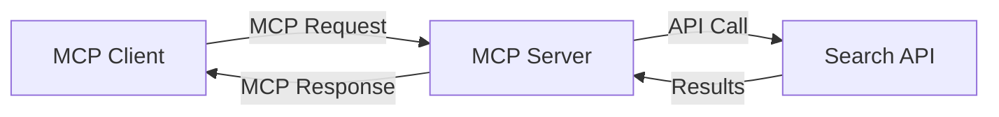
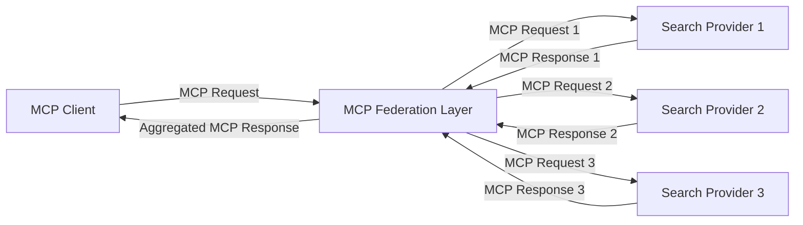
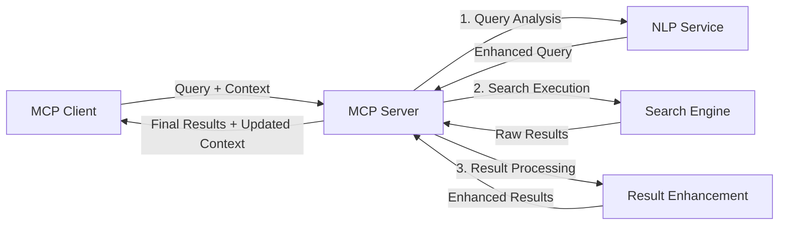

<!--
CO_OP_TRANSLATOR_METADATA:
{
  "original_hash": "eb12652eb7bd17f2193b835a344425c6",
  "translation_date": "2025-06-26T13:54:23+00:00",
  "source_file": "05-AdvancedTopics/mcp-realtimesearch/README.md",
  "language_code": "pa"
}
-->
## ਕੋਡ ਉਦਾਹਰਨਾਂ ਲਈ ਅਸਵੀਕਾਰ

> **ਮਹੱਤਵਪੂਰਣ ਨੋਟ**: ਹੇਠਾਂ ਦਿੱਤੀਆਂ ਕੋਡ ਉਦਾਹਰਨਾਂ ਵਿੱਚ Model Context Protocol (MCP) ਨੂੰ ਵੈੱਬ ਖੋਜ ਕਾਰਜਕੁਸ਼ਲਤਾ ਨਾਲ ਜੋੜਨ ਦਾ ਪ੍ਰਦਰਸ਼ਨ ਕੀਤਾ ਗਿਆ ਹੈ। ਜਦੋਂ ਕਿ ਇਹ ਅਧਿਕਾਰਤ MCP SDKs ਦੇ ਪੈਟਰਨ ਅਤੇ ਢਾਂਚਿਆਂ ਦੀ ਪਾਲਣਾ ਕਰਦੀਆਂ ਹਨ, ਪਰ ਇਹ ਸਿੱਖਿਆ ਦੇ ਉਦੇਸ਼ਾਂ ਲਈ ਸਧਾਰਣ ਕੀਤੀਆਂ ਗਈਆਂ ਹਨ।  
>  
> ਇਹ ਉਦਾਹਰਨਾਂ ਦਰਸਾਉਂਦੀਆਂ ਹਨ:  
>  
> 1. **ਪਾਇਥਨ ਇੰਪਲੀਮੈਂਟੇਸ਼ਨ**: ਇੱਕ FastMCP ਸਰਵਰ ਇੰਪਲੀਮੈਂਟੇਸ਼ਨ ਜੋ ਵੈੱਬ ਖੋਜ ਟੂਲ ਪ੍ਰਦਾਨ ਕਰਦਾ ਹੈ ਅਤੇ ਬਾਹਰੀ ਖੋਜ API ਨਾਲ ਜੁੜਦਾ ਹੈ। ਇਹ ਉਦਾਹਰਨ ਜੀਵਨਕਾਲ ਪ੍ਰਬੰਧਨ, ਸੰਦਰਭ ਸੰਭਾਲ ਅਤੇ ਟੂਲ ਇੰਪਲੀਮੈਂਟੇਸ਼ਨ ਨੂੰ ਸਹੀ ਢੰਗ ਨਾਲ ਦਰਸਾਉਂਦੀ ਹੈ, ਜੋ [ਅਧਿਕਾਰਤ MCP ਪਾਇਥਨ SDK](https://github.com/modelcontextprotocol/python-sdk) ਦੇ ਪੈਟਰਨਾਂ ਦੀ ਪਾਲਣਾ ਕਰਦੀ ਹੈ। ਸਰਵਰ ਸਿਫਾਰਸ਼ੀ Streamable HTTP ਟ੍ਰਾਂਸਪੋਰਟ ਦੀ ਵਰਤੋਂ ਕਰਦਾ ਹੈ ਜੋ ਪੁਰਾਣੇ SSE ਟ੍ਰਾਂਸਪੋਰਟ ਦੀ ਥਾਂ ਲੈ ਚੁੱਕਾ ਹੈ।  
>  
> 2. **ਜਾਵਾਸਕ੍ਰਿਪਟ ਇੰਪਲੀਮੈਂਟੇਸ਼ਨ**: ਇੱਕ TypeScript/JavaScript ਇੰਪਲੀਮੈਂਟੇਸ਼ਨ ਜੋ FastMCP ਪੈਟਰਨ ਦੀ ਵਰਤੋਂ ਕਰਦਾ ਹੈ, [ਅਧਿਕਾਰਤ MCP TypeScript SDK](https://github.com/modelcontextprotocol/typescript-sdk) ਤੋਂ ਲਿਆ ਗਿਆ, ਜਿਸ ਨਾਲ ਸਹੀ ਟੂਲ ਪਰਿਭਾਸ਼ਾਵਾਂ ਅਤੇ ਕਲਾਇੰਟ ਕਨੈਕਸ਼ਨਾਂ ਵਾਲਾ ਖੋਜ ਸਰਵਰ ਬਣਾਇਆ ਜਾਂਦਾ ਹੈ। ਇਹ ਸੈਸ਼ਨ ਪ੍ਰਬੰਧਨ ਅਤੇ ਸੰਦਰਭ ਸੁਰੱਖਿਆ ਲਈ ਨਵੇਂ ਸਿਫਾਰਸ਼ੀ ਪੈਟਰਨਾਂ ਦੀ ਪਾਲਣਾ ਕਰਦਾ ਹੈ।  
>  
> ਇਹ ਉਦਾਹਰਨਾਂ ਉਤਪਾਦਨ ਵਰਤੋਂ ਲਈ ਵਾਧੂ ਤਰੁੱਟੀ ਸੰਭਾਲ, ਪ੍ਰਮਾਣੀਕਰਨ ਅਤੇ ਵਿਸ਼ੇਸ਼ API ਇੰਟੀਗ੍ਰੇਸ਼ਨ ਕੋਡ ਦੀ ਮੰਗ ਕਰਦੀਆਂ ਹਨ। ਖੋਜ API ਐਂਡਪੌਇੰਟ (`https://api.search-service.example/search`) ਸਿਰਫ ਨਮੂਨੇ ਹਨ ਅਤੇ ਅਸਲੀ ਖੋਜ ਸੇਵਾ ਐਂਡਪੌਇੰਟ ਨਾਲ ਬਦਲਣੇ ਜਰੂਰੀ ਹਨ।  
>  
> ਪੂਰੀ ਇੰਪਲੀਮੈਂਟੇਸ਼ਨ ਵੇਰਵੇ ਅਤੇ ਸਭ ਤੋਂ ਅੱਪ-ਟੂ-ਡੇਟ ਤਰੀਕੇ ਲਈ, ਕਿਰਪਾ ਕਰਕੇ [ਅਧਿਕਾਰਤ MCP ਵਿਸ਼ੇਸ਼ਤਾ](https://spec.modelcontextprotocol.io/) ਅਤੇ SDK ਦਸਤਾਵੇਜ਼ਾਂ ਨੂੰ ਵੇਖੋ।  

## ਮੁੱਖ ਧਾਰਨਾਵਾਂ

### Model Context Protocol (MCP) ਫਰੇਮਵਰਕ

ਆਧਾਰ ਵਿੱਚ, Model Context Protocol AI ਮਾਡਲਾਂ, ਐਪਲੀਕੇਸ਼ਨਾਂ ਅਤੇ ਸੇਵਾਵਾਂ ਲਈ ਸੰਦਰਭ ਸਾਂਝਾ ਕਰਨ ਦਾ ਇੱਕ ਮਿਆਰੀ ਤਰੀਕਾ ਪ੍ਰਦਾਨ ਕਰਦਾ ਹੈ। ਰੀਅਲ-ਟਾਈਮ ਵੈੱਬ ਖੋਜ ਵਿੱਚ, ਇਹ ਫਰੇਮਵਰਕ ਸੰਗਠਿਤ, ਬਹੁ-ਚਰਣ ਖੋਜ ਅਨੁਭਵ ਬਣਾਉਣ ਲਈ ਜਰੂਰੀ ਹੈ। ਮੁੱਖ ਘਟਕਾਂ ਵਿੱਚ ਸ਼ਾਮਿਲ ਹਨ:  

1. **ਕਲਾਇੰਟ-ਸਰਵਰ ਆਰਕੀਟੈਕਚਰ**: MCP ਖੋਜ ਕਲਾਇੰਟਾਂ (ਬੇਨਤੀ ਕਰਨ ਵਾਲੇ) ਅਤੇ ਖੋਜ ਸਰਵਰਾਂ (ਪ੍ਰਦਾਤਾ) ਵਿਚ ਸਾਫ਼ ਵੰਡ ਬਣਾਉਂਦਾ ਹੈ, ਜਿਸ ਨਾਲ ਲਚਕੀਲਾ ਡਿਪਲੋਇਮੈਂਟ ਮਾਡਲ ਸੰਭਵ ਹੁੰਦਾ ਹੈ।  

2. **JSON-RPC ਸੰਚਾਰ**: ਪ੍ਰੋਟੋਕੋਲ ਸੁਨੇਹੇ ਆਦਾਨ-ਪ੍ਰਦਾਨ ਲਈ JSON-RPC ਦੀ ਵਰਤੋਂ ਕਰਦਾ ਹੈ, ਜੋ ਵੈੱਬ ਤਕਨਾਲੋਜੀਆਂ ਨਾਲ ਅਨੁਕੂਲ ਅਤੇ ਵੱਖ-ਵੱਖ ਪਲੇਟਫਾਰਮਾਂ 'ਤੇ ਆਸਾਨੀ ਨਾਲ ਲਾਗੂ ਹੋ ਸਕਦਾ ਹੈ।  

3. **ਸੰਦਰਭ ਪ੍ਰਬੰਧਨ**: MCP ਬਹੁ-ਇੰਟਰੈਕਸ਼ਨਾਂ ਵਿੱਚ ਖੋਜ ਸੰਦਰਭ ਨੂੰ ਬਣਾਈ ਰੱਖਣ, ਅਪਡੇਟ ਕਰਨ ਅਤੇ ਵਰਤਣ ਲਈ ਸੰਗਠਿਤ ਤਰੀਕੇ ਪਰਿਭਾਸ਼ਿਤ ਕਰਦਾ ਹੈ।  

4. **ਟੂਲ ਪਰਿਭਾਸ਼ਾਵਾਂ**: ਖੋਜ ਸਮਰੱਥਾਵਾਂ ਨੂੰ ਮਿਆਰੀ ਟੂਲਾਂ ਵਜੋਂ ਪ੍ਰਗਟ ਕੀਤਾ ਜਾਂਦਾ ਹੈ ਜਿਨ੍ਹਾਂ ਦੇ ਪਰੈਮੀਟਰ ਅਤੇ ਵਾਪਸੀ ਮੁੱਲ ਸਪਸ਼ਟ ਹੁੰਦੇ ਹਨ।  

5. **ਸਟ੍ਰੀਮਿੰਗ ਸਹਿਯੋਗ**: ਪ੍ਰੋਟੋਕੋਲ ਸਟ੍ਰੀਮਿੰਗ ਨਤੀਜੇ ਸਹਿਯੋਗ ਕਰਦਾ ਹੈ, ਜੋ ਰੀਅਲ-ਟਾਈਮ ਖੋਜ ਲਈ ਜਰੂਰੀ ਹੈ ਜਿੱਥੇ ਨਤੀਜੇ ਕ੍ਰਮਵਾਰ ਆ ਸਕਦੇ ਹਨ।  

### ਵੈੱਬ ਖੋਜ ਇੰਟੀਗ੍ਰੇਸ਼ਨ ਪੈਟਰਨ

ਜਦ MCP ਨੂੰ ਵੈੱਬ ਖੋਜ ਨਾਲ ਜੋੜਿਆ ਜਾਂਦਾ ਹੈ, ਕਈ ਪੈਟਰਨ ਨਜ਼ਰ ਆਉਂਦੇ ਹਨ:  

#### 1. ਸਿੱਧਾ ਖੋਜ ਪ੍ਰਦਾਤਾ ਇੰਟੀਗ੍ਰੇਸ਼ਨ

ਇਸ ਪੈਟਰਨ ਵਿੱਚ, MCP ਸਰਵਰ ਸਿੱਧਾ ਇੱਕ ਜਾਂ ਵੱਧ ਖੋਜ API ਨਾਲ ਇੰਟਰਫੇਸ ਕਰਦਾ ਹੈ, MCP ਬੇਨਤੀਆਂ ਨੂੰ API-ਵਿਸ਼ੇਸ਼ ਕਾਲਾਂ ਵਿੱਚ ਤਬਦੀਲ ਕਰਦਾ ਹੈ ਅਤੇ ਨਤੀਜੇ MCP ਜਵਾਬਾਂ ਵਜੋਂ ਫਾਰਮੈਟ ਕਰਦਾ ਹੈ।  

#### 2. ਸੰਦਰਭ ਸੁਰੱਖਿਆ ਨਾਲ ਫੈਡਰੇਟਿਡ ਖੋਜ

ਇਹ ਪੈਟਰਨ ਖੋਜ ਬੇਨਤੀਆਂ ਨੂੰ ਕਈ MCP-ਅਨੁਕੂਲ ਖੋਜ ਪ੍ਰਦਾਤਾਵਾਂ ਵਿੱਚ ਵੰਡਦਾ ਹੈ, ਜਿਹੜੇ ਵੱਖ-ਵੱਖ ਕਿਸਮਾਂ ਦੀ ਸਮੱਗਰੀ ਜਾਂ ਖੋਜ ਸਮਰੱਥਾਵਾਂ ਵਿੱਚ ਮਾਹਿਰ ਹੋ ਸਕਦੇ ਹਨ, ਅਤੇ ਇਕਜੁਟ ਸੰਦਰਭ ਬਣਾਈ ਰੱਖਦਾ ਹੈ।  

#### 3. ਸੰਦਰਭ-ਸੰਵਰਧਿਤ ਖੋਜ ਚੇਨ

ਇਸ ਪੈਟਰਨ ਵਿੱਚ, ਖੋਜ ਪ੍ਰਕਿਰਿਆ ਕਈ ਚਰਣਾਂ ਵਿੱਚ ਵੰਡਿਆ ਜਾਂਦਾ ਹੈ, ਜਿੱਥੇ ਹਰ ਕਦਮ ਤੇ ਸੰਦਰਭ ਨੂੰ ਸੰਵਰਧਿਤ ਕੀਤਾ ਜਾਂਦਾ ਹੈ, ਜਿਸ ਨਾਲ ਕ੍ਰਮਵਾਰ ਵੱਧ ਸੰਬੰਧਿਤ ਨਤੀਜੇ ਮਿਲਦੇ ਹਨ।  

### ਖੋਜ ਸੰਦਰਭ ਘਟਕ

MCP-ਆਧਾਰਿਤ ਵੈੱਬ ਖੋਜ ਵਿੱਚ, ਸੰਦਰਭ ਆਮ ਤੌਰ 'ਤੇ ਸ਼ਾਮਿਲ ਹੁੰਦਾ ਹੈ:  

- **ਬੇਨਤੀ ਇਤਿਹਾਸ**: ਸੈਸ਼ਨ ਵਿੱਚ ਪਹਿਲਾਂ ਕੀਤੀਆਂ ਖੋਜਾਂ  
- **ਉਪਭੋਗਤਾ ਪਸੰਦਾਂ**: ਭਾਸ਼ਾ, ਖੇਤਰ, ਸੇਫ ਸર્ચ ਸੈਟਿੰਗਜ਼  
- **ਇੰਟਰੈਕਸ਼ਨ ਇਤਿਹਾਸ**: ਕਿਹੜੇ ਨਤੀਜੇ ਕਲਿੱਕ ਕੀਤੇ ਗਏ, ਨਤੀਜਿਆਂ 'ਤੇ ਕਿਤਨਾ ਸਮਾਂ ਲੱਗਾ  
- **ਖੋਜ ਪਰੈਮੀਟਰ**: ਫਿਲਟਰ, ਸੌਰਟ ਆਰਡਰ ਅਤੇ ਹੋਰ ਖੋਜ ਸੋਧਕ  
- **ਡੋਮੇਨ ਗਿਆਨ**: ਖੋਜ ਲਈ ਸੰਬੰਧਿਤ ਵਿਸ਼ੇਸ਼ ਸੰਦਰਭ  
- **ਕਾਲਕ ਸੰਦਰਭ**: ਸਮੇਂ-ਅਧਾਰਿਤ ਪ੍ਰਸੰਗਿਕਤਾ ਕਾਰਕ  
- **ਸਰੋਤ ਪਸੰਦਾਂ**: ਭਰੋਸੇਯੋਗ ਜਾਂ ਪ੍ਰਿਯ ਜਾਣਕਾਰੀ ਸਰੋਤ  

## ਵਰਤੋਂ ਦੇ ਕੇਸ ਅਤੇ ਐਪਲੀਕੇਸ਼ਨ

### ਖੋਜ ਅਤੇ ਜਾਣਕਾਰੀ ਇਕੱਠਾ ਕਰਨਾ

MCP ਖੋਜ ਕਾਰਜਪ੍ਰਵਾਹਾਂ ਨੂੰ ਸੁਧਾਰਦਾ ਹੈ:  

- ਖੋਜ ਸੈਸ਼ਨਾਂ ਵਿੱਚ ਖੋਜ ਸੰਦਰਭ ਸੰਭਾਲਣਾ  
- ਵੱਧ ਸੁਧਰੇ ਅਤੇ ਸੰਦਰਭ ਅਨੁਕੂਲ ਬੇਨਤੀਆਂ ਨੂੰ ਸਮਰਥਨ ਦੇਣਾ  
- ਬਹੁ-ਸਰੋਤ ਖੋਜ ਫੈਡਰੇਸ਼ਨ ਦਾ ਸਮਰਥਨ  
- ਖੋਜ ਨਤੀਜਿਆਂ ਤੋਂ ਗਿਆਨ ਨਿਕਾਸ਼ ਕਰਨ ਵਿੱਚ ਸਹਾਇਤਾ  

### ਰੀਅਲ-ਟਾਈਮ ਖ਼ਬਰਾਂ ਅਤੇ ਰੁਝਾਨ ਨਿਗਰਾਨੀ

MCP-ਸੰਚਾਲਿਤ ਖੋਜ ਖ਼ਬਰਾਂ ਦੀ ਨਿਗਰਾਨੀ ਲਈ ਫਾਇਦੇ ਦਿੰਦਾ ਹੈ:  

- ਉਭਰ ਰਹੀਆਂ ਖ਼ਬਰਾਂ ਦੀ ਲਗਭਗ ਤੁਰੰਤ ਖੋਜ  
- ਸੰਬੰਧਿਤ ਜਾਣਕਾਰੀ ਦਾ ਸੰਦਰਭ ਅਧਾਰਿਤ ਛਾਣ-ਬੀਣ  
- ਕਈ ਸਰੋਤਾਂ 'ਤੇ ਵਿਸ਼ੇ ਅਤੇ ਇਕਾਈ ਟ੍ਰੈਕਿੰਗ  
- ਉਪਭੋਗਤਾ ਸੰਦਰਭ ਅਨੁਸਾਰ ਨਿੱਜੀ ਖ਼ਬਰਾਂ ਦੀ ਸੂਚਨਾ  

### AI-ਸਹਾਇਤ ਬ੍ਰਾਊਜ਼ਿੰਗ ਅਤੇ ਖੋਜ

MCP AI-ਸਹਾਇਤ ਬ੍ਰਾਊਜ਼ਿੰਗ ਲਈ ਨਵੇਂ ਮੌਕੇ ਪੈਦਾ ਕਰਦਾ ਹੈ:  

- ਮੌਜੂਦਾ ਬ੍ਰਾਊਜ਼ਰ ਗਤੀਵਿਧੀ ਦੇ ਅਧਾਰ 'ਤੇ ਸੰਦਰਭ ਅਨੁਕੂਲ ਖੋਜ ਸੁਝਾਅ  
- ਵੈੱਬ ਖੋਜ ਅਤੇ LLM-ਸੰਚਾਲਿਤ ਸਹਾਇਕਾਂ ਦਾ ਬਿਨਾ ਰੁਕਾਵਟ ਇੰਟੀਗ੍ਰੇਸ਼ਨ  
- ਬਹੁ-ਚਰਣ ਖੋਜ ਸੁਧਾਰ ਜਿਸ ਵਿੱਚ ਸੰਦਰਭ ਬਣਾਇਆ ਰੱਖਿਆ ਜਾਂਦਾ ਹੈ  
- ਵਧੀਆ ਤੱਥ-ਜਾਂਚ ਅਤੇ ਜਾਣਕਾਰੀ ਪੁਸ਼ਟੀ  

## ਭਵਿੱਖ ਦੇ ਰੁਝਾਨ ਅਤੇ ਨਵੀਨਤਾ

### ਵੈੱਬ ਖੋਜ ਵਿੱਚ MCP ਦਾ ਵਿਕਾਸ

ਅੱਗੇ ਵੇਖਦਿਆਂ, ਅਸੀਂ MCP ਨੂੰ ਇਹਨਾਂ ਮਾਮਲਿਆਂ ਵਿੱਚ ਵਿਕਸਤ ਹੁੰਦਾ ਦੇਖਦੇ ਹਾਂ:  

- **ਬਹੁ-ਮਾਡਲ ਖੋਜ**: ਲਿਖਤੀ, ਚਿੱਤਰ, ਆਡੀਓ ਅਤੇ ਵੀਡੀਓ ਖੋਜ ਨੂੰ ਸੰਦਰਭ ਸੁਰੱਖਿਆ ਨਾਲ ਜੋੜਨਾ  
- **ਵਿਕੇਂਦ੍ਰਿਤ ਖੋਜ**: ਵੰਡੇ ਅਤੇ ਫੈਡਰੇਟਿਡ ਖੋਜ ਪਰਿਸ਼ਰਾਂ ਦਾ ਸਮਰਥਨ  
- **ਖੋਜ ਗੋਪਨੀਯਤਾ**: ਸੰਦਰਭ-ਅਨੁਕੂਲ ਗੋਪਨੀਯਤਾ-ਸੁਰੱਖਿਅਤ ਖੋਜ ਮਕੈਨਿਜ਼ਮ  
- **ਬੇਨਤੀ ਸਮਝਦਾਰੀ**: ਕੁਦਰਤੀ ਭਾਸ਼ਾ ਖੋਜ ਬੇਨਤੀਆਂ ਦੀ ਡੂੰਘੀ ਅਰਥ-ਵਿਸ਼ਲੇਸ਼ਣ  

### ਤਕਨਾਲੋਜੀ ਵਿੱਚ ਸੰਭਾਵਿਤ ਉੱਨਤੀ

ਭਵਿੱਖ ਦੇ MCP ਖੋਜ ਲਈ ਬਣਨ ਵਾਲੀਆਂ ਤਕਨਾਲੋਜੀਆਂ:  

1. **ਨਿਊਰਲ ਖੋਜ ਆਰਕੀਟੈਕਚਰ**: MCP ਲਈ ਅਨੁਕੂਲਿਤ ਐਮਬੈਡਿੰਗ-ਆਧਾਰਿਤ ਖੋਜ ਪ੍ਰਣਾਲੀਆਂ  
2. **ਨਿੱਜੀਕ੍ਰਿਤ ਖੋਜ ਸੰਦਰਭ**: ਵੱਖ-ਵੱਖ ਉਪਭੋਗਤਾਵਾਂ ਦੇ ਖੋਜ ਰੁਝਾਨਾਂ ਦਾ ਸਿੱਖਣਾ  
3. **ਨੋਲੇਜ ਗ੍ਰਾਫ ਇੰਟੀਗ੍ਰੇਸ਼ਨ**: ਖੋਜ ਵਿੱਚ ਵਿਸ਼ੇਸ਼ ਡੋਮੇਨ ਗਿਆਨ ਗ੍ਰਾਫ ਨਾਲ ਸੰਵਰਧਨ  
4. **ਕ੍ਰਾਸ-ਮਾਡਲ ਸੰਦਰਭ**: ਵੱਖ-ਵੱਖ ਖੋਜ ਮਾਡਾਲਿਟੀਆਂ ਵਿੱਚ ਸੰਦਰਭ ਬਣਾਈ ਰੱਖਣਾ  

## ਹੱਥ-ਅਨੁਭਵ ਅਭਿਆਸ

### ਅਭਿਆਸ 1: ਇੱਕ ਬੁਨਿਆਦੀ MCP ਖੋਜ ਪਾਈਪਲਾਈਨ ਸੈੱਟਅਪ ਕਰਨਾ

ਇਸ ਅਭਿਆਸ ਵਿੱਚ ਤੁਸੀਂ ਸਿੱਖੋਗੇ ਕਿ:  
- ਇੱਕ ਬੁਨਿਆਦੀ MCP ਖੋਜ ਵਾਤਾਵਰਣ ਕਿਵੇਂ ਸੰਰਚਿਤ ਕਰਨਾ ਹੈ  
- ਵੈੱਬ ਖੋਜ ਲਈ ਸੰਦਰਭ ਹੈਂਡਲਰ ਕਿਵੇਂ ਲਾਗੂ ਕਰਨੇ ਹਨ  
- ਖੋਜ ਚਰਣਾਂ ਵਿੱਚ ਸੰਦਰਭ ਸੁਰੱਖਿਆ ਦੀ ਜਾਂਚ ਅਤੇ ਪ੍ਰਮਾਣੀਕਰਨ ਕਿਵੇਂ ਕਰਨਾ ਹੈ  

### ਅਭਿਆਸ 2: MCP ਖੋਜ ਨਾਲ ਖੋਜ ਸਹਾਇਕ ਬਣਾਉਣਾ

ਇੱਕ ਪੂਰੀ ਐਪਲੀਕੇਸ਼ਨ ਬਣਾਓ ਜੋ:  
- ਕੁਦਰਤੀ ਭਾਸ਼ਾ ਵਿੱਚ ਖੋਜ ਸਵਾਲ ਪ੍ਰਕਿਰਿਆ ਕਰਦੀ ਹੈ  
- ਸੰਦਰਭ-ਅਨੁਕੂਲ ਵੈੱਬ ਖੋਜ ਕਰਦੀ ਹੈ  
- ਕਈ ਸਰੋਤਾਂ ਤੋਂ ਜਾਣਕਾਰੀ ਸਿੰਥੇਸਾਈਜ਼ ਕਰਦੀ ਹੈ  
- ਵਿਵਸਥਿਤ ਖੋਜ ਨਤੀਜੇ ਪੇਸ਼ ਕਰਦੀ ਹੈ  

### ਅਭਿਆਸ 3: MCP ਨਾਲ ਬਹੁ-ਸਰੋਤ ਖੋਜ ਫੈਡਰੇਸ਼ਨ ਲਾਗੂ ਕਰਨਾ

ਉੱਚ ਸਤਰ ਦਾ ਅਭਿਆਸ ਜੋ ਸ਼ਾਮਿਲ ਕਰਦਾ ਹੈ:  
- ਬਹੁ-ਖੋਜ ਇੰਜਨਾਂ ਨੂੰ ਸੰਦਰਭ-ਅਨੁਕੂਲ ਬੇਨਤੀ ਭੇਜਣਾ  
- ਨਤੀਜਿਆਂ ਦੀ ਰੈਂਕਿੰਗ ਅਤੇ ਏਗਰੀਗੇਸ਼ਨ  
- ਖੋਜ ਨਤੀਜਿਆਂ ਦੀ ਸੰਦਰਭ ਅਧਾਰਿਤ ਦੁਹਰਾਈ ਦੂਰ ਕਰਨਾ  
- ਸਰੋਤ-ਵਿਸ਼ੇਸ਼ ਮੈਟਾਡੇਟਾ ਦਾ ਸੰਭਾਲ  

## ਵਾਧੂ ਸਰੋਤ

- [Model Context Protocol Specification](https://spec.modelcontextprotocol.io/) - ਅਧਿਕਾਰਤ MCP ਵਿਸ਼ੇਸ਼ਤਾ ਅਤੇ ਵਿਸਥਾਰਿਤ ਪ੍ਰੋਟੋਕੋਲ ਦਸਤਾਵੇਜ਼  
- [Model Context Protocol Documentation](https://modelcontextprotocol.io/) - ਵਿਸਥਾਰਿਤ ਟਿਊਟੋਰਿਅਲ ਅਤੇ ਇੰਪਲੀਮੈਂਟੇਸ਼ਨ ਗਾਈਡ  
- [MCP Python SDK](https://github.com/modelcontextprotocol/python-sdk) - MCP ਪ੍ਰੋਟੋਕੋਲ ਦੀ ਅਧਿਕਾਰਤ ਪਾਇਥਨ ਇੰਪਲੀਮੈਂਟੇਸ਼ਨ  
- [MCP TypeScript SDK](https://github.com/modelcontextprotocol/typescript-sdk) - MCP ਪ੍ਰੋਟੋਕੋਲ ਦੀ ਅਧਿਕਾਰਤ TypeScript ਇੰਪਲੀਮੈਂਟੇਸ਼ਨ  
- [MCP Reference Servers](https://github.com/modelcontextprotocol/servers) - MCP ਸਰਵਰਾਂ ਦੀ ਰੈਫਰੈਂਸ ਇੰਪਲੀਮੈਂਟੇਸ਼ਨ  
- [Bing Web Search API Documentation](https://learn.microsoft.com/en-us/bing/search-apis/bing-web-search/overview) - ਮਾਇਕਰੋਸੌਫਟ ਦਾ ਵੈੱਬ ਖੋਜ API  
- [Google Custom Search JSON API](https://developers.google.com/custom-search/v1/overview) - ਗੂਗਲ ਦਾ ਪ੍ਰੋਗ੍ਰਾਮੇਬਲ ਖੋਜ ਇੰਜਨ  
- [SerpAPI Documentation](https://serpapi.com/search-api) - ਖੋਜ ਇੰਜਨ ਨਤੀਜੇ ਪੰਨਾ API  
- [Meilisearch Documentation](https://www.meilisearch.com/docs) - ਖੁੱਲ੍ਹਾ ਸਰੋਤ ਖੋਜ ਇੰਜਨ  
- [Elasticsearch Documentation](https://www.elastic.co/guide/index.html) - ਵੰਡਿਆ ਹੋਇਆ ਖੋਜ ਅਤੇ ਵਿਸ਼ਲੇਸ਼ਣ ਇੰਜਨ  
- [LangChain Documentation](https://python.langchain.com/docs/get_started/introduction) - LLM ਨਾਲ ਐਪਲੀਕੇਸ਼ਨਾਂ ਬਣਾਉਣਾ  

## ਸਿੱਖਣ ਦੇ ਨਤੀਜੇ

ਇਸ ਮੋਡੀਊਲ ਨੂੰ ਪੂਰਾ ਕਰਨ ਤੋਂ ਬਾਅਦ, ਤੁਸੀਂ ਸਮਝ ਸਕੋਗੇ:  

- ਰੀਅਲ-ਟਾਈਮ ਵੈੱਬ ਖੋਜ ਦੀਆਂ ਬੁਨਿਆਦੀਆਂ ਅਤੇ ਇਸ ਦੇ ਚੁਣੌਤੀਆਂ  
- Model Context Protocol (MCP) ਕਿਵੇਂ ਰੀਅਲ-ਟਾਈਮ ਵੈੱਬ ਖੋਜ ਸਮਰੱਥਾਵਾਂ ਨੂੰ ਵਧਾਉਂਦਾ ਹੈ  
- ਲੋਕਪ੍ਰਿਯ ਫਰੇਮਵਰਕਾਂ ਅਤੇ API ਦੀ ਵਰਤੋਂ ਕਰਕੇ MCP-ਆਧਾਰਿਤ ਖੋਜ ਹੱਲ ਲਾਗੂ ਕਰਨਾ  
- MCP ਨਾਲ ਸਕੇਲਯੋਗ ਅਤੇ ਉੱਚ-ਕਾਰਗਰ ਖੋਜ ਆਰਕੀਟੈਕਚਰ ਡਿਜ਼ਾਈਨ ਅਤੇ ਡਿਪਲੋਇ ਕਰਨਾ  
- MCP ਧਾਰਨਾਵਾਂ ਨੂੰ ਵੱਖ-ਵੱਖ ਵਰਤੋਂ ਕੇਸਾਂ ਵਿੱਚ ਲਾਗੂ ਕਰਨਾ ਜਿਵੇਂ ਕਿ ਸੈਮੈਂਟਿਕ ਖੋਜ, ਖੋਜ ਸਹਾਇਤਾ ਅਤੇ AI-ਸਹਾਇਤ ਬ੍ਰਾਊਜ਼ਿੰਗ  
- MCP-ਆਧਾਰਿਤ ਖੋਜ ਤਕਨਾਲੋਜੀਆਂ ਵਿੱਚ ਉਭਰ ਰਹੇ ਰੁਝਾਨ ਅਤੇ ਭਵਿੱਖੀ ਨਵੀਨਤਾਵਾਂ ਦਾ ਮੁਲਾਂਕਣ  

### ਭਰੋਸਾ ਅਤੇ ਸੁਰੱਖਿਆ ਸੰਬੰਧੀ ਵਿਚਾਰ

ਜਦ MCP-ਆਧਾਰਿਤ ਵੈੱਬ ਖੋਜ ਹੱਲ ਲਾਗੂ ਕਰ ਰਹੇ ਹੋ, ਤਾਂ MCP ਵਿਸ਼ੇਸ਼ਤਾ ਵਿੱਚ ਦਿੱਤੀਆਂ ਇਹਨਾਂ ਮਹੱਤਵਪੂਰਣ ਸਿਧਾਂਤਾਂ ਨੂੰ ਯਾਦ ਰੱਖੋ:  

1. **

**ਅਸਵੀਕਾਰੋਪੱਤਰ**:  
ਇਹ ਦਸਤਾਵੇਜ਼ ਏਆਈ ਅਨੁਵਾਦ ਸੇਵਾ [Co-op Translator](https://github.com/Azure/co-op-translator) ਦੀ ਵਰਤੋਂ ਕਰਕੇ ਅਨੁਵਾਦਿਤ ਕੀਤਾ ਗਿਆ ਹੈ। ਜਦੋਂ ਕਿ ਅਸੀਂ ਸਹੀਤਾ ਲਈ ਕੋਸ਼ਿਸ਼ ਕਰਦੇ ਹਾਂ, ਕਿਰਪਾ ਕਰਕੇ ਜਾਣੋ ਕਿ ਸਵੈਚਾਲਿਤ ਅਨੁਵਾਦਾਂ ਵਿੱਚ ਗਲਤੀਆਂ ਜਾਂ ਅਸਮਰਥਤਾਵਾਂ ਹੋ ਸਕਦੀਆਂ ਹਨ। ਮੂਲ ਦਸਤਾਵੇਜ਼ ਆਪਣੀ ਮੂਲ ਭਾਸ਼ਾ ਵਿੱਚ ਪ੍ਰਮਾਣਿਕ ਸਰੋਤ ਮੰਨਿਆ ਜਾਣਾ ਚਾਹੀਦਾ ਹੈ। ਜਰੂਰੀ ਜਾਣਕਾਰੀ ਲਈ, ਪੇਸ਼ੇਵਰ ਮਨੁੱਖੀ ਅਨੁਵਾਦ ਦੀ ਸਿਫਾਰਿਸ਼ ਕੀਤੀ ਜਾਂਦੀ ਹੈ। ਇਸ ਅਨੁਵਾਦ ਦੇ ਉਪਯੋਗ ਤੋਂ ਉਤਪੰਨ ਕਿਸੇ ਵੀ ਗਲਤਫਹਿਮੀ ਜਾਂ ਗਲਤ ਵਿਆਖਿਆ ਲਈ ਅਸੀਂ ਜ਼ਿੰਮੇਵਾਰ ਨਹੀਂ ਹਾਂ।