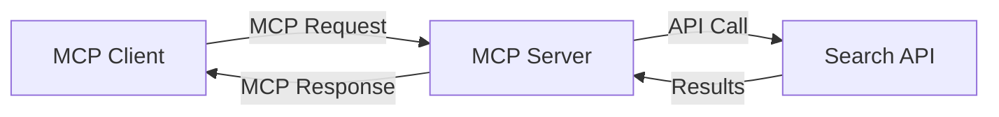
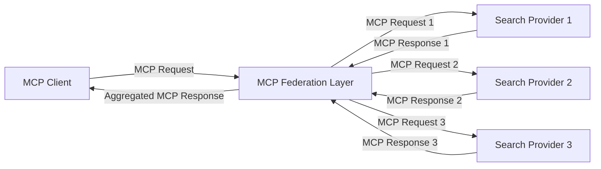
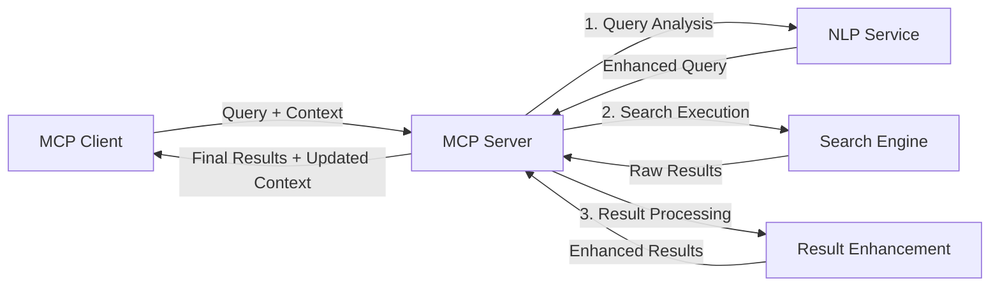

<!--
CO_OP_TRANSLATOR_METADATA:
{
  "original_hash": "16bef2c93c6a86d4ca6a8ce9e120e384",
  "translation_date": "2025-06-13T02:42:41+00:00",
  "source_file": "05-AdvancedTopics/mcp-realtimesearch/README.md",
  "language_code": "pa"
}
-->
## ਕੋਡ ਉਦਾਹਰਨਾਂ ਲਈ ਅਸਵੀਕਾਰੋ

> **ਮਹੱਤਵਪੂਰਨ ਨੋਟ**: ਹੇਠਾਂ ਦਿੱਤੀਆਂ ਕੋਡ ਉਦਾਹਰਨਾਂ Model Context Protocol (MCP) ਨੂੰ ਵੈੱਬ ਖੋਜ ਫੰਕਸ਼ਨਾਲਿਟੀ ਨਾਲ ਜੋੜਨ ਦਾ ਪ੍ਰਦਰਸ਼ਨ ਕਰਦੀਆਂ ਹਨ। ਜਦੋਂ ਕਿ ਇਹ ਅਧਿਕਾਰਿਕ MCP SDK ਦੇ ਪੈਟਰਨਾਂ ਅਤੇ ਢਾਂਚਿਆਂ ਦੀ ਪਾਲਣਾ ਕਰਦੀਆਂ ਹਨ, ਇਹ ਸਿੱਖਣ ਲਈ ਸਧਾਰਣ ਕੀਤੀਆਂ ਗਈਆਂ ਹਨ।
> 
> ਇਹ ਉਦਾਹਰਨਾਂ ਦਰਸਾਉਂਦੀਆਂ ਹਨ:
> 
> 1. **Python ਇੰਪਲੀਮੈਂਟੇਸ਼ਨ**: ਇੱਕ FastMCP ਸਰਵਰ ਇੰਪਲੀਮੈਂਟੇਸ਼ਨ ਜੋ ਵੈੱਬ ਖੋਜ ਟੂਲ ਪ੍ਰਦਾਨ ਕਰਦਾ ਹੈ ਅਤੇ ਬਾਹਰੀ ਖੋਜ API ਨਾਲ ਜੁੜਦਾ ਹੈ। ਇਹ ਉਦਾਹਰਨ ਜੀਵਨਕਾਲ ਪ੍ਰਬੰਧਨ, ਸੰਦਰਭ ਹੈਂਡਲਿੰਗ ਅਤੇ ਟੂਲ ਇੰਪਲੀਮੈਂਟੇਸ਼ਨ ਨੂੰ [ਅਧਿਕਾਰਿਕ MCP Python SDK](https://github.com/modelcontextprotocol/python-sdk) ਦੇ ਪੈਟਰਨਾਂ ਦੇ ਅਨੁਸਾਰ ਦਰਸਾਉਂਦੀ ਹੈ। ਸਰਵਰ Streamable HTTP ਟਰਾਂਸਪੋਰਟ ਦੀ ਸਿਫਾਰਸ਼ ਕਰਦਾ ਹੈ ਜੋ ਉਤਪਾਦਨ ਡਿਪਲੋਇਮੈਂਟ ਲਈ ਪੁਰਾਣੇ SSE ਟਰਾਂਸਪੋਰਟ ਦੀ ਥਾਂ ਲੈ ਚੁੱਕਾ ਹੈ।
> 
> 2. **JavaScript ਇੰਪਲੀਮੈਂਟੇਸ਼ਨ**: TypeScript/JavaScript ਇੰਪਲੀਮੈਂਟੇਸ਼ਨ ਜੋ [ਅਧਿਕਾਰਿਕ MCP TypeScript SDK](https://github.com/modelcontextprotocol/typescript-sdk) ਦੇ FastMCP ਪੈਟਰਨ ਦੀ ਵਰਤੋਂ ਕਰਦੀ ਹੈ, ਖੋਜ ਸਰਵਰ ਬਣਾਉਣ ਲਈ ਸਹੀ ਟੂਲ ਪਰਿਭਾਸ਼ਾਵਾਂ ਅਤੇ ਕਲਾਇੰਟ ਕਨੈਕਸ਼ਨਾਂ ਨਾਲ। ਇਹ ਸੈਸ਼ਨ ਪ੍ਰਬੰਧਨ ਅਤੇ ਸੰਦਰਭ ਸੰਰੱਖਣ ਲਈ ਨਵੀਂ ਸਿਫਾਰਸ਼ ਕੀਤੀਆਂ ਪ੍ਰਣਾਲੀਆਂ ਦੀ ਪਾਲਣਾ ਕਰਦਾ ਹੈ।
> 
> ਇਹ ਉਦਾਹਰਨਾਂ ਉਤਪਾਦਨ ਲਈ ਵਧੇਰੇ ਏਰਰ ਹੈਂਡਲਿੰਗ, ਪ੍ਰਮਾਣਿਕਤਾ ਅਤੇ ਵਿਸ਼ੇਸ਼ API ਇੰਟੀਗ੍ਰੇਸ਼ਨ ਕੋਡ ਦੀ ਲੋੜ ਪੈ ਸਕਦੀ ਹੈ। ਦਿਖਾਏ ਗਏ ਖੋਜ API ਐਂਡਪੌਇੰਟ (`https://api.search-service.example/search`) ਨਮੂਨੇ ਹਨ ਅਤੇ ਅਸਲੀ ਖੋਜ ਸੇਵਾ ਦੇ ਐਂਡਪੌਇੰਟ ਨਾਲ ਬਦਲਣ ਦੀ ਜ਼ਰੂਰਤ ਹੋਵੇਗੀ।
> 
> ਪੂਰੀ ਇੰਪਲੀਮੈਂਟੇਸ਼ਨ ਵੇਰਵੇ ਅਤੇ ਸਭ ਤੋਂ ਅੱਪ-ਟੂ-ਡੇਟ ਤਰੀਕਿਆਂ ਲਈ, ਕਿਰਪਾ ਕਰਕੇ [ਅਧਿਕਾਰਿਕ MCP ਵਿਸ਼ੇਸ਼ਤਾ](https://spec.modelcontextprotocol.io/) ਅਤੇ SDK ਦਸਤਾਵੇਜ਼ਾਂ ਨੂੰ ਵੇਖੋ।

## ਮੁੱਖ ਧਾਰਾਵਾਂ

### Model Context Protocol (MCP) ਫਰੇਮਵਰਕ

ਆਧਾਰ ਤੇ, Model Context Protocol AI ਮਾਡਲਾਂ, ਐਪਲੀਕੇਸ਼ਨਾਂ ਅਤੇ ਸੇਵਾਵਾਂ ਲਈ ਸੰਦਰਭ ਸਾਂਝਾ ਕਰਨ ਦਾ ਇੱਕ ਮਿਆਰੀ ਤਰੀਕਾ ਪ੍ਰਦਾਨ ਕਰਦਾ ਹੈ। ਰੀਅਲ-ਟਾਈਮ ਵੈੱਬ ਖੋਜ ਵਿੱਚ, ਇਹ ਫਰੇਮਵਰਕ ਸੰਗਠਿਤ, ਬਹੁ-ਚਰਣ ਵਾਲੇ ਖੋਜ ਅਨੁਭਵ ਬਣਾਉਣ ਲਈ ਜ਼ਰੂਰੀ ਹੈ। ਮੁੱਖ ਘਟਕਾਂ ਵਿੱਚ ਸ਼ਾਮਲ ਹਨ:

1. **ਕਲਾਇੰਟ-ਸਰਵਰ ਆਰਕੀਟੈਕਚਰ**: MCP ਖੋਜ ਕਲਾਇੰਟ (ਅਰਜ਼ੀਕਰਤਾ) ਅਤੇ ਖੋਜ ਸਰਵਰ (ਪ੍ਰਦਾਤਾ) ਵਿਚ ਸਾਫ਼ ਵੰਡ ਸਥਾਪਤ ਕਰਦਾ ਹੈ, ਜੋ ਲਚਕੀਲੇ ਤਰ੍ਹਾਂ ਡਿਪਲੋਇਮੈਂਟ ਮਾਡਲਾਂ ਲਈ ਸਹਾਇਕ ਹੈ।

2. **JSON-RPC ਸੰਚਾਰ**: ਪ੍ਰੋਟੋਕੋਲ ਸੰਦੇਸ਼ਾਂ ਦੇ ਲਈ JSON-RPC ਦੀ ਵਰਤੋਂ ਕਰਦਾ ਹੈ, ਜਿਸ ਨਾਲ ਇਹ ਵੈੱਬ ਤਕਨਾਲੋਜੀਆਂ ਨਾਲ ਅਨੁਕੂਲ ਅਤੇ ਵੱਖ-ਵੱਖ ਪਲੇਟਫਾਰਮਾਂ 'ਤੇ ਅਸਾਨੀ ਨਾਲ ਲਾਗੂ ਹੋ ਸਕਦਾ ਹੈ।

3. **ਸੰਦਰਭ ਪ੍ਰਬੰਧਨ**: MCP ਬਹੁ-ਵਾਰਤਾਲਾਪ ਵਿੱਚ ਖੋਜ ਸੰਦਰਭ ਨੂੰ ਸੰਭਾਲਣ, ਅੱਪਡੇਟ ਕਰਨ ਅਤੇ ਵਰਤਣ ਲਈ ਸੰਰਚਿਤ ਤਰੀਕੇ ਪਰਿਭਾਸ਼ਿਤ ਕਰਦਾ ਹੈ।

4. **ਟੂਲ ਪਰਿਭਾਸ਼ਾਵਾਂ**: ਖੋਜ ਸਮਰੱਥਾਵਾਂ ਨੂੰ ਮਿਆਰੀ ਟੂਲਾਂ ਵਜੋਂ ਪ੍ਰਗਟ ਕੀਤਾ ਜਾਂਦਾ ਹੈ ਜਿਨ੍ਹਾਂ ਦੇ ਸਪੱਸ਼ਟ ਪੈਰਾਮੀਟਰ ਅਤੇ ਵਾਪਸੀ ਮੁੱਲ ਹੁੰਦੇ ਹਨ।

5. **ਸਟ੍ਰੀਮਿੰਗ ਸਹਾਇਤਾ**: ਪ੍ਰੋਟੋਕੋਲ ਨਤੀਜੇ ਸਟ੍ਰੀਮ ਕਰਨ ਦਾ ਸਮਰਥਨ ਕਰਦਾ ਹੈ, ਜੋ ਰੀਅਲ-ਟਾਈਮ ਖੋਜ ਲਈ ਜਰੂਰੀ ਹੈ ਜਿੱਥੇ ਨਤੀਜੇ ਕ੍ਰਮਵਾਰ ਆ ਸਕਦੇ ਹਨ।

### ਵੈੱਬ ਖੋਜ ਇੰਟੀਗ੍ਰੇਸ਼ਨ ਪੈਟਰਨ

ਜਦ MCP ਨੂੰ ਵੈੱਬ ਖੋਜ ਨਾਲ ਜੋੜਿਆ ਜਾਂਦਾ ਹੈ, ਕਈ ਪੈਟਰਨ ਸਾਹਮਣੇ ਆਉਂਦੇ ਹਨ:

#### 1. ਸਿੱਧਾ ਖੋਜ ਪ੍ਰਦਾਤਾ ਇੰਟੀਗ੍ਰੇਸ਼ਨ

ਇਸ ਪੈਟਰਨ ਵਿੱਚ, MCP ਸਰਵਰ ਇੱਕ ਜਾਂ ਵੱਧ ਖੋਜ API ਨਾਲ ਸਿੱਧਾ ਸੰਪਰਕ ਕਰਦਾ ਹੈ, MCP ਬੇਨਤੀਆਂ ਨੂੰ API-ਵਿਸ਼ੇਸ਼ ਕਾਲਾਂ ਵਿੱਚ ਬਦਲਦਾ ਹੈ ਅਤੇ ਨਤੀਜਿਆਂ ਨੂੰ MCP ਜਵਾਬਾਂ ਦੇ ਰੂਪ ਵਿੱਚ ਫਾਰਮੈਟ ਕਰਦਾ ਹੈ।

#### 2. ਸੰਦਰਭ ਸੰਰੱਖਣ ਨਾਲ ਫੈਡਰੇਟਿਡ ਖੋਜ

ਇਹ ਪੈਟਰਨ ਖੋਜ ਬੇਨਤੀਆਂ ਨੂੰ ਕਈ MCP-ਅਨੁਕੂਲ ਖੋਜ ਪ੍ਰਦਾਤਿਆਂ ਵਿਚ ਵੰਡਦਾ ਹੈ, ਜਿਹੜੇ ਵੱਖ-ਵੱਖ ਕਿਸਮ ਦੇ ਸਮੱਗਰੀ ਜਾਂ ਖੋਜ ਸਮਰੱਥਾਵਾਂ ਵਿੱਚ ਵਿਸ਼ੇਸ਼ਗਿਆ ਹੋ ਸਕਦੇ ਹਨ, ਜਦਕਿ ਇੱਕ ਸੰਗਠਿਤ ਸੰਦਰਭ ਬਰਕਰਾਰ ਰੱਖਦਾ ਹੈ।

#### 3. ਸੰਦਰਭ-ਵਧਾਇਆ ਖੋਜ ਚੇਨ

ਇਸ ਪੈਟਰਨ ਵਿੱਚ, ਖੋਜ ਪ੍ਰਕਿਰਿਆ ਕਈ ਚਰਣਾਂ ਵਿੱਚ ਵੰਡ ਦਿੱਤੀ ਜਾਂਦੀ ਹੈ, ਹਰ ਕਦਮ ਤੇ ਸੰਦਰਭ ਨੂੰ ਵਧਾਇਆ ਜਾਂਦਾ ਹੈ, ਜਿਸ ਨਾਲ ਕ੍ਰਮਵਾਰ ਵਧ ਰਹੀ ਪ੍ਰਸੰਗਿਕਤਾ ਵਾਲੇ ਨਤੀਜੇ ਮਿਲਦੇ ਹਨ।

### ਖੋਜ ਸੰਦਰਭ ਘਟਕ

MCP-ਆਧਾਰਿਤ ਵੈੱਬ ਖੋਜ ਵਿੱਚ, ਸੰਦਰਭ ਆਮ ਤੌਰ 'ਤੇ ਸ਼ਾਮਲ ਹੁੰਦਾ ਹੈ:

- **ਬੇਨਤੀ ਇਤਿਹਾਸ**: ਸੈਸ਼ਨ ਵਿੱਚ ਪਿਛਲੇ ਖੋਜ ਬੇਨਤੀਆਂ
- **ਉਪਭੋਗਤਾ ਪਸੰਦਾਂ**: ਭਾਸ਼ਾ, ਖੇਤਰ, ਸੁਰੱਖਿਅਤ ਖੋਜ ਸੈਟਿੰਗਜ਼
- **ਵਾਰਤਾਲਾਪ ਇਤਿਹਾਸ**: ਕਿਹੜੇ ਨਤੀਜੇ 'ਤੇ ਕਲਿਕ ਕੀਤਾ ਗਿਆ, ਨਤੀਜਿਆਂ 'ਤੇ ਬਿਤਾਇਆ ਸਮਾਂ
- **ਖੋਜ ਪੈਰਾਮੀਟਰ**: ਫਿਲਟਰ, ਸੌਰਟ ਆਰਡਰ ਅਤੇ ਹੋਰ ਖੋਜ ਸੋਧਕ
- **ਡੋਮੇਨ ਗਿਆਨ**: ਖੋਜ ਲਈ ਸੰਬੰਧਿਤ ਵਿਸ਼ੇਸ਼ ਸੰਦਰਭ
- **ਕਾਲੀਨ ਸੰਦਰਭ**: ਸਮੇਂ-ਆਧਾਰਿਤ ਪ੍ਰਸੰਗਿਕਤਾ ਕਾਰਕ
- **ਸਰੋਤ ਪਸੰਦਾਂ**: ਭਰੋਸੇਯੋਗ ਜਾਂ ਪਸੰਦੀਦਾ ਜਾਣਕਾਰੀ ਸਰੋਤ

## ਉਪਯੋਗ ਮਾਮਲੇ ਅਤੇ ਐਪਲੀਕੇਸ਼ਨ

### ਖੋਜ ਅਤੇ ਜਾਣਕਾਰੀ ਇਕੱਠੀ ਕਰਨਾ

MCP ਖੋਜ ਕਾਰਜਪ੍ਰਵਾਹਾਂ ਨੂੰ ਵਧਾਉਂਦਾ ਹੈ:

- ਖੋਜ ਸੈਸ਼ਨਾਂ ਵਿੱਚ ਖੋਜ ਸੰਦਰਭ ਸੰਭਾਲ ਕੇ
- ਹੋਰ ਸੁਧਰੇ ਅਤੇ ਸੰਦਰਭ-ਸੰਬੰਧੀ ਬੇਨਤੀਆਂ ਨੂੰ ਯੋਗ ਬਣਾਉਂਦਾ
- ਬਹੁ-ਸਰੋਤ ਖੋਜ ਫੈਡਰੇਸ਼ਨ ਦਾ ਸਮਰਥਨ ਕਰਦਾ
- ਖੋਜ ਨਤੀਜਿਆਂ ਤੋਂ ਗਿਆਨ ਨਿਕਾਸ ਕਰਨ ਵਿੱਚ ਸਹਾਇਤਾ ਕਰਦਾ

### ਰੀਅਲ-ਟਾਈਮ ਖ਼ਬਰਾਂ ਅਤੇ ਰੁਝਾਨ ਨਿਗਰਾਨੀ

MCP-ਸੰਚਾਲਿਤ ਖੋਜ ਖ਼ਬਰਾਂ ਦੀ ਨਿਗਰਾਨੀ ਲਈ ਫਾਇਦੇ ਦਿੰਦਾ ਹੈ:

- ਨਵੇਂ ਖ਼ਬਰਾਂ ਦੀ ਲਗਭਗ ਤੁਰੰਤ ਖੋਜ
- ਸੰਦਰਭ-ਆਧਾਰਿਤ ਪ੍ਰਸੰਗਿਕ ਜਾਣਕਾਰੀ ਫਿਲਟਰਿੰਗ
- ਕਈ ਸਰੋਤਾਂ 'ਤੇ ਵਿਸ਼ੇ ਅਤੇ ਇਕਾਈ ਟ੍ਰੈਕਿੰਗ
- ਉਪਭੋਗਤਾ ਸੰਦਰਭ ਅਧਾਰਿਤ ਨਿੱਜੀ ਖ਼ਬਰਾਂ ਦੀਆਂ ਸੂਚਨਾਵਾਂ

### AI-ਸਹਾਇਤਾਬੱਧ ਬ੍ਰਾਊਜ਼ਿੰਗ ਅਤੇ ਖੋਜ

MCP AI-ਸਹਾਇਤਾਬੱਧ ਬ੍ਰਾਊਜ਼ਿੰਗ ਲਈ ਨਵੀਆਂ ਸੰਭਾਵਨਾਵਾਂ ਬਣਾਉਂਦਾ ਹੈ:

- ਮੌਜੂਦਾ ਬ੍ਰਾਊਜ਼ਰ ਗਤੀਵਿਧੀ ਦੇ ਆਧਾਰ 'ਤੇ ਸੰਦਰਭ-ਅਨੁਕੂਲ ਖੋਜ ਸੁਝਾਅ
- ਵੈੱਬ ਖੋਜ ਨੂੰ LLM-ਚਲਿਤ ਸਹਾਇਕਾਂ ਨਾਲ ਬਿਨਾਂ ਰੁਕਾਵਟ ਜੋੜਨਾ
- ਬਹੁ-ਚਰਣ ਖੋਜ ਸੁਧਾਰ ਸੰਦਰਭ ਬਰਕਰਾਰ ਰੱਖ ਕੇ
- ਵਧੇਰੇ ਤੱਥ-ਜਾਂਚ ਅਤੇ ਜਾਣਕਾਰੀ ਪ੍ਰਮਾਣਿਕਤਾ

## ਭਵਿੱਖੀ ਰੁਝਾਨ ਅਤੇ ਨਵੀਨਤਾ

### ਵੈੱਬ ਖੋਜ ਵਿੱਚ MCP ਦਾ ਵਿਕਾਸ

ਅੱਗੇ ਦੇਖਦੇ ਹੋਏ, ਅਸੀਂ MCP ਨੂੰ ਦੇਖਦੇ ਹਾਂ ਕਿ ਇਹ ਹੱਲ ਕਰੇਗਾ:

- **ਮਲਟੀਮੋਡਲ ਖੋਜ**: ਟੈਕਸਟ, ਚਿੱਤਰ, ਆਡੀਓ ਅਤੇ ਵੀਡੀਓ ਖੋਜ ਨੂੰ ਸੰਦਰਭ ਸਹਿਤ ਜੋੜਨਾ
- **ਵਿਖੰਡਿਤ ਖੋਜ**: ਵੰਡੇ ਹੋਏ ਅਤੇ ਫੈਡਰੇਟਿਡ ਖੋਜ ਪਰਿਸ਼ਰਾਂ ਦਾ ਸਮਰਥਨ
- **ਖੋਜ ਗੋਪਨੀਯਤਾ**: ਸੰਦਰਭ-ਸਚੇਤ ਗੋਪਨੀਯਤਾ-ਸੰਭਾਲਣ ਵਾਲੇ ਖੋਜ ਮਕੈਨਿਜ਼ਮ
- **ਬੇਨਤੀ ਸਮਝਦਾਰੀ**: ਕੁਦਰਤੀ ਭਾਸ਼ਾ ਖੋਜ ਬੇਨਤੀਆਂ ਦੀ ਡੂੰਘੀ ਸੈਮੈਂਟਿਕ ਵਿਸ਼ਲੇਸ਼ਣ

### ਤਕਨਾਲੋਜੀ ਵਿੱਚ ਸੰਭਾਵਿਤ ਉੱਨਤੀ

ਉਭਰਦੀਆਂ ਤਕਨਾਲੋਜੀਆਂ ਜੋ MCP ਖੋਜ ਦਾ ਭਵਿੱਖ ਰੂਪ ਦੇਣਗੀਆਂ:

1. **ਨਿਊਰਲ ਖੋਜ ਆਰਕੀਟੈਕਚਰ**: MCP ਲਈ ਅਨੁਕੂਲ ਐਮਬੈੱਡਿੰਗ-ਆਧਾਰਿਤ ਖੋਜ ਪ੍ਰਣਾਲੀਆਂ
2. **ਨਿੱਜੀ ਖੋਜ ਸੰਦਰਭ**: ਸਮੇਂ ਨਾਲ ਵਿਅਕਤੀਗਤ ਉਪਭੋਗਤਾ ਖੋਜ ਪੈਟਰਨ ਸਿੱਖਣਾ
3. **ਨੋਲਜ ਗ੍ਰਾਫ ਇੰਟੀਗ੍ਰੇਸ਼ਨ**: ਖੋਜ ਨੂੰ ਡੋਮੇਨ-ਵਿਸ਼ੇਸ਼ ਗਿਆਨ ਗ੍ਰਾਫ ਨਾਲ ਸੰਵਾਰਨਾ
4. **ਕ੍ਰਾਸ-ਮੋਡਲ ਸੰਦਰਭ**: ਵੱਖ-ਵੱਖ ਖੋਜ ਮੋਡਾਲਿਟੀਜ਼ ਵਿਚ ਸੰਦਰਭ ਬਰਕਰਾਰ ਰੱਖਣਾ

## ਹੱਥ-ਅਨੁਭਵ ਅਭਿਆਸ

### ਅਭਿਆਸ 1: ਇੱਕ ਬੁਨਿਆਦੀ MCP ਖੋਜ ਪਾਈਪਲਾਈਨ ਸੈੱਟਅੱਪ ਕਰਨਾ

ਇਸ ਅਭਿਆਸ ਵਿੱਚ, ਤੁਸੀਂ ਸਿੱਖੋਗੇ ਕਿ:
- ਇੱਕ ਬੁਨਿਆਦੀ MCP ਖੋਜ ਵਾਤਾਵਰਣ ਕਿਵੇਂ ਕਨਫਿਗਰ ਕਰਨਾ ਹੈ
- ਵੈੱਬ ਖੋਜ ਲਈ ਸੰਦਰਭ ਹੈਂਡਲਰ ਕਿਵੇਂ ਲਾਗੂ ਕਰਨੇ ਹਨ
- ਖੋਜ ਚਰਣਾਂ ਵਿਚ ਸੰਦਰਭ ਸੰਰੱਖਣ ਦੀ ਜਾਂਚ ਅਤੇ ਪ੍ਰਮਾਣਿਕਤਾ ਕਿਵੇਂ ਕਰਨੀ ਹੈ

### ਅਭਿਆਸ 2: MCP ਖੋਜ ਨਾਲ ਖੋਜ ਸਹਾਇਕ ਬਣਾਉਣਾ

ਇੱਕ ਪੂਰੀ ਐਪਲੀਕੇਸ਼ਨ ਬਣਾਓ ਜੋ:
- ਕੁਦਰਤੀ ਭਾਸ਼ਾ ਖੋਜ ਪ੍ਰਸ਼ਨਾਂ ਨੂੰ ਪ੍ਰਕਿਰਿਆ ਕਰਦਾ ਹੈ
- ਸੰਦਰਭ-ਸਚੇਤ ਵੈੱਬ ਖੋਜ ਕਰਦਾ ਹੈ
- ਕਈ ਸਰੋਤਾਂ ਤੋਂ ਜਾਣਕਾਰੀ ਸੰਖੇਪ ਕਰਦਾ ਹੈ
- ਵਿਵਸਥਿਤ ਖੋਜ ਨਤੀਜੇ ਪੇਸ਼ ਕਰਦਾ ਹੈ

### ਅਭਿਆਸ 3: MCP ਨਾਲ ਬਹੁ-ਸਰੋਤ ਖੋਜ ਫੈਡਰੇਸ਼ਨ ਲਾਗੂ ਕਰਨਾ

ਉੱਚ ਪੱਧਰ ਦਾ ਅਭਿਆਸ ਜੋ ਸ਼ਾਮਲ ਕਰਦਾ ਹੈ:
- ਬਹੁ-ਸਰੋਤ ਖੋਜ ਇੰਜਨਾਂ ਨੂੰ ਸੰਦਰਭ-ਸਚੇਤ ਬੇਨਤੀ ਭੇਜਣਾ
- ਨਤੀਜਿਆਂ ਦੀ ਰੈਂਕਿੰਗ ਅਤੇ ਸਮੱਗਰੀ
- ਖੋਜ ਨਤੀਜਿਆਂ ਦੀ ਸੰਦਰਭ ਅਧਾਰਿਤ ਦੁਹਰਾਈ ਨੂੰ ਰੋਕਣਾ
- ਸਰੋਤ-ਵਿਸ਼ੇਸ਼ ਮੈਟਾ ਡੇਟਾ ਸੰਭਾਲਣਾ

## ਵਾਧੂ ਸਰੋਤ

- [Model Context Protocol Specification](https://spec.modelcontextprotocol.io/) - ਅਧਿਕਾਰਿਕ MCP ਵਿਸ਼ੇਸ਼ਤਾ ਅਤੇ ਵਿਸਤ੍ਰਿਤ ਪ੍ਰੋਟੋਕੋਲ ਦਸਤਾਵੇਜ਼
- [Model Context Protocol Documentation](https://modelcontextprotocol.io/) - ਵਿਸਤ੍ਰਿਤ ਟਿਊਟੋਰਿਯਲ ਅਤੇ ਇੰਪਲੀਮੈਂਟੇਸ਼ਨ ਗਾਈਡ
- [MCP Python SDK](https://github.com/modelcontextprotocol/python-sdk) - MCP ਪ੍ਰੋਟੋਕੋਲ ਦੀ ਅਧਿਕਾਰਿਕ Python ਇੰਪਲੀਮੈਂਟੇਸ਼ਨ
- [MCP TypeScript SDK](https://github.com/modelcontextprotocol/typescript-sdk) - MCP ਪ੍ਰੋਟੋਕੋਲ ਦੀ ਅਧਿਕਾਰਿਕ TypeScript ਇੰਪਲੀਮੈਂਟੇਸ਼ਨ
- [MCP Reference Servers](https://github.com/modelcontextprotocol/servers) - MCP ਸਰਵਰਾਂ ਦੀ ਰੈਫਰੈਂਸ ਇੰਪਲੀਮੈਂਟੇਸ਼ਨ
- [Bing Web Search API Documentation](https://learn.microsoft.com/en-us/bing/search-apis/bing-web-search/overview) - ਮਾਈਕ੍ਰੋਸਾਫਟ ਦੀ ਵੈੱਬ ਖੋਜ API
- [Google Custom Search JSON API](https://developers.google.com/custom-search/v1/overview) - ਗੂਗਲ ਦਾ ਪ੍ਰੋਗ੍ਰਾਮੇਬਲ ਖੋਜ ਇੰਜਨ
- [SerpAPI Documentation](https://serpapi.com/search-api) - ਖੋਜ ਇੰਜਨ ਨਤੀਜਾ ਪੰਨਾ API
- [Meilisearch Documentation](https://www.meilisearch.com/docs) - ਖੁੱਲ੍ਹਾ ਸਰੋਤ ਖੋਜ ਇੰਜਨ
- [Elasticsearch Documentation](https://www.elastic.co/guide/index.html) - ਵੰਡਿਆ ਹੋਇਆ ਖੋਜ ਅਤੇ ਵਿਸ਼ਲੇਸ਼ਣ ਇੰਜਨ
- [LangChain Documentation](https://python.langchain.com/docs/get_started/introduction) - LLM ਨਾਲ ਐਪਲੀਕੇਸ਼ਨ ਬਣਾਉਣਾ

## ਸਿੱਖਣ ਦੇ ਨਤੀਜੇ

ਇਸ ਮਾਡਿਊਲ ਨੂੰ ਪੂਰਾ ਕਰਨ ਤੋਂ ਬਾਅਦ, ਤੁਸੀਂ ਸਮਰੱਥ ਹੋਵੋਗੇ:

- ਰੀਅਲ-ਟਾਈਮ ਵੈੱਬ ਖੋਜ ਦੇ ਮੂਲ ਤੱਤ ਅਤੇ ਚੁਣੌਤੀਆਂ ਨੂੰ ਸਮਝਣਾ
- Model Context Protocol (MCP) ਕਿਵੇਂ ਰੀਅਲ-ਟਾਈਮ ਵੈੱਬ ਖੋਜ ਸਮਰੱਥਾਵਾਂ ਨੂੰ ਵਧਾਉਂਦਾ ਹੈ, ਇਹ ਸਮਝਾਉਣਾ
- ਪ੍ਰਸਿੱਧ ਫਰੇਮਵਰਕ ਅਤੇ API ਦੀ ਵਰਤੋਂ ਕਰਕੇ MCP-ਆਧਾਰਿਤ ਖੋਜ ਹੱਲ ਲਾਗੂ ਕਰਨਾ
- MCP ਨਾਲ ਸਕੇਲ ਕਰਨ ਯੋਗ, ਉੱਚ-ਪ੍ਰਦਰਸ਼ਨ ਖੋਜ ਆਰਕੀਟੈਕਚਰ ਡਿਜ਼ਾਈਨ ਅਤੇ ਡਿਪਲੋਇ ਕਰਨਾ
- MCP ਧਾਰਾਵਾਂ ਨੂੰ ਵੱਖ-ਵੱਖ ਉਪਯੋਗ ਮਾਮਲਿਆਂ ਜਿਵੇਂ ਸੈਮੈਂਟਿਕ ਖੋਜ, ਖੋਜ ਸਹਾਇਤਾ, ਅਤੇ AI-ਵਧਾਏ ਬ੍ਰਾਊਜ਼ਿੰਗ 'ਚ ਲਾਗੂ ਕਰਨਾ
- MCP-ਆਧਾਰਿਤ ਖੋਜ ਤਕਨਾਲੋਜੀਆਂ ਵਿੱਚ ਉਭਰਦੇ ਰੁਝਾਨ ਅਤੇ ਭਵਿੱਖੀ ਨਵੀਨਤਾਵਾਂ ਦਾ ਮੁਲਾਂਕਣ ਕਰਨਾ

### ਭਰੋਸਾ ਅਤੇ ਸੁਰੱਖਿਆ ਵਿਚਾਰ

ਜਦੋਂ MCP-ਆਧਾਰਿਤ ਵੈੱਬ ਖੋਜ ਹੱਲ ਲਾਗੂ ਕਰਦੇ ਹੋ, ਤਾਂ MCP ਵਿਸ਼ੇਸ਼ਤਾ ਤੋਂ ਇਹ ਜ਼ਰੂਰੀ ਨਿਯਮ ਯਾਦ ਰੱਖੋ:

1. **ਉਪਭੋਗਤਾ ਦੀ ਸਹਿਮਤੀ ਅਤੇ ਨਿਯੰਤਰਣ**: ਉਪਭੋਗਤ

**ਅਸਵੀਕਾਰਤਾ**:  
ਇਹ ਦਸਤਾਵੇਜ਼ AI ਅਨੁਵਾਦ ਸੇਵਾ [Co-op Translator](https://github.com/Azure/co-op-translator) ਦੀ ਵਰਤੋਂ ਕਰਕੇ ਅਨੁਵਾਦ ਕੀਤਾ ਗਿਆ ਹੈ। ਜਦੋਂ ਕਿ ਅਸੀਂ ਸਹੀਅਤ ਲਈ ਕੋਸ਼ਿਸ਼ ਕਰਦੇ ਹਾਂ, ਕਿਰਪਾ ਕਰਕੇ ਧਿਆਨ ਰੱਖੋ ਕਿ ਸਵੈਚਾਲਿਤ ਅਨੁਵਾਦਾਂ ਵਿੱਚ ਗਲਤੀਆਂ ਜਾਂ ਅਸਪਸ਼ਟਤਾਵਾਂ ਹੋ ਸਕਦੀਆਂ ਹਨ। ਮੂਲ ਦਸਤਾਵੇਜ਼ ਆਪਣੀ ਮੂਲ ਭਾਸ਼ਾ ਵਿੱਚ ਅਧਿਕਾਰਕ ਸਰੋਤ ਮੰਨਿਆ ਜਾਣਾ ਚਾਹੀਦਾ ਹੈ। ਜਰੂਰੀ ਜਾਣਕਾਰੀ ਲਈ, ਪੇਸ਼ੇਵਰ ਮਨੁੱਖੀ ਅਨੁਵਾਦ ਦੀ ਸਿਫਾਰਸ਼ ਕੀਤੀ ਜਾਂਦੀ ਹੈ। ਅਸੀਂ ਇਸ ਅਨੁਵਾਦ ਦੀ ਵਰਤੋਂ ਤੋਂ ਉਤਪੰਨ ਕਿਸੇ ਵੀ ਗਲਤਫਹਮੀ ਜਾਂ ਗਲਤ ਵਿਆਖਿਆ ਲਈ ਜ਼ਿੰਮੇਵਾਰ ਨਹੀਂ ਹਾਂ।