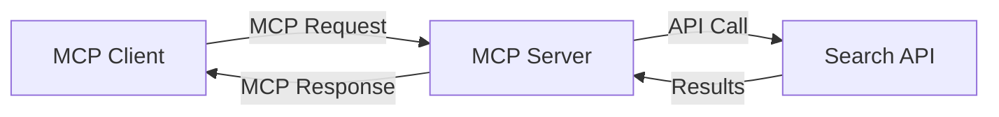
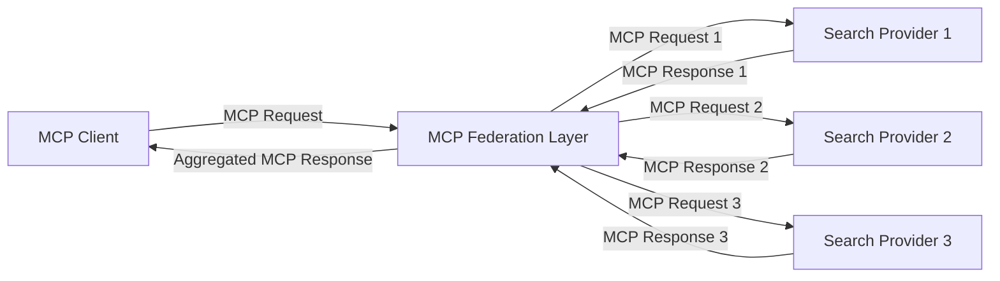
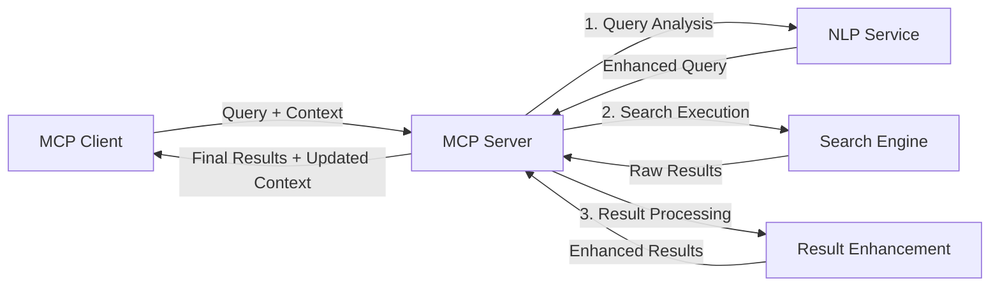

<!--
CO_OP_TRANSLATOR_METADATA:
{
  "original_hash": "333a03e51f90bdf3e6f1ba1694c73f36",
  "translation_date": "2025-07-17T00:52:19+00:00",
  "source_file": "05-AdvancedTopics/mcp-realtimesearch/README.md",
  "language_code": "pa"
}
-->
## ਕੋਡ ਉਦਾਹਰਨਾਂ ਲਈ ਸਪਸ਼ਟੀਕਰਨ

> **ਮਹੱਤਵਪੂਰਨ ਨੋਟ**: ਹੇਠਾਂ ਦਿੱਤੀਆਂ ਕੋਡ ਉਦਾਹਰਨਾਂ ਵਿੱਚ Model Context Protocol (MCP) ਨੂੰ ਵੈੱਬ ਖੋਜ ਫੰਕਸ਼ਨਾਲਿਟੀ ਨਾਲ ਜੋੜਨ ਦਾ ਤਰੀਕਾ ਦਿਖਾਇਆ ਗਿਆ ਹੈ। ਜਦੋਂ ਕਿ ਇਹ ਅਧਿਕਾਰਿਕ MCP SDKs ਦੇ ਪੈਟਰਨ ਅਤੇ ਢਾਂਚਿਆਂ ਦੀ ਪਾਲਣਾ ਕਰਦੀਆਂ ਹਨ, ਇਹ ਸਿੱਖਣ ਦੇ ਮਕਸਦ ਲਈ ਸਧਾਰਨ ਕੀਤੀਆਂ ਗਈਆਂ ਹਨ।
> 
> ਇਹ ਉਦਾਹਰਨਾਂ ਦਰਸਾਉਂਦੀਆਂ ਹਨ:
> 
> 1. **ਪਾਇਥਨ ਇੰਪਲੀਮੈਂਟੇਸ਼ਨ**: ਇੱਕ FastMCP ਸਰਵਰ ਇੰਪਲੀਮੈਂਟੇਸ਼ਨ ਜੋ ਵੈੱਬ ਖੋਜ ਟੂਲ ਪ੍ਰਦਾਨ ਕਰਦਾ ਹੈ ਅਤੇ ਬਾਹਰੀ ਖੋਜ API ਨਾਲ ਜੁੜਦਾ ਹੈ। ਇਹ ਉਦਾਹਰਨ ਜੀਵਨਕਾਲ ਪ੍ਰਬੰਧਨ, ਸੰਦਰਭ ਸੰਭਾਲ ਅਤੇ ਟੂਲ ਇੰਪਲੀਮੈਂਟੇਸ਼ਨ ਨੂੰ ਸਹੀ ਤਰੀਕੇ ਨਾਲ ਦਰਸਾਉਂਦੀ ਹੈ, ਜੋ [ਅਧਿਕਾਰਿਕ MCP ਪਾਇਥਨ SDK](https://github.com/modelcontextprotocol/python-sdk) ਦੇ ਪੈਟਰਨਾਂ ਦੀ ਪਾਲਣਾ ਕਰਦੀ ਹੈ। ਸਰਵਰ ਸਿਫਾਰਸ਼ੀ Streamable HTTP ਟ੍ਰਾਂਸਪੋਰਟ ਵਰਤਦਾ ਹੈ, ਜੋ ਪੁਰਾਣੇ SSE ਟ੍ਰਾਂਸਪੋਰਟ ਦੀ ਥਾਂ ਲੈ ਚੁੱਕਾ ਹੈ।
> 
> 2. **ਜਾਵਾਸਕ੍ਰਿਪਟ ਇੰਪਲੀਮੈਂਟੇਸ਼ਨ**: ਇੱਕ TypeScript/JavaScript ਇੰਪਲੀਮੈਂਟੇਸ਼ਨ ਜੋ [ਅਧਿਕਾਰਿਕ MCP TypeScript SDK](https://github.com/modelcontextprotocol/typescript-sdk) ਦੇ FastMCP ਪੈਟਰਨ ਦੀ ਵਰਤੋਂ ਕਰਦਾ ਹੈ, ਜਿਸ ਨਾਲ ਸਹੀ ਟੂਲ ਪਰਿਭਾਸ਼ਾਵਾਂ ਅਤੇ ਕਲਾਇੰਟ ਕਨੈਕਸ਼ਨਾਂ ਵਾਲਾ ਖੋਜ ਸਰਵਰ ਬਣਾਇਆ ਜਾਂਦਾ ਹੈ। ਇਹ ਸੈਸ਼ਨ ਪ੍ਰਬੰਧਨ ਅਤੇ ਸੰਦਰਭ ਸੰਭਾਲ ਲਈ ਨਵੇਂ ਸਿਫਾਰਸ਼ੀ ਪੈਟਰਨਾਂ ਦੀ ਪਾਲਣਾ ਕਰਦਾ ਹੈ।
> 
> ਇਹ ਉਦਾਹਰਨਾਂ ਉਤਪਾਦਨ ਲਈ ਵਾਧੂ ਤਰੁੱਟੀ ਸੰਭਾਲ, ਪ੍ਰਮਾਣਿਕਤਾ ਅਤੇ ਖਾਸ API ਇੰਟਿਗ੍ਰੇਸ਼ਨ ਕੋਡ ਦੀ ਲੋੜ ਹੋਵੇਗੀ। ਦਿਖਾਏ ਗਏ ਖੋਜ API ਐਂਡਪੌਇੰਟ (`https://api.search-service.example/search`) ਸਿਰਫ ਨਮੂਨੇ ਹਨ ਅਤੇ ਇਹਨਾਂ ਨੂੰ ਅਸਲੀ ਖੋਜ ਸੇਵਾ ਐਂਡਪੌਇੰਟ ਨਾਲ ਬਦਲਣਾ ਪਵੇਗਾ।
> 
> ਪੂਰੀ ਇੰਪਲੀਮੈਂਟੇਸ਼ਨ ਵੇਰਵੇ ਅਤੇ ਸਭ ਤੋਂ ਅਪ-ਟੂ-ਡੇਟ ਤਰੀਕਿਆਂ ਲਈ, ਕਿਰਪਾ ਕਰਕੇ [ਅਧਿਕਾਰਿਕ MCP ਵਿਸ਼ੇਸ਼ਤਾ](https://spec.modelcontextprotocol.io/) ਅਤੇ SDK ਦਸਤਾਵੇਜ਼ਾਂ ਨੂੰ ਵੇਖੋ।

## ਮੁੱਖ ਧਾਰਣਾਵਾਂ

### Model Context Protocol (MCP) ਫਰੇਮਵਰਕ

ਆਧਾਰ ਵਿੱਚ, Model Context Protocol AI ਮਾਡਲਾਂ, ਐਪਲੀਕੇਸ਼ਨਾਂ ਅਤੇ ਸੇਵਾਵਾਂ ਲਈ ਸੰਦਰਭ ਸਾਂਝਾ ਕਰਨ ਦਾ ਇੱਕ ਮਿਆਰੀ ਤਰੀਕਾ ਪ੍ਰਦਾਨ ਕਰਦਾ ਹੈ। ਰੀਅਲ-ਟਾਈਮ ਵੈੱਬ ਖੋਜ ਵਿੱਚ, ਇਹ ਫਰੇਮਵਰਕ ਸੰਗਠਿਤ, ਬਹੁ-ਚਰਣ ਖੋਜ ਅਨੁਭਵ ਬਣਾਉਣ ਲਈ ਜ਼ਰੂਰੀ ਹੈ। ਮੁੱਖ ਹਿੱਸੇ ਹਨ:

1. **ਕਲਾਇੰਟ-ਸਰਵਰ ਆਰਕੀਟੈਕਚਰ**: MCP ਖੋਜ ਕਲਾਇੰਟਾਂ (ਬੇਨਤੀ ਕਰਨ ਵਾਲੇ) ਅਤੇ ਖੋਜ ਸਰਵਰਾਂ (ਪ੍ਰਦਾਤਾ) ਵਿਚ ਸਾਫ਼ ਵੰਡ ਬਣਾਉਂਦਾ ਹੈ, ਜੋ ਲਚਕੀਲੇ ਤਰੀਕੇ ਨਾਲ ਤਾਇਨਾਤੀ ਮਾਡਲਾਂ ਦੀ ਆਗਿਆ ਦਿੰਦਾ ਹੈ।

2. **JSON-RPC ਸੰਚਾਰ**: ਪ੍ਰੋਟੋਕੋਲ ਸੁਨੇਹੇ ਬਦਲਣ ਲਈ JSON-RPC ਵਰਤਦਾ ਹੈ, ਜੋ ਵੈੱਬ ਤਕਨਾਲੋਜੀਆਂ ਨਾਲ ਅਨੁਕੂਲ ਹੈ ਅਤੇ ਵੱਖ-ਵੱਖ ਪਲੇਟਫਾਰਮਾਂ 'ਤੇ ਆਸਾਨੀ ਨਾਲ ਲਾਗੂ ਕੀਤਾ ਜਾ ਸਕਦਾ ਹੈ।

3. **ਸੰਦਰਭ ਪ੍ਰਬੰਧਨ**: MCP ਕਈ ਇੰਟਰੈਕਸ਼ਨਾਂ ਵਿੱਚ ਖੋਜ ਸੰਦਰਭ ਨੂੰ ਬਣਾਈ ਰੱਖਣ, ਅਪਡੇਟ ਕਰਨ ਅਤੇ ਵਰਤਣ ਲਈ ਸੰਰਚਿਤ ਤਰੀਕੇ ਪਰਿਭਾਸ਼ਿਤ ਕਰਦਾ ਹੈ।

4. **ਟੂਲ ਪਰਿਭਾਸ਼ਾਵਾਂ**: ਖੋਜ ਸਮਰੱਥਾਵਾਂ ਨੂੰ ਮਿਆਰੀ ਟੂਲਾਂ ਵਜੋਂ ਖੋਲ੍ਹਿਆ ਜਾਂਦਾ ਹੈ ਜਿਨ੍ਹਾਂ ਦੇ ਸਪਸ਼ਟ ਪੈਰਾਮੀਟਰ ਅਤੇ ਵਾਪਸੀ ਮੁੱਲ ਹੁੰਦੇ ਹਨ।

5. **ਸਟ੍ਰੀਮਿੰਗ ਸਹਾਇਤਾ**: ਪ੍ਰੋਟੋਕੋਲ ਸਟ੍ਰੀਮਿੰਗ ਨਤੀਜੇ ਸਹਾਇਤਾ ਕਰਦਾ ਹੈ, ਜੋ ਰੀਅਲ-ਟਾਈਮ ਖੋਜ ਲਈ ਜਰੂਰੀ ਹੈ ਜਿੱਥੇ ਨਤੀਜੇ ਕ੍ਰਮਵਾਰ ਆ ਸਕਦੇ ਹਨ।

### ਵੈੱਬ ਖੋਜ ਇੰਟਿਗ੍ਰੇਸ਼ਨ ਪੈਟਰਨ

ਜਦ MCP ਨੂੰ ਵੈੱਬ ਖੋਜ ਨਾਲ ਜੋੜਿਆ ਜਾਂਦਾ ਹੈ, ਤਾਂ ਕਈ ਪੈਟਰਨ ਸਾਹਮਣੇ ਆਉਂਦੇ ਹਨ:

#### 1. ਸਿੱਧਾ ਖੋਜ ਪ੍ਰਦਾਤਾ ਇੰਟਿਗ੍ਰੇਸ਼ਨ

ਇਸ ਪੈਟਰਨ ਵਿੱਚ, MCP ਸਰਵਰ ਸਿੱਧਾ ਇੱਕ ਜਾਂ ਵੱਧ ਖੋਜ API ਨਾਲ ਜੁੜਦਾ ਹੈ, MCP ਬੇਨਤੀਆਂ ਨੂੰ API-ਵਿਸ਼ੇਸ਼ ਕਾਲਾਂ ਵਿੱਚ ਤਬਦੀਲ ਕਰਦਾ ਹੈ ਅਤੇ ਨਤੀਜੇ MCP ਜਵਾਬਾਂ ਵਜੋਂ ਫਾਰਮੈਟ ਕਰਦਾ ਹੈ।

#### 2. ਸੰਦਰਭ ਸੰਭਾਲ ਨਾਲ ਫੈਡਰੇਟਿਡ ਖੋਜ

ਇਹ ਪੈਟਰਨ ਕਈ MCP-ਅਨੁਕੂਲ ਖੋਜ ਪ੍ਰਦਾਤਿਆਂ ਵਿੱਚ ਖੋਜ ਬੇਨਤੀਆਂ ਵੰਡਦਾ ਹੈ, ਜਿਹੜੇ ਵੱਖ-ਵੱਖ ਕਿਸਮ ਦੇ ਸਮੱਗਰੀ ਜਾਂ ਖੋਜ ਸਮਰੱਥਾਵਾਂ ਵਿੱਚ ਵਿਸ਼ੇਸ਼ਗਿਆ ਹੋ ਸਕਦੇ ਹਨ, ਜਦਕਿ ਇੱਕਜੁਟ ਸੰਦਰਭ ਬਣਾਈ ਰੱਖਦਾ ਹੈ।

#### 3. ਸੰਦਰਭ-ਸੰਵਰਧਿਤ ਖੋਜ ਚੇਨ

ਇਸ ਪੈਟਰਨ ਵਿੱਚ, ਖੋਜ ਪ੍ਰਕਿਰਿਆ ਕਈ ਚਰਣਾਂ ਵਿੱਚ ਵੰਡ ਦਿੱਤੀ ਜਾਂਦੀ ਹੈ, ਜਿੱਥੇ ਹਰ ਕਦਮ 'ਤੇ ਸੰਦਰਭ ਨੂੰ ਸੰਵਰਧਿਤ ਕੀਤਾ ਜਾਂਦਾ ਹੈ, ਜਿਸ ਨਾਲ ਕ੍ਰਮਵਾਰ ਵੱਧ ਸਬੰਧਤ ਨਤੀਜੇ ਮਿਲਦੇ ਹਨ।

### ਖੋਜ ਸੰਦਰਭ ਹਿੱਸੇ

MCP-ਆਧਾਰਿਤ ਵੈੱਬ ਖੋਜ ਵਿੱਚ, ਸੰਦਰਭ ਆਮ ਤੌਰ 'ਤੇ ਸ਼ਾਮਲ ਹੁੰਦਾ ਹੈ:

- **ਬੇਨਤੀ ਇਤਿਹਾਸ**: ਸੈਸ਼ਨ ਵਿੱਚ ਪਿਛਲੇ ਖੋਜ ਬੇਨਤੀਆਂ
- **ਉਪਭੋਗਤਾ ਪਸੰਦਾਂ**: ਭਾਸ਼ਾ, ਖੇਤਰ, ਸੁਰੱਖਿਅਤ ਖੋਜ ਸੈਟਿੰਗਜ਼
- **ਇੰਟਰੈਕਸ਼ਨ ਇਤਿਹਾਸ**: ਕਿਹੜੇ ਨਤੀਜੇ 'ਤੇ ਕਲਿੱਕ ਕੀਤਾ ਗਿਆ, ਨਤੀਜਿਆਂ 'ਤੇ ਬਿਤਾਇਆ ਸਮਾਂ
- **ਖੋਜ ਪੈਰਾਮੀਟਰ**: ਫਿਲਟਰ, ਕ੍ਰਮਬੱਧਤਾ ਅਤੇ ਹੋਰ ਖੋਜ ਸੋਧਕ
- **ਡੋਮੇਨ ਗਿਆਨ**: ਖੋਜ ਲਈ ਸੰਬੰਧਿਤ ਵਿਸ਼ੇਸ਼ ਸੰਦਰਭ
- **ਕਾਲਾਤਮਕ ਸੰਦਰਭ**: ਸਮੇਂ-ਆਧਾਰਿਤ ਸਬੰਧਤਾ ਕਾਰਕ
- **ਸਰੋਤ ਪਸੰਦਾਂ**: ਭਰੋਸੇਯੋਗ ਜਾਂ ਪਸੰਦੀਦਾ ਜਾਣਕਾਰੀ ਸਰੋਤ

## ਵਰਤੋਂ ਦੇ ਕੇਸ ਅਤੇ ਐਪਲੀਕੇਸ਼ਨ

### ਖੋਜ ਅਤੇ ਜਾਣਕਾਰੀ ਇਕੱਠਾ ਕਰਨਾ

MCP ਖੋਜ ਕਾਰਜ ਪ੍ਰਵਾਹਾਂ ਨੂੰ ਸੁਧਾਰਦਾ ਹੈ:

- ਖੋਜ ਸੈਸ਼ਨਾਂ ਵਿੱਚ ਖੋਜ ਸੰਦਰਭ ਨੂੰ ਬਣਾਈ ਰੱਖਣਾ
- ਹੋਰ ਸੁਧਰੇ ਅਤੇ ਸੰਦਰਭ-ਅਨੁਕੂਲ ਬੇਨਤੀਆਂ ਨੂੰ ਯੋਗ ਬਣਾਉਣਾ
- ਬਹੁ-ਸਰੋਤ ਖੋਜ ਫੈਡਰੇਸ਼ਨ ਦਾ ਸਮਰਥਨ
- ਖੋਜ ਨਤੀਜਿਆਂ ਤੋਂ ਗਿਆਨ ਨਿਕਾਸ ਕਰਨ ਵਿੱਚ ਸਹਾਇਤਾ

### ਰੀਅਲ-ਟਾਈਮ ਖ਼ਬਰਾਂ ਅਤੇ ਰੁਝਾਨ ਨਿਗਰਾਨੀ

MCP-ਚਾਲਿਤ ਖੋਜ ਖ਼ਬਰਾਂ ਦੀ ਨਿਗਰਾਨੀ ਲਈ ਫਾਇਦੇ ਦਿੰਦਾ ਹੈ:

- ਨਜ਼ਦੀਕੀ-ਰੀਅਲ-ਟਾਈਮ ਉਭਰ ਰਹੀਆਂ ਖ਼ਬਰਾਂ ਦੀ ਖੋਜ
- ਸੰਦਰਭ ਅਨੁਕੂਲ ਜਾਣਕਾਰੀ ਛਾਂਟਣਾ
- ਕਈ ਸਰੋਤਾਂ ਵਿੱਚ ਵਿਸ਼ੇ ਅਤੇ ਇਕਾਈ ਟ੍ਰੈਕਿੰਗ
- ਉਪਭੋਗਤਾ ਸੰਦਰਭ ਅਧਾਰਿਤ ਨਿੱਜੀ ਖ਼ਬਰਾਂ ਦੀ ਸੂਚਨਾ

### AI-ਸਹਾਇਤ ਬ੍ਰਾਊਜ਼ਿੰਗ ਅਤੇ ਖੋਜ

MCP AI-ਸਹਾਇਤ ਬ੍ਰਾਊਜ਼ਿੰਗ ਲਈ ਨਵੀਆਂ ਸੰਭਾਵਨਾਵਾਂ ਬਣਾਉਂਦਾ ਹੈ:

- ਮੌਜੂਦਾ ਬ੍ਰਾਊਜ਼ਰ ਗਤੀਵਿਧੀ ਅਧਾਰਿਤ ਸੰਦਰਭ-ਅਨੁਕੂਲ ਖੋਜ ਸੁਝਾਅ
- ਵੈੱਬ ਖੋਜ ਨੂੰ LLM-ਚਾਲਿਤ ਸਹਾਇਕਾਂ ਨਾਲ ਬਿਨਾਂ ਰੁਕਾਵਟ ਜੋੜਨਾ
- ਬਹੁ-ਚਰਣ ਖੋਜ ਸੁਧਾਰ ਸੰਦਰਭ ਨਾਲ ਬਣਾਈ ਰੱਖਣਾ
- ਤੱਥ-ਜਾਂਚ ਅਤੇ ਜਾਣਕਾਰੀ ਪੁਸ਼ਟੀ ਵਿੱਚ ਸੁਧਾਰ

## ਭਵਿੱਖ ਦੇ ਰੁਝਾਨ ਅਤੇ ਨਵੀਨਤਾ

### ਵੈੱਬ ਖੋਜ ਵਿੱਚ MCP ਦਾ ਵਿਕਾਸ

ਅੱਗੇ ਦੇਖਦੇ ਹੋਏ, ਅਸੀਂ MCP ਦੇ ਵਿਕਾਸ ਦੀ ਉਮੀਦ ਕਰਦੇ ਹਾਂ ਜੋ:

- **ਮਲਟੀਮੋਡਲ ਖੋਜ**: ਲਿਖਤ, ਚਿੱਤਰ, ਆਡੀਓ ਅਤੇ ਵੀਡੀਓ ਖੋਜ ਨੂੰ ਸੰਦਰਭ ਨਾਲ ਜੋੜਨਾ
- **ਕੇਂਦਰੀਕ੍ਰਿਤ-ਰਹਿਤ ਖੋਜ**: ਵੰਡੇ ਹੋਏ ਅਤੇ ਫੈਡਰੇਟਿਡ ਖੋਜ ਪਰਿਸ਼ਰਾਂ ਦਾ ਸਮਰਥਨ ਕਰੇਗਾ
- **Search Privacy**: ਸੰਦਰਭ-ਸੂਚਕ ਪਰਦੇਦਾਰੀ ਵਾਲੇ ਖੋਜ ਮਕੈਨਿਜ਼ਮ  
- **Query Understanding**: ਕੁਦਰਤੀ ਭਾਸ਼ਾ ਖੋਜ ਪ੍ਰਸ਼ਨਾਂ ਦੀ ਗਹਿਰੀ ਅਰਥ-ਵਿਸ਼ਲੇਸ਼ਣ  

### ਤਕਨਾਲੋਜੀ ਵਿੱਚ ਸੰਭਾਵਿਤ ਤਰੱਕੀਆਂ  

ਉਹ ਨਵੀਂ ਤਕਨਾਲੋਜੀਆਂ ਜੋ MCP ਖੋਜ ਦੇ ਭਵਿੱਖ ਨੂੰ ਆਕਾਰ ਦੇਣਗੀਆਂ:  

1. **Neural Search Architectures**: MCP ਲਈ ਐਮਬੈਡਿੰਗ-ਆਧਾਰਿਤ ਖੋਜ ਪ੍ਰਣਾਲੀਆਂ  
2. **Personalized Search Context**: ਸਮੇਂ ਦੇ ਨਾਲ ਵਿਅਕਤੀਗਤ ਉਪਭੋਗਤਾ ਖੋਜ ਰੁਝਾਨਾਂ ਨੂੰ ਸਿੱਖਣਾ  
3. **Knowledge Graph Integration**: ਖੇਤਰ-ਵਿਸ਼ੇਸ਼ ਗਿਆਨ ਗ੍ਰਾਫਾਂ ਨਾਲ ਸੰਦਰਭ-ਸੂਚਕ ਖੋਜ ਨੂੰ ਬਹਿਤਰ ਬਣਾਉਣਾ  
4. **Cross-Modal Context**: ਵੱਖ-ਵੱਖ ਖੋਜ ਮੋਡਾਲਿਟੀਆਂ ਵਿੱਚ ਸੰਦਰਭ ਨੂੰ ਕਾਇਮ ਰੱਖਣਾ  

## ਹੱਥੋਂ-ਹੱਥ ਅਭਿਆਸ  

### ਅਭਿਆਸ 1: ਇੱਕ ਬੁਨਿਆਦੀ MCP ਖੋਜ ਪਾਈਪਲਾਈਨ ਸੈੱਟਅੱਪ ਕਰਨਾ  

ਇਸ ਅਭਿਆਸ ਵਿੱਚ, ਤੁਸੀਂ ਸਿੱਖੋਗੇ ਕਿ:  
- ਇੱਕ ਬੁਨਿਆਦੀ MCP ਖੋਜ ਵਾਤਾਵਰਣ ਕਿਵੇਂ ਸੰਰਚਿਤ ਕਰਨਾ ਹੈ  
- ਵੈੱਬ ਖੋਜ ਲਈ ਸੰਦਰਭ ਹੈਂਡਲਰ ਲਾਗੂ ਕਰਨੇ  
- ਖੋਜ ਦੌਰਾਨ ਸੰਦਰਭ ਦੀ ਸੁਰੱਖਿਆ ਦੀ ਜਾਂਚ ਅਤੇ ਪ੍ਰਮਾਣਿਕਤਾ ਕਰਨੀ  

### ਅਭਿਆਸ 2: MCP ਖੋਜ ਨਾਲ ਇੱਕ ਰਿਸਰਚ ਸਹਾਇਕ ਬਣਾਉਣਾ  

ਇੱਕ ਪੂਰੀ ਐਪਲੀਕੇਸ਼ਨ ਬਣਾਓ ਜੋ:  
- ਕੁਦਰਤੀ ਭਾਸ਼ਾ ਵਿੱਚ ਰਿਸਰਚ ਪ੍ਰਸ਼ਨਾਂ ਨੂੰ ਪ੍ਰਕਿਰਿਆ ਕਰਦੀ ਹੈ  
- ਸੰਦਰਭ-ਸੂਚਕ ਵੈੱਬ ਖੋਜ ਕਰਦੀ ਹੈ  
- ਕਈ ਸਰੋਤਾਂ ਤੋਂ ਜਾਣਕਾਰੀ ਸੰਯੋਜਿਤ ਕਰਦੀ ਹੈ  
- ਵਿਵਸਥਿਤ ਰਿਸਰਚ ਨਤੀਜੇ ਪੇਸ਼ ਕਰਦੀ ਹੈ  

### ਅਭਿਆਸ 3: MCP ਨਾਲ ਬਹੁ-ਸਰੋਤ ਖੋਜ ਫੈਡਰੇਸ਼ਨ ਲਾਗੂ ਕਰਨਾ  

ਉੱਚ-ਪੱਧਰੀ ਅਭਿਆਸ ਜੋ ਕਵਰ ਕਰਦਾ ਹੈ:  
- ਕਈ ਖੋਜ ਇੰਜਨਾਂ ਨੂੰ ਸੰਦਰਭ-ਸੂਚਕ ਪ੍ਰਸ਼ਨ ਭੇਜਣਾ  
- ਨਤੀਜਿਆਂ ਦੀ ਰੈਂਕਿੰਗ ਅਤੇ ਇਕੱਠਾ ਕਰਨਾ  
- ਖੋਜ ਨਤੀਜਿਆਂ ਦੀ ਸੰਦਰਭ ਅਨੁਕੂਲ ਦੁਹਰਾਈ ਘਟਾਉਣਾ  
- ਸਰੋਤ-ਵਿਸ਼ੇਸ਼ ਮੈਟਾਡੇਟਾ ਸੰਭਾਲਣਾ  

## ਵਾਧੂ ਸਰੋਤ  

- [Model Context Protocol Specification](https://spec.modelcontextprotocol.io/) - ਅਧਿਕਾਰਿਕ MCP ਵਿਸ਼ੇਸ਼ਣ ਅਤੇ ਵਿਸਥਾਰਿਤ ਪ੍ਰੋਟੋਕੋਲ ਦਸਤਾਵੇਜ਼  
- [Model Context Protocol Documentation](https://modelcontextprotocol.io/) - ਵਿਸਥਾਰਿਤ ਟਿਊਟੋਰਿਯਲ ਅਤੇ ਲਾਗੂ ਕਰਨ ਦੇ ਮਾਰਗਦਰਸ਼ਨ  
- [MCP Python SDK](https://github.com/modelcontextprotocol/python-sdk) - MCP ਪ੍ਰੋਟੋਕੋਲ ਦੀ ਅਧਿਕਾਰਿਕ Python ਲਾਗੂਆਤ  
- [MCP TypeScript SDK](https://github.com/modelcontextprotocol/typescript-sdk) - MCP ਪ੍ਰੋਟੋਕੋਲ ਦੀ ਅਧਿਕਾਰਿਕ TypeScript ਲਾਗੂਆਤ  
- [MCP Reference Servers](https://github.com/modelcontextprotocol/servers) - MCP ਸਰਵਰਾਂ ਦੀ ਰੈਫਰੈਂਸ ਲਾਗੂਆਤ  
- [Bing Web Search API Documentation](https://learn.microsoft.com/en-us/bing/search-apis/bing-web-search/overview) - Microsoft ਦਾ ਵੈੱਬ ਖੋਜ API  
- [Google Custom Search JSON API](https://developers.google.com/custom-search/v1/overview) - Google ਦਾ ਪ੍ਰੋਗ੍ਰਾਮੇਬਲ ਖੋਜ ਇੰਜਨ  
- [SerpAPI Documentation](https://serpapi.com/search-api) - ਖੋਜ ਇੰਜਨ ਨਤੀਜੇ ਪੰਨਾ API  
- [Meilisearch Documentation](https://www.meilisearch.com/docs) - ਖੁੱਲ੍ਹਾ ਸਰੋਤ ਖੋਜ ਇੰਜਨ  
- [Elasticsearch Documentation](https://www.elastic.co/guide/index.html) - ਵੰਡਿਆ ਹੋਇਆ ਖੋਜ ਅਤੇ ਵਿਸ਼ਲੇਸ਼ਣ ਇੰਜਨ  
- [LangChain Documentation](https://python.langchain.com/docs/get_started/introduction) - LLMs ਨਾਲ ਐਪਲੀਕੇਸ਼ਨ ਬਣਾਉਣਾ  

## ਸਿੱਖਣ ਦੇ ਨਤੀਜੇ  

ਇਸ ਮੋਡੀਊਲ ਨੂੰ ਪੂਰਾ ਕਰਕੇ, ਤੁਸੀਂ ਸਮਰੱਥ ਹੋਵੋਗੇ:  

- ਰੀਅਲ-ਟਾਈਮ ਵੈੱਬ ਖੋਜ ਦੇ ਮੂਲ ਤੱਤਾਂ ਅਤੇ ਚੁਣੌਤੀਆਂ ਨੂੰ ਸਮਝਣਾ  
- ਸਮਝਾਉਣਾ ਕਿ Model Context Protocol (MCP) ਕਿਵੇਂ ਰੀਅਲ-ਟਾਈਮ ਵੈੱਬ ਖੋਜ ਸਮਰੱਥਾਵਾਂ ਨੂੰ ਵਧਾਉਂਦਾ ਹੈ  
- ਪ੍ਰਸਿੱਧ ਫਰੇਮਵਰਕ ਅਤੇ APIs ਦੀ ਵਰਤੋਂ ਕਰਕੇ MCP-ਆਧਾਰਿਤ ਖੋਜ ਹੱਲ ਲਾਗੂ ਕਰਨਾ  
- MCP ਨਾਲ ਸਕੇਲ ਕਰਨ ਯੋਗ, ਉੱਚ-ਕਾਰਗਰਤਾ ਖੋਜ ਆਰਕੀਟੈਕਚਰ ਡਿਜ਼ਾਈਨ ਅਤੇ ਤਾਇਨਾਤ ਕਰਨਾ  
- MCP ਸੰਕਲਪਾਂ ਨੂੰ ਵੱਖ-ਵੱਖ ਵਰਤੋਂ ਦੇ ਕੇਸਾਂ ਵਿੱਚ ਲਾਗੂ ਕਰਨਾ ਜਿਵੇਂ ਕਿ ਅਰਥ-ਸੂਚਕ ਖੋਜ, ਰਿਸਰਚ ਸਹਾਇਤਾ, ਅਤੇ AI-ਸਹਾਇਤ ਬ੍ਰਾਊਜ਼ਿੰਗ  
- MCP-ਆਧਾਰਿਤ ਖੋਜ ਤਕਨਾਲੋਜੀਆਂ ਵਿੱਚ ਉਭਰਦੇ ਰੁਝਾਨਾਂ ਅਤੇ ਭਵਿੱਖੀ ਨਵੀਨਤਾਵਾਂ ਦਾ ਮੁਲਾਂਕਣ ਕਰਨਾ  

### ਭਰੋਸਾ ਅਤੇ ਸੁਰੱਖਿਆ ਸੰਬੰਧੀ ਵਿਚਾਰ  

ਜਦੋਂ MCP-ਆਧਾਰਿਤ ਵੈੱਬ ਖੋਜ ਹੱਲ ਲਾਗੂ ਕਰ ਰਹੇ ਹੋ, ਤਾਂ MCP ਵਿਸ਼ੇਸ਼ਣ ਤੋਂ ਇਹ ਮਹੱਤਵਪੂਰਨ ਨਿਯਮ ਯਾਦ ਰੱਖੋ:  

1. **User Consent and Control**: ਉਪਭੋਗਤਾਵਾਂ ਨੂੰ ਸਪਸ਼ਟ ਤੌਰ 'ਤੇ ਸਾਰੇ ਡਾਟਾ ਐਕਸੈਸ ਅਤੇ ਕਾਰਵਾਈਆਂ ਲਈ ਸਹਿਮਤੀ ਦੇਣੀ ਅਤੇ ਸਮਝਣੀ ਚਾਹੀਦੀ ਹੈ। ਇਹ ਵੈੱਬ ਖੋਜ ਲਾਗੂਆਤਾਂ ਲਈ ਖਾਸ ਕਰਕੇ ਜਰੂਰੀ ਹੈ ਜੋ ਬਾਹਰੀ ਡਾਟਾ ਸਰੋਤਾਂ ਤੱਕ ਪਹੁੰਚ ਸਕਦੀਆਂ ਹਨ।  

2. **Data Privacy**: ਖੋਜ ਪ੍ਰਸ਼ਨਾਂ ਅਤੇ ਨਤੀਜਿਆਂ ਨੂੰ ਢੰਗ ਨਾਲ ਸੰਭਾਲੋ, ਖਾਸ ਕਰਕੇ ਜਦੋਂ ਉਹ ਸੰਵੇਦਨਸ਼ੀਲ ਜਾਣਕਾਰੀ ਰੱਖਦੇ ਹੋਣ। ਉਪਭੋਗਤਾ ਡਾਟਾ ਦੀ ਸੁਰੱਖਿਆ ਲਈ ਉਚਿਤ ਪਹੁੰਚ ਨਿਯੰਤਰਣ ਲਾਗੂ ਕਰੋ।  

3. **Tool Safety**: ਖੋਜ ਟੂਲਾਂ ਲਈ ਠੀਕ ਅਧਿਕਾਰ ਅਤੇ ਪ੍ਰਮਾਣਿਕਤਾ ਲਾਗੂ ਕਰੋ, ਕਿਉਂਕਿ ਇਹ ਅਣਚਾਹੇ ਕੋਡ ਚਲਾਉਣ ਰਾਹੀਂ ਸੁਰੱਖਿਆ ਖਤਰੇ ਪੈਦਾ ਕਰ ਸਕਦੇ ਹਨ। ਟੂਲ ਦੇ ਵਰਣਨ ਨੂੰ ਸਿਰਫ਼ ਭਰੋਸੇਮੰਦ ਸਰਵਰ ਤੋਂ ਪ੍ਰਾਪਤ ਨਾ ਹੋਣ 'ਤੇ ਅਣਭਰੋਸੇਯੋਗ ਸਮਝੋ।  

4. **Clear Documentation**: MCP-ਆਧਾਰਿਤ ਖੋਜ ਲਾਗੂਆਤ ਦੀ ਸਮਰੱਥਾ, ਸੀਮਾਵਾਂ ਅਤੇ ਸੁਰੱਖਿਆ ਸੰਬੰਧੀ ਸਪਸ਼ਟ ਦਸਤਾਵੇਜ਼ ਪ੍ਰਦਾਨ ਕਰੋ, MCP ਵਿਸ਼ੇਸ਼ਣ ਦੇ ਲਾਗੂ ਕਰਨ ਦੇ ਮਾਰਗਦਰਸ਼ਨ ਅਨੁਸਾਰ।  

5. **Robust Consent Flows**: ਮਜ਼ਬੂਤ ਸਹਿਮਤੀ ਅਤੇ ਅਧਿਕਾਰ ਪ੍ਰਕਿਰਿਆਵਾਂ ਬਣਾਓ ਜੋ ਹਰ ਟੂਲ ਦੀ ਕਾਰਗੁਜ਼ਾਰੀ ਨੂੰ ਸਪਸ਼ਟ ਤੌਰ 'ਤੇ ਸਮਝਾਉਂਦੀਆਂ ਹਨ, ਖਾਸ ਕਰਕੇ ਉਹ ਟੂਲ ਜੋ ਬਾਹਰੀ ਵੈੱਬ ਸਰੋਤਾਂ ਨਾਲ ਸੰਪਰਕ ਕਰਦੇ ਹਨ।  

MCP ਸੁਰੱਖਿਆ ਅਤੇ ਭਰੋਸਾ ਸੰਬੰਧੀ ਪੂਰੀ ਜਾਣਕਾਰੀ ਲਈ, [ਅਧਿਕਾਰਿਕ ਦਸਤਾਵੇਜ਼](https://modelcontextprotocol.io/specification/2025-03-26#security-and-trust-%26-safety) ਵੇਖੋ।  

## ਅਗਲਾ ਕੀ ਹੈ  

- [5.12 Entra ID Authentication for Model Context Protocol Servers](../mcp-security-entra/README.md)

**ਅਸਵੀਕਾਰੋਪੱਤਰ**:  
ਇਹ ਦਸਤਾਵੇਜ਼ AI ਅਨੁਵਾਦ ਸੇਵਾ [Co-op Translator](https://github.com/Azure/co-op-translator) ਦੀ ਵਰਤੋਂ ਕਰਕੇ ਅਨੁਵਾਦਿਤ ਕੀਤਾ ਗਿਆ ਹੈ। ਜਦੋਂ ਕਿ ਅਸੀਂ ਸਹੀਤਾ ਲਈ ਕੋਸ਼ਿਸ਼ ਕਰਦੇ ਹਾਂ, ਕਿਰਪਾ ਕਰਕੇ ਧਿਆਨ ਰੱਖੋ ਕਿ ਸਵੈਚਾਲਿਤ ਅਨੁਵਾਦਾਂ ਵਿੱਚ ਗਲਤੀਆਂ ਜਾਂ ਅਸਮਰਥਤਾਵਾਂ ਹੋ ਸਕਦੀਆਂ ਹਨ। ਮੂਲ ਦਸਤਾਵੇਜ਼ ਆਪਣੀ ਮੂਲ ਭਾਸ਼ਾ ਵਿੱਚ ਪ੍ਰਮਾਣਿਕ ਸਰੋਤ ਮੰਨਿਆ ਜਾਣਾ ਚਾਹੀਦਾ ਹੈ। ਮਹੱਤਵਪੂਰਨ ਜਾਣਕਾਰੀ ਲਈ, ਪੇਸ਼ੇਵਰ ਮਨੁੱਖੀ ਅਨੁਵਾਦ ਦੀ ਸਿਫਾਰਸ਼ ਕੀਤੀ ਜਾਂਦੀ ਹੈ। ਇਸ ਅਨੁਵਾਦ ਦੀ ਵਰਤੋਂ ਤੋਂ ਉਤਪੰਨ ਕਿਸੇ ਵੀ ਗਲਤਫਹਿਮੀ ਜਾਂ ਗਲਤ ਵਿਆਖਿਆ ਲਈ ਅਸੀਂ ਜ਼ਿੰਮੇਵਾਰ ਨਹੀਂ ਹਾਂ।