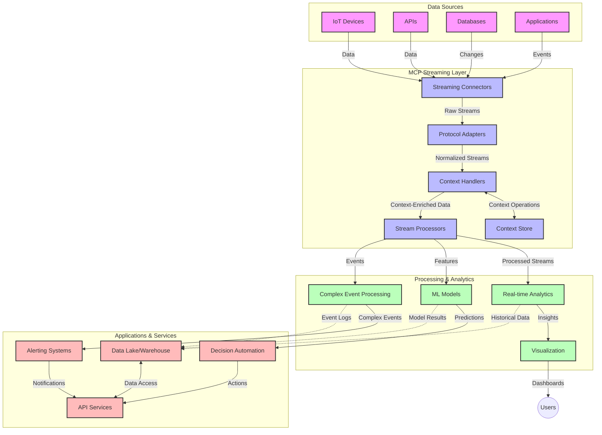

<!--
CO_OP_TRANSLATOR_METADATA:
{
  "original_hash": "195f7287638b77a549acadd96c8f981c",
  "translation_date": "2025-06-12T23:34:24+00:00",
  "source_file": "05-AdvancedTopics/mcp-realtimestreaming/README.md",
  "language_code": "pa"
}
-->
# ਮਾਡਲ ਸੰਦਰਭ ਪ੍ਰੋਟੋਕੋਲ ਲਈ ਰੀਅਲ-ਟਾਈਮ ਡਾਟਾ ਸਟ੍ਰੀਮਿੰਗ

## ਝਲਕ

ਰੀਅਲ-ਟਾਈਮ ਡਾਟਾ ਸਟ੍ਰੀਮਿੰਗ ਅੱਜ ਦੇ ਡਾਟਾ-ਚਲਿਤ ਸੰਸਾਰ ਵਿੱਚ ਬਹੁਤ ਜ਼ਰੂਰੀ ਹੋ ਚੁੱਕੀ ਹੈ, ਜਿੱਥੇ ਕਾਰੋਬਾਰ ਅਤੇ ਐਪਲੀਕੇਸ਼ਨਾਂ ਨੂੰ ਸਮੇਂ ਸਿਰ ਫੈਸਲੇ ਕਰਨ ਲਈ ਤੁਰੰਤ ਜਾਣਕਾਰੀ ਦੀ ਲੋੜ ਹੁੰਦੀ ਹੈ। ਮਾਡਲ ਸੰਦਰਭ ਪ੍ਰੋਟੋਕੋਲ (MCP) ਇਹਨਾਂ ਰੀਅਲ-ਟਾਈਮ ਸਟ੍ਰੀਮਿੰਗ ਪ੍ਰਕਿਰਿਆਵਾਂ ਨੂੰ ਸੁਧਾਰਨ ਵਿੱਚ ਇੱਕ ਮਹੱਤਵਪੂਰਨ ਤਰੱਕੀ ਹੈ, ਜੋ ਡਾਟਾ ਪ੍ਰੋਸੈਸਿੰਗ ਦੀ ਕਾਰਗੁਜ਼ਾਰੀ ਵਧਾਉਂਦਾ ਹੈ, ਸੰਦਰਭ ਦੀ ਸਹੀਅਤ ਬਣਾਈ ਰੱਖਦਾ ਹੈ ਅਤੇ ਕੁੱਲ ਸਿਸਟਮ ਪ੍ਰਦਰਸ਼ਨ ਨੂੰ ਬਿਹਤਰ ਬਣਾਉਂਦਾ ਹੈ।

ਇਹ ਮਾਡਿਊਲ ਵੇਖਦਾ ਹੈ ਕਿ MCP ਕਿਵੇਂ AI ਮਾਡਲਾਂ, ਸਟ੍ਰੀਮਿੰਗ ਪਲੇਟਫਾਰਮਾਂ ਅਤੇ ਐਪਲੀਕੇਸ਼ਨਾਂ ਵਿੱਚ ਸੰਦਰਭ ਪ੍ਰਬੰਧਨ ਲਈ ਇੱਕ ਮਿਆਰੀ ਤਰੀਕਾ ਮੁਹੱਈਆ ਕਰਕੇ ਰੀਅਲ-ਟਾਈਮ ਡਾਟਾ ਸਟ੍ਰੀਮਿੰਗ ਨੂੰ ਬਦਲਦਾ ਹੈ।

## ਰੀਅਲ-ਟਾਈਮ ਡਾਟਾ ਸਟ੍ਰੀਮਿੰਗ ਦਾ ਪਰਿਚਯ

ਰੀਅਲ-ਟਾਈਮ ਡਾਟਾ ਸਟ੍ਰੀਮਿੰਗ ਇੱਕ ਤਕਨਾਲੋਜੀ ਪੈਰਾਡਾਈਮ ਹੈ ਜੋ ਡਾਟਾ ਦੇ ਲਗਾਤਾਰ ਟ੍ਰਾਂਸਫਰ, ਪ੍ਰੋਸੈਸਿੰਗ ਅਤੇ ਵਿਸ਼ਲੇਸ਼ਣ ਨੂੰ ਯਕੀਨੀ ਬਣਾਉਂਦਾ ਹੈ ਜਿਵੇਂ ਹੀ ਡਾਟਾ ਬਣਦਾ ਹੈ, ਜਿਸ ਨਾਲ ਸਿਸਟਮ ਤੁਰੰਤ ਨਵੀਂ ਜਾਣਕਾਰੀ 'ਤੇ ਪ੍ਰਤੀਕਿਰਿਆ ਕਰ ਸਕਦੇ ਹਨ। ਪਰੰਪਰਾਗਤ ਬੈਚ ਪ੍ਰੋਸੈਸਿੰਗ ਦੇ ਵਿਰੁੱਧ, ਜੋ ਸਥਿਰ ਡਾਟਾਸੈੱਟਾਂ 'ਤੇ ਕੰਮ ਕਰਦਾ ਹੈ, ਸਟ੍ਰੀਮਿੰਗ ਡਾਟਾ ਨੂੰ ਮੋਸ਼ਨ ਵਿੱਚ ਪ੍ਰੋਸੈਸ ਕਰਦਾ ਹੈ ਅਤੇ ਘੱਟ ਤੋਂ ਘੱਟ ਦੇਰੀ ਨਾਲ ਜਾਣਕਾਰੀਆਂ ਅਤੇ ਕਾਰਵਾਈਆਂ ਮੁਹੱਈਆ ਕਰਵਾਉਂਦਾ ਹੈ।

### ਰੀਅਲ-ਟਾਈਮ ਡਾਟਾ ਸਟ੍ਰੀਮਿੰਗ ਦੇ ਮੁੱਖ ਤੱਤ:

- **ਲਗਾਤਾਰ ਡਾਟਾ ਦਾ ਪ੍ਰਵਾਹ**: ਡਾਟਾ ਇਕ ਅਟੁੱਟ, ਲਗਾਤਾਰ ਘਟਨਾਵਾਂ ਜਾਂ ਰਿਕਾਰਡਾਂ ਦੇ ਸਟ੍ਰੀਮ ਵਜੋਂ ਪ੍ਰੋਸੈਸ ਹੁੰਦਾ ਹੈ।
- **ਘੱਟ ਲੇਟੈਂਸੀ ਪ੍ਰੋਸੈਸਿੰਗ**: ਸਿਸਟਮ ਡਾਟਾ ਬਣਨ ਅਤੇ ਪ੍ਰੋਸੈਸ ਕਰਨ ਵਿਚਕਾਰ ਦੇ ਸਮੇਂ ਨੂੰ ਘੱਟ ਕਰਨ ਲਈ ਡਿਜ਼ਾਇਨ ਕੀਤੇ ਜਾਂਦੇ ਹਨ।
- **ਪੈਮਾਨਾ ਬੱਧਤਾ**: ਸਟ੍ਰੀਮਿੰਗ ਆਰਕੀਟੈਕਚਰ ਵੱਖ-ਵੱਖ ਡਾਟਾ ਮਾਤਰਾ ਅਤੇ ਗਤੀ ਨੂੰ ਸਹਿਣਾ ਹੋਣਾ ਚਾਹੀਦਾ ਹੈ।
- **ਫਾਲਟ ਟੋਲਰੈਂਸ**: ਸਿਸਟਮ ਨੂੰ ਅਸਫਲਤਾਵਾਂ ਤੋਂ ਬਿਨਾਂ ਡਾਟਾ ਪ੍ਰਵਾਹ ਜਾਰੀ ਰੱਖਣ ਲਈ ਸਹਿਣਸ਼ੀਲ ਹੋਣਾ ਚਾਹੀਦਾ ਹੈ।
- **ਸਟੇਟਫੁਲ ਪ੍ਰੋਸੈਸਿੰਗ**: ਘਟਨਾਵਾਂ ਵਿੱਚ ਸੰਦਰਭ ਬਣਾਈ ਰੱਖਣਾ ਮਹੱਤਵਪੂਰਨ ਹੈ ਤਾਂ ਜੋ ਵਿਸ਼ਲੇਸ਼ਣ ਸਾਰਥਕ ਹੋਵੇ।

### ਮਾਡਲ ਸੰਦਰਭ ਪ੍ਰੋਟੋਕੋਲ ਅਤੇ ਰੀਅਲ-ਟਾਈਮ ਸਟ੍ਰੀਮਿੰਗ

ਮਾਡਲ ਸੰਦਰਭ ਪ੍ਰੋਟੋਕੋਲ (MCP) ਰੀਅਲ-ਟਾਈਮ ਸਟ੍ਰੀਮਿੰਗ ਮਾਹੌਲਾਂ ਵਿੱਚ ਕਈ ਅਹੰਕਾਰਪੂਰਨ ਚੁਣੌਤੀਆਂ ਦਾ ਸਮਾਧਾਨ ਕਰਦਾ ਹੈ:

1. **ਸੰਦਰਭਕ ਅਟੁੱਟਤਾ**: MCP ਵੰਡੇ ਹੋਏ ਸਟ੍ਰੀਮਿੰਗ ਕੰਪੋਨੈਂਟਾਂ ਵਿੱਚ ਸੰਦਰਭ ਨੂੰ ਕਿਵੇਂ ਬਣਾਈ ਰੱਖਣਾ ਹੈ, ਇਸਦਾ ਮਿਆਰੀਕਰਨ ਕਰਦਾ ਹੈ, ਯਕੀਨੀ ਬਣਾਉਂਦਾ ਹੈ ਕਿ AI ਮਾਡਲ ਅਤੇ ਪ੍ਰੋਸੈਸਿੰਗ ਨੋਡਜ਼ ਕੋਲ ਸਬੰਧਤ ਇਤਿਹਾਸਕ ਅਤੇ ਵਾਤਾਵਰਣ ਸੰਦਰਭ ਦੀ ਪਹੁੰਚ ਹੋਵੇ।

2. **ਕੁਸ਼ਲ ਸਟੇਟ ਪ੍ਰਬੰਧਨ**: ਸੰਦਰਭ ਸੰਚਾਰ ਲਈ ਢਾਂਚਾਬੱਧ ਤਰੀਕੇ ਪ੍ਰਦਾਨ ਕਰਕੇ, MCP ਸਟ੍ਰੀਮਿੰਗ ਪਾਈਪਲਾਈਨਾਂ ਵਿੱਚ ਸਟੇਟ ਪ੍ਰਬੰਧਨ ਦੇ ਓਵਰਹੈੱਡ ਨੂੰ ਘਟਾਉਂਦਾ ਹੈ।

3. **ਇੰਟਰਓਪਰੇਬਿਲਿਟੀ**: MCP ਵੱਖ-ਵੱਖ ਸਟ੍ਰੀਮਿੰਗ ਤਕਨਾਲੋਜੀਆਂ ਅਤੇ AI ਮਾਡਲਾਂ ਵਿਚਕਾਰ ਸੰਦਰਭ ਸਾਂਝਾ ਕਰਨ ਲਈ ਇੱਕ ਸਾਂਝੀ ਭਾਸ਼ਾ ਬਣਾਉਂਦਾ ਹੈ, ਜਿਸ ਨਾਲ ਜ਼ਿਆਦਾ ਲਚਕੀਲਾ ਅਤੇ ਵਿਸ਼ਤਾਰਯੋਗ ਆਰਕੀਟੈਕਚਰ ਬਣਦੇ ਹਨ।

4. **ਸਟ੍ਰੀਮਿੰਗ-ਉਪਯੁਕਤ ਸੰਦਰਭ**: MCP ਦੇ ਇੰਪਲੀਮੈਂਟੇਸ਼ਨਾਂ ਵਿੱਚ ਇਹ ਪ੍ਰਾਥਮਿਕਤਾ ਦਿੱਤੀ ਜਾ ਸਕਦੀ ਹੈ ਕਿ ਕਿਹੜੇ ਸੰਦਰਭ ਤੱਤ ਰੀਅਲ-ਟਾਈਮ ਫੈਸਲੇ ਲਈ ਸਭ ਤੋਂ ਜ਼ਿਆਦਾ ਮਹੱਤਵਪੂਰਨ ਹਨ, ਪ੍ਰਦਰਸ਼ਨ ਅਤੇ ਸਹੀਅਤ ਦੋਹਾਂ ਲਈ ਅਨੁਕੂਲਿਤ ਕਰਦਾ ਹੈ।

5. **ਅਨੁਕੂਲ ਪ੍ਰੋਸੈਸਿੰਗ**: MCP ਰਾਹੀਂ ਸਹੀ ਸੰਦਰਭ ਪ੍ਰਬੰਧਨ ਨਾਲ, ਸਟ੍ਰੀਮਿੰਗ ਸਿਸਟਮ ਡਾਟਾ ਵਿੱਚ ਬਦਲਦੇ ਹਾਲਾਤ ਅਤੇ ਪੈਟਰਨਾਂ ਦੇ ਅਧਾਰ 'ਤੇ ਪ੍ਰੋਸੈਸਿੰਗ ਨੂੰ ਗਤੀਸ਼ੀਲ ਤਰੀਕੇ ਨਾਲ ਅਨੁਕੂਲਿਤ ਕਰ ਸਕਦੇ ਹਨ।

ਆਧੁਨਿਕ ਐਪਲੀਕੇਸ਼ਨਾਂ ਵਿੱਚ, ਜਿਵੇਂ ਕਿ IoT ਸੈਂਸਰ ਨੈੱਟਵਰਕ ਤੋਂ ਲੈ ਕੇ ਵਿੱਤੀ ਵਪਾਰ ਪਲੇਟਫਾਰਮਾਂ ਤੱਕ, MCP ਦਾ ਸਟ੍ਰੀਮਿੰਗ ਤਕਨਾਲੋਜੀਆਂ ਨਾਲ ਇੰਟਿਗ੍ਰੇਸ਼ਨ ਹੋਰ ਬੁੱਧੀਮਾਨ, ਸੰਦਰਭ-ਜਾਗਰੂਕ ਪ੍ਰੋਸੈਸਿੰਗ ਨੂੰ ਯਕੀਨੀ ਬਣਾਉਂਦਾ ਹੈ ਜੋ ਰੀਅਲ-ਟਾਈਮ ਵਿੱਚ ਜਟਿਲ ਅਤੇ ਬਦਲਦੇ ਹਾਲਾਤਾਂ ਦਾ ਢੰਗ ਨਾਲ ਜਵਾਬ ਦੇ ਸਕਦਾ ਹੈ।

## ਸਿੱਖਣ ਦੇ ਉਦੇਸ਼

ਇਸ ਪਾਠ ਦੇ ਅੰਤ ਤੱਕ, ਤੁਸੀਂ ਸਮਰੱਥ ਹੋਵੋਗੇ:

- ਰੀਅਲ-ਟਾਈਮ ਡਾਟਾ ਸਟ੍ਰੀਮਿੰਗ ਦੇ ਮੂਲ ਤੱਤਾਂ ਅਤੇ ਚੁਣੌਤੀਆਂ ਨੂੰ ਸਮਝਣਾ
- ਸਮਝਾਉਣਾ ਕਿ ਮਾਡਲ ਸੰਦਰਭ ਪ੍ਰੋਟੋਕੋਲ (MCP) ਰੀਅਲ-ਟਾਈਮ ਡਾਟਾ ਸਟ੍ਰੀਮਿੰਗ ਨੂੰ ਕਿਵੇਂ ਸੁਧਾਰਦਾ ਹੈ
- ਪ੍ਰਸਿੱਧ ਫਰੇਮਵਰਕਾਂ ਜਿਵੇਂ Kafka ਅਤੇ Pulsar ਦੀ ਵਰਤੋਂ ਕਰਕੇ MCP-ਆਧਾਰਿਤ ਸਟ੍ਰੀਮਿੰਗ ਹੱਲ ਲਾਗੂ ਕਰਨਾ
- MCP ਨਾਲ ਫਾਲਟ-ਟੋਲਰੈਂਟ, ਉੱਚ-ਕਾਰਗੁਜ਼ਾਰੀ ਵਾਲੀਆਂ ਸਟ੍ਰੀਮਿੰਗ ਆਰਕੀਟੈਕਚਰਾਂ ਦੀ ਡਿਜ਼ਾਈਨ ਅਤੇ ਤਾਇਨਾਤੀ ਕਰਨਾ
- IoT, ਵਿੱਤੀ ਵਪਾਰ ਅਤੇ AI-ਚਲਿਤ ਵਿਸ਼ਲੇਸ਼ਣ ਵਰਗੇ ਮਾਮਲਿਆਂ ਵਿੱਚ MCP ਧਾਰਣਾ ਲਾਗੂ ਕਰਨਾ
- MCP-ਆਧਾਰਿਤ ਸਟ੍ਰੀਮਿੰਗ ਤਕਨਾਲੋਜੀਆਂ ਵਿੱਚ ਉਭਰ ਰਹੀਆਂ ਰੁਝਾਨਾਂ ਅਤੇ ਭਵਿੱਖੀ ਨਵੀਨਤਾਵਾਂ ਦਾ ਮੁਲਾਂਕਣ ਕਰਨਾ

### ਪਰਿਭਾਸ਼ਾ ਅਤੇ ਮਹੱਤਵ

ਰੀਅਲ-ਟਾਈਮ ਡਾਟਾ ਸਟ੍ਰੀਮਿੰਗ ਵਿੱਚ ਘੱਟ ਲੇਟੈਂਸੀ ਨਾਲ ਲਗਾਤਾਰ ਡਾਟਾ ਦਾ ਬਣਾਉਣ, ਪ੍ਰੋਸੈਸ ਕਰਨ ਅਤੇ ਪਹੁੰਚਾਉਣ ਸ਼ਾਮਲ ਹੁੰਦਾ ਹੈ। ਬੈਚ ਪ੍ਰੋਸੈਸਿੰਗ ਦੇ ਵਿਰੁੱਧ, ਜਿੱਥੇ ਡਾਟਾ ਨੂੰ ਇਕੱਠਾ ਕਰਕੇ ਸਮੂਹਾਂ ਵਿੱਚ ਪ੍ਰੋਸੈਸ ਕੀਤਾ ਜਾਂਦਾ ਹੈ, ਸਟ੍ਰੀਮਿੰਗ ਡਾਟਾ ਨੂੰ ਜਿਵੇਂ ਜਿਵੇਂ ਆਉਂਦਾ ਹੈ ਤੁਰੰਤ ਪ੍ਰੋਸੈਸ ਕੀਤਾ ਜਾਂਦਾ ਹੈ, ਜਿਸ ਨਾਲ ਤੁਰੰਤ ਜਾਣਕਾਰੀਆਂ ਅਤੇ ਕਾਰਵਾਈਆਂ ਸੰਭਵ ਹੁੰਦੀਆਂ ਹਨ।

ਰੀਅਲ-ਟਾਈਮ ਡਾਟਾ ਸਟ੍ਰੀਮਿੰਗ ਦੀਆਂ ਮੁੱਖ ਵਿਸ਼ੇਸ਼ਤਾਵਾਂ:

- **ਘੱਟ ਲੇਟੈਂਸੀ**: ਡਾਟਾ ਨੂੰ ਮਿਲੀਸੈਕਿੰਡ ਤੋਂ ਸਕਿੰਡਾਂ ਵਿੱਚ ਪ੍ਰੋਸੈਸ ਅਤੇ ਵਿਸ਼ਲੇਸ਼ਣ ਕਰਨਾ
- **ਲਗਾਤਾਰ ਪ੍ਰਵਾਹ**: ਵੱਖ-ਵੱਖ ਸਰੋਤਾਂ ਤੋਂ ਬਿਨਾਂ ਰੁਕਾਵਟ ਡਾਟਾ ਸਟ੍ਰੀਮ
- **ਤੁਰੰਤ ਪ੍ਰੋਸੈਸਿੰਗ**: ਡਾਟਾ ਨੂੰ ਬੈਚਾਂ ਵਿੱਚ ਨਹੀਂ, ਜਿਵੇਂ ਹੀ ਆਉਂਦਾ ਹੈ ਤੁਰੰਤ ਵਿਸ਼ਲੇਸ਼ਣ ਕਰਨਾ
- **ਘਟਨਾ-ਚਲਿਤ ਆਰਕੀਟੈਕਚਰ**: ਜਿਵੇਂ ਹੀ ਘਟਨਾਵਾਂ ਹੁੰਦੀਆਂ ਹਨ, ਉਹਨਾਂ 'ਤੇ ਪ੍ਰਤੀਕਿਰਿਆ ਕਰਨਾ

### ਪਰੰਪਰਾਗਤ ਡਾਟਾ ਸਟ੍ਰੀਮਿੰਗ ਵਿੱਚ ਚੁਣੌਤੀਆਂ

ਪਰੰਪਰਾਗਤ ਡਾਟਾ ਸਟ੍ਰੀਮਿੰਗ ਤਰੀਕਿਆਂ ਨੂੰ ਕਈ ਸੀਮਾਵਾਂ ਦਾ ਸਾਹਮਣਾ ਕਰਨਾ ਪੈਂਦਾ ਹੈ:

1. **ਸੰਦਰਭ ਖੋ ਜਾਣਾ**: ਵੰਡੇ ਹੋਏ ਸਿਸਟਮਾਂ ਵਿੱਚ ਸੰਦਰਭ ਬਣਾਈ ਰੱਖਣ ਵਿੱਚ ਮੁਸ਼ਕਲ
2. **ਪੈਮਾਨਾ ਬੱਧਤਾ ਸਮੱਸਿਆਵਾਂ**: ਉੱਚ ਮਾਤਰਾ ਅਤੇ ਤੇਜ਼ ਗਤੀ ਵਾਲੇ ਡਾਟਾ ਨੂੰ ਸੰਭਾਲਣ ਵਿੱਚ ਚੁਣੌਤੀ
3. **ਇੰਟਿਗ੍ਰੇਸ਼ਨ ਦੀ ਜਟਿਲਤਾ**: ਵੱਖ-ਵੱਖ ਸਿਸਟਮਾਂ ਵਿਚਕਾਰ ਇੰਟਰਓਪਰੇਬਿਲਿਟੀ ਦੀ ਸਮੱਸਿਆ
4. **ਲੇਟੈਂਸੀ ਪ੍ਰਬੰਧਨ**: ਥਰੂਪੁੱਟ ਅਤੇ ਪ੍ਰੋਸੈਸਿੰਗ ਸਮੇਂ ਵਿਚ ਸੰਤੁਲਨ ਬਣਾਈ ਰੱਖਣਾ
5. **ਡਾਟਾ ਸਥਿਰਤਾ**: ਸਟ੍ਰੀਮ ਵਿੱਚ ਡਾਟਾ ਦੀ ਸਹੀਅਤ ਅਤੇ ਪੂਰਨਤਾ ਯਕੀਨੀ ਬਣਾਉਣਾ

## ਮਾਡਲ ਸੰਦਰਭ ਪ੍ਰੋਟੋਕੋਲ (MCP) ਨੂੰ ਸਮਝਣਾ

### MCP ਕੀ ਹੈ?

ਮਾਡਲ ਸੰਦਰਭ ਪ੍ਰੋਟੋਕੋਲ (MCP) ਇੱਕ ਮਿਆਰੀਕ੍ਰਿਤ ਸੰਚਾਰ ਪ੍ਰੋਟੋਕੋਲ ਹੈ ਜੋ AI ਮਾਡਲਾਂ ਅਤੇ ਐਪਲੀਕੇਸ਼ਨਾਂ ਵਿਚਕਾਰ ਪ੍ਰਭਾਵਸ਼ਾਲੀ ਇੰਟਰੈਕਸ਼ਨ ਨੂੰ ਸੁਗਮ ਬਣਾਉਂਦਾ ਹੈ। ਰੀਅਲ-ਟਾਈਮ ਡਾਟਾ ਸਟ੍ਰੀਮਿੰਗ ਦੇ ਸੰਦਰਭ ਵਿੱਚ, MCP ਇਹਨਾਂ ਲਈ ਇੱਕ ਫਰੇਮਵਰਕ ਮੁਹੱਈਆ ਕਰਦਾ ਹੈ:

- ਡਾਟਾ ਪਾਈਪਲਾਈਨ ਵਿੱਚ ਸੰਦਰਭ ਨੂੰ ਬਰਕਰਾਰ ਰੱਖਣਾ
- ਡਾਟਾ ਅਦਾਨ-ਪ੍ਰਦਾਨ ਫਾਰਮੈਟਾਂ ਦਾ ਮਿਆਰੀਕਰਨ
- ਵੱਡੇ ਡਾਟਾਸੈੱਟਾਂ ਦੇ ਸੰਚਾਰ ਨੂੰ ਅਨੁਕੂਲਿਤ ਕਰਨਾ
- ਮਾਡਲ-ਤੋਂ-ਮਾਡਲ ਅਤੇ ਮਾਡਲ-ਤੋਂ-ਐਪਲੀਕੇਸ਼ਨ ਸੰਚਾਰ ਨੂੰ ਸੁਧਾਰਨਾ

### ਮੁੱਖ ਘਟਕ ਅਤੇ ਆਰਕੀਟੈਕਚਰ

ਰੀਅਲ-ਟਾਈਮ ਸਟ੍ਰੀਮਿੰਗ ਲਈ MCP ਆਰਕੀਟੈਕਚਰ ਵਿੱਚ ਕੁਝ ਅਹੰਕਾਰਪੂਰਨ ਘਟਕ ਸ਼ਾਮਲ ਹਨ:

1. **ਸੰਦਰਭ ਹੈਂਡਲਰ**: ਸਟ੍ਰੀਮਿੰਗ ਪਾਈਪਲਾਈਨ ਵਿੱਚ ਸੰਦਰਭਕ ਜਾਣਕਾਰੀ ਦਾ ਪ੍ਰਬੰਧ ਅਤੇ ਰਖ-ਰਖਾਅ ਕਰਦੇ ਹਨ
2. **ਸਟ੍ਰੀਮ ਪ੍ਰੋਸੈਸਰ**: ਸੰਦਰਭ-ਜਾਗਰੂਕ ਤਕਨੀਕਾਂ ਨਾਲ ਆ ਰਹੇ ਡਾਟਾ ਸਟ੍ਰੀਮ ਨੂੰ ਪ੍ਰੋਸੈਸ ਕਰਦੇ ਹਨ
3. **ਪ੍ਰੋਟੋਕੋਲ ਐਡਾਪਟਰ**: ਵੱਖ-ਵੱਖ ਸਟ੍ਰੀਮਿੰਗ ਪ੍ਰੋਟੋਕੋਲਾਂ ਵਿਚਕਾਰ ਬਦਲਾਅ ਕਰਦੇ ਹਨ ਜਦੋਂ ਕਿ ਸੰਦਰਭ ਬਰਕਰਾਰ ਰੱਖਦੇ ਹਨ
4. **ਸੰਦਰਭ ਸਟੋਰ**: ਪ੍ਰਭਾਵਸ਼ਾਲੀ ਢੰਗ ਨਾਲ ਸੰਦਰਭਕ ਜਾਣਕਾਰੀ ਨੂੰ ਸਟੋਰ ਅਤੇ ਪ੍ਰਾਪਤ ਕਰਦਾ ਹੈ
5. **ਸਟ੍ਰੀਮਿੰਗ ਕਨੈਕਟਰ**: ਵੱਖ-ਵੱਖ ਸਟ੍ਰੀਮਿੰਗ ਪਲੇਟਫਾਰਮਾਂ (Kafka, Pulsar, Kinesis ਆਦਿ) ਨਾਲ ਜੁੜਦਾ ਹੈ

### MCP ਕਿਵੇਂ ਰੀਅਲ-ਟਾਈਮ ਡਾਟਾ ਹੈਂਡਲਿੰਗ ਨੂੰ ਸੁਧਾਰਦਾ ਹੈ

MCP ਪਰੰਪਰਾਗਤ ਸਟ੍ਰੀਮਿੰਗ ਚੁਣੌਤੀਆਂ ਦਾ ਹੱਲ ਕਰਦਾ ਹੈ:

- **ਸੰਦਰਭਕ ਅਖੰਡਤਾ**: ਪੂਰੇ ਪਾਈਪਲਾਈਨ ਵਿੱਚ ਡਾਟਾ ਪੌਇੰਟਾਂ ਵਿਚਕਾਰ ਸਬੰਧ ਬਣਾਈ ਰੱਖਣਾ
- **ਅਨੁਕੂਲਿਤ ਸੰਚਾਰ**: ਸੰਦਰਭ ਪ੍ਰਬੰਧਨ ਰਾਹੀਂ ਡਾਟਾ ਅਦਾਨ-ਪ੍ਰਦਾਨ ਵਿੱਚ ਦੁਹਰਾਵਟ ਨੂੰ ਘਟਾਉਣਾ
- **ਮਿਆਰੀਕ੍ਰਿਤ ਇੰਟਰਫੇਸ**: ਸਟ੍ਰੀਮਿੰਗ ਕੰਪੋਨੈਂਟਾਂ ਲਈ ਇੱਕਸਾਰ API ਪ੍ਰਦਾਨ ਕਰਨਾ
- **ਘੱਟ ਲੇਟੈਂਸੀ**: ਪ੍ਰਭਾਵਸ਼ਾਲੀ ਸੰਦਰਭ ਹੈਂਡਲਿੰਗ ਨਾਲ ਪ੍ਰੋਸੈਸਿੰਗ ਓਵਰਹੈੱਡ ਨੂੰ ਘਟਾਉਣਾ
- **ਵਧੀਆ ਪੈਮਾਨਾ ਬੱਧਤਾ**: ਸੰਦਰਭ ਨੂੰ ਬਰਕਰਾਰ ਰੱਖਦੇ ਹੋਏ ਅਡਾਂਤਰੀ ਪੈਮਾਨਾ ਬੱਧਤਾ ਦਾ ਸਮਰਥਨ

## ਇੰਟਿਗ੍ਰੇਸ਼ਨ ਅਤੇ ਲਾਗੂ ਕਰਨਾ

ਰੀਅਲ-ਟਾਈਮ ਡਾਟਾ ਸਟ੍ਰੀਮਿੰਗ ਸਿਸਟਮਾਂ ਨੂੰ ਪ੍ਰਦਰਸ਼ਨ ਅਤੇ ਸੰਦਰਭਕ ਅਖੰਡਤਾ ਦੋਹਾਂ ਨੂੰ ਬਣਾਈ ਰੱਖਣ ਲਈ ਧਿਆਨਪੂਰਵਕ ਆਰਕੀਟੈਕਚਰਲ ਡਿਜ਼ਾਈਨ ਅਤੇ ਲਾਗੂ ਕਰਨ ਦੀ ਲੋੜ ਹੁੰਦੀ ਹੈ। ਮਾਡਲ ਸੰਦਰਭ ਪ੍ਰੋਟੋਕੋਲ AI ਮਾਡਲਾਂ ਅਤੇ ਸਟ੍ਰੀਮਿੰਗ ਤਕਨਾਲੋਜੀਆਂ ਨੂੰ ਜੋੜਨ ਲਈ ਇੱਕ ਮਿਆਰੀਕ੍ਰਿਤ ਤਰੀਕਾ ਪ੍ਰਦਾਨ ਕਰਦਾ ਹੈ, ਜਿਸ ਨਾਲ ਹੋਰ ਸੁਧਰੇ ਹੋਏ, ਸੰਦਰਭ-ਜਾਗਰੂਕ ਪ੍ਰੋਸੈਸਿੰਗ ਪਾਈਪਲਾਈਨ ਬਣਾਉਣਾ ਸੰਭਵ ਹੁੰਦਾ ਹੈ।

### ਸਟ੍ਰੀਮਿੰਗ ਆਰਕੀਟੈਕਚਰਾਂ ਵਿੱਚ MCP ਇੰਟਿਗ੍ਰੇਸ਼ਨ ਦਾ ਝਲਕ

ਰੀਅਲ-ਟਾਈਮ ਸਟ੍ਰੀਮਿੰਗ ਮਾਹੌਲਾਂ ਵਿੱਚ MCP ਲਾਗੂ ਕਰਨ ਵੇਲੇ ਕੁਝ ਮੁੱਖ ਗੱਲਾਂ ਦਾ ਧਿਆਨ ਰੱਖਣਾ ਪੈਂਦਾ ਹੈ:

1. **ਸੰਦਰਭ ਸੀਰੀਅਲਾਈਜ਼ੇਸ਼ਨ ਅਤੇ ਟਰਾਂਸਪੋਰਟ**: MCP ਸਟ੍ਰੀਮਿੰਗ ਡਾਟਾ ਪੈਕੇਟਾਂ ਵਿੱਚ ਸੰਦਰਭਕ ਜਾਣਕਾਰੀ ਨੂੰ ਕੋਡ ਕਰਨ ਲਈ ਪ੍ਰਭਾਵਸ਼ਾਲੀ ਤਰੀਕੇ ਪ੍ਰਦਾਨ ਕਰਦਾ ਹੈ, ਇਹ ਯਕੀਨੀ ਬਣਾਉਂਦਾ ਹੈ ਕਿ ਜਰੂਰੀ ਸੰਦਰਭ ਡਾਟਾ ਨਾਲ ਸਾਰਾ ਸਮਾਂ ਚੱਲਦਾ ਰਹੇ। ਇਸ ਵਿੱਚ ਸਟ੍ਰੀਮਿੰਗ ਟਰਾਂਸਪੋਰਟ ਲਈ ਅਨੁਕੂਲਿਤ ਮਿਆਰੀ ਸੀਰੀਅਲਾਈਜ਼ੇਸ਼ਨ ਫਾਰਮੈਟ ਸ਼ਾਮਲ ਹਨ।

2. **ਸਟੇਟਫੁਲ ਸਟ੍ਰੀਮ ਪ੍ਰੋਸੈਸਿੰਗ**: MCP ਵੰਡੇ ਹੋਏ ਪ੍ਰੋਸੈਸਿੰਗ ਨੋਡਜ਼ ਵਿੱਚ ਸੰਦਰਭ ਦੀ ਲਗਾਤਾਰ ਪ੍ਰਤੀਨਿਧਤਾ ਬਰਕਰਾਰ ਰੱਖ ਕੇ ਹੋਰ ਸਮਝਦਾਰ ਸਟੇਟਫੁਲ ਪ੍ਰੋਸੈਸਿੰਗ ਨੂੰ ਯਕੀਨੀ ਬਣਾਉਂਦਾ ਹੈ। ਇਹ ਵਿਸ਼ੇਸ਼ ਤੌਰ 'ਤੇ ਵੰਡੇ ਹੋਏ ਸਟ੍ਰੀਮਿੰਗ ਆਰਕੀਟੈਕਚਰਾਂ ਵਿੱਚ ਜਿੱਥੇ ਸਟੇਟ ਪ੍ਰਬੰਧਨ ਮੁਸ਼ਕਲ ਹੁੰਦਾ ਹੈ, ਬਹੁਤ ਲਾਭਦਾਇਕ ਹੈ।

3. **ਇਵੈਂਟ-ਟਾਈਮ ਵਿਰੁੱਧ ਪ੍ਰੋਸੈਸਿੰਗ-ਟਾਈਮ**: ਸਟ੍ਰੀਮਿੰਗ ਸਿਸਟਮਾਂ ਵਿੱਚ MCP ਲਾਗੂ ਕਰਨ ਵਾਲੇ ਇਹ ਚੁਣੌਤੀ ਦਾ ਹੱਲ ਕਰਦੇ ਹਨ ਕਿ ਘਟਨਾਵਾਂ ਕਦੋਂ ਹੋਈਆਂ ਅਤੇ ਕਦੋਂ ਪ੍ਰੋਸੈਸ ਕੀਤੀਆਂ ਗਈਆਂ। ਪ੍ਰੋਟੋਕੋਲ ਇਵੈਂਟ ਟਾਈਮ ਸੇਮਾਂਟਿਕਸ ਨੂੰ ਬਰਕਰਾਰ ਰੱਖਣ ਵਾਲਾ ਕਾਲੀਨ ਸੰਦਰਭ ਸ਼

**ਅਸਵੀਕਾਰਤਾ**:  
ਇਸ ਦਸਤਾਵੇਜ਼ ਦਾ ਅਨੁਵਾਦ AI ਅਨੁਵਾਦ ਸੇਵਾ [Co-op Translator](https://github.com/Azure/co-op-translator) ਦੀ ਵਰਤੋਂ ਕਰਕੇ ਕੀਤਾ ਗਿਆ ਹੈ। ਜਦੋਂ ਕਿ ਅਸੀਂ ਸਹੀਅਤਾ ਲਈ ਯਤਨ ਕਰਦੇ ਹਾਂ, ਕਿਰਪਾ ਕਰਕੇ ਧਿਆਨ ਰੱਖੋ ਕਿ ਆਟੋਮੈਟਿਕ ਅਨੁਵਾਦਾਂ ਵਿੱਚ ਗਲਤੀਆਂ ਜਾਂ ਅਸਹੀਤਾਵਾਂ ਹੋ ਸਕਦੀਆਂ ਹਨ। ਮੂਲ ਦਸਤਾਵੇਜ਼ ਆਪਣੀ ਮੂਲ ਭਾਸ਼ਾ ਵਿੱਚ ਪ੍ਰਮਾਣਿਕ ਸਰੋਤ ਮੰਨਿਆ ਜਾਣਾ ਚਾਹੀਦਾ ਹੈ। ਮਹੱਤਵਪੂਰਨ ਜਾਣਕਾਰੀ ਲਈ, ਪੇਸ਼ੇਵਰ ਮਨੁੱਖੀ ਅਨੁਵਾਦ ਦੀ ਸਿਫਾਰਸ਼ ਕੀਤੀ ਜਾਂਦੀ ਹੈ। ਇਸ ਅਨੁਵਾਦ ਦੀ ਵਰਤੋਂ ਤੋਂ ਉੱਪਜਣ ਵਾਲੀਆਂ ਕਿਸੇ ਵੀ ਗਲਤਫਹਿਮੀਆਂ ਜਾਂ ਭ੍ਰਮਾਂ ਲਈ ਅਸੀਂ ਜ਼ਿੰਮੇਵਾਰ ਨਹੀਂ ਹਾਂ।