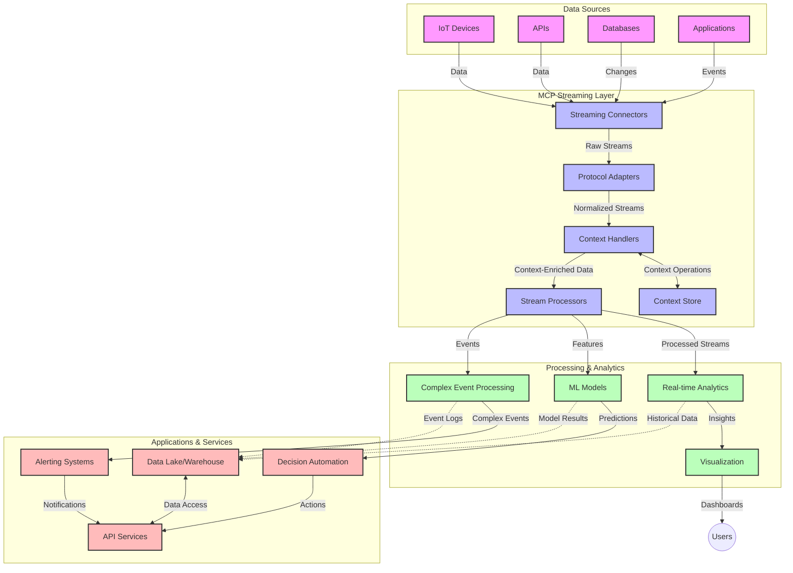

<!--
CO_OP_TRANSLATOR_METADATA:
{
  "original_hash": "195f7287638b77a549acadd96c8f981c",
  "translation_date": "2025-07-14T01:37:02+00:00",
  "source_file": "05-AdvancedTopics/mcp-realtimestreaming/README.md",
  "language_code": "pa"
}
-->
# ਮਾਡਲ ਕਾਂਟੈਕਸਟ ਪ੍ਰੋਟੋਕੋਲ ਫਾਰ ਰੀਅਲ-ਟਾਈਮ ਡੇਟਾ ਸਟ੍ਰੀਮਿੰਗ

## ਓਵਰਵਿਊ

ਅੱਜ ਦੇ ਡੇਟਾ-ਚਲਿਤ ਸੰਸਾਰ ਵਿੱਚ, ਜਿੱਥੇ ਕਾਰੋਬਾਰ ਅਤੇ ਐਪਲੀਕੇਸ਼ਨਾਂ ਨੂੰ ਸਮੇਂ ਸਿਰ ਫੈਸਲੇ ਕਰਨ ਲਈ ਤੁਰੰਤ ਜਾਣਕਾਰੀ ਦੀ ਲੋੜ ਹੁੰਦੀ ਹੈ, ਰੀਅਲ-ਟਾਈਮ ਡੇਟਾ ਸਟ੍ਰੀਮਿੰਗ ਬਹੁਤ ਜਰੂਰੀ ਹੋ ਚੁੱਕੀ ਹੈ। ਮਾਡਲ ਕਾਂਟੈਕਸਟ ਪ੍ਰੋਟੋਕੋਲ (MCP) ਇਨ੍ਹਾਂ ਰੀਅਲ-ਟਾਈਮ ਸਟ੍ਰੀਮਿੰਗ ਪ੍ਰਕਿਰਿਆਵਾਂ ਨੂੰ ਸੁਧਾਰਨ ਵਿੱਚ ਇੱਕ ਮਹੱਤਵਪੂਰਨ ਤਰੱਕੀ ਹੈ, ਜੋ ਡੇਟਾ ਪ੍ਰੋਸੈਸਿੰਗ ਦੀ ਕੁਸ਼ਲਤਾ ਵਧਾਉਂਦਾ ਹੈ, ਸੰਦਰਭ ਦੀ ਸਹੀ ਸਥਿਤੀ ਬਣਾਈ ਰੱਖਦਾ ਹੈ ਅਤੇ ਸਿਸਟਮ ਦੀ ਕੁੱਲ ਕਾਰਗੁਜ਼ਾਰੀ ਨੂੰ ਬਿਹਤਰ ਬਣਾਉਂਦਾ ਹੈ।

ਇਹ ਮੋਡੀਊਲ ਵੇਖਦਾ ਹੈ ਕਿ MCP ਕਿਵੇਂ AI ਮਾਡਲਾਂ, ਸਟ੍ਰੀਮਿੰਗ ਪਲੇਟਫਾਰਮਾਂ ਅਤੇ ਐਪਲੀਕੇਸ਼ਨਾਂ ਵਿੱਚ ਸੰਦਰਭ ਪ੍ਰਬੰਧਨ ਲਈ ਇੱਕ ਮਿਆਰੀ ਤਰੀਕਾ ਮੁਹੱਈਆ ਕਰਵਾਉਂਦਾ ਹੈ ਅਤੇ ਰੀਅਲ-ਟਾਈਮ ਡੇਟਾ ਸਟ੍ਰੀਮਿੰਗ ਨੂੰ ਬਦਲਦਾ ਹੈ।

## ਰੀਅਲ-ਟਾਈਮ ਡੇਟਾ ਸਟ੍ਰੀਮਿੰਗ ਦਾ ਪਰਿਚਯ

ਰੀਅਲ-ਟਾਈਮ ਡੇਟਾ ਸਟ੍ਰੀਮਿੰਗ ਇੱਕ ਤਕਨਾਲੋਜੀਕ ਪੈਰਾਡਾਈਮ ਹੈ ਜੋ ਡੇਟਾ ਦੇ ਲਗਾਤਾਰ ਟ੍ਰਾਂਸਫਰ, ਪ੍ਰੋਸੈਸਿੰਗ ਅਤੇ ਵਿਸ਼ਲੇਸ਼ਣ ਨੂੰ ਯਕੀਨੀ ਬਣਾਉਂਦਾ ਹੈ, ਜਿਸ ਨਾਲ ਸਿਸਟਮ ਨਵੀਂ ਜਾਣਕਾਰੀ 'ਤੇ ਤੁਰੰਤ ਪ੍ਰਤੀਕਿਰਿਆ ਕਰ ਸਕਦੇ ਹਨ। ਪਰੰਪਰਾਗਤ ਬੈਚ ਪ੍ਰੋਸੈਸਿੰਗ ਦੇ ਵਿਰੁੱਧ, ਜੋ ਸਥਿਰ ਡੇਟਾਸੈੱਟਾਂ 'ਤੇ ਕੰਮ ਕਰਦੀ ਹੈ, ਸਟ੍ਰੀਮਿੰਗ ਡੇਟਾ ਨੂੰ ਚਲਦੇ ਸਮੇਂ ਪ੍ਰੋਸੈਸ ਕਰਦੀ ਹੈ ਅਤੇ ਘੱਟ ਤੋਂ ਘੱਟ ਦੇਰੀ ਨਾਲ ਨਤੀਜੇ ਅਤੇ ਕਾਰਵਾਈਆਂ ਦਿੰਦੀ ਹੈ।

### ਰੀਅਲ-ਟਾਈਮ ਡੇਟਾ ਸਟ੍ਰੀਮਿੰਗ ਦੇ ਮੁੱਖ ਤੱਤ:

- **ਲਗਾਤਾਰ ਡੇਟਾ ਦਾ ਪ੍ਰਵਾਹ**: ਡੇਟਾ ਨੂੰ ਲਗਾਤਾਰ, ਅਨੰਤ ਘਟਨਾਵਾਂ ਜਾਂ ਰਿਕਾਰਡਾਂ ਦੇ ਸਟ੍ਰੀਮ ਵਜੋਂ ਪ੍ਰੋਸੈਸ ਕੀਤਾ ਜਾਂਦਾ ਹੈ।
- **ਘੱਟ ਦੇਰੀ ਵਾਲੀ ਪ੍ਰੋਸੈਸਿੰਗ**: ਸਿਸਟਮ ਇਸ ਤਰ੍ਹਾਂ ਬਣਾਏ ਜਾਂਦੇ ਹਨ ਕਿ ਡੇਟਾ ਬਣਨ ਅਤੇ ਪ੍ਰੋਸੈਸ ਹੋਣ ਵਿਚਕਾਰ ਦਾ ਸਮਾਂ ਘੱਟ ਤੋਂ ਘੱਟ ਹੋਵੇ।
- **ਵਿਆਪਕਤਾ**: ਸਟ੍ਰੀਮਿੰਗ ਆਰਕੀਟੈਕਚਰ ਵੱਖ-ਵੱਖ ਡੇਟਾ ਦੀ ਮਾਤਰਾ ਅਤੇ ਗਤੀ ਨੂੰ ਸੰਭਾਲ ਸਕਣ।
- **ਫਾਲਟ ਟੋਲਰੈਂਸ**: ਸਿਸਟਮ ਨੂੰ ਅਸਫਲਤਾਵਾਂ ਦੇ ਖਿਲਾਫ ਮਜ਼ਬੂਤ ਬਣਾਇਆ ਜਾਂਦਾ ਹੈ ਤਾਂ ਜੋ ਡੇਟਾ ਦਾ ਪ੍ਰਵਾਹ ਬਿਨਾਂ ਰੁਕਾਵਟ ਜਾਰੀ ਰਹੇ।
- **ਸਟੇਟਫੁਲ ਪ੍ਰੋਸੈਸਿੰਗ**: ਘਟਨਾਵਾਂ ਦੇ ਸੰਦਰਭ ਨੂੰ ਬਣਾਈ ਰੱਖਣਾ ਮਹੱਤਵਪੂਰਨ ਹੈ ਤਾਂ ਜੋ ਅਰਥਪੂਰਨ ਵਿਸ਼ਲੇਸ਼ਣ ਕੀਤਾ ਜਾ ਸਕੇ।

### ਮਾਡਲ ਕਾਂਟੈਕਸਟ ਪ੍ਰੋਟੋਕੋਲ ਅਤੇ ਰੀਅਲ-ਟਾਈਮ ਸਟ੍ਰੀਮਿੰਗ

ਮਾਡਲ ਕਾਂਟੈਕਸਟ ਪ੍ਰੋਟੋਕੋਲ (MCP) ਰੀਅਲ-ਟਾਈਮ ਸਟ੍ਰੀਮਿੰਗ ਵਾਤਾਵਰਣਾਂ ਵਿੱਚ ਕਈ ਅਹੰਕਾਰਪੂਰਨ ਚੁਣੌਤੀਆਂ ਦਾ ਹੱਲ ਕਰਦਾ ਹੈ:

1. **ਸੰਦਰਭ ਦੀ ਲਗਾਤਾਰਤਾ**: MCP ਇਹ ਮਿਆਰੀਕਰਨ ਕਰਦਾ ਹੈ ਕਿ ਕਿਵੇਂ ਵੰਡੇ ਹੋਏ ਸਟ੍ਰੀਮਿੰਗ ਹਿੱਸਿਆਂ ਵਿੱਚ ਸੰਦਰਭ ਬਣਾਈ ਰੱਖਿਆ ਜਾਵੇ, ਜਿਸ ਨਾਲ AI ਮਾਡਲਾਂ ਅਤੇ ਪ੍ਰੋਸੈਸਿੰਗ ਨੋਡਾਂ ਨੂੰ ਸਬੰਧਤ ਇਤਿਹਾਸਕ ਅਤੇ ਵਾਤਾਵਰਣਕ ਸੰਦਰਭ ਮਿਲਦਾ ਹੈ।

2. **ਕੁਸ਼ਲ ਸਟੇਟ ਪ੍ਰਬੰਧਨ**: ਸੰਦਰਭ ਟ੍ਰਾਂਸਮਿਸ਼ਨ ਲਈ ਢਾਂਚਾਬੱਧ ਤਰੀਕੇ ਮੁਹੱਈਆ ਕਰਕੇ, MCP ਸਟ੍ਰੀਮਿੰਗ ਪਾਈਪਲਾਈਨਾਂ ਵਿੱਚ ਸਟੇਟ ਪ੍ਰਬੰਧਨ ਦਾ ਬੋਝ ਘਟਾਉਂਦਾ ਹੈ।

3. **ਇੰਟਰਓਪਰੇਬਿਲਿਟੀ**: MCP ਵੱਖ-ਵੱਖ ਸਟ੍ਰੀਮਿੰਗ ਤਕਨਾਲੋਜੀਆਂ ਅਤੇ AI ਮਾਡਲਾਂ ਵਿਚਕਾਰ ਸੰਦਰਭ ਸਾਂਝਾ ਕਰਨ ਲਈ ਇੱਕ ਸਾਂਝੀ ਭਾਸ਼ਾ ਬਣਾਉਂਦਾ ਹੈ, ਜਿਸ ਨਾਲ ਜ਼ਿਆਦਾ ਲਚਕੀਲੇ ਅਤੇ ਵਧੇਰੇ ਵਿਕਸਤ ਆਰਕੀਟੈਕਚਰ ਬਣਾਉਣ ਯੋਗ ਹੁੰਦੇ ਹਨ।

4. **ਸਟ੍ਰੀਮਿੰਗ ਲਈ ਅਨੁਕੂਲ ਸੰਦਰਭ**: MCP ਲਾਗੂ ਕਰਨ ਵਾਲੇ ਇਹ ਤੈਅ ਕਰ ਸਕਦੇ ਹਨ ਕਿ ਕਿਹੜੇ ਸੰਦਰਭ ਤੱਤ ਰੀਅਲ-ਟਾਈਮ ਫੈਸਲੇ ਲਈ ਸਭ ਤੋਂ ਜ਼ਿਆਦਾ ਮਹੱਤਵਪੂਰਨ ਹਨ, ਜਿਸ ਨਾਲ ਕਾਰਗੁਜ਼ਾਰੀ ਅਤੇ ਸਹੀਤਾ ਦੋਹਾਂ ਵਿੱਚ ਸੁਧਾਰ ਹੁੰਦਾ ਹੈ।

5. **ਅਨੁਕੂਲ ਪ੍ਰੋਸੈਸਿੰਗ**: MCP ਰਾਹੀਂ ਸਹੀ ਸੰਦਰਭ ਪ੍ਰਬੰਧਨ ਨਾਲ, ਸਟ੍ਰੀਮਿੰਗ ਸਿਸਟਮ ਡੇਟਾ ਵਿੱਚ ਬਦਲਦੇ ਹਾਲਾਤਾਂ ਅਤੇ ਰੁਝਾਨਾਂ ਦੇ ਅਧਾਰ 'ਤੇ ਪ੍ਰੋਸੈਸਿੰਗ ਨੂੰ ਗਤੀਸ਼ੀਲ ਤਰੀਕੇ ਨਾਲ ਅਨੁਕੂਲਿਤ ਕਰ ਸਕਦੇ ਹਨ।

ਆਧੁਨਿਕ ਐਪਲੀਕੇਸ਼ਨਾਂ ਵਿੱਚ, ਜਿਵੇਂ ਕਿ IoT ਸੈਂਸਰ ਨੈੱਟਵਰਕ ਤੋਂ ਲੈ ਕੇ ਵਿੱਤੀ ਵਪਾਰ ਪਲੇਟਫਾਰਮਾਂ ਤੱਕ, MCP ਦਾ ਸਟ੍ਰੀਮਿੰਗ ਤਕਨਾਲੋਜੀਆਂ ਨਾਲ ਇੰਟਿਗ੍ਰੇਸ਼ਨ ਹੋਰ ਬੁੱਧੀਮਾਨ, ਸੰਦਰਭ-ਜਾਣੂ ਪ੍ਰੋਸੈਸਿੰਗ ਨੂੰ ਯਕੀਨੀ ਬਣਾਉਂਦਾ ਹੈ ਜੋ ਜਟਿਲ ਅਤੇ ਬਦਲਦੇ ਹਾਲਾਤਾਂ ਵਿੱਚ ਸਮੇਂ ਸਿਰ ਸਹੀ ਪ੍ਰਤੀਕਿਰਿਆ ਦੇ ਸਕਦਾ ਹੈ।

## ਸਿੱਖਣ ਦੇ ਉਦੇਸ਼

ਇਸ ਪਾਠ ਦੇ ਅੰਤ ਤੱਕ, ਤੁਸੀਂ ਸਮਰੱਥ ਹੋਵੋਗੇ:

- ਰੀਅਲ-ਟਾਈਮ ਡੇਟਾ ਸਟ੍ਰੀਮਿੰਗ ਦੇ ਮੂਲ ਤੱਤਾਂ ਅਤੇ ਚੁਣੌਤੀਆਂ ਨੂੰ ਸਮਝਣਾ
- ਸਮਝਾਉਣਾ ਕਿ ਮਾਡਲ ਕਾਂਟੈਕਸਟ ਪ੍ਰੋਟੋਕੋਲ (MCP) ਕਿਵੇਂ ਰੀਅਲ-ਟਾਈਮ ਡੇਟਾ ਸਟ੍ਰੀਮਿੰਗ ਨੂੰ ਬਿਹਤਰ ਬਣਾਉਂਦਾ ਹੈ
- ਪ੍ਰਸਿੱਧ ਫਰੇਮਵਰਕਾਂ ਜਿਵੇਂ Kafka ਅਤੇ Pulsar ਦੀ ਵਰਤੋਂ ਕਰਕੇ MCP-ਆਧਾਰਿਤ ਸਟ੍ਰੀਮਿੰਗ ਹੱਲ ਲਾਗੂ ਕਰਨਾ
- MCP ਨਾਲ ਫਾਲਟ-ਟੋਲਰੈਂਟ, ਉੱਚ-ਕਾਰਗੁਜ਼ਾਰੀ ਵਾਲੀਆਂ ਸਟ੍ਰੀਮਿੰਗ ਆਰਕੀਟੈਕਚਰਾਂ ਦਾ ਡਿਜ਼ਾਈਨ ਅਤੇ ਤਾਇਨਾਤੀ ਕਰਨਾ
- MCP ਸੰਕਲਪਾਂ ਨੂੰ IoT, ਵਿੱਤੀ ਵਪਾਰ ਅਤੇ AI-ਚਲਿਤ ਵਿਸ਼ਲੇਸ਼ਣ ਦੇ ਕੇਸਾਂ ਵਿੱਚ ਲਾਗੂ ਕਰਨਾ
- MCP-ਆਧਾਰਿਤ ਸਟ੍ਰੀਮਿੰਗ ਤਕਨਾਲੋਜੀਆਂ ਵਿੱਚ ਉਭਰਦੇ ਰੁਝਾਨਾਂ ਅਤੇ ਭਵਿੱਖੀ ਨਵੀਨਤਾਵਾਂ ਦਾ ਮੁਲਾਂਕਣ ਕਰਨਾ

### ਪਰਿਭਾਸ਼ਾ ਅਤੇ ਮਹੱਤਵ

ਰੀਅਲ-ਟਾਈਮ ਡੇਟਾ ਸਟ੍ਰੀਮਿੰਗ ਵਿੱਚ ਘੱਟ ਤੋਂ ਘੱਟ ਦੇਰੀ ਨਾਲ ਡੇਟਾ ਦੀ ਲਗਾਤਾਰ ਪੈਦਾਵਾਰ, ਪ੍ਰੋਸੈਸਿੰਗ ਅਤੇ ਡਿਲਿਵਰੀ ਸ਼ਾਮਲ ਹੈ। ਬੈਚ ਪ੍ਰੋਸੈਸਿੰਗ ਦੇ ਵਿਰੁੱਧ, ਜਿੱਥੇ ਡੇਟਾ ਨੂੰ ਸਮੂਹਾਂ ਵਿੱਚ ਇਕੱਠਾ ਕਰਕੇ ਪ੍ਰੋਸੈਸ ਕੀਤਾ ਜਾਂਦਾ ਹੈ, ਸਟ੍ਰੀਮਿੰਗ ਡੇਟਾ ਨੂੰ ਜਿਵੇਂ ਜਿਵੇਂ ਮਿਲਦਾ ਹੈ ਤਿਵੇਂ ਪ੍ਰੋਸੈਸ ਕੀਤਾ ਜਾਂਦਾ ਹੈ, ਜਿਸ ਨਾਲ ਤੁਰੰਤ ਜਾਣਕਾਰੀ ਅਤੇ ਕਾਰਵਾਈਆਂ ਸੰਭਵ ਹੁੰਦੀਆਂ ਹਨ।

ਰੀਅਲ-ਟਾਈਮ ਡੇਟਾ ਸਟ੍ਰੀਮਿੰਗ ਦੀਆਂ ਮੁੱਖ ਵਿਸ਼ੇਸ਼ਤਾਵਾਂ:

- **ਘੱਟ ਦੇਰੀ**: ਡੇਟਾ ਨੂੰ ਮਿਲੀਸੈਕਿੰਡ ਤੋਂ ਸਕਿੰਡਾਂ ਦੇ ਅੰਦਰ ਪ੍ਰੋਸੈਸ ਅਤੇ ਵਿਸ਼ਲੇਸ਼ਣ ਕਰਨਾ
- **ਲਗਾਤਾਰ ਪ੍ਰਵਾਹ**: ਵੱਖ-ਵੱਖ ਸਰੋਤਾਂ ਤੋਂ ਬਿਨਾਂ ਰੁਕਾਵਟ ਦੇ ਡੇਟਾ ਦੇ ਸਟ੍ਰੀਮ
- **ਤੁਰੰਤ ਪ੍ਰੋਸੈਸਿੰਗ**: ਡੇਟਾ ਨੂੰ ਬੈਚਾਂ ਵਿੱਚ ਨਹੀਂ, ਜਿਵੇਂ ਜਿਵੇਂ ਆਉਂਦਾ ਹੈ ਤਿਵੇਂ ਵਿਸ਼ਲੇਸ਼ਣ ਕਰਨਾ
- **ਘਟਨਾ-ਚਲਿਤ ਆਰਕੀਟੈਕਚਰ**: ਜਿਵੇਂ ਜਿਵੇਂ ਘਟਨਾਵਾਂ ਹੁੰਦੀਆਂ ਹਨ, ਉਨ੍ਹਾਂ 'ਤੇ ਤੁਰੰਤ ਪ੍ਰਤੀਕਿਰਿਆ ਕਰਨਾ

### ਪਰੰਪਰਾਗਤ ਡੇਟਾ ਸਟ੍ਰੀਮਿੰਗ ਵਿੱਚ ਚੁਣੌਤੀਆਂ

ਪਰੰਪਰਾਗਤ ਡੇਟਾ ਸਟ੍ਰੀਮਿੰਗ ਤਰੀਕਿਆਂ ਨੂੰ ਕਈ ਸੀਮਾਵਾਂ ਦਾ ਸਾਹਮਣਾ ਕਰਨਾ ਪੈਂਦਾ ਹੈ:

1. **ਸੰਦਰਭ ਦਾ ਨੁਕਸਾਨ**: ਵੰਡੇ ਹੋਏ ਸਿਸਟਮਾਂ ਵਿੱਚ ਸੰਦਰਭ ਬਣਾਈ ਰੱਖਣ ਵਿੱਚ ਮੁਸ਼ਕਲ
2. **ਵਿਆਪਕਤਾ ਦੀਆਂ ਸਮੱਸਿਆਵਾਂ**: ਵੱਡੀ ਮਾਤਰਾ ਅਤੇ ਤੇਜ਼ ਗਤੀ ਵਾਲੇ ਡੇਟਾ ਨੂੰ ਸੰਭਾਲਣ ਵਿੱਚ ਚੁਣੌਤੀਆਂ
3. **ਇੰਟੀਗ੍ਰੇਸ਼ਨ ਦੀ ਜਟਿਲਤਾ**: ਵੱਖ-ਵੱਖ ਸਿਸਟਮਾਂ ਵਿਚਕਾਰ ਇੰਟਰਓਪਰੇਬਿਲਿਟੀ ਦੀ ਸਮੱਸਿਆ
4. **ਦੇਰੀ ਪ੍ਰਬੰਧਨ**: ਪ੍ਰੋਸੈਸਿੰਗ ਸਮੇਂ ਅਤੇ ਥਰੂਪੁੱਟ ਵਿਚਕਾਰ ਸੰਤੁਲਨ ਬਣਾਉਣਾ
5. **ਡੇਟਾ ਸਥਿਰਤਾ**: ਸਟ੍ਰੀਮ ਵਿੱਚ ਡੇਟਾ ਦੀ ਸਹੀਤਾ ਅਤੇ ਪੂਰਨਤਾ ਨੂੰ ਯਕੀਨੀ ਬਣਾਉਣਾ

## ਮਾਡਲ ਕਾਂਟੈਕਸਟ ਪ੍ਰੋਟੋਕੋਲ (MCP) ਨੂੰ ਸਮਝਣਾ

### MCP ਕੀ ਹੈ?

ਮਾਡਲ ਕਾਂਟੈਕਸਟ ਪ੍ਰੋਟੋਕੋਲ (MCP) ਇੱਕ ਮਿਆਰੀਕ੍ਰਿਤ ਸੰਚਾਰ ਪ੍ਰੋਟੋਕੋਲ ਹੈ ਜੋ AI ਮਾਡਲਾਂ ਅਤੇ ਐਪਲੀਕੇਸ਼ਨਾਂ ਵਿਚਕਾਰ ਪ੍ਰਭਾਵਸ਼ਾਲੀ ਇੰਟਰੈਕਸ਼ਨ ਨੂੰ ਸਹੂਲਤ ਦਿੰਦਾ ਹੈ। ਰੀਅਲ-ਟਾਈਮ ਡੇਟਾ ਸਟ੍ਰੀਮਿੰਗ ਦੇ ਸੰਦਰਭ ਵਿੱਚ, MCP ਇਹ ਫਰੇਮਵਰਕ ਮੁਹੱਈਆ ਕਰਵਾਉਂਦਾ ਹੈ:

- ਡੇਟਾ ਪਾਈਪਲਾਈਨ ਵਿੱਚ ਸੰਦਰਭ ਨੂੰ ਸੁਰੱਖਿਅਤ ਰੱਖਣਾ
- ਡੇਟਾ ਐਕਸਚੇਂਜ ਫਾਰਮੈਟਾਂ ਨੂੰ ਮਿਆਰੀਕ੍ਰਿਤ ਕਰਨਾ
- ਵੱਡੇ ਡੇਟਾਸੈੱਟਾਂ ਦੇ ਪ੍ਰਸਾਰਣ ਨੂੰ ਸੁਧਾਰਨਾ
- ਮਾਡਲ-ਟੂ-ਮਾਡਲ ਅਤੇ ਮਾਡਲ-ਟੂ-ਐਪਲੀਕੇਸ਼ਨ ਸੰਚਾਰ ਨੂੰ ਬਿਹਤਰ ਬਣਾਉਣਾ

### ਮੁੱਖ ਘਟਕ ਅਤੇ ਆਰਕੀਟੈਕਚਰ

ਰੀਅਲ-ਟਾਈਮ ਸਟ੍ਰੀਮਿੰਗ ਲਈ MCP ਆਰਕੀਟੈਕਚਰ ਵਿੱਚ ਕਈ ਮੁੱਖ ਹਿੱਸੇ ਸ਼ਾਮਲ ਹਨ:

1. **ਕਾਂਟੈਕਸਟ ਹੈਂਡਲਰ**: ਸਟ੍ਰੀਮਿੰਗ ਪਾਈਪਲਾਈਨ ਵਿੱਚ ਸੰਦਰਭਕ ਜਾਣਕਾਰੀ ਦਾ ਪ੍ਰਬੰਧ ਅਤੇ ਸੰਭਾਲ
2. **ਸਟ੍ਰੀਮ ਪ੍ਰੋਸੈਸਰ**: ਸੰਦਰਭ-ਜਾਣੂ ਤਕਨੀਕਾਂ ਨਾਲ ਆਉਣ ਵਾਲੇ ਡੇਟਾ ਸਟ੍ਰੀਮਾਂ ਨੂੰ ਪ੍ਰੋਸੈਸ ਕਰਨਾ
3. **ਪ੍ਰੋਟੋਕੋਲ ਐਡਾਪਟਰ**: ਵੱਖ-ਵੱਖ ਸਟ੍ਰੀਮਿੰਗ ਪ੍ਰੋਟੋਕੋਲਾਂ ਵਿਚਕਾਰ ਬਦਲਾਅ ਕਰਦੇ ਹੋਏ ਸੰਦਰਭ ਨੂੰ ਸੁਰੱਖਿਅਤ ਰੱਖਣਾ
4. **ਕਾਂਟੈਕਸਟ ਸਟੋਰ**: ਸੰਦਰਭਕ ਜਾਣਕਾਰੀ ਨੂੰ ਪ੍ਰਭਾਵਸ਼ਾਲੀ ਢੰਗ ਨਾਲ ਸਟੋਰ ਅਤੇ ਪ੍ਰਾਪਤ ਕਰਨਾ
5. **ਸਟ੍ਰੀਮਿੰਗ ਕਨੈਕਟਰ**: ਵੱਖ-ਵੱਖ ਸਟ੍ਰੀਮਿੰਗ ਪਲੇਟਫਾਰਮਾਂ (Kafka, Pulsar, Kinesis ਆਦਿ) ਨਾਲ ਜੁੜਨਾ

### MCP ਕਿਵੇਂ ਰੀਅਲ-ਟਾਈਮ ਡੇਟਾ ਹੈਂਡਲਿੰਗ ਨੂੰ ਸੁਧਾਰਦਾ ਹੈ

MCP ਪਰੰਪਰਾਗਤ ਸਟ੍ਰੀਮਿੰਗ ਚੁਣੌਤੀਆਂ ਦਾ ਹੱਲ ਕਰਦਾ ਹੈ:

- **ਸੰਦਰਭਕ ਅਖੰਡਤਾ**: ਪੂਰੀ ਪਾਈਪਲਾਈਨ ਵਿੱਚ ਡੇਟਾ ਪੌਇੰਟਾਂ ਦੇ ਰਿਸ਼ਤੇ ਬਣਾਈ ਰੱਖਣਾ
- **ਸੁਧਾਰਿਆ ਪ੍ਰਸਾਰਣ**: ਬੁੱਧੀਮਾਨ ਸੰਦਰਭ ਪ੍ਰਬੰਧਨ ਰਾਹੀਂ ਡੇਟਾ ਐਕਸਚੇਂਜ ਵਿੱਚ ਦੁਹਰਾਵਟ ਘਟਾਉਣਾ
- **ਮਿਆਰੀਕ੍ਰਿਤ ਇੰਟਰਫੇਸ**: ਸਟ੍ਰੀਮਿੰਗ ਹਿੱਸਿਆਂ ਲਈ ਸਥਿਰ APIs ਮੁਹੱਈਆ ਕਰਵਾਉਣਾ
- **ਘੱਟ ਦੇਰੀ**: ਪ੍ਰਭਾਵਸ਼ਾਲੀ ਸੰਦਰਭ ਹੈਂਡਲਿੰਗ ਰਾਹੀਂ ਪ੍ਰੋਸੈਸਿੰਗ ਬੋਝ ਘਟਾਉਣਾ
- **ਵਧੀਕ ਵਿਆਪਕਤਾ**: ਸੰਦਰਭ ਨੂੰ ਸੁਰੱਖਿਅਤ ਰੱਖਦੇ ਹੋਏ ਹੋਰਾਈਜ਼ੌਂਟਲ ਸਕੇਲਿੰਗ ਦਾ ਸਮਰਥਨ

## ਇੰਟੀਗ੍ਰੇਸ਼ਨ ਅਤੇ ਲਾਗੂ ਕਰਨ ਦੀ ਪ੍ਰਕਿਰਿਆ

ਰੀਅਲ-ਟਾਈਮ ਡੇਟਾ ਸਟ੍ਰੀਮਿੰਗ ਸਿਸਟਮਾਂ ਨੂੰ ਕਾਰਗੁਜ਼ਾਰੀ ਅਤੇ ਸੰਦਰਭਕ ਅਖੰਡਤਾ ਦੋਹਾਂ ਨੂੰ ਬਣਾਈ ਰੱਖਣ ਲਈ ਧਿਆਨਪੂਰਵਕ ਆਰਕੀਟੈਕਚਰਲ ਡਿਜ਼ਾਈਨ ਅਤੇ ਲਾਗੂ ਕਰਨ ਦੀ ਲੋੜ ਹੁੰਦੀ ਹੈ। ਮਾਡਲ ਕਾਂਟੈਕਸਟ ਪ੍ਰੋਟੋਕੋਲ AI ਮਾਡਲਾਂ ਅਤੇ ਸਟ੍ਰੀਮਿੰਗ ਤਕਨਾਲੋਜੀਆਂ ਨੂੰ ਜੋੜਨ ਲਈ ਇੱਕ ਮਿਆਰੀਕ੍ਰਿਤ ਤਰੀਕਾ ਦਿੰਦਾ ਹੈ, ਜਿਸ ਨਾਲ ਹੋਰ ਸੁਧਰੇ ਹੋਏ, ਸੰਦਰਭ-ਜਾਣੂ ਪ੍ਰੋਸੈਸਿੰਗ ਪਾਈਪਲਾਈਨਾਂ ਬਣਾਈਆਂ ਜਾ ਸਕਦੀਆਂ ਹਨ।

### ਸਟ੍ਰੀਮਿੰਗ ਆਰਕੀਟੈਕਚਰਾਂ ਵਿੱਚ MCP ਇੰਟੀਗ੍ਰੇਸ਼ਨ ਦਾ ਓਵਰਵਿਊ

ਰੀਅਲ-ਟਾਈਮ ਸਟ੍ਰੀਮਿੰਗ ਵਾਤਾਵਰਣਾਂ ਵਿੱਚ MCP ਲਾਗੂ ਕਰਨ ਲਈ ਕੁਝ ਮੁੱਖ ਗੱਲਾਂ ਦਾ ਧਿਆਨ ਰੱਖਣਾ ਪੈਂਦਾ ਹੈ:

1. **ਸੰਦਰਭ ਸਿਰੀਅਲਾਈਜ਼ੇਸ਼ਨ ਅਤੇ ਟ੍ਰਾਂਸਪੋਰਟ**: MCP ਸਟ੍ਰੀਮਿੰਗ ਡੇਟਾ ਪੈਕੇਟਾਂ ਵਿੱਚ ਸੰਦਰਭਕ ਜਾਣਕਾਰੀ ਨੂੰ ਕੋਡ ਕਰਨ ਲਈ ਪ੍ਰਭਾਵਸ਼ਾਲੀ ਤਰੀਕੇ ਦਿੰਦਾ ਹੈ, ਇਹ ਯਕੀਨੀ ਬਣਾਉਂਦਾ ਹੈ ਕਿ ਜਰੂਰੀ ਸੰਦਰਭ ਡੇਟਾ ਪ੍ਰੋਸੈਸਿੰਗ ਪਾਈਪਲਾਈਨ ਵਿੱਚ ਸਾਰਾ ਸਮਾਂ ਨਾਲ ਚੱਲਦਾ ਰਹੇ। ਇਸ ਵਿੱਚ ਸਟ੍ਰੀਮਿੰਗ ਟ੍ਰਾਂਸਪੋਰਟ ਲਈ ਮਿਆਰੀਕ੍ਰਿਤ ਸਿਰੀਅਲਾਈਜ਼ੇਸ਼ਨ ਫਾਰਮੈਟ ਸ਼ਾਮਲ ਹਨ।

2. **ਸਟੇਟਫੁਲ ਸਟ੍ਰੀਮ ਪ੍ਰੋਸੈਸਿੰਗ**: MCP ਸੰਦਰਭ ਦੀ ਲਗਾਤਾਰ ਪ੍ਰਤੀਨਿਧਤਾ ਬਣਾਈ ਰੱਖ ਕੇ ਹੋਰ ਬੁੱਧੀਮਾਨ ਸਟੇਟਫੁਲ ਪ੍ਰੋਸੈਸਿੰਗ ਨੂੰ ਯੋਗ ਬਣਾਉਂਦਾ ਹੈ। ਇਹ ਖਾਸ ਕਰਕੇ ਵੰਡੇ ਹੋਏ ਸਟ੍ਰੀਮਿੰਗ ਆਰਕੀਟੈਕਚਰਾਂ ਵਿੱਚ ਮਹੱਤਵਪੂਰਨ ਹੈ ਜਿੱਥੇ ਸਟੇਟ ਪ੍ਰਬੰਧਨ ਮੁਸ਼ਕਲ ਹੁੰਦਾ ਹੈ।

3. **ਘਟਨਾ-ਸਮਾਂ ਵਿਰੁੱਧ ਪ੍ਰੋਸੈਸਿੰਗ-ਸਮਾਂ**: MCP ਲਾਗੂ ਕਰਨ ਵਾਲੇ ਸਿਸਟਮਾਂ ਨੂੰ ਇਹ ਚੁਣੌਤੀ ਹੱਲ ਕਰਨੀ ਪੈਂਦੀ ਹੈ ਕਿ ਘਟਨਾਵਾਂ ਕਦੋਂ ਹੋਈਆਂ ਅਤੇ ਉਹ ਕਦੋਂ ਪ੍ਰੋਸੈਸ ਕੀਤੀਆਂ ਗਈਆਂ। ਪ੍ਰੋਟੋਕੋਲ ਸਮੇਂਕ ਸੰਦਰਭ ਸ਼ਾਮਲ ਕਰ ਸਕਦਾ ਹੈ ਜੋ ਘਟਨਾ ਸਮੇਂ ਦੀ ਸਹੀ ਸਮਝ ਦਿੰਦਾ ਹੈ।

4. **ਬੈਕਪ੍ਰੈਸ਼ਰ ਪ੍ਰਬੰਧਨ**: MCP ਸੰਦਰਭ ਹੈਂਡਲਿੰਗ ਨੂੰ ਮਿਆਰੀਕ੍ਰਿਤ ਕਰਕੇ ਸਟ੍ਰੀਮਿੰਗ ਸਿਸਟਮਾਂ

**ਅਸਵੀਕਾਰੋਪਣ**:  
ਇਹ ਦਸਤਾਵੇਜ਼ AI ਅਨੁਵਾਦ ਸੇਵਾ [Co-op Translator](https://github.com/Azure/co-op-translator) ਦੀ ਵਰਤੋਂ ਕਰਕੇ ਅਨੁਵਾਦਿਤ ਕੀਤਾ ਗਿਆ ਹੈ। ਜਦੋਂ ਕਿ ਅਸੀਂ ਸਹੀਤਾ ਲਈ ਕੋਸ਼ਿਸ਼ ਕਰਦੇ ਹਾਂ, ਕਿਰਪਾ ਕਰਕੇ ਧਿਆਨ ਰੱਖੋ ਕਿ ਸਵੈਚਾਲਿਤ ਅਨੁਵਾਦਾਂ ਵਿੱਚ ਗਲਤੀਆਂ ਜਾਂ ਅਸਮਰਥਤਾਵਾਂ ਹੋ ਸਕਦੀਆਂ ਹਨ। ਮੂਲ ਦਸਤਾਵੇਜ਼ ਆਪਣੀ ਮੂਲ ਭਾਸ਼ਾ ਵਿੱਚ ਪ੍ਰਮਾਣਿਕ ਸਰੋਤ ਮੰਨਿਆ ਜਾਣਾ ਚਾਹੀਦਾ ਹੈ। ਮਹੱਤਵਪੂਰਨ ਜਾਣਕਾਰੀ ਲਈ, ਪੇਸ਼ੇਵਰ ਮਨੁੱਖੀ ਅਨੁਵਾਦ ਦੀ ਸਿਫਾਰਸ਼ ਕੀਤੀ ਜਾਂਦੀ ਹੈ। ਅਸੀਂ ਇਸ ਅਨੁਵਾਦ ਦੀ ਵਰਤੋਂ ਤੋਂ ਉਤਪੰਨ ਕਿਸੇ ਵੀ ਗਲਤਫਹਿਮੀ ਜਾਂ ਗਲਤ ਵਿਆਖਿਆ ਲਈ ਜ਼ਿੰਮੇਵਾਰ ਨਹੀਂ ਹਾਂ।