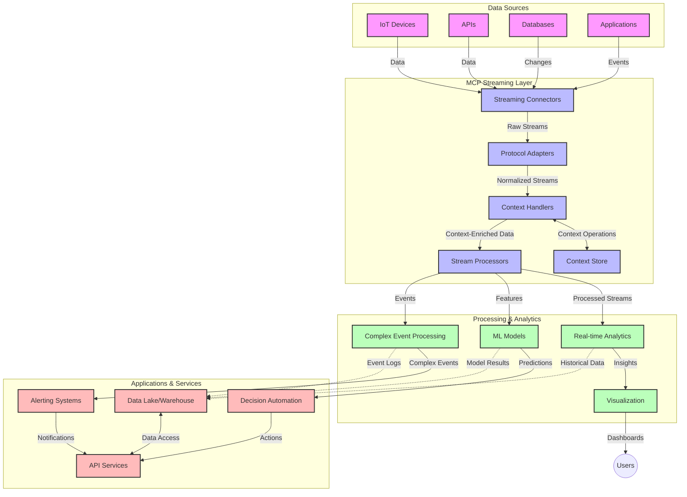

<!--
CO_OP_TRANSLATOR_METADATA:
{
  "original_hash": "b41174ac781ebf228b2043cbdfc09105",
  "translation_date": "2025-06-12T00:28:12+00:00",
  "source_file": "05-AdvancedTopics/mcp-realtimestreaming/README.md",
  "language_code": "pa"
}
-->
# ਮਾਡਲ ਸੰਦਰਭ ਪ੍ਰੋਟੋਕੋਲ ਰੀਅਲ-ਟਾਈਮ ਡੇਟਾ ਸਟ੍ਰੀਮਿੰਗ ਲਈ

## ਝਲਕ

ਰੀਅਲ-ਟਾਈਮ ਡੇਟਾ ਸਟ੍ਰੀਮਿੰਗ ਅੱਜ ਦੇ ਡੇਟਾ-ਚਲਿਤ ਸੰਸਾਰ ਵਿੱਚ ਬਹੁਤ ਜਰੂਰੀ ਹੋ ਚੁੱਕੀ ਹੈ, ਜਿੱਥੇ ਕਾਰੋਬਾਰ ਅਤੇ ਐਪਲੀਕੇਸ਼ਨ ਤੁਰੰਤ ਜਾਣਕਾਰੀ ਤੱਕ ਪਹੁੰਚ ਦੀ ਲੋੜ ਰੱਖਦੇ ਹਨ ਤਾਂ ਜੋ ਸਮੇਂ ਸਿਰ ਫੈਸਲੇ ਲਏ ਜਾ ਸਕਣ। ਮਾਡਲ ਸੰਦਰਭ ਪ੍ਰੋਟੋਕੋਲ (MCP) ਇਨ੍ਹਾਂ ਰੀਅਲ-ਟਾਈਮ ਸਟ੍ਰੀਮਿੰਗ ਪ੍ਰਕਿਰਿਆਵਾਂ ਨੂੰ ਸੁਧਾਰਨ ਵਿੱਚ ਇੱਕ ਮਹੱਤਵਪੂਰਨ ਤਰੱਕੀ ਦਰਸਾਉਂਦਾ ਹੈ, ਡੇਟਾ ਪ੍ਰੋਸੈਸਿੰਗ ਦੀ ਕੁਸ਼ਲਤਾ ਵਧਾਉਂਦਾ ਹੈ, ਸੰਦਰਭਿਕ ਅਖੰਡਤਾ ਬਣਾਈ ਰੱਖਦਾ ਹੈ ਅਤੇ ਕੁੱਲ ਪ੍ਰਣਾਲੀ ਦੀ ਕਾਰਗੁਜ਼ਾਰੀ ਨੂੰ ਸੁਧਾਰਦਾ ਹੈ।

ਇਹ ਮਾਡਿਊਲ ਵੇਖਦਾ ਹੈ ਕਿ MCP ਕਿਵੇਂ ਰੀਅਲ-ਟਾਈਮ ਡੇਟਾ ਸਟ੍ਰੀਮਿੰਗ ਨੂੰ ਬਦਲਦਾ ਹੈ, AI ਮਾਡਲਾਂ, ਸਟ੍ਰੀਮਿੰਗ ਪਲੇਟਫਾਰਮਾਂ ਅਤੇ ਐਪਲੀਕੇਸ਼ਨਾਂ ਵਿੱਚ ਸੰਦਰਭ ਪ੍ਰਬੰਧਨ ਲਈ ਇੱਕ ਮਿਆਰੀ ਤਰੀਕਾ ਮੁਹੱਈਆ ਕਰਵਾਉਂਦਾ ਹੈ।

## ਰੀਅਲ-ਟਾਈਮ ਡੇਟਾ ਸਟ੍ਰੀਮਿੰਗ ਦਾ ਪਰਚਾਰ

ਰੀਅਲ-ਟਾਈਮ ਡੇਟਾ ਸਟ੍ਰੀਮਿੰਗ ਇੱਕ ਤਕਨਾਲੋਜੀਕ ਪੈਰਾਡਾਈਮ ਹੈ ਜੋ ਡੇਟਾ ਦੇ ਲਗਾਤਾਰ ਟਰਾਂਸਫਰ, ਪ੍ਰੋਸੈਸਿੰਗ ਅਤੇ ਵਿਸ਼ਲੇਸ਼ਣ ਨੂੰ ਯਕੀਨੀ ਬਣਾਉਂਦਾ ਹੈ ਜਿਵੇਂ ਹੀ ਇਹ ਬਣਦਾ ਹੈ, ਇਸ ਨਾਲ ਸਿਸਟਮ ਤੁਰੰਤ ਨਵੀਂ ਜਾਣਕਾਰੀ 'ਤੇ ਪ੍ਰਤੀਕਿਰਿਆ ਕਰ ਸਕਦੇ ਹਨ। ਪੁਰਾਣੀ ਬੈਚ ਪ੍ਰੋਸੈਸਿੰਗ ਦੇ ਵਿਰੁੱਧ, ਜੋ ਸਥਿਰ ਡੇਟਾ ਸੈੱਟਾਂ 'ਤੇ ਕੰਮ ਕਰਦੀ ਹੈ, ਸਟ੍ਰੀਮਿੰਗ ਡੇਟਾ ਨੂੰ ਚੱਲਦੇ ਸਮੇਂ ਪ੍ਰੋਸੈਸ ਕਰਦਾ ਹੈ, ਘੱਟ ਤੋਂ ਘੱਟ ਦੇਰੀ ਨਾਲ ਸੂਝ-ਬੂਝ ਅਤੇ ਕਾਰਵਾਈ ਮੁਹੱਈਆ ਕਰਦਾ ਹੈ।

### ਰੀਅਲ-ਟਾਈਮ ਡੇਟਾ ਸਟ੍ਰੀਮਿੰਗ ਦੇ ਮੁੱਖ ਸਿਧਾਂਤ:

- **ਲਗਾਤਾਰ ਡੇਟਾ ਫਲੋ**: ਡੇਟਾ ਇੱਕ ਲਗਾਤਾਰ, ਅਨੰਤ ਸਟ੍ਰੀਮ ਵਜੋਂ ਪ੍ਰੋਸੈਸ ਹੁੰਦਾ ਹੈ।
- **ਘੱਟ ਦੇਰੀ ਵਾਲੀ ਪ੍ਰੋਸੈਸਿੰਗ**: ਸਿਸਟਮ ਡੇਟਾ ਬਣਨ ਅਤੇ ਪ੍ਰੋਸੈਸਿੰਗ ਵਿਚਕਾਰ ਸਮਾਂ ਘੱਟ ਕਰਨ ਲਈ ਬਣਾਏ ਜਾਂਦੇ ਹਨ।
- **ਵਿਆਪਕਤਾ**: ਸਟ੍ਰੀਮਿੰਗ ਆਰਕੀਟੈਕਚਰ ਵੱਖ-ਵੱਖ ਡੇਟਾ ਮਾਤਰਾ ਅਤੇ ਗਤੀ ਨੂੰ ਸੰਭਾਲ ਸਕਦੇ ਹਨ।
- **ਫੌਲਟ ਟੋਲਰੈਂਸ**: ਸਿਸਟਮ ਨੂੰ ਅਸਫਲਤਾਵਾਂ ਦੇ ਵਿਰੁੱਧ ਲਚਕੀਲਾ ਹੋਣਾ ਚਾਹੀਦਾ ਹੈ ਤਾਂ ਜੋ ਡੇਟਾ ਦਾ ਲਗਾਤਾਰ ਪ੍ਰਵਾਹ ਜਾਰੀ ਰਹੇ।
- **ਸਟੇਟਫੁਲ ਪ੍ਰੋਸੈਸਿੰਗ**: ਘਟਨਾਵਾਂ ਵਿਚ ਸੰਦਰਭ ਬਣਾਈ ਰੱਖਣਾ ਮਤਲਬਪੂਰਨ ਵਿਸ਼ਲੇਸ਼ਣ ਲਈ ਜ਼ਰੂਰੀ ਹੈ।

### ਮਾਡਲ ਸੰਦਰਭ ਪ੍ਰੋਟੋਕੋਲ ਅਤੇ ਰੀਅਲ-ਟਾਈਮ ਸਟ੍ਰੀਮਿੰਗ

ਮਾਡਲ ਸੰਦਰਭ ਪ੍ਰੋਟੋਕੋਲ (MCP) ਰੀਅਲ-ਟਾਈਮ ਸਟ੍ਰੀਮਿੰਗ ਮਾਹੌਲਾਂ ਵਿੱਚ ਕਈ ਮੁੱਖ ਚੁਣੌਤੀਆਂ ਦਾ ਹੱਲ ਪੇਸ਼ ਕਰਦਾ ਹੈ:

1. **ਸੰਦਰਭਿਕ ਲਗਾਤਾਰਤਾ**: MCP ਇਹ ਮਿਆਰੀਕ੍ਰਿਤ ਕਰਦਾ ਹੈ ਕਿ ਕਿਵੇਂ ਸੰਦਰਭ ਵੰਡੇ ਹੋਏ ਸਟ੍ਰੀਮਿੰਗ ਹਿੱਸਿਆਂ ਵਿੱਚ ਬਣਾਇਆ ਰੱਖਿਆ ਜਾਵੇ, ਯਕੀਨੀ ਬਣਾਉਂਦਾ ਹੈ ਕਿ AI ਮਾਡਲਾਂ ਅਤੇ ਪ੍ਰੋਸੈਸਿੰਗ ਨੋਡਜ਼ ਨੂੰ ਸੰਬੰਧਤ ਇਤਿਹਾਸਕ ਅਤੇ ਵਾਤਾਵਰਣਕ ਸੰਦਰਭ ਤੱਕ ਪਹੁੰਚ ਮਿਲੇ।

2. **ਕੁਸ਼ਲ ਸਟੇਟ ਪ੍ਰਬੰਧਨ**: ਸੰਦਰਭ ਟਰਾਂਸਮਿਸ਼ਨ ਲਈ ਢਾਂਚਾਬੱਧ ਤਰੀਕੇ ਪ੍ਰਦਾਨ ਕਰਕੇ, MCP ਸਟ੍ਰੀਮਿੰਗ ਪਾਈਪਲਾਈਨਾਂ ਵਿੱਚ ਸਟੇਟ ਪ੍ਰਬੰਧਨ ਦਾ ਬੋਝ ਘਟਾਉਂਦਾ ਹੈ।

3. **ਇੰਟਰਓਪਰੇਬਿਲਿਟੀ**: MCP ਵੱਖ-ਵੱਖ ਸਟ੍ਰੀਮਿੰਗ ਤਕਨਾਲੋਜੀਆਂ ਅਤੇ AI ਮਾਡਲਾਂ ਵਿਚਕਾਰ ਸੰਦਰਭ ਸਾਂਝਾ ਕਰਨ ਲਈ ਇੱਕ ਆਮ ਭਾਸ਼ਾ ਬਣਾਉਂਦਾ ਹੈ, ਜੋ ਵਧੇਰੇ ਲਚਕੀਲੇ ਅਤੇ ਵਧਾਊ ਆਰਕੀਟੈਕਚਰਾਂ ਨੂੰ ਯੋਗ ਬਣਾਉਂਦਾ ਹੈ।

4. **ਸਟ੍ਰੀਮਿੰਗ ਲਈ ਅਨੁਕੂਲ ਸੰਦਰਭ**: MCP ਇੰਪਲੀਮੈਂਟੇਸ਼ਨ ਇਹ ਤਹਿ ਕਰ ਸਕਦੇ ਹਨ ਕਿ ਕਿਹੜੇ ਸੰਦਰਭ ਤੱਤ ਰੀਅਲ-ਟਾਈਮ ਫੈਸਲੇ ਲਈ ਸਭ ਤੋਂ ਜ਼ਿਆਦਾ ਮਾਇਨੇ ਰੱਖਦੇ ਹਨ, ਦੋਹਾਂ ਕਾਰਗੁਜ਼ਾਰੀ ਅਤੇ ਸਹੀਤਾ ਲਈ ਅਨੁਕੂਲਿਤ ਕਰਦੇ ਹੋਏ।

5. **ਅਨੁਕੂਲਿਤ ਪ੍ਰੋਸੈਸਿੰਗ**: MCP ਰਾਹੀਂ ਸਹੀ ਸੰਦਰਭ ਪ੍ਰਬੰਧਨ ਨਾਲ, ਸਟ੍ਰੀਮਿੰਗ ਸਿਸਟਮ ਡੇਟਾ ਵਿੱਚ ਬਦਲ ਰਹੀਆਂ ਹਾਲਤਾਂ ਅਤੇ ਰੁਝਾਨਾਂ ਦੇ ਆਧਾਰ 'ਤੇ ਪ੍ਰੋਸੈਸਿੰਗ ਨੂੰ ਗਤੀਸ਼ੀਲ ਤਰੀਕੇ ਨਾਲ ਅਨੁਕੂਲਿਤ ਕਰ ਸਕਦੇ ਹਨ।

ਆਧੁਨਿਕ ਐਪਲੀਕੇਸ਼ਨਾਂ ਵਿੱਚ, ਜਿਵੇਂ ਕਿ IoT ਸੈਂਸਰ ਨੈੱਟਵਰਕ ਤੋਂ ਲੈ ਕੇ ਵਿੱਤੀ ਟਰੇਡਿੰਗ ਪਲੇਟਫਾਰਮਾਂ ਤੱਕ, MCP ਦੇ ਸਟ੍ਰੀਮਿੰਗ ਤਕਨਾਲੋਜੀਆਂ ਨਾਲ ਇੰਟਿਗ੍ਰੇਸ਼ਨ ਨਾਲ ਹੋਰ ਬੁੱਧੀਮਾਨ, ਸੰਦਰਭ-ਸਚੇਤ ਪ੍ਰੋਸੈਸਿੰਗ ਸੰਭਵ ਹੁੰਦੀ ਹੈ ਜੋ ਰੀਅਲ-ਟਾਈਮ ਵਿੱਚ ਜਟਿਲ ਅਤੇ ਬਦਲਦੇ ਹਾਲਾਤਾਂ ਨੂੰ ਢੰਗ ਨਾਲ ਸੰਭਾਲ ਸਕਦੀ ਹੈ।

## ਸਿੱਖਣ ਦੇ ਉਦੇਸ਼

ਇਸ ਪਾਠ ਦੇ ਅੰਤ ਤੱਕ, ਤੁਸੀਂ ਸਮਝ ਸਕੋਗੇ:

- ਰੀਅਲ-ਟਾਈਮ ਡੇਟਾ ਸਟ੍ਰੀਮਿੰਗ ਦੇ ਮੁੱਢਲੇ ਤੱਤ ਅਤੇ ਇਸ ਦੀਆਂ ਚੁਣੌਤੀਆਂ
- ਮਾਡਲ ਸੰਦਰਭ ਪ੍ਰੋਟੋਕੋਲ (MCP) ਕਿਵੇਂ ਰੀਅਲ-ਟਾਈਮ ਡੇਟਾ ਸਟ੍ਰੀਮਿੰਗ ਨੂੰ ਸੁਧਾਰਦਾ ਹੈ
- ਪ੍ਰਸਿੱਧ ਫਰੇਮਵਰਕ ਜਿਵੇਂ Kafka ਅਤੇ Pulsar ਦੀ ਵਰਤੋਂ ਕਰਕੇ MCP ਅਧਾਰਿਤ ਸਟ੍ਰੀਮਿੰਗ ਹੱਲ ਲਾਗੂ ਕਰਨਾ
- MCP ਨਾਲ ਫੌਲਟ-ਟੋਲਰੈਂਟ, ਉੱਚ-ਕਾਰਗੁਜ਼ਾਰੀ ਵਾਲੀਆਂ ਸਟ੍ਰੀਮਿੰਗ ਆਰਕੀਟੈਕਚਰਾਂ ਦਾ ਡਿਜ਼ਾਈਨ ਅਤੇ ਤਾਇਨਾਤੀ ਕਰਨਾ
- IoT, ਵਿੱਤੀ ਟਰੇਡਿੰਗ ਅਤੇ AI-ਚਲਿਤ ਵਿਸ਼ਲੇਸ਼ਣ ਵਰਗੇ ਕੇਸਾਂ ਵਿੱਚ MCP ਧਾਰਣਾ ਲਾਗੂ ਕਰਨਾ
- MCP ਅਧਾਰਿਤ ਸਟ੍ਰੀਮਿੰਗ ਤਕਨਾਲੋਜੀਆਂ ਵਿੱਚ ਉਭਰਦੇ ਰੁਝਾਨਾਂ ਅਤੇ ਭਵਿੱਖੀ ਨਵੀਨਤਾਵਾਂ ਦਾ ਮੁਲਾਂਕਣ ਕਰਨਾ

### ਪਰਿਭਾਸ਼ਾ ਅਤੇ ਮਹੱਤਵ

ਰੀਅਲ-ਟਾਈਮ ਡੇਟਾ ਸਟ੍ਰੀਮਿੰਗ ਦਾ ਮਤਲਬ ਹੈ ਘੱਟ ਤੋਂ ਘੱਟ ਦੇਰੀ ਨਾਲ ਡੇਟਾ ਦੀ ਲਗਾਤਾਰ ਤਿਆਰੀ, ਪ੍ਰੋਸੈਸਿੰਗ ਅਤੇ ਡਿਲਿਵਰੀ। ਬੈਚ ਪ੍ਰੋਸੈਸਿੰਗ ਦੇ ਵਿਰੁੱਧ, ਜਿੱਥੇ ਡੇਟਾ ਨੂੰ ਸਮੂਹਾਂ ਵਿੱਚ ਇਕੱਤਰ ਕਰਕੇ ਪ੍ਰੋਸੈਸ ਕੀਤਾ ਜਾਂਦਾ ਹੈ, ਸਟ੍ਰੀਮਿੰਗ ਡੇਟਾ ਨੂੰ ਆਉਂਦੇ ਹੀ ਹਿੱਸਿਆਂ ਵਿੱਚ ਪ੍ਰੋਸੈਸ ਕੀਤਾ ਜਾਂਦਾ ਹੈ, ਜਿਸ ਨਾਲ ਤੁਰੰਤ ਸੂਝ-ਬੂਝ ਅਤੇ ਕਾਰਵਾਈਆਂ ਸੰਭਵ ਹੁੰਦੀਆਂ ਹਨ।

ਰੀਅਲ-ਟਾਈਮ ਡੇਟਾ ਸਟ੍ਰੀਮਿੰਗ ਦੀਆਂ ਮੁੱਖ ਵਿਸ਼ੇਸ਼ਤਾਵਾਂ:

- **ਘੱਟ ਦੇਰੀ**: ਮਿਲੀਸੈਕਿੰਡ ਤੋਂ ਸਕਿੰਟਾਂ ਦੇ ਅੰਦਰ ਡੇਟਾ ਨੂੰ ਪ੍ਰੋਸੈਸ ਅਤੇ ਵਿਸ਼ਲੇਸ਼ਣ ਕਰਨਾ
- **ਲਗਾਤਾਰ ਪ੍ਰਵਾਹ**: ਵੱਖ-ਵੱਖ ਸਰੋਤਾਂ ਤੋਂ ਬਿਨਾਂ ਰੁਕਾਵਟ ਦੇ ਡੇਟਾ ਸਟ੍ਰੀਮ
- **ਤੁਰੰਤ ਪ੍ਰੋਸੈਸਿੰਗ**: ਡੇਟਾ ਨੂੰ ਬੈਚਾਂ ਵਿੱਚ ਨਹੀਂ, ਆਉਂਦੇ ਹੀ ਵਿਸ਼ਲੇਸ਼ਣ ਕਰਨਾ
- **ਇਵੈਂਟ-ਚਲਿਤ ਆਰਕੀਟੈਕਚਰ**: ਜਿਵੇਂ ਹੀ ਘਟਨਾ ਹੁੰਦੀ ਹੈ, ਉਸ 'ਤੇ ਪ੍ਰਤੀਕਿਰਿਆ ਕਰਨਾ

### ਪੁਰਾਣੀ ਡੇਟਾ ਸਟ੍ਰੀਮਿੰਗ ਦੀਆਂ ਚੁਣੌਤੀਆਂ

ਪੁਰਾਣੇ ਡੇਟਾ ਸਟ੍ਰੀਮਿੰਗ ਤਰੀਕੇ ਕਈ ਸੀਮਾਵਾਂ ਦਾ ਸਾਹਮਣਾ ਕਰਦੇ ਹਨ:

1. **ਸੰਦਰਭ ਦਾ ਨਾਸ਼**: ਵੰਡੇ ਹੋਏ ਸਿਸਟਮਾਂ ਵਿੱਚ ਸੰਦਰਭ ਬਣਾਈ ਰੱਖਣ ਵਿੱਚ ਮੁਸ਼ਕਲ
2. **ਵਿਆਪਕਤਾ ਸਮੱਸਿਆਵਾਂ**: ਵੱਡੇ ਮਾਤਰਾ ਅਤੇ ਤੇਜ਼ ਗਤੀ ਵਾਲੇ ਡੇਟਾ ਨੂੰ ਸੰਭਾਲਣ ਵਿੱਚ ਚੁਣੌਤੀ
3. **ਇੰਟਿਗ੍ਰੇਸ਼ਨ ਦੀ ਜਟਿਲਤਾ**: ਵੱਖ-ਵੱਖ ਸਿਸਟਮਾਂ ਵਿਚਕਾਰ ਸਹਿਯੋਗ ਦੀ ਸਮੱਸਿਆ
4. **ਦੇਰੀ ਪ੍ਰਬੰਧਨ**: ਥਰੂਪੁੱਟ ਅਤੇ ਪ੍ਰੋਸੈਸਿੰਗ ਸਮਾਂ ਵਿੱਚ ਸੰਤੁਲਨ
5. **ਡੇਟਾ ਸਥਿਰਤਾ**: ਸਟ੍ਰੀਮ ਵਿੱਚ ਡੇਟਾ ਦੀ ਸਹੀਤਾ ਅਤੇ ਪੂਰਨਤਾ ਯਕੀਨੀ ਬਣਾਉਣਾ

## ਮਾਡਲ ਸੰਦਰਭ ਪ੍ਰੋਟੋਕੋਲ (MCP) ਨੂੰ ਸਮਝਣਾ

### MCP ਕੀ ਹੈ?

ਮਾਡਲ ਸੰਦਰਭ ਪ੍ਰੋਟੋਕੋਲ (MCP) ਇੱਕ ਮਿਆਰੀਕ੍ਰਿਤ ਸੰਚਾਰ ਪ੍ਰੋਟੋਕੋਲ ਹੈ ਜੋ AI ਮਾਡਲਾਂ ਅਤੇ ਐਪਲੀਕੇਸ਼ਨਾਂ ਵਿਚਕਾਰ ਪ੍ਰਭਾਵਸ਼ਾਲੀ ਇੰਟਰੈਕਸ਼ਨ ਲਈ ਬਣਾਇਆ ਗਿਆ ਹੈ। ਰੀਅਲ-ਟਾਈਮ ਡੇਟਾ ਸਟ੍ਰੀਮਿੰਗ ਦੇ ਸੰਦਰਭ ਵਿੱਚ, MCP ਇਹ ਫਰੇਮਵਰਕ ਮੁਹੱਈਆ ਕਰਵਾਉਂਦਾ ਹੈ:

- ਡੇਟਾ ਪਾਈਪਲਾਈਨ ਵਿੱਚ ਸੰਦਰਭ ਨੂੰ ਸੁਰੱਖਿਅਤ ਰੱਖਣਾ
- ਡੇਟਾ ਅਦਾਨ-ਪ੍ਰਦਾਨ ਫਾਰਮੈਟਾਂ ਨੂੰ ਮਿਆਰੀਕ੍ਰਿਤ ਕਰਨਾ
- ਵੱਡੇ ਡੇਟਾ ਸੈੱਟਾਂ ਦੇ ਟਰਾਂਸਮਿਸ਼ਨ ਨੂੰ ਅਨੁਕੂਲਿਤ ਕਰਨਾ
- ਮਾਡਲ-ਟੂ-ਮਾਡਲ ਅਤੇ ਮਾਡਲ-ਟੂ-ਐਪਲੀਕੇਸ਼ਨ ਸੰਚਾਰ ਨੂੰ ਸੁਧਾਰਨਾ

### ਮੁੱਖ ਹਿੱਸੇ ਅਤੇ ਆਰਕੀਟੈਕਚਰ

ਰੀਅਲ-ਟਾਈਮ ਸਟ੍ਰੀਮਿੰਗ ਲਈ MCP ਦਾ ਆਰਕੀਟੈਕਚਰ ਕਈ ਮੁੱਖ ਹਿੱਸਿਆਂ 'ਤੇ ਨਿਰਭਰ ਹੈ:

1. **Context Handlers**: ਸਟ੍ਰੀਮਿੰਗ ਪਾਈਪਲਾਈਨ ਵਿਚ ਸੰਦਰਭਕ ਜਾਣਕਾਰੀ ਨੂੰ ਸੰਭਾਲਦੇ ਅਤੇ ਬਰਕਰਾਰ ਰੱਖਦੇ ਹਨ
2. **Stream Processors**: ਸੰਦਰਭ-ਸਚੇਤ ਤਕਨੀਕਾਂ ਨਾਲ ਆਉਂਦੇ ਡੇਟਾ ਸਟ੍ਰੀਮਾਂ ਨੂੰ ਪ੍ਰੋਸੈਸ ਕਰਦੇ ਹਨ
3. **Protocol Adapters**: ਵੱਖ-ਵੱਖ ਸਟ੍ਰੀਮਿੰਗ ਪ੍ਰੋਟੋਕੋਲਾਂ ਵਿਚਕਾਰ ਸੰਦਰਭ ਬਰਕਰਾਰ ਰੱਖਦੇ ਹੋਏ ਤਬਦੀਲੀ ਕਰਦੇ ਹਨ
4. **Context Store**: ਸੰਦਰਭਕ ਜਾਣਕਾਰੀ ਨੂੰ ਪ੍ਰਭਾਵਸ਼ਾਲੀ ਢੰਗ ਨਾਲ ਸਟੋਰ ਅਤੇ ਰੀਟਰੀਵ ਕਰਦਾ ਹੈ
5. **Streaming Connectors**: ਵੱਖ-ਵੱਖ ਸਟ੍ਰੀਮਿੰਗ ਪਲੇਟਫਾਰਮਾਂ (Kafka, Pulsar, Kinesis, ਆਦਿ) ਨਾਲ ਜੁੜਦਾ ਹੈ

### MCP ਕਿਵੇਂ ਰੀਅਲ-ਟਾਈਮ ਡੇਟਾ ਸੰਭਾਲ ਵਿੱਚ ਸੁਧਾਰ ਕਰਦਾ ਹੈ

MCP ਪੁਰਾਣੀਆਂ ਸਟ੍ਰੀਮਿੰਗ ਚੁਣੌਤੀਆਂ ਦਾ ਹੱਲ ਇਸ ਤਰ੍ਹਾਂ ਕਰਦਾ ਹੈ:

- **ਸੰਦਰਭਿਕ ਅਖੰਡਤਾ**: ਪੂਰੀ ਪਾਈਪਲਾਈਨ ਵਿੱਚ ਡੇਟਾ ਪੌਇੰਟਾਂ ਦੇ ਰਿਸ਼ਤੇ ਬਣਾਈ ਰੱਖਣਾ
- **ਅਨੁਕੂਲਿਤ ਟਰਾਂਸਮਿਸ਼ਨ**: ਸੰਦਰਭ ਪ੍ਰਬੰਧਨ ਰਾਹੀਂ ਡੇਟਾ ਅਦਾਨ-ਪ੍ਰਦਾਨ ਵਿੱਚ ਦੁਹਰਾਵ ਨੂੰ ਘਟਾਉਣਾ
- **ਮਿਆਰੀਕ੍ਰਿਤ ਇੰਟਰਫੇਸ**: ਸਟ੍ਰੀਮਿੰਗ ਹਿੱਸਿਆਂ ਲਈ ਇੱਕਸਾਰ API ਮੁਹੱਈਆ ਕਰਨਾ
- **ਘੱਟ ਦੇਰੀ**: ਪ੍ਰਭਾਵਸ਼ਾਲੀ ਸੰਦਰਭ ਸੰਭਾਲ ਰਾਹੀਂ ਪ੍ਰੋਸੈਸਿੰਗ ਬੋਝ ਘਟਾਉਣਾ
- **ਵਧੀਆ ਵਿਆਪਕਤਾ**: ਸੰਦਰਭ ਬਰਕਰਾਰ ਰੱਖਦੇ ਹੋਏ ਹੌਰਿਜ਼ਾਂਟਲ ਸਕੇਲਿੰਗ ਦਾ ਸਮਰਥਨ

## ਇੰਟਿਗ੍ਰੇਸ਼ਨ ਅਤੇ ਲਾਗੂ ਕਰਨ ਦਾ ਤਰੀਕਾ

ਰੀਅਲ-ਟਾਈਮ ਡੇਟਾ ਸਟ੍ਰੀਮਿੰਗ ਸਿਸਟਮਾਂ ਨੂੰ ਕਾਰਗੁਜ਼ਾਰੀ ਅਤੇ ਸੰਦਰਭਿਕ ਅਖੰਡਤਾ ਦੋਹਾਂ ਨੂੰ ਬਣਾਈ ਰੱਖਣ ਲਈ ਧਿਆਨਪੂਰਵਕ ਆਰਕੀਟੈਕਚਰ ਡਿਜ਼ਾਈਨ ਅਤੇ ਲਾਗੂ ਕਰਨ ਦੀ ਲੋੜ ਹੁੰਦੀ ਹੈ। ਮਾਡਲ ਸੰਦਰਭ ਪ੍ਰੋਟੋਕੋਲ AI ਮਾਡਲਾਂ ਅਤੇ ਸਟ੍ਰੀਮਿੰਗ ਤਕਨਾਲੋਜੀਆਂ ਨੂੰ ਜੋੜਨ ਲਈ ਇੱਕ ਮਿਆਰੀ ਤਰੀਕਾ ਪੇਸ਼ ਕਰਦਾ ਹੈ, ਜਿਸ ਨਾਲ ਹੋਰ ਸੁਧਰੇ ਹੋਏ, ਸੰਦਰਭ-ਸਚੇਤ ਪ੍ਰੋਸੈਸਿੰਗ ਪਾਈਪਲਾਈਨ ਬਣਾਏ ਜਾ ਸਕਦੇ ਹਨ।

### ਸਟ੍ਰੀਮਿੰਗ ਆਰਕੀਟੈਕਚਰਾਂ ਵਿੱਚ MCP ਇੰਟਿਗ੍ਰੇਸ਼ਨ ਦਾ ਝਲਕ

ਰੀਅਲ-ਟਾਈਮ ਸਟ੍ਰੀਮਿੰਗ ਮਾਹੌਲਾਂ ਵਿੱਚ MCP ਲਾਗੂ ਕਰਨ ਲਈ ਕੁਝ ਮੁੱਖ ਗੱਲਾਂ:

1. **Context Serialization ਅਤੇ Transport**: MCP ਸੰਦਰਭਕ ਜਾਣਕਾਰੀ ਨੂੰ ਸਟ੍ਰੀਮਿੰਗ ਡੇਟਾ ਪੈਕੇਟਾਂ ਵਿੱਚ ਐਨਕੋਡ ਕਰਨ ਲਈ ਪ੍ਰਭਾਵਸ਼ਾਲੀ ਤਰੀਕੇ ਪ੍ਰਦਾਨ ਕਰਦਾ ਹੈ, ਯਕੀਨੀ ਬਣਾਉਂਦਾ ਹੈ ਕਿ ਜਰੂਰੀ ਸੰਦਰਭ ਡੇਟਾ ਦੇ ਨਾਲ ਪ੍ਰੋਸੈਸਿੰਗ ਪਾਈਪਲਾਈਨ ਵਿੱਚ ਲਗਾਤਾਰ ਚੱਲਦਾ ਰਹੇ। ਇਸ ਵਿੱਚ ਸਟ੍ਰੀਮਿੰਗ ਟਰਾਂਸਪੋਰਟ ਲਈ ਅਨੁਕੂਲਿਤ ਮਿਆਰੀਕ੍ਰਿਤ ਸਿਰੀਅਲਾਈਜ਼ੇਸ਼ਨ ਫਾਰਮੈਟ ਸ਼ਾਮਲ ਹਨ।

2. **ਸਟੇਟਫੁਲ ਸਟ੍ਰੀਮ ਪ੍ਰੋਸੈਸਿੰਗ**: MCP ਸੰਦਰਭ ਦੀ ਲਗਾਤਾਰ ਪੇਸ਼ਕਸ਼ ਰੱਖ ਕੇ ਹੋਰ ਬੁੱਧੀਮਾਨ ਸਟੇਟਫੁਲ ਪ੍ਰੋਸੈਸਿੰਗ ਯੋਗ ਬਣਾਉਂਦਾ ਹੈ। ਇਹ ਵਿਸ਼ੇਸ਼ ਕਰਕੇ ਵੰਡੇ ਹੋਏ ਸਟ੍ਰੀਮਿੰਗ ਆਰਕੀਟੈਕਚਰਾਂ ਵਿੱਚ ਮੁੱਲਵਾਨ ਹੈ ਜਿੱਥੇ ਸਟੇਟ ਪ੍ਰਬੰਧਨ ਆਮ ਤੌਰ 'ਤੇ ਚੁਣੌਤੀਪੂਰਨ ਹੁੰਦਾ ਹੈ।

3. **ਇਵੈਂਟ-ਟਾਈਮ ਬਨਾਮ ਪ੍ਰੋਸੈਸਿੰਗ-ਟਾਈਮ**: ਸਟ੍ਰੀਮਿੰਗ ਸਿਸਟਮਾਂ ਵਿੱਚ MCP ਲਾਗੂ ਕਰਦੇ ਸਮੇਂ ਇਹ ਮੁੱਖ ਚੁਣੌਤੀ ਹੁੰਦੀ ਹੈ ਕਿ ਕਦੋਂ ਘਟਨਾ ਵਾਪਰੀ ਅਤੇ ਕਦੋਂ ਉਸ ਨੂੰ ਪ੍ਰੋਸੈਸ ਕੀਤਾ ਗਿਆ। ਪ੍ਰੋਟੋਕੋਲ ਇਸ ਤਰ੍ਹਾਂ ਦਾ ਸਮੇਂ-ਸੰਦਰਭ ਸ਼ਾਮਲ ਕਰ ਸਕਦਾ ਹੈ ਜੋ ਇਵੈਂਟ ਟਾਈਮ ਸੈਮੈਂਟਿਕਸ ਨੂੰ ਬਰਕਰਾਰ ਰੱਖਦਾ ਹੈ।

4. **ਬੈਕਪ੍ਰੈਸ਼ਰ ਪ੍ਰਬੰਧਨ**: MCP ਸੰਦਰਭ ਸੰਭਾਲ ਨੂੰ ਮਿਆਰੀਕ੍ਰਿਤ ਕਰਕੇ ਸਟ੍ਰੀਮਿੰਗ ਸਿਸਟਮਾਂ ਵਿੱਚ ਬੈਕਪ੍ਰੈਸ਼ਰ ਨੂੰ ਸੰਭਾਲਣ ਵਿੱਚ ਮਦਦ ਕਰਦਾ ਹੈ, ਜਿਸ ਨਾਲ ਹਿੱਸੇ ਆਪਣੀ ਪ੍ਰੋਸੈਸਿੰਗ ਸਮਰੱਥਾ ਬਾਰੇ ਸੂਚਿਤ ਕਰਕੇ ਫਲੋ ਨੂੰ ਅਨੁਕੂਲਿਤ ਕਰ ਸਕਦੇ ਹਨ।

5. **Context Windowing ਅਤੇ Aggregation**: MCP ਸਮੇਂਕਾਲੀਨ ਅਤੇ ਸੰਬੰਧਿਤ ਸੰਦਰਭ

**ਡਿਸਕਲੇਮਰ**:  
ਇਹ ਦਸਤਾਵੇਜ਼ AI ਅਨੁਵਾਦ ਸੇਵਾ [Co-op Translator](https://github.com/Azure/co-op-translator) ਦੀ ਵਰਤੋਂ ਕਰਕੇ ਅਨੁਵਾਦ ਕੀਤਾ ਗਿਆ ਹੈ। ਜਦੋਂ ਕਿ ਅਸੀਂ ਸਹੀਅਤ ਲਈ ਕੋਸ਼ਿਸ਼ ਕਰਦੇ ਹਾਂ, ਕਿਰਪਾ ਕਰਕੇ ਧਿਆਨ ਰੱਖੋ ਕਿ ਸਵੈਚਾਲਿਤ ਅਨੁਵਾਦਾਂ ਵਿੱਚ ਗਲਤੀਆਂ ਜਾਂ ਅਣਸਹੀਤੀਆਂ ਹੋ ਸਕਦੀਆਂ ਹਨ। ਮੂਲ ਦਸਤਾਵੇਜ਼ ਆਪਣੀ ਮੂਲ ਭਾਸ਼ਾ ਵਿੱਚ ਹੀ ਪ੍ਰਮਾਣਿਕ ਸਰੋਤ ਮੰਨਿਆ ਜਾਣਾ ਚਾਹੀਦਾ ਹੈ। ਮਹੱਤਵਪੂਰਨ ਜਾਣਕਾਰੀ ਲਈ, ਪੇਸ਼ੇਵਰ ਮਨੁੱਖੀ ਅਨੁਵਾਦ ਦੀ ਸਿਫਾਰਿਸ਼ ਕੀਤੀ ਜਾਂਦੀ ਹੈ। ਅਸੀਂ ਇਸ ਅਨੁਵਾਦ ਦੀ ਵਰਤੋਂ ਨਾਲ ਹੋਣ ਵਾਲੀਆਂ ਕਿਸੇ ਵੀ ਗਲਤਫਹਿਮੀਆਂ ਜਾਂ ਗਲਤ ਵਿਵਰਣ ਲਈ ਜ਼ਿੰਮੇਵਾਰ ਨਹੀਂ ਹਾਂ।