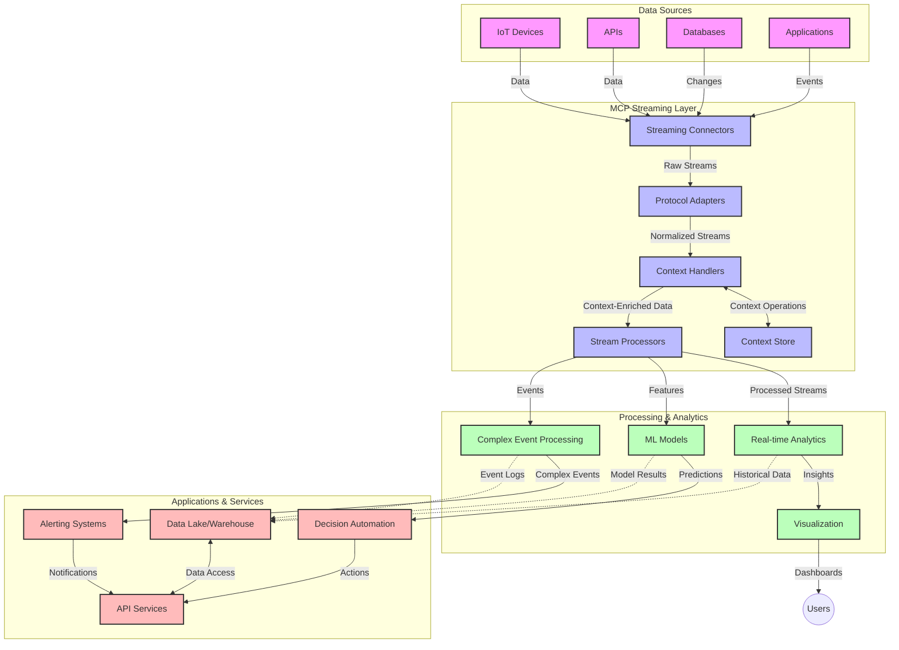

<!--
CO_OP_TRANSLATOR_METADATA:
{
  "original_hash": "68c518dbff8a3b127ed2aa934054c56c",
  "translation_date": "2025-06-11T17:09:27+00:00",
  "source_file": "05-AdvancedTopics/mcp-realtimestreaming/README.md",
  "language_code": "pa"
}
-->
# ਮਾਡਲ ਸੰਦਰਭ ਪ੍ਰੋਟੋਕੋਲ ਫਾਰ ਰੀਅਲ-ਟਾਈਮ ਡਾਟਾ ਸਟ੍ਰੀਮਿੰਗ

## ਝਲਕ

ਰੀਅਲ-ਟਾਈਮ ਡਾਟਾ ਸਟ੍ਰੀਮਿੰਗ ਅੱਜ ਦੇ ਡਾਟਾ-ਚਲਿਤ ਸੰਸਾਰ ਵਿੱਚ ਬਹੁਤ ਜਰੂਰੀ ਹੋ ਗਿਆ ਹੈ, ਜਿੱਥੇ ਕਾਰੋਬਾਰ ਅਤੇ ਐਪਲੀਕੇਸ਼ਨਾਂ ਨੂੰ ਤੁਰੰਤ ਜਾਣਕਾਰੀ ਦੀ ਲੋੜ ਹੁੰਦੀ ਹੈ ਤਾਂ ਜੋ ਉਹ ਸਮੇਂ ਸਿਰ ਫੈਸਲੇ ਕਰ ਸਕਣ। ਮਾਡਲ ਸੰਦਰਭ ਪ੍ਰੋਟੋਕੋਲ (MCP) ਇਹਨਾਂ ਰੀਅਲ-ਟਾਈਮ ਸਟ੍ਰੀਮਿੰਗ ਪ੍ਰਕਿਰਿਆਵਾਂ ਨੂੰ ਬਿਹਤਰ ਬਣਾਉਂਦਾ ਹੈ, ਡਾਟਾ ਪ੍ਰੋਸੈਸਿੰਗ ਦੀ ਕਾਰਗੁਜ਼ਾਰੀ ਵਧਾਉਂਦਾ ਹੈ, ਸੰਦਰਭ ਦੀ ਸਹੀਅਤ ਬਣਾਈ ਰੱਖਦਾ ਹੈ ਅਤੇ ਕੁੱਲ ਮਿਲਾ ਕੇ ਸਿਸਟਮ ਦੀ ਪ੍ਰਦਰਸ਼ਨਸ਼ੀਲਤਾ ਸੁਧਾਰਦਾ ਹੈ।

ਇਹ ਮੋਡੀਊਲ ਵੇਖਦਾ ਹੈ ਕਿ MCP ਕਿਵੇਂ AI ਮਾਡਲਾਂ, ਸਟ੍ਰੀਮਿੰਗ ਪਲੇਟਫਾਰਮਾਂ ਅਤੇ ਐਪਲੀਕੇਸ਼ਨਾਂ ਵਿੱਚ ਸੰਦਰਭ ਪ੍ਰਬੰਧਨ ਲਈ ਇੱਕ ਮਿਆਰੀ ਢੰਗ ਪ੍ਰਦਾਨ ਕਰਕੇ ਰੀਅਲ-ਟਾਈਮ ਡਾਟਾ ਸਟ੍ਰੀਮਿੰਗ ਨੂੰ ਬਦਲਦਾ ਹੈ।

## ਰੀਅਲ-ਟਾਈਮ ਡਾਟਾ ਸਟ੍ਰੀਮਿੰਗ ਦਾ ਪਰਚਾਰ

ਰੀਅਲ-ਟਾਈਮ ਡਾਟਾ ਸਟ੍ਰੀਮਿੰਗ ਇੱਕ ਤਕਨਾਲੋਜੀਕ ਪਰਿਭਾਸ਼ਾ ਹੈ ਜੋ ਡਾਟਾ ਦੇ ਲਗਾਤਾਰ ਟ੍ਰਾਂਸਫਰ, ਪ੍ਰੋਸੈਸਿੰਗ ਅਤੇ ਵਿਸ਼ਲੇਸ਼ਣ ਨੂੰ ਯਕੀਨੀ ਬਣਾਉਂਦੀ ਹੈ, ਤਾਂ ਜੋ ਸਿਸਟਮ ਨਵੀਂ ਜਾਣਕਾਰੀ 'ਤੇ ਤੁਰੰਤ ਪ੍ਰਤੀਕਿਰਿਆ ਕਰ ਸਕਣ। ਪਾਰੰਪਰਿਕ ਬੈਚ ਪ੍ਰੋਸੈਸਿੰਗ ਦੇ ਵਿਰੁੱਧ, ਜੋ ਸਥਿਰ ਡਾਟਾ ਸੈੱਟਾਂ 'ਤੇ ਕੰਮ ਕਰਦੀ ਹੈ, ਸਟ੍ਰੀਮਿੰਗ ਡਾਟਾ ਨੂੰ ਜਿਵੇਂ ਜਿਵੇਂ ਆਉਂਦਾ ਹੈ ਤਿਵੇਂ ਤਿਵੇਂ ਪ੍ਰੋਸੈਸ ਕਰਦਾ ਹੈ, ਘੱਟ ਤੋਂ ਘੱਟ ਦੇਰੀ ਨਾਲ ਨਤੀਜੇ ਅਤੇ ਕਾਰਵਾਈ ਦਿੰਦਾ ਹੈ।

### ਰੀਅਲ-ਟਾਈਮ ਡਾਟਾ ਸਟ੍ਰੀਮਿੰਗ ਦੇ ਮੁੱਖ ਅਸੂਲ:

- **ਲਗਾਤਾਰ ਡਾਟਾ ਦਾ ਪ੍ਰਵਾਹ**: ਡਾਟਾ ਇੱਕ ਅਟੁੱਟ ਅਤੇ ਲਗਾਤਾਰ ਘਟਨਾਵਾਂ ਜਾਂ ਰਿਕਾਰਡਾਂ ਦੇ ਸਟ੍ਰੀਮ ਵਜੋਂ ਪ੍ਰੋਸੈਸ ਕੀਤਾ ਜਾਂਦਾ ਹੈ।
- **ਘੱਟ ਲੇਟੈਂਸੀ ਪ੍ਰੋਸੈਸਿੰਗ**: ਸਿਸਟਮ ਡਾਟਾ ਬਣਨ ਤੋਂ ਲੈ ਕੇ ਪ੍ਰੋਸੈਸਿੰਗ ਤੱਕ ਦੇ ਸਮੇਂ ਨੂੰ ਘੱਟ ਕਰਨ ਲਈ ਬਣਾਏ ਜਾਂਦੇ ਹਨ।
- **ਵਿਆਪਕਤਾ**: ਸਟ੍ਰੀਮਿੰਗ ਆਰਕੀਟੈਕਚਰ ਵੱਖ-ਵੱਖ ਡਾਟਾ ਦੀ ਮਾਤਰਾ ਅਤੇ ਗਤੀ ਨੂੰ ਸੰਭਾਲ ਸਕਣੇ ਚਾਹੀਦੇ ਹਨ।
- **ਫਾਲਟ ਟੋਲਰੈਂਸ**: ਸਿਸਟਮ ਅਸਫਲਤਾ ਤੋਂ ਬਿਨਾਂ ਡਾਟਾ ਪ੍ਰਵਾਹ ਜਾਰੀ ਰੱਖਣ ਲਈ ਸਹਿਣਸ਼ੀਲ ਹੋਣੇ ਚਾਹੀਦੇ ਹਨ।
- **ਸਟੇਟਫੁਲ ਪ੍ਰੋਸੈਸਿੰਗ**: ਘਟਨਾਵਾਂ ਵਿੱਚ ਸੰਦਰਭ ਨੂੰ ਬਣਾਈ ਰੱਖਣਾ ਮਹੱਤਵਪੂਰਨ ਹੈ ਤਾਂ ਜੋ ਅਰਥਪੂਰਨ ਵਿਸ਼ਲੇਸ਼ਣ ਹੋ ਸਕੇ।

### ਮਾਡਲ ਸੰਦਰਭ ਪ੍ਰੋਟੋਕੋਲ ਅਤੇ ਰੀਅਲ-ਟਾਈਮ ਸਟ੍ਰੀਮਿੰਗ

ਮਾਡਲ ਸੰਦਰਭ ਪ੍ਰੋਟੋਕੋਲ (MCP) ਰੀਅਲ-ਟਾਈਮ ਸਟ੍ਰੀਮਿੰਗ ਮਾਹੌਲ ਵਿੱਚ ਕਈ ਮੁੱਖ ਚੁਣੌਤੀਆਂ ਦਾ ਸਮਾਧਾਨ ਕਰਦਾ ਹੈ:

1. **ਸੰਦਰਭ ਦੀ ਲਗਾਤਾਰਤਾ**: MCP ਇਹ ਯਕੀਨੀ ਬਣਾਉਂਦਾ ਹੈ ਕਿ ਵੰਡੇ ਹੋਏ ਸਟ੍ਰੀਮਿੰਗ ਹਿੱਸਿਆਂ ਵਿੱਚ ਸੰਦਰਭ ਇੱਕਸਾਰ ਬਣਿਆ ਰਹੇ, ਤਾਂ ਜੋ AI ਮਾਡਲ ਅਤੇ ਪ੍ਰੋਸੈਸਿੰਗ ਨੋਡਸ ਕੋਲ ਸੰਬੰਧਿਤ ਇਤਿਹਾਸਕ ਅਤੇ ਵਾਤਾਵਰਣ ਸੰਦਰਭ ਹੋਵੇ।

2. **ਕੁਸ਼ਲ ਸਟੇਟ ਪ੍ਰਬੰਧਨ**: MCP ਸੰਦਰਭ ਪ੍ਰਸਾਰਣ ਲਈ ਢਾਂਚਾਬੱਧ ਤਰੀਕੇ ਪ੍ਰਦਾਨ ਕਰਦਾ ਹੈ, ਜਿਸ ਨਾਲ ਸਟੇਟ ਪ੍ਰਬੰਧਨ ਵਿੱਚ ਲੱਗਣ ਵਾਲਾ ਭਾਰ ਘਟਦਾ ਹੈ।

3. **ਇੰਟਰਓਪਰੇਬਿਲਿਟੀ**: MCP ਵੱਖ-ਵੱਖ ਸਟ੍ਰੀਮਿੰਗ ਤਕਨਾਲੋਜੀਆਂ ਅਤੇ AI ਮਾਡਲਾਂ ਵਿਚਕਾਰ ਸੰਦਰਭ ਸਾਂਝਾ ਕਰਨ ਲਈ ਇੱਕ ਸਾਂਝੀ ਭਾਸ਼ਾ ਬਣਾਉਂਦਾ ਹੈ, ਜਿਸ ਨਾਲ ਜ਼ਿਆਦਾ ਲਚਕੀਲਾ ਅਤੇ ਵਿਸਥਾਰਯੋਗ ਆਰਕੀਟੈਕਚਰ ਬਣ ਸਕਦੇ ਹਨ।

4. **ਸਟ੍ਰੀਮਿੰਗ ਲਈ ਅਨੁਕੂਲ ਸੰਦਰਭ**: MCP ਲਾਗੂ ਕਰਨ ਵਾਲੇ ਪ੍ਰਣਾਲੀਆਂ ਉਹ ਸੰਦਰਭ ਤੱਤਾਂ ਤਰਜੀਹ ਦੇ ਸਕਦੀਆਂ ਹਨ ਜੋ ਰੀਅਲ-ਟਾਈਮ ਫੈਸਲੇ ਲਈ ਸਭ ਤੋਂ ਜ਼ਿਆਦਾ ਮਹੱਤਵਪੂਰਨ ਹਨ, ਪ੍ਰਦਰਸ਼ਨ ਅਤੇ ਸਹੀਅਤ ਦੋਹਾਂ ਨੂੰ ਧਿਆਨ ਵਿੱਚ ਰੱਖਦਿਆਂ।

5. **ਅਨੁਕੂਲ ਪ੍ਰੋਸੈਸਿੰਗ**: MCP ਰਾਹੀਂ ਸੰਦਰਭ ਪ੍ਰਬੰਧਨ ਨਾਲ, ਸਟ੍ਰੀਮਿੰਗ ਸਿਸਟਮ ਡਾਟਾ ਵਿੱਚ ਬਦਲ ਰਹੇ ਹਾਲਾਤ ਅਤੇ ਰੁਝਾਨਾਂ ਦੇ ਅਧਾਰ 'ਤੇ ਪ੍ਰੋਸੈਸਿੰਗ ਨੂੰ ਗਤੀਸ਼ੀਲ ਤਰੀਕੇ ਨਾਲ ਢਾਲ ਸਕਦੇ ਹਨ।

ਆਧੁਨਿਕ ਐਪਲੀਕੇਸ਼ਨਾਂ ਵਿੱਚ, ਜਿਵੇਂ ਕਿ IoT ਸੈਂਸਰ ਨੈੱਟਵਰਕ ਤੋਂ ਲੈ ਕੇ ਵਿੱਤੀ ਵਪਾਰ ਪਲੇਟਫਾਰਮਾਂ ਤੱਕ, MCP ਅਤੇ ਸਟ੍ਰੀਮਿੰਗ ਤਕਨਾਲੋਜੀਆਂ ਦਾ ਏਕੀਕਰਨ ਹੋਰ ਬੁੱਧਿਮਾਨ, ਸੰਦਰਭ-ਜਾਣੂ ਪ੍ਰੋਸੈਸਿੰਗ ਨੂੰ ਯਕੀਨੀ ਬਣਾਉਂਦਾ ਹੈ ਜੋ ਜਟਿਲ ਅਤੇ ਬਦਲਦੇ ਹਾਲਾਤਾਂ ਨੂੰ ਸਮਝਦਿਆਂ ਸਮੇਂ-ਸਿਰ ਜਵਾਬ ਦੇ ਸਕਦਾ ਹੈ।

## ਸਿੱਖਣ ਦੇ ਲਕੜ

ਇਸ ਪਾਠ ਦੇ ਅੰਤ ਵਿੱਚ, ਤੁਸੀਂ ਸਮਰੱਥ ਹੋਵੋਗੇ:

- ਰੀਅਲ-ਟਾਈਮ ਡਾਟਾ ਸਟ੍ਰੀਮਿੰਗ ਦੇ ਮੂਲ ਸਿਧਾਂਤ ਅਤੇ ਚੁਣੌਤੀਆਂ ਨੂੰ ਸਮਝਣਾ
- ਸਮਝਾਉਣਾ ਕਿ ਮਾਡਲ ਸੰਦਰਭ ਪ੍ਰੋਟੋਕੋਲ (MCP) ਰੀਅਲ-ਟਾਈਮ ਡਾਟਾ ਸਟ੍ਰੀਮਿੰਗ ਨੂੰ ਕਿਵੇਂ ਸੁਧਾਰਦਾ ਹੈ
- Kafka ਅਤੇ Pulsar ਵਰਗੇ ਪ੍ਰਸਿੱਧ ਫਰੇਮਵਰਕਾਂ ਦੀ ਵਰਤੋਂ ਕਰਕੇ MCP-ਅਧਾਰਿਤ ਸਟ੍ਰੀਮਿੰਗ ਹੱਲ ਲਾਗੂ ਕਰਨਾ
- MCP ਨਾਲ ਫਾਲਟ-ਟੋਲਰੈਂਟ, ਉੱਚ-ਕਾਰਗੁਜ਼ਾਰੀ ਵਾਲੀਆਂ ਸਟ੍ਰੀਮਿੰਗ ਆਰਕੀਟੈਕਚਰਾਂ ਦੀ ਡਿਜ਼ਾਈਨ ਅਤੇ ਤੈਨਾਤੀ ਕਰਨਾ
- IoT, ਵਿੱਤੀ ਵਪਾਰ ਅਤੇ AI-ਚਲਿਤ ਵਿਸ਼ਲੇਸ਼ਣ ਵਰਗੇ ਕੇਸਾਂ ਵਿੱਚ MCP ਸਿਧਾਂਤ ਲਾਗੂ ਕਰਨਾ
- MCP-ਅਧਾਰਿਤ ਸਟ੍ਰੀਮਿੰਗ ਤਕਨਾਲੋਜੀਆਂ ਵਿੱਚ ਨਵੇਂ ਰੁਝਾਨਾਂ ਅਤੇ ਭਵਿੱਖ ਦੀਆਂ ਨਵੀਨਤਾਵਾਂ ਦਾ ਮੁਲਾਂਕਣ ਕਰਨਾ

### ਪਰਿਭਾਸ਼ਾ ਅਤੇ ਮਹੱਤਵ

ਰੀਅਲ-ਟਾਈਮ ਡਾਟਾ ਸਟ੍ਰੀਮਿੰਗ ਵਿੱਚ ਘੱਟ ਲੇਟੈਂਸੀ ਨਾਲ ਲਗਾਤਾਰ ਡਾਟਾ ਦੀ ਪੈਦਾوار, ਪ੍ਰੋਸੈਸਿੰਗ ਅਤੇ ਡਿਲਿਵਰੀ ਸ਼ਾਮਲ ਹੈ। ਬੈਚ ਪ੍ਰੋਸੈਸਿੰਗ ਦੇ ਵਿਰੁੱਧ, ਜਿੱਥੇ ਡਾਟਾ ਨੂੰ ਸਮੂਹਾਂ ਵਿੱਚ ਇਕੱਠਾ ਕਰਕੇ ਪ੍ਰੋਸੈਸ ਕੀਤਾ ਜਾਂਦਾ ਹੈ, ਸਟ੍ਰੀਮਿੰਗ ਡਾਟਾ ਨੂੰ ਜਿਵੇਂ ਜਿਵੇਂ ਆਉਂਦਾ ਹੈ ਤਿਵੇਂ ਤਿਵੇਂ ਪ੍ਰੋਸੈਸ ਕੀਤਾ ਜਾਂਦਾ ਹੈ, ਜਿਸ ਨਾਲ ਤੁਰੰਤ ਜਾਣਕਾਰੀ ਅਤੇ ਕਾਰਵਾਈ ਸੰਭਵ ਹੁੰਦੀ ਹੈ।

ਰੀਅਲ-ਟਾਈਮ ਡਾਟਾ ਸਟ੍ਰੀਮਿੰਗ ਦੀਆਂ ਮੁੱਖ ਵਿਸ਼ੇਸ਼ਤਾਵਾਂ ਹਨ:

- **ਘੱਟ ਲੇਟੈਂਸੀ**: ਡਾਟਾ ਨੂੰ ਮਿਲੀਸੈਕੰਡ ਤੋਂ ਸਕਿੰਟਾਂ ਦੇ ਅੰਦਰ ਪ੍ਰੋਸੈਸ ਅਤੇ ਵਿਸ਼ਲੇਸ਼ਣ ਕਰਨਾ
- **ਲਗਾਤਾਰ ਪ੍ਰਵਾਹ**: ਵੱਖ-ਵੱਖ ਸਰੋਤਾਂ ਤੋਂ ਬਿਨਾਂ ਰੁਕਾਵਟ ਡਾਟਾ ਦੇ ਸਟ੍ਰੀਮ
- **ਤੁਰੰਤ ਪ੍ਰੋਸੈਸਿੰਗ**: ਡਾਟਾ ਨੂੰ ਬੈਚਾਂ ਵਿੱਚ ਨਹੀਂ, ਸਿੱਧਾ ਆਉਂਦੇ ਸਮੇਂ ਵਿਸ਼ਲੇਸ਼ਣ ਕਰਨਾ
- **ਘਟਨਾ-ਚਾਲਿਤ ਆਰਕੀਟੈਕਚਰ**: ਘਟਨਾਵਾਂ ਦੇ ਹੋਣ 'ਤੇ ਤੁਰੰਤ ਪ੍ਰਤੀਕਿਰਿਆ ਕਰਨਾ

### ਪਾਰੰਪਰਿਕ ਡਾਟਾ ਸਟ੍ਰੀਮਿੰਗ ਵਿੱਚ ਚੁਣੌਤੀਆਂ

ਪਾਰੰਪਰਿਕ ਡਾਟਾ ਸਟ੍ਰੀਮਿੰਗ ਤਰੀਕੇ ਕਈ ਸੀਮਾਵਾਂ ਦਾ ਸਾਹਮਣਾ ਕਰਦੇ ਹਨ:

1. **ਸੰਦਰਭ ਦੀ ਹਾਨੀ**: ਵੰਡੇ ਹੋਏ ਸਿਸਟਮਾਂ ਵਿੱਚ ਸੰਦਰਭ ਬਣਾਈ ਰੱਖਣ ਵਿੱਚ ਮੁਸ਼ਕਲ
2. **ਵਿਆਪਕਤਾ ਸਮੱਸਿਆਵਾਂ**: ਉੱਚ ਮਾਤਰਾ ਅਤੇ ਤੇਜ਼ ਡਾਟਾ ਨੂੰ ਸੰਭਾਲਣ ਵਿੱਚ ਚੁਣੌਤੀਆਂ
3. **ਇੰਟਿਗ੍ਰੇਸ਼ਨ ਦੀ ਜਟਿਲਤਾ**: ਵੱਖ-ਵੱਖ ਸਿਸਟਮਾਂ ਵਿਚਕਾਰ ਇੰਟਰਓਪਰੇਬਿਲਿਟੀ ਦੀ ਸਮੱਸਿਆ
4. **ਲੇਟੈਂਸੀ ਪ੍ਰਬੰਧਨ**: ਪ੍ਰੋਸੈਸਿੰਗ ਸਮੇਂ ਅਤੇ ਥਰੂਪੁੱਟ ਵਿੱਚ ਸੰਤੁਲਨ ਬਣਾਉਣਾ
5. **ਡਾਟਾ ਸੰਗਤਤਾ**: ਸਟ੍ਰੀਮ ਵਿੱਚ ਡਾਟਾ ਦੀ ਸਹੀਅਤ ਅਤੇ ਪੂਰਨਤਾ ਨੂੰ ਯਕੀਨੀ ਬਣਾਉਣਾ

## ਮਾਡਲ ਸੰਦਰਭ ਪ੍ਰੋਟੋਕੋਲ (MCP) ਨੂੰ ਸਮਝਣਾ

### MCP ਕੀ ਹੈ?

ਮਾਡਲ ਸੰਦਰਭ ਪ੍ਰੋਟੋਕੋਲ (MCP) ਇੱਕ ਮਿਆਰੀਕ੍ਰਿਤ ਸੰਚਾਰ ਪ੍ਰੋਟੋਕੋਲ ਹੈ ਜੋ AI ਮਾਡਲਾਂ ਅਤੇ ਐਪਲੀਕੇਸ਼ਨਾਂ ਵਿਚਕਾਰ ਪ੍ਰਭਾਵਸ਼ਾਲੀ ਸੰਚਾਰ ਨੂੰ ਸੁਗਮ ਬਣਾਉਂਦਾ ਹੈ। ਰੀਅਲ-ਟਾਈਮ ਡਾਟਾ ਸਟ੍ਰੀਮਿੰਗ ਦੇ ਸੰਦਰਭ ਵਿੱਚ, MCP ਇਹ ਫਰੇਮਵਰਕ ਪ੍ਰਦਾਨ ਕਰਦਾ ਹੈ:

- ਡਾਟਾ ਪਾਈਪਲਾਈਨ ਵਿੱਚ ਸੰਦਰਭ ਨੂੰ ਸੁਰੱਖਿਅਤ ਰੱਖਣਾ
- ਡਾਟਾ ਅਦਲਾ-ਬਦਲੀ ਦੇ ਫਾਰਮੈਟਾਂ ਨੂੰ ਮਿਆਰੀਕ੍ਰਿਤ ਕਰਨਾ
- ਵੱਡੇ ਡਾਟਾਸੈੱਟਾਂ ਦੇ ਪ੍ਰਸਾਰਣ ਨੂੰ ਅਨੁਕੂਲਿਤ ਕਰਨਾ
- ਮਾਡਲ-ਟੂ-ਮਾਡਲ ਅਤੇ ਮਾਡਲ-ਟੂ-ਐਪਲੀਕੇਸ਼ਨ ਸੰਚਾਰ ਨੂੰ ਬਿਹਤਰ ਬਣਾਉਣਾ

### ਮੁੱਖ ਭਾਗ ਅਤੇ ਆਰਕੀਟੈਕਚਰ

ਰੀਅਲ-ਟਾਈਮ ਸਟ੍ਰੀਮਿੰਗ ਲਈ MCP ਆਰਕੀਟੈਕਚਰ ਵਿੱਚ ਕੁਝ ਮੁੱਖ ਭਾਗ ਸ਼ਾਮਲ ਹਨ:

1. **ਸੰਦਰਭ ਹੈਂਡਲਰ**: ਸਟ੍ਰੀਮਿੰਗ ਪਾਈਪਲਾਈਨ ਵਿੱਚ ਸੰਦਰਭ ਜਾਣਕਾਰੀ ਦਾ ਪ੍ਰਬੰਧ ਅਤੇ ਸੰਭਾਲ ਕਰਦੇ ਹਨ
2. **ਸਟ੍ਰੀਮ ਪ੍ਰੋਸੈਸਰ**: ਸੰਦਰਭ-ਜਾਣੂ ਤਕਨੀਕਾਂ ਨਾਲ ਆਉਣ ਵਾਲੇ ਡਾਟਾ ਸਟ੍ਰੀਮਾਂ ਨੂੰ ਪ੍ਰੋਸੈਸ ਕਰਦੇ ਹਨ
3. **ਪ੍ਰੋਟੋਕੋਲ ਐਡਾਪਟਰ**: ਵੱਖ-ਵੱਖ ਸਟ੍ਰੀਮਿੰਗ ਪ੍ਰੋਟੋਕੋਲਾਂ ਵਿੱਚ ਬਦਲਾਅ ਕਰਦੇ ਹਨ ਅਤੇ ਸੰਦਰਭ ਨੂੰ ਸੁਰੱਖਿਅਤ ਰੱਖਦੇ ਹਨ
4. **ਸੰਦਰਭ ਸਟੋਰ**: ਪ੍ਰਭਾਵਸ਼ਾਲੀ ਤਰੀਕੇ ਨਾਲ ਸੰਦਰਭ ਜਾਣਕਾਰੀ ਨੂੰ ਸਟੋਰ ਅਤੇ ਰੀਟ੍ਰੀਵ ਕਰਦਾ ਹੈ
5. **ਸਟ੍ਰੀਮਿੰਗ ਕਨੈਕਟਰ**: ਵੱਖ-ਵੱਖ ਸਟ੍ਰੀਮਿੰਗ ਪਲੇਟਫਾਰਮਾਂ ਨਾਲ ਜੁੜਦਾ ਹੈ (Kafka, Pulsar, Kinesis ਆਦਿ)

### MCP ਕਿਵੇਂ ਰੀਅਲ-ਟਾਈਮ ਡਾਟਾ ਹੈਂਡਲਿੰਗ ਨੂੰ ਸੁਧਾਰਦਾ ਹੈ

MCP ਪਾਰੰਪਰਿਕ ਸਟ੍ਰੀਮਿੰਗ ਚੁਣੌਤੀਆਂ ਨੂੰ ਹੇਠਾਂ ਦਿੱਤੇ ਤਰੀਕੇ ਨਾਲ ਹੱਲ ਕਰਦਾ ਹੈ:

- **ਸੰਦਰਭ ਦੀ ਸਹੀਅਤ**: ਪੂਰੀ ਪਾਈਪਲਾਈਨ ਵਿੱਚ ਡਾਟਾ ਪੌਇੰਟਾਂ ਵਿਚਕਾਰ ਸੰਬੰਧ ਬਣਾਈ ਰੱਖਦਾ ਹੈ
- **ਅਨੁਕੂਲਿਤ ਪ੍ਰਸਾਰਣ**: ਸਮਝਦਾਰ ਸੰਦਰਭ ਪ੍ਰਬੰਧਨ ਰਾਹੀਂ ਡਾਟਾ ਅਦਲਾ-ਬਦਲੀ ਵਿੱਚ ਅਣਜਰੂਰੀ ਦੁਹਰਾਵਟ ਘਟਾਉਂਦਾ ਹੈ
- **ਮਿਆਰੀਕ੍ਰਿਤ ਇੰਟਰਫੇਸ**: ਸਟ੍ਰੀਮਿੰਗ ਹਿੱਸਿਆਂ ਲਈ ਇੱਕਸਾਰ API ਪ੍ਰਦਾਨ ਕਰਦਾ ਹੈ
- **ਘੱਟ ਲੇਟੈਂਸੀ**: ਪ੍ਰਭਾਵਸ਼ਾਲੀ ਸੰਦਰਭ ਸੰਭਾਲ ਨਾਲ ਪ੍ਰੋਸੈਸਿੰਗ ਭਾਰ ਘਟਾਉਂਦਾ ਹੈ
- **ਵਧੀਆ ਵਿਆਪਕਤਾ**: ਸੰਦਰਭ ਬਚਾਉਂਦੇ ਹੋਏ ਹੋਰ ਡਿਵਾਈਸਾਂ ਅਤੇ ਨੋਡਾਂ ਨਾਲ ਸਹਿਯੋਗ ਕਰਦਾ ਹੈ

## ਏਕੀਕਰਨ ਅਤੇ ਲਾਗੂ ਕਰਨ

ਰੀਅਲ-ਟਾਈਮ ਡਾਟਾ ਸਟ੍ਰੀਮਿੰਗ ਸਿਸਟਮਾਂ ਨੂੰ ਕਾਰਗੁਜ਼ਾਰੀ ਅਤੇ ਸੰਦਰਭ ਦੀ ਸਹੀਅਤ ਦੋਹਾਂ ਨੂੰ ਬਣਾਈ ਰੱਖਣ ਲਈ ਧਿਆਨਪੂਰਵਕ ਆਰਕੀਟੈਕਚਰ ਡਿਜ਼ਾਈਨ ਅਤੇ ਲਾਗੂ ਕਰਨ ਦੀ ਲੋੜ ਹੁੰਦੀ ਹੈ। ਮਾਡਲ ਸੰਦਰਭ ਪ੍ਰੋਟੋਕੋਲ AI ਮਾਡਲਾਂ ਅਤੇ ਸਟ੍ਰੀਮਿੰਗ ਤਕਨਾਲੋਜੀਆਂ ਦੇ ਏਕੀਕਰਨ ਲਈ ਇੱਕ ਮਿਆਰੀਕ੍ਰਿਤ ਢੰਗ ਦਿੰਦਾ ਹੈ, ਜੋ ਹੋਰ ਬੁੱਧਿਮਾਨ ਅਤੇ ਸੰਦਰਭ-ਜਾਣੂ ਪ੍ਰੋਸੈਸਿੰਗ ਪਾਈਪਲਾਈਨ ਬਣਾਉਂਦਾ ਹੈ।

### ਸਟ੍ਰੀਮਿੰਗ ਆਰਕੀਟੈਕਚਰ ਵਿੱਚ MCP ਏਕੀਕਰਨ ਦਾ ਝਲਕ

ਰੀਅਲ-ਟਾਈਮ ਸਟ੍ਰੀਮਿੰਗ ਮਾਹੌਲ ਵਿੱਚ MCP ਲਾਗੂ ਕਰਨ ਸਮੇਂ ਕਈ ਮੁੱਖ ਗੱਲਾਂ ਦਾ ਧਿਆਨ ਰੱਖਣਾ ਪੈਂਦਾ ਹੈ:

1. **ਸੰਦਰਭ ਸਿਰੀਅਲਾਈਜ਼ੇਸ਼ਨ ਅਤੇ ਟ੍ਰਾਂਸਪੋਰਟ**: MCP ਸੰਦਰਭ ਜਾਣਕਾਰੀ ਨੂੰ ਸਟ੍ਰੀਮਿੰਗ ਡਾਟਾ ਪੈਕੇਟਾਂ ਵਿੱਚ ਕੁਸ਼ਲਤਾਪੂਰਵਕ ਕੋਡ ਕਰਨ ਲਈ ਤਰੀਕੇ ਦਿੰਦਾ ਹੈ, ਇਸ ਤਰ੍ਹਾਂ ਜ਼ਰੂਰੀ ਸੰਦਰਭ ਡਾਟਾ ਪ੍ਰੋਸੈਸਿੰਗ ਪਾਈਪਲਾਈਨ ਵਿੱਚ ਸਦਾ ਨਾਲ ਚੱਲਦਾ ਹੈ। ਇਸ ਵਿੱਚ ਸਟ੍ਰੀਮਿੰਗ ਟ੍ਰਾਂਸਪੋਰਟ ਲਈ ਅਨੁਕੂਲਿਤ ਮਿਆਰੀਕ੍ਰਿਤ ਸਿਰੀਅਲਾਈਜ਼ੇਸ਼ਨ ਫਾਰਮੈਟ ਸ਼ਾਮਲ ਹਨ।

2. **ਸਟੇਟਫੁਲ ਸਟ੍ਰੀਮ ਪ੍ਰੋਸੈਸਿੰਗ**: MCP ਸੰਦਰਭ ਦੀ ਇੱਕਸਾਰ ਪ੍ਰਤੀਨਿਧਤਾ ਰੱਖ ਕੇ ਹੋਰ ਸਮਝਦਾਰ ਸਟੇਟਫੁਲ ਪ੍ਰੋਸੈਸਿੰਗ ਯੋਗ ਬਣਾਉਂਦਾ ਹੈ। ਇਹ ਵਿਸ਼ੇਸ਼ ਤੌਰ 'ਤੇ ਵੰਡੇ ਹੋਏ ਸਟ੍ਰੀਮਿੰਗ ਆਰਕੀਟੈਕਚਰਾਂ ਵਿੱਚ ਲਾਭਦਾਇਕ ਹੈ ਜਿੱਥੇ ਸਟੇਟ ਪ੍ਰਬੰਧਨ ਮੁਸ਼ਕਲ ਹੁੰਦਾ ਹੈ।

3. **ਇਵੈਂਟ-ਟਾਈਮ ਵਿਰੁੱਧ ਪ੍ਰੋਸੈਸਿੰਗ-ਟਾਈਮ**: MCP ਲਾਗੂ ਕਰਨ ਵਾਲੀਆਂ ਪ੍ਰਣਾਲੀਆਂ ਨੂੰ ਇਹ ਸਮਝਣਾ ਪੈਂਦਾ ਹੈ ਕਿ ਘਟਨਾਵਾਂ ਕਦੋਂ ਹੋਈਆਂ ਅਤੇ ਕਦੋਂ ਪ੍ਰੋਸੈਸ ਕੀਤੀਆਂ ਜਾ ਰਹੀਆਂ ਹਨ। ਪ੍ਰੋਟੋਕੋਲ ਸਮੇਂ ਦੇ ਸੰਦਰਭ ਨੂੰ ਸ਼ਾਮਲ ਕਰ ਸਕਦਾ ਹੈ ਜੋ ਘਟਨਾ ਸਮੇਂ ਦੀ ਸਹੀਅਤ ਨੂੰ ਬਚਾਉਂਦਾ ਹੈ।

4. **ਬੈਕਪ੍ਰੈਸ਼ਰ ਪ੍ਰਬੰਧਨ**: MCP ਸੰਦਰਭ ਸੰਭਾਲ ਨੂੰ ਮਿਆਰੀਕ੍ਰਿਤ ਕਰਕੇ ਸਟ੍ਰੀਮਿੰਗ ਸਿਸਟਮਾਂ ਵਿੱਚ ਬੈਕਪ੍ਰੈਸ਼ਰ ਨੂੰ ਸੰਭਾਲਣ ਵਿੱਚ ਮਦਦ ਕਰਦਾ ਹੈ, ਜਿਸ ਨਾਲ ਹਿੱਸੇ ਆਪਣੀ ਪ੍ਰੋਸੈਸਿੰਗ ਸਮਰੱਥਾ ਦੀ ਜਾਣਕਾਰੀ ਸਾਂਝੀ ਕਰਕੇ ਪ੍ਰਵਾਹ ਨੂੰ ਢਾਲ ਸਕਦੇ ਹਨ।

5. **ਸੰਦਰਭ ਵਿੰਡੋਇੰਗ ਅਤੇ ਏਗਰੀਗੇਸ਼ਨ**: MCP ਸਮੇਂ ਅਤੇ ਸੰਬੰਧਤ ਸੰਦਰਭ ਦੀ ਢਾਂਚਾਬੱਧ ਪ੍ਰਤੀਨਿਧਤਾ ਪ੍ਰ

**ਅਸਵੀਕਾਰੋਪਣ**:  
ਇਹ ਦਸਤਾਵੇਜ਼ AI ਅਨੁਵਾਦ ਸੇਵਾ [Co-op Translator](https://github.com/Azure/co-op-translator) ਦੀ ਵਰਤੋਂ ਕਰਕੇ ਅਨੁਵਾਦ ਕੀਤਾ ਗਿਆ ਹੈ। ਜਦੋਂ ਕਿ ਅਸੀਂ ਸਹੀਤਾ ਲਈ ਕੋਸ਼ਿਸ਼ ਕਰਦੇ ਹਾਂ, ਕਿਰਪਾ ਕਰਕੇ ਧਿਆਨ ਰੱਖੋ ਕਿ ਆਟੋਮੈਟਿਕ ਅਨੁਵਾਦਾਂ ਵਿੱਚ ਗਲਤੀਆਂ ਜਾਂ ਅਸਮਰੱਥਤਾਵਾਂ ਹੋ ਸਕਦੀਆਂ ਹਨ। ਮੂਲ ਦਸਤਾਵੇਜ਼ ਆਪਣੇ ਮੂਲ ਭਾਸ਼ਾ ਵਿੱਚ ਪ੍ਰਮਾਣਿਕ ਸਰੋਤ ਮੰਨਿਆ ਜਾਣਾ ਚਾਹੀਦਾ ਹੈ। ਜਰੂਰੀ ਜਾਣਕਾਰੀ ਲਈ, ਪੇਸ਼ੇਵਰ ਮਨੁੱਖੀ ਅਨੁਵਾਦ ਦੀ ਸਿਫਾਰਿਸ਼ ਕੀਤੀ ਜਾਂਦੀ ਹੈ। ਅਸੀਂ ਇਸ ਅਨੁਵਾਦ ਦੀ ਵਰਤੋਂ ਨਾਲ ਹੋਣ ਵਾਲੀਆਂ ਕਿਸੇ ਵੀ ਗਲਤਫਹਿਮੀਆਂ ਜਾਂ ਗਲਤ ਵਿਆਖਿਆਵਾਂ ਲਈ ਜ਼ਿੰਮੇਵਾਰ ਨਹੀਂ ਹਾਂ।