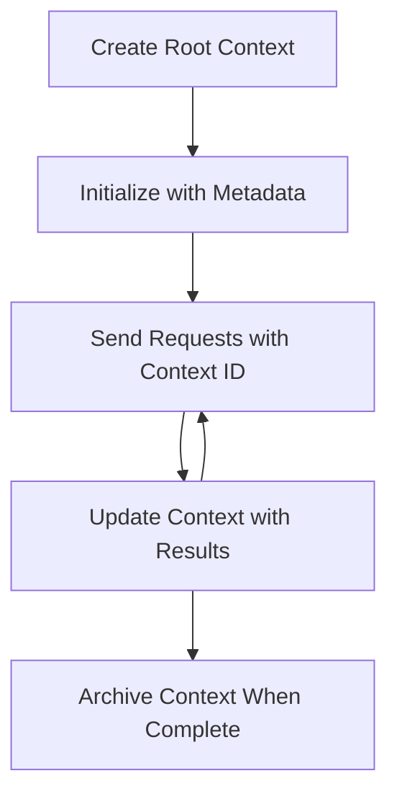

<!--
CO_OP_TRANSLATOR_METADATA:
{
  "original_hash": "ebdb86db46113f1cbd59ce4c74caaa79",
  "translation_date": "2025-07-17T00:48:29+00:00",
  "source_file": "05-AdvancedTopics/mcp-root-contexts/README.md",
  "language_code": "pa"
}
-->
# MCP ਰੂਟ ਕਾਂਟੈਕਸਟ

ਰੂਟ ਕਾਂਟੈਕਸਟ ਮਾਡਲ ਕਾਂਟੈਕਸਟ ਪ੍ਰੋਟੋਕੋਲ ਵਿੱਚ ਇੱਕ ਮੂਲ ਭਾਵਨਾ ਹਨ ਜੋ ਕਈ ਬੇਨਤੀਆਂ ਅਤੇ ਸੈਸ਼ਨਾਂ ਵਿੱਚ ਗੱਲਬਾਤ ਦਾ ਇਤਿਹਾਸ ਅਤੇ ਸਾਂਝੀ ਸਥਿਤੀ ਨੂੰ ਲਗਾਤਾਰ ਬਣਾਈ ਰੱਖਣ ਲਈ ਇੱਕ ਸਥਾਈ ਪਰਤ ਪ੍ਰਦਾਨ ਕਰਦੇ ਹਨ।

## ਪਰਿਚਯ

ਇਸ ਪਾਠ ਵਿੱਚ, ਅਸੀਂ MCP ਵਿੱਚ ਰੂਟ ਕਾਂਟੈਕਸਟ ਬਣਾਉਣ, ਪ੍ਰਬੰਧਨ ਕਰਨ ਅਤੇ ਵਰਤਣ ਦੇ ਤਰੀਕੇ ਬਾਰੇ ਜਾਣੂ ਹੋਵਾਂਗੇ।

## ਸਿੱਖਣ ਦੇ ਉਦੇਸ਼

ਇਸ ਪਾਠ ਦੇ ਅੰਤ ਤੱਕ, ਤੁਸੀਂ ਸਮਰੱਥ ਹੋਵੋਗੇ:

- ਰੂਟ ਕਾਂਟੈਕਸਟ ਦੇ ਮਕਸਦ ਅਤੇ ਢਾਂਚੇ ਨੂੰ ਸਮਝਣਾ
- MCP ਕਲਾਇੰਟ ਲਾਇਬ੍ਰੇਰੀਜ਼ ਦੀ ਵਰਤੋਂ ਕਰਕੇ ਰੂਟ ਕਾਂਟੈਕਸਟ ਬਣਾਉਣਾ ਅਤੇ ਪ੍ਰਬੰਧਿਤ ਕਰਨਾ
- .NET, ਜਾਵਾ, ਜਾਵਾਸਕ੍ਰਿਪਟ ਅਤੇ ਪਾਇਥਨ ਐਪਲੀਕੇਸ਼ਨਾਂ ਵਿੱਚ ਰੂਟ ਕਾਂਟੈਕਸਟ ਲਾਗੂ ਕਰਨਾ
- ਬਹੁ-ਚਰਣ ਗੱਲਬਾਤਾਂ ਅਤੇ ਸਥਿਤੀ ਪ੍ਰਬੰਧਨ ਲਈ ਰੂਟ ਕਾਂਟੈਕਸਟ ਦੀ ਵਰਤੋਂ ਕਰਨਾ
- ਰੂਟ ਕਾਂਟੈਕਸਟ ਪ੍ਰਬੰਧਨ ਲਈ ਸਰਵੋਤਮ ਅਭਿਆਸ ਲਾਗੂ ਕਰਨਾ

## ਰੂਟ ਕਾਂਟੈਕਸਟ ਨੂੰ ਸਮਝਣਾ

ਰੂਟ ਕਾਂਟੈਕਸਟ ਉਹ ਕੰਟੇਨਰ ਹੁੰਦੇ ਹਨ ਜੋ ਸੰਬੰਧਿਤ ਇੰਟਰੈਕਸ਼ਨਾਂ ਦੀ ਲੜੀ ਲਈ ਇਤਿਹਾਸ ਅਤੇ ਸਥਿਤੀ ਨੂੰ ਸੰਭਾਲਦੇ ਹਨ। ਇਹ ਸਹੂਲਤ ਦਿੰਦੇ ਹਨ:

- **ਗੱਲਬਾਤ ਦੀ ਲਗਾਤਾਰਤਾ**: ਸਹੀ ਅਤੇ ਲਗਾਤਾਰ ਬਹੁ-ਚਰਣ ਗੱਲਬਾਤਾਂ ਨੂੰ ਬਣਾਈ ਰੱਖਣਾ
- **ਮੈਮੋਰੀ ਪ੍ਰਬੰਧਨ**: ਇੰਟਰੈਕਸ਼ਨਾਂ ਵਿੱਚ ਜਾਣਕਾਰੀ ਸਟੋਰ ਅਤੇ ਪ੍ਰਾਪਤ ਕਰਨਾ
- **ਸਥਿਤੀ ਪ੍ਰਬੰਧਨ**: ਜਟਿਲ ਕਾਰਜ ਪ੍ਰਵਾਹਾਂ ਵਿੱਚ ਤਰੱਕੀ ਨੂੰ ਟਰੈਕ ਕਰਨਾ
- **ਕਾਂਟੈਕਸਟ ਸਾਂਝਾ ਕਰਨਾ**: ਕਈ ਕਲਾਇੰਟਾਂ ਨੂੰ ਇੱਕੋ ਗੱਲਬਾਤ ਸਥਿਤੀ ਤੱਕ ਪਹੁੰਚ ਦੇਣਾ

MCP ਵਿੱਚ, ਰੂਟ ਕਾਂਟੈਕਸਟਾਂ ਦੀਆਂ ਇਹ ਮੁੱਖ ਵਿਸ਼ੇਸ਼ਤਾਵਾਂ ਹਨ:

- ਹਰ ਰੂਟ ਕਾਂਟੈਕਸਟ ਦਾ ਇੱਕ ਵਿਲੱਖਣ ਪਹਿਚਾਣਕ ਹੈ।
- ਇਹ ਗੱਲਬਾਤ ਦਾ ਇਤਿਹਾਸ, ਯੂਜ਼ਰ ਪਸੰਦਾਂ ਅਤੇ ਹੋਰ ਮੈਟਾਡੇਟਾ ਰੱਖ ਸਕਦੇ ਹਨ।
- ਇਹ ਜਰੂਰਤ ਅਨੁਸਾਰ ਬਣਾਏ, ਪ੍ਰਾਪਤ ਕੀਤੇ ਅਤੇ ਆਰਕਾਈਵ ਕੀਤੇ ਜਾ ਸਕਦੇ ਹਨ।
- ਇਹ ਸੁਖੜ-ਪੱਧਰੀ ਪਹੁੰਚ ਨਿਯੰਤਰਣ ਅਤੇ ਅਧਿਕਾਰਾਂ ਦਾ ਸਮਰਥਨ ਕਰਦੇ ਹਨ।

## ਰੂਟ ਕਾਂਟੈਕਸਟ ਦਾ ਜੀਵਨ ਚੱਕਰ



## ਰੂਟ ਕਾਂਟੈਕਸਟ ਨਾਲ ਕੰਮ ਕਰਨਾ

ਇੱਥੇ ਇੱਕ ਉਦਾਹਰਨ ਹੈ ਕਿ ਕਿਵੇਂ ਰੂਟ ਕਾਂਟੈਕਸਟ ਬਣਾਏ ਅਤੇ ਪ੍ਰਬੰਧਿਤ ਕੀਤੇ ਜਾ ਸਕਦੇ ਹਨ।

### C# ਲਾਗੂ ਕਰਨ ਦਾ ਤਰੀਕਾ

```csharp
// .NET Example: Root Context Management
using Microsoft.Mcp.Client;
using System;
using System.Threading.Tasks;
using System.Collections.Generic;

public class RootContextExample
{
    private readonly IMcpClient _client;
    private readonly IRootContextManager _contextManager;
    
    public RootContextExample(IMcpClient client, IRootContextManager contextManager)
    {
        _client = client;
        _contextManager = contextManager;
    }
    
    public async Task DemonstrateRootContextAsync()
    {
        // 1. Create a new root context
        var contextResult = await _contextManager.CreateRootContextAsync(new RootContextCreateOptions
        {
            Name = "Customer Support Session",
            Metadata = new Dictionary<string, string>
            {
                ["CustomerName"] = "Acme Corporation",
                ["PriorityLevel"] = "High",
                ["Domain"] = "Cloud Services"
            }
        });
        
        string contextId = contextResult.ContextId;
        Console.WriteLine($"Created root context with ID: {contextId}");
        
        // 2. First interaction using the context
        var response1 = await _client.SendPromptAsync(
            "I'm having issues scaling my web service deployment in the cloud.", 
            new SendPromptOptions { RootContextId = contextId }
        );
        
        Console.WriteLine($"First response: {response1.GeneratedText}");
        
        // Second interaction - the model will have access to the previous conversation
        var response2 = await _client.SendPromptAsync(
            "Yes, we're using containerized deployments with Kubernetes.", 
            new SendPromptOptions { RootContextId = contextId }
        );
        
        Console.WriteLine($"Second response: {response2.GeneratedText}");
        
        // 3. Add metadata to the context based on conversation
        await _contextManager.UpdateContextMetadataAsync(contextId, new Dictionary<string, string>
        {
            ["TechnicalEnvironment"] = "Kubernetes",
            ["IssueType"] = "Scaling"
        });
        
        // 4. Get context information
        var contextInfo = await _contextManager.GetRootContextInfoAsync(contextId);
        
        Console.WriteLine("Context Information:");
        Console.WriteLine($"- Name: {contextInfo.Name}");
        Console.WriteLine($"- Created: {contextInfo.CreatedAt}");
        Console.WriteLine($"- Messages: {contextInfo.MessageCount}");
        
        // 5. When the conversation is complete, archive the context
        await _contextManager.ArchiveRootContextAsync(contextId);
        Console.WriteLine($"Archived context {contextId}");
    }
}
```

ਉਪਰੋਕਤ ਕੋਡ ਵਿੱਚ ਅਸੀਂ:

1. ਗਾਹਕ ਸਹਾਇਤਾ ਸੈਸ਼ਨ ਲਈ ਇੱਕ ਰੂਟ ਕਾਂਟੈਕਸਟ ਬਣਾਇਆ।
2. ਉਸ ਕਾਂਟੈਕਸਟ ਵਿੱਚ ਕਈ ਸੁਨੇਹੇ ਭੇਜੇ, ਜਿਸ ਨਾਲ ਮਾਡਲ ਸਥਿਤੀ ਨੂੰ ਬਣਾਈ ਰੱਖ ਸਕਦਾ ਹੈ।
3. ਗੱਲਬਾਤ ਦੇ ਅਧਾਰ 'ਤੇ ਸੰਬੰਧਿਤ ਮੈਟਾਡੇਟਾ ਨਾਲ ਕਾਂਟੈਕਸਟ ਨੂੰ ਅਪਡੇਟ ਕੀਤਾ।
4. ਗੱਲਬਾਤ ਦੇ ਇਤਿਹਾਸ ਨੂੰ ਸਮਝਣ ਲਈ ਕਾਂਟੈਕਸਟ ਜਾਣਕਾਰੀ ਪ੍ਰਾਪਤ ਕੀਤੀ।
5. ਗੱਲਬਾਤ ਮੁਕੰਮਲ ਹੋਣ 'ਤੇ ਕਾਂਟੈਕਸਟ ਨੂੰ ਆਰਕਾਈਵ ਕੀਤਾ।

## ਉਦਾਹਰਨ: ਵਿੱਤੀ ਵਿਸ਼ਲੇਸ਼ਣ ਲਈ ਰੂਟ ਕਾਂਟੈਕਸਟ ਲਾਗੂ ਕਰਨਾ

ਇਸ ਉਦਾਹਰਨ ਵਿੱਚ, ਅਸੀਂ ਵਿੱਤੀ ਵਿਸ਼ਲੇਸ਼ਣ ਸੈਸ਼ਨ ਲਈ ਇੱਕ ਰੂਟ ਕਾਂਟੈਕਸਟ ਬਣਾਵਾਂਗੇ, ਜੋ ਕਈ ਇੰਟਰੈਕਸ਼ਨਾਂ ਵਿੱਚ ਸਥਿਤੀ ਨੂੰ ਬਣਾਈ ਰੱਖਣ ਦਾ ਤਰੀਕਾ ਦਿਖਾਏਗਾ।

### ਜਾਵਾ ਲਾਗੂ ਕਰਨ ਦਾ ਤਰੀਕਾ

```java
// Java Example: Root Context Implementation
package com.example.mcp.contexts;

import com.mcp.client.McpClient;
import com.mcp.client.ContextManager;
import com.mcp.models.RootContext;
import com.mcp.models.McpResponse;

import java.util.HashMap;
import java.util.Map;
import java.util.UUID;

public class RootContextsDemo {
    private final McpClient client;
    private final ContextManager contextManager;
    
    public RootContextsDemo(String serverUrl) {
        this.client = new McpClient.Builder()
            .setServerUrl(serverUrl)
            .build();
            
        this.contextManager = new ContextManager(client);
    }
    
    public void demonstrateRootContext() throws Exception {
        // Create context metadata
        Map<String, String> metadata = new HashMap<>();
        metadata.put("projectName", "Financial Analysis");
        metadata.put("userRole", "Financial Analyst");
        metadata.put("dataSource", "Q1 2025 Financial Reports");
        
        // 1. Create a new root context
        RootContext context = contextManager.createRootContext("Financial Analysis Session", metadata);
        String contextId = context.getId();
        
        System.out.println("Created context: " + contextId);
        
        // 2. First interaction
        McpResponse response1 = client.sendPrompt(
            "Analyze the trends in Q1 financial data for our technology division",
            contextId
        );
        
        System.out.println("First response: " + response1.getGeneratedText());
        
        // 3. Update context with important information gained from response
        contextManager.addContextMetadata(contextId, 
            Map.of("identifiedTrend", "Increasing cloud infrastructure costs"));
        
        // Second interaction - using the same context
        McpResponse response2 = client.sendPrompt(
            "What's driving the increase in cloud infrastructure costs?",
            contextId
        );
        
        System.out.println("Second response: " + response2.getGeneratedText());
        
        // 4. Generate a summary of the analysis session
        McpResponse summaryResponse = client.sendPrompt(
            "Summarize our analysis of the technology division financials in 3-5 key points",
            contextId
        );
        
        // Store the summary in context metadata
        contextManager.addContextMetadata(contextId, 
            Map.of("analysisSummary", summaryResponse.getGeneratedText()));
            
        // Get updated context information
        RootContext updatedContext = contextManager.getRootContext(contextId);
        
        System.out.println("Context Information:");
        System.out.println("- Created: " + updatedContext.getCreatedAt());
        System.out.println("- Last Updated: " + updatedContext.getLastUpdatedAt());
        System.out.println("- Analysis Summary: " + 
            updatedContext.getMetadata().get("analysisSummary"));
            
        // 5. Archive context when done
        contextManager.archiveContext(contextId);
        System.out.println("Context archived");
    }
}
```

ਉਪਰੋਕਤ ਕੋਡ ਵਿੱਚ ਅਸੀਂ:

1. ਵਿੱਤੀ ਵਿਸ਼ਲੇਸ਼ਣ ਸੈਸ਼ਨ ਲਈ ਇੱਕ ਰੂਟ ਕਾਂਟੈਕਸਟ ਬਣਾਇਆ।
2. ਉਸ ਕਾਂਟੈਕਸਟ ਵਿੱਚ ਕਈ ਸੁਨੇਹੇ ਭੇਜੇ, ਜਿਸ ਨਾਲ ਮਾਡਲ ਸਥਿਤੀ ਨੂੰ ਬਣਾਈ ਰੱਖ ਸਕਦਾ ਹੈ।
3. ਗੱਲਬਾਤ ਦੇ ਅਧਾਰ 'ਤੇ ਸੰਬੰਧਿਤ ਮੈਟਾਡੇਟਾ ਨਾਲ ਕਾਂਟੈਕਸਟ ਨੂੰ ਅਪਡੇਟ ਕੀਤਾ।
4. ਵਿਸ਼ਲੇਸ਼ਣ ਸੈਸ਼ਨ ਦਾ ਸਾਰ ਤਿਆਰ ਕੀਤਾ ਅਤੇ ਕਾਂਟੈਕਸਟ ਮੈਟਾਡੇਟਾ ਵਿੱਚ ਸਟੋਰ ਕੀਤਾ।
5. ਗੱਲਬਾਤ ਮੁਕੰਮਲ ਹੋਣ 'ਤੇ ਕਾਂਟੈਕਸਟ ਨੂੰ ਆਰਕਾਈਵ ਕੀਤਾ।

## ਉਦਾਹਰਨ: ਰੂਟ ਕਾਂਟੈਕਸਟ ਪ੍ਰਬੰਧਨ

ਰੂਟ ਕਾਂਟੈਕਸਟਾਂ ਦਾ ਪ੍ਰਭਾਵਸ਼ਾਲੀ ਪ੍ਰਬੰਧਨ ਗੱਲਬਾਤ ਦੇ ਇਤਿਹਾਸ ਅਤੇ ਸਥਿਤੀ ਨੂੰ ਬਣਾਈ ਰੱਖਣ ਲਈ ਬਹੁਤ ਜ਼ਰੂਰੀ ਹੈ। ਹੇਠਾਂ ਇੱਕ ਉਦਾਹਰਨ ਦਿੱਤੀ ਗਈ ਹੈ ਕਿ ਕਿਵੇਂ ਰੂਟ ਕਾਂਟੈਕਸਟ ਪ੍ਰਬੰਧਨ ਲਾਗੂ ਕੀਤਾ ਜਾ ਸਕਦਾ ਹੈ।

### ਜਾਵਾਸਕ੍ਰਿਪਟ ਲਾਗੂ ਕਰਨ ਦਾ ਤਰੀਕਾ

```javascript
// JavaScript Example: Managing MCP Root Contexts
const { McpClient, RootContextManager } = require('@mcp/client');

class ContextSession {
  constructor(serverUrl, apiKey = null) {
    // Initialize the MCP client
    this.client = new McpClient({
      serverUrl,
      apiKey
    });
    
    // Initialize context manager
    this.contextManager = new RootContextManager(this.client);
  }
  
  /**
   * Create a new conversation context
   * @param {string} sessionName - Name of the conversation session
   * @param {Object} metadata - Additional metadata for the context
   * @returns {Promise<string>} - Context ID
   */
  async createConversationContext(sessionName, metadata = {}) {
    try {
      const contextResult = await this.contextManager.createRootContext({
        name: sessionName,
        metadata: {
          ...metadata,
          createdAt: new Date().toISOString(),
          status: 'active'
        }
      });
      
      console.log(`Created root context '${sessionName}' with ID: ${contextResult.id}`);
      return contextResult.id;
    } catch (error) {
      console.error('Error creating root context:', error);
      throw error;
    }
  }
  
  /**
   * Send a message in an existing context
   * @param {string} contextId - The root context ID
   * @param {string} message - The user's message
   * @param {Object} options - Additional options
   * @returns {Promise<Object>} - Response data
   */
  async sendMessage(contextId, message, options = {}) {
    try {
      // Send the message using the specified context
      const response = await this.client.sendPrompt(message, {
        rootContextId: contextId,
        temperature: options.temperature || 0.7,
        allowedTools: options.allowedTools || []
      });
      
      // Optionally store important insights from the conversation
      if (options.storeInsights) {
        await this.storeConversationInsights(contextId, message, response.generatedText);
      }
      
      return {
        message: response.generatedText,
        toolCalls: response.toolCalls || [],
        contextId
      };
    } catch (error) {
      console.error(`Error sending message in context ${contextId}:`, error);
      throw error;
    }
  }
  
  /**
   * Store important insights from a conversation
   * @param {string} contextId - The root context ID
   * @param {string} userMessage - User's message
   * @param {string} aiResponse - AI's response
   */
  async storeConversationInsights(contextId, userMessage, aiResponse) {
    try {
      // Extract potential insights (in a real app, this would be more sophisticated)
      const combinedText = userMessage + "\n" + aiResponse;
      
      // Simple heuristic to identify potential insights
      const insightWords = ["important", "key point", "remember", "significant", "crucial"];
      
      const potentialInsights = combinedText
        .split(".")
        .filter(sentence => 
          insightWords.some(word => sentence.toLowerCase().includes(word))
        )
        .map(sentence => sentence.trim())
        .filter(sentence => sentence.length > 10);
      
      // Store insights in context metadata
      if (potentialInsights.length > 0) {
        const insights = {};
        potentialInsights.forEach((insight, index) => {
          insights[`insight_${Date.now()}_${index}`] = insight;
        });
        
        await this.contextManager.updateContextMetadata(contextId, insights);
        console.log(`Stored ${potentialInsights.length} insights in context ${contextId}`);
      }
    } catch (error) {
      console.warn('Error storing conversation insights:', error);
      // Non-critical error, so just log warning
    }
  }
  
  /**
   * Get summary information about a context
   * @param {string} contextId - The root context ID
   * @returns {Promise<Object>} - Context information
   */
  async getContextInfo(contextId) {
    try {
      const contextInfo = await this.contextManager.getContextInfo(contextId);
      
      return {
        id: contextInfo.id,
        name: contextInfo.name,
        created: new Date(contextInfo.createdAt).toLocaleString(),
        lastUpdated: new Date(contextInfo.lastUpdatedAt).toLocaleString(),
        messageCount: contextInfo.messageCount,
        metadata: contextInfo.metadata,
        status: contextInfo.status
      };
    } catch (error) {
      console.error(`Error getting context info for ${contextId}:`, error);
      throw error;
    }
  }
  
  /**
   * Generate a summary of the conversation in a context
   * @param {string} contextId - The root context ID
   * @returns {Promise<string>} - Generated summary
   */
  async generateContextSummary(contextId) {
    try {
      // Ask the model to generate a summary of the conversation so far
      const response = await this.client.sendPrompt(
        "Please summarize our conversation so far in 3-4 sentences, highlighting the main points discussed.",
        { rootContextId: contextId, temperature: 0.3 }
      );
      
      // Store the summary in context metadata
      await this.contextManager.updateContextMetadata(contextId, {
        conversationSummary: response.generatedText,
        summarizedAt: new Date().toISOString()
      });
      
      return response.generatedText;
    } catch (error) {
      console.error(`Error generating context summary for ${contextId}:`, error);
      throw error;
    }
  }
  
  /**
   * Archive a context when it's no longer needed
   * @param {string} contextId - The root context ID
   * @returns {Promise<Object>} - Result of the archive operation
   */
  async archiveContext(contextId) {
    try {
      // Generate a final summary before archiving
      const summary = await this.generateContextSummary(contextId);
      
      // Archive the context
      await this.contextManager.archiveContext(contextId);
      
      return {
        status: "archived",
        contextId,
        summary
      };
    } catch (error) {
      console.error(`Error archiving context ${contextId}:`, error);
      throw error;
    }
  }
}

// Example usage
async function demonstrateContextSession() {
  const session = new ContextSession('https://mcp-server-example.com');
  
  try {
    // 1. Create a new context for a product support conversation
    const contextId = await session.createConversationContext(
      'Product Support - Database Performance',
      {
        customer: 'Globex Corporation',
        product: 'Enterprise Database',
        severity: 'Medium',
        supportAgent: 'AI Assistant'
      }
    );
    
    // 2. First message in the conversation
    const response1 = await session.sendMessage(
      contextId,
      "I'm experiencing slow query performance on our database cluster after the latest update.",
      { storeInsights: true }
    );
    console.log('Response 1:', response1.message);
    
    // Follow-up message in the same context
    const response2 = await session.sendMessage(
      contextId,
      "Yes, we've already checked the indexes and they seem to be properly configured.",
      { storeInsights: true }
    );
    console.log('Response 2:', response2.message);
    
    // 3. Get information about the context
    const contextInfo = await session.getContextInfo(contextId);
    console.log('Context Information:', contextInfo);
    
    // 4. Generate and display conversation summary
    const summary = await session.generateContextSummary(contextId);
    console.log('Conversation Summary:', summary);
    
    // 5. Archive the context when done
    const archiveResult = await session.archiveContext(contextId);
    console.log('Archive Result:', archiveResult);
    
    // 6. Handle any errors gracefully
  } catch (error) {
    console.error('Error in context session demonstration:', error);
  }
}

demonstrateContextSession();
```

ਉਪਰੋਕਤ ਕੋਡ ਵਿੱਚ ਅਸੀਂ:

1. ਫੰਕਸ਼ਨ `createConversationContext` ਨਾਲ ਪ੍ਰੋਡਕਟ ਸਹਾਇਤਾ ਗੱਲਬਾਤ ਲਈ ਇੱਕ ਰੂਟ ਕਾਂਟੈਕਸਟ ਬਣਾਇਆ। ਇਸ ਮਾਮਲੇ ਵਿੱਚ, ਕਾਂਟੈਕਸਟ ਡੇਟਾਬੇਸ ਪ੍ਰਦਰਸ਼ਨ ਸਮੱਸਿਆਵਾਂ ਬਾਰੇ ਹੈ।

2. ਫੰਕਸ਼ਨ `sendMessage` ਨਾਲ ਉਸ ਕਾਂਟੈਕਸਟ ਵਿੱਚ ਕਈ ਸੁਨੇਹੇ ਭੇਜੇ, ਜੋ ਮਾਡਲ ਨੂੰ ਸਥਿਤੀ ਬਣਾਈ ਰੱਖਣ ਦੀ ਆਗਿਆ ਦਿੰਦੇ ਹਨ। ਭੇਜੇ ਗਏ ਸੁਨੇਹੇ ਧੀਮੀ ਕਵੈਰੀ ਪ੍ਰਦਰਸ਼ਨ ਅਤੇ ਇੰਡੈਕਸ ਸੰਰਚਨਾ ਬਾਰੇ ਹਨ।

3. ਗੱਲਬਾਤ ਦੇ ਅਧਾਰ 'ਤੇ ਸੰਬੰਧਿਤ ਮੈਟਾਡੇਟਾ ਨਾਲ ਕਾਂਟੈਕਸਟ ਨੂੰ ਅਪਡੇਟ ਕੀਤਾ।

4. ਫੰਕਸ਼ਨ `generateContextSummary` ਨਾਲ ਗੱਲਬਾਤ ਦਾ ਸਾਰ ਤਿਆਰ ਕੀਤਾ ਅਤੇ ਕਾਂਟੈਕਸਟ ਮੈਟਾਡੇਟਾ ਵਿੱਚ ਸਟੋਰ ਕੀਤਾ।

5. ਗੱਲਬਾਤ ਮੁਕੰਮਲ ਹੋਣ 'ਤੇ ਫੰਕਸ਼ਨ `archiveContext` ਨਾਲ ਕਾਂਟੈਕਸਟ ਨੂੰ ਆਰਕਾਈਵ ਕੀਤਾ।

6. ਗਲਤੀਆਂ ਨੂੰ ਸੁਚੱਜੇ ਢੰਗ ਨਾਲ ਸੰਭਾਲਿਆ ਤਾਂ ਜੋ ਮਜ਼ਬੂਤੀ ਯਕੀਨੀ ਬਣਾਈ ਜਾ ਸਕੇ।

## ਬਹੁ-ਚਰਣ ਸਹਾਇਤਾ ਲਈ ਰੂਟ ਕਾਂਟੈਕਸਟ

ਇਸ ਉਦਾਹਰਨ ਵਿੱਚ, ਅਸੀਂ ਬਹੁ-ਚਰਣ ਸਹਾਇਤਾ ਸੈਸ਼ਨ ਲਈ ਇੱਕ ਰੂਟ ਕਾਂਟੈਕਸਟ ਬਣਾਵਾਂਗੇ, ਜੋ ਕਈ ਇੰਟਰੈਕਸ਼ਨਾਂ ਵਿੱਚ ਸਥਿਤੀ ਨੂੰ ਬਣਾਈ ਰੱਖਣ ਦਾ ਤਰੀਕਾ ਦਿਖਾਏਗਾ।

### ਪਾਇਥਨ ਲਾਗੂ ਕਰਨ ਦਾ ਤਰੀਕਾ

```python
# Python Example: Root Context for Multi-Turn Assistance
import asyncio
from datetime import datetime
from mcp_client import McpClient, RootContextManager

class AssistantSession:
    def __init__(self, server_url, api_key=None):
        self.client = McpClient(server_url=server_url, api_key=api_key)
        self.context_manager = RootContextManager(self.client)
    
    async def create_session(self, name, user_info=None):
        """Create a new root context for an assistant session"""
        metadata = {
            "session_type": "assistant",
            "created_at": datetime.now().isoformat(),
        }
        
        # Add user information if provided
        if user_info:
            metadata.update({f"user_{k}": v for k, v in user_info.items()})
            
        # Create the root context
        context = await self.context_manager.create_root_context(name, metadata)
        return context.id
    
    async def send_message(self, context_id, message, tools=None):
        """Send a message within a root context"""
        # Create options with context ID
        options = {
            "root_context_id": context_id
        }
        
        # Add tools if specified
        if tools:
            options["allowed_tools"] = tools
        
        # Send the prompt within the context
        response = await self.client.send_prompt(message, options)
        
        # Update context metadata with conversation progress
        await self.context_manager.update_context_metadata(
            context_id,
            {
                f"message_{datetime.now().timestamp()}": message[:50] + "...",
                "last_interaction": datetime.now().isoformat()
            }
        )
        
        return response
    
    async def get_conversation_history(self, context_id):
        """Retrieve conversation history from a context"""
        context_info = await self.context_manager.get_context_info(context_id)
        messages = await self.client.get_context_messages(context_id)
        
        return {
            "context_info": context_info,
            "messages": messages
        }
    
    async def end_session(self, context_id):
        """End an assistant session by archiving the context"""
        # Generate a summary prompt first
        summary_response = await self.client.send_prompt(
            "Please summarize our conversation and any key points or decisions made.",
            {"root_context_id": context_id}
        )
        
        # Store summary in metadata
        await self.context_manager.update_context_metadata(
            context_id,
            {
                "summary": summary_response.generated_text,
                "ended_at": datetime.now().isoformat(),
                "status": "completed"
            }
        )
        
        # Archive the context
        await self.context_manager.archive_context(context_id)
        
        return {
            "status": "completed",
            "summary": summary_response.generated_text
        }

# Example usage
async def demo_assistant_session():
    assistant = AssistantSession("https://mcp-server-example.com")
    
    # 1. Create session
    context_id = await assistant.create_session(
        "Technical Support Session",
        {"name": "Alex", "technical_level": "advanced", "product": "Cloud Services"}
    )
    print(f"Created session with context ID: {context_id}")
    
    # 2. First interaction
    response1 = await assistant.send_message(
        context_id, 
        "I'm having trouble with the auto-scaling feature in your cloud platform.",
        ["documentation_search", "diagnostic_tool"]
    )
    print(f"Response 1: {response1.generated_text}")
    
    # Second interaction in the same context
    response2 = await assistant.send_message(
        context_id,
        "Yes, I've already checked the configuration settings you mentioned, but it's still not working."
    )
    print(f"Response 2: {response2.generated_text}")
    
    # 3. Get history
    history = await assistant.get_conversation_history(context_id)
    print(f"Session has {len(history['messages'])} messages")
    
    # 4. End session
    end_result = await assistant.end_session(context_id)
    print(f"Session ended with summary: {end_result['summary']}")

if __name__ == "__main__":
    asyncio.run(demo_assistant_session())
```

ਉਪਰੋਕਤ ਕੋਡ ਵਿੱਚ ਅਸੀਂ:

1. ਫੰਕਸ਼ਨ `create_session` ਨਾਲ ਤਕਨੀਕੀ ਸਹਾਇਤਾ ਸੈਸ਼ਨ ਲਈ ਇੱਕ ਰੂਟ ਕਾਂਟੈਕਸਟ ਬਣਾਇਆ। ਕਾਂਟੈਕਸਟ ਵਿੱਚ ਯੂਜ਼ਰ ਜਾਣਕਾਰੀ ਜਿਵੇਂ ਨਾਮ ਅਤੇ ਤਕਨੀਕੀ ਪੱਧਰ ਸ਼ਾਮਲ ਹਨ।

2. ਫੰਕਸ਼ਨ `send_message` ਨਾਲ ਉਸ ਕਾਂਟੈਕਸਟ ਵਿੱਚ ਕਈ ਸੁਨੇਹੇ ਭੇਜੇ, ਜੋ ਮਾਡਲ ਨੂੰ ਸਥਿਤੀ ਬਣਾਈ ਰੱਖਣ ਦੀ ਆਗਿਆ ਦਿੰਦੇ ਹਨ। ਭੇਜੇ ਗਏ ਸੁਨੇਹੇ ਆਟੋ-ਸਕੇਲਿੰਗ ਫੀਚਰ ਨਾਲ ਸੰਬੰਧਿਤ ਸਮੱਸਿਆਵਾਂ ਬਾਰੇ ਹਨ।

3. ਫੰਕਸ਼ਨ `get_conversation_history` ਦੀ ਵਰਤੋਂ ਕਰਕੇ ਗੱਲਬਾਤ ਦਾ ਇਤਿਹਾਸ ਪ੍ਰਾਪਤ ਕੀਤਾ, ਜੋ ਕਾਂਟੈਕਸਟ ਜਾਣਕਾਰੀ ਅਤੇ ਸੁਨੇਹੇ ਪ੍ਰਦਾਨ ਕਰਦਾ ਹੈ।

4. ਫੰਕਸ਼ਨ `end_session` ਨਾਲ ਸੈਸ਼ਨ ਖਤਮ ਕੀਤਾ, ਕਾਂਟੈਕਸਟ ਨੂੰ ਆਰਕਾਈਵ ਕੀਤਾ ਅਤੇ ਗੱਲਬਾਤ ਦੇ ਮੁੱਖ ਬਿੰਦੂਆਂ ਦਾ ਸਾਰ ਤਿਆਰ ਕੀਤਾ।

## ਰੂਟ ਕਾਂਟੈਕਸਟ ਲਈ ਸਰਵੋਤਮ ਅਭਿਆਸ

ਰੂਟ ਕਾਂਟੈਕਸਟਾਂ ਨੂੰ ਪ੍ਰਭਾਵਸ਼ਾਲੀ ਤਰੀਕੇ ਨਾਲ ਪ੍ਰਬੰਧਿਤ ਕਰਨ ਲਈ ਕੁਝ ਸਰਵੋਤਮ ਅਭਿਆਸ ਇਹ ਹਨ:

- **ਕੇਂਦਰਿਤ ਕਾਂਟੈਕਸਟ ਬਣਾਓ**: ਵੱਖ-ਵੱਖ ਗੱਲਬਾਤ ਦੇ ਮਕਸਦਾਂ ਜਾਂ ਖੇਤਰਾਂ ਲਈ ਵੱਖ-ਵੱਖ ਰੂਟ ਕਾਂਟੈਕਸਟ ਬਣਾਓ ਤਾਂ ਜੋ ਸਪਸ਼ਟਤਾ ਬਣੀ ਰਹੇ।

- **ਮਿਆਦ ਨੀਤੀਆਂ ਸੈੱਟ ਕਰੋ**: ਪੁਰਾਣੇ ਕਾਂਟੈਕਸਟਾਂ ਨੂੰ ਆਰਕਾਈਵ ਜਾਂ ਮਿਟਾਉਣ ਲਈ ਨੀਤੀਆਂ ਲਾਗੂ ਕਰੋ ਤਾਂ ਜੋ ਸਟੋਰੇਜ ਪ੍ਰਬੰਧਿਤ ਰਹੇ ਅਤੇ ਡਾਟਾ ਰੱਖਣ ਨੀਤੀਆਂ ਦੀ ਪਾਲਣਾ ਹੋਵੇ।

- **ਸੰਬੰਧਿਤ ਮੈਟਾਡੇਟਾ ਸਟੋਰ ਕਰੋ**: ਗੱਲਬਾਤ ਬਾਰੇ ਮਹੱਤਵਪੂਰਨ ਜਾਣਕਾਰੀ ਨੂੰ ਬਾਅਦ ਵਿੱਚ ਵਰਤਣ ਲਈ ਕਾਂਟੈਕਸਟ ਮੈਟਾਡੇਟਾ ਵਿੱਚ ਸਟੋਰ ਕਰੋ।

- **ਕਾਂਟੈਕਸਟ ID ਦੀ ਲਗਾਤਾਰ ਵਰਤੋਂ ਕਰੋ**: ਜਦੋਂ ਇੱਕ ਕਾਂਟੈਕਸਟ ਬਣ ਜਾਂਦਾ ਹੈ, ਤਾਂ ਉਸਦਾ ID ਸਾਰੇ ਸੰਬੰਧਿਤ ਬੇਨਤੀਆਂ ਲਈ ਲਗਾਤਾਰ ਵਰਤੋਂ, ਤਾਂ ਜੋ ਲਗਾਤਾਰਤਾ ਬਣੀ ਰਹੇ।

- **ਸਾਰ ਤਿਆਰ ਕਰੋ**: ਜਦੋਂ ਕਾਂਟੈਕਸਟ ਵੱਡਾ ਹੋ ਜਾਵੇ, ਤਾਂ ਜਰੂਰੀ ਜਾਣਕਾਰੀ ਕੈਪਚਰ ਕਰਨ ਲਈ ਸਾਰ ਤਿਆਰ ਕਰਨ ਬਾਰੇ ਸੋਚੋ, ਇਸ ਨਾਲ ਕਾਂਟੈਕਸਟ ਦਾ ਆਕਾਰ ਸੰਭਾਲਿਆ ਜਾ ਸਕਦਾ ਹੈ।

- **ਪਹੁੰਚ ਨਿਯੰਤਰਣ ਲਾਗੂ ਕਰੋ**: ਬਹੁ-ਯੂਜ਼ਰ ਪ੍ਰਣਾਲੀਆਂ ਲਈ, ਗੱਲਬਾਤ ਕਾਂਟੈਕਸਟਾਂ ਦੀ ਪ੍ਰਾਈਵੇਸੀ ਅਤੇ ਸੁਰੱਖਿਆ ਯਕੀਨੀ ਬਣਾਉਣ ਲਈ ਢੰਗ ਨਾਲ ਪਹੁੰਚ ਨਿਯੰਤਰਣ ਲਾਗੂ ਕਰੋ।

- **ਕਾਂਟੈਕਸਟ ਸੀਮਾਵਾਂ ਦਾ ਧਿਆਨ ਰੱਖੋ**: ਕਾਂਟੈਕਸਟ ਦੇ ਆਕਾਰ ਦੀਆਂ ਸੀਮਾਵਾਂ ਨੂੰ ਜਾਣੋ ਅਤੇ ਬਹੁਤ ਲੰਬੀਆਂ ਗੱਲਬਾਤਾਂ ਨੂੰ ਸੰਭਾਲਣ ਲਈ ਰਣਨੀਤੀਆਂ ਲਾਗੂ ਕਰੋ।

- **ਮੁਕੰਮਲ ਹੋਣ 'ਤੇ ਆਰਕਾਈਵ ਕਰੋ**: ਗੱਲਬਾਤ ਮੁਕੰਮਲ ਹੋਣ 'ਤੇ ਕਾਂਟੈਕਸਟ ਨੂੰ ਆਰਕਾਈਵ ਕਰੋ ਤਾਂ ਜੋ ਸਰੋਤ ਮੁਕਤ ਹੋਣ ਅਤੇ ਗੱਲਬਾਤ ਦਾ ਇਤਿਹਾਸ ਸੁਰੱਖਿਅਤ ਰਹੇ।

## ਅਗਲਾ ਕੀ ਹੈ

- [5.5 Routing](../mcp-routing/README.md)

**ਅਸਵੀਕਾਰੋਪੱਤਰ**:  
ਇਹ ਦਸਤਾਵੇਜ਼ AI ਅਨੁਵਾਦ ਸੇਵਾ [Co-op Translator](https://github.com/Azure/co-op-translator) ਦੀ ਵਰਤੋਂ ਕਰਕੇ ਅਨੁਵਾਦਿਤ ਕੀਤਾ ਗਿਆ ਹੈ। ਜਦੋਂ ਕਿ ਅਸੀਂ ਸਹੀਤਾ ਲਈ ਕੋਸ਼ਿਸ਼ ਕਰਦੇ ਹਾਂ, ਕਿਰਪਾ ਕਰਕੇ ਧਿਆਨ ਰੱਖੋ ਕਿ ਸਵੈਚਾਲਿਤ ਅਨੁਵਾਦਾਂ ਵਿੱਚ ਗਲਤੀਆਂ ਜਾਂ ਅਸਮਰਥਤਾਵਾਂ ਹੋ ਸਕਦੀਆਂ ਹਨ। ਮੂਲ ਦਸਤਾਵੇਜ਼ ਆਪਣੀ ਮੂਲ ਭਾਸ਼ਾ ਵਿੱਚ ਪ੍ਰਮਾਣਿਕ ਸਰੋਤ ਮੰਨਿਆ ਜਾਣਾ ਚਾਹੀਦਾ ਹੈ। ਮਹੱਤਵਪੂਰਨ ਜਾਣਕਾਰੀ ਲਈ, ਪੇਸ਼ੇਵਰ ਮਨੁੱਖੀ ਅਨੁਵਾਦ ਦੀ ਸਿਫਾਰਸ਼ ਕੀਤੀ ਜਾਂਦੀ ਹੈ। ਅਸੀਂ ਇਸ ਅਨੁਵਾਦ ਦੀ ਵਰਤੋਂ ਤੋਂ ਉਤਪੰਨ ਕਿਸੇ ਵੀ ਗਲਤਫਹਿਮੀ ਜਾਂ ਗਲਤ ਵਿਆਖਿਆ ਲਈ ਜ਼ਿੰਮੇਵਾਰ ਨਹੀਂ ਹਾਂ।