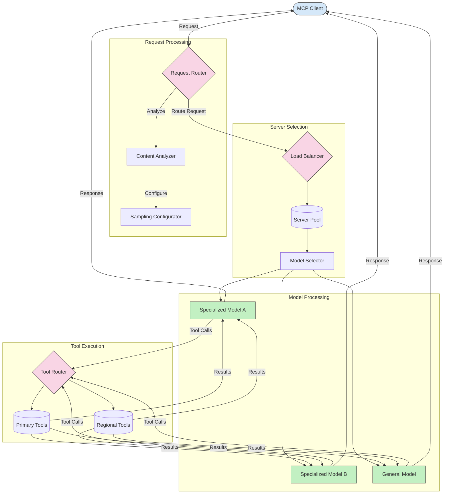

<!--
CO_OP_TRANSLATOR_METADATA:
{
  "original_hash": "af40eab7bd6ebf7e607f982a5506a5b5",
  "translation_date": "2025-06-12T23:35:33+00:00",
  "source_file": "05-AdvancedTopics/mcp-routing/README.md",
  "language_code": "pa"
}
-->
## MCP ਵਿੱਚ ਸੈਂਪਲਿੰਗ ਅਤੇ ਰਾਊਟਿੰਗ ਆਰਕੀਟੈਕਚਰ

ਸੈਂਪਲਿੰਗ ਮਾਡਲ ਕਾਂਟੈਕਸਟ ਪ੍ਰੋਟੋਕੋਲ (MCP) ਦਾ ਇੱਕ ਅਹਿਮ ਹਿੱਸਾ ਹੈ ਜੋ ਪ੍ਰਭਾਵਸ਼ালী ਬੇਨਤੀ ਪ੍ਰਕਿਰਿਆ ਅਤੇ ਰਾਊਟਿੰਗ ਦੀ ਸਹੂਲਤ ਦਿੰਦਾ ਹੈ। ਇਸ ਵਿੱਚ ਆਉਣ ਵਾਲੀਆਂ ਬੇਨਤੀਆਂ ਦਾ ਵਿਸ਼ਲੇਸ਼ਣ ਕੀਤਾ ਜਾਂਦਾ ਹੈ ਤਾਂ ਜੋ ਵੱਖ-ਵੱਖ ਮਾਪਦੰਡਾਂ ਜਿਵੇਂ ਕਿ ਸਮੱਗਰੀ ਦਾ ਪ੍ਰਕਾਰ, ਯੂਜ਼ਰ ਕਾਂਟੈਕਸਟ ਅਤੇ ਸਿਸਟਮ ਲੋਡ ਦੇ ਆਧਾਰ 'ਤੇ ਸਭ ਤੋਂ ਉਚਿਤ ਮਾਡਲ ਜਾਂ ਸੇਵਾ ਚੁਣੀ ਜਾ ਸਕੇ।

ਸੈਂਪਲਿੰਗ ਅਤੇ ਰਾਊਟਿੰਗ ਨੂੰ ਮਿਲਾ ਕੇ ਇੱਕ ਮਜ਼ਬੂਤ ਆਰਕੀਟੈਕਚਰ ਤਿਆਰ ਕੀਤਾ ਜਾ ਸਕਦਾ ਹੈ ਜੋ ਸਰੋਤਾਂ ਦੀ ਵਰਤੋਂ ਨੂੰ ਬਿਹਤਰ ਬਣਾਉਂਦਾ ਹੈ ਅਤੇ ਉੱਚ ਉਪਲਬਧਤਾ ਨੂੰ ਯਕੀਨੀ ਬਣਾਉਂਦਾ ਹੈ। ਸੈਂਪਲਿੰਗ ਪ੍ਰਕਿਰਿਆ ਬੇਨਤੀਆਂ ਦੀ ਵਰਗੀਕਰਨ ਲਈ ਵਰਤੀ ਜਾ ਸਕਦੀ ਹੈ, ਜਦਕਿ ਰਾਊਟਿੰਗ ਉਨ੍ਹਾਂ ਨੂੰ ਉਚਿਤ ਮਾਡਲਾਂ ਜਾਂ ਸੇਵਾਵਾਂ ਵੱਲ ਭੇਜਦੀ ਹੈ।

ਹੇਠਾਂ ਦਿੱਤਾ ਡਾਇਗ੍ਰਾਮ ਦਰਸਾਉਂਦਾ ਹੈ ਕਿ ਕਿਵੇਂ ਸੈਂਪਲਿੰਗ ਅਤੇ ਰਾਊਟਿੰਗ ਇੱਕ ਵਿਆਪਕ MCP ਆਰਕੀਟੈਕਚਰ ਵਿੱਚ ਮਿਲ ਕੇ ਕੰਮ ਕਰਦੇ ਹਨ:

## ਅੱਗੇ ਕੀ ਹੈ

- [5.6 ਸੈਂਪਲਿੰਗ](../mcp-sampling/README.md)

**ਅਸਵੀਕਾਰੋਪਣ**:  
ਇਹ ਦਸਤਾਵੇਜ਼ AI ਅਨੁਵਾਦ ਸੇਵਾ [Co-op Translator](https://github.com/Azure/co-op-translator) ਦੀ ਵਰਤੋਂ ਕਰਕੇ ਅਨੁਵਾਦਿਤ ਕੀਤਾ ਗਿਆ ਹੈ। ਜਦੋਂ ਕਿ ਅਸੀਂ ਸਹੀਤਾ ਲਈ ਕੋਸ਼ਿਸ਼ ਕਰਦੇ ਹਾਂ, ਕਿਰਪਾ ਕਰਕੇ ਧਿਆਨ ਵਿੱਚ ਰੱਖੋ ਕਿ ਸਵੈਚਲਿਤ ਅਨੁਵਾਦਾਂ ਵਿੱਚ ਗਲਤੀਆਂ ਜਾਂ ਅਸਹੀਤਾਵਾਂ ਹੋ ਸਕਦੀਆਂ ਹਨ। ਮੂਲ ਦਸਤਾਵੇਜ਼ ਆਪਣੀ ਮੂਲ ਭਾਸ਼ਾ ਵਿੱਚ ਹੀ ਅਧਿਕਾਰਤ ਸਰੋਤ ਮੰਨਿਆ ਜਾਣਾ ਚਾਹੀਦਾ ਹੈ। ਮਹੱਤਵਪੂਰਨ ਜਾਣਕਾਰੀ ਲਈ, ਪੇਸ਼ੇਵਰ ਮਨੁੱਖੀ ਅਨੁਵਾਦ ਦੀ ਸਿਫਾਰਸ਼ ਕੀਤੀ ਜਾਂਦੀ ਹੈ। ਅਸੀਂ ਇਸ ਅਨੁਵਾਦ ਦੀ ਵਰਤੋਂ ਕਰਕੇ ਹੋਣ ਵਾਲੀਆਂ ਕਿਸੇ ਵੀ ਗਲਤਫਹਮੀਆਂ ਜਾਂ ਗਲਤ ਵਿਆਖਿਆਵਾਂ ਲਈ ਜ਼ਿੰਮੇਵਾਰ ਨਹੀਂ ਹਾਂ।