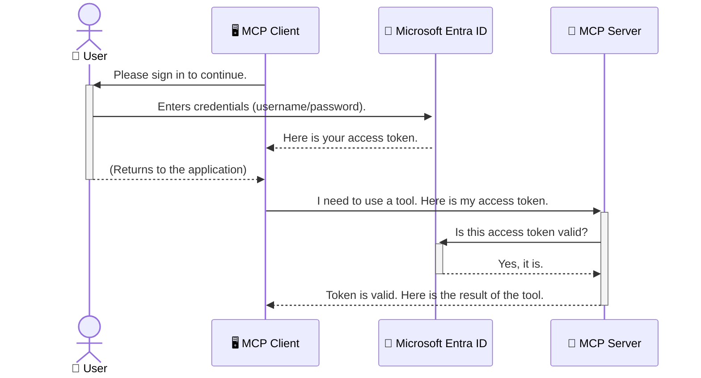

<!--
CO_OP_TRANSLATOR_METADATA:
{
  "original_hash": "6e562d7e5a77c8982da4aa8f762ad1d8",
  "translation_date": "2025-07-02T09:17:14+00:00",
  "source_file": "05-AdvancedTopics/mcp-security-entra/README.md",
  "language_code": "pa"
}
-->
# Securing AI Workflows: Entra ID Authentication for Model Context Protocol Servers

## Introduction  
ਆਪਣੇ Model Context Protocol (MCP) ਸਰਵਰ ਨੂੰ ਸੁਰੱਖਿਅਤ ਕਰਨਾ ਓਹਨਾ ਹੀ ਜਰੂਰੀ ਹੈ ਜਿਵੇਂ ਘਰ ਦਾ ਮੁੱਖ ਦਰਵਾਜ਼ਾ ਲਾਕ ਕਰਨਾ। ਜੇ ਤੁਸੀਂ MCP ਸਰਵਰ ਖੁੱਲ੍ਹਾ ਛੱਡ ਦਿੰਦੇ ਹੋ ਤਾਂ ਤੁਹਾਡੇ ਟੂਲਾਂ ਅਤੇ ਡਾਟਾ ਨੂੰ ਬਿਨਾਂ ਅਧਿਕਾਰ ਦੇ ਲੋਕਾਂ ਵੱਲੋਂ ਐਕਸੈਸ ਕੀਤਾ ਜਾ ਸਕਦਾ ਹੈ, ਜਿਸ ਨਾਲ ਸੁਰੱਖਿਆ ਦੀਆਂ ਸਮੱਸਿਆਵਾਂ ਪੈਦਾ ਹੋ ਸਕਦੀਆਂ ਹਨ। Microsoft Entra ID ਇੱਕ ਮਜ਼ਬੂਤ ਕਲਾਉਡ-ਆਧਾਰਿਤ ਆਈਡੈਂਟਿਟੀ ਅਤੇ ਐਕਸੈਸ ਮੈਨੇਜਮੈਂਟ ਹੱਲ ਪ੍ਰਦਾਨ ਕਰਦਾ ਹੈ, ਜੋ ਇਹ ਯਕੀਨੀ ਬਣਾਉਂਦਾ ਹੈ ਕਿ ਸਿਰਫ ਅਧਿਕਾਰਤ ਯੂਜ਼ਰ ਅਤੇ ਐਪਲੀਕੇਸ਼ਨਾਂ ਹੀ ਤੁਹਾਡੇ MCP ਸਰਵਰ ਨਾਲ ਇੰਟਰੈਕਟ ਕਰ ਸਕਣ। ਇਸ ਭਾਗ ਵਿੱਚ, ਤੁਸੀਂ ਸਿੱਖੋਗੇ ਕਿ Entra ID ਪ੍ਰਮਾਣੀਕਰਨ ਦੀ ਵਰਤੋਂ ਕਰਕੇ ਆਪਣੇ AI ਵਰਕਫਲੋਜ਼ ਨੂੰ ਕਿਵੇਂ ਸੁਰੱਖਿਅਤ ਕੀਤਾ ਜਾ ਸਕਦਾ ਹੈ।

## Learning Objectives  
ਇਸ ਭਾਗ ਦੇ ਅੰਤ ਤੱਕ, ਤੁਸੀਂ ਸਮਝ ਸਕੋਗੇ:

- MCP ਸਰਵਰਾਂ ਦੀ ਸੁਰੱਖਿਆ ਦੇ ਮਹੱਤਵ ਨੂੰ।  
- Microsoft Entra ID ਅਤੇ OAuth 2.0 ਪ੍ਰਮਾਣੀਕਰਨ ਦੇ ਬੁਨਿਆਦੀ ਤੱਤਾਂ ਨੂੰ ਸਮਝਾਉਣਾ।  
- ਪਬਲਿਕ ਅਤੇ ਗੁਪਤ ਕਲਾਇੰਟ ਵਿੱਚ ਫਰਕ ਪਛਾਣਨਾ।  
- Entra ID ਪ੍ਰਮਾਣੀਕਰਨ ਨੂੰ ਲੋਕਲ (ਪਬਲਿਕ ਕਲਾਇੰਟ) ਅਤੇ ਰਿਮੋਟ (ਗੁਪਤ ਕਲਾਇੰਟ) MCP ਸਰਵਰ ਸਥਿਤੀਆਂ ਵਿੱਚ ਲਾਗੂ ਕਰਨਾ।  
- AI ਵਰਕਫਲੋਜ਼ ਬਣਾਉਂਦਿਆਂ ਸੁਰੱਖਿਆ ਦੀਆਂ ਸਰਵੋਤਮ ਪ੍ਰਥਾਵਾਂ ਨੂੰ ਅਪਣਾਉਣਾ।  

## Security and MCP  
ਜਿਵੇਂ ਤੁਸੀਂ ਆਪਣੇ ਘਰ ਦਾ ਮੁੱਖ ਦਰਵਾਜ਼ਾ ਖੁੱਲ੍ਹਾ ਨਹੀਂ ਛੱਡਦੇ, ਉਸੇ ਤਰ੍ਹਾਂ ਤੁਹਾਨੂੰ MCP ਸਰਵਰ ਨੂੰ ਵੀ ਕਿਸੇ ਨੂੰ ਖੁੱਲ੍ਹਾ ਐਕਸੈਸ ਨਹੀਂ ਦੇਣਾ ਚਾਹੀਦਾ। ਆਪਣੇ AI ਵਰਕਫਲੋਜ਼ ਨੂੰ ਸੁਰੱਖਿਅਤ ਕਰਨਾ ਮਜ਼ਬੂਤ, ਭਰੋਸੇਯੋਗ ਅਤੇ ਸੁਰੱਖਿਅਤ ਐਪਲੀਕੇਸ਼ਨ ਬਣਾਉਣ ਲਈ ਜਰੂਰੀ ਹੈ। ਇਹ ਅਧਿਆਇ ਤੁਹਾਨੂੰ Microsoft Entra ID ਦੀ ਵਰਤੋਂ ਕਰਕੇ ਆਪਣੇ MCP ਸਰਵਰਾਂ ਨੂੰ ਸੁਰੱਖਿਅਤ ਕਰਨ ਬਾਰੇ ਜਾਣੂ ਕਰਵਾਏਗਾ, ਤਾਂ ਜੋ ਸਿਰਫ ਅਧਿਕਾਰਤ ਯੂਜ਼ਰ ਅਤੇ ਐਪਲੀਕੇਸ਼ਨ ਹੀ ਤੁਹਾਡੇ ਟੂਲਾਂ ਅਤੇ ਡਾਟਾ ਨਾਲ ਕੰਮ ਕਰ ਸਕਣ।  

## Why Security Matters for MCP Servers  
ਕਲਪਨਾ ਕਰੋ ਕਿ ਤੁਹਾਡੇ MCP ਸਰਵਰ ਕੋਲ ਇੱਕ ਐਸਾ ਟੂਲ ਹੈ ਜੋ ਈਮੇਲ ਭੇਜ ਸਕਦਾ ਹੈ ਜਾਂ ਗਾਹਕਾਂ ਦਾ ਡਾਟਾਬੇਸ ਐਕਸੈਸ ਕਰ ਸਕਦਾ ਹੈ। ਜੇ ਸਰਵਰ ਅਸੁਰੱਖਿਅਤ ਹੋਵੇ ਤਾਂ ਕੋਈ ਵੀ ਇਹ ਟੂਲ ਵਰਤ ਸਕਦਾ ਹੈ, ਜਿਸ ਨਾਲ ਬਿਨਾਂ ਅਧਿਕਾਰ ਦੇ ਡਾਟਾ ਐਕਸੈਸ, ਸਪੈਮ ਜਾਂ ਹੋਰ ਨੁਕਸਾਨਦਾਇਕ ਗਤੀਵਿਧੀਆਂ ਹੋ ਸਕਦੀਆਂ ਹਨ।  

ਪ੍ਰਮਾਣੀਕਰਨ ਲਾਗੂ ਕਰਕੇ, ਤੁਸੀਂ ਯਕੀਨੀ ਬਣਾਉਂਦੇ ਹੋ ਕਿ ਹਰ ਸਰਵਰ ਨੂੰ ਕੀਤੀ ਗਈ ਬੇਨਤੀ ਦੀ ਪੁਸ਼ਟੀ ਹੋਵੇ, ਜਿਸ ਨਾਲ ਬੇਨਤੀ ਕਰਨ ਵਾਲੇ ਯੂਜ਼ਰ ਜਾਂ ਐਪਲੀਕੇਸ਼ਨ ਦੀ ਪਛਾਣ ਹੋ ਸਕੇ। ਇਹ ਤੁਹਾਡੇ AI ਵਰਕਫਲੋਜ਼ ਨੂੰ ਸੁਰੱਖਿਅਤ ਕਰਨ ਦਾ ਪਹਿਲਾ ਅਤੇ ਸਭ ਤੋਂ ਜਰੂਰੀ ਕਦਮ ਹੈ।  

## Introduction to Microsoft Entra ID  
[**Microsoft Entra ID**](https://adoption.microsoft.com/microsoft-security/entra/) ਇੱਕ ਕਲਾਉਡ-ਆਧਾਰਿਤ ਆਈਡੈਂਟਿਟੀ ਅਤੇ ਐਕਸੈਸ ਮੈਨੇਜਮੈਂਟ ਸੇਵਾ ਹੈ। ਇਸਨੂੰ ਆਪਣੇ ਐਪਲੀਕੇਸ਼ਨਾਂ ਲਈ ਇੱਕ ਯੂਨੀਵਰਸਲ ਸੁਰੱਖਿਆ ਗਾਰਡ ਵਜੋਂ ਸੋਚੋ। ਇਹ ਯੂਜ਼ਰ ਦੀਆਂ ਪਹਚਾਣਾਂ ਦੀ ਪੁਸ਼ਟੀ (ਪ੍ਰਮਾਣੀਕਰਨ) ਅਤੇ ਉਹਨਾਂ ਨੂੰ ਕੀ ਕਰਨ ਦੀ ਆਗਿਆ ਹੈ (ਅਧਿਕਾਰ) ਦਾ ਨਿਰਣਯ ਕਰਨ ਦੀ ਮੁਸ਼ਕਲ ਪ੍ਰਕਿਰਿਆ ਨੂੰ ਸੰਭਾਲਦਾ ਹੈ।  

Entra ID ਦੀ ਵਰਤੋਂ ਕਰਕੇ, ਤੁਸੀਂ:  
- ਯੂਜ਼ਰਾਂ ਲਈ ਸੁਰੱਖਿਅਤ ਸਾਈਨ-ਇਨ ਯਕੀਨੀ ਬਣਾਉਂਦੇ ਹੋ।  
- APIs ਅਤੇ ਸਰਵਿਸਜ਼ ਦੀ ਰੱਖਿਆ ਕਰਦੇ ਹੋ।  
- ਕੇਂਦਰੀ ਸਥਾਨ ਤੋਂ ਐਕਸੈਸ ਨੀਤੀਆਂ ਦਾ ਪ੍ਰਬੰਧ ਕਰਦੇ ਹੋ।  

MCP ਸਰਵਰਾਂ ਲਈ, Entra ID ਇੱਕ ਮਜ਼ਬੂਤ ਅਤੇ ਭਰੋਸੇਯੋਗ ਹੱਲ ਪ੍ਰਦਾਨ ਕਰਦਾ ਹੈ ਜੋ ਇਹ ਨਿਰਧਾਰਤ ਕਰਦਾ ਹੈ ਕਿ ਕੌਣ ਤੁਹਾਡੇ ਸਰਵਰ ਦੀਆਂ ਖੂਬੀਆਂ ਨੂੰ ਵਰਤ ਸਕਦਾ ਹੈ।  

---

## Understanding the Magic: How Entra ID Authentication Works  
Entra ID ਪ੍ਰਮਾਣੀਕਰਨ ਲਈ **OAuth 2.0** ਵਰਗੇ ਖੁੱਲ੍ਹੇ ਮਿਆਰਾਂ ਦੀ ਵਰਤੋਂ ਕਰਦਾ ਹੈ। ਜਦੋਂ ਕਿ ਵਿਸਥਾਰ ਕਾਫੀ ਜਟਿਲ ਹੋ ਸਕਦਾ ਹੈ, ਮੁੱਖ ਵਿਚਾਰ ਸਧਾਰਣ ਹੈ ਅਤੇ ਇੱਕ ਉਦਾਹਰਨ ਨਾਲ ਸਮਝਿਆ ਜਾ ਸਕਦਾ ਹੈ।  

### A Gentle Introduction to OAuth 2.0: The Valet Key  
OAuth 2.0 ਨੂੰ ਆਪਣੇ ਕਾਰ ਲਈ ਇੱਕ ਵੈਲੇਟ ਸੇਵਾ ਵਾਂਗ ਸਮਝੋ। ਜਦੋਂ ਤੁਸੀਂ ਰੈਸਟੋਰੈਂਟ ਪਹੁੰਚਦੇ ਹੋ, ਤਾਂ ਤੁਸੀਂ ਵੈਲੇਟ ਨੂੰ ਆਪਣੀ ਮਾਸਟਰ ਚਾਬੀ ਨਹੀਂ ਦਿੰਦੇ। ਇਸ ਦੀ ਬਜਾਏ, ਤੁਸੀਂ ਇੱਕ **ਵੈਲੇਟ ਕੀ** ਦਿੰਦੇ ਹੋ ਜਿਸ ਵਿੱਚ ਸੀਮਿਤ ਅਧਿਕਾਰ ਹੁੰਦੇ ਹਨ—ਇਹ ਕਾਰ ਚਾਲੂ ਕਰ ਸਕਦੀ ਹੈ ਅਤੇ ਦਰਵਾਜ਼ੇ ਲਾਕ ਕਰ ਸਕਦੀ ਹੈ, ਪਰ ਟਰੰਕ ਜਾਂ ਗਲੋਵ ਕਮਪਾਰਟਮੈਂਟ ਨਹੀਂ ਖੋਲ੍ਹ ਸਕਦੀ।  

ਇਸ ਉਦਾਹਰਨ ਵਿੱਚ:  
- **ਤੁਸੀਂ** ਹੋ **ਯੂਜ਼ਰ**।  
- **ਤੁਹਾਡੀ ਕਾਰ** ਹੈ **MCP ਸਰਵਰ** ਜਿਸ ਵਿੱਚ ਕੀਮਤੀ ਟੂਲ ਅਤੇ ਡਾਟਾ ਹੈ।  
- **ਵੈਲੇਟ** ਹੈ **Microsoft Entra ID**।  
- **ਪਾਰਕਿੰਗ ਅਟੈਂਡੈਂਟ** ਹੈ **MCP ਕਲਾਇੰਟ** (ਐਪਲੀਕੇਸ਼ਨ ਜੋ ਸਰਵਰ ਨੂੰ ਐਕਸੈਸ ਕਰਨਾ ਚਾਹੁੰਦਾ ਹੈ)।  
- **ਵੈਲੇਟ ਕੀ** ਹੈ **ਐਕਸੈਸ ਟੋਕਨ**।  

ਐਕਸੈਸ ਟੋਕਨ ਇੱਕ ਸੁਰੱਖਿਅਤ ਟੈਕਸਟ ਸਟਰਿੰਗ ਹੁੰਦੀ ਹੈ ਜੋ MCP ਕਲਾਇੰਟ ਨੂੰ ਤੁਹਾਡੇ ਸਾਈਨ ਇਨ ਕਰਨ ਤੋਂ ਬਾਅਦ Entra ID ਵੱਲੋਂ ਮਿਲਦੀ ਹੈ। ਫਿਰ ਕਲਾਇੰਟ ਇਹ ਟੋਕਨ ਹਰ ਬੇਨਤੀ ਨਾਲ MCP ਸਰਵਰ ਨੂੰ ਦਿੰਦਾ ਹੈ। ਸਰਵਰ ਟੋਕਨ ਦੀ ਜਾਂਚ ਕਰਦਾ ਹੈ ਕਿ ਬੇਨਤੀ ਵੈਧ ਹੈ ਅਤੇ ਕਲਾਇੰਟ ਕੋਲ ਲੋੜੀਂਦੇ ਅਧਿਕਾਰ ਹਨ, ਬਿਨਾਂ ਤੁਹਾਡੇ ਅਸਲ ਪ੍ਰਮਾਣਪੱਤਰ (ਜਿਵੇਂ ਪਾਸਵਰਡ) ਨੂੰ ਸਾਂਭਣ ਦੀ ਲੋੜ ਦੇ।  

### The Authentication Flow  
ਇਸ ਪ੍ਰਕਿਰਿਆ ਦਾ ਅਮਲ ਇਸ ਤਰ੍ਹਾਂ ਹੁੰਦਾ ਹੈ:  



### Introducing the Microsoft Authentication Library (MSAL)  
ਕੋਡ ਵਿੱਚ ਜਾਣ ਤੋਂ ਪਹਿਲਾਂ, ਇੱਕ ਮਹੱਤਵਪੂਰਨ ਹਿੱਸਾ ਜਾਣਨਾ ਜਰੂਰੀ ਹੈ ਜੋ ਤੁਸੀਂ ਉਦਾਹਰਨਾਂ ਵਿੱਚ ਵੇਖੋਗੇ: **Microsoft Authentication Library (MSAL)**।  

MSAL ਮਾਇਕਰੋਸਾਫਟ ਵੱਲੋਂ ਵਿਕਸਿਤ ਇੱਕ ਲਾਇਬ੍ਰੇਰੀ ਹੈ ਜੋ ਡਿਵੈਲਪਰਾਂ ਲਈ ਪ੍ਰਮਾਣੀਕਰਨ ਸੰਭਾਲਣਾ ਬਹੁਤ ਆਸਾਨ ਬਣਾਉਂਦੀ ਹੈ। ਇਸ ਨਾਲ ਤੁਹਾਨੂੰ ਸੁਰੱਖਿਆ ਟੋਕਨਾਂ ਨੂੰ ਸੰਭਾਲਣ, ਸਾਈਨ-ਇਨ ਪ੍ਰਕਿਰਿਆ ਅਤੇ ਸੈਸ਼ਨ ਰੀਫ੍ਰੈਸ਼ ਕਰਨ ਲਈ ਮੁਸ਼ਕਲ ਕੋਡ ਲਿਖਣ ਦੀ ਜ਼ਰੂਰਤ ਨਹੀਂ ਪੈਂਦੀ।  

MSAL ਦੀ ਵਰਤੋਂ ਬਹੁਤ ਸਿਫਾਰਸ਼ੀ ਹੈ ਕਿਉਂਕਿ:  
- **ਇਹ ਸੁਰੱਖਿਅਤ ਹੈ:** ਇਹ ਉਦਯੋਗ ਮਿਆਰਾਂ ਅਤੇ ਸਰਵੋਤਮ ਸੁਰੱਖਿਆ ਪ੍ਰਥਾਵਾਂ ਨੂੰ ਲਾਗੂ ਕਰਦਾ ਹੈ, ਜਿਸ ਨਾਲ ਤੁਹਾਡੇ ਕੋਡ ਵਿੱਚ ਕਮਜ਼ੋਰੀਆਂ ਦੇ ਖਤਰੇ ਘੱਟ ਹੁੰਦੇ ਹਨ।  
- **ਇਹ ਵਿਕਾਸ ਨੂੰ ਆਸਾਨ ਬਣਾਉਂਦਾ ਹੈ:** ਇਹ OAuth 2.0 ਅਤੇ OpenID Connect ਪ੍ਰੋਟੋਕਾਲਾਂ ਦੀ ਜਟਿਲਤਾ ਨੂੰ ਛੁਪਾ ਕੇ ਤੁਹਾਡੇ ਐਪ ਵਿੱਚ ਸਖ਼ਤ ਪ੍ਰਮਾਣੀਕਰਨ ਜੋੜਦਾ ਹੈ।  
- **ਇਹ ਸੰਭਾਲਿਆ ਜਾਂਦਾ ਹੈ:** Microsoft MSAL ਨੂੰ ਨਵੇਂ ਸੁਰੱਖਿਆ ਖ਼ਤਰਿਆਂ ਅਤੇ ਪਲੇਟਫਾਰਮ ਬਦਲਾਅ ਲਈ ਨਿਰੰਤਰ ਅੱਪਡੇਟ ਕਰਦਾ ਹੈ।  

MSAL ਕਈ ਭਾਸ਼ਾਵਾਂ ਅਤੇ ਐਪਲੀਕੇਸ਼ਨ ਫਰੇਮਵਰਕਾਂ ਲਈ ਉਪਲਬਧ ਹੈ, ਜਿਵੇਂ .NET, JavaScript/TypeScript, Python, Java, Go, ਅਤੇ ਮੋਬਾਈਲ ਪਲੇਟਫਾਰਮ iOS ਅਤੇ Android। ਇਸ ਨਾਲ ਤੁਸੀਂ ਆਪਣੇ ਸਾਰੇ ਟੈਕਨੋਲੋਜੀ ਸਟੈਕ ਵਿੱਚ ਇੱਕੋ ਜਿਹੇ ਪ੍ਰਮਾਣੀਕਰਨ ਪੈਟਰਨ ਵਰਤ ਸਕਦੇ ਹੋ।  

MSAL ਬਾਰੇ ਹੋਰ ਜਾਣਕਾਰੀ ਲਈ, ਤੁਸੀਂ ਅਧਿਕਾਰਿਕ [MSAL ਓਵਰਵਿਊ ਡੌਕਯੂਮੈਂਟੇਸ਼ਨ](https://learn.microsoft.com/entra/identity-platform/msal-overview) ਵੇਖ ਸਕਦੇ ਹੋ।  

---

## Securing Your MCP Server with Entra ID: A Step-by-Step Guide  
ਹੁਣ, ਆਓ ਵੇਖੀਏ ਕਿ ਇੱਕ ਲੋਕਲ MCP ਸਰਵਰ ਨੂੰ ਕਿਵੇਂ ਸੁਰੱਖਿਅਤ ਕੀਤਾ ਜਾ ਸਕਦਾ ਹੈ (ਜੋ `stdio`) using Entra ID. This example uses a **public client**, which is suitable for applications running on a user's machine, like a desktop app or a local development server.

### Scenario 1: Securing a Local MCP Server (with a Public Client)

In this scenario, we'll look at an MCP server that runs locally, communicates over `stdio`, and uses Entra ID to authenticate the user before allowing access to its tools. The server will have a single tool that fetches the user's profile information from the Microsoft Graph API.

#### 1. Setting Up the Application in Entra ID

Before writing any code, you need to register your application in Microsoft Entra ID. This tells Entra ID about your application and grants it permission to use the authentication service.

1. Navigate to the **[Microsoft Entra portal](https://entra.microsoft.com/)**.
2. Go to **App registrations** and click **New registration**.
3. Give your application a name (e.g., "My Local MCP Server").
4. For **Supported account types**, select **Accounts in this organizational directory only**.
5. You can leave the **Redirect URI** blank for this example.
6. Click **Register**.

Once registered, take note of the **Application (client) ID** and **Directory (tenant) ID**. You'll need these in your code.

#### 2. The Code: A Breakdown

Let's look at the key parts of the code that handle authentication. The full code for this example is available in the [Entra ID - Local - WAM](https://github.com/Azure-Samples/mcp-auth-servers/tree/main/src/entra-id-local-wam) folder of the [mcp-auth-servers GitHub repository](https://github.com/Azure-Samples/mcp-auth-servers).

**`AuthenticationService.cs`**

This class is responsible for handling the interaction with Entra ID.

- **`CreateAsync`**: This method initializes the `PublicClientApplication` from the MSAL (Microsoft Authentication Library). It's configured with your application's `clientId` and `tenantId`.
- **`WithBroker`**: This enables the use of a broker (like the Windows Web Account Manager), which provides a more secure and seamless single sign-on experience.
- **`AcquireTokenAsync`** ਵਰਗਾ ਕੋਰ ਮੈਥਡ ਵਰਤਦਾ ਹੈ। ਇਹ ਪਹਿਲਾਂ ਟੋਕਨ ਨੂੰ ਚੁਪਚਾਪ ਪ੍ਰਾਪਤ ਕਰਨ ਦੀ ਕੋਸ਼ਿਸ਼ ਕਰਦਾ ਹੈ (ਜਿਸਦਾ ਮਤਲਬ ਹੈ ਕਿ ਯੂਜ਼ਰ ਨੂੰ ਦੁਬਾਰਾ ਸਾਈਨ ਇਨ ਕਰਨ ਦੀ ਲੋੜ ਨਹੀਂ ਪੈਂਦੀ ਜੇ ਉਹ ਪਹਿਲਾਂ ਹੀ ਵੈਧ ਸੈਸ਼ਨ ਰੱਖਦਾ ਹੈ)। ਜੇ ਚੁਪਚਾਪ ਟੋਕਨ ਨਹੀਂ ਮਿਲਦਾ, ਤਾਂ ਇਹ ਯੂਜ਼ਰ ਨੂੰ ਇੰਟਰਐਕਟਿਵ ਸਾਈਨ ਇਨ ਲਈ ਪ੍ਰੰਪਟ ਕਰੇਗਾ।  

```csharp
// Simplified for clarity
public static async Task<AuthenticationService> CreateAsync(ILogger<AuthenticationService> logger)
{
    var msalClient = PublicClientApplicationBuilder
        .Create(_clientId) // Your Application (client) ID
        .WithAuthority(AadAuthorityAudience.AzureAdMyOrg)
        .WithTenantId(_tenantId) // Your Directory (tenant) ID
        .WithBroker(new BrokerOptions(BrokerOptions.OperatingSystems.Windows))
        .Build();

    // ... cache registration ...

    return new AuthenticationService(logger, msalClient);
}

public async Task<string> AcquireTokenAsync()
{
    try
    {
        // Try silent authentication first
        var accounts = await _msalClient.GetAccountsAsync();
        var account = accounts.FirstOrDefault();

        AuthenticationResult? result = null;

        if (account != null)
        {
            result = await _msalClient.AcquireTokenSilent(_scopes, account).ExecuteAsync();
        }
        else
        {
            // If no account, or silent fails, go interactive
            result = await _msalClient.AcquireTokenInteractive(_scopes).ExecuteAsync();
        }

        return result.AccessToken;
    }
    catch (Exception ex)
    {
        _logger.LogError(ex, "An error occurred while acquiring the token.");
        throw; // Optionally rethrow the exception for higher-level handling
    }
}
```  

**`Program.cs`**

This is where the MCP server is set up and the authentication service is integrated.

- **`AddSingleton<AuthenticationService>`**: This registers the `AuthenticationService` with the dependency injection container, so it can be used by other parts of the application (like our tool).
- **`GetUserDetailsFromGraph` tool**: This tool requires an instance of `AuthenticationService`. Before it does anything, it calls `authService.AcquireTokenAsync()` ਦੀ ਵਰਤੋਂ ਕਰਕੇ ਵੈਧ ਐਕਸੈਸ ਟੋਕਨ ਪ੍ਰਾਪਤ ਕਰਦਾ ਹੈ। ਜੇ ਪ੍ਰਮਾਣੀਕਰਨ ਸਫਲ ਰਹਿੰਦਾ ਹੈ, ਤਾਂ ਇਹ ਟੋਕਨ ਦੀ ਵਰਤੋਂ ਕਰਕੇ Microsoft Graph API ਨੂੰ ਕਾਲ ਕਰਦਾ ਹੈ ਅਤੇ ਯੂਜ਼ਰ ਦੇ ਵੇਰਵੇ ਲਿਆਉਂਦਾ ਹੈ।  

```csharp
// Simplified for clarity
[McpServerTool(Name = "GetUserDetailsFromGraph")]
public static async Task<string> GetUserDetailsFromGraph(
    AuthenticationService authService)
{
    try
    {
        // This will trigger the authentication flow
        var accessToken = await authService.AcquireTokenAsync();

        // Use the token to create a GraphServiceClient
        var graphClient = new GraphServiceClient(
            new BaseBearerTokenAuthenticationProvider(new TokenProvider(authService)));

        var user = await graphClient.Me.GetAsync();

        return System.Text.Json.JsonSerializer.Serialize(user);
    }
    catch (Exception ex)
    {
        return $"Error: {ex.Message}";
    }
}
```  

#### 3. How It All Works Together  
1. ਜਦ MCP ਕਲਾਇੰਟ `GetUserDetailsFromGraph` tool, the tool first calls `AcquireTokenAsync`.
2. `AcquireTokenAsync` triggers the MSAL library to check for a valid token.
3. If no token is found, MSAL, through the broker, will prompt the user to sign in with their Entra ID account.
4. Once the user signs in, Entra ID issues an access token.
5. The tool receives the token and uses it to make a secure call to the Microsoft Graph API.
6. The user's details are returned to the MCP client.

This process ensures that only authenticated users can use the tool, effectively securing your local MCP server.

### Scenario 2: Securing a Remote MCP Server (with a Confidential Client)

When your MCP server is running on a remote machine (like a cloud server) and communicates over a protocol like HTTP Streaming, the security requirements are different. In this case, you should use a **confidential client** and the **Authorization Code Flow**. This is a more secure method because the application's secrets are never exposed to the browser.

This example uses a TypeScript-based MCP server that uses Express.js to handle HTTP requests.

#### 1. Setting Up the Application in Entra ID

The setup in Entra ID is similar to the public client, but with one key difference: you need to create a **client secret**.

1. Navigate to the **[Microsoft Entra portal](https://entra.microsoft.com/)**.
2. In your app registration, go to the **Certificates & secrets** tab.
3. Click **New client secret**, give it a description, and click **Add**.
4. **Important:** Copy the secret value immediately. You will not be able to see it again.
5. You also need to configure a **Redirect URI**. Go to the **Authentication** tab, click **Add a platform**, select **Web**, and enter the redirect URI for your application (e.g., `http://localhost:3001/auth/callback`).

> **⚠️ Important Security Note:** For production applications, Microsoft strongly recommends using **secretless authentication** methods such as **Managed Identity** or **Workload Identity Federation** instead of client secrets. Client secrets pose security risks as they can be exposed or compromised. Managed identities provide a more secure approach by eliminating the need to store credentials in your code or configuration.
>
> For more information about managed identities and how to implement them, see the [Managed identities for Azure resources overview](https://learn.microsoft.com/entra/identity/managed-identities-azure-resources/overview).

#### 2. The Code: A Breakdown

This example uses a session-based approach. When the user authenticates, the server stores the access token and refresh token in a session and gives the user a session token. This session token is then used for subsequent requests. The full code for this example is available in the [Entra ID - Confidential client](https://github.com/Azure-Samples/mcp-auth-servers/tree/main/src/entra-id-cca-session) folder of the [mcp-auth-servers GitHub repository](https://github.com/Azure-Samples/mcp-auth-servers).

**`Server.ts`**

This file sets up the Express server and the MCP transport layer.

- **`requireBearerAuth`**: This is middleware that protects the `/sse` and `/message` endpoints. It checks for a valid bearer token in the `Authorization` header of the request.
- **`EntraIdServerAuthProvider`**: This is a custom class that implements the `McpServerAuthorizationProvider` interface. It's responsible for handling the OAuth 2.0 flow.
- **`/auth/callback`** ਨੂੰ ਵਰਤਦਾ ਹੈ: ਇਹ ਐਂਡਪੋਇੰਟ Entra ID ਵੱਲੋਂ ਯੂਜ਼ਰ ਦੇ ਪ੍ਰਮਾਣੀਕਰਨ ਤੋਂ ਬਾਅਦ ਰੀਡਾਇਰੈਕਟ ਨੂੰ ਸੰਭਾਲਦਾ ਹੈ। ਇਹ ਅਧਿਕਾਰ ਕੋਡ ਨੂੰ ਐਕਸੈਸ ਟੋਕਨ ਅਤੇ ਰੀਫ੍ਰੈਸ਼ ਟੋਕਨ ਵਿੱਚ ਬਦਲਦਾ ਹੈ।  

```typescript
// Simplified for clarity
const app = express();
const { server } = createServer();
const provider = new EntraIdServerAuthProvider();

// Protect the SSE endpoint
app.get("/sse", requireBearerAuth({
  provider,
  requiredScopes: ["User.Read"]
}), async (req, res) => {
  // ... connect to the transport ...
});

// Protect the message endpoint
app.post("/message", requireBearerAuth({
  provider,
  requiredScopes: ["User.Read"]
}), async (req, res) => {
  // ... handle the message ...
});

// Handle the OAuth 2.0 callback
app.get("/auth/callback", (req, res) => {
  provider.handleCallback(req.query.code, req.query.state)
    .then(result => {
      // ... handle success or failure ...
    });
});
```  

**`Tools.ts`**

This file defines the tools that the MCP server provides. The `getUserDetails` ਟੂਲ ਪਿਛਲੇ ਉਦਾਹਰਨ ਵਰਗਾ ਹੀ ਹੈ, ਪਰ ਇਹ ਸੈਸ਼ਨ ਤੋਂ ਐਕਸੈਸ ਟੋਕਨ ਲੈਂਦਾ ਹੈ।  

```typescript
// Simplified for clarity
server.setRequestHandler(CallToolRequestSchema, async (request) => {
  const { name } = request.params;
  const context = request.params?.context as { token?: string } | undefined;
  const sessionToken = context?.token;

  if (name === ToolName.GET_USER_DETAILS) {
    if (!sessionToken) {
      throw new AuthenticationError("Authentication token is missing or invalid. Ensure the token is provided in the request context.");
    }

    // Get the Entra ID token from the session store
    const tokenData = tokenStore.getToken(sessionToken);
    const entraIdToken = tokenData.accessToken;

    const graphClient = Client.init({
      authProvider: (done) => {
        done(null, entraIdToken);
      }
    });

    const user = await graphClient.api('/me').get();

    // ... return user details ...
  }
});
```  

**`auth/EntraIdServerAuthProvider.ts`**

This class handles the logic for:

- Redirecting the user to the Entra ID sign-in page.
- Exchanging the authorization code for an access token.
- Storing the tokens in the `tokenStore`.
- Refreshing the access token when it expires.

#### 3. How It All Works Together

1. When a user first tries to connect to the MCP server, the `requireBearerAuth` middleware will see that they don't have a valid session and will redirect them to the Entra ID sign-in page.
2. The user signs in with their Entra ID account.
3. Entra ID redirects the user back to the `/auth/callback` endpoint with an authorization code.
4. The server exchanges the code for an access token and a refresh token, stores them, and creates a session token which is sent to the client.
5. The client can now use this session token in the `Authorization` header for all future requests to the MCP server.
6. When the `getUserDetails` ਟੂਲ ਨੂੰ ਕਾਲ ਕੀਤਾ ਜਾਂਦਾ ਹੈ, ਜੋ ਸੈਸ਼ਨ ਟੋਕਨ ਦੀ ਵਰਤੋਂ ਕਰਕੇ Entra ID ਐਕਸੈਸ ਟੋਕਨ ਲੱਭਦਾ ਹੈ ਅਤੇ ਫਿਰ Microsoft Graph API ਨੂੰ ਕਾਲ ਕਰਦਾ ਹੈ।  

ਇਹ ਪ੍ਰਵਾਹ ਪਬਲਿਕ ਕਲਾਇੰਟ ਪ੍ਰਵਾਹ ਨਾਲੋਂ ਜਿਆਦਾ ਜਟਿਲ ਹੈ, ਪਰ ਇੰਟਰਨੈੱਟ-ਮੁੱਖ ਐਂਡਪੋਇੰਟਾਂ ਲਈ ਲਾਜ਼ਮੀ ਹੈ। ਕਿਉਂਕਿ ਰਿਮੋਟ MCP ਸਰਵਰ ਪਬਲਿਕ ਇੰਟਰਨੈੱਟ 'ਤੇ ਉਪਲਬਧ ਹੁੰਦੇ ਹਨ, ਉਨ੍ਹਾਂ ਨੂੰ ਬਿਨਾਂ ਅਧਿਕਾਰ ਦੇ ਐਕਸੈਸ ਅਤੇ ਸੰਭਾਵਿਤ ਹਮਲਿਆਂ ਤੋਂ ਬਚਾਅ ਲਈ ਮਜ਼ਬੂਤ ਸੁਰੱਖਿਆ ਦੀ ਲੋੜ ਹੁੰਦੀ ਹੈ।  

## Security Best Practices  
- **ਹਮੇਸ਼ਾ HTTPS ਵਰਤੋਂ:** ਕਲਾਇੰਟ ਅਤੇ ਸਰਵਰ ਵਿਚਕਾਰ ਸੰਚਾਰ ਨੂੰ ਇਨਕ੍ਰਿਪਟ ਕਰੋ ਤਾਂ ਜੋ ਟੋਕਨਾਂ ਨੂੰ ਚੋਰੀ ਤੋਂ ਬਚਾਇਆ ਜਾ ਸਕੇ।  
- **Role-Based Access Control (RBAC) ਲਾਗੂ ਕਰੋ:** ਸਿਰਫ ਇਹ ਨਹੀਂ ਦੇਖੋ ਕਿ ਯੂਜ਼ਰ ਪ੍ਰਮਾਣਿਤ ਹੈ ਜਾਂ ਨਹੀਂ, ਬਲਕਿ ਇਹ ਵੀ ਜਾਂਚੋ ਕਿ ਉਹ ਕੀ ਕਰਨ ਦੇ ਅਧਿਕਾਰ ਰੱਖਦਾ ਹੈ। ਤੁਸੀਂ Entra ID ਵਿੱਚ ਰੋਲ ਡਿਫਾਈਨ ਕਰਕੇ MCP ਸਰਵਰ ਵਿੱਚ ਉਹਨਾਂ ਦੀ ਜਾਂਚ ਕਰ ਸਕਦੇ ਹੋ।  
- **ਮਾਨੀਟਰ ਅਤੇ ਆਡੀਟ ਕਰੋ:** ਸਾਰੇ ਪ੍ਰਮਾਣੀਕਰਨ ਇਵੈਂਟਾਂ ਨੂੰ ਲੌਗ ਕਰੋ ਤਾਂ ਜੋ ਸ਼ੱਕੀ ਗਤੀਵਿਧੀਆਂ ਦੀ ਪਛਾਣ ਅਤੇ ਪ੍ਰਤੀਕ੍ਰਿਆ ਕੀਤੀ ਜਾ ਸਕੇ।  
- **ਰੇਟ ਲਿਮਿਟਿੰਗ ਅਤੇ ਥ੍ਰੌਟਲਿੰਗ ਸੰਭਾਲੋ:** Microsoft Graph ਅਤੇ ਹੋਰ APIs ਰੇਟ ਲਿਮਿਟਿੰਗ ਲਗਾਉਂਦੇ ਹਨ ਤਾਂ ਜੋ ਦੁਰੁਪਯੋਗ ਰੋਕਿਆ ਜਾ ਸਕੇ। MCP ਸਰਵਰ ਵਿੱਚ ਐਕਸਪੋਨੇਸ਼ੀਅਲ ਬੈਕਆਫ ਅਤੇ ਰੀਟ੍ਰਾਈ ਲਾਜਿਕ ਲਾਗੂ ਕਰੋ ਤਾਂ ਜੋ HTTP 429 (ਬਹੁਤ ਜ਼ਿਆਦਾ ਬੇਨਤੀਆਂ) ਦੇ ਜਵਾਬਾਂ ਨੂੰ ਨਰਮਾਈ ਨਾਲ ਸੰਭਾਲਿਆ ਜਾ ਸਕੇ। ਬਾਰ-ਬਾਰ ਐਕਸੈਸ ਕੀਤੇ ਜਾਣ ਵਾਲੇ ਡਾਟੇ ਨੂੰ ਕੈਸ਼ ਕਰਨ ਬਾਰੇ ਸੋਚੋ ਤਾਂ ਜੋ API ਕਾਲਾਂ ਘੱਟ ਹੋਣ।  
- **ਟੋਕਨ ਸੁਰੱਖਿਅਤ ਸਟੋਰੇਜ:** ਐਕਸੈਸ ਟੋਕਨ ਅਤੇ ਰੀਫ੍ਰੈਸ਼ ਟੋਕਨ ਨੂੰ ਸੁਰੱਖਿਅਤ ਢੰਗ ਨਾਲ ਸਟੋਰ ਕਰੋ। ਲੋਕਲ ਐਪਲੀਕੇਸ਼ਨਾਂ ਲਈ, ਸਿਸਟਮ ਦੇ ਸੁਰੱਖਿਅਤ ਸਟੋਰੇਜ ਮਕੈਨਿਜ਼ਮ ਵਰਤੋ। ਸਰਵਰ ਐਪਲੀਕੇਸ਼ਨਾਂ ਲਈ, ਇਨਕ੍ਰਿਪਟਿਡ ਸਟੋਰੇਜ ਜਾਂ ਸੁਰੱਖਿਅਤ ਕੀ ਮੈਨੇਜਮੈਂਟ ਸਰਵਿਸਜ਼ (ਜਿਵੇਂ Azure Key Vault) ਦੀ ਵਰਤੋਂ ਕਰੋ।  
- **ਟੋਕਨ ਮਿਆਦ ਖਤਮ ਹੋਣ ਦੀ ਸੰਭਾਲ:** ਐਕਸੈਸ ਟੋਕਨਾਂ ਦੀ ਮਿਆਦ ਸੀਮਿਤ ਹੁੰਦੀ ਹੈ। ਰੀਫ੍ਰੈਸ਼ ਟੋਕਨਾਂ ਦੀ ਵਰਤੋਂ ਕਰਕੇ ਆਟੋਮੈਟਿਕ ਟੋਕਨ ਰੀਫ੍ਰੈਸ਼ ਲਾਗੂ ਕਰੋ ਤਾਂ ਜੋ ਯੂਜ਼ਰ ਨੂੰ ਮੁੜ ਪ੍ਰਮਾਣੀਕਰਨ ਕਰਨ ਦੀ ਲੋੜ ਨਾ ਪਵੇ।  
- **Azure API Management ਦੀ ਵਰਤੋਂ ਬਾਰੇ ਸੋਚੋ:** ਜਦੋਂ ਤੁਸੀਂ MCP ਸਰਵਰ ਵਿੱਚ ਸਿੱਧੀ ਸੁਰੱਖਿਆ ਲਾਗੂ ਕਰਦੇ ਹੋ ਤਾਂ ਤੁਹਾਡੇ ਕੋਲ ਬਹੁਤ ਨਿਯੰਤਰਣ ਹੁੰਦਾ ਹੈ, ਪਰ API ਗੇਟਵੇਜ਼ ਜਿਵੇਂ Azure API Management ਬਹੁਤ ਸਾਰੇ ਸੁਰੱਖਿਆ ਮੁੱਦੇ ਆਪਣੇ ਆਪ ਸੰਭਾਲ ਸਕਦੇ ਹਨ, ਜਿਵੇਂ ਪ੍ਰਮਾਣੀਕਰਨ, ਅਧਿਕਾਰ, ਰੇਟ ਲਿਮਿਟਿੰਗ ਅਤੇ ਮਾਨੀਟਰਨਿੰਗ। ਇਹ ਤੁਹਾਡੇ ਕਲਾਇੰਟਾਂ ਅਤੇ MCP

**ਅਸਵੀਕਾਰੋक्ति**:  
ਇਹ ਦਸਤਾਵੇਜ਼ AI ਅਨੁਵਾਦ ਸੇਵਾ [Co-op Translator](https://github.com/Azure/co-op-translator) ਦੀ ਵਰਤੋਂ ਕਰਕੇ ਅਨੁਵਾਦਿਤ ਕੀਤਾ ਗਿਆ ਹੈ। ਜਦੋਂ ਕਿ ਅਸੀਂ ਸਹੀਤਾ ਲਈ ਯਤਨ ਕਰਦੇ ਹਾਂ, ਕਿਰਪਾ ਕਰਕੇ ਧਿਆਨ ਰੱਖੋ ਕਿ ਆਟੋਮੈਟਿਕ ਅਨੁਵਾਦਾਂ ਵਿੱਚ ਗਲਤੀਆਂ ਜਾਂ ਅਣਸਹੀ ਹੋ ਸਕਦੀਆਂ ਹਨ। ਮੂਲ ਦਸਤਾਵੇਜ਼ ਆਪਣੀ ਮੂਲ ਭਾਸ਼ਾ ਵਿੱਚ ਅਧਿਕਾਰਕ ਸਰੋਤ ਮੰਨਿਆ ਜਾਣਾ ਚਾਹੀਦਾ ਹੈ। ਮਹੱਤਵਪੂਰਨ ਜਾਣਕਾਰੀ ਲਈ, ਪੇਸ਼ੇਵਰ ਮਨੁੱਖੀ ਅਨੁਵਾਦ ਦੀ ਸਿਫ਼ਾਰਸ਼ ਕੀਤੀ ਜਾਂਦੀ ਹੈ। ਅਸੀਂ ਇਸ ਅਨੁਵਾਦ ਦੀ ਵਰਤੋਂ ਤੋਂ ਪੈਦਾ ਹੋਣ ਵਾਲੀਆਂ ਕਿਸੇ ਵੀ ਗਲਤਫਹਿਮੀਆਂ ਜਾਂ ਗਲਤ ਵਿਆਖਿਆਵਾਂ ਲਈ ਜ਼ਿੰਮੇਵਾਰ ਨਹੀਂ ਹਾਂ।