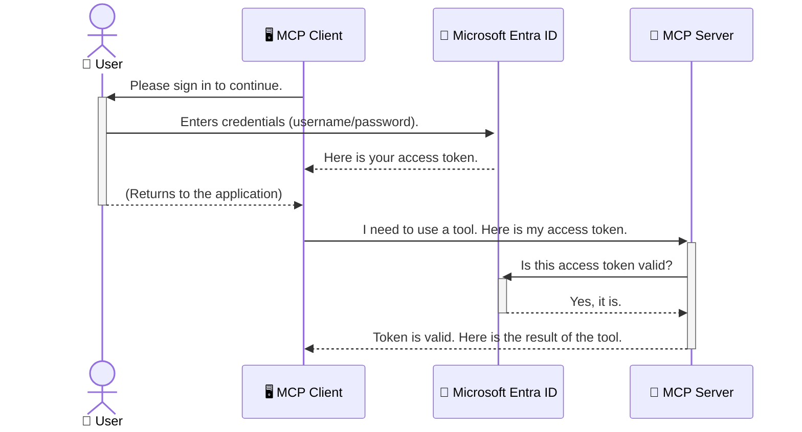

<!--
CO_OP_TRANSLATOR_METADATA:
{
  "original_hash": "0abf26a6c4dbe905d5d49ccdc0ccfe92",
  "translation_date": "2025-06-26T16:26:16+00:00",
  "source_file": "05-AdvancedTopics/mcp-security-entra/README.md",
  "language_code": "pa"
}
-->
# Securing AI Workflows: Entra ID Authentication for Model Context Protocol Servers

## ਜਾਣੂ

ਆਪਣੇ Model Context Protocol (MCP) ਸਰਵਰ ਨੂੰ ਸੁਰੱਖਿਅਤ ਕਰਨਾ ਉਸੇ ਤਰ੍ਹਾਂ ਜਰੂਰੀ ਹੈ ਜਿਵੇਂ ਆਪਣੇ ਘਰ ਦੇ ਮੁੱਖ ਦਰਵਾਜ਼ੇ ਨੂੰ ਤਾਲਾ ਲਗਾਉਣਾ। ਜੇ MCP ਸਰਵਰ ਖੁੱਲਾ ਰਹਿੰਦਾ ਹੈ ਤਾਂ ਤੁਹਾਡੇ ਟੂਲ ਅਤੇ ਡਾਟਾ ਬਿਨਾਂ ਅਧਿਕਾਰ ਦੇ ਪਹੁੰਚ ਲਈ ਉਪਲਬਧ ਹੋ ਜਾਂਦੇ ਹਨ, ਜਿਸ ਨਾਲ ਸੁਰੱਖਿਆ ਉਲੰਘਣਾਂ ਹੋ ਸਕਦੀਆਂ ਹਨ। Microsoft Entra ID ਇੱਕ ਮਜ਼ਬੂਤ ਕਲਾਉਡ-ਅਧਾਰਿਤ ਪਹਿਚਾਣ ਅਤੇ ਪਹੁੰਚ ਪ੍ਰਬੰਧਨ ਹੱਲ ਪ੍ਰਦਾਨ ਕਰਦਾ ਹੈ, ਜੋ ਇਹ ਯਕੀਨੀ ਬਣਾਉਂਦਾ ਹੈ ਕਿ ਸਿਰਫ ਅਧਿਕਾਰਤ ਉਪਭੋਗਤਾ ਅਤੇ ਐਪਲੀਕੇਸ਼ਨ ਹੀ ਤੁਹਾਡੇ MCP ਸਰਵਰ ਨਾਲ ਸੰਪਰਕ ਕਰ ਸਕਦੇ ਹਨ। ਇਸ ਭਾਗ ਵਿੱਚ, ਤੁਸੀਂ ਜਾਣੋਗੇ ਕਿ ਕਿਵੇਂ Entra ID ਪ੍ਰਮਾਣੀਕਰਨ ਦੀ ਵਰਤੋਂ ਕਰਕੇ ਆਪਣੀਆਂ AI ਵਰਕਫਲੋਜ਼ ਦੀ ਸੁਰੱਖਿਆ ਕਰਨੀ ਹੈ।

## ਸਿੱਖਣ ਦੇ ਲਕੜੀ

ਇਸ ਭਾਗ ਦੇ ਅੰਤ ਤੱਕ, ਤੁਸੀਂ ਸਮਰੱਥ ਹੋਵੋਗੇ:

- MCP ਸਰਵਰਾਂ ਦੀ ਸੁਰੱਖਿਆ ਦੀ ਮਹੱਤਤਾ ਨੂੰ ਸਮਝਣਾ।
- Microsoft Entra ID ਅਤੇ OAuth 2.0 ਪ੍ਰਮਾਣੀਕਰਨ ਦੇ ਮੂਲ ਤੱਤਾਂ ਦੀ ਵਿਆਖਿਆ ਕਰਨਾ।
- ਪਬਲਿਕ ਅਤੇ ਗੁਪਤ ਕਲਾਇੰਟਾਂ ਵਿੱਚ ਫਰਕ ਨੂੰ ਪਛਾਣਣਾ।
- ਸਥਾਨਕ (ਪਬਲਿਕ ਕਲਾਇੰਟ) ਅਤੇ ਰਿਮੋਟ (ਗੁਪਤ ਕਲਾਇੰਟ) MCP ਸਰਵਰ ਸਥਿਤੀਆਂ ਵਿੱਚ Entra ID ਪ੍ਰਮਾਣੀਕਰਨ ਨੂੰ ਲਾਗੂ ਕਰਨਾ।
- AI ਵਰਕਫਲੋਜ਼ ਵਿਕਾਸ ਕਰਦੇ ਸਮੇਂ ਸੁਰੱਖਿਆ ਦੇ ਵਧੀਆ ਅਮਲਾਂ ਨੂੰ ਲਾਗੂ ਕਰਨਾ।

## ਸੁਰੱਖਿਆ ਅਤੇ MCP

ਜਿਵੇਂ ਤੁਸੀਂ ਆਪਣੇ ਘਰ ਦਾ ਮੁੱਖ ਦਰਵਾਜ਼ਾ ਅਨਲੌਕ ਨਹੀਂ ਛੱਡਦੇ, ਓਸੇ ਤਰ੍ਹਾਂ ਤੁਹਾਨੂੰ ਆਪਣੇ MCP ਸਰਵਰ ਨੂੰ ਵੀ ਬਿਨਾਂ ਅਧਿਕਾਰ ਦੇ ਖੁੱਲਾ ਨਹੀਂ ਛੱਡਣਾ ਚਾਹੀਦਾ। ਆਪਣੀਆਂ AI ਵਰਕਫਲੋਜ਼ ਦੀ ਸੁਰੱਖਿਆ ਕਰਨੀ ਬਹੁਤ ਜ਼ਰੂਰੀ ਹੈ ਤਾਂ ਜੋ ਮਜ਼ਬੂਤ, ਭਰੋਸੇਯੋਗ ਅਤੇ ਸੁਰੱਖਿਅਤ ਐਪਲੀਕੇਸ਼ਨ ਬਣਾਈਆਂ ਜਾ ਸਕਣ। ਇਹ ਅਧਿਆਇ ਤੁਹਾਨੂੰ Microsoft Entra ID ਦੀ ਵਰਤੋਂ ਕਰਕੇ ਆਪਣੇ MCP ਸਰਵਰਾਂ ਨੂੰ ਸੁਰੱਖਿਅਤ ਕਰਨ ਬਾਰੇ ਜਾਣੂ ਕਰਵਾਏਗਾ, ਜਿਸ ਨਾਲ ਸਿਰਫ ਅਧਿਕਾਰਤ ਉਪਭੋਗਤਾ ਅਤੇ ਐਪਲੀਕੇਸ਼ਨ ਹੀ ਤੁਹਾਡੇ ਟੂਲ ਅਤੇ ਡਾਟਾ ਨਾਲ ਸੰਪਰਕ ਕਰ ਸਕਣਗੇ।

## MCP ਸਰਵਰਾਂ ਲਈ ਸੁਰੱਖਿਆ ਕਿਉਂ ਜਰੂਰੀ ਹੈ

ਕਲਪਨਾ ਕਰੋ ਕਿ ਤੁਹਾਡੇ MCP ਸਰਵਰ ਕੋਲ ਇੱਕ ਟੂਲ ਹੈ ਜੋ ਈਮੇਲ ਭੇਜ ਸਕਦਾ ਹੈ ਜਾਂ ਗ੍ਰਾਹਕ ਡਾਟਾਬੇਸ ਤੱਕ ਪਹੁੰਚ ਕਰ ਸਕਦਾ ਹੈ। ਇੱਕ ਅਸੁਰੱਖਿਅਤ ਸਰਵਰ ਦਾ ਮਤਲਬ ਹੈ ਕਿ ਕੋਈ ਵੀ ਉਸ ਟੂਲ ਦੀ ਵਰਤੋਂ ਕਰ ਸਕਦਾ ਹੈ, ਜਿਸ ਨਾਲ ਬਿਨਾਂ ਅਧਿਕਾਰ ਦੇ ਡਾਟਾ ਪਹੁੰਚ, ਸਪੈਮ ਜਾਂ ਹੋਰ ਮਾਲਿਸ਼ੀਅਸ ਕਾਰਵਾਈਆਂ ਹੋ ਸਕਦੀਆਂ ਹਨ।

ਪ੍ਰਮਾਣੀਕਰਨ ਲਾਗੂ ਕਰਕੇ, ਤੁਸੀਂ ਇਹ ਯਕੀਨੀ ਬਣਾਉਂਦੇ ਹੋ ਕਿ ਸਰਵਰ ਨੂੰ ਕੀਤੀ ਹਰ ਬੇਨਤੀ ਦੀ ਜਾਂਚ ਹੁੰਦੀ ਹੈ, ਜਿਸ ਨਾਲ ਬੇਨਤੀ ਕਰਨ ਵਾਲੇ ਉਪਭੋਗਤਾ ਜਾਂ ਐਪਲੀਕੇਸ਼ਨ ਦੀ ਪਹਿਚਾਣ ਸਾਬਤ ਹੁੰਦੀ ਹੈ। ਇਹ ਤੁਹਾਡੇ AI ਵਰਕਫਲੋਜ਼ ਦੀ ਸੁਰੱਖਿਆ ਦਾ ਪਹਿਲਾ ਅਤੇ ਸਭ ਤੋਂ ਮਹੱਤਵਪੂਰਣ ਕਦਮ ਹੈ।

## Microsoft Entra ID ਦਾ ਜਾਣੂ

[**Microsoft Entra ID**](https://adoption.microsoft.com/microsoft-security/entra/) ਇੱਕ ਕਲਾਉਡ-ਅਧਾਰਿਤ ਪਹਿਚਾਣ ਅਤੇ ਪਹੁੰਚ ਪ੍ਰਬੰਧਨ ਸੇਵਾ ਹੈ। ਇਸਨੂੰ ਆਪਣੇ ਐਪਲੀਕੇਸ਼ਨਾਂ ਲਈ ਇੱਕ ਵਿਸ਼ਵ ਭਰ ਦਾ ਸੁਰੱਖਿਆ ਗਾਰਡ ਸਮਝੋ। ਇਹ ਉਪਭੋਗਤਾਵਾਂ ਦੀ ਪਹਿਚਾਣ (ਪ੍ਰਮਾਣੀਕਰਨ) ਦੀ ਜਾਂਚ ਅਤੇ ਉਹਨਾਂ ਨੂੰ ਕੀ ਕਰਨ ਦੀ ਆਗਿਆ ਹੈ (ਪ੍ਰਮਾਣਿਕਤਾ) ਦਾ ਕੰਮ ਸੰਭਾਲਦਾ ਹੈ।

Entra ID ਦੀ ਵਰਤੋਂ ਕਰਕੇ, ਤੁਸੀਂ:

- ਉਪਭੋਗਤਾਵਾਂ ਲਈ ਸੁਰੱਖਿਅਤ ਸਾਈਨ-ਇਨ ਯੋਗ ਬਣਾਉਂਦੇ ਹੋ।
- APIs ਅਤੇ ਸੇਵਾਵਾਂ ਦੀ ਰੱਖਿਆ ਕਰਦੇ ਹੋ।
- ਕੇਂਦਰੀ ਸਥਾਨ ਤੋਂ ਪਹੁੰਚ ਨੀਤੀਆਂ ਦਾ ਪ੍ਰਬੰਧ ਕਰਦੇ ਹੋ।

MCP ਸਰਵਰਾਂ ਲਈ, Entra ID ਇੱਕ ਮਜ਼ਬੂਤ ਅਤੇ ਵਿਸ਼ਵਾਸਯੋਗ ਹੱਲ ਪ੍ਰਦਾਨ ਕਰਦਾ ਹੈ ਜੋ ਇਹ ਨਿਰਧਾਰਤ ਕਰਦਾ ਹੈ ਕਿ ਕੌਣ ਤੁਹਾਡੇ ਸਰਵਰ ਦੀਆਂ ਸਮਰੱਥਾਵਾਂ ਤੱਕ ਪਹੁੰਚ ਸਕਦਾ ਹੈ।

---

## ਜਾਦੂ ਨੂੰ ਸਮਝਣਾ: Entra ID ਪ੍ਰਮਾਣੀਕਰਨ ਕਿਵੇਂ ਕੰਮ ਕਰਦਾ ਹੈ

Entra ID ਖੁੱਲੇ ਮਿਆਰਾਂ ਜਿਵੇਂ **OAuth 2.0** ਦੀ ਵਰਤੋਂ ਕਰਦਾ ਹੈ ਪ੍ਰਮਾਣੀਕਰਨ ਸੰਭਾਲਣ ਲਈ। ਜਦੋਂ ਕਿ ਵਿਸਥਾਰ ਥੋੜ੍ਹੇ ਜਟਿਲ ਹੋ ਸਕਦੇ ਹਨ, ਮੁੱਖ ਧਾਰਣਾ ਸਧਾਰਣ ਹੈ ਅਤੇ ਇੱਕ ਉਦਾਹਰਨ ਨਾਲ ਸਮਝੀ ਜਾ ਸਕਦੀ ਹੈ।

### OAuth 2.0 ਦਾ ਨਰਮ ਪਰਿਚਯ: ਵਾਲੇਟ ਚਾਬੀ

OAuth 2.0 ਨੂੰ ਆਪਣੀ ਕਾਰ ਲਈ ਵਾਲੇਟ ਸੇਵਾ ਵਾਂਗ ਸੋਚੋ। ਜਦੋਂ ਤੁਸੀਂ ਰੈਸਟੋਰੈਂਟ 'ਤੇ ਪਹੁੰਚਦੇ ਹੋ, ਤੁਸੀਂ ਵਾਲੇਟ ਨੂੰ ਆਪਣੀ ਮਾਸਟਰ ਚਾਬੀ ਨਹੀਂ ਦਿੰਦੇ। ਇਸਦੀ ਥਾਂ, ਤੁਸੀਂ ਇੱਕ **ਵਾਲੇਟ ਚਾਬੀ** ਦਿੰਦੇ ਹੋ ਜਿਸਦੇ ਹੱਕ ਸੀਮਿਤ ਹੁੰਦੇ ਹਨ—ਇਹ ਕਾਰ ਚਾਲੂ ਕਰ ਸਕਦੀ ਹੈ ਅਤੇ ਦਰਵਾਜ਼ੇ ਤਾਲਾ ਲਗਾ ਸਕਦੀ ਹੈ, ਪਰ ਟ੍ਰੰਕ ਜਾਂ ਗਲੋਵ ਕੰਪਾਰਟਮੈਂਟ ਨਹੀਂ ਖੋਲ੍ਹ ਸਕਦੀ।

ਇਸ ਉਦਾਹਰਨ ਵਿੱਚ:

- **ਤੁਸੀਂ** ਹੋ **ਉਪਭੋਗਤਾ**।
- **ਤੁਹਾਡੀ ਕਾਰ** ਹੈ **MCP ਸਰਵਰ** ਜਿਸ ਵਿੱਚ ਕੀਮਤੀ ਟੂਲ ਅਤੇ ਡਾਟਾ ਹੈ।
- **ਵਾਲੇਟ** ਹੈ **Microsoft Entra ID**।
- **ਪਾਰਕਿੰਗ ਅਟੈਂਡੈਂਟ** ਹੈ **MCP ਕਲਾਇੰਟ** (ਜੋ ਐਪਲੀਕੇਸ਼ਨ ਸਰਵਰ ਤੱਕ ਪਹੁੰਚਣ ਦੀ ਕੋਸ਼ਿਸ਼ ਕਰ ਰਿਹਾ ਹੈ)।
- **ਵਾਲੇਟ ਚਾਬੀ** ਹੈ **ਐਕਸੈੱਸ ਟੋਕਨ**।

ਐਕਸੈੱਸ ਟੋਕਨ ਇੱਕ ਸੁਰੱਖਿਅਤ ਲਿਖਤੀ ਸਤਰ ਹੈ ਜੋ MCP ਕਲਾਇੰਟ Entra ID ਤੋਂ ਪ੍ਰਾਪਤ ਕਰਦਾ ਹੈ ਜਦੋਂ ਤੁਸੀਂ ਸਾਈਨ ਇਨ ਕਰਦੇ ਹੋ। ਕਲਾਇੰਟ ਫਿਰ ਹਰ ਬੇਨਤੀ ਨਾਲ ਇਹ ਟੋਕਨ MCP ਸਰਵਰ ਨੂੰ ਦਿੰਦਾ ਹੈ। ਸਰਵਰ ਟੋਕਨ ਦੀ ਜਾਂਚ ਕਰ ਸਕਦਾ ਹੈ ਤਾਂ ਜੋ ਇਹ ਯਕੀਨੀ ਬਣਾਇਆ ਜਾ ਸਕੇ ਕਿ ਬੇਨਤੀ ਕਾਨੂੰਨੀ ਹੈ ਅਤੇ ਕਲਾਇੰਟ ਕੋਲ ਲੋੜੀਂਦੇ ਅਧਿਕਾਰ ਹਨ, ਬਿਨਾਂ ਤੁਹਾਡੇ ਅਸਲ ਪ੍ਰਮਾਣਪੱਤਰਾਂ (ਜਿਵੇਂ ਪਾਸਵਰਡ) ਨੂੰ ਸੰਭਾਲਣ ਦੀ ਲੋੜ ਦੇ।

### ਪ੍ਰਮਾਣੀਕਰਨ ਪ੍ਰਕਿਰਿਆ

ਇਸ ਪ੍ਰਕਿਰਿਆ ਦਾ ਕਾਰਜਕਾਰੀ ਢੰਗ ਇਹ ਹੈ:



### Microsoft Authentication Library (MSAL) ਨਾਲ ਜਾਣੂ

ਕੋਡ ਵਿੱਚ ਡੁੱਬਣ ਤੋਂ ਪਹਿਲਾਂ, ਇੱਕ ਮੁੱਖ ਹਿੱਸਾ ਜੋ ਤੁਸੀਂ ਉਦਾਹਰਣਾਂ ਵਿੱਚ ਵੇਖੋਗੇ ਉਸ ਨਾਲ ਜਾਣੂ ਹੋਣਾ ਜਰੂਰੀ ਹੈ: **Microsoft Authentication Library (MSAL)**।

MSAL ਮਾਈਕ੍ਰੋਸਾਫਟ ਵੱਲੋਂ ਵਿਕਸਤ ਕੀਤੀ ਗਈ ਇੱਕ ਲਾਇਬ੍ਰੇਰੀ ਹੈ ਜੋ ਡਿਵੈਲਪਰਾਂ ਲਈ ਪ੍ਰਮਾਣੀਕਰਨ ਸੰਭਾਲਣਾ ਬਹੁਤ ਆਸਾਨ ਬਣਾ ਦਿੰਦੀ ਹੈ। ਤੁਸੀਂ ਸੁਰੱਖਿਆ ਟੋਕਨਾਂ ਨੂੰ ਸੰਭਾਲਣ, ਸਾਈਨ-ਇਨ ਪ੍ਰਕਿਰਿਆ ਅਤੇ ਸੈਸ਼ਨਾਂ ਨੂੰ ਰੀਫ੍ਰੈਸ਼ ਕਰਨ ਲਈ ਸਾਰੇ ਜਟਿਲ ਕੋਡ ਲਿਖਣ ਦੀ ਬਜਾਏ, MSAL ਇਹ ਸਾਰੇ ਕੰਮ ਕਰਦਾ ਹੈ।

ਇੱਕ ਲਾਇਬ੍ਰੇਰੀ ਵਰਗਾ MSAL ਵਰਤਣਾ ਬਹੁਤ ਸੁਝਾਇਆ ਜਾਂਦਾ ਹੈ ਕਿਉਂਕਿ:

- **ਇਹ ਸੁਰੱਖਿਅਤ ਹੈ:** ਇਹ ਉਦਯੋਗ ਮਿਆਰਾਂ ਅਤੇ ਸੁਰੱਖਿਆ ਦੇ ਵਧੀਆ ਅਮਲਾਂ ਨੂੰ ਲਾਗੂ ਕਰਦਾ ਹੈ, ਜਿਸ ਨਾਲ ਤੁਹਾਡੇ ਕੋਡ ਵਿੱਚ ਖਾਮੀਆਂ ਦਾ ਖਤਰਾ ਘੱਟ ਹੁੰਦਾ ਹੈ।
- **ਇਹ ਵਿਕਾਸ ਨੂੰ ਸਧਾਰਨ ਬਣਾਉਂਦਾ ਹੈ:** ਇਹ OAuth 2.0 ਅਤੇ OpenID Connect ਪ੍ਰੋਟੋਕਾਲ ਦੀ ਜਟਿਲਤਾ ਨੂੰ ਛੁਪਾ ਦਿੰਦਾ ਹੈ, ਜਿਸ ਨਾਲ ਤੁਸੀਂ ਕੁਝ ਲਾਈਨਾਂ ਕੋਡ ਨਾਲ ਆਪਣੀ ਐਪਲੀਕੇਸ਼ਨ ਵਿੱਚ ਮਜ਼ਬੂਤ ਪ੍ਰਮਾਣੀਕਰਨ ਜੋੜ ਸਕਦੇ ਹੋ।
- **ਇਸ ਦੀ ਦੇਖਭਾਲ ਹੁੰਦੀ ਹੈ:** Microsoft MSAL ਨੂੰ ਨਿਯਮਤ ਤੌਰ 'ਤੇ ਅਪਡੇਟ ਕਰਦਾ ਹੈ ਤਾਂ ਜੋ ਨਵੀਆਂ ਸੁਰੱਖਿਆ ਖਤਰਿਆਂ ਅਤੇ ਪਲੇਟਫਾਰਮ ਬਦਲਾਅ ਨੂੰ ਹੱਲ ਕੀਤਾ ਜਾ ਸਕੇ।

MSAL .NET, JavaScript/TypeScript, Python, Java, Go ਅਤੇ iOS ਅਤੇ Android ਵਰਗੇ ਮੋਬਾਈਲ ਪਲੇਟਫਾਰਮਾਂ ਸਮੇਤ ਬਹੁਤ ਸਾਰੀਆਂ ਭਾਸ਼ਾਵਾਂ ਅਤੇ ਐਪਲੀਕੇਸ਼ਨ ਫਰੇਮਵਰਕਾਂ ਦਾ ਸਮਰਥਨ ਕਰਦਾ ਹੈ। ਇਸਦਾ ਮਤਲਬ ਹੈ ਕਿ ਤੁਸੀਂ ਆਪਣੇ ਸਾਰੇ ਤਕਨਾਲੋਜੀ ਸਟੈਕ ਵਿੱਚ ਇੱਕੋ ਜਿਹੇ ਪ੍ਰਮਾਣੀਕਰਨ ਪੈਟਰਨ ਵਰਤ ਸਕਦੇ ਹੋ।

MSAL ਬਾਰੇ ਹੋਰ ਜਾਣਕਾਰੀ ਲਈ, ਤੁਸੀਂ ਅਧਿਕਾਰਿਕ [MSAL ਓਵਰਵਿਊ ਡੌਕਯੂਮੈਂਟੇਸ਼ਨ](https://learn.microsoft.com/entra/identity-platform/msal-overview) ਵੇਖ ਸਕਦੇ ਹੋ।

---

## Entra ID ਨਾਲ ਆਪਣੇ MCP ਸਰਵਰ ਨੂੰ ਸੁਰੱਖਿਅਤ ਕਰਨਾ: ਕਦਮ-ਬਾਈ-ਕਦਮ ਮਾਰਗਦਰਸ਼ਨ

ਹੁਣ, ਆਓ ਵੇਖੀਏ ਕਿ ਕਿਵੇਂ ਇੱਕ ਸਥਾਨਕ MCP ਸਰਵਰ (ਜੋ `stdio`) using Entra ID. This example uses a **public client**, which is suitable for applications running on a user's machine, like a desktop app or a local development server.

### Scenario 1: Securing a Local MCP Server (with a Public Client)

In this scenario, we'll look at an MCP server that runs locally, communicates over `stdio`, and uses Entra ID to authenticate the user before allowing access to its tools. The server will have a single tool that fetches the user's profile information from the Microsoft Graph API.

#### 1. Setting Up the Application in Entra ID

Before writing any code, you need to register your application in Microsoft Entra ID. This tells Entra ID about your application and grants it permission to use the authentication service.

1. Navigate to the **[Microsoft Entra portal](https://entra.microsoft.com/)**.
2. Go to **App registrations** and click **New registration**.
3. Give your application a name (e.g., "My Local MCP Server").
4. For **Supported account types**, select **Accounts in this organizational directory only**.
5. You can leave the **Redirect URI** blank for this example.
6. Click **Register**.

Once registered, take note of the **Application (client) ID** and **Directory (tenant) ID**. You'll need these in your code.

#### 2. The Code: A Breakdown

Let's look at the key parts of the code that handle authentication. The full code for this example is available in the [Entra ID - Local - WAM](https://github.com/Azure-Samples/mcp-auth-servers/tree/main/src/entra-id-local-wam) folder of the [mcp-auth-servers GitHub repository](https://github.com/Azure-Samples/mcp-auth-servers).

**`AuthenticationService.cs`**

This class is responsible for handling the interaction with Entra ID.

- **`CreateAsync`**: This method initializes the `PublicClientApplication` from the MSAL (Microsoft Authentication Library). It's configured with your application's `clientId` and `tenantId`.
- **`WithBroker`**: This enables the use of a broker (like the Windows Web Account Manager), which provides a more secure and seamless single sign-on experience.
- **`AcquireTokenAsync`** ਵਰਗੇ ਤਰੀਕੇ ਨਾਲ ਸੰਚਾਰ ਕਰਦਾ ਹੈ) ਨੂੰ ਸੁਰੱਖਿਅਤ ਕੀਤਾ ਜਾ ਸਕਦਾ ਹੈ: ਇਹ ਮੁੱਖ ਤਰੀਕਾ ਹੈ। ਇਹ ਪਹਿਲਾਂ ਟੋਕਨ ਨੂੰ ਚੁੱਪਚਾਪ ਪ੍ਰਾਪਤ ਕਰਨ ਦੀ ਕੋਸ਼ਿਸ਼ ਕਰਦਾ ਹੈ (ਜਿਸਦਾ ਮਤਲਬ ਹੈ ਕਿ ਜੇ ਉਪਭੋਗਤਾ ਕੋਲ ਪਹਿਲਾਂ ਹੀ ਇੱਕ ਮਾਨਯ ਸੈਸ਼ਨ ਹੈ ਤਾਂ ਉਸਨੂੰ ਮੁੜ ਸਾਈਨ ਇਨ ਕਰਨ ਦੀ ਲੋੜ ਨਹੀਂ ਪਏਗੀ)। ਜੇ ਚੁੱਪਚਾਪ ਟੋਕਨ ਪ੍ਰਾਪਤ ਨਹੀਂ ਕੀਤਾ ਜਾ ਸਕਦਾ, ਤਾਂ ਇਹ ਉਪਭੋਗਤਾ ਨੂੰ ਇੰਟਰਐਕਟਿਵ ਤਰੀਕੇ ਨਾਲ ਸਾਈਨ ਇਨ ਕਰਨ ਲਈ ਪ੍ਰੋੰਪਟ ਕਰੇਗਾ।

```csharp
// Simplified for clarity
public static async Task<AuthenticationService> CreateAsync(ILogger<AuthenticationService> logger)
{
    var msalClient = PublicClientApplicationBuilder
        .Create(_clientId) // Your Application (client) ID
        .WithAuthority(AadAuthorityAudience.AzureAdMyOrg)
        .WithTenantId(_tenantId) // Your Directory (tenant) ID
        .WithBroker(new BrokerOptions(BrokerOptions.OperatingSystems.Windows))
        .Build();

    // ... cache registration ...

    return new AuthenticationService(logger, msalClient);
}

public async Task<string> AcquireTokenAsync()
{
    try
    {
        // Try silent authentication first
        var accounts = await _msalClient.GetAccountsAsync();
        var account = accounts.FirstOrDefault();

        AuthenticationResult? result = null;

        if (account != null)
        {
            result = await _msalClient.AcquireTokenSilent(_scopes, account).ExecuteAsync();
        }
        else
        {
            // If no account, or silent fails, go interactive
            result = await _msalClient.AcquireTokenInteractive(_scopes).ExecuteAsync();
        }

        return result.AccessToken;
    }
    catch (Exception ex)
    {
        _logger.LogError(ex, "An error occurred while acquiring the token.");
        throw; // Optionally rethrow the exception for higher-level handling
    }
}
```

**`Program.cs`**

This is where the MCP server is set up and the authentication service is integrated.

- **`AddSingleton<AuthenticationService>`**: This registers the `AuthenticationService` with the dependency injection container, so it can be used by other parts of the application (like our tool).
- **`GetUserDetailsFromGraph` tool**: This tool requires an instance of `AuthenticationService`. Before it does anything, it calls `authService.AcquireTokenAsync()` ਵਰਤਦਾ ਹੈ ਇੱਕ ਮਾਨਯ ਐਕਸੈੱਸ ਟੋਕਨ ਪ੍ਰਾਪਤ ਕਰਨ ਲਈ। ਜੇ ਪ੍ਰਮਾਣੀਕਰਨ ਸਫਲ ਹੁੰਦਾ ਹੈ, ਤਾਂ ਇਹ ਟੋਕਨ ਦੀ ਵਰਤੋਂ ਕਰਕੇ Microsoft Graph API ਨੂੰ ਕਾਲ ਕਰਦਾ ਹੈ ਅਤੇ ਉਪਭੋਗਤਾ ਦੇ ਵੇਰਵੇ ਪ੍ਰਾਪਤ ਕਰਦਾ ਹੈ।

```csharp
// Simplified for clarity
[McpServerTool(Name = "GetUserDetailsFromGraph")]
public static async Task<string> GetUserDetailsFromGraph(
    AuthenticationService authService)
{
    try
    {
        // This will trigger the authentication flow
        var accessToken = await authService.AcquireTokenAsync();

        // Use the token to create a GraphServiceClient
        var graphClient = new GraphServiceClient(
            new BaseBearerTokenAuthenticationProvider(new TokenProvider(authService)));

        var user = await graphClient.Me.GetAsync();

        return System.Text.Json.JsonSerializer.Serialize(user);
    }
    catch (Exception ex)
    {
        return $"Error: {ex.Message}";
    }
}
```

#### 3. ਇਹ ਸਾਰਾ ਪ੍ਰਕਿਰਿਆ ਕਿਵੇਂ ਮਿਲ ਕੇ ਕੰਮ ਕਰਦੀ ਹੈ

1. ਜਦੋਂ MCP ਕਲਾਇੰਟ `GetUserDetailsFromGraph` tool, the tool first calls `AcquireTokenAsync`.
2. `AcquireTokenAsync` triggers the MSAL library to check for a valid token.
3. If no token is found, MSAL, through the broker, will prompt the user to sign in with their Entra ID account.
4. Once the user signs in, Entra ID issues an access token.
5. The tool receives the token and uses it to make a secure call to the Microsoft Graph API.
6. The user's details are returned to the MCP client.

This process ensures that only authenticated users can use the tool, effectively securing your local MCP server.

### Scenario 2: Securing a Remote MCP Server (with a Confidential Client)

When your MCP server is running on a remote machine (like a cloud server) and communicates over a protocol like HTTP Streaming, the security requirements are different. In this case, you should use a **confidential client** and the **Authorization Code Flow**. This is a more secure method because the application's secrets are never exposed to the browser.

This example uses a TypeScript-based MCP server that uses Express.js to handle HTTP requests.

#### 1. Setting Up the Application in Entra ID

The setup in Entra ID is similar to the public client, but with one key difference: you need to create a **client secret**.

1. Navigate to the **[Microsoft Entra portal](https://entra.microsoft.com/)**.
2. In your app registration, go to the **Certificates & secrets** tab.
3. Click **New client secret**, give it a description, and click **Add**.
4. **Important:** Copy the secret value immediately. You will not be able to see it again.
5. You also need to configure a **Redirect URI**. Go to the **Authentication** tab, click **Add a platform**, select **Web**, and enter the redirect URI for your application (e.g., `http://localhost:3001/auth/callback`).

> **⚠️ Important Security Note:** For production applications, Microsoft strongly recommends using **secretless authentication** methods such as **Managed Identity** or **Workload Identity Federation** instead of client secrets. Client secrets pose security risks as they can be exposed or compromised. Managed identities provide a more secure approach by eliminating the need to store credentials in your code or configuration.
>
> For more information about managed identities and how to implement them, see the [Managed identities for Azure resources overview](https://learn.microsoft.com/entra/identity/managed-identities-azure-resources/overview).

#### 2. The Code: A Breakdown

This example uses a session-based approach. When the user authenticates, the server stores the access token and refresh token in a session and gives the user a session token. This session token is then used for subsequent requests. The full code for this example is available in the [Entra ID - Confidential client](https://github.com/Azure-Samples/mcp-auth-servers/tree/main/src/entra-id-cca-session) folder of the [mcp-auth-servers GitHub repository](https://github.com/Azure-Samples/mcp-auth-servers).

**`Server.ts`**

This file sets up the Express server and the MCP transport layer.

- **`requireBearerAuth`**: This is middleware that protects the `/sse` and `/message` endpoints. It checks for a valid bearer token in the `Authorization` header of the request.
- **`EntraIdServerAuthProvider`**: This is a custom class that implements the `McpServerAuthorizationProvider` interface. It's responsible for handling the OAuth 2.0 flow.
- **`/auth/callback`** ਨੂੰ ਕਾਲ ਕਰਦਾ ਹੈ: ਇਹ ਐਂਡਪੌਇੰਟ Entra ID ਤੋਂ ਉਪਭੋਗਤਾ ਦੇ ਪ੍ਰਮਾਣੀਕਰਨ ਤੋਂ ਬਾਅਦ ਰੀਡਾਇਰੈਕਟ ਨੂੰ ਸੰਭਾਲਦਾ ਹੈ। ਇਹ ਪ੍ਰਮਾਣਿਕਤਾ ਕੋਡ ਨੂੰ ਐਕਸੈੱਸ ਟੋਕਨ ਅਤੇ ਰੀਫ੍ਰੈਸ਼ ਟੋਕਨ ਵਿੱਚ ਬਦਲਦਾ ਹੈ।

```typescript
// Simplified for clarity
const app = express();
const { server } = createServer();
const provider = new EntraIdServerAuthProvider();

// Protect the SSE endpoint
app.get("/sse", requireBearerAuth({
  provider,
  requiredScopes: ["User.Read"]
}), async (req, res) => {
  // ... connect to the transport ...
});

// Protect the message endpoint
app.post("/message", requireBearerAuth({
  provider,
  requiredScopes: ["User.Read"]
}), async (req, res) => {
  // ... handle the message ...
});

// Handle the OAuth 2.0 callback
app.get("/auth/callback", (req, res) => {
  provider.handleCallback(req.query.code, req.query.state)
    .then(result => {
      // ... handle success or failure ...
    });
});
```

**`Tools.ts`**

This file defines the tools that the MCP server provides. The `getUserDetails` ਟੂਲ ਪਹਿਲਾਂ ਦਿੱਤੇ ਉਦਾਹਰਨ ਵਰਗਾ ਹੈ, ਪਰ ਇਹ ਸੈਸ਼ਨ ਤੋਂ ਐਕਸੈੱਸ ਟੋਕਨ ਪ੍ਰਾਪਤ ਕਰਦਾ ਹੈ।

```typescript
// Simplified for clarity
server.setRequestHandler(CallToolRequestSchema, async (request) => {
  const { name } = request.params;
  const context = request.params?.context as { token?: string } | undefined;
  const sessionToken = context?.token;

  if (name === ToolName.GET_USER_DETAILS) {
    if (!sessionToken) {
      throw new AuthenticationError("Authentication token is missing or invalid. Ensure the token is provided in the request context.");
    }

    // Get the Entra ID token from the session store
    const tokenData = tokenStore.getToken(sessionToken);
    const entraIdToken = tokenData.accessToken;

    const graphClient = Client.init({
      authProvider: (done) => {
        done(null, entraIdToken);
      }
    });

    const user = await graphClient.api('/me').get();

    // ... return user details ...
  }
});
```

**`auth/EntraIdServerAuthProvider.ts`**

This class handles the logic for:

- Redirecting the user to the Entra ID sign-in page.
- Exchanging the authorization code for an access token.
- Storing the tokens in the `tokenStore`.
- Refreshing the access token when it expires.

#### 3. How It All Works Together

1. When a user first tries to connect to the MCP server, the `requireBearerAuth` middleware will see that they don't have a valid session and will redirect them to the Entra ID sign-in page.
2. The user signs in with their Entra ID account.
3. Entra ID redirects the user back to the `/auth/callback` endpoint with an authorization code.
4. The server exchanges the code for an access token and a refresh token, stores them, and creates a session token which is sent to the client.
5. The client can now use this session token in the `Authorization` header for all future requests to the MCP server.
6. When the `getUserDetails` ਟੂਲ ਨੂੰ ਕਾਲ ਕੀਤਾ ਜਾਂਦਾ ਹੈ, ਇਹ ਸੈਸ਼ਨ ਟੋਕਨ ਦੀ ਵਰਤੋਂ ਕਰਕੇ Entra ID ਐਕਸੈੱਸ ਟੋਕਨ ਲੱਭਦਾ ਹੈ ਅਤੇ ਫਿਰ Microsoft Graph API ਨੂੰ ਕਾਲ ਕਰਦਾ ਹੈ।

ਇਹ ਪ੍ਰਕਿਰਿਆ ਪਬਲਿਕ ਕਲਾਇੰਟ ਫਲੋ ਨਾਲੋਂ ਵੱਧ ਜਟਿਲ ਹੈ, ਪਰ ਇੰਟਰਨੈੱਟ-ਸੰਬੰਧਤ ਐਂਡਪੌਇੰਟਾਂ ਲਈ ਲੋੜੀਂਦੀ ਹੈ। ਕਿਉਂਕਿ ਰਿਮੋਟ MCP ਸਰਵਰ ਪਬਲਿਕ ਇੰਟਰਨੈੱਟ ਉੱਤੇ ਉਪਲਬਧ ਹੁੰਦੇ ਹਨ, ਉਹਨਾਂ ਨੂੰ ਬਿਨਾਂ ਅਧਿਕਾਰ ਦੇ ਪਹੁੰਚ ਅਤੇ ਸੰਭਾਵਿਤ ਹਮਲਿਆਂ ਤੋਂ ਬਚਾਅ ਲਈ ਮਜ਼ਬੂਤ ਸੁਰੱਖਿਆ ਉਪਾਅ ਦੀ ਲੋੜ ਹੁੰਦੀ ਹੈ।

## ਸੁਰੱਖਿਆ ਦੇ ਵਧੀਆ ਅਮਲ

- **ਹਮੇਸ਼ਾਂ HTTPS ਵਰਤੋਂ:** ਕਲਾਇੰਟ ਅਤੇ ਸਰਵਰ ਵਿਚਕਾਰ ਸੰਚਾਰ ਨੂੰ ਇਨਕ੍ਰਿਪਟ ਕਰੋ ਤਾਂ ਜੋ ਟੋਕਨਾਂ ਨੂੰ ਚੋਰੀ ਹੋਣ ਤੋਂ ਬਚਾਇਆ ਜਾ ਸਕੇ।
- **ਰੋਲ-ਅਧਾਰਿਤ ਪਹੁੰਚ ਨਿਯੰਤਰਣ (RBAC) ਲਾਗੂ ਕਰੋ:** ਸਿਰਫ ਇਹ ਨਹੀਂ ਦੇਖੋ ਕਿ ਉਪਭੋਗਤਾ ਪ੍ਰਮਾਣਿਤ ਹੈ ਜਾਂ ਨਹੀਂ, ਸਗੋਂ ਇਹ ਵੀ ਚੈੱਕ ਕਰੋ ਕਿ ਉਹ ਕੀ ਕਰਨ ਦੇ ਅਧਿਕਾਰ ਰੱਖਦਾ ਹੈ। ਤੁਸੀਂ Entra ID ਵਿੱਚ ਰੋਲ ਡਿਫਾਈਨ ਕਰ ਸਕਦੇ ਹੋ ਅਤੇ ਆਪਣੇ MCP ਸਰਵਰ ਵਿੱਚ ਉਹਨਾਂ ਦੀ ਜਾਂਚ ਕਰ ਸਕਦੇ ਹੋ।
- **ਮਾਨੀਟਰ ਅਤੇ ਆਡਿਟ ਕਰੋ:** ਸਾਰੇ ਪ੍ਰਮਾਣੀਕਰਨ ਘਟਨਾਵਾਂ ਦਾ ਲੌਗ ਰੱਖੋ ਤਾਂ ਜੋ ਸ਼ੱਕੀ ਸਰਗਰਮੀ ਦਾ ਪਤਾ ਲਗਾਇਆ ਜਾ ਸਕੇ ਅਤੇ ਜਵਾਬ ਦਿੱਤਾ ਜਾ ਸਕੇ।
- **ਰੇਟ ਲਿਮਿਟਿੰਗ ਅਤੇ ਥ੍ਰੌਟਲਿੰਗ ਨੂੰ ਸੰਭਾਲੋ:** Microsoft Graph ਅਤੇ ਹੋਰ APIs ਬਦਸਲੂਕੀ ਰੋਕਣ ਲਈ ਰੇਟ ਲਿਮਿਟਿੰਗ ਲਾਗੂ ਕਰਦੇ ਹਨ। ਆਪਣੇ MCP ਸਰਵਰ ਵਿੱਚ HTTP 429 (Too Many Requests) ਜਵਾਬਾਂ ਨੂੰ ਨਰਮਾਈ ਨਾਲ ਸੰਭਾਲਣ ਲਈ ਵਾਧੂ ਰੀਟ੍ਰਾਈ ਲਾਜਿਕ ਲਗਾਓ। ਅਕਸਰ ਵਰਤੀ ਜਾਣ ਵਾਲੀ ਡਾਟਾ ਨੂੰ ਕੈਸ਼ ਕਰਨ ਬਾਰੇ ਵੀ ਸੋਚੋ ਤਾਂ ਜੋ API ਕਾਲਾਂ ਘੱਟ ਹੋਣ।
- **ਟੋਕਨ ਸੁਰੱਖਿਅਤ ਸਟੋਰੇਜ:** ਐਕਸੈੱਸ ਅਤੇ ਰੀਫ੍ਰੈਸ਼ ਟੋਕਨਾਂ ਨੂੰ ਸੁਰੱਖਿਅਤ ਢੰਗ ਨਾਲ ਸਟੋਰ ਕਰੋ। ਸਥਾਨਕ ਐਪਲੀਕੇਸ਼ਨਾਂ ਲਈ, ਸਿਸਟਮ ਦੇ ਸੁਰੱਖਿਅਤ ਸਟੋਰੇਜ ਮਕੈਨਿਜ਼ਮ ਵਰਤੋਂ। ਸਰਵਰ ਐਪਲੀਕੇਸ਼ਨਾਂ ਲਈ, ਇਨਕ੍ਰਿਪਟਡ ਸਟੋਰੇਜ ਜਾਂ Azure Key Vault ਵਰਗੀਆਂ ਸੁਰੱਖਿਅਤ ਕੀ ਪ੍ਰਬੰਧਨ ਸੇਵਾਵਾਂ ਦਾ ਉਪਯੋਗ ਕਰੋ।
- **ਟੋਕਨ ਮਿਆਦ ਖ਼ਤਮ ਹੋਣ ਦੀ ਸੰਭਾਲ:** ਐਕਸੈੱਸ ਟੋਕਨਾਂ ਦੀ ਇੱਕ ਸੀਮਿਤ ਮਿਆਦ ਹੁੰਦੀ ਹੈ। ਬਿਨਾਂ ਮੁੜ ਪ੍ਰਮਾਣੀਕਰਨ ਦੀ ਲੋੜ ਪਏ, ਸੁਚਾਰੂ ਉਪਭੋਗਤਾ ਅਨੁਭਵ

**ਅਸਵੀਕਾਰੋਤਾ**:  
ਇਹ ਦਸਤਾਵੇਜ਼ AI ਅਨੁਵਾਦ ਸੇਵਾ [Co-op Translator](https://github.com/Azure/co-op-translator) ਦੀ ਵਰਤੋਂ ਕਰਕੇ ਅਨੁਵਾਦਿਤ ਕੀਤਾ ਗਿਆ ਹੈ। ਜਦੋਂ ਕਿ ਅਸੀਂ ਸਹੀਅਤ ਲਈ ਕੋਸ਼ਿਸ਼ ਕਰਦੇ ਹਾਂ, ਕਿਰਪਾ ਕਰਕੇ ਧਿਆਨ ਰੱਖੋ ਕਿ ਆਟੋਮੈਟਿਕ ਅਨੁਵਾਦਾਂ ਵਿੱਚ ਗਲਤੀਆਂ ਜਾਂ ਅਸਹੀਤਾਵਾਂ ਹੋ ਸਕਦੀਆਂ ਹਨ। ਮੂਲ ਦਸਤਾਵੇਜ਼ ਆਪਣੀ ਮੂਲ ਭਾਸ਼ਾ ਵਿੱਚ ਹੀ ਅਧਿਕਾਰਕ ਸਰੋਤ ਮੰਨਿਆ ਜਾਣਾ ਚਾਹੀਦਾ ਹੈ। ਜ਼ਰੂਰੀ ਜਾਣਕਾਰੀ ਲਈ, ਪੇਸ਼ੇਵਰ ਮਨੁੱਖੀ ਅਨੁਵਾਦ ਦੀ ਸਿਫਾਰਸ਼ ਕੀਤੀ ਜਾਂਦੀ ਹੈ। ਇਸ ਅਨੁਵਾਦ ਦੀ ਵਰਤੋਂ ਨਾਲ ਹੋਣ ਵਾਲੀਆਂ ਕਿਸੇ ਵੀ ਗਲਤਫਹਿਮੀਆਂ ਜਾਂ ਗਲਤ ਵਿਆਖਿਆਵਾਂ ਲਈ ਅਸੀਂ ਜ਼ਿੰਮੇਵਾਰ ਨਹੀਂ ਹਾਂ।