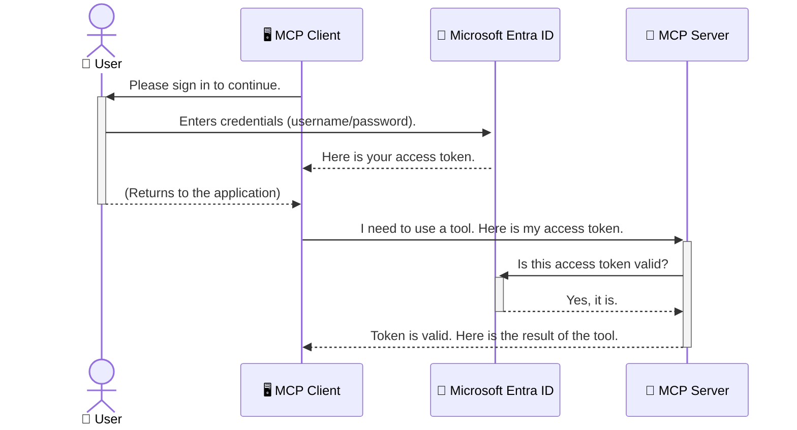

<!--
CO_OP_TRANSLATOR_METADATA:
{
  "original_hash": "9abe1d303ab126f9a8b87f03cebe5213",
  "translation_date": "2025-06-26T14:43:39+00:00",
  "source_file": "05-AdvancedTopics/mcp-security-entra/README.md",
  "language_code": "pa"
}
-->
# AI ਵਰਕਫਲੋਜ਼ ਦੀ ਸੁਰੱਖਿਆ: ਮਾਡਲ ਕੰਟੈਕਸਟ ਪ੍ਰੋਟੋਕੋਲ ਸਰਵਰਾਂ ਲਈ Entra ID ਪ੍ਰਮਾਣਿਕਤਾ

## ਪਰਿਚਯ  
ਆਪਣੇ ਮਾਡਲ ਕੰਟੈਕਸਟ ਪ੍ਰੋਟੋਕੋਲ (MCP) ਸਰਵਰ ਨੂੰ ਸੁਰੱਖਿਅਤ ਕਰਨਾ ਉਸੇ ਤਰ੍ਹਾਂ ਜਰੂਰੀ ਹੈ ਜਿਵੇਂ ਆਪਣੇ ਘਰ ਦਾ ਮੁੱਖ ਦਰਵਾਜ਼ਾ ਲੌਕ ਕਰਨਾ। ਜੇ MCP ਸਰਵਰ ਖੁੱਲ੍ਹਾ ਰਹਿ ਜਾਂਦਾ ਹੈ ਤਾਂ ਤੁਹਾਡੇ ਸੰਦ ਅਤੇ ਡੇਟਾ ਅਣਅਧਿਕ੍ਰਿਤ ਪਹੁੰਚ ਲਈ ਖੁੱਲ੍ਹੇ ਹੋ ਜਾਂਦੇ ਹਨ, ਜਿਸ ਨਾਲ ਸੁਰੱਖਿਆ ਵਿੱਚ ਖਾਮੀਆਂ ਆ ਸਕਦੀਆਂ ਹਨ। Microsoft Entra ID ਇੱਕ ਮਜ਼ਬੂਤ ਕਲਾਉਡ-ਅਧਾਰਿਤ ਪਹਿਚਾਣ ਅਤੇ ਪਹੁੰਚ ਪ੍ਰਬੰਧਨ ਹੱਲ ਪ੍ਰਦਾਨ ਕਰਦਾ ਹੈ, ਜੋ ਇਹ ਯਕੀਨੀ ਬਣਾਉਂਦਾ ਹੈ ਕਿ ਸਿਰਫ ਅਧਿਕਾਰਤ ਉਪਭੋਗਤਾ ਅਤੇ ਐਪਲੀਕੇਸ਼ਨ ਹੀ ਤੁਹਾਡੇ MCP ਸਰਵਰ ਨਾਲ ਇੰਟਰਐਕਟ ਕਰ ਸਕਦੇ ਹਨ। ਇਸ ਭਾਗ ਵਿੱਚ, ਤੁਸੀਂ Entra ID ਪ੍ਰਮਾਣਿਕਤਾ ਦੀ ਵਰਤੋਂ ਕਰਕੇ ਆਪਣੇ AI ਵਰਕਫਲੋਜ਼ ਦੀ ਸੁਰੱਖਿਆ ਕਰਨਾ ਸਿੱਖੋਗੇ।

## ਸਿੱਖਣ ਦੇ ਲਕੜੀ  
ਇਸ ਭਾਗ ਦੇ ਅੰਤ ਵਿੱਚ, ਤੁਸੀਂ ਸਮਰੱਥ ਹੋਵੋਗੇ:

- MCP ਸਰਵਰਾਂ ਦੀ ਸੁਰੱਖਿਆ ਦੇ ਮਹੱਤਵ ਨੂੰ ਸਮਝਣਾ।  
- Microsoft Entra ID ਅਤੇ OAuth 2.0 ਪ੍ਰਮਾਣਿਕਤਾ ਦੇ ਮੂਲ ਤੱਤਾਂ ਨੂੰ ਵਿਆਖਿਆ ਕਰਨਾ।  
- ਪਬਲਿਕ ਅਤੇ ਗੁਪਤ ਕਲਾਇੰਟਾਂ ਵਿੱਚ ਫਰਕ ਨੂੰ ਪਛਾਣਨਾ।  
- ਸਥਾਨਕ (ਪਬਲਿਕ ਕਲਾਇੰਟ) ਅਤੇ ਰਿਮੋਟ (ਗੁਪਤ ਕਲਾਇੰਟ) MCP ਸਰਵਰ ਸੰਦਰਭਾਂ ਵਿੱਚ Entra ID ਪ੍ਰਮਾਣਿਕਤਾ ਲਾਗੂ ਕਰਨਾ।  
- AI ਵਰਕਫਲੋਜ਼ ਵਿਕਾਸ ਦੌਰਾਨ ਸੁਰੱਖਿਆ ਦੀਆਂ ਸਭ ਤੋਂ ਵਧੀਆ ਪ੍ਰਥਾਵਾਂ ਨੂੰ ਲਾਗੂ ਕਰਨਾ।

# AI ਵਰਕਫਲੋਜ਼ ਦੀ ਸੁਰੱਖਿਆ: ਮਾਡਲ ਕੰਟੈਕਸਟ ਪ੍ਰੋਟੋਕੋਲ ਸਰਵਰਾਂ ਲਈ Entra ID ਪ੍ਰਮਾਣਿਕਤਾ

ਜਿਵੇਂ ਤੁਸੀਂ ਆਪਣੇ ਘਰ ਦਾ ਮੁੱਖ ਦਰਵਾਜ਼ਾ ਅਨਲੌਕ ਨਾ ਛੱਡਦੇ ਹੋ, ਉਸੇ ਤਰ੍ਹਾਂ MCP ਸਰਵਰ ਨੂੰ ਕਿਸੇ ਵੀ ਵਿਅਕਤੀ ਲਈ ਖੁੱਲ੍ਹਾ ਨਾ ਛੱਡੋ। ਆਪਣੇ AI ਵਰਕਫਲੋਜ਼ ਦੀ ਸੁਰੱਖਿਆ ਕਰਨੀ ਬਹੁਤ ਜ਼ਰੂਰੀ ਹੈ ਤਾਂ ਜੋ ਮਜ਼ਬੂਤ, ਭਰੋਸੇਯੋਗ ਅਤੇ ਸੁਰੱਖਿਅਤ ਐਪਲੀਕੇਸ਼ਨ ਬਣਾਈਆਂ ਜਾ ਸਕਣ। ਇਹ ਅਧਿਆਇ ਤੁਹਾਨੂੰ Microsoft Entra ID ਦੀ ਵਰਤੋਂ ਕਰਕੇ ਆਪਣੇ MCP ਸਰਵਰਾਂ ਨੂੰ ਸੁਰੱਖਿਅਤ ਕਰਨ ਦਾ ਤਰੀਕਾ ਦੱਸੇਗਾ, ਜਿਸ ਨਾਲ ਸਿਰਫ ਅਧਿਕਾਰਤ ਉਪਭੋਗਤਾ ਅਤੇ ਐਪਲੀਕੇਸ਼ਨ ਹੀ ਤੁਹਾਡੇ ਸੰਦ ਅਤੇ ਡੇਟਾ ਨਾਲ ਕੰਮ ਕਰ ਸਕਣ।

## MCP ਸਰਵਰਾਂ ਲਈ ਸੁਰੱਖਿਆ ਕਿਉਂ ਜ਼ਰੂਰੀ ਹੈ

ਕਲਪਨਾ ਕਰੋ ਕਿ ਤੁਹਾਡੇ MCP ਸਰਵਰ ਵਿੱਚ ਇੱਕ ਸੰਦ ਹੈ ਜੋ ਈਮੇਲ ਭੇਜ ਸਕਦਾ ਹੈ ਜਾਂ ਗਾਹਕਾਂ ਦੇ ਡੇਟਾਬੇਸ ਤੱਕ ਪਹੁੰਚ ਸਕਦਾ ਹੈ। ਜੇ ਸਰਵਰ ਸੁਰੱਖਿਅਤ ਨਾ ਹੋਵੇ ਤਾਂ ਕੋਈ ਵੀ ਇਸ ਸੰਦ ਦੀ ਵਰਤੋਂ ਕਰ ਸਕਦਾ ਹੈ, ਜਿਸ ਨਾਲ ਅਣਅਧਿਕ੍ਰਿਤ ਡੇਟਾ ਪਹੁੰਚ, ਸਪੈਮ ਜਾਂ ਹੋਰ ਨੁਕਸਾਨਦਾਇਕ ਗਤੀਵਿਧੀਆਂ ਹੋ ਸਕਦੀਆਂ ਹਨ।

ਪ੍ਰਮਾਣਿਕਤਾ ਲਾਗੂ ਕਰਕੇ, ਤੁਸੀਂ ਇਹ ਯਕੀਨੀ ਬਣਾਉਂਦੇ ਹੋ ਕਿ ਹਰ ਬੇਨਤੀ ਦੀ ਜਾਂਚ ਕੀਤੀ ਜਾਂਦੀ ਹੈ, ਜਿਸ ਨਾਲ ਉਪਭੋਗਤਾ ਜਾਂ ਐਪਲੀਕੇਸ਼ਨ ਦੀ ਪਹਿਚਾਣ ਪੁਸ਼ਟੀ ਹੁੰਦੀ ਹੈ। ਇਹ ਤੁਹਾਡੇ AI ਵਰਕਫਲੋਜ਼ ਦੀ ਸੁਰੱਖਿਆ ਲਈ ਪਹਿਲਾ ਅਤੇ ਸਭ ਤੋਂ ਅਹੰਕਾਰਪੂਰਨ ਕਦਮ ਹੈ।

## Microsoft Entra ID ਦਾ ਪਰਿਚਯ

**Microsoft Entra ID** ਇੱਕ ਕਲਾਉਡ-ਅਧਾਰਿਤ ਪਹਿਚਾਣ ਅਤੇ ਪਹੁੰਚ ਪ੍ਰਬੰਧਨ ਸੇਵਾ ਹੈ। ਇਸਨੂੰ ਆਪਣੇ ਐਪਲੀਕੇਸ਼ਨਾਂ ਲਈ ਇੱਕ ਸਰਵਜਨਕ ਸੁਰੱਖਿਆ ਰੱਖਿਆਰੂਪ ਸਮਝੋ। ਇਹ ਉਪਭੋਗਤਾ ਦੀ ਪਹਿਚਾਣ ਦੀ ਜਾਂਚ (ਪ੍ਰਮਾਣਿਕਤਾ) ਅਤੇ ਉਹਨਾਂ ਨੂੰ ਕੀ ਕਰਨ ਦੀ ਆਗਿਆ ਹੈ (ਪ੍ਰਮਾਣਿਕਰਨ) ਦੇ ਜਟਿਲ ਪ੍ਰਕਿਰਿਆਵਾਂ ਨੂੰ ਸੰਭਾਲਦਾ ਹੈ।

Entra ID ਦੀ ਵਰਤੋਂ ਕਰਕੇ, ਤੁਸੀਂ:

- ਉਪਭੋਗਤਾਵਾਂ ਲਈ ਸੁਰੱਖਿਅਤ ਸਾਈਨ-ਇਨ ਯੋਗ ਕਰ ਸਕਦੇ ਹੋ।  
- APIs ਅਤੇ ਸੇਵਾਵਾਂ ਦੀ ਸੁਰੱਖਿਆ ਕਰ ਸਕਦੇ ਹੋ।  
- ਕੇਂਦਰੀ ਸਥਾਨ ਤੋਂ ਪਹੁੰਚ ਨੀਤੀਆਂ ਦਾ ਪ੍ਰਬੰਧਨ ਕਰ ਸਕਦੇ ਹੋ।

MCP ਸਰਵਰਾਂ ਲਈ, Entra ID ਇੱਕ ਮਜ਼ਬੂਤ ਅਤੇ ਭਰੋਸੇਯੋਗ ਹੱਲ ਪ੍ਰਦਾਨ ਕਰਦਾ ਹੈ ਜੋ ਇਹ ਨਿਰਧਾਰਤ ਕਰਦਾ ਹੈ ਕਿ ਕੌਣ ਤੁਹਾਡੇ ਸਰਵਰ ਦੀਆਂ ਖੂਬੀਆਂ ਤੱਕ ਪਹੁੰਚ ਸਕਦਾ ਹੈ।

---

## Entra ID ਪ੍ਰਮਾਣਿਕਤਾ ਕਿਵੇਂ ਕੰਮ ਕਰਦੀ ਹੈ: ਇੱਕ ਸਮਝਦਾਰ ਵੇਖ

Entra ID ਪ੍ਰਮਾਣਿਕਤਾ ਸੰਭਾਲਣ ਲਈ ਖੁੱਲ੍ਹੇ ਮਿਆਰਾਂ ਜਿਵੇਂ ਕਿ **OAuth 2.0** ਦੀ ਵਰਤੋਂ ਕਰਦਾ ਹੈ। ਹਾਲਾਂਕਿ ਵੇਰਵੇ ਕਾਫੀ ਜਟਿਲ ਹੋ ਸਕਦੇ ਹਨ, ਮੂਲ ਧਾਰਣਾ ਸਧਾਰਣ ਹੈ ਅਤੇ ਇੱਕ ਉਦਾਹਰਨ ਨਾਲ ਸਮਝੀ ਜਾ ਸਕਦੀ ਹੈ।

### OAuth 2.0 ਦਾ ਨਰਮ ਪਰਿਚਯ: ਵੈਲੇਟ ਚਾਬੀ

OAuth 2.0 ਨੂੰ ਆਪਣੇ ਕਾਰ ਲਈ ਵੈਲੇਟ ਸੇਵਾ ਵਾਂਗ ਸੋਚੋ। ਜਦੋਂ ਤੁਸੀਂ ਰੈਸਟੋਰੈਂਟ ਪਹੁੰਚਦੇ ਹੋ, ਤਾਂ ਤੁਸੀਂ ਵੈਲੇਟ ਨੂੰ ਆਪਣੀ ਮੁੱਖ ਚਾਬੀ ਨਹੀਂ ਦਿੰਦੇ। ਇਸ ਦੀ ਬਜਾਏ, ਤੁਸੀਂ ਇੱਕ **ਵੈਲੇਟ ਚਾਬੀ** ਦਿੰਦੇ ਹੋ ਜਿਸਦੀ ਸੀਮਿਤ ਅਧਿਕਾਰ ਹੁੰਦੇ ਹਨ—ਇਹ ਕਾਰ ਚਾਲੂ ਕਰ ਸਕਦੀ ਹੈ ਅਤੇ ਦਰਵਾਜ਼ੇ ਲੌਕ ਕਰ ਸਕਦੀ ਹੈ, ਪਰ ਟਰੰਕ ਜਾਂ ਗਲੋਵ ਕਮਪਾਰਟਮੈਂਟ ਖੋਲ੍ਹ ਨਹੀਂ ਸਕਦੀ।

ਇਸ ਉਦਾਹਰਨ ਵਿੱਚ:

- **ਤੁਸੀਂ** ਹੋ **ਉਪਭੋਗਤਾ**।  
- **ਤੁਹਾਡੀ ਕਾਰ** ਹੈ **MCP ਸਰਵਰ** ਜਿਸਦੇ ਕੀਮਤੀ ਸੰਦ ਅਤੇ ਡੇਟਾ ਹਨ।  
- **ਵੈਲੇਟ** ਹੈ **Microsoft Entra ID**।  
- **ਪਾਰਕਿੰਗ ਅਟੈਂਡੈਂਟ** ਹੈ **MCP ਕਲਾਇੰਟ** (ਜੋ ਐਪਲੀਕੇਸ਼ਨ ਸਰਵਰ ਤੱਕ ਪਹੁੰਚਣ ਦੀ ਕੋਸ਼ਿਸ਼ ਕਰ ਰਿਹਾ ਹੈ)।  
- **ਵੈਲੇਟ ਚਾਬੀ** ਹੈ **ਐਕਸੈਸ ਟੋਕਨ**।

ਐਕਸੈਸ ਟੋਕਨ ਇੱਕ ਸੁਰੱਖਿਅਤ ਲੜੀ ਹੁੰਦੀ ਹੈ ਜੋ MCP ਕਲਾਇੰਟ ਨੂੰ Entra ID ਤੋਂ ਤੁਹਾਡੇ ਸਾਈਨ-ਇਨ ਕਰਨ ਤੋਂ ਬਾਅਦ ਮਿਲਦੀ ਹੈ। ਕਲਾਇੰਟ ਹਰ ਬੇਨਤੀ ਨਾਲ ਇਹ ਟੋਕਨ MCP ਸਰਵਰ ਨੂੰ ਦਿੰਦਾ ਹੈ। ਸਰਵਰ ਟੋਕਨ ਦੀ ਜਾਂਚ ਕਰਕੇ ਇਹ ਪੱਕਾ ਕਰਦਾ ਹੈ ਕਿ ਬੇਨਤੀ ਕਾਨੂੰਨੀ ਹੈ ਅਤੇ ਕਲਾਇੰਟ ਕੋਲ ਲੋੜੀਂਦੇ ਅਧਿਕਾਰ ਹਨ, ਉਹ ਵੀ ਬਿਨਾਂ ਤੁਹਾਡੇ ਅਸਲ ਪ੍ਰਮਾਣ-ਪੱਤਰ (ਜਿਵੇਂ ਕਿ ਪਾਸਵਰਡ) ਨੂੰ ਸੰਭਾਲਣ ਦੀ ਜ਼ਰੂਰਤ ਤੋਂ ਬਿਨਾਂ।

### ਪ੍ਰਮਾਣਿਕਤਾ ਪ੍ਰਵਾਹ

ਇਸ ਪ੍ਰਕਿਰਿਆ ਦਾ ਅਮਲ ਵਿੱਚ ਕੰਮ ਕਰਨ ਦਾ ਤਰੀਕਾ ਇਹ ਹੈ:



### Microsoft Authentication Library (MSAL) ਦਾ ਪਰਿਚਯ

ਕੋਡ ਵਿੱਚ ਡੂੰਘਾਈ ਵਿੱਚ ਜਾਣ ਤੋਂ ਪਹਿਲਾਂ, ਇੱਕ ਅਹੰਕਾਰਪੂਰਨ ਭਾਗ ਨਾਲ ਜਾਣੂ ਹੋਣਾ ਜਰੂਰੀ ਹੈ ਜੋ ਤੁਸੀਂ ਉਦਾਹਰਨਾਂ ਵਿੱਚ ਵੇਖੋਗੇ: **Microsoft Authentication Library (MSAL)**।

MSAL Microsoft ਵੱਲੋਂ ਵਿਕਸਿਤ ਇੱਕ ਲਾਇਬ੍ਰੇਰੀ ਹੈ ਜੋ ਡਿਵੈਲਪਰਾਂ ਲਈ ਪ੍ਰਮਾਣਿਕਤਾ ਸੰਭਾਲਣਾ ਬਹੁਤ ਆਸਾਨ ਬਣਾਉਂਦੀ ਹੈ। ਤੁਹਾਨੂੰ ਸੁਰੱਖਿਆ ਟੋਕਨ ਸੰਭਾਲਣ, ਸਾਈਨ-ਇਨ ਪ੍ਰਬੰਧਨ ਅਤੇ ਸੈਸ਼ਨ ਰਿਫਰੇਸ਼ ਕਰਨ ਲਈ ਸਾਰੇ ਜਟਿਲ ਕੋਡ ਲਿਖਣ ਦੀ ਜ਼ਰੂਰਤ ਨਹੀਂ ਹੁੰਦੀ, MSAL ਇਹ ਸਾਰਾ ਕੰਮ ਕਰਦਾ ਹੈ।

MSAL ਦੀ ਵਰਤੋਂ ਕਰਨ ਦੀ ਸਿਫਾਰਸ਼ ਇਸ ਲਈ ਕੀਤੀ ਜਾਂਦੀ ਹੈ:

- **ਇਹ ਸੁਰੱਖਿਅਤ ਹੈ:** ਇਹ ਉਦਯੋਗ-ਮਿਆਰੀ ਪ੍ਰੋਟੋਕੋਲ ਅਤੇ ਸੁਰੱਖਿਆ ਦੀਆਂ ਸਭ ਤੋਂ ਵਧੀਆ ਪ੍ਰਥਾਵਾਂ ਨੂੰ ਲਾਗੂ ਕਰਦਾ ਹੈ, ਜੋ ਤੁਹਾਡੇ ਕੋਡ ਵਿੱਚ ਕਮਜ਼ੋਰੀਆਂ ਦੇ ਖਤਰੇ ਨੂੰ ਘਟਾਉਂਦਾ ਹੈ।  
- **ਇਹ ਵਿਕਾਸ ਨੂੰ ਸਧਾਰਨ ਕਰਦਾ ਹੈ:** ਇਹ OAuth 2.0 ਅਤੇ OpenID Connect ਪ੍ਰੋਟੋਕੋਲ ਦੀ ਜਟਿਲਤਾ ਨੂੰ ਛੁਪਾ ਦਿੰਦਾ ਹੈ, ਜਿਸ ਨਾਲ ਤੁਸੀਂ ਆਪਣੀ ਐਪਲੀਕੇਸ਼ਨ ਵਿੱਚ ਕੁਝ ਕੋਡ ਲਾਈਨਾਂ ਨਾਲ ਮਜ਼ਬੂਤ ਪ੍ਰਮਾਣਿਕਤਾ ਜੋੜ ਸਕਦੇ ਹੋ।  
- **ਇਹ ਮੈਨਟੇਨ ਕੀਤਾ ਜਾਂਦਾ ਹੈ:** Microsoft MSAL ਨੂੰ ਨਵੇਂ ਸੁਰੱਖਿਆ ਖਤਰਿਆਂ ਅਤੇ ਪਲੇਟਫਾਰਮ ਬਦਲਾਵਾਂ ਦੇ ਮੁਤਾਬਕ ਅਪਡੇਟ ਕਰਦਾ ਹੈ।

MSAL .NET, JavaScript/TypeScript, Python, Java, Go ਅਤੇ ਮੋਬਾਈਲ ਪਲੇਟਫਾਰਮਾਂ ਜਿਵੇਂ iOS ਅਤੇ Android ਸਮੇਤ ਕਈ ਭਾਸ਼ਾਵਾਂ ਅਤੇ ਐਪਲੀਕੇਸ਼ਨ ਫਰੇਮਵਰਕਾਂ ਨੂੰ ਸਹਿਯੋਗ ਦਿੰਦਾ ਹੈ। ਇਸਦਾ ਮਤਲਬ ਹੈ ਕਿ ਤੁਸੀਂ ਆਪਣੇ ਸਾਰੇ ਤਕਨਾਲੋਜੀ ਸਟੈਕ ਵਿੱਚ ਇੱਕੋ ਜਿਹੇ ਪ੍ਰਮਾਣਿਕਤਾ ਪੈਟਰਨ ਵਰਤ ਸਕਦੇ ਹੋ।

MSAL ਬਾਰੇ ਹੋਰ ਜਾਣਕਾਰੀ ਲਈ, ਤੁਸੀਂ ਅਧਿਕਾਰਿਕ [MSAL ਓਵਰਵਿਊ ਡੌਕਯੂਮੈਂਟੇਸ਼ਨ](https://learn.microsoft.com/entra/identity-platform/msal-overview) ਵੇਖ ਸਕਦੇ ਹੋ।

---

## Entra ID ਨਾਲ ਆਪਣੇ MCP ਸਰਵਰ ਨੂੰ ਸੁਰੱਖਿਅਤ ਕਰਨਾ: ਕਦਮ-ਦਰ-कਦਮ ਗਾਈਡ

ਹੁਣ, ਆਓ ਦੇਖੀਏ ਕਿ ਸਥਾਨਕ MCP ਸਰਵਰ ਨੂੰ ਕਿਵੇਂ ਸੁਰੱਖਿਅਤ ਕਰਨਾ ਹੈ (ਜੋ `stdio`) using Entra ID. This example uses a **public client**, which is suitable for applications running on a user's machine, like a desktop app or a local development server.

### Scenario 1: Securing a Local MCP Server (with a Public Client)

In this scenario, we'll look at an MCP server that runs locally, communicates over `stdio`, and uses Entra ID to authenticate the user before allowing access to its tools. The server will have a single tool that fetches the user's profile information from the Microsoft Graph API.

#### 1. Setting Up the Application in Entra ID

Before writing any code, you need to register your application in Microsoft Entra ID. This tells Entra ID about your application and grants it permission to use the authentication service.

1. Navigate to the **[Microsoft Entra portal](https://entra.microsoft.com/)**.
2. Go to **App registrations** and click **New registration**.
3. Give your application a name (e.g., "My Local MCP Server").
4. For **Supported account types**, select **Accounts in this organizational directory only**.
5. You can leave the **Redirect URI** blank for this example.
6. Click **Register**.

Once registered, take note of the **Application (client) ID** and **Directory (tenant) ID**. You'll need these in your code.

#### 2. The Code: A Breakdown

Let's look at the key parts of the code that handle authentication. The full code for this example is available in the [Entra ID - Local - WAM](https://github.com/Azure-Samples/mcp-auth-servers/tree/main/src/entra-id-local-wam) folder of the [mcp-auth-servers GitHub repository](https://github.com/Azure-Samples/mcp-auth-servers).

**`AuthenticationService.cs`**

This class is responsible for handling the interaction with Entra ID.

- **`CreateAsync`**: This method initializes the `PublicClientApplication` from the MSAL (Microsoft Authentication Library). It's configured with your application's `clientId` and `tenantId`.
- **`WithBroker`**: This enables the use of a broker (like the Windows Web Account Manager), which provides a more secure and seamless single sign-on experience.
- **`AcquireTokenAsync`** ਵਰਗੇ ਤਰੀਕੇ ਨਾਲ ਸੰਚਾਰ ਕਰਦਾ ਹੈ): ਇਹ ਮੁੱਖ ਤਰੀਕਾ ਹੈ। ਇਹ ਪਹਿਲਾਂ ਚੁੱਪਚਾਪ ਟੋਕਨ ਲੈਣ ਦੀ ਕੋਸ਼ਿਸ਼ ਕਰਦਾ ਹੈ (ਜਿਸਦਾ ਮਤਲਬ ਹੈ ਕਿ ਜੇ ਉਪਭੋਗਤਾ ਕੋਲ ਪਹਿਲਾਂ ਹੀ ਮਾਨਤਾ ਪ੍ਰਾਪਤ ਸੈਸ਼ਨ ਹੈ ਤਾਂ ਉਸਨੂੰ ਦੁਬਾਰਾ ਸਾਈਨ-ਇਨ ਕਰਨ ਦੀ ਲੋੜ ਨਹੀਂ)। ਜੇ ਚੁੱਪਚਾਪ ਟੋਕਨ ਪ੍ਰਾਪਤ ਨਹੀਂ ਕੀਤਾ ਜਾ ਸਕਦਾ, ਤਾਂ ਇਹ ਉਪਭੋਗਤਾ ਨੂੰ ਇੰਟਰਐਕਟਿਵ ਤਰੀਕੇ ਨਾਲ ਸਾਈਨ-ਇਨ ਕਰਨ ਲਈ ਕਹੇਗਾ।

```csharp
// Simplified for clarity
public static async Task<AuthenticationService> CreateAsync(ILogger<AuthenticationService> logger)
{
    var msalClient = PublicClientApplicationBuilder
        .Create(_clientId) // Your Application (client) ID
        .WithAuthority(AadAuthorityAudience.AzureAdMyOrg)
        .WithTenantId(_tenantId) // Your Directory (tenant) ID
        .WithBroker(new BrokerOptions(BrokerOptions.OperatingSystems.Windows))
        .Build();

    // ... cache registration ...

    return new AuthenticationService(logger, msalClient);
}

public async Task<string> AcquireTokenAsync()
{
    try
    {
        // Try silent authentication first
        var accounts = await _msalClient.GetAccountsAsync();
        var account = accounts.FirstOrDefault();

        AuthenticationResult? result = null;

        if (account != null)
        {
            result = await _msalClient.AcquireTokenSilent(_scopes, account).ExecuteAsync();
        }
        else
        {
            // If no account, or silent fails, go interactive
            result = await _msalClient.AcquireTokenInteractive(_scopes).ExecuteAsync();
        }

        return result.AccessToken;
    }
    catch (Exception ex)
    {
        _logger.LogError(ex, "An error occurred while acquiring the token.");
        throw; // Optionally rethrow the exception for higher-level handling
    }
}
```

**`Program.cs`**

This is where the MCP server is set up and the authentication service is integrated.

- **`AddSingleton<AuthenticationService>`**: This registers the `AuthenticationService` with the dependency injection container, so it can be used by other parts of the application (like our tool).
- **`GetUserDetailsFromGraph` tool**: This tool requires an instance of `AuthenticationService`. Before it does anything, it calls `authService.AcquireTokenAsync()` ਇੱਕ ਵੈਧ ਐਕਸੈਸ ਟੋਕਨ ਪ੍ਰਾਪਤ ਕਰਨ ਲਈ। ਜੇ ਪ੍ਰਮਾਣਿਕਤਾ ਸਫਲ ਰਹਿੰਦੀ ਹੈ, ਤਾਂ ਇਹ ਟੋਕਨ ਦੀ ਵਰਤੋਂ ਕਰਕੇ Microsoft Graph API ਨੂੰ ਕਾਲ ਕਰਦਾ ਹੈ ਅਤੇ ਉਪਭੋਗਤਾ ਦੇ ਵੇਰਵੇ ਲੈਦਾ ਹੈ।**

```csharp
// Simplified for clarity
[McpServerTool(Name = "GetUserDetailsFromGraph")]
public static async Task<string> GetUserDetailsFromGraph(
    AuthenticationService authService)
{
    try
    {
        // This will trigger the authentication flow
        var accessToken = await authService.AcquireTokenAsync();

        // Use the token to create a GraphServiceClient
        var graphClient = new GraphServiceClient(
            new BaseBearerTokenAuthenticationProvider(new TokenProvider(authService)));

        var user = await graphClient.Me.GetAsync();

        return System.Text.Json.JsonSerializer.Serialize(user);
    }
    catch (Exception ex)
    {
        return $"Error: {ex.Message}";
    }
}
```

#### 3. ਇਹ ਸਾਰਾ ਪ੍ਰਕਿਰਿਆ ਕਿਵੇਂ ਕੰਮ ਕਰਦੀ ਹੈ

1. ਜਦ MCP ਕਲਾਇੰਟ `GetUserDetailsFromGraph` tool, the tool first calls `AcquireTokenAsync`.
2. `AcquireTokenAsync` triggers the MSAL library to check for a valid token.
3. If no token is found, MSAL, through the broker, will prompt the user to sign in with their Entra ID account.
4. Once the user signs in, Entra ID issues an access token.
5. The tool receives the token and uses it to make a secure call to the Microsoft Graph API.
6. The user's details are returned to the MCP client.

This process ensures that only authenticated users can use the tool, effectively securing your local MCP server.

### Scenario 2: Securing a Remote MCP Server (with a Confidential Client)

When your MCP server is running on a remote machine (like a cloud server) and communicates over a protocol like HTTP Streaming, the security requirements are different. In this case, you should use a **confidential client** and the **Authorization Code Flow**. This is a more secure method because the application's secrets are never exposed to the browser.

This example uses a TypeScript-based MCP server that uses Express.js to handle HTTP requests.

#### 1. Setting Up the Application in Entra ID

The setup in Entra ID is similar to the public client, but with one key difference: you need to create a **client secret**.

1. Navigate to the **[Microsoft Entra portal](https://entra.microsoft.com/)**.
2. In your app registration, go to the **Certificates & secrets** tab.
3. Click **New client secret**, give it a description, and click **Add**.
4. **Important:** Copy the secret value immediately. You will not be able to see it again.
5. You also need to configure a **Redirect URI**. Go to the **Authentication** tab, click **Add a platform**, select **Web**, and enter the redirect URI for your application (e.g., `http://localhost:3001/auth/callback`).

> **⚠️ Important Security Note:** For production applications, Microsoft strongly recommends using **secretless authentication** methods such as **Managed Identity** or **Workload Identity Federation** instead of client secrets. Client secrets pose security risks as they can be exposed or compromised. Managed identities provide a more secure approach by eliminating the need to store credentials in your code or configuration.
>
> For more information about managed identities and how to implement them, see the [Managed identities for Azure resources overview](https://learn.microsoft.com/entra/identity/managed-identities-azure-resources/overview).

#### 2. The Code: A Breakdown

This example uses a session-based approach. When the user authenticates, the server stores the access token and refresh token in a session and gives the user a session token. This session token is then used for subsequent requests. The full code for this example is available in the [Entra ID - Confidential client](https://github.com/Azure-Samples/mcp-auth-servers/tree/main/src/entra-id-cca-session) folder of the [mcp-auth-servers GitHub repository](https://github.com/Azure-Samples/mcp-auth-servers).

**`Server.ts`**

This file sets up the Express server and the MCP transport layer.

- **`requireBearerAuth`**: This is middleware that protects the `/sse` and `/message` endpoints. It checks for a valid bearer token in the `Authorization` header of the request.
- **`EntraIdServerAuthProvider`**: This is a custom class that implements the `McpServerAuthorizationProvider` interface. It's responsible for handling the OAuth 2.0 flow.
- **`/auth/callback`** ਨੂੰ ਵਰਤਣ ਦੀ ਕੋਸ਼ਿਸ਼ ਕਰਦਾ ਹੈ: ਇਹ ਐਂਡਪੌਇੰਟ ਉਪਭੋਗਤਾ ਦੇ ਪ੍ਰਮਾਣਿਕ ਹੋਣ ਤੋਂ ਬਾਅਦ Entra ID ਤੋਂ ਰੀਡਾਇਰੈਕਟ ਨੂੰ ਸੰਭਾਲਦਾ ਹੈ। ਇਹ ਅਧਿਕਾਰ ਕੋਡ ਨੂੰ ਐਕਸੈਸ ਟੋਕਨ ਅਤੇ ਰਿਫਰੇਸ਼ ਟੋਕਨ ਵਿੱਚ ਬਦਲਦਾ ਹੈ।**

```typescript
// Simplified for clarity
const app = express();
const { server } = createServer();
const provider = new EntraIdServerAuthProvider();

// Protect the SSE endpoint
app.get("/sse", requireBearerAuth({
  provider,
  requiredScopes: ["User.Read"]
}), async (req, res) => {
  // ... connect to the transport ...
});

// Protect the message endpoint
app.post("/message", requireBearerAuth({
  provider,
  requiredScopes: ["User.Read"]
}), async (req, res) => {
  // ... handle the message ...
});

// Handle the OAuth 2.0 callback
app.get("/auth/callback", (req, res) => {
  provider.handleCallback(req.query.code, req.query.state)
    .then(result => {
      // ... handle success or failure ...
    });
});
```

**`Tools.ts`**

This file defines the tools that the MCP server provides. The `getUserDetails` ਸੰਦ ਪਿਛਲੇ ਉਦਾਹਰਨ ਵਰਗਾ ਹੀ ਹੈ, ਪਰ ਇਹ ਸੈਸ਼ਨ ਤੋਂ ਐਕਸੈਸ ਟੋਕਨ ਲੈਂਦਾ ਹੈ।**

```typescript
// Simplified for clarity
server.setRequestHandler(CallToolRequestSchema, async (request) => {
  const { name } = request.params;
  const context = request.params?.context as { token?: string } | undefined;
  const sessionToken = context?.token;

  if (name === ToolName.GET_USER_DETAILS) {
    if (!sessionToken) {
      throw new AuthenticationError("Authentication token is missing or invalid. Ensure the token is provided in the request context.");
    }

    // Get the Entra ID token from the session store
    const tokenData = tokenStore.getToken(sessionToken);
    const entraIdToken = tokenData.accessToken;

    const graphClient = Client.init({
      authProvider: (done) => {
        done(null, entraIdToken);
      }
    });

    const user = await graphClient.api('/me').get();

    // ... return user details ...
  }
});
```

**`auth/EntraIdServerAuthProvider.ts`**

This class handles the logic for:

- Redirecting the user to the Entra ID sign-in page.
- Exchanging the authorization code for an access token.
- Storing the tokens in the `tokenStore`.
- Refreshing the access token when it expires.

#### 3. How It All Works Together

1. When a user first tries to connect to the MCP server, the `requireBearerAuth` middleware will see that they don't have a valid session and will redirect them to the Entra ID sign-in page.
2. The user signs in with their Entra ID account.
3. Entra ID redirects the user back to the `/auth/callback` endpoint with an authorization code.
4. The server exchanges the code for an access token and a refresh token, stores them, and creates a session token which is sent to the client.
5. The client can now use this session token in the `Authorization` header for all future requests to the MCP server.
6. When the `getUserDetails` ਸੰਦ ਨੂੰ ਕਾਲ ਕੀਤਾ ਜਾਂਦਾ ਹੈ, ਇਹ ਸੈਸ਼ਨ ਟੋਕਨ ਦੀ ਵਰਤੋਂ ਕਰਕੇ Entra ID ਐਕਸੈਸ ਟੋਕਨ ਲੱਭਦਾ ਹੈ ਅਤੇ ਫਿਰ Microsoft Graph API ਨੂੰ ਕਾਲ ਕਰਦਾ ਹੈ।**

ਇਹ ਪ੍ਰਵਾਹ ਪਬਲਿਕ ਕਲਾਇੰਟ ਪ੍ਰਵਾਹ ਨਾਲੋਂ ਜ਼ਿਆਦਾ ਜਟਿਲ ਹੈ, ਪਰ ਇੰਟਰਨੈਟ-ਸਮ੍ਹਾਲੇ ਐਂਡਪੌਇੰਟਾਂ ਲਈ ਜ਼ਰੂਰੀ ਹੈ। ਕਿਉਂਕਿ ਰਿਮੋਟ MCP ਸਰਵਰ ਪਬਲਿਕ ਇੰਟਰਨੈਟ 'ਤੇ ਪਹੁੰਚਯੋਗ ਹੁੰਦੇ ਹਨ, ਉਨ੍ਹਾਂ ਨੂੰ ਅਣਅਧਿਕ੍ਰਿਤ ਪਹੁੰਚ ਅਤੇ ਸੰਭਾਵਿਤ ਹਮਲਿਆਂ ਤੋਂ ਬਚਾਅ ਲਈ ਮਜ਼ਬੂਤ ਸੁਰੱਖਿਆ ਉਪਾਇਆ ਚਾਹੀਦਾ ਹੈ।

## ਸੁਰੱਖਿਆ ਦੀਆਂ ਸਭ ਤੋਂ ਵਧੀਆ ਪ੍ਰਥਾਵਾਂ

- **ਹਮੇਸ਼ਾਂ HTTPS ਵਰਤੋ:** ਕਲਾਇੰਟ ਅਤੇ ਸਰਵਰ ਵਿਚਕਾਰ ਸੰਚਾਰ ਨੂੰ ਇਨਕ੍ਰਿਪਟ ਕਰੋ ਤਾਂ ਜੋ ਟੋਕਨਾਂ ਨੂੰ ਚੋਰੀ ਹੋਣ ਤੋਂ ਬਚਾਇਆ ਜਾ ਸਕੇ।  
- **ਰੋਲ-ਅਧਾਰਿਤ ਪਹੁੰਚ ਨਿਯੰਤਰਣ (RBAC) ਲਾਗੂ ਕਰੋ:** ਸਿਰਫ ਇਹ ਨਾ ਦੇਖੋ ਕਿ ਉਪਭੋਗਤਾ ਪ੍ਰਮਾਣਿਤ ਹੈ ਜਾਂ ਨਹੀਂ; ਇਹ ਵੀ ਜਾਂਚੋ ਕਿ ਉਹ ਕੀ ਕਰਨ ਲਈ ਅਧਿਕਾਰਤ ਹੈ। ਤੁਸੀਂ Entra ID ਵਿੱਚ ਰੋਲ ਡਿਫਾਈਨ ਕਰ ਸਕਦੇ ਹੋ ਅਤੇ ਆਪਣੇ MCP ਸਰਵਰ ਵਿੱਚ ਉਨ੍ਹਾਂ ਦੀ ਜਾਂਚ ਕਰ ਸਕਦੇ ਹੋ।  
- **ਮਾਨੀਟਰ ਅਤੇ ਆਡੀਟ ਕਰੋ:** ਸਾਰੇ ਪ੍ਰਮਾਣਿਕਤਾ ਘਟਨਾਵਾਂ ਨੂੰ ਲੌਗ ਕਰੋ ਤਾਂ ਜੋ ਤੁਸੀਂ ਸ਼ੱਕੀ ਗਤੀਵਿਧੀ ਦਾ ਪਤਾ ਲਗਾ ਸਕੋ ਅਤੇ ਜਵਾਬ ਦੇ ਸਕੋ।  
- **ਰੇਟ ਲਿਮਿਟਿੰਗ ਅਤੇ ਥਰੋਟਲਿੰਗ ਸੰਭਾਲੋ:** Microsoft Graph ਅਤੇ ਹੋਰ APIs ਰੇਟ ਲਿਮਿਟਿੰਗ ਲਾਗੂ ਕਰਦੇ ਹਨ ਤਾਂ ਜੋ ਦੁਪਹਿਰਵਾਰ ਵਰਤੋਂ ਤੋਂ ਬਚਾਅ ਹੋਵੇ। MCP ਸਰਵਰ ਵਿੱਚ ਐਕਸਪੋਨੈਂਸ਼ੀਅਲ ਬੈਕਆਫ ਅਤੇ ਰੀਟ੍ਰਾਈ ਲੌਜਿਕ ਲਾਗੂ ਕਰੋ ਤਾਂ ਜੋ HTTP 429 (ਬਹੁਤ ਜ਼ਿਆਦਾ ਬੇਨਤੀਆਂ) ਨੂੰ ਸ਼ਾਂਤੀ ਨਾਲ ਸੰਭਾਲਿਆ ਜਾ ਸਕੇ। ਅਕਸਰ ਵਰਤੇ ਜਾਣ ਵਾਲੇ ਡੇਟਾ ਨੂੰ ਕੈਸ਼ ਕਰਨ ਬਾਰੇ ਵੀ ਸੋਚੋ।  
- **ਟੋਕਨ ਸੁਰੱਖਿਅਤ ਸਟੋਰੇਜ:** ਐਕਸੈਸ ਟੋਕਨ ਅਤੇ ਰਿਫਰੇਸ਼ ਟੋਕਨ ਨੂੰ ਸੁਰੱਖਿਅਤ ਢੰਗ ਨਾਲ ਸੰਭਾਲੋ। ਸਥਾਨਕ ਐਪਲੀਕੇਸ਼ਨਾਂ ਲਈ, ਸਿਸਟਮ ਦੇ ਸੁਰੱਖਿਅਤ ਸਟੋਰੇਜ ਮਕੈਨਿਜ਼ਮ ਵਰਤੋ। ਸਰਵਰ ਐਪਲੀਕੇਸ਼ਨਾਂ ਲਈ, ਇਨਕ੍ਰਿਪਟਡ ਸਟੋਰੇਜ ਜਾਂ Azure Key Vault ਵਰਗੀਆਂ ਸੁਰੱਖਿਅਤ ਕੀ ਪ੍ਰਬੰਧਨ ਸੇਵਾਵਾਂ ਦੀ ਵਰਤੋਂ ਕਰੋ।  
- **ਟੋਕਨ ਮਿਆਦ ਖਤਮ ਹੋਣ ਦਾ ਪ੍ਰਬੰਧਨ:** ਐਕਸੈਸ ਟੋਕਨਾਂ ਦੀ ਮਿਆਦ ਸੀਮਿਤ ਹੁੰਦੀ ਹੈ। ਰਿਫਰੇਸ਼ ਟੋਕਨਾਂ ਦੀ ਵਰਤੋਂ ਕਰਕੇ ਆਟੋਮੈਟਿਕ ਟੋਕਨ ਰਿਫ੍ਰ

**ਅਸਵੀਕਾਰੋਪੱਤਰ**:  
ਇਹ ਦਸਤਾਵੇਜ਼ AI ਅਨੁਵਾਦ ਸੇਵਾ [Co-op Translator](https://github.com/Azure/co-op-translator) ਦੀ ਵਰਤੋਂ ਕਰਕੇ ਅਨੁਵਾਦਿਤ ਕੀਤਾ ਗਿਆ ਹੈ। ਜਦੋਂ ਕਿ ਅਸੀਂ ਸਹੀਤਾ ਲਈ ਕੋਸ਼ਿਸ਼ ਕਰਦੇ ਹਾਂ, ਕਿਰਪਾ ਕਰਕੇ ਧਿਆਨ ਰੱਖੋ ਕਿ ਸਵੈਚਾਲਿਤ ਅਨੁਵਾਦਾਂ ਵਿੱਚ ਗਲਤੀਆਂ ਜਾਂ ਅਸਮਰਥਤਾਵਾਂ ਹੋ ਸਕਦੀਆਂ ਹਨ। ਮੂਲ ਦਸਤਾਵੇਜ਼ ਆਪਣੀ ਮੂਲ ਭਾਸ਼ਾ ਵਿੱਚ ਅਧਿਕਾਰਿਕ ਸਰੋਤ ਮੰਨਿਆ ਜਾਣਾ ਚਾਹੀਦਾ ਹੈ। ਮਹੱਤਵਪੂਰਨ ਜਾਣਕਾਰੀ ਲਈ, ਪ੍ਰੋਫੈਸ਼ਨਲ ਮਨੁੱਖੀ ਅਨੁਵਾਦ ਦੀ ਸਿਫ਼ਾਰਸ਼ ਕੀਤੀ ਜਾਂਦੀ ਹੈ। ਅਸੀਂ ਇਸ ਅਨੁਵਾਦ ਦੀ ਵਰਤੋਂ ਕਰਕੇ ਹੋਣ ਵਾਲੀਆਂ ਕਿਸੇ ਵੀ ਗਲਤਫਹਿਮੀਆਂ ਜਾਂ ਗਲਤ ਵਿਆਖਿਆਵਾਂ ਲਈ ਜ਼ਿੰਮੇਵਾਰ ਨਹੀਂ ਹਾਂ।