```mermaid
sequenceDiagram
    actor User as 👤 User
    participant Client as 🖥️ MCP Client
    participant Entra as 🔐 Microsoft Entra ID
    participant Server as 🔧 MCP Server

    Client->>+User: Please sign in to continue.
    User->>+Entra: Enters credentials (username/password).
    Entra-->>Client: Here is your access token.
    User-->>-Client: (Returns to the application)

    Client->>+Server: I need to use a tool. Here is my access token.
    Server->>+Entra: Is this access token valid?
    Entra-->>-Server: Yes, it is.
    Server-->>-Client: Token is valid. Here is the result of the tool.
```

<!--
CO_OP_TRANSLATOR_METADATA:
{
  "original_hash": "6e562d7e5a77c8982da4aa8f762ad1d8",
  "translation_date": "2025-07-14T02:59:13+00:00",
  "source_file": "05-AdvancedTopics/mcp-security-entra/README.md",
  "language_code": "pa"
}
-->
# AI ਵਰਕਫਲੋਜ਼ ਦੀ ਸੁਰੱਖਿਆ: ਮਾਡਲ ਕਾਂਟੈਕਸਟ ਪ੍ਰੋਟੋਕੋਲ ਸਰਵਰਾਂ ਲਈ Entra ID ਪ੍ਰਮਾਣਿਕਤਾ

## ਪਰਿਚਯ  
ਆਪਣੇ ਮਾਡਲ ਕਾਂਟੈਕਸਟ ਪ੍ਰੋਟੋਕੋਲ (MCP) ਸਰਵਰ ਨੂੰ ਸੁਰੱਖਿਅਤ ਕਰਨਾ ਉਸੇ ਤਰ੍ਹਾਂ ਜਰੂਰੀ ਹੈ ਜਿਵੇਂ ਆਪਣੇ ਘਰ ਦੇ ਮੁੱਖ ਦਰਵਾਜ਼ੇ ਨੂੰ ਤਾਲਾ ਲਗਾਉਣਾ। ਜੇ ਤੁਸੀਂ MCP ਸਰਵਰ ਖੁੱਲਾ ਛੱਡਦੇ ਹੋ ਤਾਂ ਤੁਹਾਡੇ ਟੂਲ ਅਤੇ ਡਾਟਾ ਅਣਅਧਿਕ੍ਰਿਤ ਪਹੁੰਚ ਲਈ ਖੁੱਲ੍ਹੇ ਹੋ ਜਾਂਦੇ ਹਨ, ਜਿਸ ਨਾਲ ਸੁਰੱਖਿਆ ਵਿੱਚ ਚੋਰੀ ਹੋ ਸਕਦੀ ਹੈ। Microsoft Entra ID ਇੱਕ ਮਜ਼ਬੂਤ ਕਲਾਉਡ-ਆਧਾਰਿਤ ਪਹਿਚਾਣ ਅਤੇ ਪਹੁੰਚ ਪ੍ਰਬੰਧਨ ਹੱਲ ਪ੍ਰਦਾਨ ਕਰਦਾ ਹੈ, ਜੋ ਇਹ ਯਕੀਨੀ ਬਣਾਉਂਦਾ ਹੈ ਕਿ ਸਿਰਫ ਅਧਿਕ੍ਰਿਤ ਉਪਭੋਗਤਾ ਅਤੇ ਐਪਲੀਕੇਸ਼ਨ ਹੀ ਤੁਹਾਡੇ MCP ਸਰਵਰ ਨਾਲ ਇੰਟਰੈਕਟ ਕਰ ਸਕਦੇ ਹਨ। ਇਸ ਭਾਗ ਵਿੱਚ, ਤੁਸੀਂ ਸਿੱਖੋਗੇ ਕਿ ਕਿਵੇਂ Entra ID ਪ੍ਰਮਾਣਿਕਤਾ ਦੀ ਵਰਤੋਂ ਕਰਕੇ ਆਪਣੇ AI ਵਰਕਫਲੋਜ਼ ਦੀ ਸੁਰੱਖਿਆ ਕਰਨੀ ਹੈ।

## ਸਿੱਖਣ ਦੇ ਉਦੇਸ਼  
ਇਸ ਭਾਗ ਦੇ ਅੰਤ ਤੱਕ, ਤੁਸੀਂ ਸਮਰੱਥ ਹੋਵੋਗੇ:

- MCP ਸਰਵਰਾਂ ਦੀ ਸੁਰੱਖਿਆ ਦੇ ਮਹੱਤਵ ਨੂੰ ਸਮਝਣਾ।  
- Microsoft Entra ID ਅਤੇ OAuth 2.0 ਪ੍ਰਮਾਣਿਕਤਾ ਦੇ ਮੂਲ ਤੱਤਾਂ ਨੂੰ ਸਮਝਾਉਣਾ।  
- ਪਬਲਿਕ ਅਤੇ ਕਨਫਿਡੈਂਸ਼ੀਅਲ ਕਲਾਇੰਟਾਂ ਵਿੱਚ ਫਰਕ ਪਛਾਣਨਾ।  
- Entra ID ਪ੍ਰਮਾਣਿਕਤਾ ਨੂੰ ਸਥਾਨਕ (ਪਬਲਿਕ ਕਲਾਇੰਟ) ਅਤੇ ਰਿਮੋਟ (ਕਨਫਿਡੈਂਸ਼ੀਅਲ ਕਲਾਇੰਟ) MCP ਸਰਵਰ ਸਥਿਤੀਆਂ ਵਿੱਚ ਲਾਗੂ ਕਰਨਾ।  
- AI ਵਰਕਫਲੋਜ਼ ਵਿਕਾਸ ਦੌਰਾਨ ਸੁਰੱਖਿਆ ਦੀਆਂ ਸਭ ਤੋਂ ਵਧੀਆ ਪ੍ਰਥਾਵਾਂ ਨੂੰ ਅਪਣਾਉਣਾ।  

## ਸੁਰੱਖਿਆ ਅਤੇ MCP  

ਜਿਵੇਂ ਤੁਸੀਂ ਆਪਣੇ ਘਰ ਦਾ ਮੁੱਖ ਦਰਵਾਜ਼ਾ ਖੁੱਲਾ ਨਹੀਂ ਛੱਡਦੇ, ਓਸੇ ਤਰ੍ਹਾਂ MCP ਸਰਵਰ ਨੂੰ ਵੀ ਕਿਸੇ ਲਈ ਖੁੱਲਾ ਨਹੀਂ ਛੱਡਣਾ ਚਾਹੀਦਾ। ਆਪਣੇ AI ਵਰਕਫਲੋਜ਼ ਦੀ ਸੁਰੱਖਿਆ ਕਰਨਾ ਮਜ਼ਬੂਤ, ਭਰੋਸੇਯੋਗ ਅਤੇ ਸੁਰੱਖਿਅਤ ਐਪਲੀਕੇਸ਼ਨਾਂ ਬਣਾਉਣ ਲਈ ਬਹੁਤ ਜਰੂਰੀ ਹੈ। ਇਹ ਅਧਿਆਇ ਤੁਹਾਨੂੰ Microsoft Entra ID ਦੀ ਵਰਤੋਂ ਕਰਕੇ MCP ਸਰਵਰਾਂ ਨੂੰ ਸੁਰੱਖਿਅਤ ਕਰਨ ਦਾ ਤਰੀਕਾ ਦੱਸੇਗਾ, ਤਾਂ ਜੋ ਸਿਰਫ ਅਧਿਕ੍ਰਿਤ ਉਪਭੋਗਤਾ ਅਤੇ ਐਪਲੀਕੇਸ਼ਨ ਹੀ ਤੁਹਾਡੇ ਟੂਲ ਅਤੇ ਡਾਟਾ ਨਾਲ ਕੰਮ ਕਰ ਸਕਣ।  

## MCP ਸਰਵਰਾਂ ਲਈ ਸੁਰੱਖਿਆ ਕਿਉਂ ਜਰੂਰੀ ਹੈ  

ਕਲਪਨਾ ਕਰੋ ਕਿ ਤੁਹਾਡੇ MCP ਸਰਵਰ ਕੋਲ ਇੱਕ ਐਸਾ ਟੂਲ ਹੈ ਜੋ ਈਮੇਲ ਭੇਜ ਸਕਦਾ ਹੈ ਜਾਂ ਗਾਹਕਾਂ ਦੇ ਡਾਟਾਬੇਸ ਤੱਕ ਪਹੁੰਚ ਕਰ ਸਕਦਾ ਹੈ। ਜੇ ਸਰਵਰ ਸੁਰੱਖਿਅਤ ਨਾ ਹੋਵੇ ਤਾਂ ਕੋਈ ਵੀ ਉਸ ਟੂਲ ਦੀ ਵਰਤੋਂ ਕਰ ਸਕਦਾ ਹੈ, ਜਿਸ ਨਾਲ ਅਣਅਧਿਕ੍ਰਿਤ ਡਾਟਾ ਪਹੁੰਚ, ਸਪੈਮ ਜਾਂ ਹੋਰ ਨੁਕਸਾਨਦਾਇਕ ਕਾਰਵਾਈਆਂ ਹੋ ਸਕਦੀਆਂ ਹਨ।  

ਪ੍ਰਮਾਣਿਕਤਾ ਲਾਗੂ ਕਰਕੇ, ਤੁਸੀਂ ਇਹ ਯਕੀਨੀ ਬਣਾਉਂਦੇ ਹੋ ਕਿ ਹਰ ਬੇਨਤੀ ਦੀ ਜਾਂਚ ਕੀਤੀ ਜਾਂਦੀ ਹੈ, ਜਿਸ ਨਾਲ ਬੇਨਤੀ ਕਰਨ ਵਾਲੇ ਉਪਭੋਗਤਾ ਜਾਂ ਐਪਲੀਕੇਸ਼ਨ ਦੀ ਪਹਿਚਾਣ ਪੁਸ਼ਟੀ ਹੁੰਦੀ ਹੈ। ਇਹ ਤੁਹਾਡੇ AI ਵਰਕਫਲੋਜ਼ ਦੀ ਸੁਰੱਖਿਆ ਦਾ ਪਹਿਲਾ ਅਤੇ ਸਭ ਤੋਂ ਜਰੂਰੀ ਕਦਮ ਹੈ।  

## Microsoft Entra ID ਦਾ ਪਰਿਚਯ  

[**Microsoft Entra ID**](https://adoption.microsoft.com/microsoft-security/entra/) ਇੱਕ ਕਲਾਉਡ-ਆਧਾਰਿਤ ਪਹਿਚਾਣ ਅਤੇ ਪਹੁੰਚ ਪ੍ਰਬੰਧਨ ਸੇਵਾ ਹੈ। ਇਸਨੂੰ ਆਪਣੇ ਐਪਲੀਕੇਸ਼ਨਾਂ ਲਈ ਇੱਕ ਵਿਸ਼ਵ ਭਰ ਦਾ ਸੁਰੱਖਿਆ ਗਾਰਡ ਸਮਝੋ। ਇਹ ਉਪਭੋਗਤਾ ਦੀ ਪਹਿਚਾਣ ਦੀ ਜਾਂਚ (ਪ੍ਰਮਾਣਿਕਤਾ) ਅਤੇ ਉਹਨਾਂ ਨੂੰ ਕੀ ਕਰਨ ਦੀ ਆਗਿਆ ਹੈ (ਪ੍ਰਮਾਣਿਕਰਨ) ਦਾ ਕੰਮ ਸੰਭਾਲਦਾ ਹੈ।  

Entra ID ਦੀ ਵਰਤੋਂ ਨਾਲ, ਤੁਸੀਂ:  

- ਉਪਭੋਗਤਾਵਾਂ ਲਈ ਸੁਰੱਖਿਅਤ ਸਾਈਨ-ਇਨ ਯੋਗ ਬਣਾਉਂਦੇ ਹੋ।  
- APIs ਅਤੇ ਸੇਵਾਵਾਂ ਦੀ ਸੁਰੱਖਿਆ ਕਰਦੇ ਹੋ।  
- ਕੇਂਦਰੀ ਸਥਾਨ ਤੋਂ ਪਹੁੰਚ ਨੀਤੀਆਂ ਦਾ ਪ੍ਰਬੰਧਨ ਕਰਦੇ ਹੋ।  

MCP ਸਰਵਰਾਂ ਲਈ, Entra ID ਇੱਕ ਮਜ਼ਬੂਤ ਅਤੇ ਵਿਸ਼ਵਾਸਯੋਗ ਹੱਲ ਪ੍ਰਦਾਨ ਕਰਦਾ ਹੈ ਜੋ ਇਹ ਨਿਯੰਤਰਿਤ ਕਰਦਾ ਹੈ ਕਿ ਕੌਣ ਤੁਹਾਡੇ ਸਰਵਰ ਦੀਆਂ ਖੂਬੀਆਂ ਤੱਕ ਪਹੁੰਚ ਸਕਦਾ ਹੈ।  

---  

## ਜਾਦੂ ਨੂੰ ਸਮਝਣਾ: Entra ID ਪ੍ਰਮਾਣਿਕਤਾ ਕਿਵੇਂ ਕੰਮ ਕਰਦੀ ਹੈ  

Entra ID ਪ੍ਰਮਾਣਿਕਤਾ ਲਈ ਖੁੱਲ੍ਹੇ ਮਿਆਰਾਂ ਜਿਵੇਂ ਕਿ **OAuth 2.0** ਦੀ ਵਰਤੋਂ ਕਰਦਾ ਹੈ। ਜਦੋਂ ਕਿ ਵਿਸਥਾਰ ਕਾਫੀ ਜਟਿਲ ਹੋ ਸਕਦੇ ਹਨ, ਮੁੱਖ ਧਾਰਨਾ ਸਧਾਰਣ ਹੈ ਅਤੇ ਇੱਕ ਉਦਾਹਰਨ ਨਾਲ ਸਮਝੀ ਜਾ ਸਕਦੀ ਹੈ।  

### OAuth 2.0 ਦਾ ਨਰਮ ਪਰਿਚਯ: ਵੈਲੇਟ ਕੀ  

OAuth 2.0 ਨੂੰ ਆਪਣੇ ਕਾਰ ਲਈ ਵੈਲੇਟ ਸੇਵਾ ਵਾਂਗ ਸੋਚੋ। ਜਦੋਂ ਤੁਸੀਂ ਕਿਸੇ ਰੈਸਟੋਰੈਂਟ 'ਤੇ ਪਹੁੰਚਦੇ ਹੋ, ਤਾਂ ਤੁਸੀਂ ਵੈਲੇਟ ਨੂੰ ਆਪਣੀ ਮਾਸਟਰ ਕੀ ਨਹੀਂ ਦਿੰਦੇ। ਬਲਕਿ ਤੁਸੀਂ ਇੱਕ **ਵੈਲੇਟ ਕੀ** ਦਿੰਦੇ ਹੋ ਜਿਸ ਦੀਆਂ ਹੱਦਬੰਦੀਵਾਂ ਹੁੰਦੀਆਂ ਹਨ—ਇਹ ਕਾਰ ਚਲਾ ਸਕਦੀ ਹੈ ਅਤੇ ਦਰਵਾਜ਼ੇ ਲਾਕ ਕਰ ਸਕਦੀ ਹੈ, ਪਰ ਟਰੰਕ ਜਾਂ ਗਲੋਵ ਕੰਪਾਰਟਮੈਂਟ ਨਹੀਂ ਖੋਲ੍ਹ ਸਕਦੀ।  

ਇਸ ਉਦਾਹਰਨ ਵਿੱਚ:  

- **ਤੁਸੀਂ** ਹੋ **ਉਪਭੋਗਤਾ**।  
- **ਤੁਹਾਡੀ ਕਾਰ** ਹੈ **MCP ਸਰਵਰ** ਜਿਸ ਵਿੱਚ ਕੀਮਤੀ ਟੂਲ ਅਤੇ ਡਾਟਾ ਹੈ।  
- **ਵੈਲੇਟ** ਹੈ **Microsoft Entra ID**।  
- **ਪਾਰਕਿੰਗ ਅਟੈਂਡੈਂਟ** ਹੈ **MCP ਕਲਾਇੰਟ** (ਜੋ ਐਪਲੀਕੇਸ਼ਨ ਸਰਵਰ ਤੱਕ ਪਹੁੰਚਣ ਦੀ ਕੋਸ਼ਿਸ਼ ਕਰ ਰਿਹਾ ਹੈ)।  
- **ਵੈਲੇਟ ਕੀ** ਹੈ **ਐਕਸੈਸ ਟੋਕਨ**।  

ਐਕਸੈਸ ਟੋਕਨ ਇੱਕ ਸੁਰੱਖਿਅਤ ਟੈਕਸਟ ਸਟਰਿੰਗ ਹੁੰਦੀ ਹੈ ਜੋ MCP ਕਲਾਇੰਟ ਨੂੰ Entra ID ਤੋਂ ਤੁਹਾਡੇ ਸਾਈਨ-ਇਨ ਕਰਨ ਤੋਂ ਬਾਅਦ ਮਿਲਦੀ ਹੈ। ਕਲਾਇੰਟ ਇਹ ਟੋਕਨ ਹਰ ਬੇਨਤੀ ਨਾਲ MCP ਸਰਵਰ ਨੂੰ ਦਿੰਦਾ ਹੈ। ਸਰਵਰ ਟੋਕਨ ਦੀ ਜਾਂਚ ਕਰਦਾ ਹੈ ਤਾਂ ਜੋ ਇਹ ਯਕੀਨੀ ਬਣਾਇਆ ਜਾ ਸਕੇ ਕਿ ਬੇਨਤੀ ਕਾਨੂੰਨੀ ਹੈ ਅਤੇ ਕਲਾਇੰਟ ਕੋਲ ਲੋੜੀਂਦੇ ਅਧਿਕਾਰ ਹਨ, ਬਿਨਾਂ ਤੁਹਾਡੇ ਅਸਲ ਪ੍ਰਮਾਣ ਪੱਤਰਾਂ (ਜਿਵੇਂ ਕਿ ਪਾਸਵਰਡ) ਨੂੰ ਸੰਭਾਲਣ ਦੀ ਲੋੜ ਦੇ।  

### ਪ੍ਰਮਾਣਿਕਤਾ ਪ੍ਰਕਿਰਿਆ  

ਇਸ ਤਰ੍ਹਾਂ ਪ੍ਰਕਿਰਿਆ ਕੰਮ ਕਰਦੀ ਹੈ:  



### Microsoft Authentication Library (MSAL) ਦਾ ਪਰਿਚਯ  

ਕੋਡ ਵਿੱਚ ਡੁੱਬਣ ਤੋਂ ਪਹਿਲਾਂ, ਇੱਕ ਮੁੱਖ ਹਿੱਸਾ ਜਾਣਨਾ ਜਰੂਰੀ ਹੈ ਜੋ ਤੁਸੀਂ ਉਦਾਹਰਣਾਂ ਵਿੱਚ ਵੇਖੋਗੇ: **Microsoft Authentication Library (MSAL)**।  

MSAL ਮਾਈਕ੍ਰੋਸਾਫਟ ਵੱਲੋਂ ਵਿਕਸਿਤ ਇੱਕ ਲਾਇਬ੍ਰੇਰੀ ਹੈ ਜੋ ਡਿਵੈਲਪਰਾਂ ਲਈ ਪ੍ਰਮਾਣਿਕਤਾ ਸੰਭਾਲਣਾ ਬਹੁਤ ਆਸਾਨ ਬਣਾਉਂਦੀ ਹੈ। ਤੁਸੀਂ ਸੁਰੱਖਿਆ ਟੋਕਨਾਂ ਨੂੰ ਸੰਭਾਲਣ, ਸਾਈਨ-ਇਨ ਪ੍ਰਕਿਰਿਆ ਅਤੇ ਸੈਸ਼ਨ ਰੀਫ੍ਰੈਸ਼ ਕਰਨ ਲਈ ਸਾਰੇ ਜਟਿਲ ਕੋਡ ਲਿਖਣ ਦੀ ਜਗ੍ਹਾ MSAL ਨੂੰ ਇਹ ਕੰਮ ਸੌਂਪ ਸਕਦੇ ਹੋ।  

MSAL ਦੀ ਵਰਤੋਂ ਇਸ ਲਈ ਸਿਫਾਰਸ਼ੀ ਹੈ ਕਿਉਂਕਿ:  

- **ਇਹ ਸੁਰੱਖਿਅਤ ਹੈ:** ਇਹ ਉਦਯੋਗ ਮਿਆਰੀ ਪ੍ਰੋਟੋਕੋਲ ਅਤੇ ਸੁਰੱਖਿਆ ਦੀਆਂ ਸਭ ਤੋਂ ਵਧੀਆ ਪ੍ਰਥਾਵਾਂ ਨੂੰ ਲਾਗੂ ਕਰਦਾ ਹੈ, ਜਿਸ ਨਾਲ ਤੁਹਾਡੇ ਕੋਡ ਵਿੱਚ ਕਮਜ਼ੋਰੀਆਂ ਘੱਟ ਹੁੰਦੀਆਂ ਹਨ।  
- **ਇਹ ਵਿਕਾਸ ਨੂੰ ਸਧਾਰਨ ਬਣਾਉਂਦਾ ਹੈ:** ਇਹ OAuth 2.0 ਅਤੇ OpenID Connect ਪ੍ਰੋਟੋਕੋਲ ਦੀ ਜਟਿਲਤਾ ਨੂੰ ਛੁਪਾ ਦਿੰਦਾ ਹੈ, ਜਿਸ ਨਾਲ ਤੁਸੀਂ ਕੁਝ ਹੀ ਲਾਈਨਾਂ ਕੋਡ ਨਾਲ ਮਜ਼ਬੂਤ ਪ੍ਰਮਾਣਿਕਤਾ ਜੋੜ ਸਕਦੇ ਹੋ।  
- **ਇਹ ਸੰਭਾਲਿਆ ਜਾਂਦਾ ਹੈ:** ਮਾਈਕ੍ਰੋਸਾਫਟ MSAL ਨੂੰ ਨਵੇਂ ਸੁਰੱਖਿਆ ਖਤਰਿਆਂ ਅਤੇ ਪਲੇਟਫਾਰਮ ਬਦਲਾਵਾਂ ਦੇ ਅਨੁਸਾਰ ਅਪਡੇਟ ਕਰਦਾ ਰਹਿੰਦਾ ਹੈ।  

MSAL .NET, JavaScript/TypeScript, Python, Java, Go ਅਤੇ iOS ਅਤੇ Android ਵਰਗੇ ਮੋਬਾਈਲ ਪਲੇਟਫਾਰਮਾਂ ਸਮੇਤ ਕਈ ਭਾਸ਼ਾਵਾਂ ਅਤੇ ਐਪਲੀਕੇਸ਼ਨ ਫਰੇਮਵਰਕਾਂ ਨੂੰ ਸਹਿਯੋਗ ਦਿੰਦਾ ਹੈ। ਇਸਦਾ ਮਤਲਬ ਹੈ ਕਿ ਤੁਸੀਂ ਆਪਣੇ ਸਾਰੇ ਤਕਨਾਲੋਜੀ ਸਟੈਕ ਵਿੱਚ ਇੱਕੋ ਜਿਹੇ ਪ੍ਰਮਾਣਿਕਤਾ ਪੈਟਰਨ ਦੀ ਵਰਤੋਂ ਕਰ ਸਕਦੇ ਹੋ।  

MSAL ਬਾਰੇ ਹੋਰ ਜਾਣਕਾਰੀ ਲਈ, ਤੁਸੀਂ ਅਧਿਕਾਰਿਕ [MSAL ਓਵਰਵਿਊ ਦਸਤਾਵੇਜ਼](https://learn.microsoft.com/entra/identity-platform/msal-overview) ਵੇਖ ਸਕਦੇ ਹੋ।  

---  

## Entra ID ਨਾਲ ਆਪਣੇ MCP ਸਰਵਰ ਦੀ ਸੁਰੱਖਿਆ: ਕਦਮ-ਦਰ-ਕਦਮ ਮਾਰਗਦਰਸ਼ਨ  

ਹੁਣ, ਆਓ ਵੇਖੀਏ ਕਿ ਕਿਵੇਂ ਇੱਕ ਸਥਾਨਕ MCP ਸਰਵਰ (ਜੋ `stdio` ਰਾਹੀਂ ਸੰਚਾਰ ਕਰਦਾ ਹੈ) ਨੂੰ Entra ID ਦੀ ਵਰਤੋਂ ਕਰਕੇ ਸੁਰੱਖਿਅਤ ਕੀਤਾ ਜਾ ਸਕਦਾ ਹੈ। ਇਹ ਉਦਾਹਰਨ ਇੱਕ **ਪਬਲਿਕ ਕਲਾਇੰਟ** ਦੀ ਵਰਤੋਂ ਕਰਦੀ ਹੈ, ਜੋ ਉਪਭੋਗਤਾ ਦੀ ਮਸ਼ੀਨ 'ਤੇ ਚੱਲ ਰਹੀਆਂ ਐਪਲੀਕੇਸ਼ਨਾਂ ਲਈ موزੂ ਹੈ, ਜਿਵੇਂ ਡੈਸਕਟਾਪ ਐਪ ਜਾਂ ਸਥਾਨਕ ਵਿਕਾਸ ਸਰਵਰ।  

### ਸਥਿਤੀ 1: ਸਥਾਨਕ MCP ਸਰਵਰ ਦੀ ਸੁਰੱਖਿਆ (ਪਬਲਿਕ ਕਲਾਇੰਟ ਨਾਲ)  

ਇਸ ਸਥਿਤੀ ਵਿੱਚ, ਅਸੀਂ ਇੱਕ ਐਸਾ MCP ਸਰਵਰ ਵੇਖਾਂਗੇ ਜੋ ਸਥਾਨਕ ਤੌਰ 'ਤੇ ਚੱਲਦਾ ਹੈ, `stdio` ਰਾਹੀਂ ਸੰਚਾਰ ਕਰਦਾ ਹੈ, ਅਤੇ Entra ID ਦੀ ਵਰਤੋਂ ਕਰਕੇ ਉਪਭੋਗਤਾ ਦੀ ਪ੍ਰਮਾਣਿਕਤਾ ਕਰਦਾ ਹੈ ਤਾਂ ਜੋ ਉਸਦੇ ਟੂਲਾਂ ਤੱਕ ਪਹੁੰਚ ਦੀ ਆਗਿਆ ਮਿਲੇ। ਸਰਵਰ ਕੋਲ ਇੱਕ ਸਿੰਗਲ ਟੂਲ ਹੋਵੇਗਾ ਜੋ Microsoft Graph API ਤੋਂ ਉਪਭੋਗਤਾ ਦੀ ਪ੍ਰੋਫਾਈਲ ਜਾਣਕਾਰੀ ਲੈ ਕੇ ਆਉਂਦਾ ਹੈ।  

#### 1. Entra ID ਵਿੱਚ ਐਪਲੀਕੇਸ਼ਨ ਸੈੱਟਅਪ ਕਰਨਾ  

ਕੋਡ ਲਿਖਣ ਤੋਂ ਪਹਿਲਾਂ, ਤੁਹਾਨੂੰ ਆਪਣੀ ਐਪਲੀਕੇਸ਼ਨ ਨੂੰ Microsoft Entra ID ਵਿੱਚ ਰਜਿਸਟਰ ਕਰਨਾ ਪਵੇਗਾ। ਇਹ Entra ID ਨੂੰ ਤੁਹਾਡੇ ਐਪ ਬਾਰੇ ਦੱਸਦਾ ਹੈ ਅਤੇ ਪ੍ਰਮਾਣਿਕਤਾ ਸੇਵਾ ਦੀ ਵਰਤੋਂ ਕਰਨ ਦੀ ਆਗਿਆ ਦਿੰਦਾ ਹੈ।  

1. **[Microsoft Entra ਪੋਰਟਲ](https://entra.microsoft.com/)** 'ਤੇ ਜਾਓ।  
2. **App registrations** 'ਤੇ ਜਾਓ ਅਤੇ **New registration** 'ਤੇ ਕਲਿੱਕ ਕਰੋ।  
3. ਆਪਣੀ ਐਪਲੀਕੇਸ਼ਨ ਨੂੰ ਨਾਮ ਦਿਓ (ਜਿਵੇਂ "My Local MCP Server")।  
4. **Supported account types** ਲਈ **Accounts in this organizational directory only** ਚੁਣੋ।  
5. ਇਸ ਉਦਾਹਰਨ ਲਈ **Redirect URI** ਖਾਲੀ ਛੱਡੋ।  
6. **Register** 'ਤੇ ਕਲਿੱਕ ਕਰੋ।  

ਰਜਿਸਟਰ ਹੋਣ ਤੋਂ ਬਾਅਦ, **Application (client) ID** ਅਤੇ **Directory (tenant) ID** ਨੂੰ ਨੋਟ ਕਰ ਲਵੋ। ਇਹ ਤੁਹਾਨੂੰ ਕੋਡ ਵਿੱਚ ਲੋੜੀਂਦੇ ਹੋਣਗੇ।  

#### 2. ਕੋਡ: ਇੱਕ ਝਲਕ  

ਆਓ ਕੋਡ ਦੇ ਮੁੱਖ ਹਿੱਸਿਆਂ ਨੂੰ ਵੇਖੀਏ ਜੋ ਪ੍ਰਮਾਣਿਕਤਾ ਸੰਭਾਲਦੇ ਹਨ। ਇਸ ਉਦਾਹਰਨ ਦਾ ਪੂਰਾ ਕੋਡ [Entra ID - Local - WAM](https://github.com/Azure-Samples/mcp-auth-servers/tree/main/src/entra-id-local-wam) ਫੋਲਡਰ ਵਿੱਚ [mcp-auth-servers GitHub ਰਿਪੋਜ਼ਟਰੀ](https://github.com/Azure-Samples/mcp-auth-servers) ਵਿੱਚ ਉਪਲਬਧ ਹੈ।  

**`AuthenticationService.cs`**  

ਇਹ ਕਲਾਸ Entra ID ਨਾਲ ਇੰਟਰੈਕਸ਼ਨ ਸੰਭਾਲਦੀ ਹੈ।  

- **`CreateAsync`**: ਇਹ ਮੈਥਡ MSAL ਤੋਂ `PublicClientApplication` ਨੂੰ ਇਨਿਸ਼ੀਅਲਾਈਜ਼ ਕਰਦਾ ਹੈ। ਇਹ ਤੁਹਾਡੇ ਐਪਲੀਕੇਸ਼ਨ ਦੇ `clientId` ਅਤੇ `tenantId` ਨਾਲ ਕਨਫਿਗਰ ਕੀਤਾ ਜਾਂਦਾ ਹੈ।  
- **`WithBroker`**: ਇਹ ਬ੍ਰੋਕਰ (ਜਿਵੇਂ Windows Web Account Manager) ਦੀ ਵਰਤੋਂ ਯੋਗ ਕਰਦਾ ਹੈ, ਜੋ ਇੱਕ ਸੁਰੱਖਿਅਤ ਅਤੇ ਬਿਨਾ ਰੁਕਾਵਟ ਸਿੰਗਲ ਸਾਈਨ-ਆਨ ਅਨੁਭਵ ਦਿੰਦਾ ਹੈ।  
- **`AcquireTokenAsync`**: ਇਹ ਮੁੱਖ ਮੈਥਡ ਹੈ। ਪਹਿਲਾਂ ਇਹ ਟੋਕਨ ਨੂੰ ਚੁੱਪਚਾਪ ਪ੍ਰਾਪਤ ਕਰਨ ਦੀ ਕੋਸ਼ਿਸ਼ ਕਰਦਾ ਹੈ (ਜਿਸਦਾ ਮਤਲਬ ਹੈ ਕਿ ਜੇ ਉਪਭੋਗਤਾ ਕੋਲ ਪਹਿਲਾਂ ਹੀ ਵੈਧ ਸੈਸ਼ਨ ਹੈ ਤਾਂ ਉਹ ਦੁਬਾਰਾ ਸਾਈਨ-ਇਨ ਨਹੀਂ ਕਰੇਗਾ)। ਜੇ ਚੁੱਪਚਾਪ ਟੋਕਨ ਨਹੀਂ ਮਿਲਦਾ, ਤਾਂ ਇਹ ਉਪਭੋਗਤਾ ਨੂੰ ਇੰਟਰਐਕਟਿਵ ਤਰੀਕੇ ਨਾਲ ਸਾਈਨ-ਇਨ ਕਰਨ ਲਈ ਪ੍ਰੰਪਟ ਕਰਦਾ ਹੈ।  

```csharp
// Simplified for clarity
public static async Task<AuthenticationService> CreateAsync(ILogger<AuthenticationService> logger)
{
    var msalClient = PublicClientApplicationBuilder
        .Create(_clientId) // Your Application (client) ID
        .WithAuthority(AadAuthorityAudience.AzureAdMyOrg)
        .WithTenantId(_tenantId) // Your Directory (tenant) ID
        .WithBroker(new BrokerOptions(BrokerOptions.OperatingSystems.Windows))
        .Build();

    // ... cache registration ...

    return new AuthenticationService(logger, msalClient);
}

public async Task<string> AcquireTokenAsync()
{
    try
    {
        // Try silent authentication first
        var accounts = await _msalClient.GetAccountsAsync();
        var account = accounts.FirstOrDefault();

        AuthenticationResult? result = null;

        if (account != null)
        {
            result = await _msalClient.AcquireTokenSilent(_scopes, account).ExecuteAsync();
        }
        else
        {
            // If no account, or silent fails, go interactive
            result = await _msalClient.AcquireTokenInteractive(_scopes).ExecuteAsync();
        }

        return result.AccessToken;
    }
    catch (Exception ex)
    {
        _logger.LogError(ex, "An error occurred while acquiring the token.");
        throw; // Optionally rethrow the exception for higher-level handling
    }
}
```  

**`Program.cs`**  

ਇੱਥੇ MCP ਸਰਵਰ ਸੈੱਟਅਪ ਕੀਤਾ ਜਾਂਦਾ ਹੈ ਅਤੇ ਪ੍ਰਮਾਣਿਕਤਾ ਸੇਵਾ ਨੂੰ ਇੰਟੀਗ੍ਰੇਟ ਕੀਤਾ ਜਾਂਦਾ ਹੈ।  

- **`AddSingleton<AuthenticationService>`**: ਇਹ `AuthenticationService` ਨੂੰ ਡਿਪੈਂਡੈਂਸੀ ਇੰਜੈਕਸ਼ਨ ਕੰਟੇਨਰ ਵਿੱਚ ਰਜਿਸਟਰ ਕਰਦਾ ਹੈ, ਤਾਂ ਜੋ ਐਪਲੀਕੇਸ਼ਨ ਦੇ ਹੋਰ ਹਿੱਸਿਆਂ (ਜਿਵੇਂ ਸਾਡਾ ਟੂਲ) ਵੱਲੋਂ ਇਸਦੀ ਵਰਤੋਂ ਕੀਤੀ ਜਾ ਸਕੇ।  
- **`GetUserDetailsFromGraph` ਟੂਲ**: ਇਸ ਟੂਲ ਨੂੰ `AuthenticationService` ਦੀ ਲੋੜ ਹੁੰਦੀ ਹੈ। ਇਹ ਕੁਝ ਵੀ ਕਰਨ ਤੋਂ ਪਹਿਲਾਂ `authService.AcquireTokenAsync()` ਨੂੰ ਕਾਲ ਕਰਦਾ ਹੈ ਤਾਂ ਜੋ ਵੈਧ ਐਕਸੈਸ ਟੋਕਨ ਮਿਲ ਸਕੇ। ਜੇ ਪ੍ਰਮਾਣਿਕਤਾ ਸਫਲ ਰਹਿੰਦੀ ਹੈ, ਤਾਂ ਇਹ ਟੋਕਨ ਦੀ ਵਰਤੋਂ ਕਰਕੇ Microsoft Graph API ਨੂੰ ਕਾਲ ਕਰਦਾ ਹੈ ਅਤੇ ਉਪਭੋਗਤਾ ਦੇ ਵੇਰਵੇ ਲੈ ਕੇ ਆਉਂਦਾ ਹੈ।  

```csharp
// Simplified for clarity
[McpServerTool(Name = "GetUserDetailsFromGraph")]
public static async Task<string> GetUserDetailsFromGraph(
    AuthenticationService authService)
{
    try
    {
        // This will trigger the authentication flow
        var accessToken = await authService.AcquireTokenAsync();

        // Use the token to create a GraphServiceClient
        var graphClient = new GraphServiceClient(
            new BaseBearerTokenAuthenticationProvider(new TokenProvider(authService)));

        var user = await graphClient.Me.GetAsync();

        return System.Text.Json.JsonSerializer.Serialize(user);
    }
    catch (Exception ex)
    {
        return $"Error: {ex.Message}";
    }
}
```  

#### 3. ਇਹ ਸਾਰਾ ਪ੍ਰਕਿਰਿਆ ਕਿਵੇਂ ਕੰਮ ਕਰਦੀ ਹੈ  

1. ਜਦ MCP ਕਲਾਇੰਟ `GetUserDetailsFromGraph` ਟੂਲ ਦੀ ਵਰਤੋਂ ਕਰਨ ਦੀ ਕੋਸ਼ਿਸ਼ ਕਰਦਾ ਹੈ, ਟੂਲ ਪਹਿਲਾਂ `AcquireTokenAsync` ਨੂੰ ਕਾਲ ਕਰਦਾ ਹੈ।  
2. `AcquireTokenAsync` MSAL ਲਾਇਬ੍ਰੇਰੀ ਨੂੰ ਵੈਧ ਟੋਕਨ ਲਈ ਜਾਂਚ ਕਰਨ ਲਈ ਕਹਿੰਦਾ ਹੈ।  
3. ਜੇ ਕੋਈ ਟੋਕਨ ਨਹੀਂ ਮਿਲਦਾ, ਤਾਂ MSAL ਬ੍ਰੋਕਰ ਰਾਹੀਂ ਉਪਭੋਗਤਾ ਨੂੰ Entra ID ਖਾਤੇ ਨਾਲ ਸਾਈਨ-ਇਨ ਕਰਨ ਲਈ ਪ੍ਰੰਪਟ ਕਰਦਾ ਹੈ।  
4. ਜਦ ਉਪਭੋਗਤਾ ਸਾਈਨ-ਇਨ ਕਰ ਲੈਂਦਾ ਹੈ, Entra ID ਇੱਕ ਐਕਸੈਸ ਟੋਕਨ ਜਾਰੀ ਕਰਦਾ ਹੈ।  
5. ਟੂਲ ਟੋਕਨ ਪ੍ਰਾਪਤ ਕਰਦਾ ਹੈ ਅਤੇ ਇਸਦੀ ਵਰਤੋਂ ਕਰਕੇ Microsoft Graph API ਨੂੰ ਸੁਰੱਖਿਅਤ ਕਾਲ ਕਰਦਾ ਹੈ।  
6. ਉਪਭੋਗਤਾ ਦੇ ਵੇਰਵੇ MCP ਕਲ
4. ਸਰਵਰ ਕੋਡ ਨੂੰ ਇੱਕ ਐਕਸੈੱਸ ਟੋਕਨ ਅਤੇ ਇੱਕ ਰਿਫ੍ਰੈਸ਼ ਟੋਕਨ ਨਾਲ ਬਦਲਦਾ ਹੈ, ਉਹਨਾਂ ਨੂੰ ਸੁਰੱਖਿਅਤ ਕਰਦਾ ਹੈ ਅਤੇ ਇੱਕ ਸੈਸ਼ਨ ਟੋਕਨ ਬਣਾਉਂਦਾ ਹੈ ਜੋ ਕਲਾਇੰਟ ਨੂੰ ਭੇਜਿਆ ਜਾਂਦਾ ਹੈ।  
5. ਹੁਣ ਕਲਾਇੰਟ ਇਸ ਸੈਸ਼ਨ ਟੋਕਨ ਨੂੰ `Authorization` ਹੈਡਰ ਵਿੱਚ ਵਰਤ ਸਕਦਾ ਹੈ ਤਾਂ ਜੋ MCP ਸਰਵਰ ਨੂੰ ਭਵਿੱਖ ਵਿੱਚ ਕੀਤੇ ਜਾਣ ਵਾਲੇ ਸਾਰੇ ਰਿਕਵੇਸਟਾਂ ਲਈ ਇਸਦੀ ਪਛਾਣ ਹੋ ਸਕੇ।  
6. ਜਦੋਂ `getUserDetails` ਟੂਲ ਕਾਲ ਕੀਤਾ ਜਾਂਦਾ ਹੈ, ਇਹ ਸੈਸ਼ਨ ਟੋਕਨ ਦੀ ਵਰਤੋਂ ਕਰਕੇ Entra ID ਐਕਸੈੱਸ ਟੋਕਨ ਲੱਭਦਾ ਹੈ ਅਤੇ ਫਿਰ ਉਸ ਟੋਕਨ ਨਾਲ Microsoft Graph API ਨੂੰ ਕਾਲ ਕਰਦਾ ਹੈ।  

ਇਹ ਪ੍ਰਕਿਰਿਆ ਪਬਲਿਕ ਕਲਾਇੰਟ ਫਲੋ ਨਾਲੋਂ ਜ਼ਿਆਦਾ ਜਟਿਲ ਹੈ, ਪਰ ਇੰਟਰਨੈੱਟ-ਸਮਰੱਥ ਐਂਡਪੌਇੰਟਾਂ ਲਈ ਇਹ ਜ਼ਰੂਰੀ ਹੈ। ਕਿਉਂਕਿ ਰਿਮੋਟ MCP ਸਰਵਰ ਪਬਲਿਕ ਇੰਟਰਨੈੱਟ ਰਾਹੀਂ ਪਹੁੰਚਯੋਗ ਹੁੰਦੇ ਹਨ, ਉਹਨਾਂ ਨੂੰ ਅਣਅਧਿਕ੍ਰਿਤ ਪਹੁੰਚ ਅਤੇ ਸੰਭਾਵਿਤ ਹਮਲਿਆਂ ਤੋਂ ਬਚਾਅ ਲਈ ਮਜ਼ਬੂਤ ਸੁਰੱਖਿਆ ਉਪਾਅ ਲੱਗਦੇ ਹਨ।  


## Security Best Practices

- **ਹਮੇਸ਼ਾ HTTPS ਵਰਤੋਂ**: ਕਲਾਇੰਟ ਅਤੇ ਸਰਵਰ ਵਿਚਕਾਰ ਸੰਚਾਰ ਨੂੰ ਇੰਕ੍ਰਿਪਟ ਕਰੋ ਤਾਂ ਜੋ ਟੋਕਨਾਂ ਨੂੰ ਚੋਰੀ ਹੋਣ ਤੋਂ ਬਚਾਇਆ ਜਾ ਸਕੇ।  
- **Role-Based Access Control (RBAC) ਲਾਗੂ ਕਰੋ**: ਸਿਰਫ ਇਹ ਨਾ ਦੇਖੋ ਕਿ ਯੂਜ਼ਰ ਪ੍ਰਮਾਣਿਤ ਹੈ ਜਾਂ ਨਹੀਂ, ਬਲਕਿ ਇਹ ਵੀ ਦੇਖੋ ਕਿ ਉਹ ਕੀ ਕਰਨ ਲਈ ਅਧਿਕਾਰਤ ਹੈ। ਤੁਸੀਂ Entra ID ਵਿੱਚ ਰੋਲ ਡਿਫਾਈਨ ਕਰ ਸਕਦੇ ਹੋ ਅਤੇ ਆਪਣੇ MCP ਸਰਵਰ ਵਿੱਚ ਉਹਨਾਂ ਦੀ ਜਾਂਚ ਕਰ ਸਕਦੇ ਹੋ।  
- **ਮਾਨੀਟਰਿੰਗ ਅਤੇ ਆਡਿਟਿੰਗ ਕਰੋ**: ਸਾਰੇ ਪ੍ਰਮਾਣਿਕਤਾ ਘਟਨਾਵਾਂ ਨੂੰ ਲੌਗ ਕਰੋ ਤਾਂ ਜੋ ਤੁਸੀਂ ਸ਼ੱਕੀ ਗਤੀਵਿਧੀ ਨੂੰ ਪਛਾਣ ਸਕੋ ਅਤੇ ਜਵਾਬ ਦੇ ਸਕੋ।  
- **ਰੇਟ ਲਿਮਿਟਿੰਗ ਅਤੇ ਥਰੋਟਲਿੰਗ ਸੰਭਾਲੋ**: Microsoft Graph ਅਤੇ ਹੋਰ APIs ਰੇਟ ਲਿਮਿਟਿੰਗ ਲਗਾਉਂਦੇ ਹਨ ਤਾਂ ਜੋ ਦੁਰਵਰਤੋਂ ਨੂੰ ਰੋਕਿਆ ਜਾ ਸਕੇ। ਆਪਣੇ MCP ਸਰਵਰ ਵਿੱਚ ਐਕਸਪੋਨੇਨਸ਼ੀਅਲ ਬੈਕਆਫ ਅਤੇ ਰੀਟ੍ਰਾਈ ਲਾਜਿਕ ਲਾਗੂ ਕਰੋ ਤਾਂ ਜੋ HTTP 429 (ਬਹੁਤ ਜ਼ਿਆਦਾ ਬੇਨਤੀਆਂ) ਦੇ ਜਵਾਬ ਨੂੰ ਸੁਚੱਜੇ ਤਰੀਕੇ ਨਾਲ ਸੰਭਾਲਿਆ ਜਾ ਸਕੇ। ਅਕਸਰ ਵਰਤੇ ਜਾਣ ਵਾਲੇ ਡੇਟਾ ਨੂੰ ਕੈਸ਼ ਕਰਨਾ ਵੀ ਸੋਚੋ ਤਾਂ ਜੋ API ਕਾਲਾਂ ਘੱਟ ਹੋਣ।  
- **ਟੋਕਨ ਸੁਰੱਖਿਅਤ ਸਟੋਰੇਜ**: ਐਕਸੈੱਸ ਟੋਕਨ ਅਤੇ ਰਿਫ੍ਰੈਸ਼ ਟੋਕਨ ਨੂੰ ਸੁਰੱਖਿਅਤ ਢੰਗ ਨਾਲ ਸਟੋਰ ਕਰੋ। ਲੋਕਲ ਐਪਲੀਕੇਸ਼ਨਾਂ ਲਈ, ਸਿਸਟਮ ਦੇ ਸੁਰੱਖਿਅਤ ਸਟੋਰੇਜ ਮਕੈਨਿਜ਼ਮ ਵਰਤੋਂ। ਸਰਵਰ ਐਪਲੀਕੇਸ਼ਨਾਂ ਲਈ, ਇੰਕ੍ਰਿਪਟ ਕੀਤੀ ਸਟੋਰੇਜ ਜਾਂ ਸੁਰੱਖਿਅਤ ਕੀ ਮੈਨੇਜਮੈਂਟ ਸਰਵਿਸਿਜ਼ ਜਿਵੇਂ Azure Key Vault ਵਰਤਣ ਬਾਰੇ ਸੋਚੋ।  
- **ਟੋਕਨ ਮਿਆਦ ਖਤਮ ਹੋਣ ਦੀ ਸੰਭਾਲ**: ਐਕਸੈੱਸ ਟੋਕਨਾਂ ਦੀ ਮਿਆਦ ਸੀਮਿਤ ਹੁੰਦੀ ਹੈ। ਰਿਫ੍ਰੈਸ਼ ਟੋਕਨਾਂ ਦੀ ਵਰਤੋਂ ਕਰਕੇ ਆਟੋਮੈਟਿਕ ਟੋਕਨ ਰਿਫ੍ਰੈਸ਼ ਲਾਗੂ ਕਰੋ ਤਾਂ ਜੋ ਯੂਜ਼ਰ ਨੂੰ ਮੁੜ ਪ੍ਰਮਾਣਿਤ ਕਰਨ ਦੀ ਲੋੜ ਨਾ ਪਏ ਅਤੇ ਤਜਰਬਾ ਬਿਨਾਂ ਰੁਕਾਵਟ ਜਾਰੀ ਰਹੇ।  
- **Azure API Management ਬਾਰੇ ਸੋਚੋ**: ਜਦੋਂ ਤੁਸੀਂ ਆਪਣੇ MCP ਸਰਵਰ ਵਿੱਚ ਸੁਰੱਖਿਆ ਸਿੱਧਾ ਲਾਗੂ ਕਰਦੇ ਹੋ ਤਾਂ ਤੁਹਾਨੂੰ ਬਹੁਤ ਨਜ਼ਦੀਕੀ ਕੰਟਰੋਲ ਮਿਲਦਾ ਹੈ, ਪਰ API ਗੇਟਵੇਜ਼ ਜਿਵੇਂ Azure API Management ਬਹੁਤ ਸਾਰੇ ਸੁਰੱਖਿਆ ਮੁੱਦੇ ਆਪਣੇ ਆਪ ਸੰਭਾਲ ਸਕਦੇ ਹਨ, ਜਿਵੇਂ ਪ੍ਰਮਾਣਿਕਤਾ, ਅਧਿਕਾਰ, ਰੇਟ ਲਿਮਿਟਿੰਗ ਅਤੇ ਮਾਨੀਟਰਿੰਗ। ਇਹ ਇੱਕ ਕੇਂਦਰੀ ਸੁਰੱਖਿਆ ਪਰਤ ਪ੍ਰਦਾਨ ਕਰਦੇ ਹਨ ਜੋ ਤੁਹਾਡੇ ਕਲਾਇੰਟਾਂ ਅਤੇ MCP ਸਰਵਰਾਂ ਦੇ ਵਿਚਕਾਰ ਹੁੰਦੀ ਹੈ। MCP ਨਾਲ API ਗੇਟਵੇਜ਼ ਦੀ ਵਰਤੋਂ ਬਾਰੇ ਹੋਰ ਜਾਣਕਾਰੀ ਲਈ ਸਾਡਾ [Azure API Management Your Auth Gateway For MCP Servers](https://techcommunity.microsoft.com/blog/integrationsonazureblog/azure-api-management-your-auth-gateway-for-mcp-servers/4402690) ਵੇਖੋ।  


##  Key Takeaways

- ਆਪਣੇ MCP ਸਰਵਰ ਦੀ ਸੁਰੱਖਿਆ ਤੁਹਾਡੇ ਡੇਟਾ ਅਤੇ ਟੂਲਾਂ ਦੀ ਰੱਖਿਆ ਲਈ ਬਹੁਤ ਜ਼ਰੂਰੀ ਹੈ।  
- Microsoft Entra ID ਪ੍ਰਮਾਣਿਕਤਾ ਅਤੇ ਅਧਿਕਾਰ ਲਈ ਇੱਕ ਮਜ਼ਬੂਤ ਅਤੇ ਸਕੇਲ ਕਰਨ ਯੋਗ ਹੱਲ ਪ੍ਰਦਾਨ ਕਰਦਾ ਹੈ।  
- ਲੋਕਲ ਐਪਲੀਕੇਸ਼ਨਾਂ ਲਈ **ਪਬਲਿਕ ਕਲਾਇੰਟ** ਅਤੇ ਰਿਮੋਟ ਸਰਵਰਾਂ ਲਈ **ਕੰਫਿਡੈਂਸ਼ੀਅਲ ਕਲਾਇੰਟ** ਵਰਤੋਂ।  
- ਵੈੱਬ ਐਪਲੀਕੇਸ਼ਨਾਂ ਲਈ **Authorization Code Flow** ਸਭ ਤੋਂ ਸੁਰੱਖਿਅਤ ਵਿਕਲਪ ਹੈ।  


## Exercise

1. ਸੋਚੋ ਕਿ ਤੁਸੀਂ ਕਿਸ ਤਰ੍ਹਾਂ ਦਾ MCP ਸਰਵਰ ਬਣਾਉਣਾ ਚਾਹੁੰਦੇ ਹੋ। ਕੀ ਇਹ ਲੋਕਲ ਸਰਵਰ ਹੋਵੇਗਾ ਜਾਂ ਰਿਮੋਟ ਸਰਵਰ?  
2. ਆਪਣੇ ਜਵਾਬ ਦੇ ਆਧਾਰ 'ਤੇ, ਕੀ ਤੁਸੀਂ ਪਬਲਿਕ ਜਾਂ ਕੰਫਿਡੈਂਸ਼ੀਅਲ ਕਲਾਇੰਟ ਵਰਤੋਂਗੇ?  
3. Microsoft Graph ਖਿਲਾਫ ਕਾਰਵਾਈ ਕਰਨ ਲਈ ਤੁਹਾਡਾ MCP ਸਰਵਰ ਕਿਹੜਾ ਅਧਿਕਾਰ ਮੰਗੇਗਾ?  


## Hands-on Exercises

### Exercise 1: Entra ID ਵਿੱਚ ਇੱਕ ਐਪਲੀਕੇਸ਼ਨ ਰਜਿਸਟਰ ਕਰੋ  
Microsoft Entra ਪੋਰਟਲ 'ਤੇ ਜਾਓ।  
ਆਪਣੇ MCP ਸਰਵਰ ਲਈ ਇੱਕ ਨਵੀਂ ਐਪਲੀਕੇਸ਼ਨ ਰਜਿਸਟਰ ਕਰੋ।  
Application (client) ID ਅਤੇ Directory (tenant) ID ਨੂੰ ਨੋਟ ਕਰੋ।  

### Exercise 2: ਲੋਕਲ MCP ਸਰਵਰ ਨੂੰ ਸੁਰੱਖਿਅਤ ਕਰੋ (ਪਬਲਿਕ ਕਲਾਇੰਟ)  
- ਯੂਜ਼ਰ ਪ੍ਰਮਾਣਿਕਤਾ ਲਈ MSAL (Microsoft Authentication Library) ਨੂੰ ਇੰਟੀਗ੍ਰੇਟ ਕਰਨ ਲਈ ਕੋਡ ਉਦਾਹਰਨ ਦੀ ਪਾਲਣਾ ਕਰੋ।  
- Microsoft Graph ਤੋਂ ਯੂਜ਼ਰ ਵੇਰਵੇ ਲੈਣ ਵਾਲੇ MCP ਟੂਲ ਨੂੰ ਕਾਲ ਕਰਕੇ ਪ੍ਰਮਾਣਿਕਤਾ ਪ੍ਰਕਿਰਿਆ ਦੀ ਜਾਂਚ ਕਰੋ।  

### Exercise 3: ਰਿਮੋਟ MCP ਸਰਵਰ ਨੂੰ ਸੁਰੱਖਿਅਤ ਕਰੋ (ਕੰਫਿਡੈਂਸ਼ੀਅਲ ਕਲਾਇੰਟ)  
- Entra ID ਵਿੱਚ ਇੱਕ ਕੰਫਿਡੈਂਸ਼ੀਅਲ ਕਲਾਇੰਟ ਰਜਿਸਟਰ ਕਰੋ ਅਤੇ ਇੱਕ ਕਲਾਇੰਟ ਸੀਕ੍ਰੇਟ ਬਣਾਓ।  
- ਆਪਣੇ Express.js MCP ਸਰਵਰ ਨੂੰ Authorization Code Flow ਵਰਤਣ ਲਈ ਸੰਰਚਿਤ ਕਰੋ।  
- ਸੁਰੱਖਿਅਤ ਐਂਡਪੌਇੰਟਾਂ ਦੀ ਜਾਂਚ ਕਰੋ ਅਤੇ ਟੋਕਨ-ਆਧਾਰਿਤ ਪਹੁੰਚ ਦੀ ਪੁਸ਼ਟੀ ਕਰੋ।  

### Exercise 4: ਸੁਰੱਖਿਆ ਦੀਆਂ ਸਭ ਤੋਂ ਵਧੀਆ ਪ੍ਰਥਾਵਾਂ ਲਾਗੂ ਕਰੋ  
- ਆਪਣੇ ਲੋਕਲ ਜਾਂ ਰਿਮੋਟ ਸਰਵਰ ਲਈ HTTPS ਚਾਲੂ ਕਰੋ।  
- ਆਪਣੇ ਸਰਵਰ ਲਾਜਿਕ ਵਿੱਚ ਰੋਲ-ਆਧਾਰਿਤ ਪਹੁੰਚ ਨਿਯੰਤਰਣ (RBAC) ਲਾਗੂ ਕਰੋ।  
- ਟੋਕਨ ਮਿਆਦ ਖਤਮ ਹੋਣ ਦੀ ਸੰਭਾਲ ਅਤੇ ਸੁਰੱਖਿਅਤ ਟੋਕਨ ਸਟੋਰੇਜ ਸ਼ਾਮਲ ਕਰੋ।  


## Resources

1. **MSAL Overview Documentation**  
   ਜਾਣੋ ਕਿ Microsoft Authentication Library (MSAL) ਕਿਵੇਂ ਪਲੇਟਫਾਰਮਾਂ 'ਤੇ ਸੁਰੱਖਿਅਤ ਟੋਕਨ ਪ੍ਰਾਪਤੀ ਨੂੰ ਯਕੀਨੀ ਬਣਾਉਂਦਾ ਹੈ:  
   [MSAL Overview on Microsoft Learn](https://learn.microsoft.com/en-gb/entra/msal/overview)  

2. **Azure-Samples/mcp-auth-servers GitHub Repository**  
   MCP ਸਰਵਰਾਂ ਦੇ ਪ੍ਰਮਾਣਿਕਤਾ ਫਲੋਜ਼ ਦੇ ਉਦਾਹਰਨਾਂ ਲਈ:  
   [Azure-Samples/mcp-auth-servers on GitHub](https://github.com/Azure-Samples/mcp-auth-servers)  

3. **Managed Identities for Azure Resources Overview**  
   ਸਮਝੋ ਕਿ ਕਿਵੇਂ ਸਿਸਟਮ ਜਾਂ ਯੂਜ਼ਰ-ਅਸਾਈਨਡ ਮੈਨੇਜਡ ਆਈਡੈਂਟਿਟੀਜ਼ ਦੀ ਵਰਤੋਂ ਕਰਕੇ ਸੀਕ੍ਰੇਟਸ ਨੂੰ ਖਤਮ ਕੀਤਾ ਜਾ ਸਕਦਾ ਹੈ:  
   [Managed Identities Overview on Microsoft Learn](https://learn.microsoft.com/en-us/entra/identity/managed-identities-azure-resources/)  

4. **Azure API Management: Your Auth Gateway for MCP Servers**  
   MCP ਸਰਵਰਾਂ ਲਈ APIM ਨੂੰ ਇੱਕ ਸੁਰੱਖਿਅਤ OAuth2 ਗੇਟਵੇ ਦੇ ਤੌਰ 'ਤੇ ਵਰਤਣ ਬਾਰੇ ਵਿਸਥਾਰ:  
   [Azure API Management Your Auth Gateway For MCP Servers](https://techcommunity.microsoft.com/blog/integrationsonazureblog/azure-api-management-your-auth-gateway-for-mcp-servers/4402690)  

5. **Microsoft Graph Permissions Reference**  
   Microsoft Graph ਲਈ ਡੈਲੀਗੇਟਡ ਅਤੇ ਐਪਲੀਕੇਸ਼ਨ ਅਧਿਕਾਰਾਂ ਦੀ ਵਿਸਥਾਰਿਤ ਸੂਚੀ:  
   [Microsoft Graph Permissions Reference](https://learn.microsoft.com/zh-tw/graph/permissions-reference)  


## Learning Outcomes  
ਇਸ ਭਾਗ ਨੂੰ ਪੂਰਾ ਕਰਨ ਤੋਂ ਬਾਅਦ, ਤੁਸੀਂ ਸਮਰੱਥ ਹੋਵੋਗੇ:  

- ਸਮਝਾਉਣਾ ਕਿ MCP ਸਰਵਰਾਂ ਅਤੇ AI ਵਰਕਫਲੋਜ਼ ਲਈ ਪ੍ਰਮਾਣਿਕਤਾ ਕਿਉਂ ਜ਼ਰੂਰੀ ਹੈ।  
- ਲੋਕਲ ਅਤੇ ਰਿਮੋਟ MCP ਸਰਵਰ ਸਥਿਤੀਆਂ ਲਈ Entra ID ਪ੍ਰਮਾਣਿਕਤਾ ਸੈੱਟਅੱਪ ਅਤੇ ਸੰਰਚਿਤ ਕਰਨਾ।  
- ਆਪਣੇ ਸਰਵਰ ਦੀ ਤਾਇਨਾਤੀ ਦੇ ਅਧਾਰ 'ਤੇ ਸਹੀ ਕਲਾਇੰਟ ਕਿਸਮ (ਪਬਲਿਕ ਜਾਂ ਕੰਫਿਡੈਂਸ਼ੀਅਲ) ਚੁਣਨਾ।  
- ਸੁਰੱਖਿਅਤ ਕੋਡਿੰਗ ਅਭਿਆਸ ਲਾਗੂ ਕਰਨਾ, ਜਿਸ ਵਿੱਚ ਟੋਕਨ ਸਟੋਰੇਜ ਅਤੇ ਰੋਲ-ਆਧਾਰਿਤ ਅਧਿਕਾਰ ਸ਼ਾਮਲ ਹਨ।  
- ਆਪਣੇ MCP ਸਰਵਰ ਅਤੇ ਉਸਦੇ ਟੂਲਾਂ ਨੂੰ ਅਣਅਧਿਕ੍ਰਿਤ ਪਹੁੰਚ ਤੋਂ ਬਚਾਉਣ ਵਿੱਚ ਭਰੋਸੇਮੰਦ ਹੋਣਾ।  


## What's next  

- [5.13 Model Context Protocol (MCP) Integration with Azure AI Foundry](../mcp-foundry-agent-integration/README.md)

**ਅਸਵੀਕਾਰੋਪਣ**:  
ਇਹ ਦਸਤਾਵੇਜ਼ AI ਅਨੁਵਾਦ ਸੇਵਾ [Co-op Translator](https://github.com/Azure/co-op-translator) ਦੀ ਵਰਤੋਂ ਕਰਕੇ ਅਨੁਵਾਦਿਤ ਕੀਤਾ ਗਿਆ ਹੈ। ਜਦੋਂ ਕਿ ਅਸੀਂ ਸਹੀਤਾ ਲਈ ਕੋਸ਼ਿਸ਼ ਕਰਦੇ ਹਾਂ, ਕਿਰਪਾ ਕਰਕੇ ਧਿਆਨ ਰੱਖੋ ਕਿ ਸਵੈਚਾਲਿਤ ਅਨੁਵਾਦਾਂ ਵਿੱਚ ਗਲਤੀਆਂ ਜਾਂ ਅਸਮਰਥਤਾਵਾਂ ਹੋ ਸਕਦੀਆਂ ਹਨ। ਮੂਲ ਦਸਤਾਵੇਜ਼ ਆਪਣੀ ਮੂਲ ਭਾਸ਼ਾ ਵਿੱਚ ਪ੍ਰਮਾਣਿਕ ਸਰੋਤ ਮੰਨਿਆ ਜਾਣਾ ਚਾਹੀਦਾ ਹੈ। ਮਹੱਤਵਪੂਰਨ ਜਾਣਕਾਰੀ ਲਈ, ਪੇਸ਼ੇਵਰ ਮਨੁੱਖੀ ਅਨੁਵਾਦ ਦੀ ਸਿਫਾਰਸ਼ ਕੀਤੀ ਜਾਂਦੀ ਹੈ। ਇਸ ਅਨੁਵਾਦ ਦੀ ਵਰਤੋਂ ਤੋਂ ਉਤਪੰਨ ਕਿਸੇ ਵੀ ਗਲਤਫਹਮੀ ਜਾਂ ਗਲਤ ਵਿਆਖਿਆ ਲਈ ਅਸੀਂ ਜ਼ਿੰਮੇਵਾਰ ਨਹੀਂ ਹਾਂ।