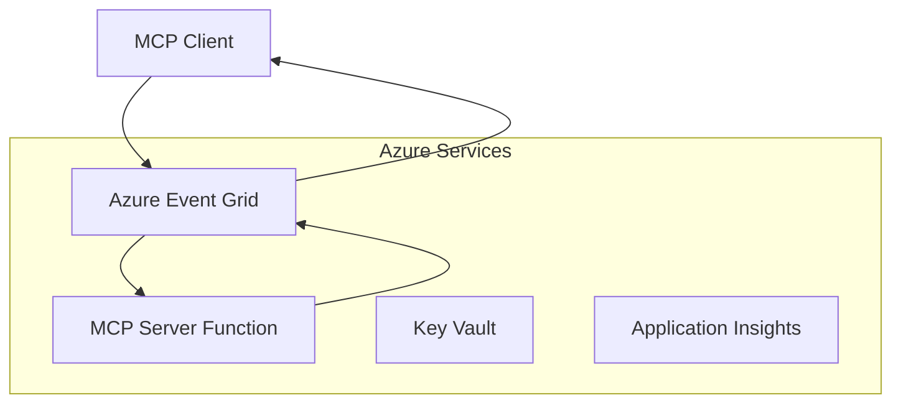
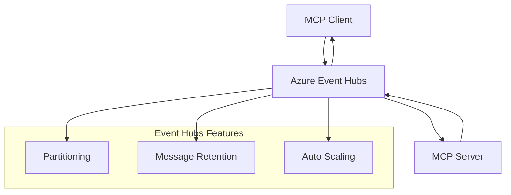

<!--
CO_OP_TRANSLATOR_METADATA:
{
  "original_hash": "c71c60af76120a517809a6cfba47e9a3",
  "translation_date": "2025-09-15T21:32:48+00:00",
  "source_file": "05-AdvancedTopics/mcp-transport/README.md",
  "language_code": "pa"
}
-->
# MCP ਕਸਟਮ ਟ੍ਰਾਂਸਪੋਰਟਸ - ਤਕਨੀਕੀ ਅਮਲਦਾਰ ਗਾਈਡ

ਮਾਡਲ ਕਾਂਟੈਕਸਟ ਪ੍ਰੋਟੋਕੋਲ (MCP) ਟ੍ਰਾਂਸਪੋਰਟ ਮਕੈਨਿਜ਼ਮ ਵਿੱਚ ਲਚਕਤਾ ਪ੍ਰਦਾਨ ਕਰਦਾ ਹੈ, ਜੋ ਵਿਸ਼ੇਸ਼ਤਾਵਾਂ ਵਾਲੇ ਕਾਰੋਬਾਰੀ ਵਾਤਾਵਰਣਾਂ ਲਈ ਕਸਟਮ ਅਮਲਦਾਰੀਆਂ ਦੀ ਆਗਿਆ ਦਿੰਦਾ ਹੈ। ਇਹ ਤਕਨੀਕੀ ਗਾਈਡ Azure Event Grid ਅਤੇ Azure Event Hubs ਦੀ ਵਰਤੋਂ ਕਰਕੇ ਕਸਟਮ ਟ੍ਰਾਂਸਪੋਰਟ ਅਮਲਦਾਰੀਆਂ ਦੀ ਪੜਚੋਲ ਕਰਦੀ ਹੈ, ਜੋ ਕਿ ਸਕੇਲਬਲ, ਕਲਾਉਡ-ਨੇਟਿਵ MCP ਹੱਲ ਬਣਾਉਣ ਲਈ ਪ੍ਰਯੋਗਿਕ ਉਦਾਹਰਨਾਂ ਹਨ।

## ਪਰਿਚਯ

ਜਦੋਂ ਕਿ MCP ਦੇ ਮਿਆਰੀ ਟ੍ਰਾਂਸਪੋਰਟ (stdio ਅਤੇ HTTP ਸਟ੍ਰੀਮਿੰਗ) ਜ਼ਿਆਦਾਤਰ ਵਰਤੋਂ ਦੇ ਕੇਸਾਂ ਦੀ ਪੂਰਤੀ ਕਰਦੇ ਹਨ, ਕਾਰੋਬਾਰੀ ਵਾਤਾਵਰਣ ਅਕਸਰ ਵਧੇਰੇ ਸਕੇਲਬਿਲਟੀ, ਭਰੋਸੇਯੋਗਤਾ, ਅਤੇ ਮੌਜੂਦਾ ਕਲਾਉਡ ਢਾਂਚੇ ਨਾਲ ਇੰਟੀਗ੍ਰੇਸ਼ਨ ਲਈ ਵਿਸ਼ੇਸ਼ ਟ੍ਰਾਂਸਪੋਰਟ ਮਕੈਨਿਜ਼ਮ ਦੀ ਲੋੜ ਹੁੰਦੀ ਹੈ। ਕਸਟਮ ਟ੍ਰਾਂਸਪੋਰਟ MCP ਨੂੰ ਅਸਮਰਥਿਤ ਸੰਚਾਰ, ਇਵੈਂਟ-ਡ੍ਰਿਵਨ ਆਰਕੀਟੈਕਚਰ, ਅਤੇ ਵੰਡੇ ਪ੍ਰੋਸੈਸਿੰਗ ਲਈ ਕਲਾਉਡ-ਨੇਟਿਵ ਮੈਸੇਜਿੰਗ ਸੇਵਾਵਾਂ ਦੀ ਵਰਤੋਂ ਕਰਨ ਦੀ ਆਗਿਆ ਦਿੰਦੇ ਹਨ।

ਇਹ ਪਾਠ ਨਵੀਂ MCP ਵਿਸ਼ੇਸ਼ਤਾ (2025-06-18), Azure ਮੈਸੇਜਿੰਗ ਸੇਵਾਵਾਂ, ਅਤੇ ਸਥਾਪਿਤ ਕਾਰੋਬਾਰੀ ਇੰਟੀਗ੍ਰੇਸ਼ਨ ਪੈਟਰਨਾਂ ਦੇ ਆਧਾਰ 'ਤੇ ਤਕਨੀਕੀ ਟ੍ਰਾਂਸਪੋਰਟ ਅਮਲਦਾਰੀਆਂ ਦੀ ਪੜਚੋਲ ਕਰਦਾ ਹੈ।

### **MCP ਟ੍ਰਾਂਸਪੋਰਟ ਆਰਕੀਟੈਕਚਰ**

**MCP ਵਿਸ਼ੇਸ਼ਤਾ (2025-06-18) ਤੋਂ:**

- **ਮਿਆਰੀ ਟ੍ਰਾਂਸਪੋਰਟਸ**: stdio (ਸਿਫਾਰਸ਼ੀ), HTTP ਸਟ੍ਰੀਮਿੰਗ (ਦੂਰ-ਦਰਾਜ ਦੇ ਸਥਿਤੀਆਂ ਲਈ)
- **ਕਸਟਮ ਟ੍ਰਾਂਸਪੋਰਟਸ**: ਕੋਈ ਵੀ ਟ੍ਰਾਂਸਪੋਰਟ ਜੋ MCP ਮੈਸੇਜ ਐਕਸਚੇਂਜ ਪ੍ਰੋਟੋਕੋਲ ਨੂੰ ਅਮਲ ਵਿੱਚ ਲਿਆਉਂਦਾ ਹੈ
- **ਮੈਸੇਜ ਫਾਰਮੈਟ**: JSON-RPC 2.0 MCP-ਵਿਸ਼ੇਸ਼ਤਾਵਾਂ ਦੇ ਨਾਲ
- **ਦੋ-ਪਾਸਾ ਸੰਚਾਰ**: ਨੋਟੀਫਿਕੇਸ਼ਨ ਅਤੇ ਜਵਾਬਾਂ ਲਈ ਪੂਰੀ ਡੁਪਲੈਕਸ ਸੰਚਾਰ ਦੀ ਲੋੜ ਹੈ

## ਸਿੱਖਣ ਦੇ ਉਦੇਸ਼

ਇਸ ਤਕਨੀਕੀ ਪਾਠ ਦੇ ਅੰਤ ਤੱਕ, ਤੁਸੀਂ ਸਮਰੱਥ ਹੋਵੋਗੇ:

- **ਕਸਟਮ ਟ੍ਰਾਂਸਪੋਰਟ ਦੀਆਂ ਲੋੜਾਂ ਨੂੰ ਸਮਝੋ**: ਕਿਸੇ ਵੀ ਟ੍ਰਾਂਸਪੋਰਟ ਲੇਅਰ 'ਤੇ MCP ਪ੍ਰੋਟੋਕੋਲ ਨੂੰ ਅਮਲ ਵਿੱਚ ਲਿਆਉਣਾ ਜਦੋਂ ਕਿ ਅਨੁਕੂਲਤਾ ਨੂੰ ਬਰਕਰਾਰ ਰੱਖਣਾ
- **Azure Event Grid ਟ੍ਰਾਂਸਪੋਰਟ ਬਣਾਓ**: ਸਰਵਰਲੈਸ ਸਕੇਲਬਿਲਟੀ ਲਈ Azure Event Grid ਦੀ ਵਰਤੋਂ ਕਰਕੇ ਇਵੈਂਟ-ਡ੍ਰਿਵਨ MCP ਸਰਵਰ ਬਣਾਓ
- **Azure Event Hubs ਟ੍ਰਾਂਸਪੋਰਟ ਅਮਲ ਵਿੱਚ ਲਿਆਓ**: ਰੀਅਲ-ਟਾਈਮ ਸਟ੍ਰੀਮਿੰਗ ਲਈ Azure Event Hubs ਦੀ ਵਰਤੋਂ ਕਰਕੇ ਉੱਚ-ਥਰੂਪੁੱਟ MCP ਹੱਲਾਂ ਡਿਜ਼ਾਈਨ ਕਰੋ
- **ਕਾਰੋਬਾਰੀ ਪੈਟਰਨ ਲਾਗੂ ਕਰੋ**: ਮੌਜੂਦਾ Azure ਢਾਂਚੇ ਅਤੇ ਸੁਰੱਖਿਆ ਮਾਡਲਾਂ ਨਾਲ ਕਸਟਮ ਟ੍ਰਾਂਸਪੋਰਟਸ ਨੂੰ ਇੰਟੀਗ੍ਰੇਟ ਕਰੋ
- **ਟ੍ਰਾਂਸਪੋਰਟ ਭਰੋਸੇਯੋਗਤਾ ਨੂੰ ਸੰਭਾਲੋ**: ਕਾਰੋਬਾਰੀ ਸਥਿਤੀਆਂ ਲਈ ਮੈਸੇਜ ਟਿਕਾਊਪਨ, ਕ੍ਰਮ, ਅਤੇ ਗਲਤੀ ਸੰਭਾਲਨ ਨੂੰ ਅਮਲ ਵਿੱਚ ਲਿਆਉਣਾ
- **ਪ੍ਰਦਰਸ਼ਨ ਨੂੰ ਅਨੁਕੂਲ ਬਣਾਓ**: ਸਕੇਲ, ਲੈਟੈਂਸੀ, ਅਤੇ ਥਰੂਪੁੱਟ ਦੀਆਂ ਲੋੜਾਂ ਲਈ ਟ੍ਰਾਂਸਪੋਰਟ ਹੱਲਾਂ ਡਿਜ਼ਾਈਨ ਕਰੋ

## **ਟ੍ਰਾਂਸਪੋਰਟ ਦੀਆਂ ਲੋੜਾਂ**

### **MCP ਵਿਸ਼ੇਸ਼ਤਾ (2025-06-18) ਤੋਂ ਮੁੱਖ ਲੋੜਾਂ:**

```yaml
Message Protocol:
  format: "JSON-RPC 2.0 with MCP extensions"
  bidirectional: "Full duplex communication required"
  ordering: "Message ordering must be preserved per session"
  
Transport Layer:
  reliability: "Transport MUST handle connection failures gracefully"
  security: "Transport MUST support secure communication"
  identification: "Each session MUST have unique identifier"
  
Custom Transport:
  compliance: "MUST implement complete MCP message exchange"
  extensibility: "MAY add transport-specific features"
  interoperability: "MUST maintain protocol compatibility"
```

## **Azure Event Grid ਟ੍ਰਾਂਸਪੋਰਟ ਅਮਲਦਾਰੀ**

Azure Event Grid ਇੱਕ ਸਰਵਰਲੈਸ ਇਵੈਂਟ ਰਾਊਟਿੰਗ ਸੇਵਾ ਪ੍ਰਦਾਨ ਕਰਦਾ ਹੈ ਜੋ ਇਵੈਂਟ-ਡ੍ਰਿਵਨ MCP ਆਰਕੀਟੈਕਚਰ ਲਈ ਆਦਰਸ਼ ਹੈ। ਇਹ ਅਮਲਦਾਰੀ ਸਕੇਲਬਲ, ਢਿੱਲੇ-ਜੁੜੇ MCP ਸਿਸਟਮ ਬਣਾਉਣ ਦਾ ਪ੍ਰਦਰਸ਼ਨ ਕਰਦੀ ਹੈ।

### **ਆਰਕੀਟੈਕਚਰ ਝਲਕ**



### **C# ਅਮਲਦਾਰੀ - Event Grid ਟ੍ਰਾਂਸਪੋਰਟ**

```csharp
using Azure.Messaging.EventGrid;
using Microsoft.Extensions.Azure;
using System.Text.Json;

public class EventGridMcpTransport : IMcpTransport
{
    private readonly EventGridPublisherClient _publisher;
    private readonly string _topicEndpoint;
    private readonly string _clientId;
    
    public EventGridMcpTransport(string topicEndpoint, string accessKey, string clientId)
    {
        _publisher = new EventGridPublisherClient(
            new Uri(topicEndpoint), 
            new AzureKeyCredential(accessKey));
        _topicEndpoint = topicEndpoint;
        _clientId = clientId;
    }
    
    public async Task SendMessageAsync(McpMessage message)
    {
        var eventGridEvent = new EventGridEvent(
            subject: $"mcp/{_clientId}",
            eventType: "MCP.MessageReceived",
            dataVersion: "1.0",
            data: JsonSerializer.Serialize(message))
        {
            Id = Guid.NewGuid().ToString(),
            EventTime = DateTimeOffset.UtcNow
        };
        
        await _publisher.SendEventAsync(eventGridEvent);
    }
    
    public async Task<McpMessage> ReceiveMessageAsync(CancellationToken cancellationToken)
    {
        // Event Grid is push-based, so implement webhook receiver
        // This would typically be handled by Azure Functions trigger
        throw new NotImplementedException("Use EventGridTrigger in Azure Functions");
    }
}

// Azure Function for receiving Event Grid events
[FunctionName("McpEventGridReceiver")]
public async Task<IActionResult> HandleEventGridMessage(
    [EventGridTrigger] EventGridEvent eventGridEvent,
    ILogger log)
{
    try
    {
        var mcpMessage = JsonSerializer.Deserialize<McpMessage>(
            eventGridEvent.Data.ToString());
        
        // Process MCP message
        var response = await _mcpServer.ProcessMessageAsync(mcpMessage);
        
        // Send response back via Event Grid
        await _transport.SendMessageAsync(response);
        
        return new OkResult();
    }
    catch (Exception ex)
    {
        log.LogError(ex, "Error processing Event Grid MCP message");
        return new BadRequestResult();
    }
}
```

### **TypeScript ਅਮਲਦਾਰੀ - Event Grid ਟ੍ਰਾਂਸਪੋਰਟ**

```typescript
import { EventGridPublisherClient, AzureKeyCredential } from "@azure/eventgrid";
import { McpTransport, McpMessage } from "./mcp-types";

export class EventGridMcpTransport implements McpTransport {
    private publisher: EventGridPublisherClient;
    private clientId: string;
    
    constructor(
        private topicEndpoint: string,
        private accessKey: string,
        clientId: string
    ) {
        this.publisher = new EventGridPublisherClient(
            topicEndpoint,
            new AzureKeyCredential(accessKey)
        );
        this.clientId = clientId;
    }
    
    async sendMessage(message: McpMessage): Promise<void> {
        const event = {
            id: crypto.randomUUID(),
            source: `mcp-client-${this.clientId}`,
            type: "MCP.MessageReceived",
            time: new Date(),
            data: message
        };
        
        await this.publisher.sendEvents([event]);
    }
    
    // Event-driven receive via Azure Functions
    onMessage(handler: (message: McpMessage) => Promise<void>): void {
        // Implementation would use Azure Functions Event Grid trigger
        // This is a conceptual interface for the webhook receiver
    }
}

// Azure Functions implementation
import { app, InvocationContext, EventGridEvent } from "@azure/functions";

app.eventGrid("mcpEventGridHandler", {
    handler: async (event: EventGridEvent, context: InvocationContext) => {
        try {
            const mcpMessage = event.data as McpMessage;
            
            // Process MCP message
            const response = await mcpServer.processMessage(mcpMessage);
            
            // Send response via Event Grid
            await transport.sendMessage(response);
            
        } catch (error) {
            context.error("Error processing MCP message:", error);
            throw error;
        }
    }
});
```

### **Python ਅਮਲਦਾਰੀ - Event Grid ਟ੍ਰਾਂਸਪੋਰਟ**

```python
from azure.eventgrid import EventGridPublisherClient, EventGridEvent
from azure.core.credentials import AzureKeyCredential
import asyncio
import json
from typing import Callable, Optional
import uuid
from datetime import datetime

class EventGridMcpTransport:
    def __init__(self, topic_endpoint: str, access_key: str, client_id: str):
        self.client = EventGridPublisherClient(
            topic_endpoint, 
            AzureKeyCredential(access_key)
        )
        self.client_id = client_id
        self.message_handler: Optional[Callable] = None
    
    async def send_message(self, message: dict) -> None:
        """Send MCP message via Event Grid"""
        event = EventGridEvent(
            data=message,
            subject=f"mcp/{self.client_id}",
            event_type="MCP.MessageReceived",
            data_version="1.0"
        )
        
        await self.client.send(event)
    
    def on_message(self, handler: Callable[[dict], None]) -> None:
        """Register message handler for incoming events"""
        self.message_handler = handler

# Azure Functions implementation
import azure.functions as func
import logging

def main(event: func.EventGridEvent) -> None:
    """Azure Functions Event Grid trigger for MCP messages"""
    try:
        # Parse MCP message from Event Grid event
        mcp_message = json.loads(event.get_body().decode('utf-8'))
        
        # Process MCP message
        response = process_mcp_message(mcp_message)
        
        # Send response back via Event Grid
        # (Implementation would create new Event Grid client)
        
    except Exception as e:
        logging.error(f"Error processing MCP Event Grid message: {e}")
        raise
```

## **Azure Event Hubs ਟ੍ਰਾਂਸਪੋਰਟ ਅਮਲਦਾਰੀ**

Azure Event Hubs ਉੱਚ-ਥਰੂਪੁੱਟ, ਰੀਅਲ-ਟਾਈਮ ਸਟ੍ਰੀਮਿੰਗ ਸਮਰੱਥਾਵਾਂ ਪ੍ਰਦਾਨ ਕਰਦਾ ਹੈ ਜੋ MCP ਸਥਿਤੀਆਂ ਲਈ ਘੱਟ ਲੈਟੈਂਸੀ ਅਤੇ ਉੱਚ ਮੈਸੇਜ ਵਾਲਿਊਮ ਦੀ ਲੋੜ ਰੱਖਦੇ ਹਨ।

### **ਆਰਕੀਟੈਕਚਰ ਝਲਕ**



### **C# ਅਮਲਦਾਰੀ - Event Hubs ਟ੍ਰਾਂਸਪੋਰਟ**

```csharp
using Azure.Messaging.EventHubs;
using Azure.Messaging.EventHubs.Producer;
using Azure.Messaging.EventHubs.Consumer;
using System.Text;

public class EventHubsMcpTransport : IMcpTransport, IDisposable
{
    private readonly EventHubProducerClient _producer;
    private readonly EventHubConsumerClient _consumer;
    private readonly string _consumerGroup;
    private readonly CancellationTokenSource _cancellationTokenSource;
    
    public EventHubsMcpTransport(
        string connectionString, 
        string eventHubName,
        string consumerGroup = "$Default")
    {
        _producer = new EventHubProducerClient(connectionString, eventHubName);
        _consumer = new EventHubConsumerClient(
            consumerGroup, 
            connectionString, 
            eventHubName);
        _consumerGroup = consumerGroup;
        _cancellationTokenSource = new CancellationTokenSource();
    }
    
    public async Task SendMessageAsync(McpMessage message)
    {
        var messageBody = JsonSerializer.Serialize(message);
        var eventData = new EventData(Encoding.UTF8.GetBytes(messageBody));
        
        // Add MCP-specific properties
        eventData.Properties.Add("MessageType", message.Method ?? "response");
        eventData.Properties.Add("MessageId", message.Id);
        eventData.Properties.Add("Timestamp", DateTimeOffset.UtcNow);
        
        await _producer.SendAsync(new[] { eventData });
    }
    
    public async Task StartReceivingAsync(
        Func<McpMessage, Task> messageHandler)
    {
        await foreach (PartitionEvent partitionEvent in _consumer.ReadEventsAsync(
            _cancellationTokenSource.Token))
        {
            try
            {
                var messageBody = Encoding.UTF8.GetString(
                    partitionEvent.Data.EventBody.ToArray());
                var mcpMessage = JsonSerializer.Deserialize<McpMessage>(messageBody);
                
                await messageHandler(mcpMessage);
            }
            catch (Exception ex)
            {
                // Handle deserialization or processing errors
                Console.WriteLine($"Error processing message: {ex.Message}");
            }
        }
    }
    
    public void Dispose()
    {
        _cancellationTokenSource?.Cancel();
        _producer?.DisposeAsync().AsTask().Wait();
        _consumer?.DisposeAsync().AsTask().Wait();
        _cancellationTokenSource?.Dispose();
    }
}
```

### **TypeScript ਅਮਲਦਾਰੀ - Event Hubs ਟ੍ਰਾਂਸਪੋਰਟ**

```typescript
import { 
    EventHubProducerClient, 
    EventHubConsumerClient, 
    EventData 
} from "@azure/event-hubs";

export class EventHubsMcpTransport implements McpTransport {
    private producer: EventHubProducerClient;
    private consumer: EventHubConsumerClient;
    private isReceiving = false;
    
    constructor(
        private connectionString: string,
        private eventHubName: string,
        private consumerGroup: string = "$Default"
    ) {
        this.producer = new EventHubProducerClient(
            connectionString, 
            eventHubName
        );
        this.consumer = new EventHubConsumerClient(
            consumerGroup,
            connectionString,
            eventHubName
        );
    }
    
    async sendMessage(message: McpMessage): Promise<void> {
        const eventData: EventData = {
            body: JSON.stringify(message),
            properties: {
                messageType: message.method || "response",
                messageId: message.id,
                timestamp: new Date().toISOString()
            }
        };
        
        await this.producer.sendBatch([eventData]);
    }
    
    async startReceiving(
        messageHandler: (message: McpMessage) => Promise<void>
    ): Promise<void> {
        if (this.isReceiving) return;
        
        this.isReceiving = true;
        
        const subscription = this.consumer.subscribe({
            processEvents: async (events, context) => {
                for (const event of events) {
                    try {
                        const messageBody = event.body as string;
                        const mcpMessage: McpMessage = JSON.parse(messageBody);
                        
                        await messageHandler(mcpMessage);
                        
                        // Update checkpoint for at-least-once delivery
                        await context.updateCheckpoint(event);
                    } catch (error) {
                        console.error("Error processing Event Hubs message:", error);
                    }
                }
            },
            processError: async (err, context) => {
                console.error("Event Hubs error:", err);
            }
        });
    }
    
    async close(): Promise<void> {
        this.isReceiving = false;
        await this.producer.close();
        await this.consumer.close();
    }
}
```

### **Python ਅਮਲਦਾਰੀ - Event Hubs ਟ੍ਰਾਂਸਪੋਰਟ**

```python
from azure.eventhub import EventHubProducerClient, EventHubConsumerClient
from azure.eventhub import EventData
import json
import asyncio
from typing import Callable, Dict, Any
import logging

class EventHubsMcpTransport:
    def __init__(
        self, 
        connection_string: str, 
        eventhub_name: str,
        consumer_group: str = "$Default"
    ):
        self.producer = EventHubProducerClient.from_connection_string(
            connection_string, 
            eventhub_name=eventhub_name
        )
        self.consumer = EventHubConsumerClient.from_connection_string(
            connection_string,
            consumer_group=consumer_group,
            eventhub_name=eventhub_name
        )
        self.is_receiving = False
    
    async def send_message(self, message: Dict[str, Any]) -> None:
        """Send MCP message via Event Hubs"""
        event_data = EventData(json.dumps(message))
        
        # Add MCP-specific properties
        event_data.properties = {
            "messageType": message.get("method", "response"),
            "messageId": message.get("id"),
            "timestamp": "2025-01-14T10:30:00Z"  # Use actual timestamp
        }
        
        async with self.producer:
            event_data_batch = await self.producer.create_batch()
            event_data_batch.add(event_data)
            await self.producer.send_batch(event_data_batch)
    
    async def start_receiving(
        self, 
        message_handler: Callable[[Dict[str, Any]], None]
    ) -> None:
        """Start receiving MCP messages from Event Hubs"""
        if self.is_receiving:
            return
        
        self.is_receiving = True
        
        async with self.consumer:
            await self.consumer.receive(
                on_event=self._on_event_received(message_handler),
                starting_position="-1"  # Start from beginning
            )
    
    def _on_event_received(self, handler: Callable):
        """Internal event handler wrapper"""
        async def handle_event(partition_context, event):
            try:
                # Parse MCP message from Event Hubs event
                message_body = event.body_as_str(encoding='UTF-8')
                mcp_message = json.loads(message_body)
                
                # Process MCP message
                await handler(mcp_message)
                
                # Update checkpoint for at-least-once delivery
                await partition_context.update_checkpoint(event)
                
            except Exception as e:
                logging.error(f"Error processing Event Hubs message: {e}")
        
        return handle_event
    
    async def close(self) -> None:
        """Clean up transport resources"""
        self.is_receiving = False
        await self.producer.close()
        await self.consumer.close()
```

## **ਤਕਨੀਕੀ ਟ੍ਰਾਂਸਪੋਰਟ ਪੈਟਰਨ**

### **ਮੈਸੇਜ ਟਿਕਾਊਪਨ ਅਤੇ ਭਰੋਸੇਯੋਗਤਾ**

```csharp
// Implementing message durability with retry logic
public class ReliableTransportWrapper : IMcpTransport
{
    private readonly IMcpTransport _innerTransport;
    private readonly RetryPolicy _retryPolicy;
    
    public async Task SendMessageAsync(McpMessage message)
    {
        await _retryPolicy.ExecuteAsync(async () =>
        {
            try
            {
                await _innerTransport.SendMessageAsync(message);
            }
            catch (TransportException ex) when (ex.IsRetryable)
            {
                // Log and retry
                throw;
            }
        });
    }
}
```

### **ਟ੍ਰਾਂਸਪੋਰਟ ਸੁਰੱਖਿਆ ਇੰਟੀਗ੍ਰੇਸ਼ਨ**

```csharp
// Integrating Azure Key Vault for transport security
public class SecureTransportFactory
{
    private readonly SecretClient _keyVaultClient;
    
    public async Task<IMcpTransport> CreateEventGridTransportAsync()
    {
        var accessKey = await _keyVaultClient.GetSecretAsync("EventGridAccessKey");
        var topicEndpoint = await _keyVaultClient.GetSecretAsync("EventGridTopic");
        
        return new EventGridMcpTransport(
            topicEndpoint.Value.Value,
            accessKey.Value.Value,
            Environment.MachineName
        );
    }
}
```

### **ਟ੍ਰਾਂਸਪੋਰਟ ਮਾਨੀਟਰਿੰਗ ਅਤੇ ਦ੍ਰਿਸ਼ਟਾਵਲਤਾ**

```csharp
// Adding telemetry to custom transports
public class ObservableTransport : IMcpTransport
{
    private readonly IMcpTransport _transport;
    private readonly ILogger _logger;
    private readonly TelemetryClient _telemetryClient;
    
    public async Task SendMessageAsync(McpMessage message)
    {
        using var activity = Activity.StartActivity("MCP.Transport.Send");
        activity?.SetTag("transport.type", "EventGrid");
        activity?.SetTag("message.method", message.Method);
        
        var stopwatch = Stopwatch.StartNew();
        
        try
        {
            await _transport.SendMessageAsync(message);
            
            _telemetryClient.TrackDependency(
                "EventGrid",
                "SendMessage",
                DateTime.UtcNow.Subtract(stopwatch.Elapsed),
                stopwatch.Elapsed,
                true
            );
        }
        catch (Exception ex)
        {
            _telemetryClient.TrackException(ex);
            throw;
        }
    }
}
```

## **ਕਾਰੋਬਾਰੀ ਇੰਟੀਗ੍ਰੇਸ਼ਨ ਸਥਿਤੀਆਂ**

### **ਸਥਿਤੀ 1: ਵੰਡੇ MCP ਪ੍ਰੋਸੈਸਿੰਗ**

Azure Event Grid ਦੀ ਵਰਤੋਂ ਕਰਕੇ ਕਈ ਪ੍ਰੋਸੈਸਿੰਗ ਨੋਡਾਂ ਵਿੱਚ MCP ਬੇਨਤੀ ਵੰਡਣਾ:

```yaml
Architecture:
  - MCP Client sends requests to Event Grid topic
  - Multiple Azure Functions subscribe to process different tool types
  - Results aggregated and returned via separate response topic
  
Benefits:
  - Horizontal scaling based on message volume
  - Fault tolerance through redundant processors
  - Cost optimization with serverless compute
```

### **ਸਥਿਤੀ 2: ਰੀਅਲ-ਟਾਈਮ MCP ਸਟ੍ਰੀਮਿੰਗ**

ਉੱਚ-ਫ੍ਰਿਕਵੈਂਸੀ MCP ਇੰਟਰੈਕਸ਼ਨ ਲਈ Azure Event Hubs ਦੀ ਵਰਤੋਂ:

```yaml
Architecture:
  - MCP Client streams continuous requests via Event Hubs
  - Stream Analytics processes and routes messages
  - Multiple consumers handle different aspect of processing
  
Benefits:
  - Low latency for real-time scenarios
  - High throughput for batch processing
  - Built-in partitioning for parallel processing
```

### **ਸਥਿਤੀ 3: ਹਾਈਬ੍ਰਿਡ ਟ੍ਰਾਂਸਪੋਰਟ ਆਰਕੀਟੈਕਚਰ**

ਵੱਖ-ਵੱਖ ਵਰਤੋਂ ਦੇ ਕੇਸਾਂ ਲਈ ਕਈ ਟ੍ਰਾਂਸਪੋਰਟਸ ਨੂੰ ਜੋੜਨਾ:

```csharp
public class HybridMcpTransport : IMcpTransport
{
    private readonly IMcpTransport _realtimeTransport; // Event Hubs
    private readonly IMcpTransport _batchTransport;    // Event Grid
    private readonly IMcpTransport _fallbackTransport; // HTTP Streaming
    
    public async Task SendMessageAsync(McpMessage message)
    {
        // Route based on message characteristics
        var transport = message.Method switch
        {
            "tools/call" when IsRealtime(message) => _realtimeTransport,
            "resources/read" when IsBatch(message) => _batchTransport,
            _ => _fallbackTransport
        };
        
        await transport.SendMessageAsync(message);
    }
}
```

## **ਪ੍ਰਦਰਸ਼ਨ ਅਨੁਕੂਲਤਾ**

### **Event Grid ਲਈ ਮੈਸੇਜ ਬੈਚਿੰਗ**

```csharp
public class BatchingEventGridTransport : IMcpTransport
{
    private readonly List<McpMessage> _messageBuffer = new();
    private readonly Timer _flushTimer;
    private const int MaxBatchSize = 100;
    
    public async Task SendMessageAsync(McpMessage message)
    {
        lock (_messageBuffer)
        {
            _messageBuffer.Add(message);
            
            if (_messageBuffer.Count >= MaxBatchSize)
            {
                _ = Task.Run(FlushMessages);
            }
        }
    }
    
    private async Task FlushMessages()
    {
        List<McpMessage> toSend;
        lock (_messageBuffer)
        {
            toSend = new List<McpMessage>(_messageBuffer);
            _messageBuffer.Clear();
        }
        
        if (toSend.Any())
        {
            var events = toSend.Select(CreateEventGridEvent);
            await _publisher.SendEventsAsync(events);
        }
    }
}
```

### **Event Hubs ਲਈ ਪਾਰਟੀਸ਼ਨਿੰਗ ਰਣਨੀਤੀ**

```csharp
public class PartitionedEventHubsTransport : IMcpTransport
{
    public async Task SendMessageAsync(McpMessage message)
    {
        // Partition by client ID for session affinity
        var partitionKey = ExtractClientId(message);
        
        var eventData = new EventData(JsonSerializer.SerializeToUtf8Bytes(message))
        {
            PartitionKey = partitionKey
        };
        
        await _producer.SendAsync(new[] { eventData });
    }
}
```

## **ਕਸਟਮ ਟ੍ਰਾਂਸਪੋਰਟਸ ਦੀ ਜਾਂਚ**

### **ਟੈਸਟ ਡਬਲਸ ਨਾਲ ਯੂਨਿਟ ਟੈਸਟਿੰਗ**

```csharp
[Test]
public async Task EventGridTransport_SendMessage_PublishesCorrectEvent()
{
    // Arrange
    var mockPublisher = new Mock<EventGridPublisherClient>();
    var transport = new EventGridMcpTransport(mockPublisher.Object);
    var message = new McpMessage { Method = "tools/list", Id = "test-123" };
    
    // Act
    await transport.SendMessageAsync(message);
    
    // Assert
    mockPublisher.Verify(
        x => x.SendEventAsync(
            It.Is<EventGridEvent>(e => 
                e.EventType == "MCP.MessageReceived" &&
                e.Subject == "mcp/test-client"
            )
        ),
        Times.Once
    );
}
```

### **Azure ਟੈਸਟ ਕੰਟੇਨਰਜ਼ ਨਾਲ ਇੰਟੀਗ੍ਰੇਸ਼ਨ ਟੈਸਟਿੰਗ**

```csharp
[Test]
public async Task EventHubsTransport_IntegrationTest()
{
    // Using Testcontainers for integration testing
    var eventHubsContainer = new EventHubsContainer()
        .WithEventHub("test-hub");
    
    await eventHubsContainer.StartAsync();
    
    var transport = new EventHubsMcpTransport(
        eventHubsContainer.GetConnectionString(),
        "test-hub"
    );
    
    // Test message round-trip
    var sentMessage = new McpMessage { Method = "test", Id = "123" };
    McpMessage receivedMessage = null;
    
    await transport.StartReceivingAsync(msg => {
        receivedMessage = msg;
        return Task.CompletedTask;
    });
    
    await transport.SendMessageAsync(sentMessage);
    await Task.Delay(1000); // Allow for message processing
    
    Assert.That(receivedMessage?.Id, Is.EqualTo("123"));
}
```

## **ਸਰਵੋਤਮ ਅਭਿਆਸ ਅਤੇ ਦਿਸ਼ਾ-ਨਿਰਦੇਸ਼**

### **ਟ੍ਰਾਂਸਪੋਰਟ ਡਿਜ਼ਾਈਨ ਸਿਧਾਂਤ**

1. **ਇਡੈਂਪੋਟੈਂਸੀ**: ਡੁਪਲੀਕੇਟਸ ਨੂੰ ਸੰਭਾਲਣ ਲਈ ਮੈਸੇਜ ਪ੍ਰੋਸੈਸਿੰਗ ਨੂੰ ਇਡੈਂਪੋਟੈਂਟ ਬਣਾਓ
2. **ਗਲਤੀ ਸੰਭਾਲਨ**: ਵਿਸਤ੍ਰਿਤ ਗਲਤੀ ਸੰਭਾਲਨ ਅਤੇ ਡੈਡ ਲੈਟਰ ਕਿਊਜ਼ ਨੂੰ ਅਮਲ ਵਿੱਚ ਲਿਆਓ
3. **ਮਾਨੀਟਰਿੰਗ**: ਵਿਸਤ੍ਰਿਤ ਟੈਲੀਮੇਟਰੀ ਅਤੇ ਸਿਹਤ ਜਾਂਚ ਸ਼ਾਮਲ ਕਰੋ
4. **ਸੁਰੱਖਿਆ**: ਮੈਨੇਜਡ ਆਈਡੈਂਟੀਟੀਆਂ ਅਤੇ ਘੱਟ ਤੋਂ ਘੱਟ ਅਧਿਕਾਰ ਪਹੁੰਚ ਦੀ ਵਰਤੋਂ ਕਰੋ
5. **ਪ੍ਰਦਰਸ਼ਨ**: ਆਪਣੀਆਂ ਵਿਸ਼ੇਸ਼ ਲੈਟੈਂਸੀ ਅਤੇ ਥਰੂਪੁੱਟ ਦੀਆਂ ਲੋੜਾਂ ਲਈ ਡਿਜ਼ਾਈਨ ਕਰੋ

### **Azure-ਵਿਸ਼ੇਸ਼ ਸਿਫਾਰਸ਼ਾਂ**

1. **ਮੈਨੇਜਡ ਆਈਡੈਂਟੀਟੀ ਦੀ ਵਰਤੋਂ ਕਰੋ**: ਉਤਪਾਦਨ ਵਿੱਚ ਕਨੈਕਸ਼ਨ ਸਟ੍ਰਿੰਗਾਂ ਤੋਂ ਬਚੋ
2. **ਸਰਕਿਟ ਬ੍ਰੇਕਰਜ਼ ਨੂੰ ਅਮਲ ਵਿੱਚ ਲਿਆਓ**: Azure ਸੇਵਾ ਬੰਦ ਹੋਣ ਤੋਂ ਬਚਾਓ
3. **ਲਾਗਤਾਂ ਦੀ ਨਿਗਰਾਨੀ ਕਰੋ**: ਮੈਸੇਜ ਵਾਲਿਊਮ ਅਤੇ ਪ੍ਰੋਸੈਸਿੰਗ ਲਾਗਤਾਂ ਨੂੰ ਟ੍ਰੈਕ ਕਰੋ
4. **ਸਕੇਲ ਲਈ ਯੋਜਨਾ ਬਣਾਓ**: ਪਾਰਟੀਸ਼ਨਿੰਗ ਅਤੇ ਸਕੇਲਿੰਗ ਰਣਨੀਤੀਆਂ ਨੂੰ ਜਲਦੀ ਡਿਜ਼ਾਈਨ ਕਰੋ
5. **ਵਿਆਪਕ ਟੈਸਟ ਕਰੋ**: ਵਿਸਤ੍ਰਿਤ ਟੈਸਟਿੰਗ ਲਈ Azure DevTest Labs ਦੀ ਵਰਤੋਂ ਕਰੋ

## **ਨਿਸ਼ਕਰਸ਼**

ਕਸਟਮ MCP ਟ੍ਰਾਂਸਪੋਰਟਸ Azure ਦੀ ਮੈਸੇਜਿੰਗ ਸੇਵਾਵਾਂ ਦੀ ਵਰਤੋਂ ਕਰਕੇ ਸ਼ਕਤੀਸ਼ਾਲੀ ਕਾਰੋਬਾਰੀ ਸਥਿਤੀਆਂ ਨੂੰ ਸੰਭਵ ਬਣਾਉਂਦੇ ਹਨ। Event Grid ਜਾਂ Event Hubs ਟ੍ਰਾਂਸਪੋਰਟਸ ਨੂੰ ਅਮਲ ਵਿੱਚ ਲਿਆਉਣ ਦੁਆਰਾ, ਤੁਸੀਂ ਸਕੇਲਬਲ, ਭਰੋਸੇਯੋਗ MCP ਹੱਲਾਂ ਬਣਾਉਣ ਦੇ ਯੋਗ ਹੋਵੋਗੇ ਜੋ ਮੌਜੂਦਾ Azure ਢਾਂਚੇ ਨਾਲ ਬੇਰੋਕ ਇੰਟੀਗ੍ਰੇਟ ਹੁੰਦੇ ਹਨ।

ਦਿੱਤੇ ਗਏ ਉਦਾਹਰਨ ਕਸਟਮ ਟ੍ਰਾਂਸਪੋਰਟਸ ਨੂੰ ਅਮਲ ਵਿੱਚ ਲਿਆਉਣ ਲਈ ਉਤਪਾਦਨ-ਤਿਆਰ ਪੈਟਰਨਾਂ ਦਾ ਪ੍ਰਦਰਸ਼ਨ ਕਰਦੇ ਹਨ ਜਦੋਂ ਕਿ MCP ਪ੍ਰੋਟੋਕੋਲ ਅਨੁਕੂਲਤਾ ਅਤੇ Azure ਸਰਵੋਤਮ ਅਭਿਆਸਾਂ ਨੂੰ ਬਰਕਰਾਰ ਰੱਖਦੇ ਹਨ।

## **ਵਾਧੂ ਸਰੋਤ**

- [MCP ਵਿਸ਼ੇਸ਼ਤਾ 2025-06-18](https://spec.modelcontextprotocol.io/specification/2025-06-18/)
- [Azure Event Grid ਦਸਤਾਵੇਜ਼](https://docs.microsoft.com/azure/event-grid/)
- [Azure Event Hubs ਦਸਤਾਵੇਜ਼](https://docs.microsoft.com/azure/event-hubs/)
- [Azure Functions Event Grid Trigger](https://docs.microsoft.com/azure/azure-functions/functions-bindings-event-grid)
- [Azure SDK for .NET](https://github.com/Azure/azure-sdk-for-net)
- [Azure SDK for TypeScript](https://github.com/Azure/azure-sdk-for-js)
- [Azure SDK for Python](https://github.com/Azure/azure-sdk-for-python)

---

> *ਇਹ ਗਾਈਡ ਉਤਪਾਦਨ MCP ਸਿਸਟਮਾਂ ਲਈ ਪ੍ਰਯੋਗਿਕ ਅਮਲਦਾਰੀ ਪੈਟਰਨਾਂ 'ਤੇ ਧਿਆਨ ਕੇਂਦਰਿਤ ਕਰਦੀ ਹੈ। ਹਮੇਸ਼ਾ ਆਪਣੇ ਵਿਸ਼ੇਸ਼ ਲੋੜਾਂ ਅਤੇ Azure ਸੇਵਾ ਸੀਮਾਵਾਂ ਦੇ ਖਿਲਾਫ ਟ੍ਰਾਂਸਪੋਰਟ ਅਮਲਦਾਰੀਆਂ ਦੀ ਪੁਸ਼ਟੀ ਕਰੋ।*
> **ਮੌਜੂਦਾ ਮਿਆਰ**: ਇਹ ਗਾਈਡ [MCP ਵਿਸ਼ੇਸ਼ਤਾ 2025-06-18](https://spec.modelcontextprotocol.io/specification/2025-06-18/) ਟ੍ਰਾਂਸਪੋਰਟ ਲੋੜਾਂ ਅਤੇ ਤਕਨੀਕੀ ਟ੍ਰਾਂਸਪੋਰਟ ਪੈਟਰਨਾਂ ਨੂੰ ਦਰਸਾਉਂਦੀ ਹੈ।

## ਅਗਲਾ ਕੀ ਹੈ
- [6. ਕਮਿਊਨਿਟੀ ਯੋਗਦਾਨ](../../06-CommunityContributions/README.md)

---

**ਅਸਵੀਕਤੀ**:  
ਇਹ ਦਸਤਾਵੇਜ਼ AI ਅਨੁਵਾਦ ਸੇਵਾ [Co-op Translator](https://github.com/Azure/co-op-translator) ਦੀ ਵਰਤੋਂ ਕਰਕੇ ਅਨੁਵਾਦ ਕੀਤਾ ਗਿਆ ਹੈ। ਜਦੋਂ ਕਿ ਅਸੀਂ ਸਹੀ ਹੋਣ ਦੀ ਪੂਰੀ ਕੋਸ਼ਿਸ਼ ਕਰਦੇ ਹਾਂ, ਕਿਰਪਾ ਕਰਕੇ ਧਿਆਨ ਦਿਓ ਕਿ ਸਵੈਚਾਲਿਤ ਅਨੁਵਾਦਾਂ ਵਿੱਚ ਗਲਤੀਆਂ ਜਾਂ ਅਸੁਚੱਜੇਪਣ ਹੋ ਸਕਦੇ ਹਨ। ਮੂਲ ਦਸਤਾਵੇਜ਼, ਜੋ ਇਸਦੀ ਮੂਲ ਭਾਸ਼ਾ ਵਿੱਚ ਹੈ, ਨੂੰ ਅਧਿਕਾਰਤ ਸਰੋਤ ਮੰਨਿਆ ਜਾਣਾ ਚਾਹੀਦਾ ਹੈ। ਮਹੱਤਵਪੂਰਨ ਜਾਣਕਾਰੀ ਲਈ, ਪੇਸ਼ੇਵਰ ਮਨੁੱਖੀ ਅਨੁਵਾਦ ਦੀ ਸਿਫਾਰਸ਼ ਕੀਤੀ ਜਾਂਦੀ ਹੈ। ਇਸ ਅਨੁਵਾਦ ਦੀ ਵਰਤੋਂ ਤੋਂ ਪੈਦਾ ਹੋਣ ਵਾਲੇ ਕਿਸੇ ਵੀ ਗਲਤਫਹਿਮੀ ਜਾਂ ਗਲਤ ਵਿਆਖਿਆ ਲਈ ਅਸੀਂ ਜ਼ਿੰਮੇਵਾਰ ਨਹੀਂ ਹਾਂ।