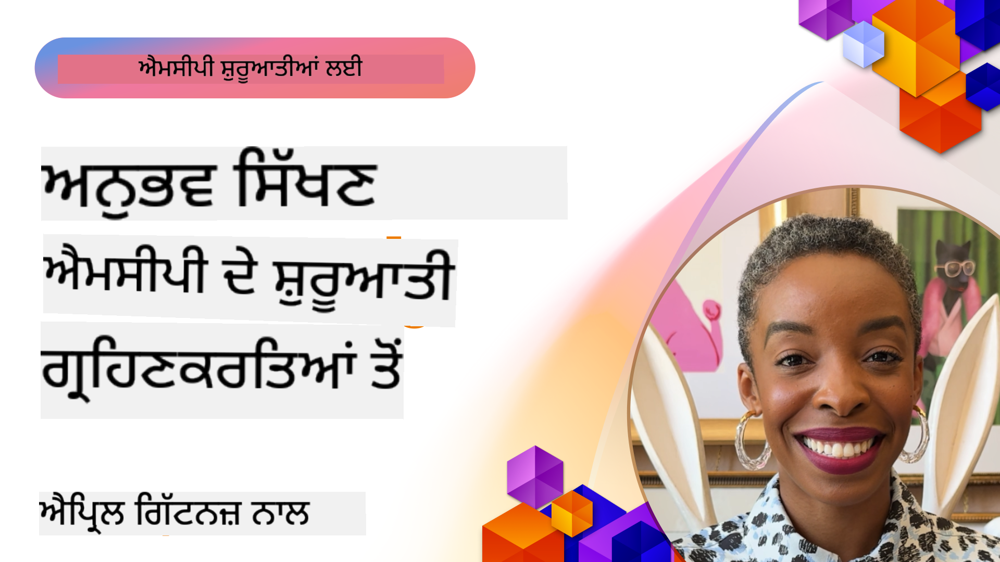

<!--
CO_OP_TRANSLATOR_METADATA:
{
  "original_hash": "41f16dac486d2086a53bc644a01cbe42",
  "translation_date": "2025-08-18T16:31:00+00:00",
  "source_file": "07-LessonsfromEarlyAdoption/README.md",
  "language_code": "pa"
}
-->
# 🌟 ਸ਼ੁਰੂਆਤੀ ਗ੍ਰਾਹਕਾਂ ਤੋਂ ਸਿੱਖਿਆ

[](https://youtu.be/jds7dSmNptE)

_(ਉਪਰ ਦਿੱਤੀ ਤਸਵੀਰ 'ਤੇ ਕਲਿਕ ਕਰਕੇ ਇਸ ਪਾਠ ਦਾ ਵੀਡੀਓ ਵੇਖੋ)_

## 🎯 ਇਹ ਮੋਡਿਊਲ ਕੀ ਕਵਰ ਕਰਦਾ ਹੈ

ਇਹ ਮੋਡਿਊਲ ਇਸ ਗੱਲ ਦੀ ਜਾਂਚ ਕਰਦਾ ਹੈ ਕਿ ਅਸਲ ਸੰਸਥਾਵਾਂ ਅਤੇ ਡਿਵੈਲਪਰ Model Context Protocol (MCP) ਨੂੰ ਅਸਲ ਚੁਣੌਤੀਆਂ ਹੱਲ ਕਰਨ ਅਤੇ ਨਵਾਟਾਂ ਨੂੰ ਅੱਗੇ ਵਧਾਉਣ ਲਈ ਕਿਵੇਂ ਵਰਤ ਰਹੇ ਹਨ। ਵਿਸਤ੍ਰਿਤ ਕੇਸ ਸਟੱਡੀਆਂ ਅਤੇ ਹੱਥ-ਅਨੁਭਵ ਪ੍ਰਾਜੈਕਟਾਂ ਰਾਹੀਂ, ਤੁਸੀਂ ਸਿੱਖੋਗੇ ਕਿ MCP ਕਿਵੇਂ ਸੁਰੱਖਿਅਤ, ਸਕੇਲਯੋਗ AI ਇੰਟੀਗ੍ਰੇਸ਼ਨ ਨੂੰ ਯੋਗ ਬਣਾਉਂਦਾ ਹੈ ਜੋ ਭਾਸ਼ਾ ਮਾਡਲਾਂ, ਟੂਲਾਂ, ਅਤੇ ਕਾਰੋਬਾਰੀ ਡਾਟਾ ਨੂੰ ਜੋੜਦਾ ਹੈ।

### 📚 MCP ਨੂੰ ਕਾਰਵਾਈ ਵਿੱਚ ਦੇਖੋ

ਕੀ ਤੁਸੀਂ ਇਹ ਸਿਧਾਂਤ ਉਤਪਾਦਨ-ਤਿਆਰ ਟੂਲਾਂ 'ਤੇ ਲਾਗੂ ਹੋਣ ਦੇਖਣਾ ਚਾਹੁੰਦੇ ਹੋ? ਸਾਡੇ [**10 Microsoft MCP Servers ਜੋ ਡਿਵੈਲਪਰ ਉਤਪਾਦਕਤਾ ਨੂੰ ਬਦਲ ਰਹੇ ਹਨ**](microsoft-mcp-servers.md) ਨੂੰ ਵੇਖੋ, ਜੋ ਅਸਲ Microsoft MCP ਸਰਵਰਾਂ ਨੂੰ ਦਰਸਾਉਂਦਾ ਹੈ ਜੋ ਤੁਸੀਂ ਅੱਜ ਹੀ ਵਰਤ ਸਕਦੇ ਹੋ।

## ਝਲਕ

ਇਹ ਪਾਠ ਇਸ ਗੱਲ ਦੀ ਜਾਂਚ ਕਰਦਾ ਹੈ ਕਿ ਸ਼ੁਰੂਆਤੀ ਗ੍ਰਾਹਕ Model Context Protocol (MCP) ਨੂੰ ਅਸਲ-ਜਗਤ ਦੀਆਂ ਚੁਣੌਤੀਆਂ ਹੱਲ ਕਰਨ ਅਤੇ ਉਦਯੋਗਾਂ ਵਿੱਚ ਨਵਾਟਾਂ ਨੂੰ ਅੱਗੇ ਵਧਾਉਣ ਲਈ ਕਿਵੇਂ ਵਰਤ ਰਹੇ ਹਨ। ਵਿਸਤ੍ਰਿਤ ਕੇਸ ਸਟੱਡੀਆਂ ਅਤੇ ਹੱਥ-ਅਨੁਭਵ ਪ੍ਰਾਜੈਕਟਾਂ ਰਾਹੀਂ, ਤੁਸੀਂ ਸਿੱਖੋਗੇ ਕਿ MCP ਕਿਵੇਂ ਮਿਆਰੀਕ੍ਰਿਤ, ਸੁਰੱਖਿਅਤ, ਅਤੇ ਸਕੇਲਯੋਗ AI ਇੰਟੀਗ੍ਰੇਸ਼ਨ ਯੋਗ ਬਣਾਉਂਦਾ ਹੈ—ਵੱਡੇ ਭਾਸ਼ਾ ਮਾਡਲਾਂ, ਟੂਲਾਂ, ਅਤੇ ਕਾਰੋਬਾਰੀ ਡਾਟਾ ਨੂੰ ਇੱਕਜੁਟ ਫਰੇਮਵਰਕ ਵਿੱਚ ਜੋੜਦਾ ਹੈ। ਤੁਸੀਂ MCP-ਅਧਾਰਿਤ ਹੱਲਾਂ ਡਿਜ਼ਾਈਨ ਅਤੇ ਬਣਾਉਣ ਦਾ ਪ੍ਰਯੋਗਕਰਤਾ ਅਨੁਭਵ ਪ੍ਰਾਪਤ ਕਰੋਗੇ, ਸਥਾਪਿਤ ਲਾਗੂ ਪੈਟਰਨਾਂ ਤੋਂ ਸਿੱਖੋਗੇ, ਅਤੇ MCP ਨੂੰ ਉਤਪਾਦਨ ਵਾਤਾਵਰਣਾਂ ਵਿੱਚ ਤੈਨਾਤ ਕਰਨ ਲਈ ਸ੍ਰੇਸ਼ਠ ਅਭਿਆਸਾਂ ਦੀ ਖੋਜ ਕਰੋਗੇ। ਪਾਠ ਉਭਰਦੇ ਰੁਝਾਨਾਂ, ਭਵਿੱਖ ਦੀ ਦਿਸ਼ਾ, ਅਤੇ ਖੁੱਲੇ-ਸਰੋਤ ਸਾਧਨਾਂ ਨੂੰ ਵੀ ਹਾਈਲਾਈਟ ਕਰਦਾ ਹੈ ਜੋ ਤੁਹਾਨੂੰ MCP ਤਕਨਾਲੋਜੀ ਅਤੇ ਇਸਦੇ ਵਿਕਾਸਸ਼ੀਲ ਪਰਿਸਰ ਵਿੱਚ ਅੱਗੇ ਰਹਿਣ ਵਿੱਚ ਮਦਦ ਕਰਦੇ ਹਨ।

## ਸਿੱਖਣ ਦੇ ਉਦੇਸ਼

- ਵੱਖ-ਵੱਖ ਉਦਯੋਗਾਂ ਵਿੱਚ ਅਸਲ-ਜਗਤ MCP ਲਾਗੂਕਰਨਾਂ ਦਾ ਵਿਸ਼ਲੇਸ਼ਣ ਕਰੋ
- ਪੂਰੇ MCP-ਅਧਾਰਿਤ ਐਪਲੀਕੇਸ਼ਨ ਡਿਜ਼ਾਈਨ ਅਤੇ ਬਣਾਓ
- MCP ਤਕਨਾਲੋਜੀ ਵਿੱਚ ਉਭਰਦੇ ਰੁਝਾਨਾਂ ਅਤੇ ਭਵਿੱਖ ਦੀ ਦਿਸ਼ਾ ਦੀ ਖੋਜ ਕਰੋ
- ਅਸਲ ਵਿਕਾਸ ਦ੍ਰਿਸ਼ਾਂ ਵਿੱਚ ਸ੍ਰੇਸ਼ਠ ਅਭਿਆਸਾਂ ਲਾਗੂ ਕਰੋ

## ਅਸਲ-ਜਗਤ MCP ਲਾਗੂਕਰਨ

### ਕੇਸ ਸਟੱਡੀ 1: ਕਾਰੋਬਾਰੀ ਗਾਹਕ ਸਹਾਇਤਾ ਆਟੋਮੇਸ਼ਨ

ਇੱਕ ਬਹੁ-ਰਾਸ਼ਟਰੀ ਕੰਪਨੀ ਨੇ ਆਪਣੇ ਗਾਹਕ ਸਹਾਇਤਾ ਸਿਸਟਮਾਂ ਵਿੱਚ AI ਅੰਤਰਕ੍ਰਿਆ ਨੂੰ ਮਿਆਰੀਕ੍ਰਿਤ ਕਰਨ ਲਈ MCP-ਅਧਾਰਿਤ ਹੱਲ ਲਾਗੂ ਕੀਤਾ। ਇਸ ਨਾਲ ਉਹਨਾਂ ਨੂੰ ਇਹ ਕਰਨ ਦੀ ਆਗਿਆ ਮਿਲੀ:

- ਕਈ LLM ਪ੍ਰਦਾਤਾਵਾਂ ਲਈ ਇੱਕਜੁਟ ਇੰਟਰਫੇਸ ਬਣਾਉਣਾ
- ਵਿਭਾਗਾਂ ਵਿੱਚ ਸਥਿਰ ਪ੍ਰੋੰਪਟ ਪ੍ਰਬੰਧਨ ਨੂੰ ਬਣਾਈ ਰੱਖਣਾ
- ਮਜ਼ਬੂਤ ਸੁਰੱਖਿਆ ਅਤੇ ਅਨੁਕੂਲਤਾ ਨਿਯੰਤਰਣ ਲਾਗੂ ਕਰਨਾ
- ਵਿਸ਼ੇਸ਼ ਜ਼ਰੂਰਤਾਂ ਦੇ ਅਧਾਰ 'ਤੇ ਵੱਖ-ਵੱਖ AI ਮਾਡਲਾਂ ਵਿੱਚ ਆਸਾਨੀ ਨਾਲ ਸਵਿੱਚ ਕਰਨਾ

**ਤਕਨੀਕੀ ਲਾਗੂਕਰਨ:**

```python
# Python MCP server implementation for customer support
import logging
import asyncio
from modelcontextprotocol import create_server, ServerConfig
from modelcontextprotocol.server import MCPServer
from modelcontextprotocol.transports import create_http_transport
from modelcontextprotocol.resources import ResourceDefinition
from modelcontextprotocol.prompts import PromptDefinition
from modelcontextprotocol.tool import ToolDefinition

# Configure logging
logging.basicConfig(level=logging.INFO)

async def main():
    # Create server configuration
    config = ServerConfig(
        name="Enterprise Customer Support Server",
        version="1.0.0",
        description="MCP server for handling customer support inquiries"
    )
    
    # Initialize MCP server
    server = create_server(config)
    
    # Register knowledge base resources
    server.resources.register(
        ResourceDefinition(
            name="customer_kb",
            description="Customer knowledge base documentation"
        ),
        lambda params: get_customer_documentation(params)
    )
    
    # Register prompt templates
    server.prompts.register(
        PromptDefinition(
            name="support_template",
            description="Templates for customer support responses"
        ),
        lambda params: get_support_templates(params)
    )
    
    # Register support tools
    server.tools.register(
        ToolDefinition(
            name="ticketing",
            description="Create and update support tickets"
        ),
        handle_ticketing_operations
    )
    
    # Start server with HTTP transport
    transport = create_http_transport(port=8080)
    await server.run(transport)

if __name__ == "__main__":
    asyncio.run(main())
```

**ਨਤੀਜੇ:** ਮਾਡਲ ਖਰਚਾਂ ਵਿੱਚ 30% ਦੀ ਕਮੀ, ਜਵਾਬ ਦੀ ਸਥਿਰਤਾ ਵਿੱਚ 45% ਸੁਧਾਰ, ਅਤੇ ਗਲੋਬਲ ਕਾਰਵਾਈ ਵਿੱਚ ਵਧੀਆ ਅਨੁਕੂਲਤਾ।

### ਕੇਸ ਸਟੱਡੀ 2: ਸਿਹਤ ਸੰਬੰਧੀ ਡਾਇਗਨੋਸਟਿਕ ਸਹਾਇਕ

ਇੱਕ ਸਿਹਤ ਸੇਵਾ ਪ੍ਰਦਾਤਾ ਨੇ ਕਈ ਵਿਸ਼ੇਸ਼ਤ ਮੈਡੀਕਲ AI ਮਾਡਲਾਂ ਨੂੰ ਜੋੜਨ ਲਈ MCP ਢਾਂਚਾ ਵਿਕਸਿਤ ਕੀਤਾ ਜਦੋਂ ਕਿ ਸੰਵੇਦਨਸ਼ੀਲ ਮਰੀਜ਼ ਡਾਟਾ ਦੀ ਸੁਰੱਖਿਆ ਯਕੀਨੀ ਬਣਾਈ:

- ਆਮ ਅਤੇ ਵਿਸ਼ੇਸ਼ਤ ਮੈਡੀਕਲ ਮਾਡਲਾਂ ਵਿੱਚ ਸਹੀ ਸਵਿੱਚਿੰਗ
- ਸਖ਼ਤ ਗੋਪਨੀਯਤਾ ਨਿਯੰਤਰਣ ਅਤੇ ਆਡਿਟ ਟ੍ਰੇਲ
- ਮੌਜੂਦਾ Electronic Health Record (EHR) ਸਿਸਟਮਾਂ ਨਾਲ ਇੰਟੀਗ੍ਰੇਸ਼ਨ
- ਮੈਡੀਕਲ ਸ਼ਬਦਾਵਲੀ ਲਈ ਸਥਿਰ ਪ੍ਰੋੰਪਟ ਇੰਜੀਨੀਅਰਿੰਗ

**ਤਕਨੀਕੀ ਲਾਗੂਕਰਨ:**

```csharp
// C# MCP host application implementation in healthcare application
using Microsoft.Extensions.DependencyInjection;
using ModelContextProtocol.SDK.Client;
using ModelContextProtocol.SDK.Security;
using ModelContextProtocol.SDK.Resources;

public class DiagnosticAssistant
{
    private readonly MCPHostClient _mcpClient;
    private readonly PatientContext _patientContext;
    
    public DiagnosticAssistant(PatientContext patientContext)
    {
        _patientContext = patientContext;
        
        // Configure MCP client with healthcare-specific settings
        var clientOptions = new ClientOptions
        {
            Name = "Healthcare Diagnostic Assistant",
            Version = "1.0.0",
            Security = new SecurityOptions
            {
                Encryption = EncryptionLevel.Medical,
                AuditEnabled = true
            }
        };
        
        _mcpClient = new MCPHostClientBuilder()
            .WithOptions(clientOptions)
            .WithTransport(new HttpTransport("https://healthcare-mcp.example.org"))
            .WithAuthentication(new HIPAACompliantAuthProvider())
            .Build();
    }
    
    public async Task<DiagnosticSuggestion> GetDiagnosticAssistance(
        string symptoms, string patientHistory)
    {
        // Create request with appropriate resources and tool access
        var resourceRequest = new ResourceRequest
        {
            Name = "patient_records",
            Parameters = new Dictionary<string, object>
            {
                ["patientId"] = _patientContext.PatientId,
                ["requestingProvider"] = _patientContext.ProviderId
            }
        };
        
        // Request diagnostic assistance using appropriate prompt
        var response = await _mcpClient.SendPromptRequestAsync(
            promptName: "diagnostic_assistance",
            parameters: new Dictionary<string, object>
            {
                ["symptoms"] = symptoms,
                patientHistory = patientHistory,
                relevantGuidelines = _patientContext.GetRelevantGuidelines()
            });
            
        return DiagnosticSuggestion.FromMCPResponse(response);
    }
}
```

**ਨਤੀਜੇ:** ਡਾਕਟਰਾਂ ਲਈ ਡਾਇਗਨੋਸਟਿਕ ਸੁਝਾਅ ਵਿੱਚ ਸੁਧਾਰ, ਪੂਰੀ HIPAA ਅਨੁਕੂਲਤਾ ਨੂੰ ਬਣਾਈ ਰੱਖਣਾ, ਅਤੇ ਸਿਸਟਮਾਂ ਵਿੱਚ ਸੰਦਰਭ-ਸਵਿੱਚਿੰਗ ਵਿੱਚ ਮਹੱਤਵਪੂਰਨ ਕਮੀ।

### ਕੇਸ ਸਟੱਡੀ 3: ਵਿੱਤੀ ਸੇਵਾਵਾਂ ਜੋਖਮ ਵਿਸ਼ਲੇਸ਼ਣ

ਇੱਕ ਵਿੱਤੀ ਸੰਸਥਾ ਨੇ ਆਪਣੇ ਵੱਖ-ਵੱਖ ਵਿਭਾਗਾਂ ਵਿੱਚ ਜੋਖਮ ਵਿਸ਼ਲੇਸ਼ਣ ਪ੍ਰਕਿਰਿਆਵਾਂ ਨੂੰ ਮਿਆਰੀਕ੍ਰਿਤ ਕਰਨ ਲਈ MCP ਲਾਗੂ ਕੀਤਾ:

- ਕ੍ਰੈਡਿਟ ਜੋਖਮ, ਧੋਖਾਧੜੀ ਪਤਾ ਲਗਾਉਣ, ਅਤੇ ਨਿਵੇਸ਼ ਜੋਖਮ ਮਾਡਲਾਂ ਲਈ ਇੱਕਜੁਟ ਇੰਟਰਫੇਸ ਬਣਾਇਆ
- ਸਖ਼ਤ ਪਹੁੰਚ ਨਿਯੰਤਰਣ ਅਤੇ ਮਾਡਲ ਵਰਜਨਿੰਗ ਲਾਗੂ ਕੀਤੀ
- ਸਾਰੇ AI ਸਿਫਾਰਸ਼ਾਂ ਦੀ ਆਡਿਟਬਿਲਟੀ ਯਕੀਨੀ ਬਣਾਈ
- ਵੱਖ-ਵੱਖ ਸਿਸਟਮਾਂ ਵਿੱਚ ਸਥਿਰ ਡਾਟਾ ਫਾਰਮੈਟਿੰਗ ਨੂੰ ਬਣਾਈ ਰੱਖਣਾ

**ਤਕਨੀਕੀ ਲਾਗੂਕਰਨ:**

```java
// Java MCP server for financial risk assessment
import org.mcp.server.*;
import org.mcp.security.*;

public class FinancialRiskMCPServer {
    public static void main(String[] args) {
        // Create MCP server with financial compliance features
        MCPServer server = new MCPServerBuilder()
            .withModelProviders(
                new ModelProvider("risk-assessment-primary", new AzureOpenAIProvider()),
                new ModelProvider("risk-assessment-audit", new LocalLlamaProvider())
            )
            .withPromptTemplateDirectory("./compliance/templates")
            .withAccessControls(new SOCCompliantAccessControl())
            .withDataEncryption(EncryptionStandard.FINANCIAL_GRADE)
            .withVersionControl(true)
            .withAuditLogging(new DatabaseAuditLogger())
            .build();
            
        server.addRequestValidator(new FinancialDataValidator());
        server.addResponseFilter(new PII_RedactionFilter());
        
        server.start(9000);
        
        System.out.println("Financial Risk MCP Server running on port 9000");
    }
}
```

**ਨਤੀਜੇ:** ਵਧੀਆ ਨਿਯਮਕ ਅਨੁਕੂਲਤਾ, ਮਾਡਲ ਤੈਨਾਤ ਕਰਨ ਦੇ ਚੱਕਰਾਂ ਵਿੱਚ 40% ਤੇਜ਼ੀ, ਅਤੇ ਵਿਭਾਗਾਂ ਵਿੱਚ ਜੋਖਮ ਅੰਕਲਨ ਦੀ ਸਥਿਰਤਾ ਵਿੱਚ ਸੁਧਾਰ।

### ਕੇਸ ਸਟੱਡੀ 4: Microsoft Playwright MCP Server ਬ੍ਰਾਊਜ਼ਰ ਆਟੋਮੇਸ਼ਨ ਲਈ

Microsoft ਨੇ [Playwright MCP Server](https://github.com/microsoft/playwright-mcp) ਵਿਕਸਿਤ ਕੀਤਾ ਹੈ ਜੋ Model Context Protocol ਰਾਹੀਂ ਸੁਰੱਖਿਅਤ, ਮਿਆਰੀਕ੍ਰਿਤ ਬ੍ਰਾਊਜ਼ਰ ਆਟੋਮੇਸ਼ਨ ਯੋਗ ਬਣਾਉਂਦਾ ਹੈ। ਇਹ ਉਤਪਾਦਨ-ਤਿਆਰ ਸਰਵਰ AI ਏਜੰਟਾਂ ਅਤੇ LLMs ਨੂੰ ਵੈੱਬ ਬ੍ਰਾਊਜ਼ਰਾਂ ਨਾਲ ਨਿਯੰਤਰਿਤ, ਆਡਿਟਬਲ, ਅਤੇ ਵਧਾਉਣਯੋਗ ਢੰਗ ਨਾਲ ਅੰਤਰਕ੍ਰਿਆ ਕਰਨ ਦੀ ਆਗਿਆ ਦਿੰਦਾ ਹੈ—ਜੋ ਆਟੋਮੇਟਡ ਵੈੱਬ ਟੈਸਟਿੰਗ, ਡਾਟਾ ਨਿਕਾਲਣ, ਅਤੇ ਐਂਡ-ਟੂ-ਐਂਡ ਵਰਕਫਲੋਜ਼ ਵਰਗੇ ਕੇਸਾਂ ਨੂੰ ਯੋਗ ਬਣਾਉਂਦਾ ਹੈ।

> **🎯 ਉਤਪਾਦਨ-ਤਿਆਰ ਟੂਲ**
> 
> ਇਹ ਕੇਸ ਸਟੱਡੀ ਇੱਕ ਅਸਲ MCP ਸਰਵਰ ਨੂੰ ਦਰਸਾਉਂਦੀ ਹੈ ਜੋ ਤੁਸੀਂ ਅੱਜ ਹੀ ਵਰਤ ਸਕਦੇ ਹੋ! Playwright MCP Server ਅਤੇ ਹੋਰ 9 ਉਤਪਾਦਨ-ਤਿਆਰ Microsoft MCP ਸਰਵਰਾਂ ਬਾਰੇ ਹੋਰ ਜਾਣਕਾਰੀ ਲਈ ਸਾਡੇ [**Microsoft MCP Servers Guide**](microsoft-mcp-servers.md#8--playwright-mcp-server) ਨੂੰ ਵੇਖੋ।

**ਮੁੱਖ ਵਿਸ਼ੇਸ਼ਤਾਵਾਂ:**
- MCP ਟੂਲਾਂ ਵਜੋਂ ਬ੍ਰਾਊਜ਼ਰ ਆਟੋਮੇਸ਼ਨ ਯੋਗਤਾਵਾਂ (ਨੈਵੀਗੇਸ਼ਨ, ਫਾਰਮ ਭਰਨ, ਸਕ੍ਰੀਨਸ਼ਾਟ ਕੈਪਚਰ ਆਦਿ) ਨੂੰ ਉਜਾਗਰ ਕਰਦਾ ਹੈ
- ਅਣਅਧਿਕ੍ਰਿਤ ਕਾਰਵਾਈਆਂ ਨੂੰ ਰੋਕਣ ਲਈ ਸਖ਼ਤ ਪਹੁੰਚ ਨਿਯੰਤਰਣ ਅਤੇ ਸੈਂਡਬੌਕਸਿੰਗ ਲਾਗੂ ਕਰਦਾ ਹੈ
- ਸਾਰੇ ਬ੍ਰਾਊਜ਼ਰ ਅੰਤਰਕ੍ਰਿਆਵਾਂ ਲਈ ਵਿਸਤ੍ਰਿਤ ਆਡਿਟ ਲੌਗ ਪ੍ਰਦਾਨ ਕਰਦਾ ਹੈ
- Azure OpenAI ਅਤੇ ਹੋਰ LLM ਪ੍ਰਦਾਤਾਵਾਂ ਨਾਲ ਏਜੰਟ-ਚਲਿਤ ਆਟੋਮੇਸ਼ਨ ਲਈ ਸਹਾਇਕ
- GitHub Copilot ਦੇ ਕੋਡਿੰਗ ਏਜੰਟ ਨੂੰ ਵੈੱਬ ਬ੍ਰਾਊਜ਼ਿੰਗ ਯੋਗਤਾਵਾਂ ਨਾਲ ਸ਼ਕਤੀ ਪ੍ਰਦਾਨ ਕਰਦਾ ਹੈ

**ਤਕਨੀਕੀ ਲਾਗੂਕਰਨ:**

```typescript
// TypeScript: Registering Playwright browser automation tools in an MCP server
import { createServer, ToolDefinition } from 'modelcontextprotocol';
import { launch } from 'playwright';

const server = createServer({
  name: 'Playwright MCP Server',
  version: '1.0.0',
  description: 'MCP server for browser automation using Playwright'
});

// Register a tool for navigating to a URL and capturing a screenshot
server.tools.register(
  new ToolDefinition({
    name: 'navigate_and_screenshot',
    description: 'Navigate to a URL and capture a screenshot',
    parameters: {
      url: { type: 'string', description: 'The URL to visit' }
    }
  }),
  async ({ url }) => {
    const browser = await launch();
    const page = await browser.newPage();
    await page.goto(url);
    const screenshot = await page.screenshot();
    await browser.close();
    return { screenshot };
  }
);

// Start the MCP server
server.listen(8080);
```

**ਨਤੀਜੇ:**

- AI ਏਜੰਟਾਂ ਅਤੇ LLMs ਲਈ ਸੁਰੱਖਿਅਤ, ਪ੍ਰੋਗਰਾਮਿਕ ਬ੍ਰਾਊਜ਼ਰ ਆਟੋਮੇਸ਼ਨ ਯੋਗ ਬਣਾਇਆ
- ਮੈਨੂਅਲ ਟੈਸਟਿੰਗ ਦੇ ਯਤਨ ਵਿੱਚ ਕਮੀ ਅਤੇ ਵੈੱਬ ਐਪਲੀਕੇਸ਼ਨਾਂ ਲਈ ਟੈਸਟ ਕਵਰੇਜ ਵਿੱਚ ਸੁਧਾਰ
- ਕਾਰੋਬਾਰੀ ਵਾਤਾਵਰਣਾਂ ਵਿੱਚ ਬ੍ਰਾਊਜ਼ਰ-ਅਧਾਰਿਤ ਟੂਲ ਇੰਟੀਗ੍ਰੇਸ਼ਨ ਲਈ ਇੱਕ ਦੁਬਾਰਾ ਵਰਤਣਯੋਗ, ਵਧਾਉਣਯੋਗ ਫਰੇਮਵਰਕ ਪ੍ਰਦਾਨ ਕੀਤਾ
- GitHub Copilot ਦੀ ਵੈੱਬ ਬ੍ਰਾਊਜ਼ਿੰਗ ਯੋਗਤਾਵਾਂ ਨੂੰ ਸ਼ਕਤੀ ਪ੍ਰਦਾਨ ਕੀਤਾ

**ਹਵਾਲੇ:**

- [Playwright MCP Server GitHub Repository](https://github.com/microsoft/playwright-mcp)
- [Microsoft AI ਅਤੇ Automation Solutions](https://azure.microsoft.com/en-us/products/ai-services/)

### ਕੇਸ ਸਟੱਡੀ 5: Azure MCP – ਕਾਰੋਬਾਰੀ-ਗ੍ਰੇਡ Model Context Protocol ਸੇਵਾ ਵਜੋਂ

Azure MCP Server ([https://aka.ms/azmcp](https://aka.ms/azmcp)) Microsoft ਦਾ ਪ੍ਰਬੰਧਿਤ, ਕਾਰੋਬਾਰੀ-ਗ੍ਰੇਡ Model Context Protocol ਦਾ ਲਾਗੂਕਰਨ ਹੈ, ਜੋ ਇੱਕ ਕਲਾਉਡ ਸੇਵਾ ਵਜੋਂ ਸਕੇਲਯੋਗ, ਸੁਰੱਖਿਅਤ, ਅਤੇ ਅਨੁਕੂਲ MCP ਸਰਵਰ ਯੋਗਤਾਵਾਂ ਪ੍ਰਦਾਨ ਕਰਨ ਲਈ ਡਿਜ਼ਾਈਨ ਕੀਤਾ ਗਿਆ ਹੈ। Azure MCP ਸੰਸਥਾਵਾਂ ਨੂੰ Azure AI, ਡਾਟਾ, ਅਤੇ ਸੁਰੱਖਿਆ ਸੇਵਾਵਾਂ ਨਾਲ MCP ਸਰਵਰਾਂ ਨੂੰ ਤੇਜ਼ੀ ਨਾਲ ਤੈਨਾਤ, ਪ੍ਰਬੰਧਿਤ, ਅਤੇ ਜੋੜਨ ਦੀ ਆਗਿਆ ਦਿੰਦਾ ਹੈ, ਕਾਰਜਕਾਰੀ ਬੋਝ ਨੂੰ ਘਟਾਉਂਦਾ ਹੈ ਅਤੇ AI ਅਪਨਾਉਣ ਨੂੰ ਤੇਜ਼ ਕਰਦਾ ਹੈ।

> **🎯 ਉਤਪਾਦਨ-ਤਿਆਰ ਟੂਲ**
> 
> ਇਹ ਇੱਕ ਅਸਲ MCP ਸਰਵਰ ਹੈ ਜੋ ਤੁਸੀਂ ਅੱਜ ਹੀ ਵਰਤ ਸਕਦੇ ਹੋ! Azure AI Foundry MCP Server ਬਾਰੇ ਹੋਰ ਜਾਣਕਾਰੀ ਲਈ ਸਾਡੇ [**Microsoft MCP Servers Guide**](microsoft-mcp-servers.md) ਨੂੰ ਵੇਖੋ।

- ਪ੍ਰਬੰਧਿਤ MCP ਸਰਵਰ ਹੋਸਟਿੰਗ ਜਿਸ ਵਿੱਚ ਸਕੇਲਿੰਗ, ਮਾਨੀਟਰਿੰਗ, ਅਤੇ ਸੁਰੱਖਿਆ ਸ਼ਾਮਲ ਹੈ
- Azure OpenAI, Azure AI Search, ਅਤੇ ਹੋਰ Azure ਸੇਵਾਵਾਂ ਨਾਲ ਮੂਲ ਇੰਟੀਗ੍ਰੇਸ਼ਨ
- Microsoft Entra ID ਰਾਹੀਂ ਕਾਰੋਬਾਰੀ ਪ੍ਰਮਾਣਿਕਤਾ ਅਤੇ ਅਧਿਕਾਰ
- ਕਸਟਮ ਟੂਲਾਂ, ਪ੍ਰੋੰਪਟ ਟੈਂਪਲੇਟਾਂ, ਅਤੇ ਰਿਸੋਰਸ ਕਨੈਕਟਰਾਂ ਲਈ ਸਹਾਇਕ
- ਕਾਰੋਬਾਰੀ ਸੁਰੱਖਿਆ ਅਤੇ ਨਿਯਮਕ ਅਨੁਕੂਲਤਾ ਨਾਲ ਅਨੁਕੂਲ

**ਤਕਨੀਕੀ ਲਾਗੂਕਰਨ:**

```yaml
# Example: Azure MCP server deployment configuration (YAML)
apiVersion: mcp.microsoft.com/v1
kind: McpServer
metadata:
  name: enterprise-mcp-server
spec:
  modelProviders:
    - name: azure-openai
      type: AzureOpenAI
      endpoint: https://<your-openai-resource>.openai.azure.com/
      apiKeySecret: <your-azure-keyvault-secret>
  tools:
    - name: document_search
      type: AzureAISearch
      endpoint: https://<your-search-resource>.search.windows.net/
      apiKeySecret: <your-azure-keyvault-secret>
  authentication:
    type: EntraID
    tenantId: <your-tenant-id>
  monitoring:
    enabled: true
    logAnalyticsWorkspace: <your-log-analytics-id>
```

**ਨਤੀਜੇ:**  
- ਕਾਰੋਬਾਰੀ AI ਪ੍ਰਾਜੈਕਟਾਂ ਲਈ ਤਿਆਰ-ਵਰਤਣਯੋਗ, ਅਨੁਕੂਲ MCP ਸਰਵਰ ਪਲੇਟਫਾਰਮ ਪ੍ਰਦਾਨ ਕਰਕੇ ਸਮਾਂ-ਤੱਕ-ਮੁੱਲ ਘਟਾਇਆ
- LLMs, ਟੂਲਾਂ, ਅਤੇ ਕਾਰੋਬਾਰੀ ਡਾਟਾ ਸਰੋਤਾਂ ਦੇ ਇੰਟੀਗ੍ਰੇਸ਼ਨ ਨੂੰ ਸਧਾਰਨ ਕੀਤਾ
- MCP ਵਰਕਲੋਡਾਂ ਲਈ ਸੁਰੱਖਿਆ, ਦ੍ਰਿਸ਼ਯਤਾ, ਅਤੇ ਕਾਰਜਕਾਰੀ ਕੁਸ਼ਲਤਾ ਵਿੱਚ ਸੁਧਾਰ
- Azure SDK ਦੇ ਸ੍ਰੇਸ਼ਠ ਅਭਿਆਸਾਂ ਅਤੇ ਮੌਜੂਦਾ ਪ੍ਰਮਾਣਿਕਤਾ ਪੈਟਰਨਾਂ ਨਾਲ ਕੋਡ ਗੁਣਵੱਤਾ ਵਿੱਚ ਸੁਧਾਰ

**ਹਵਾਲੇ:**  
- [Azure MCP Documentation](https://aka.ms/azmcp)
- [Azure MCP Server GitHub Repository](https://github.com/Azure/azure-mcp)
- [Azure AI Services](https://azure.microsoft.com/en-us/products/ai-services/)
- [Microsoft MCP Center](https://mcp.azure.com)

### ਕੇਸ ਸਟੱਡੀ 6: NLWeb

MCP (Model Context Protocol) ਇੱਕ ਉਭਰਦਾ ਹੋਇਆ ਪ੍ਰੋਟੋਕੋਲ ਹੈ ਜੋ ਚੈਟਬੋਟਾਂ ਅਤੇ AI ਸਹਾਇਕਾਂ ਨੂੰ ਟੂਲਾਂ ਨਾਲ ਅੰਤਰਕ੍ਰਿਆ ਕਰਨ ਦੀ ਆਗਿਆ ਦਿੰਦਾ ਹੈ। ਹਰ NLWeb ਇੰਸਟੈਂਸ ਇੱਕ MCP ਸਰਵਰ ਵੀ ਹੈ, ਜੋ ਇੱਕ ਮੁੱਖ ਵਿਧੀ ask ਨੂੰ ਸਹਾਇਕ ਕਰਦਾ ਹੈ, ਜੋ ਕਿਸੇ ਵੈੱਬਸਾਈਟ ਨੂੰ ਕੁਦਰਤੀ ਭਾਸ਼ਾ ਵਿੱਚ ਸਵਾਲ ਪੁੱਛਣ ਲਈ ਵਰਤਿਆ ਜਾਂਦਾ ਹੈ। ਵਾਪਸੀ ਜਵਾਬ schema.org ਦੀ ਵਰਤੋਂ ਕਰਦਾ ਹੈ, ਜੋ ਵੈੱਬ ਡਾਟਾ ਦਾ ਵਰਣਨ ਕਰਨ ਲਈ ਇੱਕ ਵਿਆਪਕ ਵਰਤਿਆ ਜਾਣ ਵਾਲਾ ਸ਼ਬਦਾਵਲੀ ਹੈ। ਢਿੱਲੇ ਤੌਰ 'ਤੇ, MCP NLWeb ਹੈ ਜਿਵੇਂ Http HTML ਹੈ। NLWeb ਪ੍ਰੋਟੋਕੋਲਾਂ, Schema.org ਫਾਰਮੈਟਾਂ, ਅਤੇ ਨਮੂਨਾ ਕੋਡ ਨੂੰ ਜੋੜਦਾ ਹੈ ਤਾਂ ਜੋ ਸਾਈਟਾਂ ਨੂੰ ਤੇਜ਼ੀ ਨਾਲ ਇਹ ਐਂਡਪੌਇੰਟ ਬਣਾਉਣ ਵਿੱਚ ਮਦਦ ਮਿਲੇ, ਜੋ ਮਨੁੱਖਾਂ ਨੂੰ ਗੱਲਬਾਤੀ ਇੰਟਰਫੇਸਾਂ ਰਾਹੀਂ ਅਤੇ ਮਸ਼ੀਨਾਂ ਨੂੰ ਕੁਦਰਤੀ ਏਜੰਟ-ਟੂ-ਏਜੰਟ ਅੰਤਰਕ੍ਰਿਆ ਰਾਹੀਂ ਲਾਭ ਪਹੁੰਚਾਉਂਦਾ ਹੈ।

NLWeb ਦੇ ਦੋ ਵੱਖਰੇ ਘਟਕ ਹਨ:
- ਇੱਕ ਪ੍ਰੋਟੋਕੋਲ, ਸ਼ੁਰੂ ਕਰਨ ਲਈ ਬਹੁਤ ਸਧਾਰਨ, ਜੋ ਸਾਈਟ ਨਾਲ ਕੁਦਰਤੀ ਭਾਸ਼ਾ ਵਿੱਚ ਇੰਟਰਫੇਸ ਕਰਨ ਲਈ ਹੈ ਅਤੇ ਇੱਕ ਫਾਰਮੈਟ, json ਅਤੇ schema.org ਦੀ ਵਰਤੋਂ ਕਰਦਾ ਹੈ ਵਾਪਸੀ ਜਵਾਬ ਲਈ। REST API 'ਤੇ ਦਸਤਾਵੇਜ਼ ਵਿੱਚ ਹੋਰ ਵੇਰਵੇ ਦੇਖੋ।
- (1) ਦੀ ਇੱਕ ਸਿੱਧੀ ਲਾਗੂਕਰਨ ਜੋ ਮੌਜੂਦਾ ਮਾਰਕਅੱਪ ਦੀ ਵਰਤੋਂ ਕਰਦੀ ਹੈ, ਸਾਈਟਾਂ ਲਈ ਜੋ ਆਈਟਮਾਂ ਦੀਆਂ ਸੂਚੀਆਂ ਵਜੋਂ ਅਬਸਟਰੈਕਟ ਕੀਤੀ ਜਾ ਸਕਦੀ ਹੈ (ਉਤਪਾਦ, ਰਸੋਈਆਂ, ਆਕਰਸ਼ਣ, ਸਮੀਖਿਆਵਾਂ ਆਦਿ)। ਯੂਜ਼ਰ ਇੰਟਰਫੇਸ ਵਿਜਟਾਂ ਦੇ ਸੈੱਟ ਦੇ ਨਾਲ, ਸਾਈਟਾਂ ਆਸਾਨੀ ਨਾਲ ਆਪਣੇ ਸਮੱਗਰੀ ਲਈ ਗੱਲਬਾਤੀ ਇੰਟਰਫੇਸ ਪ੍ਰਦਾਨ ਕਰ ਸਕਦੀਆਂ ਹਨ। Life of a chat query 'ਤੇ ਦਸਤਾਵੇਜ਼ ਵਿੱਚ ਹੋਰ ਵੇਰਵੇ ਦੇਖੋ ਕਿ ਇਹ ਕਿਵੇਂ ਕੰਮ ਕਰਦਾ ਹੈ।

**ਹਵਾਲੇ:**  
- [Azure MCP Documentation](https://aka.ms/azmcp)
- [NLWeb](https://github.com/microsoft/NlWeb)

### ਕੇਸ ਸਟੱਡੀ 7: Azure AI Foundry MCP Server – ਕਾਰੋਬਾਰੀ AI ਏਜੰਟ ਇੰਟੀਗ੍ਰੇਸ਼
> **🎯 ਪ੍ਰੋਡਕਸ਼ਨ ਲਈ ਤਿਆਰ ਟੂਲ**  
>  
> ਇਹ ਇੱਕ ਅਸਲੀ MCP ਸਰਵਰ ਹੈ ਜਿਸਨੂੰ ਤੁਸੀਂ ਅੱਜ ਹੀ ਵਰਤ ਸਕਦੇ ਹੋ! ਮਾਈਕਰੋਸਾਫਟ ਲਰਨ ਡੌਕਸ MCP ਸਰਵਰ ਬਾਰੇ ਹੋਰ ਜਾਣਕਾਰੀ ਲਈ ਸਾਡੀ [**ਮਾਈਕਰੋਸਾਫਟ MCP ਸਰਵਰ ਗਾਈਡ**](microsoft-mcp-servers.md#1--microsoft-learn-docs-mcp-server) ਵੇਖੋ।
**ਮੁੱਖ ਵਿਸ਼ੇਸ਼ਤਾਵਾਂ:**
- ਮਾਈਕਰੋਸਾਫਟ ਦੀ ਅਧਿਕਾਰਤ ਦਸਤਾਵੇਜ਼ੀ, ਐਜ਼ਰ ਡੌਕਸ ਅਤੇ ਮਾਈਕਰੋਸਾਫਟ 365 ਦਸਤਾਵੇਜ਼ੀ ਤੱਕ ਰੀਅਲ-ਟਾਈਮ ਪਹੁੰਚ
- ਸੰਦਰਭ ਅਤੇ ਇਰਾਦੇ ਨੂੰ ਸਮਝਣ ਵਾਲੀਆਂ ਉੱਨਤ ਸੈਮੈਂਟਿਕ ਖੋਜ ਸਮਰੱਥਾਵਾਂ
- ਮਾਈਕਰੋਸਾਫਟ ਲਰਨ ਸਮੱਗਰੀ ਪ੍ਰਕਾਸ਼ਿਤ ਹੋਣ ਦੇ ਨਾਲ ਹੀ ਹਮੇਸ਼ਾ ਅਪ-ਟੂ-ਡੇਟ ਜਾਣਕਾਰੀ
- ਮਾਈਕਰੋਸਾਫਟ ਲਰਨ, ਐਜ਼ਰ ਡੌਕਸ ਅਤੇ ਮਾਈਕਰੋਸਾਫਟ 365 ਸਰੋਤਾਂ ਵਿੱਚ ਵਿਸ਼ਤ੍ਰਿਤ ਕਵਰੇਜ
- ਲੇਖਾਂ ਦੇ ਸਿਰਲੇਖ ਅਤੇ URLs ਦੇ ਨਾਲ 10 ਉੱਚ-ਗੁਣਵੱਤਾ ਵਾਲੇ ਸਮੱਗਰੀ ਟੁਕੜੇ ਵਾਪਸ ਕਰਦਾ ਹੈ

**ਇਹ ਕਿਉਂ ਮਹੱਤਵਪੂਰਨ ਹੈ:**
- ਮਾਈਕਰੋਸਾਫਟ ਤਕਨਾਲੋਜੀਆਂ ਲਈ "ਪੁਰਾਣੇ AI ਗਿਆਨ" ਦੀ ਸਮੱਸਿਆ ਦਾ ਹੱਲ
- ਇਹ ਯਕੀਨੀ ਬਣਾਉਂਦਾ ਹੈ ਕਿ AI ਸਹਾਇਕਾਂ ਨੂੰ ਨਵੀਆਂ .NET, C#, ਐਜ਼ਰ ਅਤੇ ਮਾਈਕਰੋਸਾਫਟ 365 ਵਿਸ਼ੇਸ਼ਤਾਵਾਂ ਤੱਕ ਪਹੁੰਚ ਹੈ
- ਸਹੀ ਕੋਡ ਜਨਰੇਸ਼ਨ ਲਈ ਅਧਿਕਾਰਤ, ਪਹਿਲੀ ਪਾਰਟੀ ਜਾਣਕਾਰੀ ਪ੍ਰਦਾਨ ਕਰਦਾ ਹੈ
- ਤੇਜ਼ੀ ਨਾਲ ਵਿਕਸਿਤ ਹੋ ਰਹੀਆਂ ਮਾਈਕਰੋਸਾਫਟ ਤਕਨਾਲੋਜੀਆਂ ਨਾਲ ਕੰਮ ਕਰਨ ਵਾਲੇ ਡਿਵੈਲਪਰਾਂ ਲਈ ਜ਼ਰੂਰੀ

**ਨਤੀਜੇ:**
- ਮਾਈਕਰੋਸਾਫਟ ਤਕਨਾਲੋਜੀਆਂ ਲਈ AI ਦੁਆਰਾ ਜਨਰੇਟ ਕੀਤੇ ਕੋਡ ਦੀ ਸ਼ੁੱਧਤਾ ਵਿੱਚ ਬੇਹੱਦ ਸੁਧਾਰ
- ਮੌਜੂਦਾ ਦਸਤਾਵੇਜ਼ੀ ਅਤੇ ਸਭ ਤੋਂ ਵਧੀਆ ਅਭਿਆਸ ਲੱਭਣ ਵਿੱਚ ਘੱਟ ਸਮਾਂ ਲੱਗਦਾ ਹੈ
- ਸੰਦਰਭ-ਜਾਗਰੂਕ ਦਸਤਾਵੇਜ਼ੀ ਪ੍ਰਾਪਤੀ ਨਾਲ ਡਿਵੈਲਪਰ ਦੀ ਉਤਪਾਦਕਤਾ ਵਿੱਚ ਵਾਧਾ
- IDE ਛੱਡਣ ਤੋਂ ਬਿਨਾਂ ਵਿਕਾਸ ਵਰਕਫਲੋਜ਼ ਨਾਲ ਸਹੀ ਢੰਗ ਨਾਲ ਇੰਟੀਗ੍ਰੇਸ਼ਨ

**ਹਵਾਲੇ:**
- [Microsoft Learn Docs MCP Server GitHub Repository](https://github.com/MicrosoftDocs/mcp)
- [Microsoft Learn Documentation](https://learn.microsoft.com/)

## ਹੈਂਡਸ-ਆਨ ਪ੍ਰੋਜੈਕਟਸ

### ਪ੍ਰੋਜੈਕਟ 1: ਮਲਟੀ-ਪ੍ਰੋਵਾਈਡਰ MCP ਸਰਵਰ ਬਣਾਓ

**ਉਦੇਸ਼:** ਇੱਕ MCP ਸਰਵਰ ਬਣਾਓ ਜੋ ਖਾਸ ਮਾਪਦੰਡਾਂ ਦੇ ਆਧਾਰ 'ਤੇ ਕਈ AI ਮਾਡਲ ਪ੍ਰੋਵਾਈਡਰਾਂ ਨੂੰ ਰਿਕਵੈਸਟ ਰੂਟ ਕਰ ਸਕੇ।

**ਲੋੜਾਂ:**

- ਘੱਟੋ-ਘੱਟ ਤਿੰਨ ਵੱਖ-ਵੱਖ ਮਾਡਲ ਪ੍ਰੋਵਾਈਡਰਾਂ (ਜਿਵੇਂ ਕਿ OpenAI, Anthropic, ਸਥਾਨਕ ਮਾਡਲ) ਦਾ ਸਮਰਥਨ ਕਰੋ
- ਰਿਕਵੈਸਟ ਮੈਟਾਡੇਟਾ ਦੇ ਆਧਾਰ 'ਤੇ ਰੂਟਿੰਗ ਮਕੈਨਿਜ਼ਮ ਲਾਗੂ ਕਰੋ
- ਪ੍ਰੋਵਾਈਡਰ ਕ੍ਰੈਡੈਂਸ਼ਲਜ਼ ਨੂੰ ਪ੍ਰਬੰਧਿਤ ਕਰਨ ਲਈ ਇੱਕ ਕਨਫਿਗਰੇਸ਼ਨ ਸਿਸਟਮ ਬਣਾਓ
- ਪ੍ਰਦਰਸ਼ਨ ਅਤੇ ਲਾਗਤ ਨੂੰ ਅਨੁਕੂਲ ਬਣਾਉਣ ਲਈ ਕੈਸ਼ਿੰਗ ਸ਼ਾਮਲ ਕਰੋ
- ਵਰਤੋਂ ਦੀ ਨਿਗਰਾਨੀ ਲਈ ਇੱਕ ਸਧਾਰਣ ਡੈਸ਼ਬੋਰਡ ਬਣਾਓ

**ਲਾਗੂ ਕਰਨ ਦੇ ਕਦਮ:**

1. ਬੁਨਿਆਦੀ MCP ਸਰਵਰ ਢਾਂਚਾ ਸੈਟ ਕਰੋ
2. ਹਰ AI ਮਾਡਲ ਸੇਵਾ ਲਈ ਪ੍ਰੋਵਾਈਡਰ ਅਡਾਪਟਰ ਲਾਗੂ ਕਰੋ
3. ਰਿਕਵੈਸਟ ਗੁਣਾਂ ਦੇ ਆਧਾਰ 'ਤੇ ਰੂਟਿੰਗ ਲੌਜਿਕ ਬਣਾਓ
4. ਵਾਰ-ਵਾਰ ਰਿਕਵੈਸਟਾਂ ਲਈ ਕੈਸ਼ਿੰਗ ਮਕੈਨਿਜ਼ਮ ਸ਼ਾਮਲ ਕਰੋ
5. ਨਿਗਰਾਨੀ ਡੈਸ਼ਬੋਰਡ ਵਿਕਸਿਤ ਕਰੋ
6. ਵੱਖ-ਵੱਖ ਰਿਕਵੈਸਟ ਪੈਟਰਨਾਂ ਨਾਲ ਟੈਸਟ ਕਰੋ

**ਤਕਨਾਲੋਜੀਆਂ:** Python (.NET/Java/Python ਤੁਹਾਡੀ ਪਸੰਦ ਦੇ ਆਧਾਰ 'ਤੇ), ਕੈਸ਼ਿੰਗ ਲਈ Redis, ਅਤੇ ਡੈਸ਼ਬੋਰਡ ਲਈ ਇੱਕ ਸਧਾਰਣ ਵੈੱਬ ਫਰੇਮਵਰਕ ਚੁਣੋ।

### ਪ੍ਰੋਜੈਕਟ 2: ਐਨਟਰਪ੍ਰਾਈਜ਼ ਪ੍ਰੌਮਪਟ ਮੈਨੇਜਮੈਂਟ ਸਿਸਟਮ

**ਉਦੇਸ਼:** ਇੱਕ MCP-ਅਧਾਰਿਤ ਸਿਸਟਮ ਵਿਕਸਿਤ ਕਰੋ ਜੋ ਸੰਗਠਨ ਭਰ ਵਿੱਚ ਪ੍ਰੌਮਪਟ ਟੈਂਪਲੇਟਾਂ ਦੇ ਪ੍ਰਬੰਧਨ, ਵਰਜਨਿੰਗ ਅਤੇ ਡਿਪਲੋਇੰਗ ਲਈ ਹੈ।

**ਲੋੜਾਂ:**

- ਪ੍ਰੌਮਪਟ ਟੈਂਪਲੇਟਾਂ ਲਈ ਇੱਕ ਕੇਂਦਰੀ ਭੰਡਾਰ ਬਣਾਓ
- ਵਰਜਨਿੰਗ ਅਤੇ ਮਨਜ਼ੂਰੀ ਵਰਕਫਲੋਜ਼ ਲਾਗੂ ਕਰੋ
- ਨਮੂਨਾ ਇਨਪੁਟਸ ਨਾਲ ਟੈਂਪਲੇਟ ਟੈਸਟਿੰਗ ਸਮਰੱਥਾਵਾਂ ਬਣਾਓ
- ਰੋਲ-ਅਧਾਰਿਤ ਪਹੁੰਚ ਨਿਯੰਤਰਣ ਵਿਕਸਿਤ ਕਰੋ
- ਟੈਂਪਲੇਟ ਪ੍ਰਾਪਤੀ ਅਤੇ ਡਿਪਲੋਇਮੈਂਟ ਲਈ ਇੱਕ API ਬਣਾਓ

**ਲਾਗੂ ਕਰਨ ਦੇ ਕਦਮ:**

1. ਟੈਂਪਲੇਟ ਸਟੋਰੇਜ ਲਈ ਡਾਟਾਬੇਸ ਸਕੀਮਾ ਡਿਜ਼ਾਈਨ ਕਰੋ
2. ਟੈਂਪਲੇਟ CRUD ਕਾਰਵਾਈਆਂ ਲਈ ਕੋਰ API ਬਣਾਓ
3. ਵਰਜਨਿੰਗ ਸਿਸਟਮ ਲਾਗੂ ਕਰੋ
4. ਮਨਜ਼ੂਰੀ ਵਰਕਫਲੋ ਬਣਾਓ
5. ਟੈਸਟਿੰਗ ਫਰੇਮਵਰਕ ਵਿਕਸਿਤ ਕਰੋ
6. ਪ੍ਰਬੰਧਨ ਲਈ ਇੱਕ ਸਧਾਰਣ ਵੈੱਬ ਇੰਟਰਫੇਸ ਬਣਾਓ
7. ਇੱਕ MCP ਸਰਵਰ ਨਾਲ ਇੰਟੀਗ੍ਰੇਟ ਕਰੋ

**ਤਕਨਾਲੋਜੀਆਂ:** ਬੈਕਐਂਡ ਫਰੇਮਵਰਕ, SQL ਜਾਂ NoSQL ਡਾਟਾਬੇਸ, ਅਤੇ ਪ੍ਰਬੰਧਨ ਇੰਟਰਫੇਸ ਲਈ ਫਰੰਟਐਂਡ ਫਰੇਮਵਰਕ ਦੀ ਚੋਣ ਕਰੋ।

### ਪ੍ਰੋਜੈਕਟ 3: MCP-ਅਧਾਰਿਤ ਸਮੱਗਰੀ ਜਨਰੇਸ਼ਨ ਪਲੇਟਫਾਰਮ

**ਉਦੇਸ਼:** ਇੱਕ ਸਮੱਗਰੀ ਜਨਰੇਸ਼ਨ ਪਲੇਟਫਾਰਮ ਬਣਾਓ ਜੋ ਵੱਖ-ਵੱਖ ਸਮੱਗਰੀ ਕਿਸਮਾਂ ਵਿੱਚ ਸਥਿਰ ਨਤੀਜੇ ਪ੍ਰਦਾਨ ਕਰਨ ਲਈ MCP ਦਾ ਲਾਭ ਲੈਂਦਾ ਹੈ।

**ਲੋੜਾਂ:**

- ਕਈ ਸਮੱਗਰੀ ਫਾਰਮੈਟਾਂ (ਬਲੌਗ ਪੋਸਟਾਂ, ਸੋਸ਼ਲ ਮੀਡੀਆ, ਮਾਰਕੀਟਿੰਗ ਕਾਪੀ) ਦਾ ਸਮਰਥਨ ਕਰੋ
- ਕਸਟਮਾਈਜ਼ੇਸ਼ਨ ਵਿਕਲਪਾਂ ਨਾਲ ਟੈਂਪਲੇਟ-ਅਧਾਰਿਤ ਜਨਰੇਸ਼ਨ ਲਾਗੂ ਕਰੋ
- ਸਮੱਗਰੀ ਸਮੀਖਿਆ ਅਤੇ ਪ੍ਰਤੀਕਿਰਿਆ ਸਿਸਟਮ ਬਣਾਓ
- ਸਮੱਗਰੀ ਪ੍ਰਦਰਸ਼ਨ ਮੈਟ੍ਰਿਕਸ ਟ੍ਰੈਕ ਕਰੋ
- ਸਮੱਗਰੀ ਵਰਜਨਿੰਗ ਅਤੇ ਦੁਬਾਰਾ ਸੰਪਾਦਨ ਦਾ ਸਮਰਥਨ ਕਰੋ

**ਲਾਗੂ ਕਰਨ ਦੇ ਕਦਮ:**

1. MCP ਕਲਾਇੰਟ ਢਾਂਚਾ ਸੈਟ ਕਰੋ
2. ਵੱਖ-ਵੱਖ ਸਮੱਗਰੀ ਕਿਸਮਾਂ ਲਈ ਟੈਂਪਲੇਟ ਬਣਾਓ
3. ਸਮੱਗਰੀ ਜਨਰੇਸ਼ਨ ਪਾਈਪਲਾਈਨ ਬਣਾਓ
4. ਸਮੀਖਿਆ ਸਿਸਟਮ ਲਾਗੂ ਕਰੋ
5. ਮੈਟ੍ਰਿਕਸ ਟ੍ਰੈਕਿੰਗ ਸਿਸਟਮ ਵਿਕਸਿਤ ਕਰੋ
6. ਟੈਂਪਲੇਟ ਪ੍ਰਬੰਧਨ ਅਤੇ ਸਮੱਗਰੀ ਜਨਰੇਸ਼ਨ ਲਈ ਯੂਜ਼ਰ ਇੰਟਰਫੇਸ ਬਣਾਓ

**ਤਕਨਾਲੋਜੀਆਂ:** ਤੁਹਾਡੀ ਪਸੰਦ ਦੀ ਪ੍ਰੋਗਰਾਮਿੰਗ ਭਾਸ਼ਾ, ਵੈੱਬ ਫਰੇਮਵਰਕ, ਅਤੇ ਡਾਟਾਬੇਸ ਸਿਸਟਮ।

## MCP ਤਕਨਾਲੋਜੀ ਲਈ ਭਵਿੱਖੀ ਦਿਸ਼ਾਵਾਂ

### ਉਭਰਦੇ ਰੁਝਾਨ

1. **ਮਲਟੀ-ਮੋਡਲ MCP**
   - ਚਿੱਤਰ, ਆਡੀਓ ਅਤੇ ਵੀਡੀਓ ਮਾਡਲਾਂ ਨਾਲ ਸੰਚਾਰ ਨੂੰ ਮਿਆਰੀ ਬਣਾਉਣ ਲਈ MCP ਦਾ ਵਿਸਤਾਰ
   - ਕ੍ਰਾਸ-ਮੋਡਲ ਤਰਕ ਸਮਰੱਥਾਵਾਂ ਦਾ ਵਿਕਾਸ
   - ਵੱਖ-ਵੱਖ ਮੋਡੈਲਿਟੀਜ਼ ਲਈ ਮਿਆਰੀ ਪ੍ਰੌਮਪਟ ਫਾਰਮੈਟ

2. **ਫੈਡਰੇਟਡ MCP ਢਾਂਚਾ**
   - ਵੰਡੇ ਹੋਏ MCP ਨੈੱਟਵਰਕ ਜੋ ਸੰਗਠਨਾਂ ਵਿੱਚ ਸਰੋਤਾਂ ਨੂੰ ਸਾਂਝਾ ਕਰ ਸਕਦੇ ਹਨ
   - ਸੁਰੱਖਿਅਤ ਮਾਡਲ ਸਾਂਝੇ ਕਰਨ ਲਈ ਮਿਆਰੀ ਪ੍ਰੋਟੋਕੋਲ
   - ਗੋਪਨੀਯਤਾ-ਸੰਭਾਲਣ ਵਾਲੀਆਂ ਗਣਨਾ ਤਕਨੀਕਾਂ

3. **MCP ਮਾਰਕੀਟਪਲੇਸ**
   - MCP ਟੈਂਪਲੇਟਾਂ ਅਤੇ ਪਲੱਗਇਨਾਂ ਨੂੰ ਸਾਂਝਾ ਕਰਨ ਅਤੇ ਮੋਨਿਟਾਈਜ਼ ਕਰਨ ਲਈ ਪਰਿਸਥਿਤੀ
   - ਗੁਣਵੱਤਾ ਦੀ ਪੱਕੀ ਕਰਨ ਅਤੇ ਪ੍ਰਮਾਣਨ ਪ੍ਰਕਿਰਿਆਵਾਂ
   - ਮਾਡਲ ਮਾਰਕੀਟਪਲੇਸ ਨਾਲ ਇੰਟੀਗ੍ਰੇਸ਼ਨ

4. **ਐਜ ਕੰਪਿਊਟਿੰਗ ਲਈ MCP**
   - ਸਰੋਤ-ਸੀਮਿਤ ਐਜ ਡਿਵਾਈਸਾਂ ਲਈ MCP ਮਿਆਰਾਂ ਦਾ ਅਨੁਕੂਲਨ
   - ਘੱਟ-ਬੈਂਡਵਿਡਥ ਵਾਲੇ ਵਾਤਾਵਰਣਾਂ ਲਈ ਅਨੁਕੂਲ ਪ੍ਰੋਟੋਕੋਲ
   - IoT ਪਰਿਸਥਿਤੀਵਾਦਾਂ ਲਈ ਵਿਸ਼ੇਸ਼ MCP ਲਾਗੂ ਕਰਨ

5. **ਨਿਯਮਕ ਢਾਂਚੇ**
   - ਨਿਯਮਕ ਅਨੁਕੂਲਤਾ ਲਈ MCP ਵਿਸਤਾਰਾਂ ਦਾ ਵਿਕਾਸ
   - ਮਿਆਰੀ ਆਡਿਟ ਟ੍ਰੇਲ ਅਤੇ ਸਮਝਣਯੋਗ ਇੰਟਰਫੇਸ
   - ਉਭਰਦੇ AI ਸ਼ਾਸਨ ਢਾਂਚਿਆਂ ਨਾਲ ਇੰਟੀਗ੍ਰੇਸ਼ਨ

### ਮਾਈਕਰੋਸਾਫਟ ਤੋਂ MCP ਹੱਲ

ਮਾਈਕਰੋਸਾਫਟ ਅਤੇ ਐਜ਼ਰ ਨੇ ਵੱਖ-ਵੱਖ ਸਥਿਤੀਆਂ ਵਿੱਚ MCP ਲਾਗੂ ਕਰਨ ਲਈ ਡਿਵੈਲਪਰਾਂ ਦੀ ਮਦਦ ਕਰਨ ਲਈ ਕਈ ਖੁੱਲ੍ਹੇ ਸਰੋਤ ਰਿਪੋਜ਼ਟਰੀਆਂ ਵਿਕਸਿਤ ਕੀਤੀਆਂ ਹਨ:

#### ਮਾਈਕਰੋਸਾਫਟ ਸੰਗਠਨ

1. [playwright-mcp](https://github.com/microsoft/playwright-mcp) - ਬ੍ਰਾਊਜ਼ਰ ਆਟੋਮੇਸ਼ਨ ਅਤੇ ਟੈਸਟਿੰਗ ਲਈ ਇੱਕ Playwright MCP ਸਰਵਰ
2. [files-mcp-server](https://github.com/microsoft/files-mcp-server) - ਸਥਾਨਕ ਟੈਸਟਿੰਗ ਅਤੇ ਕਮਿਊਨਿਟੀ ਯੋਗਦਾਨ ਲਈ ਇੱਕ OneDrive MCP ਸਰਵਰ ਲਾਗੂ ਕਰਨ
3. [NLWeb](https://github.com/microsoft/NlWeb) - ਖੁੱਲ੍ਹੇ ਪ੍ਰੋਟੋਕੋਲਾਂ ਅਤੇ ਸਬੰਧਤ ਖੁੱਲ੍ਹੇ ਸਰੋਤ ਟੂਲਾਂ ਦਾ ਸੰਗ੍ਰਹਿ

#### ਐਜ਼ਰ-ਸੈਂਪਲਸ ਸੰਗਠਨ

1. [mcp](https://github.com/Azure-Samples/mcp) - ਕਈ ਭਾਸ਼ਾਵਾਂ ਦੀ ਵਰਤੋਂ ਕਰਕੇ ਐਜ਼ਰ 'ਤੇ MCP ਸਰਵਰ ਬਣਾਉਣ ਅਤੇ ਇੰਟੀਗ੍ਰੇਟ ਕਰਨ ਲਈ ਸੈਂਪਲ, ਟੂਲ ਅਤੇ ਸਰੋਤਾਂ ਦੇ ਲਿੰਕ
2. [mcp-auth-servers](https://github.com/Azure-Samples/mcp-auth-servers) - ਮੌਜੂਦਾ ਮਾਡਲ ਕਨਟੈਕਸਟ ਪ੍ਰੋਟੋਕੋਲ ਵਿਸ਼ੇਸ਼ਤਾ ਨਾਲ ਪ੍ਰਮਾਣਿਕਤਾ ਦਿਖਾਉਣ ਵਾਲੇ ਰਿਫਰੈਂਸ MCP ਸਰਵਰ
3. [remote-mcp-functions](https://github.com/Azure-Samples/remote-mcp-functions) - ਐਜ਼ਰ ਫੰਕਸ਼ਨਜ਼ ਵਿੱਚ ਕਸਟਮ ਰਿਮੋਟ MCP ਸਰਵਰ ਲਾਗੂ ਕਰਨ ਲਈ ਲੈਂਡਿੰਗ ਪੇਜ

#### MCP ਸਰੋਤ ਡਾਇਰੈਕਟਰੀ

- [MCP Resources (Sample Prompts, Tools, and Resource Definitions)](https://github.com/microsoft/mcp/tree/main/Resources)

### ਖੋਜ ਦੇ ਮੌਕੇ

- MCP ਢਾਂਚਿਆਂ ਵਿੱਚ ਪ੍ਰਭਾਵਸ਼ਾਲੀ ਪ੍ਰੌਮਪਟ ਅਨੁਕੂਲਨ ਤਕਨੀਕਾਂ
- ਬਹੁ-ਕਿਰਾਏਦਾਰ MCP ਡਿਪਲੋਇਮੈਂਟ ਲਈ ਸੁਰੱਖਿਆ ਮਾਡਲ
- ਵੱਖ-ਵੱਖ MCP ਲਾਗੂ ਕਰਨ ਦੇ ਪ੍ਰਦਰਸ਼ਨ ਬੈਂਚਮਾਰਕਿੰਗ
- MCP ਸਰਵਰਾਂ ਲਈ ਫਾਰਮਲ ਵੈਰੀਫਿਕੇਸ਼ਨ ਤਰੀਕੇ

## ਨਤੀਜਾ

ਮਾਡਲ ਕਨਟੈਕਸਟ ਪ੍ਰੋਟੋਕੋਲ (MCP) ਉਦਯੋਗਾਂ ਵਿੱਚ ਮਿਆਰੀਕ੍ਰਿਤ, ਸੁਰੱਖਿਅਤ ਅਤੇ ਇੰਟਰਓਪਰੇਬਲ AI ਇੰਟੀਗ੍ਰੇਸ਼ਨ ਦੇ ਭਵਿੱਖ ਨੂੰ ਤੇਜ਼ੀ ਨਾਲ ਆਕਾਰ ਦੇ ਰਿਹਾ ਹੈ। ਇਸ ਪਾਠ ਵਿੱਚ ਕੇਸ ਅਧਿਐਨ ਅਤੇ ਹੈਂਡਸ-ਆਨ ਪ੍ਰੋਜੈਕਟਾਂ ਰਾਹੀਂ, ਤੁਸੀਂ ਦੇਖਿਆ ਕਿ ਕਿਵੇਂ ਸ਼ੁਰੂਆਤੀ ਅਪਨਾਉਣ ਵਾਲੇ—ਜਿਨ੍ਹਾਂ ਵਿੱਚ ਮਾਈਕਰੋਸਾਫਟ ਅਤੇ ਐਜ਼ਰ ਸ਼ਾਮਲ ਹਨ—ਅਸਲ ਦੁਨੀਆ ਦੀਆਂ ਚੁਣੌਤੀਆਂ ਦਾ ਹੱਲ ਕਰਨ, AI ਅਪਨਾਉਣ ਨੂੰ ਤੇਜ਼ ਕਰਨ, ਅਤੇ ਅਨੁਕੂਲਤਾ, ਸੁਰੱਖਿਆ ਅਤੇ ਸਕੇਲਬਿਲਟੀ ਨੂੰ ਯਕੀਨੀ ਬਣਾਉਣ ਲਈ MCP ਦਾ ਲਾਭ ਲੈ ਰਹੇ ਹਨ। MCP ਦਾ ਮਾਡੂਲਰ ਪਹੁੰਚ ਸੰਗਠਨਾਂ ਨੂੰ ਵੱਡੇ ਭਾਸ਼ਾ ਮਾਡਲਾਂ, ਟੂਲਾਂ ਅਤੇ ਐਨਟਰਪ੍ਰਾਈਜ਼ ਡਾਟਾ ਨੂੰ ਇੱਕਜੁਟ, ਆਡੀਟੇਬਲ ਢਾਂਚੇ ਵਿੱਚ ਕਨੈਕਟ ਕਰਨ ਦੀ ਆਗਿਆ ਦਿੰਦਾ ਹੈ। ਜਿਵੇਂ ਕਿ MCP ਵਿਕਸਿਤ ਹੁੰਦਾ ਰਹੇਗਾ, ਕਮਿਊਨਿਟੀ ਨਾਲ ਜੁੜੇ ਰਹਿਣਾ, ਖੁੱਲ੍ਹੇ ਸਰੋਤ ਸਰੋਤਾਂ ਦੀ ਪੜਚੋਲ ਕਰਨਾ, ਅਤੇ ਸਭ ਤੋਂ ਵਧੀਆ ਅਭਿਆਸ ਲਾਗੂ ਕਰਨਾ ਮਜ਼ਬੂਤ, ਭਵਿੱਖ-ਤਿਆਰ AI ਹੱਲ ਬਣਾਉਣ ਲਈ ਮਹੱਤਵਪੂਰਨ ਹੋਵੇਗਾ।

## ਵਾਧੂ ਸਰੋਤ

- [MCP Foundry GitHub Repository](https://github.com/azure-ai-foundry/mcp-foundry)
- [Foundry MCP Playground](https://github.com/azure-ai-foundry/foundry-mcp-playground)
- [Integrating Azure AI Agents with MCP (Microsoft Foundry Blog)](https://devblogs.microsoft.com/foundry/integrating-azure-ai-agents-mcp/)
- [MCP GitHub Repository (Microsoft)](https://github.com/microsoft/mcp)
- [MCP Resources Directory (Sample Prompts, Tools, and Resource Definitions)](https://github.com/microsoft/mcp/tree/main/Resources)
- [MCP Community & Documentation](https://modelcontextprotocol.io/introduction)
- [Azure MCP Documentation](https://aka.ms/azmcp)
- [Playwright MCP Server GitHub Repository](https://github.com/microsoft/playwright-mcp)
- [Files MCP Server (OneDrive)](https://github.com/microsoft/files-mcp-server)
- [Azure-Samples MCP](https://github.com/Azure-Samples/mcp)
- [MCP Auth Servers (Azure-Samples)](https://github.com/Azure-Samples/mcp-auth-servers)
- [Remote MCP Functions (Azure-Samples)](https://github.com/Azure-Samples/remote-mcp-functions)
- [Remote MCP Functions Python (Azure-Samples)](https://github.com/Azure-Samples/remote-mcp-functions-python)
- [Remote MCP Functions .NET (Azure-Samples)](https://github.com/Azure-Samples/remote-mcp-functions-dotnet)
- [Remote MCP Functions TypeScript (Azure-Samples)](https://github.com/Azure-Samples/remote-mcp-functions-typescript)
- [Remote MCP APIM Functions Python (Azure-Samples)](https://github.com/Azure-Samples/remote-mcp-apim-functions-python)
- [AI-Gateway (Azure-Samples)](https://github.com/Azure-Samples/AI-Gateway)
- [Microsoft AI and Automation Solutions](https://azure.microsoft.com/en-us/products/ai-services/)

## ਅਭਿਆਸ

1. ਕਿਸੇ ਇੱਕ ਕੇਸ ਅਧਿਐਨ ਦਾ ਵਿਸ਼ਲੇਸ਼ਣ ਕਰੋ ਅਤੇ ਇੱਕ ਵਿਕਲਪਿਕ ਲਾਗੂ ਕਰਨ ਦੀ ਪਹੁੰਚ ਦਾ ਸੁਝਾਅ ਦਿਓ।
2. ਪ੍ਰੋਜੈਕਟ ਵਿਚਾਰਾਂ ਵਿੱਚੋਂ ਇੱਕ ਚੁਣੋ ਅਤੇ ਇੱਕ ਵਿਸਥਾਰਤ ਤਕਨੀਕੀ ਵਿਸ਼ੇਸ਼ਤਾ ਬਣਾਓ।
3. ਕਿਸ

**ਅਸਵੀਕਤੀ**:  
ਇਹ ਦਸਤਾਵੇਜ਼ AI ਅਨੁਵਾਦ ਸੇਵਾ [Co-op Translator](https://github.com/Azure/co-op-translator) ਦੀ ਵਰਤੋਂ ਕਰਕੇ ਅਨੁਵਾਦ ਕੀਤਾ ਗਿਆ ਹੈ। ਜਦੋਂ ਕਿ ਅਸੀਂ ਸਹੀਅਤ ਲਈ ਯਤਨਸ਼ੀਲ ਹਾਂ, ਕਿਰਪਾ ਕਰਕੇ ਧਿਆਨ ਦਿਓ ਕਿ ਸਵੈਚਾਲਿਤ ਅਨੁਵਾਦਾਂ ਵਿੱਚ ਗਲਤੀਆਂ ਜਾਂ ਅਸੁਚਤਤਾਵਾਂ ਹੋ ਸਕਦੀਆਂ ਹਨ। ਮੂਲ ਦਸਤਾਵੇਜ਼ ਨੂੰ ਇਸਦੀ ਮੂਲ ਭਾਸ਼ਾ ਵਿੱਚ ਅਧਿਕਾਰਤ ਸਰੋਤ ਮੰਨਿਆ ਜਾਣਾ ਚਾਹੀਦਾ ਹੈ। ਮਹੱਤਵਪੂਰਨ ਜਾਣਕਾਰੀ ਲਈ, ਪੇਸ਼ੇਵਰ ਮਨੁੱਖੀ ਅਨੁਵਾਦ ਦੀ ਸਿਫਾਰਸ਼ ਕੀਤੀ ਜਾਂਦੀ ਹੈ। ਇਸ ਅਨੁਵਾਦ ਦੀ ਵਰਤੋਂ ਤੋਂ ਪੈਦਾ ਹੋਣ ਵਾਲੇ ਕਿਸੇ ਵੀ ਗਲਤਫਹਿਮੀ ਜਾਂ ਗਲਤ ਵਿਆਖਿਆ ਲਈ ਅਸੀਂ ਜ਼ਿੰਮੇਵਾਰ ਨਹੀਂ ਹਾਂ।