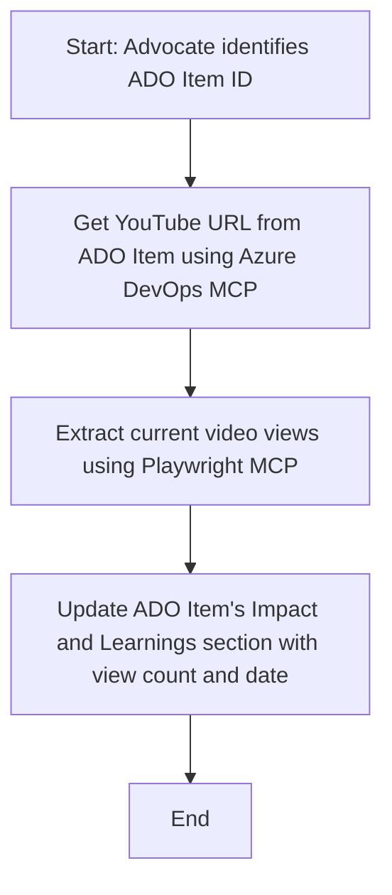

<!--
CO_OP_TRANSLATOR_METADATA:
{
  "original_hash": "14a2dfbea55ef735660a06bd6bdfe5f3",
  "translation_date": "2025-06-13T21:33:57+00:00",
  "source_file": "09-CaseStudy/UpdateADOItemsFromYT.md",
  "language_code": "pa"
}
-->
# ਕੇਸ ਸਟਡੀ: MCP ਨਾਲ YouTube ਡੇਟਾ ਤੋਂ Azure DevOps ਆਈਟਮਾਂ ਨੂੰ ਅੱਪਡੇਟ ਕਰਨਾ

> **ਇਨਕਾਰ:** ਮੌਜੂਦਾ ਵਿੱਚ ਕੁਝ ਆਨਲਾਈਨ ਟੂਲ ਅਤੇ ਰਿਪੋਰਟਾਂ ਹਨ ਜੋ YouTube ਵਰਗੀਆਂ ਪਲੇਟਫਾਰਮਾਂ ਤੋਂ ਡੇਟਾ ਲੈ ਕੇ Azure DevOps ਆਈਟਮਾਂ ਨੂੰ ਆਪਣੇ ਆਪ ਅੱਪਡੇਟ ਕਰ ਸਕਦੀਆਂ ਹਨ। ਹੇਠਾਂ ਦਿੱਤਾ ਗਿਆ ਸਿਨਾਰੀਓ ਸਿਰਫ਼ ਇੱਕ ਉਦਾਹਰਨ ਵਜੋਂ ਦਿੱਤਾ ਗਿਆ ਹੈ ਕਿ ਕਿਵੇਂ MCP ਟੂਲਾਂ ਨੂੰ ਆਟੋਮੇਸ਼ਨ ਅਤੇ ਇੰਟੀਗ੍ਰੇਸ਼ਨ ਕੰਮਾਂ ਲਈ ਵਰਤਿਆ ਜਾ ਸਕਦਾ ਹੈ।

## ਓਵਰਵਿਊ

ਇਹ ਕੇਸ ਸਟਡੀ ਦਿਖਾਉਂਦੀ ਹੈ ਕਿ Model Context Protocol (MCP) ਅਤੇ ਇਸਦੇ ਟੂਲਾਂ ਨੂੰ ਕਿਵੇਂ ਵਰਤ ਕੇ Azure DevOps (ADO) ਦੇ ਵਰਕ ਆਈਟਮਾਂ ਨੂੰ ਆਨਲਾਈਨ ਪਲੇਟਫਾਰਮਾਂ, ਜਿਵੇਂ ਕਿ YouTube, ਤੋਂ ਮਿਲਣ ਵਾਲੀ ਜਾਣਕਾਰੀ ਨਾਲ ਆਪਣੇ ਆਪ ਅੱਪਡੇਟ ਕੀਤਾ ਜਾ ਸਕਦਾ ਹੈ। ਦਿੱਤਾ ਗਿਆ ਸਿਨਾਰੀਓ MCP ਟੂਲਾਂ ਦੀਆਂ ਵਿਆਪਕ ਸਮਰੱਥਾਵਾਂ ਵਿੱਚੋਂ ਇੱਕ ਉਦਾਹਰਨ ਹੈ, ਜਿਹੜੀਆਂ ਬਹੁਤ ਸਾਰੇ ਸਮਾਨ ਆਟੋਮੇਸ਼ਨ ਲੋੜਾਂ ਲਈ ਅਨੁਕੂਲ ਕੀਤੀਆਂ ਜਾ ਸਕਦੀਆਂ ਹਨ।

ਇਸ ਉਦਾਹਰਨ ਵਿੱਚ, ਇੱਕ Advocate ADO ਆਈਟਮਾਂ ਰਾਹੀਂ ਆਨਲਾਈਨ ਸੈਸ਼ਨਾਂ ਦਾ ਟਰੈਕ ਰੱਖਦਾ ਹੈ, ਜਿੱਥੇ ਹਰ ਆਈਟਮ ਵਿੱਚ YouTube ਵੀਡੀਓ URL ਸ਼ਾਮਲ ਹੁੰਦਾ ਹੈ। MCP ਟੂਲਾਂ ਦੀ ਵਰਤੋਂ ਕਰਕੇ, Advocate ADO ਆਈਟਮਾਂ ਨੂੰ ਤਾਜ਼ਾ ਵੀਡੀਓ ਮੈਟ੍ਰਿਕਸ, ਜਿਵੇਂ ਕਿ ਵਿਊ ਕਾਊਂਟ, ਨਾਲ ਆਪਣੇ ਆਪ ਅਪਡੇਟ ਕਰ ਸਕਦਾ ਹੈ। ਇਹ ਤਰੀਕਾ ਹੋਰ ਉਹਨਾਂ ਮਾਮਲਿਆਂ ਲਈ ਵੀ ਵਰਤਿਆ ਜਾ ਸਕਦਾ ਹੈ ਜਿੱਥੇ ਆਨਲਾਈਨ ਸਰੋਤਾਂ ਤੋਂ ਜਾਣਕਾਰੀ ADO ਜਾਂ ਹੋਰ ਸਿਸਟਮਾਂ ਵਿੱਚ ਜੋੜਨੀ ਹੋਵੇ।

## ਸਿਨਾਰੀਓ

ਇੱਕ Advocate ਆਨਲਾਈਨ ਸੈਸ਼ਨਾਂ ਅਤੇ ਕਮਿਊਨਿਟੀ ਇੰਗੇਜਮੈਂਟਸ ਦੇ ਪ੍ਰਭਾਵ ਦਾ ਟਰੈਕ ਰੱਖਣ ਲਈ ਜ਼ਿੰਮੇਵਾਰ ਹੈ। ਹਰ ਸੈਸ਼ਨ ਨੂੰ 'DevRel' ਪ੍ਰੋਜੈਕਟ ਵਿੱਚ ਇੱਕ ADO ਵਰਕ ਆਈਟਮ ਵਜੋਂ ਲੌਗ ਕੀਤਾ ਜਾਂਦਾ ਹੈ, ਅਤੇ ਉਸ ਆਈਟਮ ਵਿੱਚ YouTube ਵੀਡੀਓ URL ਲਈ ਇੱਕ ਫੀਲਡ ਹੁੰਦੀ ਹੈ। ਸੈਸ਼ਨ ਦੀ ਪਹੁੰਚ ਨੂੰ ਸਹੀ ਤਰ੍ਹਾਂ ਰਿਪੋਰਟ ਕਰਨ ਲਈ, Advocate ਨੂੰ ADO ਆਈਟਮ ਨੂੰ ਮੌਜੂਦਾ ਵੀਡੀਓ ਵਿਊਜ਼ ਦੀ ਗਿਣਤੀ ਅਤੇ ਇਸ ਜਾਣਕਾਰੀ ਨੂੰ ਪ੍ਰਾਪਤ ਕਰਨ ਦੀ ਤਾਰੀਖ ਨਾਲ ਅੱਪਡੇਟ ਕਰਨਾ ਪੈਂਦਾ ਹੈ।

## ਵਰਤੇ ਗਏ ਟੂਲ

- [Azure DevOps MCP](https://github.com/microsoft/azure-devops-mcp): MCP ਰਾਹੀਂ ADO ਵਰਕ ਆਈਟਮਾਂ ਤੱਕ ਪ੍ਰੋਗਰਾਮੈਟਿਕ ਪਹੁੰਚ ਅਤੇ ਅੱਪਡੇਟ ਮੁਹੱਈਆ ਕਰਦਾ ਹੈ।
- [Playwright MCP](https://github.com/microsoft/playwright-mcp): ਬ੍ਰਾਊਜ਼ਰ ਕਾਰਵਾਈਆਂ ਨੂੰ ਆਟੋਮੇਟ ਕਰਦਾ ਹੈ ਤਾਂ ਜੋ ਵੈੱਬ ਪੇਜਾਂ, ਜਿਵੇਂ ਕਿ YouTube ਵੀਡੀਓ ਸਟੈਟਿਸਟਿਕਸ, ਤੋਂ ਲਾਈਵ ਡੇਟਾ ਪ੍ਰਾਪਤ ਕੀਤਾ ਜਾ ਸਕੇ।

## ਕਦਮ ਦਰ ਕਦਮ ਵਰਕਫਲੋ

1. **ADO ਆਈਟਮ ਦੀ ਪਹਿਚਾਣ ਕਰੋ**: 'DevRel' ਪ੍ਰੋਜੈਕਟ ਵਿੱਚ ADO ਵਰਕ ਆਈਟਮ ID (ਜਿਵੇਂ 1234) ਨਾਲ ਸ਼ੁਰੂ ਕਰੋ।
2. **YouTube URL ਪ੍ਰਾਪਤ ਕਰੋ**: Azure DevOps MCP ਟੂਲ ਦੀ ਵਰਤੋਂ ਕਰਕੇ ਵਰਕ ਆਈਟਮ ਤੋਂ YouTube URL ਲਓ।
3. **ਵੀਡੀਓ ਵਿਊਜ਼ ਕੱਡੋ**: Playwright MCP ਟੂਲ ਦੀ ਵਰਤੋਂ ਕਰਕੇ YouTube URL 'ਤੇ ਜਾਓ ਅਤੇ ਮੌਜੂਦਾ ਵਿਊ ਕਾਊਂਟ ਪ੍ਰਾਪਤ ਕਰੋ।
4. **ADO ਆਈਟਮ ਅੱਪਡੇਟ ਕਰੋ**: Azure DevOps MCP ਟੂਲ ਦੀ ਵਰਤੋਂ ਕਰਕੇ 'Impact and Learnings' ਸੈਕਸ਼ਨ ਵਿੱਚ ਤਾਜ਼ਾ ਵਿਊ ਕਾਊਂਟ ਅਤੇ ਪ੍ਰਾਪਤੀ ਦੀ ਤਾਰੀਖ ਲਿਖੋ।

## ਉਦਾਹਰਨ ਪ੍ਰਾਂਪਟ

```bash
- Work with the ADO Item ID: 1234
- The project is '2025-Awesome'
- Get the YouTube URL for the ADO item
- Use Playwright to get the current views from the YouTube video
- Update the ADO item with the current video views and the updated date of the information
```

## Mermaid ਫਲੋਚਾਰਟ



## ਤਕਨੀਕੀ ਲਾਗੂ

- **MCP ਓਰਕੇਸਟ੍ਰੇਸ਼ਨ**: ਵਰਕਫਲੋ ਨੂੰ ਇੱਕ MCP ਸਰਵਰ ਦੁਆਰਾ ਸੰਚਾਲਿਤ ਕੀਤਾ ਜਾਂਦਾ ਹੈ, ਜੋ Azure DevOps MCP ਅਤੇ Playwright MCP ਟੂਲਾਂ ਦੀ ਵਰਤੋਂ ਨੂੰ ਸਮਨਵਯਿਤ ਕਰਦਾ ਹੈ।
- **ਆਟੋਮੇਸ਼ਨ**: ਇਸ ਪ੍ਰਕਿਰਿਆ ਨੂੰ ਮੈਨੂਅਲ ਤੌਰ 'ਤੇ ਚਲਾਇਆ ਜਾ ਸਕਦਾ ਹੈ ਜਾਂ ਨਿਯਮਿਤ ਸਮੇਂ 'ਤੇ ਚਲਾਉਣ ਲਈ ਸ਼ਡਿਊਲ ਕੀਤਾ ਜਾ ਸਕਦਾ ਹੈ ਤਾਂ ਜੋ ADO ਆਈਟਮ ਅੱਪਡੇਟ ਰਹਿਣ।
- **ਵਿਸਤਾਰਯੋਗਤਾ**: ਇਹੀ ਪੈਟਰਨ ਹੋਰ ਆਨਲਾਈਨ ਮੈਟ੍ਰਿਕਸ (ਜਿਵੇਂ ਲਾਇਕ, ਟਿੱਪਣੀਆਂ) ਜਾਂ ਹੋਰ ਪਲੇਟਫਾਰਮਾਂ ਤੋਂ ਡੇਟਾ ਲਈ ਵੀ ਵਰਤਿਆ ਜਾ ਸਕਦਾ ਹੈ।

## ਨਤੀਜੇ ਅਤੇ ਪ੍ਰਭਾਵ

- **ਕੁਸ਼ਲਤਾ**: Advocate ਲਈ ਵੀਡੀਓ ਮੈਟ੍ਰਿਕਸ ਦੀ ਪ੍ਰਾਪਤੀ ਅਤੇ ਅੱਪਡੇਟ ਕਰਨ ਦਾ ਹੱਥੋਂ ਕੰਮ ਘਟਾਉਂਦਾ ਹੈ।
- **ਸਹੀਤ**: ਯਕੀਨੀ ਬਣਾਉਂਦਾ ਹੈ ਕਿ ADO ਆਈਟਮ ਸਭ ਤੋਂ ਨਵਾਂ ਡੇਟਾ ਦਰਸਾਉਂਦੇ ਹਨ ਜੋ ਆਨਲਾਈਨ ਸਰੋਤਾਂ ਤੋਂ ਮਿਲਦਾ ਹੈ।
- **ਦੋਹਰਾਏ ਜਾਣ ਯੋਗਤਾ**: ਹੋਰ ਸਮਾਨ ਸਿਨਾਰਿਆਂ ਲਈ ਵਰਤਣ ਯੋਗ ਵਰਕਫਲੋ ਪ੍ਰਦਾਨ ਕਰਦਾ ਹੈ, ਜਿੱਥੇ ਹੋਰ ਡੇਟਾ ਸਰੋਤ ਜਾਂ ਮੈਟ੍ਰਿਕਸ ਸ਼ਾਮਲ ਹਨ।

## ਸੰਦਰਭ

- [Azure DevOps MCP](https://github.com/microsoft/azure-devops-mcp)
- [Playwright MCP](https://github.com/microsoft/playwright-mcp)
- [Model Context Protocol (MCP)](https://modelcontextprotocol.io/)

**ਅਸਵੀਕਾਰੋਪੱਤਰ**:  
ਇਹ ਦਸਤਾਵੇਜ਼ AI ਅਨੁਵਾਦ ਸੇਵਾ [Co-op Translator](https://github.com/Azure/co-op-translator) ਦੀ ਵਰਤੋਂ ਨਾਲ ਅਨੁਵਾਦ ਕੀਤਾ ਗਿਆ ਹੈ। ਜਦੋਂ ਕਿ ਅਸੀਂ ਸਹੀਤਾ ਲਈ ਯਤਨ ਕਰਦੇ ਹਾਂ, ਕਿਰਪਾ ਕਰਕੇ ਧਿਆਨ ਰੱਖੋ ਕਿ ਸਵੈਚਾਲਿਤ ਅਨੁਵਾਦਾਂ ਵਿੱਚ ਗਲਤੀਆਂ ਜਾਂ ਅਸਥਿਰਤਾਵਾਂ ਹੋ ਸਕਦੀਆਂ ਹਨ। ਮੂਲ ਦਸਤਾਵੇਜ਼ ਆਪਣੀ ਮੂਲ ਭਾਸ਼ਾ ਵਿੱਚ ਹੀ ਪ੍ਰਮਾਣਿਕ ਸਰੋਤ ਮੰਨਿਆ ਜਾਣਾ ਚਾਹੀਦਾ ਹੈ। ਜਰੂਰੀ ਜਾਣਕਾਰੀ ਲਈ, ਪੇਸ਼ੇਵਰ ਮਨੁੱਖੀ ਅਨੁਵਾਦ ਦੀ ਸਿਫਾਰਸ਼ ਕੀਤੀ ਜਾਂਦੀ ਹੈ। ਅਸੀਂ ਇਸ ਅਨੁਵਾਦ ਦੇ ਉਪਯੋਗ ਤੋਂ ਉਤਪੰਨ ਕਿਸੇ ਵੀ ਗਲਤਫਹਿਮੀ ਜਾਂ ਭ੍ਰਮ ਲਈ ਜ਼ਿੰਮੇਵਾਰ ਨਹੀਂ ਹਾਂ।