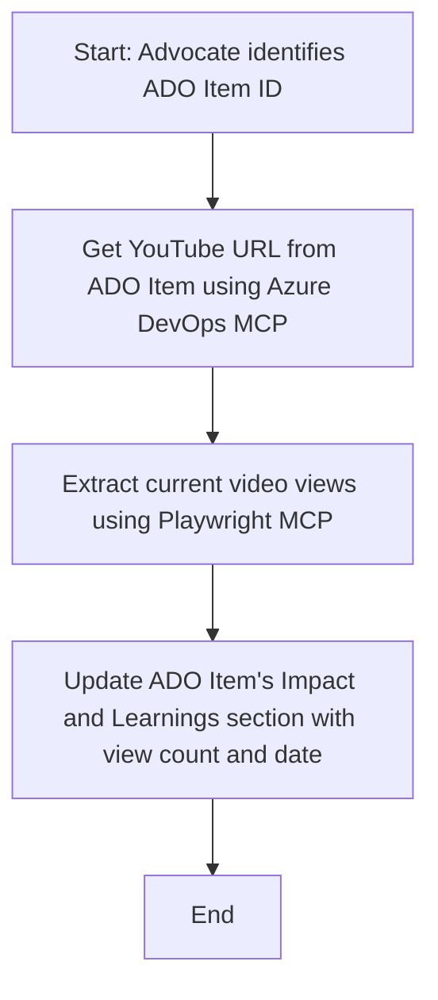

<!--
CO_OP_TRANSLATOR_METADATA:
{
  "original_hash": "14a2dfbea55ef735660a06bd6bdfe5f3",
  "translation_date": "2025-07-14T06:11:13+00:00",
  "source_file": "09-CaseStudy/UpdateADOItemsFromYT.md",
  "language_code": "pa"
}
-->
# ਕੇਸ ਅਧਿਐਨ: MCP ਨਾਲ YouTube ਡੇਟਾ ਤੋਂ Azure DevOps ਆਈਟਮਾਂ ਨੂੰ ਅਪਡੇਟ ਕਰਨਾ

> **ਇਨਕਾਰ:** ਪਹਿਲਾਂ ਹੀ ਕੁਝ ਆਨਲਾਈਨ ਟੂਲ ਅਤੇ ਰਿਪੋਰਟਾਂ ਮੌਜੂਦ ਹਨ ਜੋ YouTube ਵਰਗੀਆਂ ਪਲੇਟਫਾਰਮਾਂ ਤੋਂ ਡੇਟਾ ਲੈ ਕੇ Azure DevOps ਆਈਟਮਾਂ ਨੂੰ ਅਪਡੇਟ ਕਰਨ ਦੀ ਪ੍ਰਕਿਰਿਆ ਨੂੰ ਆਟੋਮੇਟ ਕਰ ਸਕਦੇ ਹਨ। ਹੇਠਾਂ ਦਿੱਤਾ ਗਿਆ ਸਿਨਾਰਿਓ ਸਿਰਫ਼ ਇੱਕ ਉਦਾਹਰਨ ਵਜੋਂ ਦਿੱਤਾ ਗਿਆ ਹੈ ਤਾਂ ਜੋ ਦਿਖਾਇਆ ਜਾ ਸਕੇ ਕਿ MCP ਟੂਲਾਂ ਨੂੰ ਆਟੋਮੇਸ਼ਨ ਅਤੇ ਇੰਟੀਗ੍ਰੇਸ਼ਨ ਕੰਮਾਂ ਲਈ ਕਿਵੇਂ ਵਰਤਿਆ ਜਾ ਸਕਦਾ ਹੈ।

## ਝਲਕ

ਇਹ ਕੇਸ ਅਧਿਐਨ ਦਿਖਾਉਂਦਾ ਹੈ ਕਿ ਮਾਡਲ ਕਾਂਟੈਕਸਟ ਪ੍ਰੋਟੋਕੋਲ (MCP) ਅਤੇ ਇਸਦੇ ਟੂਲਾਂ ਨੂੰ ਕਿਵੇਂ ਵਰਤ ਕੇ Azure DevOps (ADO) ਦੇ ਵਰਕ ਆਈਟਮਾਂ ਨੂੰ ਆਨਲਾਈਨ ਪਲੇਟਫਾਰਮਾਂ, ਜਿਵੇਂ ਕਿ YouTube, ਤੋਂ ਮਿਲਣ ਵਾਲੀ ਜਾਣਕਾਰੀ ਨਾਲ ਅਪਡੇਟ ਕਰਨ ਦੀ ਪ੍ਰਕਿਰਿਆ ਆਟੋਮੇਟ ਕੀਤੀ ਜਾ ਸਕਦੀ ਹੈ। ਦਿੱਤਾ ਗਿਆ ਸਿਨਾਰਿਓ ਸਿਰਫ਼ ਇੱਕ ਉਦਾਹਰਨ ਹੈ ਜੋ ਇਹ ਦਰਸਾਉਂਦਾ ਹੈ ਕਿ ਇਹ ਟੂਲ ਕਿੰਨੇ ਵਿਆਪਕ ਤੌਰ 'ਤੇ ਵਰਤੇ ਜਾ ਸਕਦੇ ਹਨ ਅਤੇ ਕਈ ਹੋਰ ਸਮਾਨ ਆਟੋਮੇਸ਼ਨ ਲੋੜਾਂ ਲਈ ਅਨੁਕੂਲ ਕੀਤੇ ਜਾ ਸਕਦੇ ਹਨ।

ਇਸ ਉਦਾਹਰਨ ਵਿੱਚ, ਇੱਕ Advocate ADO ਆਈਟਮਾਂ ਰਾਹੀਂ ਆਨਲਾਈਨ ਸੈਸ਼ਨਾਂ ਨੂੰ ਟਰੈਕ ਕਰਦਾ ਹੈ, ਜਿੱਥੇ ਹਰ ਆਈਟਮ ਵਿੱਚ YouTube ਵੀਡੀਓ URL ਹੁੰਦਾ ਹੈ। MCP ਟੂਲਾਂ ਦੀ ਮਦਦ ਨਾਲ, Advocate ADO ਆਈਟਮਾਂ ਨੂੰ ਨਵੀਨਤਮ ਵੀਡੀਓ ਮੈਟ੍ਰਿਕਸ, ਜਿਵੇਂ ਕਿ ਵਿਊ ਕਾਊਂਟ, ਨਾਲ ਅਪਡੇਟ ਕਰ ਸਕਦਾ ਹੈ, ਉਹ ਵੀ ਇੱਕ ਦੁਹਰਾਏ ਜਾਣ ਵਾਲੇ ਅਤੇ ਆਟੋਮੇਟਿਕ ਤਰੀਕੇ ਨਾਲ। ਇਹ ਤਰੀਕਾ ਹੋਰ ਵਰਤੋਂ ਦੇ ਕੇਸਾਂ ਲਈ ਵੀ ਲਾਗੂ ਕੀਤਾ ਜਾ ਸਕਦਾ ਹੈ ਜਿੱਥੇ ਆਨਲਾਈਨ ਸਰੋਤਾਂ ਤੋਂ ਜਾਣਕਾਰੀ ADO ਜਾਂ ਹੋਰ ਸਿਸਟਮਾਂ ਵਿੱਚ ਸ਼ਾਮਲ ਕਰਨੀ ਹੋਵੇ।

## ਸਿਨਾਰਿਓ

ਇੱਕ Advocate ਆਨਲਾਈਨ ਸੈਸ਼ਨਾਂ ਅਤੇ ਕਮਿਊਨਿਟੀ ਐਂਗੇਜਮੈਂਟਸ ਦੇ ਪ੍ਰਭਾਵ ਨੂੰ ਟਰੈਕ ਕਰਨ ਦਾ ਜ਼ਿੰਮੇਵਾਰ ਹੈ। ਹਰ ਸੈਸ਼ਨ ਨੂੰ 'DevRel' ਪ੍ਰੋਜੈਕਟ ਵਿੱਚ ਇੱਕ ADO ਵਰਕ ਆਈਟਮ ਵਜੋਂ ਲੌਗ ਕੀਤਾ ਜਾਂਦਾ ਹੈ, ਜਿਸ ਵਿੱਚ YouTube ਵੀਡੀਓ URL ਲਈ ਇੱਕ ਫੀਲਡ ਹੁੰਦੀ ਹੈ। ਸੈਸ਼ਨ ਦੀ ਪਹੁੰਚ ਦੀ ਸਹੀ ਰਿਪੋਰਟਿੰਗ ਲਈ, Advocate ਨੂੰ ADO ਆਈਟਮ ਨੂੰ ਮੌਜੂਦਾ ਵੀਡੀਓ ਵਿਊਜ਼ ਦੀ ਗਿਣਤੀ ਅਤੇ ਇਸ ਜਾਣਕਾਰੀ ਨੂੰ ਪ੍ਰਾਪਤ ਕਰਨ ਦੀ ਤਾਰੀਖ ਨਾਲ ਅਪਡੇਟ ਕਰਨਾ ਪੈਂਦਾ ਹੈ।

## ਵਰਤੇ ਗਏ ਟੂਲ

- [Azure DevOps MCP](https://github.com/microsoft/azure-devops-mcp): MCP ਰਾਹੀਂ ADO ਵਰਕ ਆਈਟਮਾਂ ਤੱਕ ਪ੍ਰੋਗਰਾਮੈਟਿਕ ਪਹੁੰਚ ਅਤੇ ਅਪਡੇਟ ਕਰਨ ਦੀ ਸਹੂਲਤ ਦਿੰਦਾ ਹੈ।
- [Playwright MCP](https://github.com/microsoft/playwright-mcp): ਬ੍ਰਾਊਜ਼ਰ ਕਾਰਵਾਈਆਂ ਨੂੰ ਆਟੋਮੇਟ ਕਰਦਾ ਹੈ ਤਾਂ ਜੋ ਵੈੱਬ ਪੰਨਿਆਂ ਤੋਂ ਜਿਵੇਂ ਕਿ YouTube ਵੀਡੀਓ ਸਟੈਟਿਸਟਿਕਸ, ਲਾਈਵ ਡੇਟਾ ਪ੍ਰਾਪਤ ਕੀਤਾ ਜਾ ਸਕੇ।

## ਕਦਮ-ਦਰ-ਕਦਮ ਵਰਕਫਲੋ

1. **ADO ਆਈਟਮ ਦੀ ਪਹਚਾਣ ਕਰੋ**: 'DevRel' ਪ੍ਰੋਜੈਕਟ ਵਿੱਚ ADO ਵਰਕ ਆਈਟਮ ID (ਜਿਵੇਂ 1234) ਨਾਲ ਸ਼ੁਰੂ ਕਰੋ।
2. **YouTube URL ਪ੍ਰਾਪਤ ਕਰੋ**: Azure DevOps MCP ਟੂਲ ਦੀ ਵਰਤੋਂ ਕਰਕੇ ਵਰਕ ਆਈਟਮ ਤੋਂ YouTube URL ਲਵੋ।
3. **ਵੀਡੀਓ ਵਿਊਜ਼ ਨਿਕਾਲੋ**: Playwright MCP ਟੂਲ ਦੀ ਵਰਤੋਂ ਕਰਕੇ YouTube URL 'ਤੇ ਜਾਓ ਅਤੇ ਮੌਜੂਦਾ ਵਿਊ ਕਾਊਂਟ ਪ੍ਰਾਪਤ ਕਰੋ।
4. **ADO ਆਈਟਮ ਅਪਡੇਟ ਕਰੋ**: Azure DevOps MCP ਟੂਲ ਦੀ ਮਦਦ ਨਾਲ 'Impact and Learnings' ਸੈਕਸ਼ਨ ਵਿੱਚ ਨਵਾਂ ਵਿਊ ਕਾਊਂਟ ਅਤੇ ਜਾਣਕਾਰੀ ਪ੍ਰਾਪਤ ਕਰਨ ਦੀ ਤਾਰੀਖ ਲਿਖੋ।

## ਉਦਾਹਰਨ ਪ੍ਰਾਂਪਟ

```bash
- Work with the ADO Item ID: 1234
- The project is '2025-Awesome'
- Get the YouTube URL for the ADO item
- Use Playwright to get the current views from the YouTube video
- Update the ADO item with the current video views and the updated date of the information
```

## Mermaid ਫਲੋਚਾਰਟ



## ਤਕਨੀਕੀ ਲਾਗੂ ਕਰਨ ਦਾ ਤਰੀਕਾ

- **MCP ਆਰਕੇਸਟ੍ਰੇਸ਼ਨ**: ਵਰਕਫਲੋ ਨੂੰ ਇੱਕ MCP ਸਰਵਰ ਦੁਆਰਾ ਆਰਕੇਸਟ੍ਰੇਟ ਕੀਤਾ ਜਾਂਦਾ ਹੈ, ਜੋ Azure DevOps MCP ਅਤੇ Playwright MCP ਦੋਹਾਂ ਟੂਲਾਂ ਦੀ ਵਰਤੋਂ ਨੂੰ ਸਹਮਤ ਕਰਦਾ ਹੈ।
- **ਆਟੋਮੇਸ਼ਨ**: ਇਹ ਪ੍ਰਕਿਰਿਆ ਹੱਥੋਂ ਚਲਾਈ ਜਾ ਸਕਦੀ ਹੈ ਜਾਂ ਨਿਯਮਤ ਅੰਤਰਾਲਾਂ 'ਤੇ ਚਲਾਉਣ ਲਈ ਸ਼ਡਿਊਲ ਕੀਤੀ ਜਾ ਸਕਦੀ ਹੈ ਤਾਂ ਜੋ ADO ਆਈਟਮ ਹਮੇਸ਼ਾ ਅਪਡੇਟ ਰਹਿਣ।
- **ਵਿਸਤਾਰਯੋਗਤਾ**: ਇਹੀ ਪੈਟਰਨ ਹੋਰ ਆਨਲਾਈਨ ਮੈਟ੍ਰਿਕਸ (ਜਿਵੇਂ ਕਿ ਲਾਈਕ, ਟਿੱਪਣੀਆਂ) ਜਾਂ ਹੋਰ ਪਲੇਟਫਾਰਮਾਂ ਤੋਂ ਡੇਟਾ ਲੈ ਕੇ ADO ਆਈਟਮਾਂ ਨੂੰ ਅਪਡੇਟ ਕਰਨ ਲਈ ਵੀ ਵਰਤਿਆ ਜਾ ਸਕਦਾ ਹੈ।

## ਨਤੀਜੇ ਅਤੇ ਪ੍ਰਭਾਵ

- **ਕੁਸ਼ਲਤਾ**: Advocate ਲਈ ਵੀਡੀਓ ਮੈਟ੍ਰਿਕਸ ਪ੍ਰਾਪਤ ਕਰਨ ਅਤੇ ਅਪਡੇਟ ਕਰਨ ਦਾ ਹੱਥੋਂ ਕੰਮ ਘਟਾਉਂਦਾ ਹੈ।
- **ਸਹੀਤਾ**: ਯਕੀਨੀ ਬਣਾਉਂਦਾ ਹੈ ਕਿ ADO ਆਈਟਮ ਸਭ ਤੋਂ ਨਵੀਂ ਡੇਟਾ ਨਾਲ ਅਪਡੇਟ ਰਹਿੰਦੇ ਹਨ ਜੋ ਆਨਲਾਈਨ ਸਰੋਤਾਂ ਤੋਂ ਮਿਲਦੀ ਹੈ।
- **ਦੁਹਰਾਏ ਜਾਣ ਯੋਗਤਾ**: ਸਮਾਨ ਸਿਨਾਰਿਓਜ਼ ਲਈ ਦੁਬਾਰਾ ਵਰਤਣ ਯੋਗ ਵਰਕਫਲੋ ਪ੍ਰਦਾਨ ਕਰਦਾ ਹੈ ਜੋ ਹੋਰ ਡੇਟਾ ਸਰੋਤਾਂ ਜਾਂ ਮੈਟ੍ਰਿਕਸ ਨਾਲ ਸੰਬੰਧਿਤ ਹੋ ਸਕਦੇ ਹਨ।

## ਸੰਦਰਭ

- [Azure DevOps MCP](https://github.com/microsoft/azure-devops-mcp)
- [Playwright MCP](https://github.com/microsoft/playwright-mcp)
- [Model Context Protocol (MCP)](https://modelcontextprotocol.io/)

**ਅਸਵੀਕਾਰੋਪਣ**:  
ਇਹ ਦਸਤਾਵੇਜ਼ AI ਅਨੁਵਾਦ ਸੇਵਾ [Co-op Translator](https://github.com/Azure/co-op-translator) ਦੀ ਵਰਤੋਂ ਕਰਕੇ ਅਨੁਵਾਦਿਤ ਕੀਤਾ ਗਿਆ ਹੈ। ਜਦੋਂ ਕਿ ਅਸੀਂ ਸਹੀਤਾ ਲਈ ਕੋਸ਼ਿਸ਼ ਕਰਦੇ ਹਾਂ, ਕਿਰਪਾ ਕਰਕੇ ਧਿਆਨ ਰੱਖੋ ਕਿ ਸਵੈਚਾਲਿਤ ਅਨੁਵਾਦਾਂ ਵਿੱਚ ਗਲਤੀਆਂ ਜਾਂ ਅਸਮਰਥਤਾਵਾਂ ਹੋ ਸਕਦੀਆਂ ਹਨ। ਮੂਲ ਦਸਤਾਵੇਜ਼ ਆਪਣੀ ਮੂਲ ਭਾਸ਼ਾ ਵਿੱਚ ਪ੍ਰਮਾਣਿਕ ਸਰੋਤ ਮੰਨਿਆ ਜਾਣਾ ਚਾਹੀਦਾ ਹੈ। ਮਹੱਤਵਪੂਰਨ ਜਾਣਕਾਰੀ ਲਈ, ਪੇਸ਼ੇਵਰ ਮਨੁੱਖੀ ਅਨੁਵਾਦ ਦੀ ਸਿਫਾਰਸ਼ ਕੀਤੀ ਜਾਂਦੀ ਹੈ। ਅਸੀਂ ਇਸ ਅਨੁਵਾਦ ਦੀ ਵਰਤੋਂ ਤੋਂ ਉਤਪੰਨ ਕਿਸੇ ਵੀ ਗਲਤਫਹਿਮੀ ਜਾਂ ਗਲਤ ਵਿਆਖਿਆ ਲਈ ਜ਼ਿੰਮੇਵਾਰ ਨਹੀਂ ਹਾਂ।