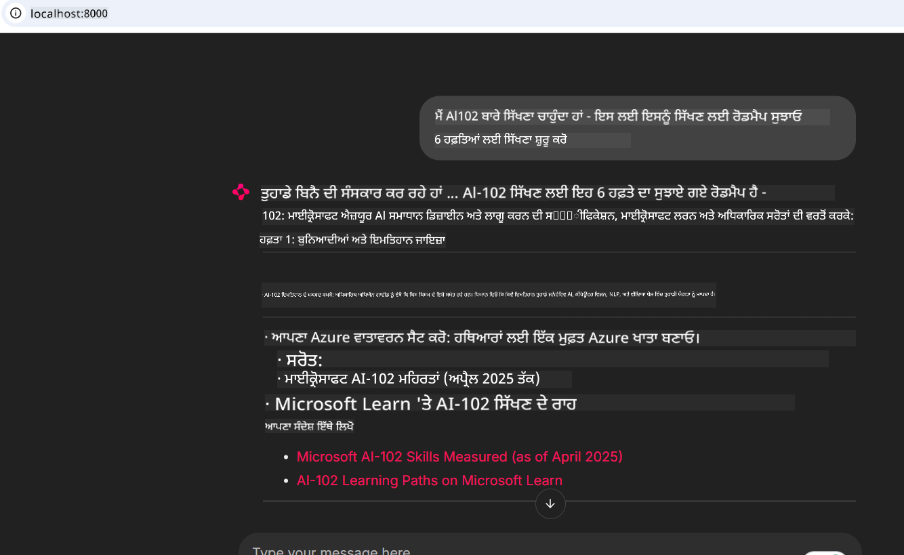
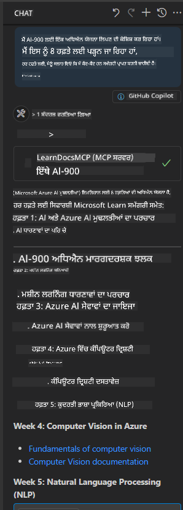

<!--
CO_OP_TRANSLATOR_METADATA:
{
  "original_hash": "4319d291c9d124ecafea52b3d04bfa0e",
  "translation_date": "2025-07-14T06:22:00+00:00",
  "source_file": "09-CaseStudy/docs-mcp/README.md",
  "language_code": "pa"
}
-->
# ਕੇਸ ਅਧਿਐਨ: ਕਲਾਇੰਟ ਤੋਂ Microsoft Learn Docs MCP ਸਰਵਰ ਨਾਲ ਕਨੈਕਟ ਕਰਨਾ

ਕੀ ਤੁਸੀਂ ਕਦੇ ਆਪਣੇ ਕੋਡ ਵਿੱਚ ਸਮੱਸਿਆ ਹੱਲ ਕਰਨ ਦੌਰਾਨ ਦਸਤਾਵੇਜ਼ੀ ਸਾਈਟਾਂ, Stack Overflow ਅਤੇ ਬੇਅੰਤ ਖੋਜ ਇੰਜਣ ਟੈਬਾਂ ਦੇ ਵਿਚਕਾਰ ਜੁਗਲਿੰਗ ਕਰਦੇ ਹੋਏ ਫਸੇ ਹੋ? ਸ਼ਾਇਦ ਤੁਸੀਂ ਦਸਤਾਵੇਜ਼ਾਂ ਲਈ ਦੂਜਾ ਮਾਨੀਟਰ ਰੱਖਦੇ ਹੋ, ਜਾਂ ਆਪਣੇ IDE ਅਤੇ ਬ੍ਰਾਊਜ਼ਰ ਵਿਚਕਾਰ ਲਗਾਤਾਰ alt-tab ਕਰਦੇ ਹੋ। ਕੀ ਇਹ ਵਧੀਆ ਨਹੀਂ ਹੋਵੇਗਾ ਜੇ ਤੁਸੀਂ ਦਸਤਾਵੇਜ਼ੀ ਸਿੱਧਾ ਆਪਣੇ ਵਰਕਫਲੋ ਵਿੱਚ ਲਿਆ ਸਕੋ—ਆਪਣੀਆਂ ਐਪਸ, IDE ਜਾਂ ਆਪਣੇ ਖਾਸ ਟੂਲਾਂ ਵਿੱਚ ਇੰਟੀਗ੍ਰੇਟ ਕਰਕੇ? ਇਸ ਕੇਸ ਅਧਿਐਨ ਵਿੱਚ, ਅਸੀਂ ਵੇਖਾਂਗੇ ਕਿ ਕਿਵੇਂ ਆਪਣੇ ਕਲਾਇੰਟ ਐਪਲੀਕੇਸ਼ਨ ਤੋਂ ਸਿੱਧਾ Microsoft Learn Docs MCP ਸਰਵਰ ਨਾਲ ਕਨੈਕਟ ਕਰਨਾ ਹੈ।

## ਓਵਰਵਿਊ

ਆਧੁਨਿਕ ਵਿਕਾਸ ਸਿਰਫ ਕੋਡ ਲਿਖਣ ਤੱਕ ਸੀਮਿਤ ਨਹੀਂ ਹੈ—ਇਹ ਸਹੀ ਸਮੇਂ ਸਹੀ ਜਾਣਕਾਰੀ ਲੱਭਣ ਬਾਰੇ ਹੈ। ਦਸਤਾਵੇਜ਼ੀ ਹਰ ਜਗ੍ਹਾ ਹੈ, ਪਰ ਇਹ ਅਕਸਰ ਓਥੇ ਨਹੀਂ ਹੁੰਦੀ ਜਿੱਥੇ ਤੁਹਾਨੂੰ ਸਭ ਤੋਂ ਜ਼ਿਆਦਾ ਲੋੜ ਹੁੰਦੀ ਹੈ: ਤੁਹਾਡੇ ਟੂਲਾਂ ਅਤੇ ਵਰਕਫਲੋ ਵਿੱਚ। ਦਸਤਾਵੇਜ਼ੀ ਪ੍ਰਾਪਤੀ ਨੂੰ ਸਿੱਧਾ ਆਪਣੇ ਐਪਲੀਕੇਸ਼ਨਾਂ ਵਿੱਚ ਇੰਟੀਗ੍ਰੇਟ ਕਰਕੇ, ਤੁਸੀਂ ਸਮਾਂ ਬਚਾ ਸਕਦੇ ਹੋ, ਸੰਦਰਭ ਬਦਲਣ ਤੋਂ ਬਚ ਸਕਦੇ ਹੋ ਅਤੇ ਉਤਪਾਦਕਤਾ ਵਧਾ ਸਕਦੇ ਹੋ। ਇਸ ਭਾਗ ਵਿੱਚ, ਅਸੀਂ ਤੁਹਾਨੂੰ ਦਿਖਾਵਾਂਗੇ ਕਿ ਕਿਵੇਂ ਇੱਕ ਕਲਾਇੰਟ ਨੂੰ Microsoft Learn Docs MCP ਸਰਵਰ ਨਾਲ ਕਨੈਕਟ ਕਰਨਾ ਹੈ, ਤਾਂ ਜੋ ਤੁਸੀਂ ਆਪਣੀ ਐਪ ਛੱਡੇ ਬਿਨਾਂ ਰੀਅਲ-ਟਾਈਮ, ਸੰਦਰਭ-ਸੂਚਿਤ ਦਸਤਾਵੇਜ਼ੀ ਪ੍ਰਾਪਤ ਕਰ ਸਕੋ।

ਅਸੀਂ ਕਨੈਕਸ਼ਨ ਸਥਾਪਿਤ ਕਰਨ, ਬੇਨਤੀ ਭੇਜਣ ਅਤੇ ਸਟ੍ਰੀਮਿੰਗ ਜਵਾਬਾਂ ਨੂੰ ਪ੍ਰਭਾਵਸ਼ਾਲੀ ਢੰਗ ਨਾਲ ਸੰਭਾਲਣ ਦੀ ਪ੍ਰਕਿਰਿਆ ਵਿੱਚੋਂ ਗੁਜ਼ਰਾਂਗੇ। ਇਹ ਤਰੀਕਾ ਤੁਹਾਡੇ ਵਰਕਫਲੋ ਨੂੰ ਸਧਾਰਨ ਬਣਾਉਂਦਾ ਹੈ ਅਤੇ ਸਮਾਰਟ, ਮਦਦਗਾਰ ਡਿਵੈਲਪਰ ਟੂਲ ਬਣਾਉਣ ਦੇ ਦਰਵਾਜ਼ੇ ਖੋਲ੍ਹਦਾ ਹੈ।

## ਸਿੱਖਣ ਦੇ ਉਦੇਸ਼

ਅਸੀਂ ਇਹ ਕਿਉਂ ਕਰ ਰਹੇ ਹਾਂ? ਕਿਉਂਕਿ ਸਭ ਤੋਂ ਵਧੀਆ ਡਿਵੈਲਪਰ ਅਨੁਭਵ ਉਹ ਹੁੰਦੇ ਹਨ ਜੋ ਰੁਕਾਵਟਾਂ ਨੂੰ ਦੂਰ ਕਰਦੇ ਹਨ। ਸੋਚੋ ਇੱਕ ਐਸਾ ਸੰਸਾਰ ਜਿੱਥੇ ਤੁਹਾਡਾ ਕੋਡ ਐਡੀਟਰ, ਚੈਟਬੋਟ ਜਾਂ ਵੈੱਬ ਐਪ ਤੁਹਾਡੇ ਦਸਤਾਵੇਜ਼ੀ ਸਵਾਲਾਂ ਦਾ ਤੁਰੰਤ ਜਵਾਬ ਦੇ ਸਕਦਾ ਹੈ, Microsoft Learn ਦੇ ਤਾਜ਼ਾ ਸਮੱਗਰੀ ਦੀ ਵਰਤੋਂ ਕਰਕੇ। ਇਸ ਅਧਿਆਇ ਦੇ ਅੰਤ ਤੱਕ, ਤੁਸੀਂ ਜਾਣੋਗੇ ਕਿ ਕਿਵੇਂ:

- ਦਸਤਾਵੇਜ਼ੀ ਲਈ MCP ਸਰਵਰ-ਕਲਾਇੰਟ ਸੰਚਾਰ ਦੇ ਮੂਲ ਤੱਤ ਸਮਝਣੇ ਹਨ
- Microsoft Learn Docs MCP ਸਰਵਰ ਨਾਲ ਕਨੈਕਟ ਕਰਨ ਲਈ ਕਨਸੋਲ ਜਾਂ ਵੈੱਬ ਐਪਲੀਕੇਸ਼ਨ ਲਾਗੂ ਕਰਨੀ ਹੈ
- ਰੀਅਲ-ਟਾਈਮ ਦਸਤਾਵੇਜ਼ੀ ਪ੍ਰਾਪਤੀ ਲਈ ਸਟ੍ਰੀਮਿੰਗ HTTP ਕਲਾਇੰਟ ਦੀ ਵਰਤੋਂ ਕਰਨੀ ਹੈ
- ਆਪਣੀ ਐਪ ਵਿੱਚ ਦਸਤਾਵੇਜ਼ੀ ਜਵਾਬਾਂ ਨੂੰ ਲੌਗ ਅਤੇ ਵਿਵੇਚਨਾ ਕਰਨੀ ਹੈ

ਤੁਸੀਂ ਵੇਖੋਗੇ ਕਿ ਇਹ ਹੁਨਰ ਤੁਹਾਨੂੰ ਐਸੇ ਟੂਲ ਬਣਾਉਣ ਵਿੱਚ ਮਦਦ ਕਰਦੇ ਹਨ ਜੋ ਸਿਰਫ ਪ੍ਰਤੀਕਿਰਿਆਸ਼ੀਲ ਨਹੀਂ, ਸਗੋਂ ਸੱਚਮੁੱਚ ਇੰਟਰਐਕਟਿਵ ਅਤੇ ਸੰਦਰਭ-ਸੂਚਿਤ ਹੁੰਦੇ ਹਨ।

## ਸਥਿਤੀ 1 - MCP ਨਾਲ ਰੀਅਲ-ਟਾਈਮ ਦਸਤਾਵੇਜ਼ੀ ਪ੍ਰਾਪਤੀ

ਇਸ ਸਥਿਤੀ ਵਿੱਚ, ਅਸੀਂ ਤੁਹਾਨੂੰ ਦਿਖਾਵਾਂਗੇ ਕਿ ਕਿਵੇਂ ਇੱਕ ਕਲਾਇੰਟ ਨੂੰ Microsoft Learn Docs MCP ਸਰਵਰ ਨਾਲ ਕਨੈਕਟ ਕਰਨਾ ਹੈ, ਤਾਂ ਜੋ ਤੁਸੀਂ ਆਪਣੀ ਐਪ ਛੱਡੇ ਬਿਨਾਂ ਰੀਅਲ-ਟਾਈਮ, ਸੰਦਰਭ-ਸੂਚਿਤ ਦਸਤਾਵੇਜ਼ੀ ਪ੍ਰਾਪਤ ਕਰ ਸਕੋ।

ਆਓ ਇਸਨੂੰ ਅਮਲ ਵਿੱਚ ਲਿਆਈਏ। ਤੁਹਾਡਾ ਕੰਮ ਇੱਕ ਐਪ ਲਿਖਣਾ ਹੈ ਜੋ Microsoft Learn Docs MCP ਸਰਵਰ ਨਾਲ ਕਨੈਕਟ ਕਰਦਾ ਹੈ, `microsoft_docs_search` ਟੂਲ ਨੂੰ ਕਾਲ ਕਰਦਾ ਹੈ, ਅਤੇ ਸਟ੍ਰੀਮਿੰਗ ਜਵਾਬ ਨੂੰ ਕਨਸੋਲ 'ਤੇ ਲੌਗ ਕਰਦਾ ਹੈ।

### ਇਹ ਤਰੀਕਾ ਕਿਉਂ?
ਕਿਉਂਕਿ ਇਹ ਵਧੇਰੇ ਉੱਨਤ ਇੰਟੀਗ੍ਰੇਸ਼ਨਾਂ ਲਈ ਬੁਨਿਆਦ ਹੈ—ਚਾਹੇ ਤੁਸੀਂ ਚੈਟਬੋਟ, IDE ਐਕਸਟੈਂਸ਼ਨ ਜਾਂ ਵੈੱਬ ਡੈਸ਼ਬੋਰਡ ਬਣਾਉਣਾ ਚਾਹੁੰਦੇ ਹੋ।

ਤੁਸੀਂ ਇਸ ਸਥਿਤੀ ਲਈ ਕੋਡ ਅਤੇ ਹਦਾਇਤਾਂ ਇਸ ਕੇਸ ਅਧਿਐਨ ਦੇ [`solution`](./solution/README.md) ਫੋਲਡਰ ਵਿੱਚ ਲੱਭੋਗੇ। ਕਦਮ ਤੁਹਾਨੂੰ ਕਨੈਕਸ਼ਨ ਸੈੱਟਅਪ ਕਰਨ ਵਿੱਚ ਮਦਦ ਕਰਨਗੇ:
- ਕਨੈਕਸ਼ਨ ਲਈ ਅਧਿਕਾਰਤ MCP SDK ਅਤੇ ਸਟ੍ਰੀਮ ਕਰਨ ਯੋਗ HTTP ਕਲਾਇੰਟ ਦੀ ਵਰਤੋਂ ਕਰੋ
- ਦਸਤਾਵੇਜ਼ੀ ਪ੍ਰਾਪਤ ਕਰਨ ਲਈ `microsoft_docs_search` ਟੂਲ ਨੂੰ ਕਵੈਰੀ ਪੈਰਾਮੀਟਰ ਨਾਲ ਕਾਲ ਕਰੋ
- ਢੰਗ ਨਾਲ ਲੌਗਿੰਗ ਅਤੇ ਐਰਰ ਹੈਂਡਲਿੰਗ ਲਾਗੂ ਕਰੋ
- ਵਰਤੋਂਕਾਰਾਂ ਨੂੰ ਕਈ ਖੋਜ ਕਵੈਰੀਆਂ ਦਰਜ ਕਰਨ ਦੀ ਆਗਿਆ ਦੇਣ ਲਈ ਇੰਟਰਐਕਟਿਵ ਕਨਸੋਲ ਇੰਟਰਫੇਸ ਬਣਾਓ

ਇਹ ਸਥਿਤੀ ਦਿਖਾਉਂਦੀ ਹੈ ਕਿ ਕਿਵੇਂ:
- Docs MCP ਸਰਵਰ ਨਾਲ ਕਨੈਕਟ ਕਰਨਾ ਹੈ
- ਇੱਕ ਕਵੈਰੀ ਭੇਜਣੀ ਹੈ
- ਨਤੀਜੇ ਪਾਰਸ ਅਤੇ ਪ੍ਰਿੰਟ ਕਰਨੇ ਹਨ

ਇਹ ਰਹੀ ਸਲੂਸ਼ਨ ਚਲਾਉਣ ਦੀ ਇੱਕ ਉਦਾਹਰਨ:

```
Prompt> What is Azure Key Vault?
Answer> Azure Key Vault is a cloud service for securely storing and accessing secrets. ...
```

ਹੇਠਾਂ ਇੱਕ ਘੱਟੋ-ਘੱਟ ਨਮੂਨਾ ਸਲੂਸ਼ਨ ਦਿੱਤਾ ਗਿਆ ਹੈ। ਪੂਰਾ ਕੋਡ ਅਤੇ ਵੇਰਵੇ ਸਲੂਸ਼ਨ ਫੋਲਡਰ ਵਿੱਚ ਉਪਲਬਧ ਹਨ।

<details>
<summary>Python</summary>

```python
import asyncio
from mcp.client.streamable_http import streamablehttp_client
from mcp import ClientSession

async def main():
    async with streamablehttp_client("https://learn.microsoft.com/api/mcp") as (read_stream, write_stream, _):
        async with ClientSession(read_stream, write_stream) as session:
            await session.initialize()
            result = await session.call_tool("microsoft_docs_search", {"query": "Azure Functions best practices"})
            print(result.content)

if __name__ == "__main__":
    asyncio.run(main())
```

- ਪੂਰੀ ਲਾਗੂਆਤ ਅਤੇ ਲੌਗਿੰਗ ਲਈ, [`scenario1.py`](../../../../09-CaseStudy/docs-mcp/solution/python/scenario1.py) ਵੇਖੋ।
- ਇੰਸਟਾਲੇਸ਼ਨ ਅਤੇ ਵਰਤੋਂ ਦੀਆਂ ਹਦਾਇਤਾਂ ਲਈ, ਉਸੇ ਫੋਲਡਰ ਵਿੱਚ [`README.md`](./solution/python/README.md) ਫਾਈਲ ਵੇਖੋ।
</details>

## ਸਥਿਤੀ 2 - MCP ਨਾਲ ਇੰਟਰਐਕਟਿਵ ਅਧਿਐਨ ਯੋਜਨਾ ਜਨਰੇਟਰ ਵੈੱਬ ਐਪ

ਇਸ ਸਥਿਤੀ ਵਿੱਚ, ਤੁਸੀਂ ਸਿੱਖੋਗੇ ਕਿ Docs MCP ਨੂੰ ਵੈੱਬ ਵਿਕਾਸ ਪ੍ਰੋਜੈਕਟ ਵਿੱਚ ਕਿਵੇਂ ਇੰਟੀਗ੍ਰੇਟ ਕਰਨਾ ਹੈ। ਮਕਸਦ ਇਹ ਹੈ ਕਿ ਵਰਤੋਂਕਾਰ Microsoft Learn ਦਸਤਾਵੇਜ਼ੀ ਨੂੰ ਸਿੱਧਾ ਵੈੱਬ ਇੰਟਰਫੇਸ ਤੋਂ ਖੋਜ ਸਕਣ, ਜਿਸ ਨਾਲ ਦਸਤਾਵੇਜ਼ੀ ਤੁਹਾਡੇ ਐਪ ਜਾਂ ਸਾਈਟ ਵਿੱਚ ਤੁਰੰਤ ਪਹੁੰਚਯੋਗ ਬਣ ਜਾਵੇ।

ਤੁਸੀਂ ਵੇਖੋਗੇ ਕਿ ਕਿਵੇਂ:
- ਇੱਕ ਵੈੱਬ ਐਪ ਸੈੱਟਅਪ ਕਰਨਾ ਹੈ
- Docs MCP ਸਰਵਰ ਨਾਲ ਕਨੈਕਟ ਕਰਨਾ ਹੈ
- ਵਰਤੋਂਕਾਰ ਦੀ ਇਨਪੁੱਟ ਸੰਭਾਲਣੀ ਹੈ ਅਤੇ ਨਤੀਜੇ ਦਿਖਾਉਣੇ ਹਨ

ਇਹ ਰਹੀ ਸਲੂਸ਼ਨ ਚਲਾਉਣ ਦੀ ਇੱਕ ਉਦਾਹਰਨ:

```
User> I want to learn about AI102 - so suggest the roadmap to get it started from learn for 6 weeks

Assistant> Here’s a detailed 6-week roadmap to start your preparation for the AI-102: Designing and Implementing a Microsoft Azure AI Solution certification, using official Microsoft resources and focusing on exam skills areas:

---
## Week 1: Introduction & Fundamentals
- **Understand the Exam**: Review the [AI-102 exam skills outline](https://learn.microsoft.com/en-us/credentials/certifications/exams/ai-102/).
- **Set up Azure**: Sign up for a free Azure account if you don't have one.
- **Learning Path**: [Introduction to Azure AI services](https://learn.microsoft.com/en-us/training/modules/intro-to-azure-ai/)
- **Focus**: Get familiar with Azure portal, AI capabilities, and necessary tools.

....more weeks of the roadmap...

Let me know if you want module-specific recommendations or need more customized weekly tasks!
```

ਹੇਠਾਂ ਇੱਕ ਘੱਟੋ-ਘੱਟ ਨਮੂਨਾ ਸਲੂਸ਼ਨ ਦਿੱਤਾ ਗਿਆ ਹੈ। ਪੂਰਾ ਕੋਡ ਅਤੇ ਵੇਰਵੇ ਸਲੂਸ਼ਨ ਫੋਲਡਰ ਵਿੱਚ ਉਪਲਬਧ ਹਨ।



<details>
<summary>Python (Chainlit)</summary>

Chainlit ਗੱਲਬਾਤੀ AI ਵੈੱਬ ਐਪ ਬਣਾਉਣ ਲਈ ਇੱਕ ਫਰੇਮਵਰਕ ਹੈ। ਇਹ ਇੰਟਰਐਕਟਿਵ ਚੈਟਬੋਟ ਅਤੇ ਸਹਾਇਕ ਬਣਾਉਣਾ ਆਸਾਨ ਬਣਾਉਂਦਾ ਹੈ ਜੋ MCP ਟੂਲਾਂ ਨੂੰ ਕਾਲ ਕਰ ਸਕਦੇ ਹਨ ਅਤੇ ਨਤੀਜੇ ਰੀਅਲ-ਟਾਈਮ ਵਿੱਚ ਦਿਖਾ ਸਕਦੇ ਹਨ। ਇਹ ਤੇਜ਼ ਪ੍ਰੋਟੋਟਾਈਪਿੰਗ ਅਤੇ ਵਰਤੋਂਕਾਰ-ਮਿੱਤਰ ਇੰਟਰਫੇਸ ਲਈ ਬਹੁਤ ਵਧੀਆ ਹੈ।

```python
import chainlit as cl
import requests

MCP_URL = "https://learn.microsoft.com/api/mcp"

@cl.on_message
def handle_message(message):
    query = {"question": message}
    response = requests.post(MCP_URL, json=query)
    if response.ok:
        result = response.json()
        cl.Message(content=result.get("answer", "No answer found.")).send()
    else:
        cl.Message(content="Error: " + response.text).send()
```

- ਪੂਰੀ ਲਾਗੂਆਤ ਲਈ, [`scenario2.py`](../../../../09-CaseStudy/docs-mcp/solution/python/scenario2.py) ਵੇਖੋ।
- ਸੈੱਟਅਪ ਅਤੇ ਚਲਾਉਣ ਦੀਆਂ ਹਦਾਇਤਾਂ ਲਈ, [`README.md`](./solution/python/README.md) ਵੇਖੋ।
</details>

## ਸਥਿਤੀ 3: VS Code ਵਿੱਚ MCP ਸਰਵਰ ਨਾਲ ਇਨ-ਐਡੀਟਰ ਦਸਤਾਵੇਜ਼ੀ

ਜੇ ਤੁਸੀਂ Microsoft Learn Docs ਨੂੰ ਸਿੱਧਾ ਆਪਣੇ VS Code ਵਿੱਚ ਪ੍ਰਾਪਤ ਕਰਨਾ ਚਾਹੁੰਦੇ ਹੋ (ਬ੍ਰਾਊਜ਼ਰ ਟੈਬਾਂ ਬਦਲਣ ਦੀ ਥਾਂ), ਤਾਂ ਤੁਸੀਂ ਆਪਣੇ ਐਡੀਟਰ ਵਿੱਚ MCP ਸਰਵਰ ਦੀ ਵਰਤੋਂ ਕਰ ਸਕਦੇ ਹੋ। ਇਸ ਨਾਲ ਤੁਸੀਂ:
- VS Code ਵਿੱਚ ਬਿਨਾਂ ਕੋਡਿੰਗ ਵਾਤਾਵਰਨ ਛੱਡੇ ਦਸਤਾਵੇਜ਼ੀ ਖੋਜ ਅਤੇ ਪੜ੍ਹ ਸਕਦੇ ਹੋ।
- ਦਸਤਾਵੇਜ਼ੀ ਦਾ ਹਵਾਲਾ ਦੇ ਸਕਦੇ ਹੋ ਅਤੇ README ਜਾਂ ਕੋਰਸ ਫਾਈਲਾਂ ਵਿੱਚ ਲਿੰਕ ਸਿੱਧਾ ਸ਼ਾਮਲ ਕਰ ਸਕਦੇ ਹੋ।
- GitHub Copilot ਅਤੇ MCP ਨੂੰ ਮਿਲਾ ਕੇ ਇੱਕ ਬੇਹਤਰੀਨ, AI-ਚਲਿਤ ਦਸਤਾਵੇਜ਼ੀ ਵਰਕਫਲੋ ਦਾ ਲਾਭ ਉਠਾ ਸਕਦੇ ਹੋ।

**ਤੁਸੀਂ ਵੇਖੋਗੇ ਕਿ ਕਿਵੇਂ:**
- ਆਪਣੇ ਵਰਕਸਪੇਸ ਰੂਟ ਵਿੱਚ ਇੱਕ ਵੈਧ `.vscode/mcp.json` ਫਾਈਲ ਸ਼ਾਮਲ ਕਰਨੀ ਹੈ (ਹੇਠਾਂ ਉਦਾਹਰਨ ਵੇਖੋ)।
- MCP ਪੈਨਲ ਖੋਲ੍ਹਣਾ ਜਾਂ VS Code ਵਿੱਚ ਕਮਾਂਡ ਪੈਲੇਟ ਦੀ ਵਰਤੋਂ ਕਰਕੇ ਦਸਤਾਵੇਜ਼ੀ ਖੋਜ ਅਤੇ ਸ਼ਾਮਲ ਕਰਨੀ ਹੈ।
- ਕੰਮ ਕਰਦਿਆਂ ਆਪਣੇ ਮਾਰਕਡਾਊਨ ਫਾਈਲਾਂ ਵਿੱਚ ਸਿੱਧਾ ਦਸਤਾਵੇਜ਼ੀ ਦਾ ਹਵਾਲਾ ਦੇਣਾ।
- ਇਸ ਵਰਕਫਲੋ ਨੂੰ GitHub Copilot ਨਾਲ ਜੋੜ ਕੇ ਹੋਰ ਵਧੀਆ ਉਤਪਾਦਕਤਾ ਪ੍ਰਾਪਤ ਕਰਨੀ।

ਹੇਠਾਂ VS Code ਵਿੱਚ MCP ਸਰਵਰ ਸੈੱਟਅਪ ਕਰਨ ਦੀ ਇੱਕ ਉਦਾਹਰਨ ਹੈ:

```json
{
  "servers": {
    "LearnDocsMCP": {
      "url": "https://learn.microsoft.com/api/mcp"
    }
  }
}
```

</details>

> ਵਿਸਥਾਰਪੂਰਵਕ ਵਾਕਥਰੂ, ਸਕ੍ਰੀਨਸ਼ਾਟ ਅਤੇ ਕਦਮ-ਦਰ-ਕਦਮ ਗਾਈਡ ਲਈ, [`README.md`](./solution/scenario3/README.md) ਵੇਖੋ।



ਇਹ ਤਰੀਕਾ ਕਿਸੇ ਵੀ ਵਿਅਕਤੀ ਲਈ ਬਹੁਤ ਵਧੀਆ ਹੈ ਜੋ ਤਕਨੀਕੀ ਕੋਰਸ ਬਣਾਉਂਦਾ ਹੈ, ਦਸਤਾਵੇਜ਼ੀ ਲਿਖਦਾ ਹੈ ਜਾਂ ਅਕਸਰ ਹਵਾਲਾ ਲੈਣ ਵਾਲਾ ਕੋਡ ਵਿਕਸਿਤ ਕਰਦਾ ਹੈ।

## ਮੁੱਖ ਸਿੱਖਣ ਵਾਲੀਆਂ ਗੱਲਾਂ

ਦਸਤਾਵੇਜ਼ੀ ਨੂੰ ਸਿੱਧਾ ਆਪਣੇ ਟੂਲਾਂ ਵਿੱਚ ਇੰਟੀਗ੍ਰੇਟ ਕਰਨਾ ਸਿਰਫ ਸੁਵਿਧਾ ਨਹੀਂ—ਇਹ ਉਤਪਾਦਕਤਾ ਲਈ ਇੱਕ ਖੇਡ ਬਦਲਣ ਵਾਲਾ ਹੈ। Microsoft Learn Docs MCP ਸਰਵਰ ਨਾਲ ਆਪਣੇ ਕਲਾਇੰਟ ਤੋਂ ਕਨੈਕਟ ਕਰਕੇ, ਤੁਸੀਂ:

- ਆਪਣੇ ਕੋਡ ਅਤੇ ਦਸਤਾਵੇਜ਼ੀ ਵਿਚਕਾਰ ਸੰਦਰਭ ਬਦਲਣ ਨੂੰ ਖਤਮ ਕਰ ਸਕਦੇ ਹੋ
- ਅਪ-ਟੂ-ਡੇਟ, ਸੰਦਰਭ-ਸੂਚਿਤ ਦਸਤਾਵੇਜ਼ੀ ਰੀਅਲ-ਟਾਈਮ ਵਿੱਚ ਪ੍ਰਾਪਤ ਕਰ ਸਕਦੇ ਹੋ
- ਸਮਾਰਟ, ਹੋਰ ਇੰਟਰਐਕਟਿਵ ਡਿਵੈਲਪਰ ਟੂਲ ਬਣਾ ਸਕਦੇ ਹੋ

ਇਹ ਹੁਨਰ ਤੁਹਾਨੂੰ ਐਸੇ ਹੱਲ ਬਣਾਉਣ ਵਿੱਚ ਮਦਦ ਕਰਨਗੇ ਜੋ ਨਾ ਸਿਰਫ ਪ੍ਰਭਾਵਸ਼ਾਲੀ ਹਨ, ਸਗੋਂ ਵਰਤੋਂ ਵਿੱਚ ਵੀ ਖੁਸ਼ਨੁਮਾ ਹਨ।

## ਵਾਧੂ ਸਰੋਤ

ਆਪਣੀ ਸਮਝ ਨੂੰ ਗਹਿਰਾ ਕਰਨ ਲਈ, ਇਹ ਅਧਿਕਾਰਤ ਸਰੋਤਾਂ ਦੀ ਖੋਜ ਕਰੋ:

- [Microsoft Learn Docs MCP Server (GitHub)](https://github.com/MicrosoftDocs/mcp)
- [Get started with Azure MCP Server (mcp-python)](https://learn.microsoft.com/en-us/azure/developer/azure-mcp-server/get-started#create-the-python-app)
- [What is the Azure MCP Server?](https://learn.microsoft.com/en-us/azure/developer/azure-mcp-server/)
- [Model Context Protocol (MCP) Introduction](https://modelcontextprotocol.io/introduction)
- [Add plugins from a MCP Server (Python)](https://learn.microsoft.com/en-us/semantic-kernel/concepts/plugins/adding-mcp-plugins)

**ਅਸਵੀਕਾਰੋਪਣ**:  
ਇਹ ਦਸਤਾਵੇਜ਼ AI ਅਨੁਵਾਦ ਸੇਵਾ [Co-op Translator](https://github.com/Azure/co-op-translator) ਦੀ ਵਰਤੋਂ ਕਰਕੇ ਅਨੁਵਾਦ ਕੀਤਾ ਗਿਆ ਹੈ। ਜਦੋਂ ਕਿ ਅਸੀਂ ਸਹੀਤਾ ਲਈ ਕੋਸ਼ਿਸ਼ ਕਰਦੇ ਹਾਂ, ਕਿਰਪਾ ਕਰਕੇ ਧਿਆਨ ਰੱਖੋ ਕਿ ਸਵੈਚਾਲਿਤ ਅਨੁਵਾਦਾਂ ਵਿੱਚ ਗਲਤੀਆਂ ਜਾਂ ਅਸਮਰਥਤਾਵਾਂ ਹੋ ਸਕਦੀਆਂ ਹਨ। ਮੂਲ ਦਸਤਾਵੇਜ਼ ਆਪਣੀ ਮੂਲ ਭਾਸ਼ਾ ਵਿੱਚ ਪ੍ਰਮਾਣਿਕ ਸਰੋਤ ਮੰਨਿਆ ਜਾਣਾ ਚਾਹੀਦਾ ਹੈ। ਮਹੱਤਵਪੂਰਨ ਜਾਣਕਾਰੀ ਲਈ, ਪੇਸ਼ੇਵਰ ਮਨੁੱਖੀ ਅਨੁਵਾਦ ਦੀ ਸਿਫਾਰਸ਼ ਕੀਤੀ ਜਾਂਦੀ ਹੈ। ਇਸ ਅਨੁਵਾਦ ਦੀ ਵਰਤੋਂ ਤੋਂ ਉਤਪੰਨ ਕਿਸੇ ਵੀ ਗਲਤਫਹਿਮੀ ਜਾਂ ਗਲਤ ਵਿਆਖਿਆ ਲਈ ਅਸੀਂ ਜ਼ਿੰਮੇਵਾਰ ਨਹੀਂ ਹਾਂ।