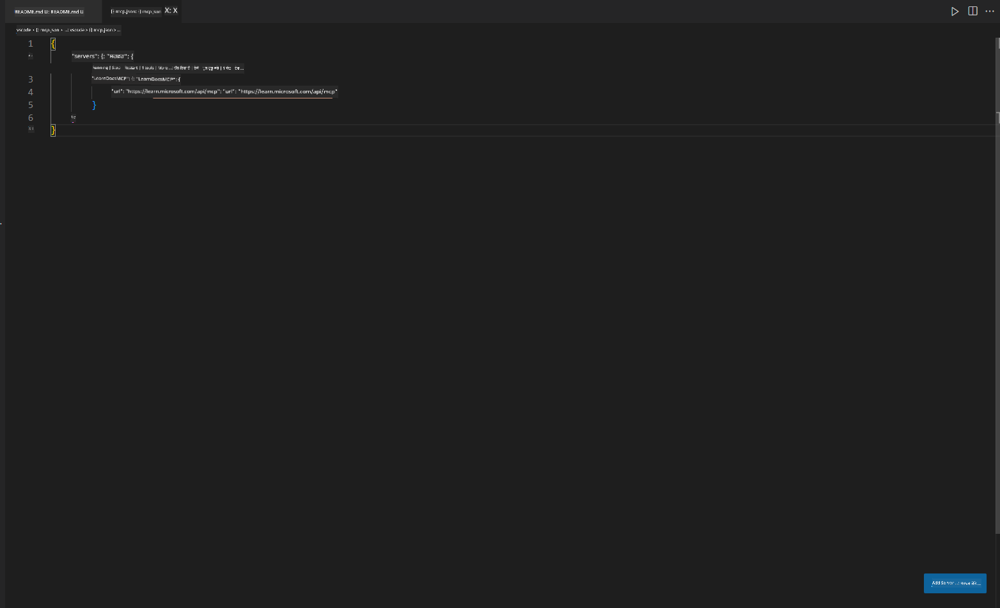
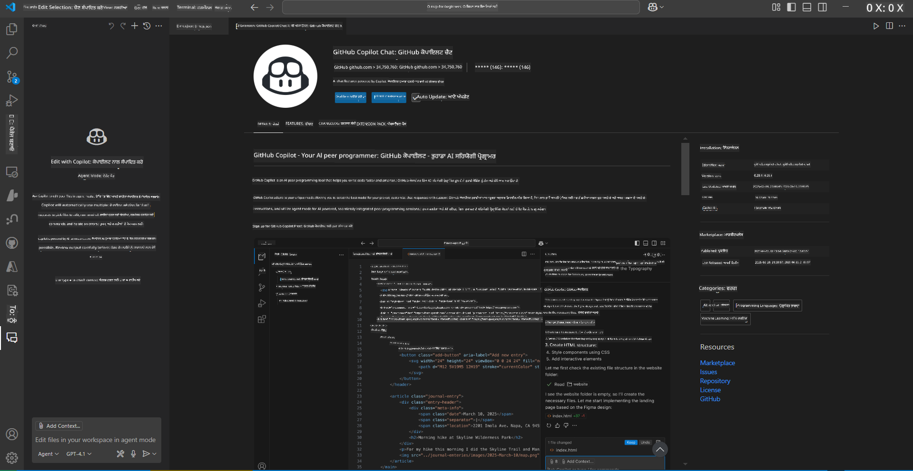
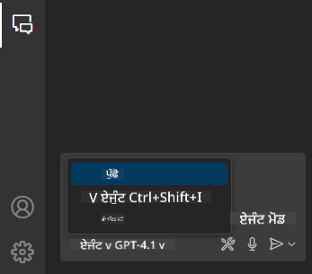
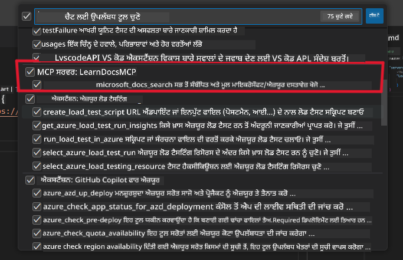
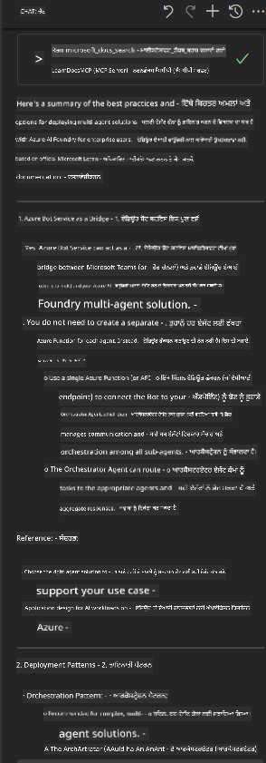

<!--
CO_OP_TRANSLATOR_METADATA:
{
  "original_hash": "db532b1ec386c9ce38c791653dc3c881",
  "translation_date": "2025-06-21T14:38:18+00:00",
  "source_file": "09-CaseStudy/docs-mcp/solution/scenario3/README.md",
  "language_code": "pa"
}
-->
# Scenario 3: VS Code ਵਿੱਚ MCP ਸਰਵਰ ਨਾਲ ਇਨ-ਐਡੀਟਰ ਡੌਕਸ

## ਓਵਰਵਿਊ

ਇਸ ਸਿਨਾਰਿਓ ਵਿੱਚ, ਤੁਸੀਂ ਸਿੱਖੋਗੇ ਕਿ Microsoft Learn Docs ਨੂੰ MCP ਸਰਵਰ ਦੀ ਵਰਤੋਂ ਕਰਕੇ ਆਪਣੇ Visual Studio Code ਵਾਤਾਵਰਨ ਵਿੱਚ ਸਿੱਧਾ ਕਿਵੇਂ ਲਿਆਉਣਾ ਹੈ। ਬ੍ਰਾਉਜ਼ਰ ਟੈਬਾਂ ਵਿਚ ਵਾਰੀ-ਵਾਰੀ ਸਵਿੱਚ ਕਰਨ ਦੀ ਬਜਾਏ, ਤੁਸੀਂ ਆਪਣੇ ਐਡੀਟਰ ਦੇ ਅੰਦਰ ਹੀ ਅਧਿਕਾਰਿਕ ਡੌਕਸ ਨੂੰ ਖੋਜ ਸਕਦੇ ਹੋ, ਪੜ੍ਹ ਸਕਦੇ ਹੋ ਅਤੇ ਰੈਫਰੈਂਸ ਕਰ ਸਕਦੇ ਹੋ। ਇਹ ਤਰੀਕਾ ਤੁਹਾਡੇ ਕੰਮ ਦੇ ਪ੍ਰਵਾਹ ਨੂੰ ਸੁਗਮ ਬਣਾਉਂਦਾ ਹੈ, ਤੁਹਾਡੇ ਧਿਆਨ ਨੂੰ ਕੇਂਦ੍ਰਿਤ ਰੱਖਦਾ ਹੈ ਅਤੇ GitHub Copilot ਵਰਗੇ ਟੂਲਾਂ ਨਾਲ ਬਿਨਾਂ ਰੁਕਾਵਟ ਇੰਟੀਗ੍ਰੇਸ਼ਨ ਦੀ ਸਹੂਲਤ ਦਿੰਦਾ ਹੈ।

- VS Code ਵਿੱਚ ਹੀ ਡੌਕਸ ਨੂੰ ਖੋਜੋ ਅਤੇ ਪੜ੍ਹੋ ਬਿਨਾਂ ਆਪਣੇ ਕੋਡਿੰਗ ਵਾਤਾਵਰਨ ਤੋਂ ਬਾਹਰ ਜਾਏ।
- ਡੌਕੂਮੈਂਟੇਸ਼ਨ ਨੂੰ ਰੈਫਰੈਂਸ ਕਰੋ ਅਤੇ ਸਿੱਧਾ README ਜਾਂ ਕੋਰਸ ਫਾਇਲਾਂ ਵਿੱਚ ਲਿੰਕ ਸ਼ਾਮਲ ਕਰੋ।
- GitHub Copilot ਅਤੇ MCP ਨੂੰ ਇਕੱਠੇ ਵਰਤੋਂ ਕਰਕੇ ਇੱਕ ਸੁਚੱਜਾ, AI-ਚਲਿਤ ਡੌਕੂਮੈਂਟੇਸ਼ਨ ਵਰਕਫਲੋ ਬਣਾਓ।

## ਸਿੱਖਣ ਦੇ ਉਦੇਸ਼

ਇਸ ਅਧਿਆਇ ਦੇ ਅੰਤ ਤੱਕ, ਤੁਸੀਂ ਸਮਝ ਜਾਵੋਗੇ ਕਿ MCP ਸਰਵਰ ਨੂੰ VS Code ਵਿੱਚ ਕਿਵੇਂ ਸੈੱਟਅਪ ਅਤੇ ਵਰਤਣਾ ਹੈ ਤਾਂ ਜੋ ਆਪਣੀ ਡੌਕੂਮੈਂਟੇਸ਼ਨ ਅਤੇ ਵਿਕਾਸ ਵਰਕਫਲੋ ਨੂੰ ਬਿਹਤਰ ਬਣਾਇਆ ਜਾ ਸਕੇ। ਤੁਸੀਂ ਸਮਰੱਥ ਹੋਵੋਗੇ:

- ਆਪਣਾ ਵਰਕਸਪੇਸ MCP ਸਰਵਰ ਲਈ ਡੌਕੂਮੈਂਟੇਸ਼ਨ ਲੁੱਕਅਪ ਵਾਸਤੇ ਕਨਫਿਗਰ ਕਰਨ ਲਈ।
- VS Code ਦੇ ਅੰਦਰੋਂ ਸਿੱਧਾ ਡੌਕੂਮੈਂਟੇਸ਼ਨ ਖੋਜ ਕੇ ਸ਼ਾਮਲ ਕਰਨ ਲਈ।
- GitHub Copilot ਅਤੇ MCP ਦੀ ਤਾਕਤ ਨੂੰ ਜੋੜ ਕੇ ਇੱਕ ਜ਼ਿਆਦਾ ਉਤਪਾਦਕ, AI-ਸਹਾਇਤ ਵਰਕਫਲੋ ਬਣਾਉਣ ਲਈ।

ਇਹ ਹੁਨਰ ਤੁਹਾਨੂੰ ਧਿਆਨ ਕੇਂਦ੍ਰਿਤ ਰੱਖਣ, ਡੌਕੂਮੈਂਟੇਸ਼ਨ ਦੀ ਗੁਣਵੱਤਾ ਵਧਾਉਣ ਅਤੇ ਵਿਕਾਸਕਾਰ ਜਾਂ ਤਕਨੀਕੀ ਲੇਖਕ ਵਜੋਂ ਤੁਹਾਡੀ ਉਤਪਾਦਕਤਾ ਵਧਾਉਣ ਵਿੱਚ ਮਦਦ ਕਰਨਗੇ।

## ਹੱਲ

ਇਨ-ਐਡੀਟਰ ਡੌਕੂਮੈਂਟੇਸ਼ਨ ਐਕਸੈਸ ਪ੍ਰਾਪਤ ਕਰਨ ਲਈ, ਤੁਸੀਂ ਕੁਝ ਕਦਮਾਂ ਦੀ ਪਾਲਣਾ ਕਰੋਗੇ ਜੋ MCP ਸਰਵਰ ਨੂੰ VS Code ਅਤੇ GitHub Copilot ਨਾਲ ਜੋੜਦੇ ਹਨ। ਇਹ ਹੱਲ ਕੋਰਸ ਲੇਖਕਾਂ, ਡੌਕੂਮੈਂਟੇਸ਼ਨ ਲੇਖਕਾਂ ਅਤੇ ਵਿਕਾਸਕਾਰਾਂ ਲਈ ਉਚਿਤ ਹੈ ਜੋ ਡੌਕਸ ਅਤੇ Copilot ਨਾਲ ਕੰਮ ਕਰਦੇ ਸਮੇਂ ਆਪਣੇ ਧਿਆਨ ਨੂੰ ਐਡੀਟਰ ਵਿੱਚ ਹੀ ਕੇਂਦ੍ਰਿਤ ਰੱਖਣਾ ਚਾਹੁੰਦੇ ਹਨ।

- ਕੋਰਸ ਜਾਂ ਪ੍ਰੋਜੈਕਟ ਡੌਕੂਮੈਂਟੇਸ਼ਨ ਲਿਖਦੇ ਸਮੇਂ README ਵਿੱਚ ਤੇਜ਼ੀ ਨਾਲ ਰੈਫਰੈਂਸ ਲਿੰਕ ਸ਼ਾਮਲ ਕਰੋ।
- ਕੋਡ ਬਣਾਉਣ ਲਈ Copilot ਦੀ ਵਰਤੋਂ ਕਰੋ ਅਤੇ MCP ਨਾਲ ਸਬੰਧਿਤ ਡੌਕਸ ਤੁਰੰਤ ਲੱਭੋ ਅਤੇ ਹਵਾਲਾ ਦਿਓ।
- ਆਪਣੇ ਐਡੀਟਰ ਵਿੱਚ ਧਿਆਨ ਕੇਂਦ੍ਰਿਤ ਰੱਖੋ ਅਤੇ ਉਤਪਾਦਕਤਾ ਵਧਾਓ।

### ਕਦਮ-ਬਾਈ-ਕਦਮ ਗਾਈਡ

ਸ਼ੁਰੂ ਕਰਨ ਲਈ, ਇਹ ਕਦਮ ਫੋਲੋ ਕਰੋ। ਹਰ ਕਦਮ ਲਈ, ਤੁਸੀਂ ਪ੍ਰਕਿਰਿਆ ਨੂੰ ਦਰਸਾਉਣ ਲਈ assets ਫੋਲਡਰ ਤੋਂ ਸਕ੍ਰੀਨਸ਼ਾਟ ਸ਼ਾਮਲ ਕਰ ਸਕਦੇ ਹੋ।

1. **MCP ਕਨਫਿਗਰੇਸ਼ਨ ਸ਼ਾਮਲ ਕਰੋ:**
   ਆਪਣੇ ਪ੍ਰੋਜੈਕਟ ਰੂਟ ਵਿੱਚ, ਇੱਕ `.vscode/mcp.json` ਫਾਇਲ ਬਣਾਓ ਅਤੇ ਹੇਠਾਂ ਦਿੱਤੀ ਕਨਫਿਗਰੇਸ਼ਨ ਸ਼ਾਮਲ ਕਰੋ:
   ```json
   {
     "servers": {
       "LearnDocsMCP": {
         "url": "https://learn.microsoft.com/api/mcp"
       }
     }
   }
   ```
   ਇਹ ਕਨਫਿਗਰੇਸ਼ਨ VS Code ਨੂੰ ਦੱਸਦੀ ਹੈ ਕਿ [`Microsoft Learn Docs MCP server`](https://github.com/MicrosoftDocs/mcp) ਨਾਲ ਕਿਵੇਂ ਕਨੈਕਟ ਕਰਨਾ ਹੈ।
   
   
    
2. **GitHub Copilot Chat ਪੈਨਲ ਖੋਲ੍ਹੋ:**
   ਜੇ ਤੁਹਾਡੇ ਕੋਲ GitHub Copilot ਐਕਸਟੇੰਸ਼ਨ ਇੰਸਟਾਲ ਨਹੀਂ ਹੈ, ਤਾਂ VS Code ਵਿੱਚ Extensions ਵਿਊ ਵਿੱਚ ਜਾ ਕੇ ਇਸਨੂੰ ਇੰਸਟਾਲ ਕਰੋ। ਤੁਸੀਂ ਇਸਨੂੰ ਸਿੱਧਾ [Visual Studio Code Marketplace](https://marketplace.visualstudio.com/items?itemName=GitHub.copilot-chat) ਤੋਂ ਡਾਊਨਲੋਡ ਕਰ ਸਕਦੇ ਹੋ। ਫਿਰ, ਸਾਈਡਬਾਰ ਤੋਂ Copilot Chat ਪੈਨਲ ਖੋਲ੍ਹੋ।

   

3. **ਏਜੰਟ ਮੋਡ ਚਾਲੂ ਕਰੋ ਅਤੇ ਟੂਲਜ਼ ਦੀ ਜਾਂਚ ਕਰੋ:**
   Copilot Chat ਪੈਨਲ ਵਿੱਚ, ਏਜੰਟ ਮੋਡ ਚਾਲੂ ਕਰੋ।

   

   ਏਜੰਟ ਮੋਡ ਚਾਲੂ ਕਰਨ ਤੋਂ ਬਾਅਦ, ਜਾਂਚ ਕਰੋ ਕਿ MCP ਸਰਵਰ ਉਪਲਬਧ ਟੂਲਾਂ ਵਿੱਚ ਸ਼ਾਮਲ ਹੈ। ਇਸ ਨਾਲ ਯਕੀਨ ਬਣਦਾ ਹੈ ਕਿ Copilot ਏਜੰਟ ਡੌਕੂਮੈਂਟੇਸ਼ਨ ਸਰਵਰ ਤੱਕ ਪਹੁੰਚ ਸਕਦਾ ਹੈ ਅਤੇ ਸਬੰਧਿਤ ਜਾਣਕਾਰੀ ਲੈ ਸਕਦਾ ਹੈ।
   
   

4. **ਨਵਾਂ ਚੈਟ ਸ਼ੁਰੂ ਕਰੋ ਅਤੇ ਏਜੰਟ ਨੂੰ ਪ੍ਰੰਪਟ ਕਰੋ:**
   Copilot Chat ਪੈਨਲ ਵਿੱਚ ਨਵਾਂ ਚੈਟ ਖੋਲ੍ਹੋ। ਹੁਣ ਤੁਸੀਂ ਆਪਣੇ ਡੌਕੂਮੈਂਟੇਸ਼ਨ ਸਵਾਲਾਂ ਨਾਲ ਏਜੰਟ ਨੂੰ ਪ੍ਰੰਪਟ ਕਰ ਸਕਦੇ ਹੋ। ਏਜੰਟ MCP ਸਰਵਰ ਦੀ ਵਰਤੋਂ ਕਰਕੇ ਸਬੰਧਿਤ Microsoft Learn ਡੌਕੂਮੈਂਟੇਸ਼ਨ ਨੂੰ ਸਿੱਧਾ ਤੁਹਾਡੇ ਐਡੀਟਰ ਵਿੱਚ ਲਿਆਵੇਗਾ।

   - *"ਮੈਂ ਵਿਸ਼ਾ X ਲਈ ਇੱਕ ਅਧਿਐਨ ਯੋਜਨਾ ਲਿਖਣ ਦੀ ਕੋਸ਼ਿਸ਼ ਕਰ ਰਿਹਾ ਹਾਂ। ਮੈਂ ਇਸਨੂੰ 8 ਹਫ਼ਤੇ ਲਈ ਪੜ੍ਹਾਂਗਾ, ਹਰ ਹਫ਼ਤੇ ਲਈ ਮੈਨੂੰ ਸਮੱਗਰੀ ਸੁਝਾਓ ਜੋ ਮੈਂ ਲੈਣੀ ਚਾਹੀਦੀ ਹੈ।"*

   

5. **ਲਾਈਵ ਕੁਐਰੀ:**

   > ਆਓ Azure AI Foundry Discord ਦੇ [#get-help](https://discord.gg/D6cRhjHWSC) ਸੈਕਸ਼ਨ ਤੋਂ ਇੱਕ ਲਾਈਵ ਕੁਐਰੀ ਲੈਈਏ ([ਅਸਲ ਸੁਨੇਹਾ ਵੇਖੋ](https://discord.com/channels/1113626258182504448/1385498306720829572)):
   
   *"ਮੈਂ Azure AI Foundry 'ਤੇ ਵਿਕਸਤ ਕੀਤੇ ਗਏ AI ਏਜੰਟਾਂ ਨਾਲ ਇੱਕ ਮਲਟੀ-ਏਜੰਟ ਹੱਲ ਨੂੰ ਡਿਪਲੋਇ ਕਰਨ ਬਾਰੇ ਜਵਾਬ ਲੱਭ ਰਿਹਾ ਹਾਂ। ਮੈਂ ਵੇਖਦਾ ਹਾਂ ਕਿ ਕੋਈ ਸਿੱਧਾ ਡਿਪਲੋਇਮੈਂਟ ਤਰੀਕਾ ਨਹੀਂ ਹੈ, ਜਿਵੇਂ ਕਿ Copilot Studio ਚੈਨਲ। ਤਾਂ, ਵੱਖ-ਵੱਖ ਤਰੀਕੇ ਕੀ ਹਨ ਜਿਸ ਨਾਲ ਐਂਟਰਪ੍ਰਾਈਜ਼ ਯੂਜ਼ਰ ਇਸ ਡਿਪਲੋਇਮੈਂਟ ਨੂੰ ਕਰ ਸਕਦੇ ਹਨ ਅਤੇ ਕੰਮ ਪੂਰਾ ਕਰ ਸਕਦੇ ਹਨ? ਕਈ ਲੇਖ/ਬਲੌਗ ਹਨ ਜੋ ਕਹਿੰਦੇ ਹਨ ਕਿ ਅਸੀਂ Azure Bot ਸਰਵਿਸ ਦੀ ਵਰਤੋਂ ਕਰ ਸਕਦੇ ਹਾਂ ਜੋ MS Teams ਅਤੇ Azure AI Foundry ਏਜੰਟਾਂ ਵਿਚਕਾਰ ਪੁਲ ਵਜੋਂ ਕੰਮ ਕਰਦਾ ਹੈ, ਤਾਂ ਕੀ ਇਹ ਕੰਮ ਕਰੇਗਾ ਜੇ ਮੈਂ ਇੱਕ Azure ਬੋਟ ਸੈੱਟਅਪ ਕਰਾਂ ਜੋ Azure ਫੰਕਸ਼ਨ ਰਾਹੀਂ Orchestrator Agent ਨਾਲ ਕਨੈਕਟ ਕਰਦਾ ਹੈ ਜਾਂ ਮੈਨੂੰ ਹਰ AI ਏਜੰਟ ਲਈ ਵੱਖ-ਵੱਖ Azure ਫੰਕਸ਼ਨ ਬਣਾਉਣੇ ਪੈਣਗੇ ਜੋ ਬੋਟ ਫ੍ਰੇਮਵਰਕ 'ਤੇ ਸੰਗਠਨ ਕਰੇ? ਹੋਰ ਕੋਈ ਸੁਝਾਅ ਬੜੀ ਖੁਸ਼ੀ ਨਾਲ ਸਵਾਗਤਯੋਗ ਹਨ।"*

   

   ਏਜੰਟ ਸਬੰਧਿਤ ਡੌਕੂਮੈਂਟੇਸ਼ਨ ਲਿੰਕਾਂ ਅਤੇ ਸੰਖੇਪਾਂ ਨਾਲ ਜਵਾਬ ਦੇਵੇਗਾ, ਜਿਨ੍ਹਾਂ ਨੂੰ ਤੁਸੀਂ ਆਪਣੇ ਮਾਰਕਡਾਊਨ ਫਾਇਲਾਂ ਵਿੱਚ ਸਿੱਧਾ ਸ਼ਾਮਲ ਕਰ ਸਕਦੇ ਹੋ ਜਾਂ ਆਪਣੇ ਕੋਡ ਵਿੱਚ ਰੈਫਰੈਂਸ ਵਜੋਂ ਵਰਤ ਸਕਦੇ ਹੋ।

### ਨਮੂਨਾ ਕੁਐਰੀਜ਼

ਇਹਾਂ ਕੁਝ ਉਦਾਹਰਨ ਕੁਐਰੀਜ਼ ਹਨ ਜੋ ਤੁਸੀਂ ਕੋਸ਼ਿਸ਼ ਕਰ ਸਕਦੇ ਹੋ। ਇਹ ਕੁਐਰੀਜ਼ ਦਿਖਾਉਂਦੀਆਂ ਹਨ ਕਿ MCP ਸਰਵਰ ਅਤੇ Copilot ਕਿਵੇਂ ਇਕੱਠੇ ਕੰਮ ਕਰਦੇ ਹਨ ਤਾਂ ਜੋ VS Code ਛੱਡੇ ਬਿਨਾਂ ਤੁਰੰਤ, ਸੰਦਰਭ-ਸੂਚਕ ਡੌਕੂਮੈਂਟੇਸ਼ਨ ਅਤੇ ਰੈਫਰੈਂਸ ਪ੍ਰਦਾਨ ਕਰ ਸਕਣ:

- "ਮੈਨੂੰ ਦਿਖਾਓ ਕਿ Azure Functions ਟ੍ਰਿਗਰਾਂ ਦੀ ਵਰਤੋਂ ਕਿਵੇਂ ਕਰਨੀ ਹੈ।"
- "Azure Key Vault ਦੀ ਅਧਿਕਾਰਿਕ ਡੌਕੂਮੈਂਟੇਸ਼ਨ ਲਈ ਲਿੰਕ ਸ਼ਾਮਲ ਕਰੋ।"
- "Azure ਸਰੋਤਾਂ ਨੂੰ ਸੁਰੱਖਿਅਤ ਕਰਨ ਲਈ ਸਭ ਤੋਂ ਵਧੀਆ ਅਭਿਆਸ ਕੀ ਹਨ?"
- "Azure AI ਸਰਵਿਸز ਲਈ ਇੱਕ ਕਵਿਕਸਟਾਰਟ ਲੱਭੋ।"

ਇਹ ਕੁਐਰੀਜ਼ ਦਿਖਾਉਂਦੀਆਂ ਹਨ ਕਿ MCP ਸਰਵਰ ਅਤੇ Copilot ਕਿਵੇਂ ਮਿਲ ਕੇ ਤੁਰੰਤ, ਸੰਦਰਭ-ਸੂਚਕ ਡੌਕੂਮੈਂਟੇਸ਼ਨ ਅਤੇ ਰੈਫਰੈਂਸ ਮੁਹੱਈਆ ਕਰਵਾਉਂਦੇ ਹਨ ਬਿਨਾਂ VS Code ਤੋਂ ਬਾਹਰ ਜਾਏ।

**ਅਸਵੀਕਾਰੋਪਣ**:  
ਇਹ ਦਸਤਾਵੇਜ਼ AI ਅਨੁਵਾਦ ਸੇਵਾ [Co-op Translator](https://github.com/Azure/co-op-translator) ਦੀ ਵਰਤੋਂ ਕਰਕੇ ਅਨੁਵਾਦਿਤ ਕੀਤਾ ਗਿਆ ਹੈ। ਜਦੋਂ ਕਿ ਅਸੀਂ ਸਹੀਅਤ ਲਈ ਕੋਸ਼ਿਸ਼ ਕਰਦੇ ਹਾਂ, ਕਿਰਪਾ ਕਰਕੇ ਧਿਆਨ ਵਿੱਚ ਰੱਖੋ ਕਿ ਆਟੋਮੈਟਿਕ ਅਨੁਵਾਦਾਂ ਵਿੱਚ ਗਲਤੀਆਂ ਜਾਂ ਅਸਮਰਥਤਾਵਾਂ ਹੋ ਸਕਦੀਆਂ ਹਨ। ਮੂਲ ਦਸਤਾਵੇਜ਼ ਆਪਣੇ ਮੂਲ ਭਾਸ਼ਾ ਵਿੱਚ ਪ੍ਰਮਾਣਿਕ ਸਰੋਤ ਮੰਨਿਆ ਜਾਣਾ ਚਾਹੀਦਾ ਹੈ। ਮਹੱਤਵਪੂਰਨ ਜਾਣਕਾਰੀ ਲਈ, ਪੇਸ਼ੇਵਰ ਮਨੁੱਖੀ ਅਨੁਵਾਦ ਦੀ ਸਿਫਾਰਿਸ਼ ਕੀਤੀ ਜਾਂਦੀ ਹੈ। ਇਸ ਅਨੁਵਾਦ ਦੀ ਵਰਤੋਂ ਤੋਂ ਉੱਪਜਣ ਵਾਲੀਆਂ ਕਿਸੇ ਵੀ ਗਲਤਫਹਿਮੀਆਂ ਜਾਂ ਗਲਤ ਵਿਆਖਿਆਵਾਂ ਲਈ ਅਸੀਂ ਜ਼ਿੰਮੇਵਾਰ ਨਹੀਂ ਹਾਂ।