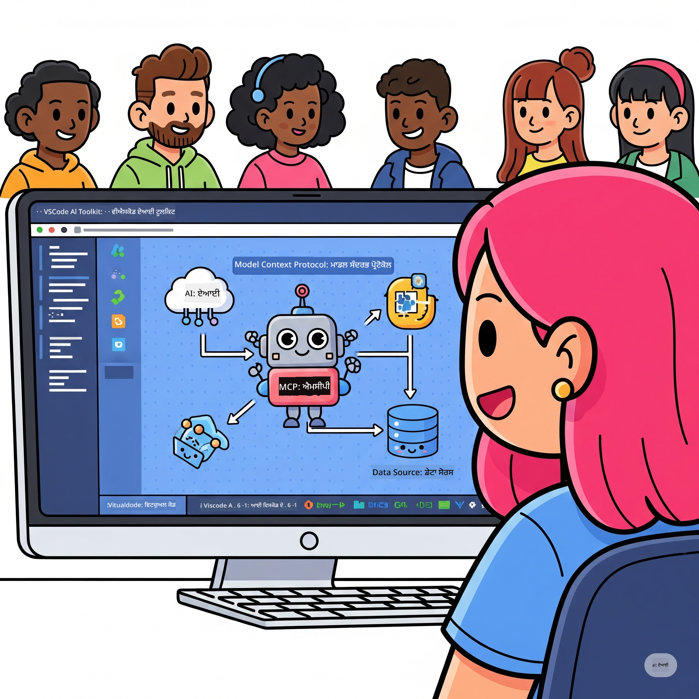

<!--
CO_OP_TRANSLATOR_METADATA:
{
  "original_hash": "787440926586cd064b0899fd1c514f52",
  "translation_date": "2025-07-14T07:04:55+00:00",
  "source_file": "10-StreamliningAIWorkflowsBuildingAnMCPServerWithAIToolkit/README.md",
  "language_code": "pa"
}
-->
# AI ਵਰਕਫਲੋਜ਼ ਨੂੰ ਸੁਗਮ ਬਣਾਉਣਾ: AI Toolkit ਨਾਲ MCP ਸਰਵਰ ਬਣਾਉਣਾ

## 🎯 ਝਲਕ

ਤੁਹਾਡਾ ਸਵਾਗਤ ਹੈ **Model Context Protocol (MCP) ਵਰਕਸ਼ਾਪ** ਵਿੱਚ! ਇਹ ਵਿਸਤ੍ਰਿਤ ਹੱਥੋਂ-ਹੱਥ ਵਰਕਸ਼ਾਪ ਦੋ ਅਗੇਤਰ ਤਕਨਾਲੋਜੀਆਂ ਨੂੰ ਜੋੜਦਾ ਹੈ ਜੋ AI ਐਪਲੀਕੇਸ਼ਨ ਵਿਕਾਸ ਵਿੱਚ ਕ੍ਰਾਂਤੀ ਲਿਆਉਂਦੀਆਂ ਹਨ:

- **🔗 Model Context Protocol (MCP)**: AI-ਟੂਲ ਇੰਟੀਗ੍ਰੇਸ਼ਨ ਲਈ ਇੱਕ ਖੁੱਲ੍ਹਾ ਮਿਆਰ
- **🛠️ AI Toolkit for Visual Studio Code (AITK)**: ਮਾਈਕ੍ਰੋਸਾਫਟ ਦਾ ਸ਼ਕਤੀਸ਼ਾਲੀ AI ਵਿਕਾਸ ਐਕਸਟੈਂਸ਼ਨ

### 🎓 ਤੁਸੀਂ ਕੀ ਸਿੱਖੋਗੇ

ਇਸ ਵਰਕਸ਼ਾਪ ਦੇ ਅੰਤ ਤੱਕ, ਤੁਸੀਂ ਸਮਝਦਾਰ ਐਪਲੀਕੇਸ਼ਨ ਬਣਾਉਣ ਦੀ ਕਲਾ ਵਿੱਚ ਮਾਹਿਰ ਹੋ ਜਾਵੋਗੇ ਜੋ AI ਮਾਡਲਾਂ ਨੂੰ ਹਕੀਕਤੀ ਟੂਲਾਂ ਅਤੇ ਸੇਵਾਵਾਂ ਨਾਲ ਜੋੜਦੇ ਹਨ। ਆਟੋਮੇਟਿਕ ਟੈਸਟਿੰਗ ਤੋਂ ਲੈ ਕੇ ਕਸਟਮ API ਇੰਟੀਗ੍ਰੇਸ਼ਨ ਤੱਕ, ਤੁਸੀਂ ਜਟਿਲ ਕਾਰੋਬਾਰੀ ਸਮੱਸਿਆਵਾਂ ਹੱਲ ਕਰਨ ਲਈ ਪ੍ਰਯੋਗਿਕ ਹੁਨਰ ਹਾਸਲ ਕਰੋਗੇ।

## 🏗️ ਤਕਨਾਲੋਜੀ ਸਟੈਕ

### 🔌 Model Context Protocol (MCP)

MCP ਹੈ **"AI ਲਈ USB-C"** - ਇੱਕ ਯੂਨੀਵਰਸਲ ਮਿਆਰ ਜੋ AI ਮਾਡਲਾਂ ਨੂੰ ਬਾਹਰੀ ਟੂਲਾਂ ਅਤੇ ਡਾਟਾ ਸਰੋਤਾਂ ਨਾਲ ਜੋੜਦਾ ਹੈ।

**✨ ਮੁੱਖ ਵਿਸ਼ੇਸ਼ਤਾਵਾਂ:**
- 🔄 **ਮਿਆਰੀਕ੍ਰਿਤ ਇੰਟੀਗ੍ਰੇਸ਼ਨ**: AI-ਟੂਲ ਕਨੈਕਸ਼ਨਾਂ ਲਈ ਯੂਨੀਵਰਸਲ ਇੰਟਰਫੇਸ
- 🏛️ **ਲਚਕੀਲਾ ਆਰਕੀਟੈਕਚਰ**: ਸਥਾਨਕ ਅਤੇ ਰਿਮੋਟ ਸਰਵਰ stdio/SSE ਟਰਾਂਸਪੋਰਟ ਰਾਹੀਂ
- 🧰 **ਧਨਾਢ਼ ਇਕੋਸਿਸਟਮ**: ਇੱਕ ਪ੍ਰੋਟੋਕੋਲ ਵਿੱਚ ਟੂਲ, ਪ੍ਰਾਂਪਟ ਅਤੇ ਸਰੋਤ
- 🔒 **ਐਂਟਰਪ੍ਰਾਈਜ਼-ਤਿਆਰ**: ਬਿਲਟ-ਇਨ ਸੁਰੱਖਿਆ ਅਤੇ ਭਰੋਸੇਯੋਗਤਾ

**🎯 MCP ਕਿਉਂ ਜਰੂਰੀ ਹੈ:**
ਜਿਵੇਂ USB-C ਨੇ ਕੇਬਲ ਦੀ ਗੜਬੜ ਖਤਮ ਕਰ ਦਿੱਤੀ, MCP AI ਇੰਟੀਗ੍ਰੇਸ਼ਨਾਂ ਦੀ ਜਟਿਲਤਾ ਖਤਮ ਕਰਦਾ ਹੈ। ਇੱਕ ਪ੍ਰੋਟੋਕੋਲ, ਅਨੰਤ ਸੰਭਾਵਨਾਵਾਂ।

### 🤖 AI Toolkit for Visual Studio Code (AITK)

ਮਾਈਕ੍ਰੋਸਾਫਟ ਦਾ ਪ੍ਰਮੁੱਖ AI ਵਿਕਾਸ ਐਕਸਟੈਂਸ਼ਨ ਜੋ VS Code ਨੂੰ AI ਸ਼ਕਤੀਸ਼ਾਲੀ ਬਣਾਉਂਦਾ ਹੈ।

**🚀 ਮੁੱਖ ਸਮਰੱਥਾਵਾਂ:**
- 📦 **ਮਾਡਲ ਕੈਟਾਲੌਗ**: Azure AI, GitHub, Hugging Face, Ollama ਤੋਂ ਮਾਡਲਾਂ ਤੱਕ ਪਹੁੰਚ
- ⚡ **ਲੋਕਲ ਇਨਫਰੈਂਸ**: ONNX-ਅਨੁਕੂਲ CPU/GPU/NPU ਚਲਾਉਣਾ
- 🏗️ **ਏਜੰਟ ਬਿਲਡਰ**: MCP ਇੰਟੀਗ੍ਰੇਸ਼ਨ ਨਾਲ ਵਿਜ਼ੂਅਲ AI ਏਜੰਟ ਵਿਕਾਸ
- 🎭 **ਮਲਟੀ-ਮੋਡਲ**: ਟੈਕਸਟ, ਵਿਜ਼ਨ ਅਤੇ ਸੰਰਚਿਤ ਆਉਟਪੁੱਟ ਸਹਾਇਤਾ

**💡 ਵਿਕਾਸ ਦੇ ਫਾਇਦੇ:**
- ਜ਼ੀਰੋ-ਕਨਫਿਗ ਮਾਡਲ ਡਿਪਲੋਇਮੈਂਟ
- ਵਿਜ਼ੂਅਲ ਪ੍ਰਾਂਪਟ ਇੰਜੀਨੀਅਰਿੰਗ
- ਰੀਅਲ-ਟਾਈਮ ਟੈਸਟਿੰਗ ਪਲੇਗ੍ਰਾਊਂਡ
- ਬਿਨਾਂ ਰੁਕਾਵਟ MCP ਸਰਵਰ ਇੰਟੀਗ੍ਰੇਸ਼ਨ

## 📚 ਸਿੱਖਣ ਦਾ ਸਫਰ

### [🚀 ਮੋਡੀਊਲ 1: AI Toolkit ਬੁਨਿਆਦੀ ਜਾਣਕਾਰੀ](./lab1/README.md)
**ਅਵਧੀ**: 15 ਮਿੰਟ
- 🛠️ VS Code ਲਈ AI Toolkit ਇੰਸਟਾਲ ਅਤੇ ਸੰਰਚਿਤ ਕਰੋ
- 🗂️ ਮਾਡਲ ਕੈਟਾਲੌਗ ਦੀ ਖੋਜ ਕਰੋ (GitHub, ONNX, OpenAI, Anthropic, Google ਤੋਂ 100+ ਮਾਡਲ)
- 🎮 ਰੀਅਲ-ਟਾਈਮ ਮਾਡਲ ਟੈਸਟਿੰਗ ਲਈ ਇੰਟਰਐਕਟਿਵ ਪਲੇਗ੍ਰਾਊਂਡ ਵਿੱਚ ਮਾਹਰ ਬਣੋ
- 🤖 Agent Builder ਨਾਲ ਆਪਣਾ ਪਹਿਲਾ AI ਏਜੰਟ ਬਣਾਓ
- 📊 ਬਿਲਟ-ਇਨ ਮੈਟ੍ਰਿਕਸ (F1, ਪ੍ਰਸੰਗਿਕਤਾ, ਸਮਾਨਤਾ, ਸੰਗਤਤਾ) ਨਾਲ ਮਾਡਲ ਪ੍ਰਦਰਸ਼ਨ ਦਾ ਮੁਲਾਂਕਣ ਕਰੋ
- ⚡ ਬੈਚ ਪ੍ਰੋਸੈਸਿੰਗ ਅਤੇ ਮਲਟੀ-ਮੋਡਲ ਸਹਾਇਤਾ ਸਮਰੱਥਾਵਾਂ ਸਿੱਖੋ

**🎯 ਸਿੱਖਣ ਦਾ ਨਤੀਜਾ**: AITK ਸਮਰੱਥਾਵਾਂ ਦੀ ਪੂਰੀ ਸਮਝ ਨਾਲ ਇੱਕ ਕਾਰਗਰ AI ਏਜੰਟ ਬਣਾਓ

### [🌐 ਮੋਡੀਊਲ 2: MCP ਨਾਲ AI Toolkit ਬੁਨਿਆਦੀ ਜਾਣਕਾਰੀ](./lab2/README.md)
**ਅਵਧੀ**: 20 ਮਿੰਟ
- 🧠 Model Context Protocol (MCP) ਦੀ ਆਰਕੀਟੈਕਚਰ ਅਤੇ ਧਾਰਣਾਵਾਂ ਵਿੱਚ ਮਾਹਰ ਬਣੋ
- 🌐 ਮਾਈਕ੍ਰੋਸਾਫਟ ਦੇ MCP ਸਰਵਰ ਇਕੋਸਿਸਟਮ ਦੀ ਖੋਜ ਕਰੋ
- 🤖 Playwright MCP ਸਰਵਰ ਦੀ ਵਰਤੋਂ ਕਰਕੇ ਬ੍ਰਾਊਜ਼ਰ ਆਟੋਮੇਸ਼ਨ ਏਜੰਟ ਬਣਾਓ
- 🔧 MCP ਸਰਵਰਾਂ ਨੂੰ AI Toolkit Agent Builder ਨਾਲ ਜੋੜੋ
- 📊 ਆਪਣੇ ਏਜੰਟਾਂ ਵਿੱਚ MCP ਟੂਲਾਂ ਨੂੰ ਸੰਰਚਿਤ ਅਤੇ ਟੈਸਟ ਕਰੋ
- 🚀 MCP-ਸਮਰੱਥ ਏਜੰਟਾਂ ਨੂੰ ਪ੍ਰੋਡਕਸ਼ਨ ਲਈ ਐਕਸਪੋਰਟ ਅਤੇ ਡਿਪਲੋਇ ਕਰੋ

**🎯 ਸਿੱਖਣ ਦਾ ਨਤੀਜਾ**: ਬਾਹਰੀ ਟੂਲਾਂ ਨਾਲ MCP ਰਾਹੀਂ ਇੱਕ ਸ਼ਕਤੀਸ਼ਾਲੀ AI ਏਜੰਟ ਤਿਆਰ ਕਰੋ

### [🔧 ਮੋਡੀਊਲ 3: AI Toolkit ਨਾਲ ਅਡਵਾਂਸ MCP ਵਿਕਾਸ](./lab3/README.md)
**ਅਵਧੀ**: 20 ਮਿੰਟ
- 💻 AI Toolkit ਦੀ ਵਰਤੋਂ ਕਰਕੇ ਕਸਟਮ MCP ਸਰਵਰ ਬਣਾਓ
- 🐍 ਨਵੀਂ MCP Python SDK (v1.9.3) ਨੂੰ ਸੰਰਚਿਤ ਅਤੇ ਵਰਤੋਂ ਕਰੋ
- 🔍 ਡੀਬੱਗਿੰਗ ਲਈ MCP Inspector ਸੈੱਟਅੱਪ ਅਤੇ ਵਰਤੋਂ ਕਰੋ
- 🛠️ ਪ੍ਰੋਫੈਸ਼ਨਲ ਡੀਬੱਗਿੰਗ ਵਰਕਫਲੋਜ਼ ਨਾਲ Weather MCP Server ਬਣਾਓ
- 🧪 Agent Builder ਅਤੇ Inspector ਦੋਹਾਂ ਵਿੱਚ MCP ਸਰਵਰਾਂ ਨੂੰ ਡੀਬੱਗ ਕਰੋ

**🎯 ਸਿੱਖਣ ਦਾ ਨਤੀਜਾ**: ਆਧੁਨਿਕ ਟੂਲਿੰਗ ਨਾਲ ਕਸਟਮ MCP ਸਰਵਰ ਵਿਕਸਿਤ ਅਤੇ ਡੀਬੱਗ ਕਰੋ

### [🐙 ਮੋਡੀਊਲ 4: ਪ੍ਰੈਕਟਿਕਲ MCP ਵਿਕਾਸ - ਕਸਟਮ GitHub Clone ਸਰਵਰ](./lab4/README.md)
**ਅਵਧੀ**: 30 ਮਿੰਟ
- 🏗️ ਵਿਕਾਸ ਵਰਕਫਲੋਜ਼ ਲਈ ਇੱਕ ਹਕੀਕਤੀ GitHub Clone MCP ਸਰਵਰ ਬਣਾਓ
- 🔄 ਸਮਾਰਟ ਰਿਪੋਜ਼ਿਟਰੀ ਕਲੋਨਿੰਗ ਨੂੰ ਵੈਰੀਫਿਕੇਸ਼ਨ ਅਤੇ ਐਰਰ ਹੈਂਡਲਿੰਗ ਨਾਲ ਲਾਗੂ ਕਰੋ
- 📁 ਸਮਾਰਟ ਡਾਇਰੈਕਟਰੀ ਪ੍ਰਬੰਧਨ ਅਤੇ VS Code ਇੰਟੀਗ੍ਰੇਸ਼ਨ ਬਣਾਓ
- 🤖 GitHub Copilot Agent Mode ਨੂੰ ਕਸਟਮ MCP ਟੂਲਾਂ ਨਾਲ ਵਰਤੋਂ ਕਰੋ
- 🛡️ ਪ੍ਰੋਡਕਸ਼ਨ-ਤਿਆਰ ਭਰੋਸੇਯੋਗਤਾ ਅਤੇ ਕ੍ਰਾਸ-ਪਲੇਟਫਾਰਮ ਅਨੁਕੂਲਤਾ ਲਾਗੂ ਕਰੋ

**🎯 ਸਿੱਖਣ ਦਾ ਨਤੀਜਾ**: ਇੱਕ ਪ੍ਰੋਡਕਸ਼ਨ-ਤਿਆਰ MCP ਸਰਵਰ ਡਿਪਲੋਇ ਕਰੋ ਜੋ ਅਸਲੀ ਵਿਕਾਸ ਵਰਕਫਲੋਜ਼ ਨੂੰ ਸੁਗਮ ਬਣਾਉਂਦਾ ਹੈ

## 💡 ਹਕੀਕਤੀ ਦੁਨੀਆ ਦੇ ਐਪਲੀਕੇਸ਼ਨ ਅਤੇ ਪ੍ਰਭਾਵ

### 🏢 ਐਂਟਰਪ੍ਰਾਈਜ਼ ਵਰਤੋਂ ਦੇ ਕੇਸ

#### 🔄 DevOps ਆਟੋਮੇਸ਼ਨ
ਆਪਣੇ ਵਿਕਾਸ ਵਰਕਫਲੋ ਨੂੰ ਸਮਾਰਟ ਆਟੋਮੇਸ਼ਨ ਨਾਲ ਬਦਲੋ:
- **ਸਮਾਰਟ ਰਿਪੋਜ਼ਿਟਰੀ ਪ੍ਰਬੰਧਨ**: AI-ਚਲਿਤ ਕੋਡ ਸਮੀਖਿਆ ਅਤੇ ਮਰਜ ਫੈਸਲੇ
- **ਸਮਾਰਟ CI/CD**: ਕੋਡ ਬਦਲਾਵਾਂ ਦੇ ਆਧਾਰ 'ਤੇ ਆਟੋਮੇਟਿਕ ਪਾਈਪਲਾਈਨ ਅਪਟੀਮਾਈਜ਼ੇਸ਼ਨ
- **ਇਸ਼ੂ ਟ੍ਰਾਇਅਜ**: ਆਟੋਮੇਟਿਕ ਬੱਗ ਵਰਗੀਕਰਨ ਅਤੇ ਅਸਾਈਨਮੈਂਟ

#### 🧪 ਕੁਆਲਿਟੀ ਅਸ਼ੋਰੈਂਸ ਕ੍ਰਾਂਤੀ
AI-ਚਲਿਤ ਆਟੋਮੇਸ਼ਨ ਨਾਲ ਟੈਸਟਿੰਗ ਨੂੰ ਉੱਚਾ ਕਰੋ:
- **ਸਮਾਰਟ ਟੈਸਟ ਜਨਰੇਸ਼ਨ**: ਆਟੋਮੇਟਿਕ ਤੌਰ 'ਤੇ ਵਿਸਤ੍ਰਿਤ ਟੈਸਟ ਸੂਟ ਬਣਾਓ
- **ਵਿਜ਼ੂਅਲ ਰਿਗ੍ਰੈਸ਼ਨ ਟੈਸਟਿੰਗ**: AI-ਚਲਿਤ UI ਬਦਲਾਅ ਪਛਾਣ
- **ਪ੍ਰਦਰਸ਼ਨ ਮਾਨੀਟਰਿੰਗ**: ਸਮੱਸਿਆਵਾਂ ਦੀ ਪਹਿਲਾਂ ਪਛਾਣ ਅਤੇ ਹੱਲ

#### 📊 ਡਾਟਾ ਪਾਈਪਲਾਈਨ ਇੰਟੈਲੀਜੈਂਸ
ਸਮਾਰਟ ਡਾਟਾ ਪ੍ਰੋਸੈਸਿੰਗ ਵਰਕਫਲੋਜ਼ ਬਣਾਓ:
- **ਅਡੈਪਟਿਵ ETL ਪ੍ਰਕਿਰਿਆਵਾਂ**: ਖੁਦ-ਅਪਟੀਮਾਈਜ਼ਿੰਗ ਡਾਟਾ ਬਦਲਾਅ
- **ਅਨੋਮਲੀ ਡਿਟੈਕਸ਼ਨ**: ਰੀਅਲ-ਟਾਈਮ ਡਾਟਾ ਕੁਆਲਿਟੀ ਮਾਨੀਟਰਿੰਗ
- **ਸਮਾਰਟ ਰਾਊਟਿੰਗ**: ਸਮਾਰਟ ਡਾਟਾ ਫਲੋ ਪ੍ਰਬੰਧਨ

#### 🎧 ਗਾਹਕ ਅਨੁਭਵ ਸੁਧਾਰ
ਅਸਧਾਰਣ ਗਾਹਕ ਸੰਵਾਦ ਬਣਾਓ:
- **ਸੰਦਰਭ-ਜਾਣੂ ਸਹਾਇਤਾ**: ਗਾਹਕ ਇਤਿਹਾਸ ਤੱਕ ਪਹੁੰਚ ਵਾਲੇ AI ਏਜੰਟ
- **ਪ੍ਰੋਐਕਟਿਵ ਸਮੱਸਿਆ ਹੱਲ**: ਭਵਿੱਖਬਾਣੀ ਗਾਹਕ ਸੇਵਾ
- **ਮਲਟੀ-ਚੈਨਲ ਇੰਟੀਗ੍ਰੇਸ਼ਨ**: ਪਲੇਟਫਾਰਮਾਂ 'ਤੇ ਇਕਜੁੱਟ AI ਅਨੁਭਵ

## 🛠️ ਜ਼ਰੂਰੀਆਂ ਅਤੇ ਸੈਟਅੱਪ

### 💻 ਸਿਸਟਮ ਦੀਆਂ ਲੋੜਾਂ

| ਕੰਪੋਨੈਂਟ | ਲੋੜ | ਟਿੱਪਣੀਆਂ |
|-----------|-------------|-------|
| **ਓਪਰੇਟਿੰਗ ਸਿਸਟਮ** | Windows 10+, macOS 10.15+, Linux | ਕੋਈ ਵੀ ਆਧੁਨਿਕ OS |
| **Visual Studio Code** | ਤਾਜ਼ਾ ਸਥਿਰ ਵਰਜਨ | AITK ਲਈ ਜ਼ਰੂਰੀ |
| **Node.js** | v18.0+ ਅਤੇ npm | MCP ਸਰਵਰ ਵਿਕਾਸ ਲਈ |
| **Python** | 3.10+ | Python MCP ਸਰਵਰਾਂ ਲਈ ਵਿਕਲਪਿਕ |
| **ਮੈਮੋਰੀ** | ਘੱਟੋ-ਘੱਟ 8GB RAM | ਸਥਾਨਕ ਮਾਡਲਾਂ ਲਈ 16GB ਸਿਫਾਰਸ਼ੀ |

### 🔧 ਵਿਕਾਸ ਵਾਤਾਵਰਣ

#### ਸਿਫਾਰਸ਼ੀ VS Code ਐਕਸਟੈਂਸ਼ਨ
- **AI Toolkit** (ms-windows-ai-studio.windows-ai-studio)
- **Python** (ms-python.python)
- **Python Debugger** (ms-python.debugpy)
- **GitHub Copilot** (GitHub.copilot) - ਵਿਕਲਪਿਕ ਪਰ ਮਦਦਗਾਰ

#### ਵਿਕਲਪਿਕ ਟੂਲ
- **uv**: ਆਧੁਨਿਕ Python ਪੈਕੇਜ ਮੈਨੇਜਰ
- **MCP Inspector**: MCP ਸਰਵਰਾਂ ਲਈ ਵਿਜ਼ੂਅਲ ਡੀਬੱਗਿੰਗ ਟੂਲ
- **Playwright**: ਵੈੱਬ ਆਟੋਮੇਸ਼ਨ ਉਦਾਹਰਣਾਂ ਲਈ

## 🎖️ ਸਿੱਖਣ ਦੇ ਨਤੀਜੇ ਅਤੇ ਸਰਟੀਫਿਕੇਸ਼ਨ ਰਾਹ

### 🏆 ਹੁਨਰ ਮਾਹਰਤਾ ਚੈੱਕਲਿਸਟ

ਇਸ ਵਰਕਸ਼ਾਪ ਨੂੰ ਪੂਰਾ ਕਰਕੇ, ਤੁਸੀਂ ਹਾਸਲ ਕਰੋਗੇ:

#### 🎯 ਮੁੱਖ ਸਮਰੱਥਾਵਾਂ
- [ ] **MCP ਪ੍ਰੋਟੋਕੋਲ ਮਾਹਰਤਾ**: ਆਰਕੀਟੈਕਚਰ ਅਤੇ ਲਾਗੂ ਕਰਨ ਦੇ ਪੈਟਰਨਾਂ ਦੀ ਡੂੰਘੀ ਸਮਝ
- [ ] **AITK ਪ੍ਰੋਫੀਸ਼ੀਅੰਸੀ**: ਤੇਜ਼ ਵਿਕਾਸ ਲਈ AI Toolkit ਦੀ ਮਾਹਰ ਵਰਤੋਂ
- [ ] **ਕਸਟਮ ਸਰਵਰ ਵਿਕਾਸ**: MCP ਸਰਵਰਾਂ ਦਾ ਨਿਰਮਾਣ, ਡਿਪਲੋਇਮੈਂਟ ਅਤੇ ਰਖ-ਰਖਾਅ
- [ ] **ਟੂਲ ਇੰਟੀਗ੍ਰੇਸ਼ਨ ਮਹਾਰਤ**: ਮੌਜੂਦਾ ਵਿਕਾਸ ਵਰਕਫਲੋਜ਼ ਨਾਲ AI ਨੂੰ ਬਿਨਾਂ ਰੁਕਾਵਟ ਜੋੜਨਾ
- [ ] **ਸਮੱਸਿਆ-ਹੱਲ ਕਰਨ ਦੀ ਅਰਜ਼ੀ**: ਸਿੱਖੇ ਹੋਏ ਹੁਨਰਾਂ ਨੂੰ ਅਸਲੀ ਕਾਰੋਬਾਰੀ ਚੁਣੌਤੀਆਂ 'ਤੇ ਲਾਗੂ ਕਰਨਾ

#### 🔧 ਤਕਨੀਕੀ ਹੁਨਰ
- [ ] VS Code ਵਿੱਚ AI Toolkit ਸੈੱਟਅੱਪ ਅਤੇ ਸੰਰਚਨਾ
- [ ] ਕਸਟਮ MCP ਸਰਵਰ ਡਿਜ਼ਾਈਨ ਅਤੇ ਲਾਗੂ ਕਰਨਾ
- [ ] MCP ਆਰਕੀਟੈਕਚਰ ਨਾਲ GitHub ਮਾਡਲਾਂ ਨੂੰ ਜੋੜਨਾ
- [ ] Playwright ਨਾਲ ਆਟੋਮੇਟਿਕ ਟੈਸਟਿੰਗ ਵਰਕਫਲੋਜ਼ ਬਣਾਉਣਾ
- [ ] ਪ੍ਰੋਡਕਸ਼ਨ ਲਈ AI ਏਜੰਟ ਡਿਪਲੋਇ ਕਰਨਾ
- [ ] MCP ਸਰਵਰ ਪ੍ਰਦਰਸ਼ਨ ਡੀਬੱਗ ਅਤੇ ਅਪਟੀਮਾਈਜ਼ ਕਰਨਾ

#### 🚀 ਅਡਵਾਂਸ ਸਮਰੱਥਾਵਾਂ
- [ ] ਐਂਟਰਪ੍ਰਾਈਜ਼-ਪੱਧਰੀ AI ਇੰਟੀਗ੍ਰੇਸ਼ਨਾਂ ਦੀ ਆਰਕੀਟੈਕਚਰ ਬਣਾਉਣਾ
- [ ] AI ਐਪਲੀਕੇਸ਼ਨਾਂ ਲਈ ਸੁਰੱਖਿਆ ਦੀਆਂ ਸਭ ਤੋਂ ਵਧੀਆ ਪ੍ਰਥਾਵਾਂ ਲਾਗੂ ਕਰਨਾ
- [ ] ਸਕੇਲ ਕਰਨ ਯੋਗ MCP ਸਰਵਰ ਆਰਕੀਟੈਕਚਰ ਡਿਜ਼ਾਈਨ ਕਰਨਾ
- [ ] ਖਾਸ ਖੇਤਰਾਂ ਲਈ ਕਸਟਮ ਟੂਲ ਚੇਨ ਬਣਾਉਣਾ
- [ ] ਹੋਰਾਂ ਨੂੰ AI-ਨੈਟਿਵ ਵਿਕਾਸ ਵਿੱਚ ਮਾਰਗਦਰਸ਼ਨ ਦੇਣਾ

## 📖 ਵਾਧੂ ਸਰੋਤ
- [MCP Specification](https://modelcontextprotocol.io/docs)
- [AI Toolkit GitHub Repository](https://github.com/microsoft/vscode-ai-toolkit)
- [Sample MCP Servers Collection](https://github.com/modelcontextprotocol/servers)
- [Best Practices Guide](https://modelcontextprotocol.io/docs/best-practices)

---

**🚀 ਕੀ ਤੁਸੀਂ ਆਪਣੇ AI ਵਿਕਾਸ ਵਰਕਫਲੋ ਨੂੰ ਕ੍ਰਾਂਤੀਕਾਰੀ ਬਣਾਉਣ ਲਈ ਤਿਆਰ ਹੋ?**

ਆਓ MCP ਅਤੇ AI Toolkit ਨਾਲ ਮਿਲ ਕੇ ਸਮਝਦਾਰ ਐਪਲੀਕੇਸ਼ਨਾਂ ਦਾ ਭਵਿੱਖ ਬਣਾਈਏ!

**ਅਸਵੀਕਾਰੋਪਣ**:  
ਇਹ ਦਸਤਾਵੇਜ਼ AI ਅਨੁਵਾਦ ਸੇਵਾ [Co-op Translator](https://github.com/Azure/co-op-translator) ਦੀ ਵਰਤੋਂ ਕਰਕੇ ਅਨੁਵਾਦਿਤ ਕੀਤਾ ਗਿਆ ਹੈ। ਜਦੋਂ ਕਿ ਅਸੀਂ ਸਹੀਅਤ ਲਈ ਕੋਸ਼ਿਸ਼ ਕਰਦੇ ਹਾਂ, ਕਿਰਪਾ ਕਰਕੇ ਧਿਆਨ ਰੱਖੋ ਕਿ ਸਵੈਚਾਲਿਤ ਅਨੁਵਾਦਾਂ ਵਿੱਚ ਗਲਤੀਆਂ ਜਾਂ ਅਸਮਰਥਤਾਵਾਂ ਹੋ ਸਕਦੀਆਂ ਹਨ। ਮੂਲ ਦਸਤਾਵੇਜ਼ ਆਪਣੀ ਮੂਲ ਭਾਸ਼ਾ ਵਿੱਚ ਪ੍ਰਮਾਣਿਕ ਸਰੋਤ ਮੰਨਿਆ ਜਾਣਾ ਚਾਹੀਦਾ ਹੈ। ਮਹੱਤਵਪੂਰਨ ਜਾਣਕਾਰੀ ਲਈ, ਪੇਸ਼ੇਵਰ ਮਨੁੱਖੀ ਅਨੁਵਾਦ ਦੀ ਸਿਫਾਰਸ਼ ਕੀਤੀ ਜਾਂਦੀ ਹੈ। ਇਸ ਅਨੁਵਾਦ ਦੀ ਵਰਤੋਂ ਤੋਂ ਉਤਪੰਨ ਕਿਸੇ ਵੀ ਗਲਤਫਹਮੀ ਜਾਂ ਗਲਤ ਵਿਆਖਿਆ ਲਈ ਅਸੀਂ ਜ਼ਿੰਮੇਵਾਰ ਨਹੀਂ ਹਾਂ।