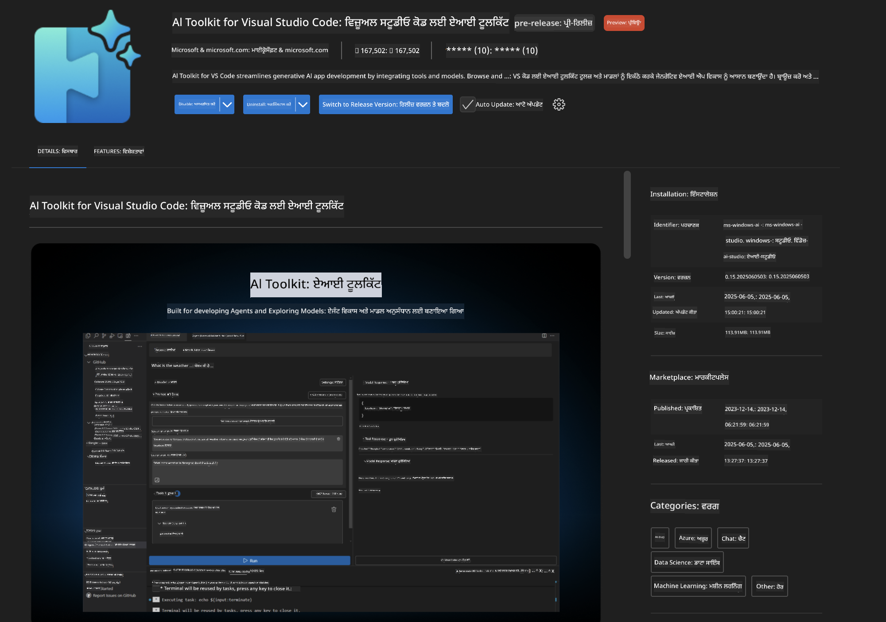
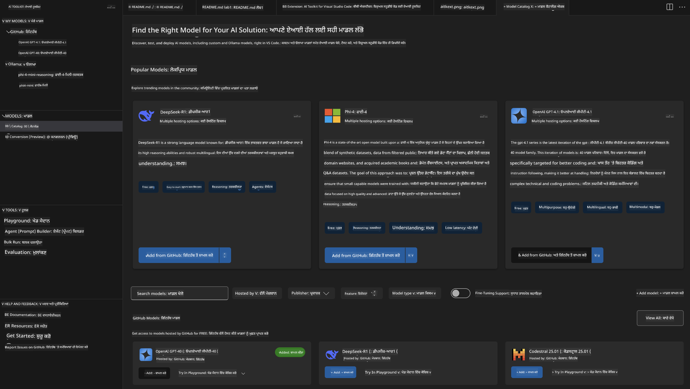
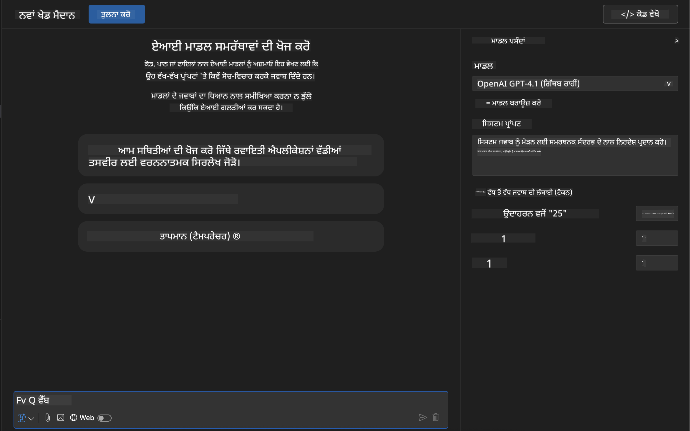
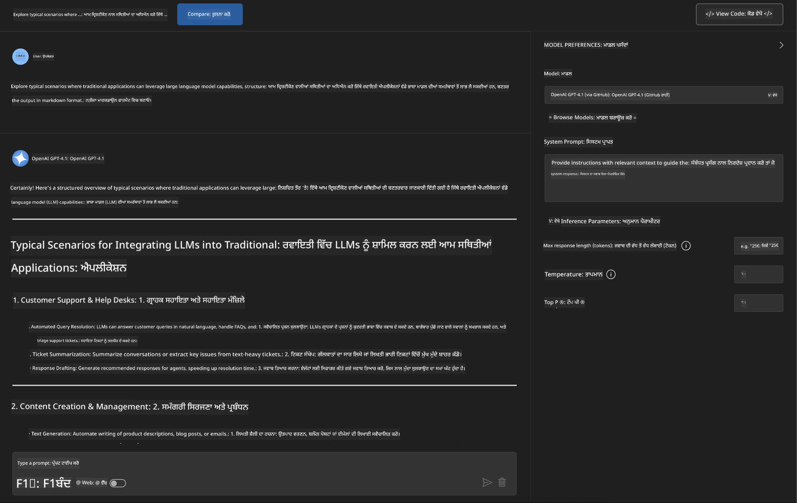
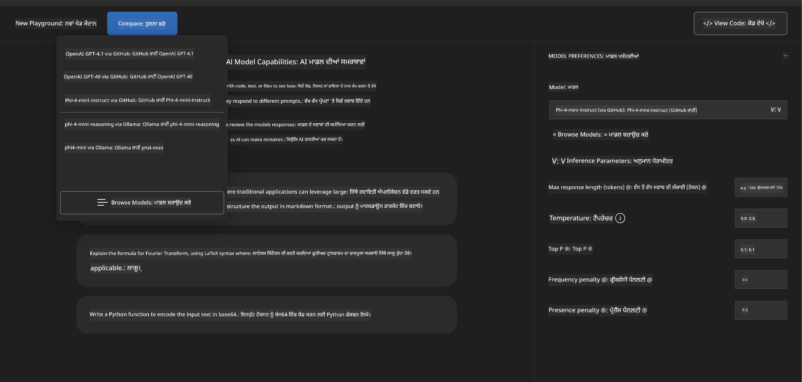
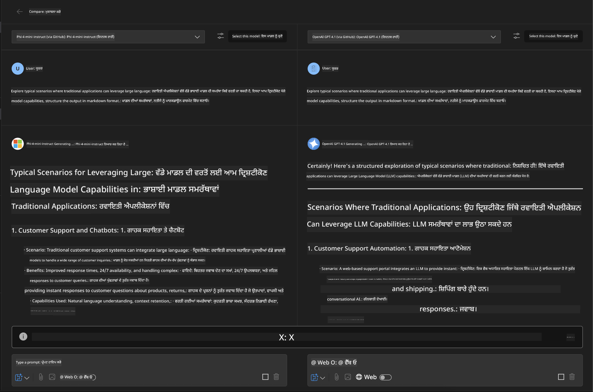
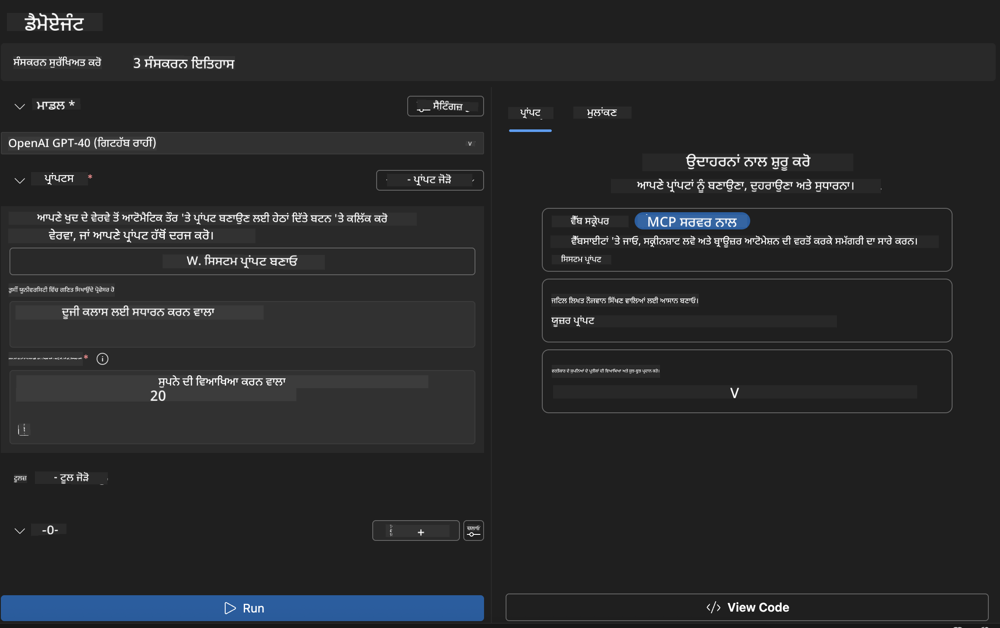

<!--
CO_OP_TRANSLATOR_METADATA:
{
  "original_hash": "2aa9dbc165e104764fa57e8a0d3f1c73",
  "translation_date": "2025-07-14T07:24:31+00:00",
  "source_file": "10-StreamliningAIWorkflowsBuildingAnMCPServerWithAIToolkit/lab1/README.md",
  "language_code": "pa"
}
-->
# 🚀 ਮੋਡੀਊਲ 1: AI ਟੂਲਕਿਟ ਬੁਨਿਆਦੀ ਜਾਣਕਾਰੀਆਂ

[]()
[]()
[]()

## 📋 ਸਿੱਖਣ ਦੇ ਲਕੜੀ

ਇਸ ਮੋਡੀਊਲ ਦੇ ਅੰਤ ਤੱਕ, ਤੁਸੀਂ ਸਮਰੱਥ ਹੋਵੋਗੇ:
- ✅ Visual Studio Code ਲਈ AI Toolkit ਇੰਸਟਾਲ ਅਤੇ ਸੰਰਚਿਤ ਕਰਨਾ
- ✅ ਮਾਡਲ ਕੈਟਾਲੌਗ ਵਿੱਚ ਨੈਵੀਗੇਟ ਕਰਨਾ ਅਤੇ ਵੱਖ-ਵੱਖ ਮਾਡਲ ਸਰੋਤਾਂ ਨੂੰ ਸਮਝਣਾ
- ✅ ਮਾਡਲ ਟੈਸਟਿੰਗ ਅਤੇ ਪ੍ਰਯੋਗ ਲਈ Playground ਦੀ ਵਰਤੋਂ ਕਰਨਾ
- ✅ Agent Builder ਦੀ ਵਰਤੋਂ ਕਰਕੇ ਕਸਟਮ AI ਏਜੰਟ ਬਣਾਉਣਾ
- ✅ ਵੱਖ-ਵੱਖ ਪ੍ਰਦਾਤਾਵਾਂ ਦੇ ਮਾਡਲ ਪ੍ਰਦਰਸ਼ਨ ਦੀ ਤੁਲਨਾ ਕਰਨਾ
- ✅ ਪ੍ਰਾਂਪਟ ਇੰਜੀਨੀਅਰਿੰਗ ਲਈ ਸਰਵੋਤਮ ਅਭਿਆਸ ਲਾਗੂ ਕਰਨਾ

## 🧠 AI Toolkit (AITK) ਦਾ ਪਰਿਚਯ

**AI Toolkit for Visual Studio Code** ਮਾਈਕ੍ਰੋਸਾਫਟ ਦਾ ਪ੍ਰਮੁੱਖ ਐਕਸਟੈਂਸ਼ਨ ਹੈ ਜੋ VS Code ਨੂੰ ਇੱਕ ਪੂਰਨ AI ਵਿਕਾਸ ਵਾਤਾਵਰਣ ਵਿੱਚ ਬਦਲ ਦਿੰਦਾ ਹੈ। ਇਹ AI ਖੋਜ ਅਤੇ ਵਾਸਤਵਿਕ ਐਪਲੀਕੇਸ਼ਨ ਵਿਕਾਸ ਦੇ ਵਿਚਕਾਰ ਪੁਲ ਬਣਾਉਂਦਾ ਹੈ, ਜਿਸ ਨਾਲ ਜਨਰੇਟਿਵ AI ਹਰ ਤਰ੍ਹਾਂ ਦੇ ਵਿਕਾਸਕਾਰਾਂ ਲਈ ਸੌਖਾ ਹੋ ਜਾਂਦਾ ਹੈ।

### 🌟 ਮੁੱਖ ਖੂਬੀਆਂ

| ਫੀਚਰ | ਵੇਰਵਾ | ਵਰਤੋਂ ਦਾ ਮਾਮਲਾ |
|---------|-------------|----------|
| **🗂️ ਮਾਡਲ ਕੈਟਾਲੌਗ** | GitHub, ONNX, OpenAI, Anthropic, Google ਤੋਂ 100+ ਮਾਡਲਾਂ ਤੱਕ ਪਹੁੰਚ | ਮਾਡਲ ਖੋਜ ਅਤੇ ਚੋਣ |
| **🔌 BYOM ਸਹਾਇਤਾ** | ਆਪਣੇ ਮਾਡਲ (ਲੋਕਲ/ਰਿਮੋਟ) ਨੂੰ ਜੋੜੋ | ਕਸਟਮ ਮਾਡਲ ਤੈਨਾਤੀ |
| **🎮 ਇੰਟਰਐਕਟਿਵ Playground** | ਚੈਟ ਇੰਟਰਫੇਸ ਨਾਲ ਰੀਅਲ-ਟਾਈਮ ਮਾਡਲ ਟੈਸਟਿੰਗ | ਤੇਜ਼ ਪ੍ਰੋਟੋਟਾਈਪਿੰਗ ਅਤੇ ਟੈਸਟਿੰਗ |
| **📎 ਮਲਟੀ-ਮੋਡਲ ਸਹਾਇਤਾ** | ਟੈਕਸਟ, ਚਿੱਤਰ ਅਤੇ ਅਟੈਚਮੈਂਟਸ ਨੂੰ ਸੰਭਾਲੋ | ਜਟਿਲ AI ਐਪਲੀਕੇਸ਼ਨ |
| **⚡ ਬੈਚ ਪ੍ਰੋਸੈਸਿੰਗ** | ਇੱਕ ਸਮੇਂ ਕਈ ਪ੍ਰਾਂਪਟ ਚਲਾਓ | ਪ੍ਰਭਾਵਸ਼ਾਲੀ ਟੈਸਟਿੰਗ ਵਰਕਫਲੋਜ਼ |
| **📊 ਮਾਡਲ ਮੁਲਾਂਕਣ** | ਬਿਲਟ-ਇਨ ਮੈਟ੍ਰਿਕਸ (F1, ਸਬੰਧਤਾ, ਸਮਾਨਤਾ, ਸੰਗਤਤਾ) | ਪ੍ਰਦਰਸ਼ਨ ਮੁਲਾਂਕਣ |

### 🎯 AI Toolkit ਕਿਉਂ ਮਹੱਤਵਪੂਰਨ ਹੈ

- **🚀 ਤੇਜ਼ ਵਿਕਾਸ**: ਵਿਚਾਰ ਤੋਂ ਪ੍ਰੋਟੋਟਾਈਪ ਤੱਕ ਕੁਝ ਮਿੰਟਾਂ ਵਿੱਚ
- **🔄 ਇਕਜੁੱਟ ਵਰਕਫਲੋ**: ਕਈ AI ਪ੍ਰਦਾਤਾਵਾਂ ਲਈ ਇੱਕ ਇੰਟਰਫੇਸ
- **🧪 ਆਸਾਨ ਪ੍ਰਯੋਗ**: ਬਿਨਾਂ ਜਟਿਲ ਸੈਟਅੱਪ ਦੇ ਮਾਡਲਾਂ ਦੀ ਤੁਲਨਾ ਕਰੋ
- **📈 ਉਤਪਾਦਨ ਲਈ ਤਿਆਰ**: ਪ੍ਰੋਟੋਟਾਈਪ ਤੋਂ ਤੈਨਾਤੀ ਤੱਕ ਬਿਨਾਂ ਰੁਕਾਵਟ ਦੇ ਬਦਲਾਅ

## 🛠️ ਲੋੜੀਂਦੇ ਚੀਜ਼ਾਂ ਅਤੇ ਸੈਟਅੱਪ

### 📦 AI Toolkit ਐਕਸਟੈਂਸ਼ਨ ਇੰਸਟਾਲ ਕਰੋ

**ਕਦਮ 1: ਐਕਸਟੈਂਸ਼ਨ ਮਾਰਕੀਟਪਲੇਸ ਤੱਕ ਪਹੁੰਚੋ**
1. Visual Studio Code ਖੋਲ੍ਹੋ
2. ਐਕਸਟੈਂਸ਼ਨ ਵਿਊ ਤੇ ਜਾਓ (`Ctrl+Shift+X` ਜਾਂ `Cmd+Shift+X`)
3. "AI Toolkit" ਖੋਜੋ

**ਕਦਮ 2: ਆਪਣਾ ਵਰਜਨ ਚੁਣੋ**
- **🟢 ਰਿਲੀਜ਼**: ਉਤਪਾਦਨ ਲਈ ਸਿਫਾਰਸ਼ੀ
- **🔶 ਪ੍ਰੀ-ਰਿਲੀਜ਼**: ਨਵੇਂ ਫੀਚਰਾਂ ਲਈ ਪਹਿਲਾਂ ਪਹੁੰਚ

**ਕਦਮ 3: ਇੰਸਟਾਲ ਅਤੇ ਐਕਟੀਵੇਟ ਕਰੋ**



### ✅ ਜਾਂਚ ਸੂਚੀ
- [ ] AI Toolkit ਆਈਕਨ VS Code ਸਾਈਡਬਾਰ ਵਿੱਚ ਦਿਖਾਈ ਦੇ ਰਿਹਾ ਹੈ
- [ ] ਐਕਸਟੈਂਸ਼ਨ ਚਾਲੂ ਅਤੇ ਐਕਟੀਵੇਟ ਹੈ
- [ ] ਆਉਟਪੁੱਟ ਪੈਨਲ ਵਿੱਚ ਕੋਈ ਇੰਸਟਾਲੇਸ਼ਨ ਗਲਤੀ ਨਹੀਂ

## 🧪 ਹੱਥ-ਅਨ ਅਭਿਆਸ 1: GitHub ਮਾਡਲਾਂ ਦੀ ਖੋਜ

**🎯 ਲਕੜੀ**: ਮਾਡਲ ਕੈਟਾਲੌਗ ਵਿੱਚ ਮਾਹਰ ਬਣੋ ਅਤੇ ਆਪਣਾ ਪਹਿਲਾ AI ਮਾਡਲ ਟੈਸਟ ਕਰੋ

### 📊 ਕਦਮ 1: ਮਾਡਲ ਕੈਟਾਲੌਗ ਵਿੱਚ ਨੈਵੀਗੇਟ ਕਰੋ

ਮਾਡਲ ਕੈਟਾਲੌਗ ਤੁਹਾਡਾ AI ਪਰਿਵਾਰ ਦਾ ਦਰਵਾਜ਼ਾ ਹੈ। ਇਹ ਕਈ ਪ੍ਰਦਾਤਾਵਾਂ ਤੋਂ ਮਾਡਲ ਇਕੱਠੇ ਕਰਦਾ ਹੈ, ਜਿਸ ਨਾਲ ਚੋਣ ਅਤੇ ਤੁਲਨਾ ਆਸਾਨ ਹੋ ਜਾਂਦੀ ਹੈ।

**🔍 ਨੈਵੀਗੇਸ਼ਨ ਗਾਈਡ:**

AI Toolkit ਸਾਈਡਬਾਰ ਵਿੱਚ **MODELS - Catalog** 'ਤੇ ਕਲਿੱਕ ਕਰੋ



**💡 ਪ੍ਰੋ ਟਿਪ**: ਆਪਣੇ ਵਰਤੋਂ ਦੇ ਮਾਮਲੇ ਨਾਲ ਮੇਲ ਖਾਂਦੇ ਖਾਸ ਖੂਬੀਆਂ ਵਾਲੇ ਮਾਡਲਾਂ ਨੂੰ ਲੱਭੋ (ਜਿਵੇਂ ਕੋਡ ਜਨਰੇਸ਼ਨ, ਰਚਨਾਤਮਕ ਲਿਖਾਈ, ਵਿਸ਼ਲੇਸ਼ਣ)।

**⚠️ Note**: GitHub-ਹੋਸਟ ਕੀਤੇ ਮਾਡਲ (ਜਿਵੇਂ GitHub Models) ਮੁਫ਼ਤ ਹਨ ਪਰ ਬੇਨਤੀਆਂ ਅਤੇ ਟੋਕਨ ਲਈ ਰੇਟ ਸੀਮਾਵਾਂ ਦੇ ਅਧੀਨ ਹਨ। ਜੇ ਤੁਸੀਂ ਗਿਟਹੱਬ ਤੋਂ ਬਾਹਰ ਦੇ ਮਾਡਲ (ਜਿਵੇਂ Azure AI ਜਾਂ ਹੋਰ ਐਂਡਪੌਇੰਟਾਂ ਦੁਆਰਾ ਹੋਸਟ ਕੀਤੇ) ਤੱਕ ਪਹੁੰਚਣਾ ਚਾਹੁੰਦੇ ਹੋ, ਤਾਂ ਤੁਹਾਨੂੰ ਸਹੀ API ਕੁੰਜੀ ਜਾਂ ਪ੍ਰਮਾਣਿਕਤਾ ਦੇਣੀ ਪਵੇਗੀ।

### 🚀 ਕਦਮ 2: ਆਪਣਾ ਪਹਿਲਾ ਮਾਡਲ ਸ਼ਾਮਲ ਕਰੋ ਅਤੇ ਸੰਰਚਿਤ ਕਰੋ

**ਮਾਡਲ ਚੋਣ ਰਣਨੀਤੀ:**
- **GPT-4.1**: ਜਟਿਲ ਤਰਕ ਅਤੇ ਵਿਸ਼ਲੇਸ਼ਣ ਲਈ ਸਭ ਤੋਂ ਵਧੀਆ
- **Phi-4-mini**: ਸਧਾਰਣ ਕੰਮਾਂ ਲਈ ਹਲਕਾ ਅਤੇ ਤੇਜ਼ ਜਵਾਬ

**🔧 ਸੰਰਚਨਾ ਪ੍ਰਕਿਰਿਆ:**
1. ਕੈਟਾਲੌਗ ਵਿੱਚੋਂ **OpenAI GPT-4.1** ਚੁਣੋ
2. **Add to My Models** 'ਤੇ ਕਲਿੱਕ ਕਰੋ - ਇਸ ਨਾਲ ਮਾਡਲ ਵਰਤੋਂ ਲਈ ਦਰਜ ਹੋ ਜਾਵੇਗਾ
3. **Try in Playground** ਚੁਣੋ ਤਾਂ ਜੋ ਟੈਸਟਿੰਗ ਵਾਤਾਵਰਣ ਖੁਲ ਜਾਵੇ
4. ਮਾਡਲ ਸ਼ੁਰੂਆਤ ਲਈ ਇੰਤਜ਼ਾਰ ਕਰੋ (ਪਹਿਲੀ ਵਾਰੀ ਸੈਟਅੱਪ ਵਿੱਚ ਕੁਝ ਸਮਾਂ ਲੱਗ ਸਕਦਾ ਹੈ)



**⚙️ ਮਾਡਲ ਪੈਰਾਮੀਟਰ ਸਮਝਣਾ:**
- **Temperature**: ਰਚਨਾਤਮਕਤਾ ਨੂੰ ਨਿਯੰਤਰਿਤ ਕਰਦਾ ਹੈ (0 = ਨਿਰਧਾਰਿਤ, 1 = ਰਚਨਾਤਮਕ)
- **Max Tokens**: ਜਵਾਬ ਦੀ ਵੱਧ ਤੋਂ ਵੱਧ ਲੰਬਾਈ
- **Top-p**: ਜਵਾਬ ਦੀ ਵੱਖ-ਵੱਖਤਾ ਲਈ ਨਿਊਕਲੀਅਸ ਸੈਂਪਲਿੰਗ

### 🎯 ਕਦਮ 3: Playground ਇੰਟਰਫੇਸ ਵਿੱਚ ਮਾਹਰ ਬਣੋ

Playground ਤੁਹਾਡਾ AI ਪ੍ਰਯੋਗਸ਼ਾਲਾ ਹੈ। ਇਸਦੀ ਪੂਰੀ ਸਮਰੱਥਾ ਵਰਤਣ ਲਈ ਇਹਨਾਂ ਗੱਲਾਂ ਦਾ ਧਿਆਨ ਰੱਖੋ:

**🎨 ਪ੍ਰਾਂਪਟ ਇੰਜੀਨੀਅਰਿੰਗ ਦੇ ਸਰਵੋਤਮ ਅਭਿਆਸ:**
1. **ਸਪਸ਼ਟ ਹੋਵੋ**: ਸਾਫ਼ ਅਤੇ ਵਿਸਥਾਰਪੂਰਕ ਹੁਕਮ ਬਿਹਤਰ ਨਤੀਜੇ ਦਿੰਦੇ ਹਨ
2. **ਸੰਦਰਭ ਦਿਓ**: ਸੰਬੰਧਿਤ ਪਿਛੋਕੜ ਜਾਣਕਾਰੀ ਸ਼ਾਮਲ ਕਰੋ
3. **ਉਦਾਹਰਣਾਂ ਵਰਤੋਂ**: ਮਾਡਲ ਨੂੰ ਦਿਖਾਓ ਕਿ ਤੁਸੀਂ ਕੀ ਚਾਹੁੰਦੇ ਹੋ
4. **ਦੋਹਰਾਓ**: ਸ਼ੁਰੂਆਤੀ ਨਤੀਜਿਆਂ ਦੇ ਆਧਾਰ 'ਤੇ ਪ੍ਰਾਂਪਟ ਸੁਧਾਰੋ

**🧪 ਟੈਸਟਿੰਗ ਸਥਿਤੀਆਂ:**
```markdown
# Example 1: Code Generation
"Write a Python function that calculates the factorial of a number using recursion. Include error handling and docstrings."

# Example 2: Creative Writing
"Write a professional email to a client explaining a project delay, maintaining a positive tone while being transparent about challenges."

# Example 3: Data Analysis
"Analyze this sales data and provide insights: [paste your data]. Focus on trends, anomalies, and actionable recommendations."
```



### 🏆 ਚੈਲੰਜ ਅਭਿਆਸ: ਮਾਡਲ ਪ੍ਰਦਰਸ਼ਨ ਦੀ ਤੁਲਨਾ

**🎯 ਲਕੜੀ**: ਇੱਕੋ ਜਿਹੇ ਪ੍ਰਾਂਪਟਾਂ ਨਾਲ ਵੱਖ-ਵੱਖ ਮਾਡਲਾਂ ਦੀ ਤੁਲਨਾ ਕਰਕੇ ਉਹਨਾਂ ਦੀਆਂ ਖੂਬੀਆਂ ਸਮਝੋ

**📋 ਹਦਾਇਤਾਂ:**
1. **Phi-4-mini** ਨੂੰ ਆਪਣੇ ਵਰਕਸਪੇਸ ਵਿੱਚ ਸ਼ਾਮਲ ਕਰੋ
2. GPT-4.1 ਅਤੇ Phi-4-mini ਦੋਹਾਂ ਲਈ ਇੱਕੋ ਜਿਹਾ ਪ੍ਰਾਂਪਟ ਵਰਤੋਂ



3. ਜਵਾਬ ਦੀ ਗੁਣਵੱਤਾ, ਗਤੀ ਅਤੇ ਸਹੀਤਾ ਦੀ ਤੁਲਨਾ ਕਰੋ
4. ਆਪਣੇ ਨਤੀਜੇ ਨਤੀਜਾ ਸੈਕਸ਼ਨ ਵਿੱਚ ਦਰਜ ਕਰੋ



**💡 ਖੋਜਣ ਲਈ ਮੁੱਖ ਗੱਲਾਂ:**
- LLM ਅਤੇ SLM ਕਦੋਂ ਵਰਤਣੇ
- ਲਾਗਤ ਅਤੇ ਪ੍ਰਦਰਸ਼ਨ ਵਿਚਕਾਰ ਤਰਜੀਹ
- ਵੱਖ-ਵੱਖ ਮਾਡਲਾਂ ਦੀ ਖਾਸ ਖੂਬੀਆਂ

## 🤖 ਹੱਥ-ਅਨ ਅਭਿਆਸ 2: Agent Builder ਨਾਲ ਕਸਟਮ ਏਜੰਟ ਬਣਾਉਣਾ

**🎯 ਲਕੜੀ**: ਖਾਸ ਕੰਮਾਂ ਅਤੇ ਵਰਕਫਲੋਜ਼ ਲਈ ਵਿਸ਼ੇਸ਼ AI ਏਜੰਟ ਬਣਾਉਣਾ

### 🏗️ ਕਦਮ 1: Agent Builder ਨੂੰ ਸਮਝਣਾ

Agent Builder AI Toolkit ਦੀ ਅਸਲੀ ਤਾਕਤ ਹੈ। ਇਹ ਤੁਹਾਨੂੰ ਵੱਡੇ ਭਾਸ਼ਾ ਮਾਡਲਾਂ ਦੀ ਤਾਕਤ ਨੂੰ ਕਸਟਮ ਹੁਕਮਾਂ, ਖਾਸ ਪੈਰਾਮੀਟਰਾਂ ਅਤੇ ਵਿਸ਼ੇਸ਼ ਗਿਆਨ ਨਾਲ ਜੋੜ ਕੇ ਮਕਸਦ-ਨਿਰਧਾਰਿਤ AI ਸਹਾਇਕ ਬਣਾਉਣ ਦੀ ਆਗਿਆ ਦਿੰਦਾ ਹੈ।

**🧠 Agent ਆਰਕੀਟੈਕਚਰ ਦੇ ਹਿੱਸੇ:**
- **ਮੁੱਖ ਮਾਡਲ**: ਬੁਨਿਆਦੀ LLM (GPT-4, Groks, Phi ਆਦਿ)
- **ਸਿਸਟਮ ਪ੍ਰਾਂਪਟ**: ਏਜੰਟ ਦੀ ਸ਼ਖਸੀਅਤ ਅਤੇ ਵਰਤਾਰਾ ਨਿਰਧਾਰਤ ਕਰਦਾ ਹੈ
- **ਪੈਰਾਮੀਟਰ**: ਸਰਵੋਤਮ ਪ੍ਰਦਰਸ਼ਨ ਲਈ ਸੁਧਾਰੇ ਗਏ ਸੈਟਿੰਗਜ਼
- **ਟੂਲ ਇੰਟੀਗ੍ਰੇਸ਼ਨ**: ਬਾਹਰੀ API ਅਤੇ MCP ਸੇਵਾਵਾਂ ਨਾਲ ਜੁੜਨਾ
- **ਮੈਮੋਰੀ**: ਗੱਲਬਾਤ ਦਾ ਸੰਦਰਭ ਅਤੇ ਸੈਸ਼ਨ ਸਥਿਰਤਾ



### ⚙️ ਕਦਮ 2: Agent ਸੰਰਚਨਾ ਦੀ ਵਿਸਥਾਰਪੂਰਕ ਜਾਣਕਾਰੀ

**🎨 ਪ੍ਰਭਾਵਸ਼ਾਲੀ ਸਿਸਟਮ ਪ੍ਰਾਂਪਟ ਬਣਾਉਣਾ:**
```markdown
# Template Structure:
## Role Definition
You are a [specific role] with expertise in [domain].

## Capabilities
- List specific abilities
- Define scope of knowledge
- Clarify limitations

## Behavior Guidelines
- Response style (formal, casual, technical)
- Output format preferences
- Error handling approach

## Examples
Provide 2-3 examples of ideal interactions
```

*ਬਿਲਕੁਲ, ਤੁਸੀਂ Generate System Prompt ਦੀ ਵਰਤੋਂ ਕਰਕੇ AI ਦੀ ਮਦਦ ਨਾਲ ਪ੍ਰਾਂਪਟ ਬਣਾਉਣ ਅਤੇ ਸੁਧਾਰ ਕਰਨ ਲਈ ਵੀ ਇਸਦਾ ਇਸਤੇਮਾਲ ਕਰ ਸਕਦੇ ਹੋ*

**🔧 ਪੈਰਾਮੀਟਰ ਅਪਟੀਮਾਈਜ਼ੇਸ਼ਨ:**
| ਪੈਰਾਮੀਟਰ | ਸਿਫਾਰਸ਼ੀ ਰੇਂਜ | ਵਰਤੋਂ ਦਾ ਮਾਮਲਾ |
|-----------|------------------|----------|
| **Temperature** | 0.1-0.3 | ਤਕਨੀਕੀ/ਤੱਥੀ ਜਵਾਬ |
| **Temperature** | 0.7-0.9 | ਰਚਨਾਤਮਕ/ਵਿਚਾਰ-ਵਟਾਂਦਰਾ ਕੰਮ |
| **Max Tokens** | 500-1000 | ਸੰਖੇਪ ਜਵਾਬ |
| **Max Tokens** | 2000-4000 | ਵਿਸਥਾਰਪੂਰਕ ਵਿਆਖਿਆਵਾਂ |

### 🐍 ਕਦਮ 3: ਪ੍ਰਯੋਗਾਤਮਕ ਅਭਿਆਸ - Python ਪ੍ਰੋਗ੍ਰਾਮਿੰਗ ਏਜੰਟ

**🎯 ਮਿਸ਼ਨ**: ਖਾਸ Python ਕੋਡਿੰਗ ਸਹਾਇਕ ਬਣਾਉਣਾ

**📋 ਸੰਰਚਨਾ ਕਦਮ:**

1. **ਮਾਡਲ ਚੋਣ**: **Claude 3.5 Sonnet** ਚੁਣੋ (ਕੋਡ ਲਈ ਬਹੁਤ ਵਧੀਆ)

2. **ਸਿਸਟਮ ਪ੍ਰਾਂਪਟ ਡਿਜ਼ਾਈਨ**:
```markdown
# Python Programming Expert Agent

## Role
You are a senior Python developer with 10+ years of experience. You excel at writing clean, efficient, and well-documented Python code.

## Capabilities
- Write production-ready Python code
- Debug complex issues
- Explain code concepts clearly
- Suggest best practices and optimizations
- Provide complete working examples

## Response Format
- Always include docstrings
- Add inline comments for complex logic
- Suggest testing approaches
- Mention relevant libraries when applicable

## Code Quality Standards
- Follow PEP 8 style guidelines
- Use type hints where appropriate
- Handle exceptions gracefully
- Write readable, maintainable code
```

3. **ਪੈਰਾਮੀਟਰ ਸੰਰਚਨਾ**:
   - Temperature: 0.2 (ਸਥਿਰ ਅਤੇ ਭਰੋਸੇਮੰਦ ਕੋਡ ਲਈ)
   - Max Tokens: 2000 (ਵਿਸਥਾਰਪੂਰਕ ਵਿਆਖਿਆਵਾਂ)
   - Top-p: 0.9 (ਸੰਤੁਲਿਤ ਰਚਨਾਤਮਕਤਾ)


### 🧪 ਕਦਮ 4: ਆਪਣੇ Python ਏਜੰਟ ਦੀ ਟੈਸਟਿੰਗ

**ਟੈਸਟ ਸਥਿਤੀਆਂ:**
1. **ਮੂਲ ਫੰਕਸ਼ਨ**: "ਪ੍ਰਾਈਮ ਨੰਬਰ ਲੱਭਣ ਲਈ ਫੰਕਸ਼ਨ ਬਣਾਓ"
2. **ਜਟਿਲ ਅਲਗੋਰਿਦਮ**: "ਇੰਸਰਟ, ਡਿਲੀਟ ਅਤੇ ਖੋਜ ਮੈਥਡਾਂ ਨਾਲ ਬਾਈਨਰੀ ਸਰਚ ਟ੍ਰੀ ਲਾਗੂ ਕਰੋ"
3. **ਅਸਲੀ ਦੁਨੀਆ ਦੀ ਸਮੱਸਿਆ**: "ਇੱਕ ਵੈੱਬ ਸਕ੍ਰੈਪਰ ਬਣਾਓ ਜੋ ਰੇਟ ਲਿਮਿਟਿੰਗ ਅਤੇ ਰੀਟ੍ਰਾਈਜ਼ ਨੂੰ ਸੰਭਾਲਦਾ ਹੈ"
4. **ਡਿਬੱਗਿੰਗ**: "ਇਸ ਕੋਡ ਨੂੰ ਠੀਕ ਕਰੋ [ਬੱਗੀ ਕੋਡ ਪੇਸਟ ਕਰੋ]"

**🏆 ਸਫਲਤਾ ਮਾਪਦੰਡ:**
- ✅ ਕੋਡ ਬਿਨਾਂ ਗਲਤੀਆਂ ਦੇ ਚੱਲਦਾ ਹੈ
- ✅ ਢੰਗ ਨਾਲ ਦਸਤਾਵੇਜ਼ੀਕਰਨ ਸ਼ਾਮਲ ਹੈ
- ✅ Python ਦੇ ਸਰਵੋਤਮ ਅਭਿਆਸਾਂ ਦੀ ਪਾਲਣਾ ਕਰਦਾ ਹੈ
- ✅ ਸਾਫ਼ ਵਿਆਖਿਆਵਾਂ ਦਿੰਦਾ ਹੈ
- ✅ ਸੁਧਾਰਾਂ ਦੀ ਸਿਫਾਰਸ਼ ਕਰਦਾ ਹੈ

## 🎓 ਮੋਡੀਊਲ 1 ਸੰਖੇਪ ਅਤੇ ਅਗਲੇ ਕਦਮ

### 📊 ਗਿਆਨ ਜਾਂਚ

ਆਪਣੀ ਸਮਝ ਦੀ ਜਾਂਚ ਕਰੋ:
- [ ] ਕੀ ਤੁਸੀਂ ਕੈਟਾਲੌਗ ਵਿੱਚ ਮਾਡਲਾਂ ਦੇ ਫਰਕ ਨੂੰ ਸਮਝਾ ਸਕਦੇ ਹੋ?
- [ ] ਕੀ ਤੁਸੀਂ ਕਸਟਮ ਏਜੰਟ ਸਫਲਤਾਪੂਰਵਕ ਬਣਾਇਆ ਅਤੇ ਟੈਸਟ ਕੀਤਾ ਹੈ?
- [ ] ਕੀ ਤੁਸੀਂ ਵੱਖ-ਵੱਖ ਵਰਤੋਂ ਦੇ ਮਾਮਲਿਆਂ ਲਈ ਪੈਰਾਮੀਟਰਾਂ ਨੂੰ ਅਪਟੀਮਾਈਜ਼ ਕਰਨਾ ਸਮਝਦੇ ਹੋ?
- [ ] ਕੀ ਤੁਸੀਂ ਪ੍ਰਭਾਵਸ਼ਾਲੀ ਸਿਸਟਮ ਪ੍ਰਾਂਪਟ ਡਿਜ਼ਾਈਨ ਕਰ ਸਕਦੇ ਹੋ?

### 📚 ਵਾਧੂ ਸਰੋਤ

- **AI Toolkit ਦਸਤਾਵੇਜ਼ੀਕਰਨ**: [Official Microsoft Docs](https://github.com/microsoft/vscode-ai-toolkit)
- **Prompt Engineering Guide**: [Best Practices](https://platform.openai.com/docs/guides/prompt-engineering)
- **AI Toolkit ਵਿੱਚ ਮਾਡਲ**: [Models in Development](https://github.com/microsoft/vscode-ai-toolkit/blob/main/doc/models.md)

**🎉 ਵਧ

**ਅਸਵੀਕਾਰੋਪੱਤਰ**:  
ਇਹ ਦਸਤਾਵੇਜ਼ AI ਅਨੁਵਾਦ ਸੇਵਾ [Co-op Translator](https://github.com/Azure/co-op-translator) ਦੀ ਵਰਤੋਂ ਕਰਕੇ ਅਨੁਵਾਦਿਤ ਕੀਤਾ ਗਿਆ ਹੈ। ਜਦੋਂ ਕਿ ਅਸੀਂ ਸਹੀਤਾ ਲਈ ਕੋਸ਼ਿਸ਼ ਕਰਦੇ ਹਾਂ, ਕਿਰਪਾ ਕਰਕੇ ਧਿਆਨ ਰੱਖੋ ਕਿ ਸਵੈਚਾਲਿਤ ਅਨੁਵਾਦਾਂ ਵਿੱਚ ਗਲਤੀਆਂ ਜਾਂ ਅਸਮਰਥਤਾਵਾਂ ਹੋ ਸਕਦੀਆਂ ਹਨ। ਮੂਲ ਦਸਤਾਵੇਜ਼ ਆਪਣੀ ਮੂਲ ਭਾਸ਼ਾ ਵਿੱਚ ਪ੍ਰਮਾਣਿਕ ਸਰੋਤ ਮੰਨਿਆ ਜਾਣਾ ਚਾਹੀਦਾ ਹੈ। ਮਹੱਤਵਪੂਰਨ ਜਾਣਕਾਰੀ ਲਈ, ਪੇਸ਼ੇਵਰ ਮਨੁੱਖੀ ਅਨੁਵਾਦ ਦੀ ਸਿਫਾਰਸ਼ ਕੀਤੀ ਜਾਂਦੀ ਹੈ। ਇਸ ਅਨੁਵਾਦ ਦੀ ਵਰਤੋਂ ਤੋਂ ਉਤਪੰਨ ਕਿਸੇ ਵੀ ਗਲਤਫਹਿਮੀ ਜਾਂ ਗਲਤ ਵਿਆਖਿਆ ਲਈ ਅਸੀਂ ਜ਼ਿੰਮੇਵਾਰ ਨਹੀਂ ਹਾਂ।