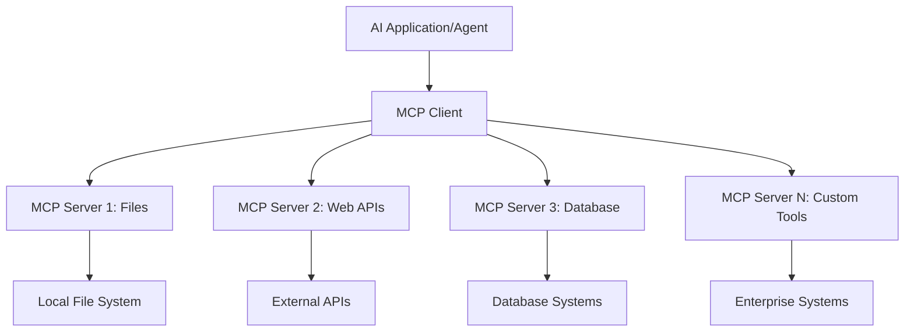
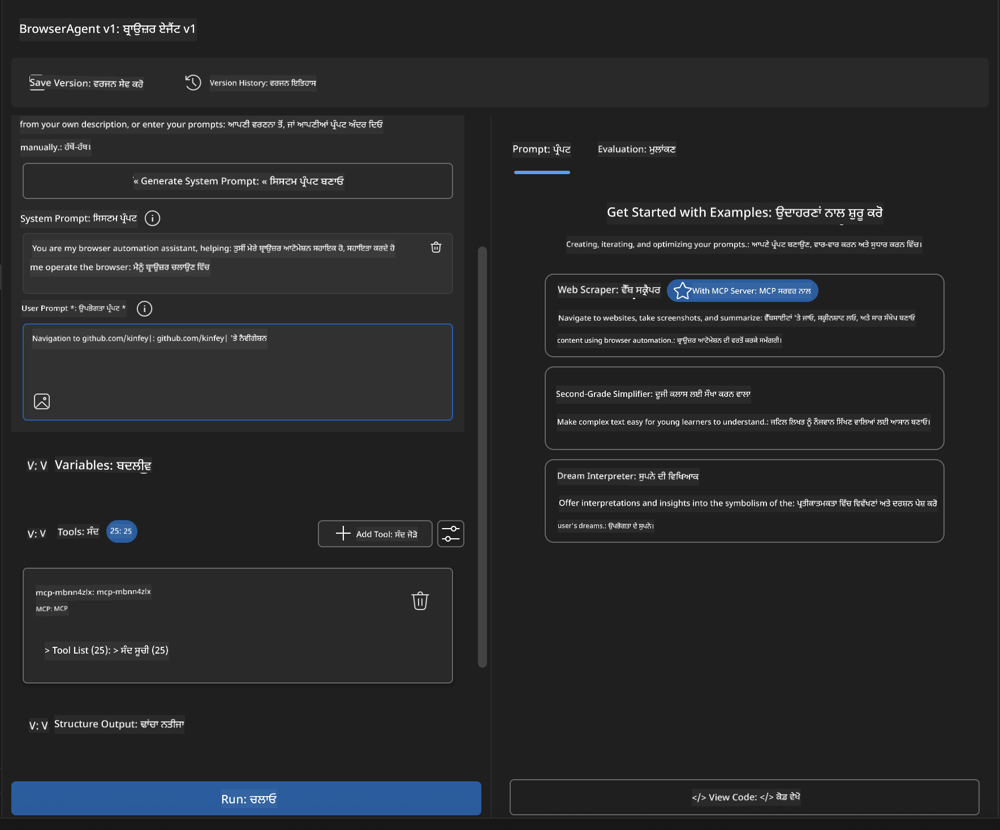
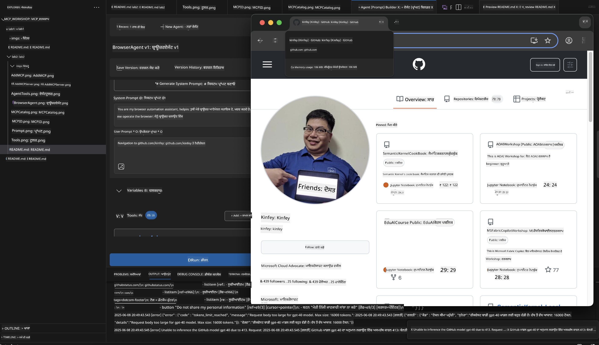
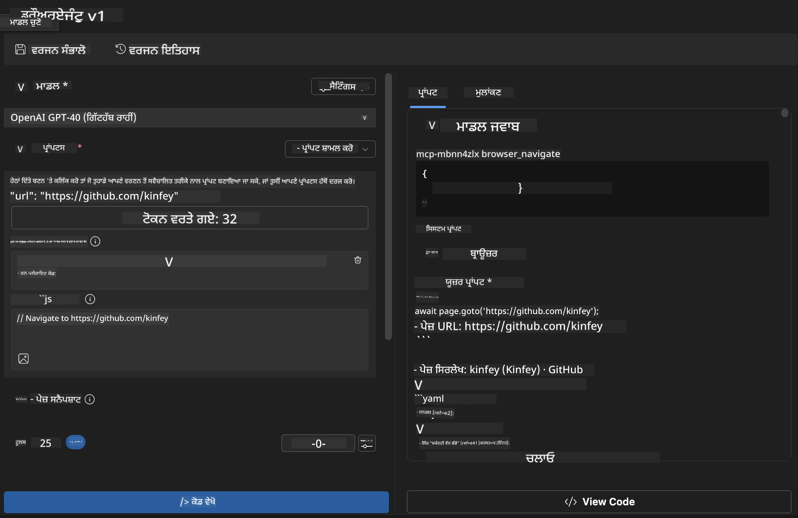
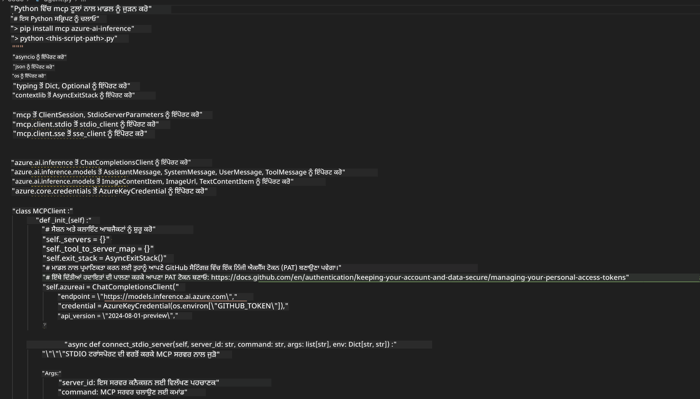

<!--
CO_OP_TRANSLATOR_METADATA:
{
  "original_hash": "a22b7dd11cd7690f99f9195877cafdc3",
  "translation_date": "2025-06-10T05:44:40+00:00",
  "source_file": "10-StreamliningAIWorkflowsBuildingAnMCPServerWithAIToolkit/lab2/README.md",
  "language_code": "pa"
}
-->
# 🌐 ਮੋਡੀਊਲ 2: MCP ਨਾਲ AI ਟੂਲਕਿਟ ਬੁਨਿਆਦੀ ਜਾਣਕਾਰੀਆਂ

[]()
[]()
[]()

## 📋 ਸਿੱਖਣ ਦੇ ਉਦੇਸ਼

ਇਸ ਮੋਡੀਊਲ ਦੇ ਅੰਤ ਤੱਕ, ਤੁਸੀਂ ਸਮਰੱਥ ਹੋਵੋਗੇ:
- ✅ Model Context Protocol (MCP) ਦੀ ਬਣਤਰ ਅਤੇ ਫਾਇਦੇ ਸਮਝਣਾ
- ✅ Microsoft ਦੇ MCP ਸਰਵਰ ਪਰਿਵਾਰ ਦੀ ਖੋਜ ਕਰਨਾ
- ✅ MCP ਸਰਵਰਾਂ ਨੂੰ AI Toolkit Agent Builder ਨਾਲ ਜੋੜਨਾ
- ✅ Playwright MCP ਦੀ ਵਰਤੋਂ ਕਰਕੇ ਇੱਕ ਕਾਰਗਰ ਬ੍ਰਾਊਜ਼ਰ ਆਟੋਮੇਸ਼ਨ ਏਜੰਟ ਬਣਾਉਣਾ
- ✅ ਆਪਣੇ ਏਜੰਟਾਂ ਵਿੱਚ MCP ਟੂਲਾਂ ਨੂੰ ਸੰਰਚਿਤ ਅਤੇ ਟੈਸਟ ਕਰਨਾ
- ✅ MCP-ਚਲਿਤ ਏਜੰਟਾਂ ਨੂੰ ਨਿਰਯਾਤ ਅਤੇ ਉਤਪਾਦਨ ਲਈ ਤਿਆਰ ਕਰਨਾ

## 🎯 ਮੋਡੀਊਲ 1 'ਤੇ ਅਧਾਰਿਤ

ਮੋਡੀਊਲ 1 ਵਿੱਚ, ਅਸੀਂ AI Toolkit ਦੀਆਂ ਬੁਨਿਆਦੀ ਗੱਲਾਂ ਸਿੱਖੀਆਂ ਅਤੇ ਆਪਣਾ ਪਹਿਲਾ Python Agent ਬਣਾਇਆ। ਹੁਣ ਅਸੀਂ ਤੁਹਾਡੇ ਏਜੰਟਾਂ ਨੂੰ ਬਾਹਰੀ ਟੂਲਾਂ ਅਤੇ ਸੇਵਾਵਾਂ ਨਾਲ ਜੋੜ ਕੇ **ਤਾਕਤਵਰ** ਬਣਾਉਂਦੇ ਹਾਂ, ਜਿਸ ਲਈ ਅਸੀਂ ਇਨਕਲਾਬੀ **Model Context Protocol (MCP)** ਦੀ ਵਰਤੋਂ ਕਰਾਂਗੇ।

ਇਸਨੂੰ ਇੱਕ ਬੇਸਿਕ ਕੈਲਕੂਲੇਟਰ ਤੋਂ ਪੂਰੇ ਕੰਪਿਊਟਰ ਵਿੱਚ ਅਪਗਰੇਡ ਕਰਨ ਵਾਂਗ ਸੋਚੋ - ਤੁਹਾਡੇ AI ਏਜੰਟ ਹੁਣ ਸਮਰੱਥ ਹੋਣਗੇ:
- 🌐 ਵੈੱਬਸਾਈਟਾਂ ਤੇ ਬ੍ਰਾਊਜ਼ ਅਤੇ ਇੰਟਰੈਕਟ ਕਰਨ ਲਈ
- 📁 ਫਾਈਲਾਂ ਤੱਕ ਪਹੁੰਚ ਅਤੇ ਉਨ੍ਹਾਂ ਨੂੰ ਸੰਭਾਲਣ ਲਈ
- 🔧 ਐਂਟਰਪ੍ਰਾਈਜ਼ ਸਿਸਟਮਾਂ ਨਾਲ ਇੰਟੀਗ੍ਰੇਟ ਕਰਨ ਲਈ
- 📊 APIs ਤੋਂ ਰੀਅਲ-ਟਾਈਮ ਡਾਟਾ ਪ੍ਰੋਸੈਸ ਕਰਨ ਲਈ

## 🧠 Model Context Protocol (MCP) ਨੂੰ ਸਮਝਣਾ

### 🔍 MCP ਕੀ ਹੈ?

Model Context Protocol (MCP) ਇੱਕ **"USB-C ਵਾਂਗ AI ਐਪਲੀਕੇਸ਼ਨਾਂ ਲਈ"** ਹੈ - ਇੱਕ ਇਨਕਲਾਬੀ ਖੁੱਲਾ ਮਿਆਰ ਜੋ ਵੱਡੇ ਭਾਸ਼ਾ ਮਾਡਲਾਂ (LLMs) ਨੂੰ ਬਾਹਰੀ ਟੂਲਾਂ, ਡਾਟਾ ਸਰੋਤਾਂ ਅਤੇ ਸੇਵਾਵਾਂ ਨਾਲ ਜੋੜਦਾ ਹੈ। ਜਿਵੇਂ USB-C ਨੇ ਕੇਬਲ ਬੇਹਰਮੀ ਨੂੰ ਇੱਕ ਸਰਲ ਕਨੈਕਟਰ ਨਾਲ ਖ਼ਤਮ ਕੀਤਾ, MCP ਵੀ AI ਇੰਟੀਗ੍ਰੇਸ਼ਨ ਦੀ ਜਟਿਲਤਾ ਨੂੰ ਇੱਕ ਮਿਆਰੀ ਪ੍ਰੋਟੋਕੋਲ ਨਾਲ ਦੂਰ ਕਰਦਾ ਹੈ।

### 🎯 MCP ਸਮੱਸਿਆ ਦਾ ਹੱਲ

**MCP ਤੋਂ ਪਹਿਲਾਂ:**
- 🔧 ਹਰ ਟੂਲ ਲਈ ਕਸਟਮ ਇੰਟੀਗ੍ਰੇਸ਼ਨ
- 🔄 ਪ੍ਰੋਪਾਈਟਰੀ ਹੱਲਾਂ ਨਾਲ ਵੇਂਡਰ ਲੌਕ-ਇਨ
- 🔒 ਅਣਚਾਹੇ ਕਨੈਕਸ਼ਨਾਂ ਨਾਲ ਸੁਰੱਖਿਆ ਖ਼ਤਰੇ
- ⏱️ ਬੁਨਿਆਦੀ ਇੰਟੀਗ੍ਰੇਸ਼ਨਾਂ ਲਈ ਮਹੀਨੇ ਲੱਗਦੇ

**MCP ਨਾਲ:**
- ⚡ ਸਿੱਧਾ-ਜੋੜੋ ਟੂਲ ਇੰਟੀਗ੍ਰੇਸ਼ਨ
- 🔄 ਵੇਂਡਰ-ਅਗਨੋਸਟਿਕ ਆਰਕੀਟੈਕਚਰ
- 🛡️ ਅੰਦਰੂਨੀ ਸੁਰੱਖਿਆ ਬਿਹਤਰ ਤਰੀਕੇ
- 🚀 ਨਵੀਆਂ ਸਮਰੱਥਾਵਾਂ ਜੋੜਨ ਲਈ ਕੁਝ ਮਿੰਟ

### 🏗️ MCP ਆਰਕੀਟੈਕਚਰ ਦਾ ਵਿਸਥਾਰ

MCP ਇੱਕ **ਕਲਾਇੰਟ-ਸਰਵਰ ਆਰਕੀਟੈਕਚਰ** ਦੀ ਪਾਲਣਾ ਕਰਦਾ ਹੈ ਜੋ ਇੱਕ ਸੁਰੱਖਿਅਤ ਅਤੇ ਸਕੇਲਬਲ ਇਕੋਸਿਸਟਮ ਬਣਾਉਂਦਾ ਹੈ:



**🔧 ਮੁੱਖ ਹਿੱਸੇ:**

| ਹਿੱਸਾ | ਭੂਮਿਕਾ | ਉਦਾਹਰਣ |
|-----------|------|----------|
| **MCP Hosts** | ਐਪਲੀਕੇਸ਼ਨ ਜੋ MCP ਸੇਵਾਵਾਂ ਵਰਤਦੇ ਹਨ | Claude Desktop, VS Code, AI Toolkit |
| **MCP Clients** | ਪ੍ਰੋਟੋਕੋਲ ਹੈਂਡਲਰ (ਸਰਵਰਾਂ ਨਾਲ 1:1) | ਹੋਸਟ ਐਪਲੀਕੇਸ਼ਨਾਂ ਵਿੱਚ ਬਣੇ |
| **MCP Servers** | ਮਿਆਰੀ ਪ੍ਰੋਟੋਕੋਲ ਰਾਹੀਂ ਸਮਰੱਥਾਵਾਂ ਦਿਖਾਉਂਦੇ | Playwright, Files, Azure, GitHub |
| **Transport Layer** | ਸੰਚਾਰ ਦੇ ਤਰੀਕੇ | stdio, HTTP, WebSockets |


## 🏢 Microsoft ਦਾ MCP ਸਰਵਰ ਇਕੋਸਿਸਟਮ

Microsoft MCP ਇਕੋਸਿਸਟਮ ਦੀ ਅਗਵਾਈ ਕਰਦਾ ਹੈ ਇੱਕ ਵਿਸ਼ਤ enterprise-grade ਸਰਵਰ ਸੂਟ ਨਾਲ ਜੋ ਅਸਲੀ ਕਾਰੋਬਾਰੀ ਜ਼ਰੂਰਤਾਂ ਨੂੰ ਪੂਰਾ ਕਰਦਾ ਹੈ।

### 🌟 ਪ੍ਰਮੁੱਖ Microsoft MCP ਸਰਵਰ

#### 1. ☁️ Azure MCP Server
**🔗 Repository**: [azure/azure-mcp](https://github.com/azure/azure-mcp)  
**🎯 ਮਕਸਦ**: AI ਇੰਟੀਗ੍ਰੇਸ਼ਨ ਨਾਲ ਵਿਆਪਕ Azure ਰਿਸੋਰਸ ਪ੍ਰਬੰਧਨ

**✨ ਮੁੱਖ ਵਿਸ਼ੇਸ਼ਤਾਵਾਂ:**
- ਘੋਸ਼ਿਤ ਢੰਗ ਨਾਲ ਢਾਂਚਾ ਤਿਆਰ ਕਰਨਾ
- ਰੀਅਲ-ਟਾਈਮ ਰਿਸੋਰਸ ਨਿਗਰਾਨੀ
- ਲਾਗਤ ਸੰਗ੍ਰਹਿਤ ਕਰਨ ਦੀ ਸਿਫਾਰਿਸ਼ਾਂ
- ਸੁਰੱਖਿਆ ਅਨੁਕੂਲਤਾ ਜਾਂਚ

**🚀 ਵਰਤੋਂ ਦੇ ਕੇਸ:**
- AI ਸਹਾਇਤਾ ਨਾਲ Infrastructure-as-Code
- ਆਟੋਮੇਟਿਕ ਰਿਸੋਰਸ ਸਕੇਲਿੰਗ
- ਕਲਾਉਡ ਲਾਗਤ ਕਮਾਈ
- DevOps ਵਰਕਫਲੋ ਆਟੋਮੇਸ਼ਨ

#### 2. 📊 Microsoft Dataverse MCP
**📚 ਦਸਤਾਵੇਜ਼**: [Microsoft Dataverse Integration](https://go.microsoft.com/fwlink/?linkid=2320176)  
**🎯 ਮਕਸਦ**: ਕਾਰੋਬਾਰੀ ਡਾਟਾ ਲਈ ਕੁਦਰਤੀ ਭਾਸ਼ਾ ਇੰਟਰਫੇਸ

**✨ ਮੁੱਖ ਵਿਸ਼ੇਸ਼ਤਾਵਾਂ:**
- ਕੁਦਰਤੀ ਭਾਸ਼ਾ ਵਿੱਚ ਡੇਟਾਬੇਸ ਪੁੱਛਗਿੱਛ
- ਕਾਰੋਬਾਰੀ ਸੰਦਰਭ ਸਮਝ
- ਕਸਟਮ ਪ੍ਰੌਂਪਟ ਟੈਮਪਲੇਟ
- ਐਂਟਰਪ੍ਰਾਈਜ਼ ਡਾਟਾ ਗਵਰਨੈਂਸ

**🚀 ਵਰਤੋਂ ਦੇ ਕੇਸ:**
- ਕਾਰੋਬਾਰੀ ਬੁੱਧੀਮਤਾ ਰਿਪੋਰਟਿੰਗ
- ਗਾਹਕ ਡਾਟਾ ਵਿਸ਼ਲੇਸ਼ਣ
- ਵਿਕਰੀ ਪਾਈਪਲਾਈਨ ਅੰਦਾਜ਼ਾ
- ਅਨੁਕੂਲਤਾ ਡਾਟਾ ਪੁੱਛਗਿੱਛ

#### 3. 🌐 Playwright MCP Server
**🔗 Repository**: [microsoft/playwright-mcp](https://github.com/microsoft/playwright-mcp)  
**🎯 ਮਕਸਦ**: ਬ੍ਰਾਊਜ਼ਰ ਆਟੋਮੇਸ਼ਨ ਅਤੇ ਵੈੱਬ ਇੰਟਰੈਕਸ਼ਨ ਸਮਰੱਥਾਵਾਂ

**✨ ਮੁੱਖ ਵਿਸ਼ੇਸ਼ਤਾਵਾਂ:**
- ਕ੍ਰਾਸ-ਬ੍ਰਾਊਜ਼ਰ ਆਟੋਮੇਸ਼ਨ (Chrome, Firefox, Safari)
- ਸਮਝਦਾਰ ਤੱਤ ਪਛਾਣ
- ਸਕ੍ਰੀਨਸ਼ਾਟ ਅਤੇ PDF ਤਿਆਰ ਕਰਨਾ
- ਨੈੱਟਵਰਕ ਟ੍ਰੈਫਿਕ ਨਿਗਰਾਨੀ

**🚀 ਵਰਤੋਂ ਦੇ ਕੇਸ:**
- ਆਟੋਮੇਟਿਕ ਟੈਸਟਿੰਗ ਵਰਕਫਲੋ
- ਵੈੱਬ ਸਕ੍ਰੈਪਿੰਗ ਅਤੇ ਡਾਟਾ ਕੱਢਣਾ
- UI/UX ਨਿਗਰਾਨੀ
- ਮੁਕਾਬਲਾਤੀ ਵਿਸ਼ਲੇਸ਼ਣ ਆਟੋਮੇਸ਼ਨ

#### 4. 📁 Files MCP Server
**🔗 Repository**: [microsoft/files-mcp-server](https://github.com/microsoft/files-mcp-server)  
**🎯 ਮਕਸਦ**: ਸਮਝਦਾਰ ਫਾਈਲ ਸਿਸਟਮ ਓਪਰੇਸ਼ਨ

**✨ ਮੁੱਖ ਵਿਸ਼ੇਸ਼ਤਾਵਾਂ:**
- ਘੋਸ਼ਿਤ ਫਾਈਲ ਪ੍ਰਬੰਧਨ
- ਸਮੱਗਰੀ ਸਿੰਕ੍ਰੋਨਾਈਜ਼ੇਸ਼ਨ
- ਵਰਜ਼ਨ ਕੰਟਰੋਲ ਇੰਟੀਗ੍ਰੇਸ਼ਨ
- ਮੈਟਾਡੇਟਾ ਕੱਢਣਾ

**🚀 ਵਰਤੋਂ ਦੇ ਕੇਸ:**
- ਦਸਤਾਵੇਜ਼ ਪ੍ਰਬੰਧਨ
- ਕੋਡ ਰਿਪੋਜ਼ਿਟਰੀ ਆਯੋਜਨ
- ਸਮੱਗਰੀ ਪ੍ਰਕਾਸ਼ਨ ਵਰਕਫਲੋ
- ਡਾਟਾ ਪਾਈਪਲਾਈਨ ਫਾਈਲ ਹੈਂਡਲਿੰਗ

#### 5. 📝 MarkItDown MCP Server
**🔗 Repository**: [microsoft/markitdown](https://github.com/microsoft/markitdown)  
**🎯 ਮਕਸਦ**: ਉੱਨਤ Markdown ਪ੍ਰੋਸੈਸਿੰਗ ਅਤੇ ਸੰਸ਼ੋਧਨ

**✨ ਮੁੱਖ ਵਿਸ਼ੇਸ਼ਤਾਵਾਂ:**
- ਧਨਾਢ Markdown ਪਾਰਸਿੰਗ
- ਫਾਰਮੈਟ ਬਦਲਾਅ (MD ↔ HTML ↔ PDF)
- ਸਮੱਗਰੀ ਢਾਂਚਾ ਵਿਸ਼ਲੇਸ਼ਣ
- ਟੈਮਪਲੇਟ ਪ੍ਰੋਸੈਸਿੰਗ

**🚀 ਵਰਤੋਂ ਦੇ ਕੇਸ:**
- ਤਕਨੀਕੀ ਦਸਤਾਵੇਜ਼ ਵਰਕਫਲੋ
- ਸਮੱਗਰੀ ਪ੍ਰਬੰਧਨ ਪ੍ਰਣਾਲੀ
- ਰਿਪੋਰਟ ਤਿਆਰ ਕਰਨਾ
- ਗਿਆਨ ਬੇਸ ਆਟੋਮੇਸ਼ਨ

#### 6. 📈 Clarity MCP Server
**📦 ਪੈਕੇਜ**: [@microsoft/clarity-mcp-server](https://www.npmjs.com/package/@microsoft/clarity-mcp-server)  
**🎯 ਮਕਸਦ**: ਵੈੱਬ ਵਿਸ਼ਲੇਸ਼ਣ ਅਤੇ ਉਪਭੋਗਤਾ ਵਿਹਾਰ ਅੰਕੜੇ

**✨ ਮੁੱਖ ਵਿਸ਼ੇਸ਼ਤਾਵਾਂ:**
- ਹੀਟਮੈਪ ਡਾਟਾ ਵਿਸ਼ਲੇਸ਼ਣ
- ਉਪਭੋਗਤਾ ਸੈਸ਼ਨ ਰਿਕਾਰਡਿੰਗ
- ਪ੍ਰਦਰਸ਼ਨ ਮੈਟਰਿਕਸ
- ਕਨਵਰਜ਼ਨ ਫਨਲ ਵਿਸ਼ਲੇਸ਼ਣ

**🚀 ਵਰਤੋਂ ਦੇ ਕੇਸ:**
- ਵੈੱਬਸਾਈਟ ਅਪਟੀਮਾਈਜ਼ੇਸ਼ਨ
- ਉਪਭੋਗਤਾ ਅਨੁਭਵ ਅਨੁਸੰਧਾਨ
- A/B ਟੈਸਟਿੰਗ ਵਿਸ਼ਲੇਸ਼ਣ
- ਕਾਰੋਬਾਰੀ ਬੁੱਧੀਮਤਾ ਡੈਸ਼ਬੋਰਡ

### 🌍 ਕਮਿਊਨਿਟੀ ਇਕੋਸਿਸਟਮ

Microsoft ਦੇ ਸਰਵਰਾਂ ਤੋਂ ਇਲਾਵਾ, MCP ਇਕੋਸਿਸਟਮ ਵਿੱਚ ਸ਼ਾਮਲ ਹਨ:  
- **🐙 GitHub MCP**: ਰਿਪੋਜ਼ਿਟਰੀ ਪ੍ਰਬੰਧਨ ਅਤੇ ਕੋਡ ਵਿਸ਼ਲੇਸ਼ਣ  
- **🗄️ ਡੇਟਾਬੇਸ MCPs**: PostgreSQL, MySQL, MongoDB ਇੰਟੀਗ੍ਰੇਸ਼ਨ  
- **☁️ ਕਲਾਉਡ ਪ੍ਰੋਵਾਈਡਰ MCPs**: AWS, GCP, Digital Ocean ਟੂਲ  
- **📧 ਸੰਚਾਰ MCPs**: Slack, Teams, Email ਇੰਟੀਗ੍ਰੇਸ਼ਨ  

## 🛠️ ਪ੍ਰੈਕਟਿਕਲ ਲੈਬ: ਬ੍ਰਾਊਜ਼ਰ ਆਟੋਮੇਸ਼ਨ ਏਜੰਟ ਬਣਾਉਣਾ

**🎯 ਪ੍ਰੋਜੈਕਟ ਦਾ ਲਕਸ਼**: Playwright MCP ਸਰਵਰ ਦੀ ਵਰਤੋਂ ਕਰਕੇ ਇੱਕ ਸਮਝਦਾਰ ਬ੍ਰਾਊਜ਼ਰ ਆਟੋਮੇਸ਼ਨ ਏਜੰਟ ਬਣਾਉਣਾ ਜੋ ਵੈੱਬਸਾਈਟਾਂ ਨੂੰ ਨੈਵੀਗੇਟ ਕਰ ਸਕੇ, ਜਾਣਕਾਰੀ ਕੱਢ ਸਕੇ ਅਤੇ ਜਟਿਲ ਵੈੱਬ ਇੰਟਰੈਕਸ਼ਨ ਕਰ ਸਕੇ।

### 🚀 ਫੇਜ਼ 1: ਏਜੰਟ ਦਾ ਬੁਨਿਆਦੀ ਸੈਟਅੱਪ

#### ਕਦਮ 1: ਆਪਣਾ ਏਜੰਟ ਸ਼ੁਰੂ ਕਰੋ
1. **AI Toolkit Agent Builder ਖੋਲ੍ਹੋ**
2. **ਨਵਾਂ ਏਜੰਟ ਬਣਾਓ** ਹੇਠਾਂ ਦਿੱਤੀ ਸੰਰਚਨਾ ਨਾਲ:
   - **Name**: `BrowserAgent`
   - **Model**: Choose GPT-4o 


### 🔧 Phase 2: MCP Integration Workflow

#### Step 3: Add MCP Server Integration
1. **Navigate to Tools Section** in Agent Builder
2. **Click "Add Tool"** to open the integration menu
3. **Select "MCP Server"** from available options


**🔍 Understanding Tool Types:**
- **Built-in Tools**: Pre-configured AI Toolkit functions
- **MCP Servers**: External service integrations
- **Custom APIs**: Your own service endpoints
- **Function Calling**: Direct model function access

#### Step 4: MCP Server Selection
1. **Choose "MCP Server"** option to proceed


2. **Browse MCP Catalog** to explore available integrations


### 🎮 Phase 3: Playwright MCP Configuration

#### Step 5: Select and Configure Playwright
1. **Click "Use Featured MCP Servers"** to access Microsoft's verified servers
2. **Select "Playwright"** from the featured list
3. **Accept Default MCP ID** or customize for your environment


#### Step 6: Enable Playwright Capabilities
**🔑 Critical Step**: Select **ALL** available Playwright methods for maximum functionality


**🛠️ Essential Playwright Tools:**
- **Navigation**: `goto`, `goBack`, `goForward`, `reload`
- **Interaction**: `click`, `fill`, `press`, `hover`, `drag`
- **Extraction**: `textContent`, `innerHTML`, `getAttribute`
- **Validation**: `isVisible`, `isEnabled`, `waitForSelector`
- **Capture**: `screenshot`, `pdf`, `video`
- **Network**: `setExtraHTTPHeaders`, `route`, `waitForResponse`

#### ਕਦਮ 7: ਇੰਟੀਗ੍ਰੇਸ਼ਨ ਸਫਲਤਾ ਦੀ ਪੁਸ਼ਟੀ ਕਰੋ
**✅ ਸਫਲਤਾ ਦੇ ਸੰਕੇਤ:**
- ਸਾਰੇ ਟੂਲ Agent Builder ਇੰਟਰਫੇਸ ਵਿੱਚ ਦਿਖ ਰਹੇ ਹਨ
- ਇੰਟੀਗ੍ਰੇਸ਼ਨ ਪੈਨਲ ਵਿੱਚ ਕੋਈ ਗਲਤੀ ਸੁਨੇਹਾ ਨਹੀਂ
- Playwright ਸਰਵਰ ਦੀ ਸਥਿਤੀ "Connected" ਦਿਖਾ ਰਹੀ ਹੈ


**🔧 ਆਮ ਸਮੱਸਿਆਵਾਂ ਅਤੇ ਉਨ੍ਹਾਂ ਦੇ ਹੱਲ:**
- **ਕਨੈਕਸ਼ਨ ਫੇਲ**: ਇੰਟਰਨੈੱਟ ਕਨੈਕਸ਼ਨ ਅਤੇ ਫਾਇਰਵਾਲ ਸੈਟਿੰਗਾਂ ਦੀ ਜਾਂਚ ਕਰੋ
- **ਟੂਲ ਗਾਇਬ**: ਸੈਟਅੱਪ ਦੌਰਾਨ ਸਾਰੀ ਸਮਰੱਥਾ ਚੁਣੀ ਗਈ ਹੈ ਇਹ ਯਕੀਨੀ ਬਣਾਓ
- **ਪਰਮਿਸ਼ਨ ਗਲਤੀਆਂ**: ਯਕੀਨੀ ਬਣਾਓ ਕਿ VS Code ਕੋਲ ਜ਼ਰੂਰੀ ਸਿਸਟਮ ਪਰਮਿਸ਼ਨ ਹਨ

### 🎯 ਫੇਜ਼ 4: ਅੱਗੇ ਵਧੇ ਹੋਏ ਪ੍ਰੌਂਪਟ ਇੰਜੀਨੀਅਰਿੰਗ

#### ਕਦਮ 8: ਸਮਝਦਾਰ ਸਿਸਟਮ ਪ੍ਰੌਂਪਟ ਡਿਜ਼ਾਈਨ ਕਰੋ
Playwright ਦੀਆਂ ਪੂਰੀਆਂ ਸਮਰੱਥਾਵਾਂ ਨੂੰ ਵਰਤਦਿਆਂ ਸੁਚੱਜੇ ਪ੍ਰੌਂਪਟ ਬਣਾਓ:

```markdown
# Web Automation Expert System Prompt

## Core Identity
You are an advanced web automation specialist with deep expertise in browser automation, web scraping, and user experience analysis. You have access to Playwright tools for comprehensive browser control.

## Capabilities & Approach
### Navigation Strategy
- Always start with screenshots to understand page layout
- Use semantic selectors (text content, labels) when possible
- Implement wait strategies for dynamic content
- Handle single-page applications (SPAs) effectively

### Error Handling
- Retry failed operations with exponential backoff
- Provide clear error descriptions and solutions
- Suggest alternative approaches when primary methods fail
- Always capture diagnostic screenshots on errors

### Data Extraction
- Extract structured data in JSON format when possible
- Provide confidence scores for extracted information
- Validate data completeness and accuracy
- Handle pagination and infinite scroll scenarios

### Reporting
- Include step-by-step execution logs
- Provide before/after screenshots for verification
- Suggest optimizations and alternative approaches
- Document any limitations or edge cases encountered

## Ethical Guidelines
- Respect robots.txt and rate limiting
- Avoid overloading target servers
- Only extract publicly available information
- Follow website terms of service
```

#### ਕਦਮ 9: ਗਤੀਸ਼ੀਲ ਯੂਜ਼ਰ ਪ੍ਰੌਂਪਟ ਬਣਾਓ
ਵੱਖ-ਵੱਖ ਸਮਰੱਥਾਵਾਂ ਨੂੰ ਦਰਸਾਉਂਦੇ ਪ੍ਰੌਂਪਟ ਤਿਆਰ ਕਰੋ:

**🌐 ਵੈੱਬ ਵਿਸ਼ਲੇਸ਼ਣ ਉਦਾਹਰਣ:**
```markdown
Navigate to github.com/kinfey and provide a comprehensive analysis including:
1. Repository structure and organization
2. Recent activity and contribution patterns  
3. Documentation quality assessment
4. Technology stack identification
5. Community engagement metrics
6. Notable projects and their purposes

Include screenshots at key steps and provide actionable insights.
```



### 🚀 ਫੇਜ਼ 5: ਚਲਾਉਣਾ ਅਤੇ ਟੈਸਟਿੰਗ

#### ਕਦਮ 10: ਆਪਣੀ ਪਹਿਲੀ ਆਟੋਮੇਸ਼ਨ ਚਲਾਓ
1. **"Run" 'ਤੇ ਕਲਿੱਕ ਕਰੋ** ਤਾਂ ਜੋ ਆਟੋਮੇਸ਼ਨ ਸਿਕੁਐਂਸ ਸ਼ੁਰੂ ਹੋ ਜਾਵੇ
2. **ਰੀਅਲ-ਟਾਈਮ ਚਲਾਉਣ ਦੀ ਨਿਗਰਾਨੀ ਕਰੋ**:
   - Chrome ਬ੍ਰਾਊਜ਼ਰ ਆਪਮੈਟਿਕ ਖੁਲਦਾ ਹੈ
   - ਏਜੰਟ ਟਾਰਗਟ ਵੈੱਬਸਾਈਟ ਤੇ ਨੈਵੀਗੇਟ ਕਰਦਾ ਹੈ
   - ਹਰ ਮੁੱਖ ਕਦਮ ਦੀ ਸਕ੍ਰੀਨਸ਼ਾਟ ਲੈਂਦਾ ਹੈ
   - ਵਿਸ਼ਲੇਸ਼ਣ ਨਤੀਜੇ ਰੀਅਲ-ਟਾਈਮ ਸਟ੍ਰੀਮ ਹੁੰਦੇ ਹਨ



#### ਕਦਮ 11: ਨਤੀਜੇ ਅਤੇ ਜਾਣਕਾਰੀਆਂ ਦਾ ਵਿਸ਼ਲੇਸ਼ਣ ਕਰੋ
Agent Builder ਦੇ ਇੰਟਰਫੇਸ ਵਿੱਚ ਵਿਸਥਾਰ ਨਾਲ ਵਿਸ਼ਲੇਸ਼ਣ ਦੀ ਸਮੀਖਿਆ ਕਰੋ:



### 🌟 ਫੇਜ਼ 6: ਅੱਗੇ ਵਧੀਆਂ ਸਮਰੱਥਾਵਾਂ ਅਤੇ ਡਿਪਲੌਇਮੈਂਟ

#### ਕਦਮ 12: ਨਿਰਯਾਤ ਅਤੇ ਉਤਪਾਦਨ ਲਈ ਤਿਆਰੀ
Agent Builder ਕਈ ਡਿਪਲੌਇਮੈਂਟ ਵਿਕਲਪਾਂ ਦਾ ਸਮਰਥਨ ਕਰਦਾ ਹੈ:



## 🎓 ਮੋਡੀਊਲ 2 ਦਾ ਸਾਰਾਂਸ਼ ਅਤੇ ਅਗਲੇ ਕਦਮ

###

**ਅਸਵੀਕਾਰੋਪਣ**:  
ਇਹ ਦਸਤਾਵੇਜ਼ AI ਅਨੁਵਾਦ ਸੇਵਾ [Co-op Translator](https://github.com/Azure/co-op-translator) ਦੀ ਵਰਤੋਂ ਕਰਕੇ ਅਨੁਵਾਦ ਕੀਤਾ ਗਿਆ ਹੈ। ਜਦੋਂ ਕਿ ਅਸੀਂ ਸਹੀਅਤ ਲਈ ਕੋਸ਼ਿਸ਼ ਕਰਦੇ ਹਾਂ, ਕਿਰਪਾ ਕਰਕੇ ਧਿਆਨ ਰੱਖੋ ਕਿ ਸਵੈਚਾਲਿਤ ਅਨੁਵਾਦਾਂ ਵਿੱਚ ਗਲਤੀਆਂ ਜਾਂ ਅਸੁਚਿਤਤਾਵਾਂ ਹੋ ਸਕਦੀਆਂ ਹਨ। ਮੂਲ ਦਸਤਾਵੇਜ਼ ਆਪਣੇ ਮੂਲ ਭਾਸ਼ਾ ਵਿੱਚ ਹੀ ਪ੍ਰਮਾਣਿਕ ਸਰੋਤ ਮੰਨਿਆ ਜਾਣਾ ਚਾਹੀਦਾ ਹੈ। ਮਹੱਤਵਪੂਰਨ ਜਾਣਕਾਰੀ ਲਈ, ਪੇਸ਼ੇਵਰ ਮਨੁੱਖੀ ਅਨੁਵਾਦ ਦੀ ਸਿਫਾਰਸ਼ ਕੀਤੀ ਜਾਂਦੀ ਹੈ। ਅਸੀਂ ਇਸ ਅਨੁਵਾਦ ਦੀ ਵਰਤੋਂ ਨਾਲ ਪੈਦਾ ਹੋਣ ਵਾਲੀਆਂ ਕਿਸੇ ਵੀ ਗਲਤਫਹਮੀਆਂ ਜਾਂ ਗਲਤ ਵਿਆਖਿਆਵਾਂ ਲਈ ਜ਼ਿੰਮੇਵਾਰ ਨਹੀਂ ਹਾਂ।