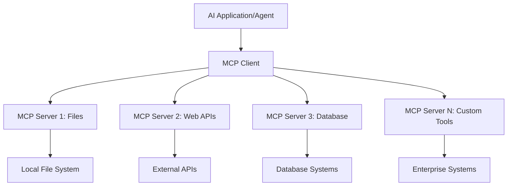
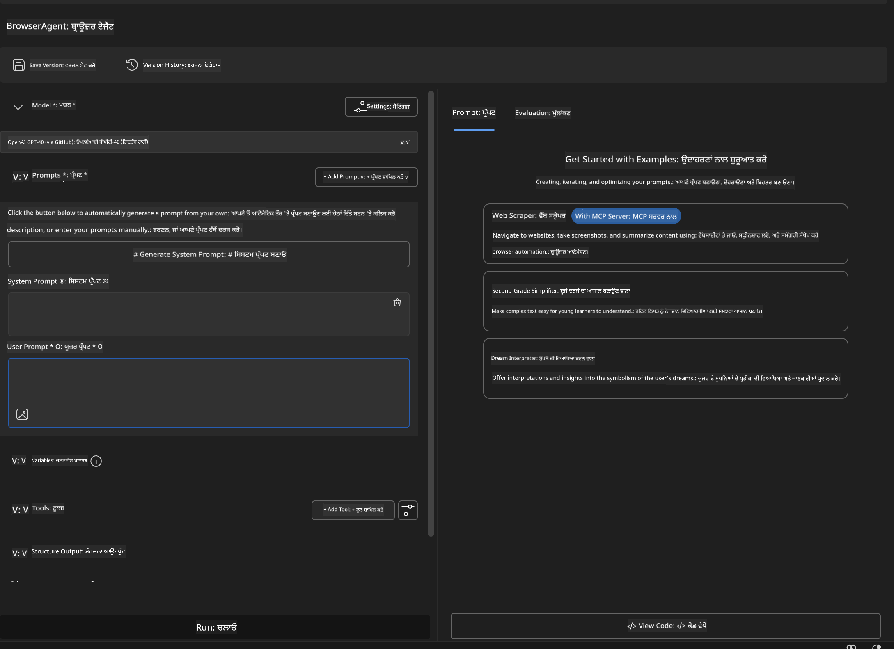
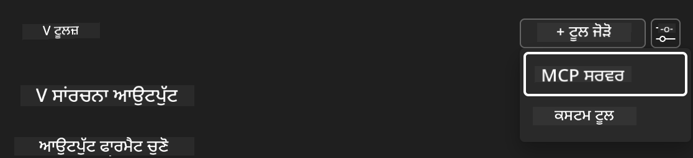
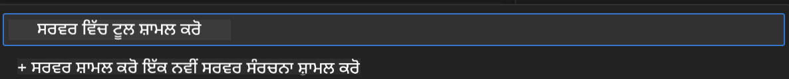
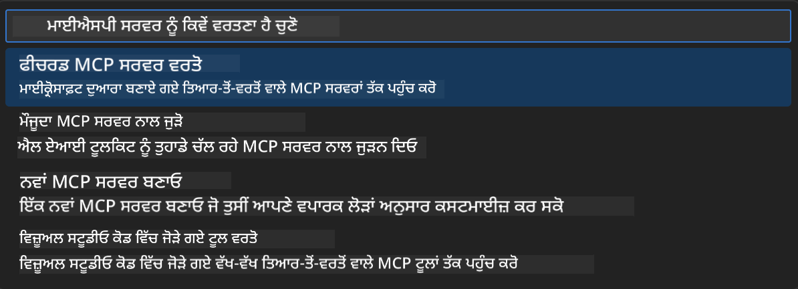
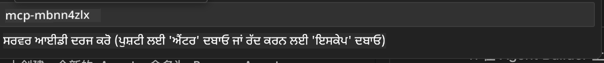
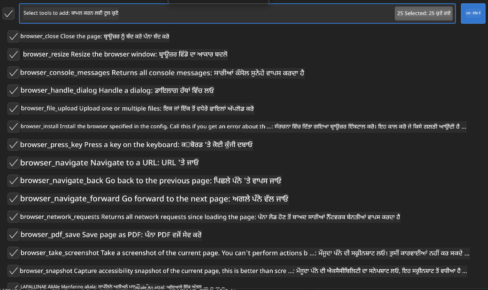
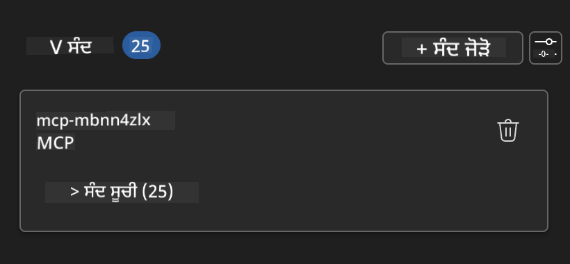

<!--
CO_OP_TRANSLATOR_METADATA:
{
  "original_hash": "a22b7dd11cd7690f99f9195877cafdc3",
  "translation_date": "2025-07-14T07:48:50+00:00",
  "source_file": "10-StreamliningAIWorkflowsBuildingAnMCPServerWithAIToolkit/lab2/README.md",
  "language_code": "pa"
}
-->
# 🌐 ਮੋਡੀਊਲ 2: MCP ਨਾਲ AI Toolkit ਦੇ ਮੂਲ ਤੱਤ

## 📋 ਸਿੱਖਣ ਦੇ ਲਕੜੀ

ਇਸ ਮੋਡੀਊਲ ਦੇ ਅੰਤ ਤੱਕ, ਤੁਸੀਂ ਸਮਰੱਥ ਹੋਵੋਗੇ:
- ✅ Model Context Protocol (MCP) ਦੀ ਬਣਤਰ ਅਤੇ ਫਾਇਦੇ ਸਮਝਣਾ
- ✅ Microsoft ਦੇ MCP ਸਰਵਰ ਪਰਿਵਾਰ ਨੂੰ ਖੋਜਣਾ
- ✅ MCP ਸਰਵਰਾਂ ਨੂੰ AI Toolkit Agent Builder ਨਾਲ ਜੋੜਨਾ
- ✅ Playwright MCP ਦੀ ਵਰਤੋਂ ਕਰਕੇ ਇੱਕ ਕਾਰਗਰ ਬ੍ਰਾਊਜ਼ਰ ਆਟੋਮੇਸ਼ਨ ਏਜੰਟ ਬਣਾਉਣਾ
- ✅ ਆਪਣੇ ਏਜੰਟਾਂ ਵਿੱਚ MCP ਟੂਲਾਂ ਨੂੰ ਸੰਰਚਿਤ ਅਤੇ ਟੈਸਟ ਕਰਨਾ
- ✅ MCP-ਚਲਿਤ ਏਜੰਟਾਂ ਨੂੰ ਨਿਰਯਾਤ ਅਤੇ ਉਤਪਾਦਨ ਲਈ ਤਿਆਰ ਕਰਨਾ

## 🎯 ਮੋਡੀਊਲ 1 'ਤੇ ਅਧਾਰਿਤ

ਮੋਡੀਊਲ 1 ਵਿੱਚ, ਅਸੀਂ AI Toolkit ਦੇ ਬੁਨਿਆਦੀ ਗੁਣ ਸਿੱਖੇ ਅਤੇ ਆਪਣਾ ਪਹਿਲਾ Python ਏਜੰਟ ਬਣਾਇਆ। ਹੁਣ ਅਸੀਂ ਤੁਹਾਡੇ ਏਜੰਟਾਂ ਨੂੰ ਬਾਹਰੀ ਟੂਲਾਂ ਅਤੇ ਸੇਵਾਵਾਂ ਨਾਲ ਜੋੜ ਕੇ **ਮਜ਼ਬੂਤ** ਕਰਾਂਗੇ, ਇਹ ਸਭ ਸੰਭਵ ਹੈ ਇਨਕਲਾਬੀ **Model Context Protocol (MCP)** ਦੇ ਜ਼ਰੀਏ।

ਇਸਨੂੰ ਇੱਕ ਸਧਾਰਣ ਕੈਲਕੁਲੇਟਰ ਤੋਂ ਪੂਰੇ ਕੰਪਿਊਟਰ ਵਿੱਚ ਅੱਪਗ੍ਰੇਡ ਕਰਨ ਵਾਂਗ ਸੋਚੋ - ਤੁਹਾਡੇ AI ਏਜੰਟ ਹੁਣ ਇਹ ਸਮਰੱਥਾ ਪ੍ਰਾਪਤ ਕਰਨਗੇ:
- 🌐 ਵੈੱਬਸਾਈਟਾਂ ਨੂੰ ਬ੍ਰਾਊਜ਼ ਅਤੇ ਇੰਟਰੈਕਟ ਕਰਨਾ
- 📁 ਫਾਈਲਾਂ ਤੱਕ ਪਹੁੰਚ ਅਤੇ ਉਨ੍ਹਾਂ ਨੂੰ ਸੰਭਾਲਣਾ
- 🔧 ਉਦਯੋਗਿਕ ਪ੍ਰਣਾਲੀਆਂ ਨਾਲ ਇੰਟੀਗ੍ਰੇਸ਼ਨ
- 📊 APIs ਤੋਂ ਰੀਅਲ-ਟਾਈਮ ਡੇਟਾ ਪ੍ਰੋਸੈਸ ਕਰਨਾ

## 🧠 Model Context Protocol (MCP) ਨੂੰ ਸਮਝਣਾ

### 🔍 MCP ਕੀ ਹੈ?

Model Context Protocol (MCP) AI ਐਪਲੀਕੇਸ਼ਨਾਂ ਲਈ **"USB-C"** ਵਾਂਗ ਹੈ - ਇੱਕ ਇਨਕਲਾਬੀ ਖੁੱਲਾ ਮਿਆਰ ਜੋ ਵੱਡੇ ਭਾਸ਼ਾ ਮਾਡਲਾਂ (LLMs) ਨੂੰ ਬਾਹਰੀ ਟੂਲਾਂ, ਡੇਟਾ ਸਰੋਤਾਂ ਅਤੇ ਸੇਵਾਵਾਂ ਨਾਲ ਜੋੜਦਾ ਹੈ। ਜਿਵੇਂ USB-C ਨੇ ਕੇਬਲਾਂ ਦੀ ਗੜਬੜ ਖਤਮ ਕਰ ਦਿੱਤੀ ਇੱਕ ਯੂਨੀਵਰਸਲ ਕਨੈਕਟਰ ਦੇ ਨਾਲ, MCP ਵੀ AI ਇੰਟੀਗ੍ਰੇਸ਼ਨ ਦੀ ਜਟਿਲਤਾ ਨੂੰ ਇੱਕ ਮਿਆਰੀ ਪ੍ਰੋਟੋਕੋਲ ਨਾਲ ਖਤਮ ਕਰਦਾ ਹੈ।

### 🎯 MCP ਕਿਹੜੀ ਸਮੱਸਿਆ ਹੱਲ ਕਰਦਾ ਹੈ

**MCP ਤੋਂ ਪਹਿਲਾਂ:**
- 🔧 ਹਰ ਟੂਲ ਲਈ ਵਿਲੱਖਣ ਇੰਟੀਗ੍ਰੇਸ਼ਨ
- 🔄 ਵੈਂਡਰ ਲਾਕ-ਇਨ ਅਤੇ ਖਾਸ ਹੱਲ
- 🔒 ਅਣਪਛਾਤੇ ਕਨੈਕਸ਼ਨਾਂ ਕਾਰਨ ਸੁਰੱਖਿਆ ਖਤਰੇ
- ⏱️ ਬੁਨਿਆਦੀ ਇੰਟੀਗ੍ਰੇਸ਼ਨਾਂ ਲਈ ਮਹੀਨੇ ਲੱਗਦੇ ਸਨ

**MCP ਨਾਲ:**
- ⚡ ਤੁਰੰਤ ਟੂਲ ਇੰਟੀਗ੍ਰੇਸ਼ਨ
- 🔄 ਵੈਂਡਰ-ਅਗਨੋਸਟਿਕ ਬਣਤਰ
- 🛡️ ਅੰਦਰੂਨੀ ਸੁਰੱਖਿਆ ਦੇ ਸਰਵੋਤਮ ਤਰੀਕੇ
- 🚀 ਨਵੀਆਂ ਸਮਰੱਥਾਵਾਂ ਜੋੜਨ ਲਈ ਕੁਝ ਮਿੰਟ

### 🏗️ MCP ਦੀ ਬਣਤਰ ਦਾ ਵਿਸਥਾਰ

MCP ਇੱਕ **ਕਲਾਇੰਟ-ਸਰਵਰ ਬਣਤਰ** ਨੂੰ ਫਾਲੋ ਕਰਦਾ ਹੈ ਜੋ ਇੱਕ ਸੁਰੱਖਿਅਤ ਅਤੇ ਸਕੇਲਬਲ ਪਰਿਵਾਰ ਬਣਾਉਂਦਾ ਹੈ:

**🔧 ਮੁੱਖ ਹਿੱਸੇ:**

| ਹਿੱਸਾ | ਭੂਮਿਕਾ | ਉਦਾਹਰਨਾਂ |
|-------|---------|------------|
| **MCP Hosts** | ਐਪਲੀਕੇਸ਼ਨ ਜੋ MCP ਸੇਵਾਵਾਂ ਦੀ ਵਰਤੋਂ ਕਰਦੇ ਹਨ | Claude Desktop, VS Code, AI Toolkit |
| **MCP Clients** | ਪ੍ਰੋਟੋਕੋਲ ਹੈਂਡਲਰ (1:1 ਸਰਵਰਾਂ ਨਾਲ) | ਹੋਸਟ ਐਪਲੀਕੇਸ਼ਨਾਂ ਵਿੱਚ ਬਣੇ ਹੋਏ |
| **MCP Servers** | ਮਿਆਰੀ ਪ੍ਰੋਟੋਕੋਲ ਰਾਹੀਂ ਸਮਰੱਥਾਵਾਂ ਪ੍ਰਦਾਨ ਕਰਦੇ ਹਨ | Playwright, Files, Azure, GitHub |
| **Transport Layer** | ਸੰਚਾਰ ਦੇ ਤਰੀਕੇ | stdio, HTTP, WebSockets |

## 🏢 Microsoft ਦਾ MCP ਸਰਵਰ ਪਰਿਵਾਰ

Microsoft MCP ਪਰਿਵਾਰ ਵਿੱਚ ਅਗਵਾਈ ਕਰਦਾ ਹੈ ਇੱਕ ਵਿਸ਼ਾਲ ਉਦਯੋਗਿਕ-ਗਰੇਡ ਸਰਵਰਾਂ ਦੇ ਸੈੱਟ ਨਾਲ ਜੋ ਵਾਸਤਵਿਕ ਕਾਰੋਬਾਰੀ ਜ਼ਰੂਰਤਾਂ ਨੂੰ ਪੂਰਾ ਕਰਦੇ ਹਨ।

### 🌟 ਪ੍ਰਮੁੱਖ Microsoft MCP ਸਰਵਰ

#### 1. ☁️ Azure MCP Server  
**🔗 Repository**: [azure/azure-mcp](https://github.com/azure/azure-mcp)  
**🎯 ਮਕਸਦ**: AI ਇੰਟੀਗ੍ਰੇਸ਼ਨ ਨਾਲ Azure ਸਰੋਤਾਂ ਦਾ ਵਿਸ਼ਤ੍ਰਿਤ ਪ੍ਰਬੰਧਨ

**✨ ਮੁੱਖ ਵਿਸ਼ੇਸ਼ਤਾਵਾਂ:**  
- ਘੋਸ਼ਣਾਤਮਕ ਇੰਫਰਾਸਟਰੱਕਚਰ ਪ੍ਰੋਵਿਜ਼ਨਿੰਗ  
- ਰੀਅਲ-ਟਾਈਮ ਸਰੋਤ ਨਿਗਰਾਨੀ  
- ਲਾਗਤ ਅਨੁਕੂਲਤਾ ਸਿਫਾਰਸ਼ਾਂ  
- ਸੁਰੱਖਿਆ ਅਨੁਕੂਲਤਾ ਜਾਂਚ

**🚀 ਵਰਤੋਂ ਦੇ ਕੇਸ:**  
- AI ਸਹਾਇਤਾ ਨਾਲ Infrastructure-as-Code  
- ਆਟੋਮੈਟਿਕ ਸਰੋਤ ਸਕੇਲਿੰਗ  
- ਕਲਾਉਡ ਲਾਗਤ ਅਨੁਕੂਲਤਾ  
- DevOps ਵਰਕਫਲੋ ਆਟੋਮੇਸ਼ਨ

#### 2. 📊 Microsoft Dataverse MCP  
**📚 ਦਸਤਾਵੇਜ਼**: [Microsoft Dataverse Integration](https://go.microsoft.com/fwlink/?linkid=2320176)  
**🎯 ਮਕਸਦ**: ਕਾਰੋਬਾਰੀ ਡੇਟਾ ਲਈ ਕੁਦਰਤੀ ਭਾਸ਼ਾ ਇੰਟਰਫੇਸ

**✨ ਮੁੱਖ ਵਿਸ਼ੇਸ਼ਤਾਵਾਂ:**  
- ਕੁਦਰਤੀ ਭਾਸ਼ਾ ਵਿੱਚ ਡੇਟਾਬੇਸ ਕਵੈਰੀਜ਼  
- ਕਾਰੋਬਾਰੀ ਸੰਦਰਭ ਦੀ ਸਮਝ  
- ਕਸਟਮ ਪ੍ਰਾਂਪਟ ਟੈਮਪਲੇਟ  
- ਉਦਯੋਗਿਕ ਡੇਟਾ ਗਵਰਨੈਂਸ

**🚀 ਵਰਤੋਂ ਦੇ ਕੇਸ:**  
- ਕਾਰੋਬਾਰੀ ਬੁੱਧੀਮਤਾ ਰਿਪੋਰਟਿੰਗ  
- ਗਾਹਕ ਡੇਟਾ ਵਿਸ਼ਲੇਸ਼ਣ  
- ਵਿਕਰੀ ਪਾਈਪਲਾਈਨ ਅੰਦਰੂਨੀ ਜਾਣਕਾਰੀ  
- ਅਨੁਕੂਲਤਾ ਡੇਟਾ ਕਵੈਰੀਜ਼

#### 3. 🌐 Playwright MCP Server  
**🔗 Repository**: [microsoft/playwright-mcp](https://github.com/microsoft/playwright-mcp)  
**🎯 ਮਕਸਦ**: ਬ੍ਰਾਊਜ਼ਰ ਆਟੋਮੇਸ਼ਨ ਅਤੇ ਵੈੱਬ ਇੰਟਰੈਕਸ਼ਨ ਸਮਰੱਥਾਵਾਂ

**✨ ਮੁੱਖ ਵਿਸ਼ੇਸ਼ਤਾਵਾਂ:**  
- ਕ੍ਰਾਸ-ਬ੍ਰਾਊਜ਼ਰ ਆਟੋਮੇਸ਼ਨ (Chrome, Firefox, Safari)  
- ਸਮਝਦਾਰ ਐਲੀਮੈਂਟ ਪਛਾਣ  
- ਸਕ੍ਰੀਨਸ਼ਾਟ ਅਤੇ PDF ਤਿਆਰ ਕਰਨਾ  
- ਨੈੱਟਵਰਕ ਟ੍ਰੈਫਿਕ ਨਿਗਰਾਨੀ

**🚀 ਵਰਤੋਂ ਦੇ ਕੇਸ:**  
- ਆਟੋਮੇਟਿਕ ਟੈਸਟਿੰਗ ਵਰਕਫਲੋਜ਼  
- ਵੈੱਬ ਸਕ੍ਰੈਪਿੰਗ ਅਤੇ ਡੇਟਾ ਨਿਕਾਸ  
- UI/UX ਨਿਗਰਾਨੀ  
- ਮੁਕਾਬਲਾਤੀ ਵਿਸ਼ਲੇਸ਼ਣ ਆਟੋਮੇਸ਼ਨ

#### 4. 📁 Files MCP Server  
**🔗 Repository**: [microsoft/files-mcp-server](https://github.com/microsoft/files-mcp-server)  
**🎯 ਮਕਸਦ**: ਸਮਝਦਾਰ ਫਾਈਲ ਸਿਸਟਮ ਓਪਰੇਸ਼ਨ

**✨ ਮੁੱਖ ਵਿਸ਼ੇਸ਼ਤਾਵਾਂ:**  
- ਘੋਸ਼ਣਾਤਮਕ ਫਾਈਲ ਪ੍ਰਬੰਧਨ  
- ਸਮੱਗਰੀ ਸਿੰਕ੍ਰੋਨਾਈਜ਼ੇਸ਼ਨ  
- ਵਰਜ਼ਨ ਕੰਟਰੋਲ ਇੰਟੀਗ੍ਰੇਸ਼ਨ  
- ਮੈਟਾਡੇਟਾ ਨਿਕਾਸ

**🚀 ਵਰਤੋਂ ਦੇ ਕੇਸ:**  
- ਦਸਤਾਵੇਜ਼ ਪ੍ਰਬੰਧਨ  
- ਕੋਡ ਰਿਪੋਜ਼ਿਟਰੀ ਸੰਗਠਨ  
- ਸਮੱਗਰੀ ਪ੍ਰਕਾਸ਼ਨ ਵਰਕਫਲੋਜ਼  
- ਡੇਟਾ ਪਾਈਪਲਾਈਨ ਫਾਈਲ ਹੈਂਡਲਿੰਗ

#### 5. 📝 MarkItDown MCP Server  
**🔗 Repository**: [microsoft/markitdown](https://github.com/microsoft/markitdown)  
**🎯 ਮਕਸਦ**: ਉੱਨਤ Markdown ਪ੍ਰੋਸੈਸਿੰਗ ਅਤੇ ਸੰਸ਼ੋਧਨ

**✨ ਮੁੱਖ ਵਿਸ਼ੇਸ਼ਤਾਵਾਂ:**  
- ਧਨਾਢ Markdown ਪਾਰਸਿੰਗ  
- ਫਾਰਮੈਟ ਬਦਲਾਅ (MD ↔ HTML ↔ PDF)  
- ਸਮੱਗਰੀ ਦੀ ਬਣਤਰ ਵਿਸ਼ਲੇਸ਼ਣ  
- ਟੈਮਪਲੇਟ ਪ੍ਰੋਸੈਸਿੰਗ

**🚀 ਵਰਤੋਂ ਦੇ ਕੇਸ:**  
- ਤਕਨੀਕੀ ਦਸਤਾਵੇਜ਼ ਵਰਕਫਲੋਜ਼  
- ਸਮੱਗਰੀ ਪ੍ਰਬੰਧਨ ਪ੍ਰਣਾਲੀਆਂ  
- ਰਿਪੋਰਟ ਤਿਆਰ ਕਰਨਾ  
- ਗਿਆਨ ਅਧਾਰ ਆਟੋਮੇਸ਼ਨ

#### 6. 📈 Clarity MCP Server  
**📦 ਪੈਕੇਜ**: [@microsoft/clarity-mcp-server](https://www.npmjs.com/package/@microsoft/clarity-mcp-server)  
**🎯 ਮਕਸਦ**: ਵੈੱਬ ਵਿਸ਼ਲੇਸ਼ਣ ਅਤੇ ਉਪਭੋਗਤਾ ਵਿਹਾਰ ਦੀ ਜਾਣਕਾਰੀ

**✨ ਮੁੱਖ ਵਿਸ਼ੇਸ਼ਤਾਵਾਂ:**  
- ਹੀਟਮੈਪ ਡੇਟਾ ਵਿਸ਼ਲੇਸ਼ਣ  
- ਉਪਭੋਗਤਾ ਸੈਸ਼ਨ ਰਿਕਾਰਡਿੰਗ  
- ਪ੍ਰਦਰਸ਼ਨ ਮੈਟਰਿਕਸ  
- ਕਨਵਰਜ਼ਨ ਫਨਲ ਵਿਸ਼ਲੇਸ਼ਣ

**🚀 ਵਰਤੋਂ ਦੇ ਕੇਸ:**  
- ਵੈੱਬਸਾਈਟ ਅਨੁਕੂਲਤਾ  
- ਉਪਭੋਗਤਾ ਅਨੁਭਵ ਖੋਜ  
- A/B ਟੈਸਟਿੰਗ ਵਿਸ਼ਲੇਸ਼ਣ  
- ਕਾਰੋਬਾਰੀ ਬੁੱਧੀਮਤਾ ਡੈਸ਼ਬੋਰਡ

### 🌍 ਕਮਿਊਨਿਟੀ ਪਰਿਵਾਰ

Microsoft ਦੇ ਸਰਵਰਾਂ ਤੋਂ ਇਲਾਵਾ, MCP ਪਰਿਵਾਰ ਵਿੱਚ ਸ਼ਾਮਲ ਹਨ:  
- **🐙 GitHub MCP**: ਰਿਪੋਜ਼ਿਟਰੀ ਪ੍ਰਬੰਧਨ ਅਤੇ ਕੋਡ ਵਿਸ਼ਲੇਸ਼ਣ  
- **🗄️ ਡੇਟਾਬੇਸ MCPs**: PostgreSQL, MySQL, MongoDB ਇੰਟੀਗ੍ਰੇਸ਼ਨ  
- **☁️ ਕਲਾਉਡ ਪ੍ਰਦਾਤਾ MCPs**: AWS, GCP, Digital Ocean ਟੂਲ  
- **📧 ਸੰਚਾਰ MCPs**: Slack, Teams, Email ਇੰਟੀਗ੍ਰੇਸ਼ਨ

## 🛠️ ਪ੍ਰਯੋਗਸ਼ਾਲਾ: ਬ੍ਰਾਊਜ਼ਰ ਆਟੋਮੇਸ਼ਨ ਏਜੰਟ ਬਣਾਉਣਾ

**🎯 ਪ੍ਰੋਜੈਕਟ ਦਾ ਮਕਸਦ**: Playwright MCP ਸਰਵਰ ਦੀ ਵਰਤੋਂ ਕਰਕੇ ਇੱਕ ਸਮਝਦਾਰ ਬ੍ਰਾਊਜ਼ਰ ਆਟੋਮੇਸ਼ਨ ਏਜੰਟ ਬਣਾਉਣਾ ਜੋ ਵੈੱਬਸਾਈਟਾਂ 'ਤੇ ਨੈਵੀਗੇਟ ਕਰ ਸਕੇ, ਜਾਣਕਾਰੀ ਇਕੱਠੀ ਕਰ ਸਕੇ ਅਤੇ ਜਟਿਲ ਵੈੱਬ ਇੰਟਰੈਕਸ਼ਨਾਂ ਨੂੰ ਅੰਜਾਮ ਦੇ ਸਕੇ।

### 🚀 ਪਹਿਲਾ ਚਰਨ: ਏਜੰਟ ਦੀ ਬੁਨਿਆਦ ਸੈੱਟ ਕਰਨਾ

#### ਕਦਮ 1: ਆਪਣਾ ਏਜੰਟ ਸ਼ੁਰੂ ਕਰੋ  
1. **AI Toolkit Agent Builder ਖੋਲ੍ਹੋ**  
2. **ਨਵਾਂ ਏਜੰਟ ਬਣਾਓ** ਹੇਠਾਂ ਦਿੱਤੀ ਸੰਰਚਨਾ ਨਾਲ:  
   - **ਨਾਮ**: `BrowserAgent`  
   - **ਮਾਡਲ**: GPT-4o ਚੁਣੋ  

### 🔧 ਦੂਜਾ ਚਰਨ: MCP ਇੰਟੀਗ੍ਰੇਸ਼ਨ ਵਰਕਫਲੋ

#### ਕਦਮ 3: MCP ਸਰਵਰ ਇੰਟੀਗ੍ਰੇਸ਼ਨ ਸ਼ਾਮਲ ਕਰੋ  
1. Agent Builder ਵਿੱਚ ਟੂਲ ਸੈਕਸ਼ਨ 'ਤੇ ਜਾਓ  
2. **"Add Tool"** 'ਤੇ ਕਲਿੱਕ ਕਰੋ ਇੰਟੀਗ੍ਰੇਸ਼ਨ ਮੀਨੂ ਖੋਲ੍ਹਣ ਲਈ  
3. ਉਪਲਬਧ ਵਿਕਲਪਾਂ ਵਿੱਚੋਂ **"MCP Server"** ਚੁਣੋ  

**🔍 ਟੂਲ ਕਿਸਮਾਂ ਨੂੰ ਸਮਝਣਾ:**  
- **Built-in Tools**: ਪਹਿਲਾਂ ਤੋਂ ਸੰਰਚਿਤ AI Toolkit ਫੰਕਸ਼ਨ  
- **MCP Servers**: ਬਾਹਰੀ ਸੇਵਾ ਇੰਟੀਗ੍ਰੇਸ਼ਨ  
- **Custom APIs**: ਤੁਹਾਡੇ ਆਪਣੇ ਸੇਵਾ ਐਂਡਪੌਇੰਟ  
- **Function Calling**: ਮਾਡਲ ਫੰਕਸ਼ਨ ਤੱਕ ਸਿੱਧਾ ਪਹੁੰਚ

#### ਕਦਮ 4: MCP ਸਰਵਰ ਚੁਣੋ  
1. ਅੱਗੇ ਵਧਣ ਲਈ **"MCP Server"** ਵਿਕਲਪ ਚੁਣੋ  

2. ਉਪਲਬਧ ਇੰਟੀਗ੍ਰੇਸ਼ਨਾਂ ਨੂੰ ਵੇਖਣ ਲਈ MCP ਕੈਟਾਲੌਗ ਬ੍ਰਾਊਜ਼ ਕਰੋ  

### 🎮 ਤੀਜਾ ਚਰਨ: Playwright MCP ਸੰਰਚਨਾ

#### ਕਦਮ 5: Playwright ਚੁਣੋ ਅਤੇ ਸੰਰਚਿਤ ਕਰੋ  
1. Microsoft ਦੇ ਪ੍ਰਮਾਣਿਤ ਸਰਵਰਾਂ ਤੱਕ ਪਹੁੰਚ ਲਈ **"Use Featured MCP Servers"** 'ਤੇ ਕਲਿੱਕ ਕਰੋ  
2. ਪ੍ਰਮੁੱਖ ਸੂਚੀ ਵਿੱਚੋਂ **"Playwright"** ਚੁਣੋ  
3. ਡਿਫਾਲਟ MCP ID ਸਵੀਕਾਰ ਕਰੋ ਜਾਂ ਆਪਣੇ ਵਾਤਾਵਰਣ ਲਈ ਕਸਟਮਾਈਜ਼ ਕਰੋ  

#### ਕਦਮ 6: Playwright ਸਮਰੱਥਾਵਾਂ ਨੂੰ ਯੋਗ ਕਰੋ  
**🔑 ਜਰੂਰੀ ਕਦਮ**: ਵੱਧ ਤੋਂ ਵੱਧ ਕਾਰਗਰਤਾ ਲਈ ਸਾਰੇ Playwright ਮੈਥਡ ਚੁਣੋ  

**🛠️ ਜਰੂਰੀ Playwright ਟੂਲ:**  
- **ਨੈਵੀਗੇਸ਼ਨ**: `goto`, `goBack`, `goForward`, `reload`  
- **ਇੰਟਰੈਕਸ਼ਨ**: `click`, `fill`, `press`, `hover`, `drag`  
- **ਨਿਕਾਸ**: `textContent`, `innerHTML`, `getAttribute`  
- **ਵੈਰੀਫਿਕੇਸ਼ਨ**: `isVisible`, `isEnabled`, `waitForSelector`  
- **ਕੈਪਚਰ**: `screenshot`, `pdf`, `video`  
- **ਨੈੱਟਵਰਕ**: `setExtraHTTPHeaders`, `route`, `waitForResponse`

#### ਕਦਮ 7: ਇੰਟੀਗ੍ਰੇਸ਼ਨ ਸਫਲਤਾ ਦੀ ਜਾਂਚ ਕਰੋ  
**✅ ਸਫਲਤਾ ਦੇ ਨਿਸ਼ਾਨ:**  
- ਸਾਰੇ ਟੂਲ Agent Builder ਇੰਟਰਫੇਸ ਵਿੱਚ ਦਿਖਾਈ ਦੇ ਰਹੇ ਹਨ  
- ਇੰਟੀਗ੍ਰੇਸ਼ਨ ਪੈਨਲ ਵਿੱਚ ਕੋਈ ਗਲਤੀ ਸੁਨੇਹਾ ਨਹੀਂ  
- Playwright ਸਰਵਰ ਸਥਿਤੀ "Connected" ਦਿਖਾ ਰਿਹਾ ਹੈ  

**🔧 ਆਮ ਸਮੱਸਿਆਵਾਂ ਅਤੇ ਹੱਲ:**  
- **ਕਨੈਕਸ਼ਨ ਫੇਲ**: ਇੰਟਰਨੈੱਟ ਕਨੈਕਸ਼ਨ ਅਤੇ ਫਾਇਰਵਾਲ ਸੈਟਿੰਗਾਂ ਚੈੱਕ ਕਰੋ  
- **ਟੂਲ ਗਾਇਬ**: ਸੈੱਟਅਪ ਦੌਰਾਨ ਸਾਰੀਆਂ ਸਮਰੱਥਾਵਾਂ ਚੁਣੀਆਂ ਗਈਆਂ ਹਨ ਇਹ ਯਕੀਨੀ ਬਣ
IMPORTANT RULES:
1. ਅਨੁਵਾਦ ਦੇ ਆਲੇ-ਦੁਆਲੇ '''markdown ਜਾਂ ਹੋਰ ਕਿਸੇ ਵੀ ਟੈਗ ਨੂੰ ਨਾ ਜੋੜੋ
2. ਯਕੀਨੀ ਬਣਾਓ ਕਿ ਅਨੁਵਾਦ ਬਹੁਤ ਜ਼ਿਆਦਾ ਸ਼ਾਬਦਿਕ ਨਾ ਲੱਗੇ
3. ਟਿੱਪਣੀਆਂ ਦਾ ਵੀ ਅਨੁਵਾਦ ਕਰੋ
4. ਇਹ ਫਾਈਲ Markdown ਫਾਰਮੈਟ ਵਿੱਚ ਲਿਖੀ ਗਈ ਹੈ - ਇਸਨੂੰ XML ਜਾਂ HTML ਵਾਂਗ ਨਾ ਸਮਝੋ
5. ਅਨੁਵਾਦ ਨਾ ਕਰੋ:
   - [!NOTE], [!WARNING], [!TIP], [!IMPORTANT], [!CAUTION]
   - ਵੈਰੀਏਬਲ ਨਾਮ, ਫੰਕਸ਼ਨ ਨਾਮ, ਕਲਾਸ ਨਾਮ
   - @@INLINE_CODE_x@@ ਜਾਂ @@CODE_BLOCK_x@@ ਵਰਗੇ ਪਲੇਸਹੋਲਡਰ
   - URLs ਜਾਂ ਪਾਥ
6. ਸਾਰੇ ਮੂਲ markdown ਫਾਰਮੈਟਿੰਗ ਨੂੰ ਬਰਕਰਾਰ ਰੱਖੋ
7. ਸਿਰਫ ਅਨੁਵਾਦਿਤ ਸਮੱਗਰੀ ਵਾਪਸ ਕਰੋ, ਕਿਸੇ ਹੋਰ ਟੈਗ ਜਾਂ ਮਾਰਕਅੱਪ ਦੇ ਬਿਨਾਂ

- ਸ਼ੁਰੂ ਤੋਂ ਇੱਕ Weather MCP ਸਰਵਰ ਬਣਾਓ

**ਅਸਵੀਕਾਰੋਪਣ**:  
ਇਹ ਦਸਤਾਵੇਜ਼ AI ਅਨੁਵਾਦ ਸੇਵਾ [Co-op Translator](https://github.com/Azure/co-op-translator) ਦੀ ਵਰਤੋਂ ਕਰਕੇ ਅਨੁਵਾਦਿਤ ਕੀਤਾ ਗਿਆ ਹੈ। ਜਦੋਂ ਕਿ ਅਸੀਂ ਸਹੀਤਾ ਲਈ ਕੋਸ਼ਿਸ਼ ਕਰਦੇ ਹਾਂ, ਕਿਰਪਾ ਕਰਕੇ ਧਿਆਨ ਰੱਖੋ ਕਿ ਸਵੈਚਾਲਿਤ ਅਨੁਵਾਦਾਂ ਵਿੱਚ ਗਲਤੀਆਂ ਜਾਂ ਅਸਮਰਥਤਾਵਾਂ ਹੋ ਸਕਦੀਆਂ ਹਨ। ਮੂਲ ਦਸਤਾਵੇਜ਼ ਆਪਣੀ ਮੂਲ ਭਾਸ਼ਾ ਵਿੱਚ ਪ੍ਰਮਾਣਿਕ ਸਰੋਤ ਮੰਨਿਆ ਜਾਣਾ ਚਾਹੀਦਾ ਹੈ। ਮਹੱਤਵਪੂਰਨ ਜਾਣਕਾਰੀ ਲਈ, ਪੇਸ਼ੇਵਰ ਮਨੁੱਖੀ ਅਨੁਵਾਦ ਦੀ ਸਿਫਾਰਸ਼ ਕੀਤੀ ਜਾਂਦੀ ਹੈ। ਅਸੀਂ ਇਸ ਅਨੁਵਾਦ ਦੀ ਵਰਤੋਂ ਤੋਂ ਉਤਪੰਨ ਕਿਸੇ ਵੀ ਗਲਤਫਹਮੀ ਜਾਂ ਗਲਤ ਵਿਆਖਿਆ ਲਈ ਜ਼ਿੰਮੇਵਾਰ ਨਹੀਂ ਹਾਂ।