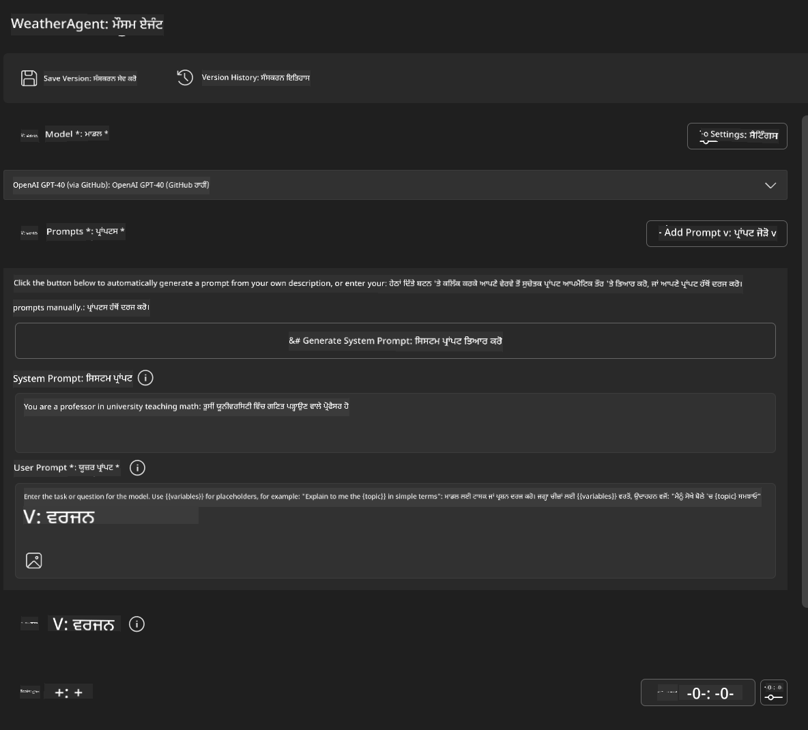
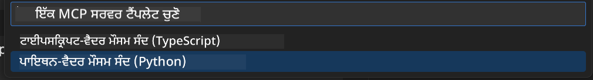
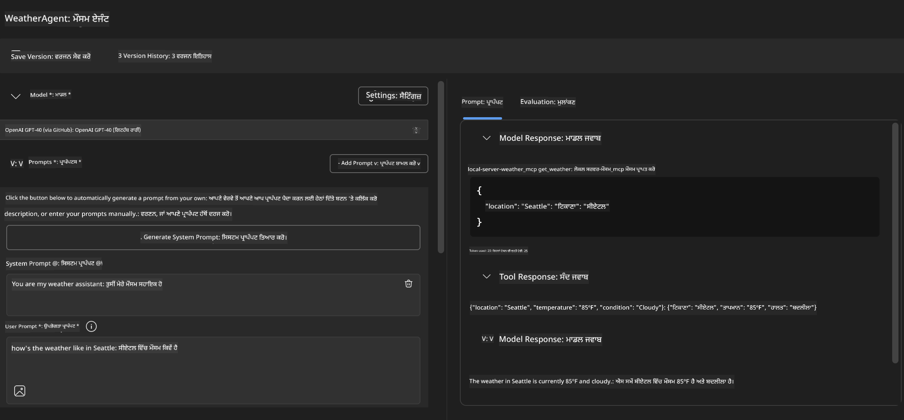
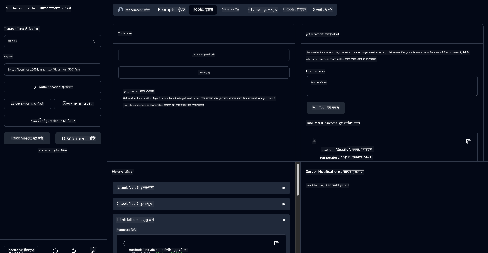

<!--
CO_OP_TRANSLATOR_METADATA:
{
  "original_hash": "dd8da3f75addcef453fe11f02a270217",
  "translation_date": "2025-07-14T08:11:53+00:00",
  "source_file": "10-StreamliningAIWorkflowsBuildingAnMCPServerWithAIToolkit/lab3/README.md",
  "language_code": "pa"
}
-->
# 🔧 ਮੋਡੀਊਲ 3: AI Toolkit ਨਾਲ ਅਡਵਾਂਸ MCP ਵਿਕਾਸ


## 🎯 ਸਿੱਖਣ ਦੇ ਲਕੜੀ

ਇਸ ਲੈਬ ਦੇ ਅੰਤ ਤੱਕ, ਤੁਸੀਂ ਸਮਰੱਥ ਹੋਵੋਗੇ:

- ✅ AI Toolkit ਦੀ ਵਰਤੋਂ ਕਰਕੇ ਕਸਟਮ MCP ਸਰਵਰ ਬਣਾਉਣਾ
- ✅ ਨਵੀਂ MCP Python SDK (v1.9.3) ਨੂੰ ਸੰਰਚਿਤ ਅਤੇ ਵਰਤਣਾ
- ✅ ਡੀਬੱਗਿੰਗ ਲਈ MCP Inspector ਸੈੱਟਅਪ ਅਤੇ ਵਰਤਣਾ
- ✅ Agent Builder ਅਤੇ Inspector ਦੋਹਾਂ ਵਿੱਚ MCP ਸਰਵਰਾਂ ਨੂੰ ਡੀਬੱਗ ਕਰਨਾ
- ✅ ਅਡਵਾਂਸ MCP ਸਰਵਰ ਵਿਕਾਸ ਦੇ ਕੰਮਕਾਜ ਨੂੰ ਸਮਝਣਾ

## 📋 ਪਹਿਲਾਂ ਦੀਆਂ ਲੋੜਾਂ

- ਲੈਬ 2 (MCP ਬੁਨਿਆਦੀ ਜਾਣਕਾਰੀ) ਪੂਰੀ ਕਰਨਾ
- VS Code ਵਿੱਚ AI Toolkit ਐਕਸਟੈਂਸ਼ਨ ਇੰਸਟਾਲ ਹੋਣਾ
- Python 3.10+ ਵਾਤਾਵਰਣ
- Inspector ਸੈੱਟਅਪ ਲਈ Node.js ਅਤੇ npm

## 🏗️ ਤੁਸੀਂ ਕੀ ਬਣਾਉਗੇ

ਇਸ ਲੈਬ ਵਿੱਚ, ਤੁਸੀਂ ਇੱਕ **Weather MCP Server** ਬਣਾਉਗੇ ਜੋ ਇਹ ਦਰਸਾਉਂਦਾ ਹੈ:
- ਕਸਟਮ MCP ਸਰਵਰ ਦੀ ਨਿਰਮਾਣ ਪ੍ਰਕਿਰਿਆ
- AI Toolkit Agent Builder ਨਾਲ ਇੰਟੀਗ੍ਰੇਸ਼ਨ
- ਪ੍ਰੋਫੈਸ਼ਨਲ ਡੀਬੱਗਿੰਗ ਵਰਕਫਲੋਜ਼
- ਆਧੁਨਿਕ MCP SDK ਦੀ ਵਰਤੋਂ ਦੇ ਤਰੀਕੇ

---

## 🔧 ਮੁੱਖ ਹਿੱਸਿਆਂ ਦਾ ਜਾਇਜ਼ਾ

### 🐍 MCP Python SDK
Model Context Protocol Python SDK ਕਸਟਮ MCP ਸਰਵਰ ਬਣਾਉਣ ਲਈ ਬੁਨਿਆਦ ਮੁਹੱਈਆ ਕਰਵਾਉਂਦਾ ਹੈ। ਤੁਸੀਂ ਵਰਜਨ 1.9.3 ਵਰਤੋਂਗੇ ਜਿਸ ਵਿੱਚ ਡੀਬੱਗਿੰਗ ਖੂਬੀਆਂ ਵਧੀਆ ਕੀਤੀਆਂ ਗਈਆਂ ਹਨ।

### 🔍 MCP Inspector
ਇੱਕ ਸ਼ਕਤੀਸ਼ਾਲੀ ਡੀਬੱਗਿੰਗ ਟੂਲ ਜੋ ਇਹ ਸਹੂਲਤਾਂ ਦਿੰਦਾ ਹੈ:
- ਰੀਅਲ-ਟਾਈਮ ਸਰਵਰ ਮਾਨੀਟਰਿੰਗ
- ਟੂਲ ਚਲਾਉਣ ਦੀ ਵਿਜ਼ੂਅਲਾਈਜ਼ੇਸ਼ਨ
- ਨੈੱਟਵਰਕ ਬੇਨਤੀ/ਜਵਾਬ ਦੀ ਜਾਂਚ
- ਇੰਟਰਐਕਟਿਵ ਟੈਸਟਿੰਗ ਵਾਤਾਵਰਣ

---

## 📖 ਕਦਮ-ਦਰ-ਕਦਮ ਨਿਰਮਾਣ

### ਕਦਮ 1: Agent Builder ਵਿੱਚ WeatherAgent ਬਣਾਓ

1. VS Code ਵਿੱਚ AI Toolkit ਐਕਸਟੈਂਸ਼ਨ ਰਾਹੀਂ **Agent Builder ਸ਼ੁਰੂ ਕਰੋ**
2. ਹੇਠਾਂ ਦਿੱਤੀ ਸੰਰਚਨਾ ਨਾਲ **ਨਵਾਂ ਏਜੰਟ ਬਣਾਓ**:
   - ਏਜੰਟ ਦਾ ਨਾਮ: `WeatherAgent`



### ਕਦਮ 2: MCP Server ਪ੍ਰੋਜੈਕਟ ਸ਼ੁਰੂ ਕਰੋ

1. Agent Builder ਵਿੱਚ **Tools → Add Tool** 'ਤੇ ਜਾਓ
2. ਉਪਲਬਧ ਵਿਕਲਪਾਂ ਵਿੱਚੋਂ **"MCP Server"** ਚੁਣੋ
3. **"Create A new MCP Server"** ਚੁਣੋ
4. `python-weather` ਟੈਮਪਲੇਟ ਚੁਣੋ
5. ਆਪਣੇ ਸਰਵਰ ਦਾ ਨਾਮ ਰੱਖੋ: `weather_mcp`



### ਕਦਮ 3: ਪ੍ਰੋਜੈਕਟ ਖੋਲ੍ਹੋ ਅਤੇ ਸਮੀਖਿਆ ਕਰੋ

1. VS Code ਵਿੱਚ ਬਣਾਇਆ ਗਿਆ ਪ੍ਰੋਜੈਕਟ ਖੋਲ੍ਹੋ
2. ਪ੍ਰੋਜੈਕਟ ਦੀ ਬਣਤਰ ਦੀ ਸਮੀਖਿਆ ਕਰੋ:
   ```
   weather_mcp/
   ├── src/
   │   ├── __init__.py
   │   └── server.py
   ├── inspector/
   │   ├── package.json
   │   └── package-lock.json
   ├── .vscode/
   │   ├── launch.json
   │   └── tasks.json
   ├── pyproject.toml
   └── README.md
   ```

### ਕਦਮ 4: MCP SDK ਨੂੰ ਨਵੀਂ ਵਰਜਨ 'ਤੇ ਅਪਡੇਟ ਕਰੋ

> **🔍 ਅਪਡੇਟ ਕਿਉਂ?** ਅਸੀਂ ਨਵੀਂ MCP SDK (v1.9.3) ਅਤੇ Inspector ਸੇਵਾ (0.14.0) ਵਰਤਣਾ ਚਾਹੁੰਦੇ ਹਾਂ ਤਾਂ ਜੋ ਵਧੀਆ ਫੀਚਰ ਅਤੇ ਡੀਬੱਗਿੰਗ ਖੂਬੀਆਂ ਮਿਲ ਸਕਣ।

#### 4a. Python Dependencies ਅਪਡੇਟ ਕਰੋ

**`pyproject.toml` ਸੋਧੋ:** [./code/weather_mcp/pyproject.toml](../../../../10-StreamliningAIWorkflowsBuildingAnMCPServerWithAIToolkit/lab3/code/weather_mcp/pyproject.toml)

#### 4b. Inspector ਸੰਰਚਨਾ ਅਪਡੇਟ ਕਰੋ

**`inspector/package.json` ਸੋਧੋ:** [./code/weather_mcp/inspector/package.json](../../../../10-StreamliningAIWorkflowsBuildingAnMCPServerWithAIToolkit/lab3/code/weather_mcp/inspector/package.json)

#### 4c. Inspector Dependencies ਅਪਡੇਟ ਕਰੋ

**`inspector/package-lock.json` ਸੋਧੋ:** [./code/weather_mcp/inspector/package-lock.json](../../../../10-StreamliningAIWorkflowsBuildingAnMCPServerWithAIToolkit/lab3/code/weather_mcp/inspector/package-lock.json)

> **📝 ਨੋਟ:** ਇਹ ਫਾਇਲ ਵੱਡੀ ਡੀਪੈਂਡੈਂਸੀ ਪਰਿਭਾਸ਼ਾਵਾਂ ਰੱਖਦੀ ਹੈ। ਹੇਠਾਂ ਮੁੱਖ ਢਾਂਚਾ ਦਿੱਤਾ ਗਿਆ ਹੈ - ਪੂਰੀ ਫਾਇਲ ਸਹੀ ਡੀਪੈਂਡੈਂਸੀ ਹੱਲ ਲਈ ਜ਼ਰੂਰੀ ਹੈ।

> **⚡ ਪੂਰਾ Package Lock:** ਪੂਰੀ package-lock.json ਵਿੱਚ ਲਗਭਗ 3000 ਲਾਈਨਾਂ ਦੀ ਡੀਪੈਂਡੈਂਸੀ ਪਰਿਭਾਸ਼ਾ ਹੈ। ਉਪਰ ਦਿੱਤਾ ਢਾਂਚਾ ਮੁੱਖ ਹੈ - ਪੂਰੀ ਹੱਲ ਲਈ ਦਿੱਤੀ ਫਾਇਲ ਵਰਤੋ।

### ਕਦਮ 5: VS Code ਡੀਬੱਗਿੰਗ ਸੰਰਚਨਾ ਕਰੋ

*ਨੋਟ: ਕਿਰਪਾ ਕਰਕੇ ਦਿੱਤੇ ਗਏ ਪਾਥ ਵਿੱਚ ਫਾਇਲ ਦੀ ਨਕਲ ਕਰਕੇ ਸਥਾਨਕ ਫਾਇਲ ਨੂੰ ਬਦਲੋ*

#### 5a. Launch ਸੰਰਚਨਾ ਅਪਡੇਟ ਕਰੋ

**`.vscode/launch.json` ਸੋਧੋ:**

```json
{
  "version": "0.2.0",
  "configurations": [
    {
      "name": "Attach to Local MCP",
      "type": "debugpy",
      "request": "attach",
      "connect": {
        "host": "localhost",
        "port": 5678
      },
      "presentation": {
        "hidden": true
      },
      "internalConsoleOptions": "neverOpen",
      "postDebugTask": "Terminate All Tasks"
    },
    {
      "name": "Launch Inspector (Edge)",
      "type": "msedge",
      "request": "launch",
      "url": "http://localhost:6274?timeout=60000&serverUrl=http://localhost:3001/sse#tools",
      "cascadeTerminateToConfigurations": [
        "Attach to Local MCP"
      ],
      "presentation": {
        "hidden": true
      },
      "internalConsoleOptions": "neverOpen"
    },
    {
      "name": "Launch Inspector (Chrome)",
      "type": "chrome",
      "request": "launch",
      "url": "http://localhost:6274?timeout=60000&serverUrl=http://localhost:3001/sse#tools",
      "cascadeTerminateToConfigurations": [
        "Attach to Local MCP"
      ],
      "presentation": {
        "hidden": true
      },
      "internalConsoleOptions": "neverOpen"
    }
  ],
  "compounds": [
    {
      "name": "Debug in Agent Builder",
      "configurations": [
        "Attach to Local MCP"
      ],
      "preLaunchTask": "Open Agent Builder",
    },
    {
      "name": "Debug in Inspector (Edge)",
      "configurations": [
        "Launch Inspector (Edge)",
        "Attach to Local MCP"
      ],
      "preLaunchTask": "Start MCP Inspector",
      "stopAll": true
    },
    {
      "name": "Debug in Inspector (Chrome)",
      "configurations": [
        "Launch Inspector (Chrome)",
        "Attach to Local MCP"
      ],
      "preLaunchTask": "Start MCP Inspector",
      "stopAll": true
    }
  ]
}
```

**`.vscode/tasks.json` ਸੋਧੋ:**

```
{
  "version": "2.0.0",
  "tasks": [
    {
      "label": "Start MCP Server",
      "type": "shell",
      "command": "python -m debugpy --listen 127.0.0.1:5678 src/__init__.py sse",
      "isBackground": true,
      "options": {
        "cwd": "${workspaceFolder}",
        "env": {
          "PORT": "3001"
        }
      },
      "problemMatcher": {
        "pattern": [
          {
            "regexp": "^.*$",
            "file": 0,
            "location": 1,
            "message": 2
          }
        ],
        "background": {
          "activeOnStart": true,
          "beginsPattern": ".*",
          "endsPattern": "Application startup complete|running"
        }
      }
    },
    {
      "label": "Start MCP Inspector",
      "type": "shell",
      "command": "npm run dev:inspector",
      "isBackground": true,
      "options": {
        "cwd": "${workspaceFolder}/inspector",
        "env": {
          "CLIENT_PORT": "6274",
          "SERVER_PORT": "6277",
        }
      },
      "problemMatcher": {
        "pattern": [
          {
            "regexp": "^.*$",
            "file": 0,
            "location": 1,
            "message": 2
          }
        ],
        "background": {
          "activeOnStart": true,
          "beginsPattern": "Starting MCP inspector",
          "endsPattern": "Proxy server listening on port"
        }
      },
      "dependsOn": [
        "Start MCP Server"
      ]
    },
    {
      "label": "Open Agent Builder",
      "type": "shell",
      "command": "echo ${input:openAgentBuilder}",
      "presentation": {
        "reveal": "never"
      },
      "dependsOn": [
        "Start MCP Server"
      ],
    },
    {
      "label": "Terminate All Tasks",
      "command": "echo ${input:terminate}",
      "type": "shell",
      "problemMatcher": []
    }
  ],
  "inputs": [
    {
      "id": "openAgentBuilder",
      "type": "command",
      "command": "ai-mlstudio.agentBuilder",
      "args": {
        "initialMCPs": [ "local-server-weather_mcp" ],
        "triggeredFrom": "vsc-tasks"
      }
    },
    {
      "id": "terminate",
      "type": "command",
      "command": "workbench.action.tasks.terminate",
      "args": "terminateAll"
    }
  ]
}
```

---

## 🚀 ਆਪਣੇ MCP ਸਰਵਰ ਨੂੰ ਚਲਾਉਣਾ ਅਤੇ ਟੈਸਟ ਕਰਨਾ

### ਕਦਮ 6: Dependencies ਇੰਸਟਾਲ ਕਰੋ

ਸੰਰਚਨਾ ਬਦਲਾਅ ਕਰਨ ਤੋਂ ਬਾਅਦ, ਹੇਠਾਂ ਦਿੱਤੇ ਕਮਾਂਡ ਚਲਾਓ:

**Python Dependencies ਇੰਸਟਾਲ ਕਰੋ:**
```bash
uv sync
```

**Inspector Dependencies ਇੰਸਟਾਲ ਕਰੋ:**
```bash
cd inspector
npm install
```

### ਕਦਮ 7: Agent Builder ਨਾਲ ਡੀਬੱਗ ਕਰੋ

1. **F5 ਦਬਾਓ** ਜਾਂ **"Debug in Agent Builder"** ਸੰਰਚਨਾ ਵਰਤੋਂ
2. ਡੀਬੱਗ ਪੈਨਲ ਵਿੱਚੋਂ ਸੰਯੁਕਤ ਸੰਰਚਨਾ ਚੁਣੋ
3. ਸਰਵਰ ਸ਼ੁਰੂ ਹੋਣ ਅਤੇ Agent Builder ਖੁਲਣ ਦੀ ਉਡੀਕ ਕਰੋ
4. ਆਪਣਾ weather MCP ਸਰਵਰ ਕੁਦਰਤੀ ਭਾਸ਼ਾ ਪ੍ਰਸ਼ਨਾਂ ਨਾਲ ਟੈਸਟ ਕਰੋ

ਇਸ ਤਰ੍ਹਾਂ ਇਨਪੁੱਟ ਦਿਓ

SYSTEM_PROMPT

```
You are my weather assistant
```

USER_PROMPT

```
How's the weather like in Seattle
```



### ਕਦਮ 8: MCP Inspector ਨਾਲ ਡੀਬੱਗ ਕਰੋ

1. **"Debug in Inspector"** ਸੰਰਚਨਾ ਵਰਤੋਂ (Edge ਜਾਂ Chrome)
2. `http://localhost:6274` 'ਤੇ Inspector ਇੰਟਰਫੇਸ ਖੋਲ੍ਹੋ
3. ਇੰਟਰਐਕਟਿਵ ਟੈਸਟਿੰਗ ਵਾਤਾਵਰਣ ਦੀ ਖੋਜ ਕਰੋ:
   - ਉਪਲਬਧ ਟੂਲ ਵੇਖੋ
   - ਟੂਲ ਚਲਾਉਣ ਦੀ ਜਾਂਚ ਕਰੋ
   - ਨੈੱਟਵਰਕ ਬੇਨਤੀਆਂ ਦੀ ਨਿਗਰਾਨੀ ਕਰੋ
   - ਸਰਵਰ ਜਵਾਬਾਂ ਨੂੰ ਡੀਬੱਗ ਕਰੋ



---

## 🎯 ਮੁੱਖ ਸਿੱਖਣ ਦੇ ਨਤੀਜੇ

ਇਸ ਲੈਬ ਨੂੰ ਪੂਰਾ ਕਰਕੇ, ਤੁਸੀਂ:

- [x] AI Toolkit ਟੈਮਪਲੇਟ ਦੀ ਵਰਤੋਂ ਕਰਕੇ ਕਸਟਮ MCP ਸਰਵਰ ਬਣਾਇਆ
- [x] ਨਵੀਂ MCP SDK (v1.9.3) 'ਤੇ ਅਪਡੇਟ ਕੀਤਾ
- [x] Agent Builder ਅਤੇ Inspector ਲਈ ਪ੍ਰੋਫੈਸ਼ਨਲ ਡੀਬੱਗਿੰਗ ਵਰਕਫਲੋਜ਼ ਸੰਰਚਿਤ ਕੀਤੇ
- [x] MCP Inspector ਸੈੱਟਅਪ ਕੀਤਾ ਅਤੇ ਇੰਟਰਐਕਟਿਵ ਟੈਸਟਿੰਗ ਲਈ ਵਰਤਿਆ
- [x] MCP ਵਿਕਾਸ ਲਈ VS Code ਡੀਬੱਗਿੰਗ ਸੰਰਚਨਾਵਾਂ ਵਿੱਚ ਮਾਹਰਤਾ ਹਾਸਲ ਕੀਤੀ

## 🔧 ਅਡਵਾਂਸ ਖੂਬੀਆਂ ਦੀ ਜਾਣਕਾਰੀ

| ਖੂਬੀ | ਵੇਰਵਾ | ਵਰਤੋਂ ਦਾ ਮਾਮਲਾ |
|---------|-------------|----------|
| **MCP Python SDK v1.9.3** | ਨਵੀਂ ਪ੍ਰੋਟੋਕੋਲ ਨਿਰਮਾਣ | ਆਧੁਨਿਕ ਸਰਵਰ ਵਿਕਾਸ |
| **MCP Inspector 0.14.0** | ਇੰਟਰਐਕਟਿਵ ਡੀਬੱਗਿੰਗ ਟੂਲ | ਰੀਅਲ-ਟਾਈਮ ਸਰਵਰ ਟੈਸਟਿੰਗ |
| **VS Code ਡੀਬੱਗਿੰਗ** | ਇੰਟੀਗ੍ਰੇਟਡ ਵਿਕਾਸ ਵਾਤਾਵਰਣ | ਪ੍ਰੋਫੈਸ਼ਨਲ ਡੀਬੱਗਿੰਗ ਵਰਕਫਲੋ |
| **Agent Builder ਇੰਟੀਗ੍ਰੇਸ਼ਨ** | ਸਿੱਧਾ AI Toolkit ਕਨੈਕਸ਼ਨ | ਏਜੰਟ ਟੈਸਟਿੰਗ ਦਾ ਅੰਤ-ਤੱਕ ਪ੍ਰਕਿਰਿਆ |

## 📚 ਵਾਧੂ ਸਰੋਤ

- [MCP Python SDK ਦਸਤਾਵੇਜ਼](https://modelcontextprotocol.io/docs/sdk/python)
- [AI Toolkit ਐਕਸਟੈਂਸ਼ਨ ਗਾਈਡ](https://code.visualstudio.com/docs/ai/ai-toolkit)
- [VS Code ਡੀਬੱਗਿੰਗ ਦਸਤਾਵੇਜ਼](https://code.visualstudio.com/docs/editor/debugging)
- [Model Context Protocol ਵਿਸ਼ੇਸ਼ਤਾ](https://modelcontextprotocol.io/docs/concepts/architecture)

---

**🎉 ਵਧਾਈਆਂ!** ਤੁਸੀਂ ਲੈਬ 3 ਸਫਲਤਾਪੂਰਵਕ ਪੂਰੀ ਕਰ ਲਈ ਹੈ ਅਤੇ ਹੁਣ ਪ੍ਰੋਫੈਸ਼ਨਲ ਵਿਕਾਸ ਵਰਕਫਲੋਜ਼ ਦੀ ਵਰਤੋਂ ਕਰਕੇ ਕਸਟਮ MCP ਸਰਵਰ ਬਣਾਉਣ, ਡੀਬੱਗ ਕਰਨ ਅਤੇ ਡਿਪਲੋਇ ਕਰਨ ਦੇ ਯੋਗ ਹੋ।

### 🔜 ਅਗਲੇ ਮੋਡੀਊਲ ਵੱਲ ਵਧੋ

ਕੀ ਤੁਸੀਂ ਆਪਣੀਆਂ MCP ਹੁਨਰਾਂ ਨੂੰ ਅਸਲੀ ਦੁਨੀਆ ਦੇ ਵਿਕਾਸ ਵਰਕਫਲੋ ਵਿੱਚ ਲਾਗੂ ਕਰਨ ਲਈ ਤਿਆਰ ਹੋ? ਅਗਲੇ ਮੋਡੀਊਲ **[Module 4: Practical MCP Development - Custom GitHub Clone Server](../lab4/README.md)** ਵੱਲ ਵਧੋ ਜਿੱਥੇ ਤੁਸੀਂ:
- ਪ੍ਰੋਡਕਸ਼ਨ-ਤਿਆਰ MCP ਸਰਵਰ ਬਣਾਉਗੇ ਜੋ GitHub ਰਿਪੋਜ਼ਿਟਰੀ ਕਾਰਜਾਂ ਨੂੰ ਆਟੋਮੇਟ ਕਰਦਾ ਹੈ
- MCP ਰਾਹੀਂ GitHub ਰਿਪੋਜ਼ਿਟਰੀ ਕਲੋਨਿੰਗ ਫੰਕਸ਼ਨਾਲਿਟੀ ਲਾਗੂ ਕਰੋਗੇ
- VS Code ਅਤੇ GitHub Copilot Agent Mode ਨਾਲ ਕਸਟਮ MCP ਸਰਵਰਾਂ ਨੂੰ ਇੰਟੀਗ੍ਰੇਟ ਕਰੋਗੇ
- ਪ੍ਰੋਡਕਸ਼ਨ ਵਾਤਾਵਰਣ ਵਿੱਚ ਕਸਟਮ MCP ਸਰਵਰਾਂ ਦੀ ਟੈਸਟਿੰਗ ਅਤੇ ਡਿਪਲੋਇਮੈਂਟ ਕਰੋਗੇ
- ਡਿਵੈਲਪਰਾਂ ਲਈ ਪ੍ਰਯੋਗਿਕ ਵਰਕਫਲੋ ਆਟੋਮੇਸ਼ਨ ਸਿੱਖੋਗੇ

**ਅਸਵੀਕਾਰੋਪਣ**:  
ਇਹ ਦਸਤਾਵੇਜ਼ AI ਅਨੁਵਾਦ ਸੇਵਾ [Co-op Translator](https://github.com/Azure/co-op-translator) ਦੀ ਵਰਤੋਂ ਕਰਕੇ ਅਨੁਵਾਦਿਤ ਕੀਤਾ ਗਿਆ ਹੈ। ਜਦੋਂ ਕਿ ਅਸੀਂ ਸਹੀਤਾ ਲਈ ਕੋਸ਼ਿਸ਼ ਕਰਦੇ ਹਾਂ, ਕਿਰਪਾ ਕਰਕੇ ਧਿਆਨ ਰੱਖੋ ਕਿ ਸਵੈਚਾਲਿਤ ਅਨੁਵਾਦਾਂ ਵਿੱਚ ਗਲਤੀਆਂ ਜਾਂ ਅਸਮਰਥਤਾਵਾਂ ਹੋ ਸਕਦੀਆਂ ਹਨ। ਮੂਲ ਦਸਤਾਵੇਜ਼ ਆਪਣੀ ਮੂਲ ਭਾਸ਼ਾ ਵਿੱਚ ਪ੍ਰਮਾਣਿਕ ਸਰੋਤ ਮੰਨਿਆ ਜਾਣਾ ਚਾਹੀਦਾ ਹੈ। ਮਹੱਤਵਪੂਰਨ ਜਾਣਕਾਰੀ ਲਈ, ਪੇਸ਼ੇਵਰ ਮਨੁੱਖੀ ਅਨੁਵਾਦ ਦੀ ਸਿਫਾਰਸ਼ ਕੀਤੀ ਜਾਂਦੀ ਹੈ। ਅਸੀਂ ਇਸ ਅਨੁਵਾਦ ਦੀ ਵਰਤੋਂ ਤੋਂ ਉਤਪੰਨ ਕਿਸੇ ਵੀ ਗਲਤਫਹਿਮੀ ਜਾਂ ਗਲਤ ਵਿਆਖਿਆ ਲਈ ਜ਼ਿੰਮੇਵਾਰ ਨਹੀਂ ਹਾਂ।