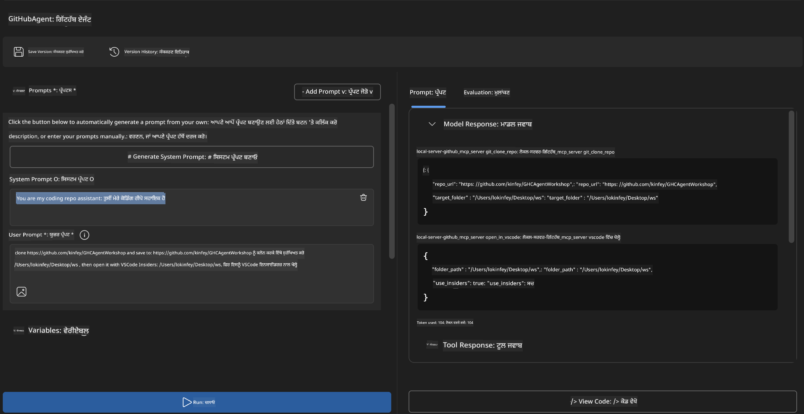
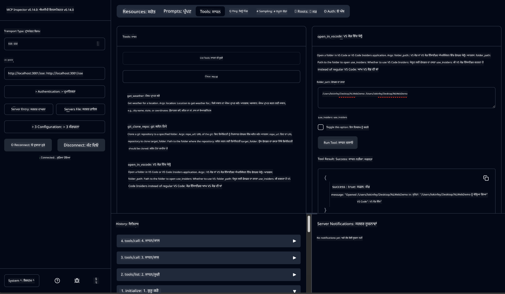

<!--
CO_OP_TRANSLATOR_METADATA:
{
  "original_hash": "f83bc722dc758efffd68667d6a1db470",
  "translation_date": "2025-07-14T08:40:15+00:00",
  "source_file": "10-StreamliningAIWorkflowsBuildingAnMCPServerWithAIToolkit/lab4/README.md",
  "language_code": "pa"
}
-->
# 🐙 ਮੋਡੀਊਲ 4: ਪ੍ਰੈਕਟਿਕਲ MCP ਵਿਕਾਸ - ਕਸਟਮ GitHub ਕਲੋਨ ਸਰਵਰ


> **⚡ ਤੇਜ਼ ਸ਼ੁਰੂਆਤ:** ਸਿਰਫ 30 ਮਿੰਟਾਂ ਵਿੱਚ ਇੱਕ ਪ੍ਰੋਡਕਸ਼ਨ-ਤਿਆਰ MCP ਸਰਵਰ ਬਣਾਓ ਜੋ GitHub ਰਿਪੋਜ਼ਿਟਰੀ ਕਲੋਨਿੰਗ ਅਤੇ VS Code ਇੰਟੀਗ੍ਰੇਸ਼ਨ ਨੂੰ ਆਟੋਮੇਟ ਕਰਦਾ ਹੈ!

## 🎯 ਸਿੱਖਣ ਦੇ ਲਕੜੀ

ਇਸ ਲੈਬ ਦੇ ਅੰਤ ਤੱਕ, ਤੁਸੀਂ ਸਮਰੱਥ ਹੋਵੋਗੇ:

- ✅ ਅਸਲੀ ਦੁਨੀਆ ਦੇ ਵਿਕਾਸ ਵਰਕਫਲੋਜ਼ ਲਈ ਇੱਕ ਕਸਟਮ MCP ਸਰਵਰ ਬਣਾਉਣਾ
- ✅ MCP ਰਾਹੀਂ GitHub ਰਿਪੋਜ਼ਿਟਰੀ ਕਲੋਨਿੰਗ ਫੰਕਸ਼ਨਾਲਿਟੀ ਲਾਗੂ ਕਰਨਾ
- ✅ ਕਸਟਮ MCP ਸਰਵਰਾਂ ਨੂੰ VS Code ਅਤੇ Agent Builder ਨਾਲ ਇੰਟੀਗ੍ਰੇਟ ਕਰਨਾ
- ✅ GitHub Copilot Agent Mode ਨੂੰ ਕਸਟਮ MCP ਟੂਲਜ਼ ਨਾਲ ਵਰਤਣਾ
- ✅ ਪ੍ਰੋਡਕਸ਼ਨ ਵਾਤਾਵਰਣ ਵਿੱਚ ਕਸਟਮ MCP ਸਰਵਰਾਂ ਦੀ ਟੈਸਟਿੰਗ ਅਤੇ ਡਿਪਲੋਇਮੈਂਟ ਕਰਨਾ

## 📋 ਪਹਿਲਾਂ ਦੀਆਂ ਲੋੜਾਂ

- Labs 1-3 ਦੀ ਪੂਰੀ ਹੋਈ (MCP ਬੁਨਿਆਦੀ ਅਤੇ ਉੱਚ ਵਿਕਾਸ)
- GitHub Copilot ਦੀ ਸਬਸਕ੍ਰਿਪਸ਼ਨ ([ਮੁਫ਼ਤ ਸਾਈਨਅਪ ਉਪਲਬਧ](https://github.com/github-copilot/signup))
- VS Code ਜਿਸ ਵਿੱਚ AI Toolkit ਅਤੇ GitHub Copilot ਐਕਸਟੈਂਸ਼ਨ ਹਨ
- Git CLI ਇੰਸਟਾਲ ਅਤੇ ਕਨਫਿਗਰ ਕੀਤਾ ਹੋਇਆ

## 🏗️ ਪ੍ਰੋਜੈਕਟ ਦਾ ਜਾਇਜ਼ਾ

### **ਅਸਲੀ ਦੁਨੀਆ ਦਾ ਵਿਕਾਸ ਚੈਲੰਜ**  
ਡਿਵੈਲਪਰਾਂ ਵਜੋਂ, ਅਸੀਂ ਅਕਸਰ GitHub ਤੋਂ ਰਿਪੋਜ਼ਿਟਰੀ ਕਲੋਨ ਕਰਦੇ ਹਾਂ ਅਤੇ ਉਹਨਾਂ ਨੂੰ VS Code ਜਾਂ VS Code Insiders ਵਿੱਚ ਖੋਲ੍ਹਦੇ ਹਾਂ। ਇਹ ਮੈਨੂਅਲ ਪ੍ਰਕਿਰਿਆ ਵਿੱਚ ਸ਼ਾਮਲ ਹੈ:  
1. ਟਰਮੀਨਲ/ਕਮਾਂਡ ਪ੍ਰਾਂਪਟ ਖੋਲ੍ਹਣਾ  
2. ਮਨਚਾਹੀ ਡਾਇਰੈਕਟਰੀ ਵਿੱਚ ਜਾਣਾ  
3. `git clone` ਕਮਾਂਡ ਚਲਾਉਣਾ  
4. ਕਲੋਨ ਕੀਤੀ ਡਾਇਰੈਕਟਰੀ ਵਿੱਚ VS Code ਖੋਲ੍ਹਣਾ  

**ਸਾਡਾ MCP ਹੱਲ ਇਸਨੂੰ ਇੱਕ ਸਮਝਦਾਰ ਕਮਾਂਡ ਵਿੱਚ ਬਦਲ ਦਿੰਦਾ ਹੈ!**

### **ਤੁਸੀਂ ਕੀ ਬਣਾਉਗੇ**  
ਇੱਕ **GitHub Clone MCP Server** (`git_mcp_server`) ਜੋ ਇਹ ਸਹੂਲਤਾਂ ਦਿੰਦਾ ਹੈ:

| ਫੀਚਰ | ਵੇਰਵਾ | ਲਾਭ |
|---------|-------------|---------|
| 🔄 **ਸਮਾਰਟ ਰਿਪੋਜ਼ਿਟਰੀ ਕਲੋਨਿੰਗ** | GitHub ਰਿਪੋਜ਼ਿਟਰੀਜ਼ ਨੂੰ ਵੈਰੀਫਿਕੇਸ਼ਨ ਨਾਲ ਕਲੋਨ ਕਰੋ | ਆਟੋਮੈਟਿਕ ਗਲਤੀ ਜਾਂਚ |
| 📁 **ਸਮਝਦਾਰ ਡਾਇਰੈਕਟਰੀ ਪ੍ਰਬੰਧਨ** | ਸੁਰੱਖਿਅਤ ਤਰੀਕੇ ਨਾਲ ਡਾਇਰੈਕਟਰੀਆਂ ਦੀ ਜਾਂਚ ਅਤੇ ਬਣਾਉ | ਓਵਰਰਾਈਟਿੰਗ ਤੋਂ ਬਚਾਅ |
| 🚀 **ਕ੍ਰਾਸ-ਪਲੇਟਫਾਰਮ VS Code ਇੰਟੀਗ੍ਰੇਸ਼ਨ** | ਪ੍ਰੋਜੈਕਟ VS Code/Insiders ਵਿੱਚ ਖੋਲ੍ਹੋ | ਬਿਨਾਂ ਰੁਕਾਵਟ ਵਰਕਫਲੋ ਟ੍ਰਾਂਜ਼ਿਸ਼ਨ |
| 🛡️ **ਮਜ਼ਬੂਤ ਗਲਤੀ ਸੰਭਾਲ** | ਨੈੱਟਵਰਕ, ਪਰਮਿਸ਼ਨ ਅਤੇ ਪਾਥ ਸਮੱਸਿਆਵਾਂ ਨੂੰ ਹੱਲ ਕਰੋ | ਪ੍ਰੋਡਕਸ਼ਨ-ਤਿਆਰ ਭਰੋਸੇਯੋਗਤਾ |

---

## 📖 ਕਦਮ-ਦਰ-ਕਦਮ ਲਾਗੂ ਕਰਨ ਦੀ ਪ੍ਰਕਿਰਿਆ

### ਕਦਮ 1: Agent Builder ਵਿੱਚ GitHub Agent ਬਣਾਓ

1. AI Toolkit ਐਕਸਟੈਂਸ਼ਨ ਰਾਹੀਂ **Agent Builder** ਖੋਲ੍ਹੋ  
2. ਹੇਠਾਂ ਦਿੱਤੀ ਸੰਰਚਨਾ ਨਾਲ **ਨਵਾਂ ਏਜੰਟ ਬਣਾਓ:**  
   ```
   Agent Name: GitHubAgent
   ```

3. **ਕਸਟਮ MCP ਸਰਵਰ ਸ਼ੁਰੂ ਕਰੋ:**  
   - **Tools** → **Add Tool** → **MCP Server** 'ਤੇ ਜਾਓ  
   - **"Create A new MCP Server"** ਚੁਣੋ  
   - ਵੱਧ ਤੋਂ ਵੱਧ ਲਚਕੀਲਾਪਣ ਲਈ **Python template** ਚੁਣੋ  
   - **Server Name:** `git_mcp_server`

### ਕਦਮ 2: GitHub Copilot Agent Mode ਸੈੱਟ ਕਰੋ

1. VS Code ਵਿੱਚ **GitHub Copilot** ਖੋਲ੍ਹੋ (Ctrl/Cmd + Shift + P → "GitHub Copilot: Open")  
2. Copilot ਇੰਟਰਫੇਸ ਵਿੱਚ **Agent Model** ਚੁਣੋ  
3. ਵਧੀਆ ਤਰਕਸ਼ੀਲਤਾ ਲਈ **Claude 3.7 model** ਚੁਣੋ  
4. ਟੂਲ ਐਕਸੈਸ ਲਈ **MCP ਇੰਟੀਗ੍ਰੇਸ਼ਨ** ਚਾਲੂ ਕਰੋ  

> **💡 ਪ੍ਰੋ ਟਿਪ:** Claude 3.7 ਵਿਕਾਸ ਵਰਕਫਲੋਜ਼ ਅਤੇ ਗਲਤੀ ਸੰਭਾਲ ਦੇ ਪੈਟਰਨਾਂ ਨੂੰ ਬਿਹਤਰ ਸਮਝਦਾ ਹੈ।

### ਕਦਮ 3: ਮੁੱਖ MCP ਸਰਵਰ ਫੰਕਸ਼ਨਾਲਿਟੀ ਲਾਗੂ ਕਰੋ

**GitHub Copilot Agent Mode ਨਾਲ ਹੇਠਾਂ ਦਿੱਤਾ ਵਿਸਥਾਰਪੂਰਕ ਪ੍ਰਾਂਪਟ ਵਰਤੋ:**  
```
Create two MCP tools with the following comprehensive requirements:

🔧 TOOL A: clone_repository
Requirements:
- Clone any GitHub repository to a specified local folder
- Return the absolute path of the successfully cloned project
- Implement comprehensive validation:
  ✓ Check if target directory already exists (return error if exists)
  ✓ Validate GitHub URL format (https://github.com/user/repo)
  ✓ Verify git command availability (prompt installation if missing)
  ✓ Handle network connectivity issues
  ✓ Provide clear error messages for all failure scenarios

🚀 TOOL B: open_in_vscode
Requirements:
- Open specified folder in VS Code or VS Code Insiders
- Cross-platform compatibility (Windows/Linux/macOS)
- Use direct application launch (not terminal commands)
- Auto-detect available VS Code installations
- Handle cases where VS Code is not installed
- Provide user-friendly error messages

Additional Requirements:
- Follow MCP 1.9.3 best practices
- Include proper type hints and documentation
- Implement logging for debugging purposes
- Add input validation for all parameters
- Include comprehensive error handling
```

### ਕਦਮ 4: ਆਪਣੇ MCP ਸਰਵਰ ਦੀ ਟੈਸਟਿੰਗ ਕਰੋ

#### 4a. Agent Builder ਵਿੱਚ ਟੈਸਟ ਕਰੋ

1. Agent Builder ਲਈ ਡੀਬੱਗ ਕਨਫਿਗਰੇਸ਼ਨ ਸ਼ੁਰੂ ਕਰੋ  
2. ਆਪਣੇ ਏਜੰਟ ਨੂੰ ਇਸ ਸਿਸਟਮ ਪ੍ਰਾਂਪਟ ਨਾਲ ਕਨਫਿਗਰ ਕਰੋ:  
   ```
SYSTEM_PROMPT:
You are my intelligent coding repository assistant. You help developers efficiently clone GitHub repositories and set up their development environment. Always provide clear feedback about operations and handle errors gracefully.
```

3. ਹਕੀਕਤੀ ਯੂਜ਼ਰ ਸਿਨਾਰਿਓਜ਼ ਨਾਲ ਟੈਸਟ ਕਰੋ:  
   ```
USER_PROMPT EXAMPLES:

Scenario : Basic Clone and Open
"Clone {Your GitHub Repo link such as https://github.com/kinfey/GHCAgentWorkshop
 } and save to {The global path you specify}, then open it with VS Code Insiders"
```



**ਉਮੀਦ ਕੀਤੇ ਨਤੀਜੇ:**  
- ✅ ਸਫਲਤਾਪੂਰਵਕ ਕਲੋਨਿੰਗ ਅਤੇ ਪਾਥ ਪੁਸ਼ਟੀ  
- ✅ ਆਟੋਮੈਟਿਕ VS Code ਲਾਂਚ  
- ✅ ਗਲਤ ਸਥਿਤੀਆਂ ਲਈ ਸਾਫ਼ ਗਲਤੀ ਸੁਨੇਹੇ  
- ✅ ਐਜ ਕੇਸਾਂ ਦੀ ਠੀਕ ਸੰਭਾਲ

#### 4b. MCP Inspector ਵਿੱਚ ਟੈਸਟ ਕਰੋ



---

**🎉 ਵਧਾਈਆਂ!** ਤੁਸੀਂ ਇੱਕ ਪ੍ਰੈਕਟਿਕਲ, ਪ੍ਰੋਡਕਸ਼ਨ-ਤਿਆਰ MCP ਸਰਵਰ ਸਫਲਤਾਪੂਰਵਕ ਬਣਾਇਆ ਹੈ ਜੋ ਅਸਲੀ ਵਿਕਾਸ ਵਰਕਫਲੋ ਚੈਲੰਜਾਂ ਦਾ ਹੱਲ ਹੈ। ਤੁਹਾਡਾ ਕਸਟਮ GitHub ਕਲੋਨ ਸਰਵਰ MCP ਦੀ ਤਾਕਤ ਨੂੰ ਦਰਸਾਉਂਦਾ ਹੈ ਜੋ ਡਿਵੈਲਪਰ ਦੀ ਉਤਪਾਦਕਤਾ ਨੂੰ ਆਟੋਮੇਟ ਅਤੇ ਸੁਧਾਰਦਾ ਹੈ।

### 🏆 ਪ੍ਰਾਪਤੀ ਪ੍ਰਮਾਣ ਪੱਤਰ:  
- ✅ **MCP ਡਿਵੈਲਪਰ** - ਕਸਟਮ MCP ਸਰਵਰ ਬਣਾਇਆ  
- ✅ **Workflow Automator** - ਵਿਕਾਸ ਪ੍ਰਕਿਰਿਆਵਾਂ ਨੂੰ ਸੁਗਮ ਬਣਾਇਆ  
- ✅ **Integration Expert** - ਕਈ ਵਿਕਾਸ ਟੂਲਜ਼ ਨੂੰ ਜੋੜਿਆ  
- ✅ **Production Ready** - ਡਿਪਲੋਇਮੈਂਟ ਯੋਗ ਹੱਲ ਬਣਾਏ

---

## 🎓 ਵਰਕਸ਼ਾਪ ਪੂਰਨਤਾ: Model Context Protocol ਨਾਲ ਤੁਹਾਡਾ ਸਫਰ

**ਪਿਆਰੇ ਵਰਕਸ਼ਾਪ ਭਾਗੀਦਾਰ,**

Model Context Protocol ਵਰਕਸ਼ਾਪ ਦੇ ਸਾਰੇ ਚਾਰ ਮੋਡੀਊਲ ਪੂਰੇ ਕਰਨ 'ਤੇ ਵਧਾਈਆਂ! ਤੁਸੀਂ ਬੁਨਿਆਦੀ AI Toolkit ਸੰਕਲਪਾਂ ਨੂੰ ਸਮਝਣ ਤੋਂ ਲੈ ਕੇ ਪ੍ਰੋਡਕਸ਼ਨ-ਤਿਆਰ MCP ਸਰਵਰ ਬਣਾਉਣ ਤੱਕ ਲੰਮਾ ਸਫਰ ਤੈਅ ਕੀਤਾ ਹੈ ਜੋ ਅਸਲੀ ਦੁਨੀਆ ਦੇ ਵਿਕਾਸ ਚੈਲੰਜਾਂ ਦਾ ਹੱਲ ਹੈ।

### 🚀 ਤੁਹਾਡਾ ਸਿੱਖਣ ਦਾ ਰਸਤਾ ਸੰਖੇਪ:

**[Module 1](../lab1/README.md)**: ਤੁਸੀਂ AI Toolkit ਦੇ ਬੁਨਿਆਦੀ ਤੱਤਾਂ, ਮਾਡਲ ਟੈਸਟਿੰਗ ਅਤੇ ਆਪਣਾ ਪਹਿਲਾ AI ਏਜੰਟ ਬਣਾਉਣ ਦੀ ਸ਼ੁਰੂਆਤ ਕੀਤੀ।

**[Module 2](../lab2/README.md)**: MCP ਆਰਕੀਟੈਕਚਰ ਸਿੱਖੀ, Playwright MCP ਇੰਟੀਗ੍ਰੇਟ ਕੀਤਾ ਅਤੇ ਆਪਣਾ ਪਹਿਲਾ ਬ੍ਰਾਊਜ਼ਰ ਆਟੋਮੇਸ਼ਨ ਏਜੰਟ ਬਣਾਇਆ।

**[Module 3](../lab3/README.md)**: Weather MCP ਸਰਵਰ ਨਾਲ ਕਸਟਮ MCP ਸਰਵਰ ਵਿਕਾਸ ਵਿੱਚ ਅੱਗੇ ਵਧੇ ਅਤੇ ਡੀਬੱਗਿੰਗ ਟੂਲਜ਼ ਵਿੱਚ ਮਾਹਰ ਹੋਏ।

**[Module 4](../lab4/README.md)**: ਹੁਣ ਤੁਸੀਂ ਸਾਰਾ ਕੁਝ ਲਾਗੂ ਕਰਕੇ ਇੱਕ ਪ੍ਰੈਕਟਿਕਲ GitHub ਰਿਪੋਜ਼ਿਟਰੀ ਵਰਕਫਲੋ ਆਟੋਮੇਸ਼ਨ ਟੂਲ ਬਣਾਇਆ।

### 🌟 ਤੁਸੀਂ ਕੀ ਮਾਹਰ ਹੋ ਗਏ ਹੋ:

- ✅ **AI Toolkit Ecosystem**: ਮਾਡਲ, ਏਜੰਟ ਅਤੇ ਇੰਟੀਗ੍ਰੇਸ਼ਨ ਪੈਟਰਨ  
- ✅ **MCP Architecture**: ਕਲਾਇੰਟ-ਸਰਵਰ ਡਿਜ਼ਾਈਨ, ਟ੍ਰਾਂਸਪੋਰਟ ਪ੍ਰੋਟੋਕੋਲ ਅਤੇ ਸੁਰੱਖਿਆ  
- ✅ **Developer Tools**: Playground ਤੋਂ Inspector ਤੱਕ ਅਤੇ ਪ੍ਰੋਡਕਸ਼ਨ ਡਿਪਲੋਇਮੈਂਟ  
- ✅ **Custom Development**: ਆਪਣੇ MCP ਸਰਵਰ ਬਣਾਉਣਾ, ਟੈਸਟ ਕਰਨਾ ਅਤੇ ਡਿਪਲੋਇ ਕਰਨਾ  
- ✅ **Practical Applications**: AI ਨਾਲ ਅਸਲੀ ਵਰਕਫਲੋ ਚੈਲੰਜਾਂ ਦਾ ਹੱਲ

### 🔮 ਤੁਹਾਡੇ ਅਗਲੇ ਕਦਮ:

1. **ਆਪਣਾ MCP ਸਰਵਰ ਬਣਾਓ**: ਆਪਣੀਆਂ ਵਿਲੱਖਣ ਵਰਕਫਲੋਜ਼ ਨੂੰ ਆਟੋਮੇਟ ਕਰਨ ਲਈ ਇਹ ਹੁਨਰ ਲਾਗੂ ਕਰੋ  
2. **MCP ਕਮਿਊਨਿਟੀ ਵਿੱਚ ਸ਼ਾਮਿਲ ਹੋਵੋ**: ਆਪਣੀਆਂ ਰਚਨਾਵਾਂ ਸਾਂਝੀਆਂ ਕਰੋ ਅਤੇ ਹੋਰਾਂ ਤੋਂ ਸਿੱਖੋ  
3. **ਉੱਚ ਇੰਟੀਗ੍ਰੇਸ਼ਨ ਖੋਜੋ**: MCP ਸਰਵਰਾਂ ਨੂੰ ਐਂਟਰਪ੍ਰਾਈਜ਼ ਸਿਸਟਮਾਂ ਨਾਲ ਜੋੜੋ  
4. **ਓਪਨ ਸੋਰਸ ਵਿੱਚ ਯੋਗਦਾਨ ਪਾਓ**: MCP ਟੂਲਿੰਗ ਅਤੇ ਦਸਤਾਵੇਜ਼ੀਕਰਨ ਨੂੰ ਸੁਧਾਰੋ

ਯਾਦ ਰੱਖੋ, ਇਹ ਵਰਕਸ਼ਾਪ ਸਿਰਫ ਸ਼ੁਰੂਆਤ ਹੈ। Model Context Protocol ਇਕੋਸਿਸਟਮ ਤੇਜ਼ੀ ਨਾਲ ਵਿਕਸਤ ਹੋ ਰਿਹਾ ਹੈ, ਅਤੇ ਹੁਣ ਤੁਸੀਂ AI-ਚਲਿਤ ਵਿਕਾਸ ਟੂਲਜ਼ ਦੇ ਅਗਲੇ ਮੋੜ 'ਤੇ ਹੋ।

**ਤੁਹਾਡੇ ਭਾਗੀਦਾਰੀ ਅਤੇ ਸਿੱਖਣ ਲਈ ਧੰਨਵਾਦ!**

ਅਸੀਂ ਆਸ ਕਰਦੇ ਹਾਂ ਕਿ ਇਹ ਵਰਕਸ਼ਾਪ ਤੁਹਾਡੇ ਵਿਚਾਰਾਂ ਨੂੰ ਜਗਾਇਆ ਹੈ ਜੋ ਤੁਹਾਡੇ ਵਿਕਾਸ ਸਫਰ ਵਿੱਚ AI ਟੂਲਜ਼ ਨਾਲ ਕੰਮ ਕਰਨ ਦੇ ਤਰੀਕੇ ਨੂੰ ਬਦਲ ਦੇਵੇਗਾ।

**ਖੁਸ਼ ਕੋਡਿੰਗ!**

---

**ਅਸਵੀਕਾਰੋਪੱਤਰ**:  
ਇਹ ਦਸਤਾਵੇਜ਼ AI ਅਨੁਵਾਦ ਸੇਵਾ [Co-op Translator](https://github.com/Azure/co-op-translator) ਦੀ ਵਰਤੋਂ ਕਰਕੇ ਅਨੁਵਾਦਿਤ ਕੀਤਾ ਗਿਆ ਹੈ। ਜਦੋਂ ਕਿ ਅਸੀਂ ਸਹੀਅਤ ਲਈ ਕੋਸ਼ਿਸ਼ ਕਰਦੇ ਹਾਂ, ਕਿਰਪਾ ਕਰਕੇ ਧਿਆਨ ਰੱਖੋ ਕਿ ਸਵੈਚਾਲਿਤ ਅਨੁਵਾਦਾਂ ਵਿੱਚ ਗਲਤੀਆਂ ਜਾਂ ਅਸਮਰਥਤਾਵਾਂ ਹੋ ਸਕਦੀਆਂ ਹਨ। ਮੂਲ ਦਸਤਾਵੇਜ਼ ਆਪਣੀ ਮੂਲ ਭਾਸ਼ਾ ਵਿੱਚ ਪ੍ਰਮਾਣਿਕ ਸਰੋਤ ਮੰਨਿਆ ਜਾਣਾ ਚਾਹੀਦਾ ਹੈ। ਮਹੱਤਵਪੂਰਨ ਜਾਣਕਾਰੀ ਲਈ, ਪੇਸ਼ੇਵਰ ਮਨੁੱਖੀ ਅਨੁਵਾਦ ਦੀ ਸਿਫਾਰਸ਼ ਕੀਤੀ ਜਾਂਦੀ ਹੈ। ਇਸ ਅਨੁਵਾਦ ਦੀ ਵਰਤੋਂ ਤੋਂ ਉਤਪੰਨ ਕਿਸੇ ਵੀ ਗਲਤਫਹਿਮੀ ਜਾਂ ਗਲਤ ਵਿਆਖਿਆ ਲਈ ਅਸੀਂ ਜ਼ਿੰਮੇਵਾਰ ਨਹੀਂ ਹਾਂ।