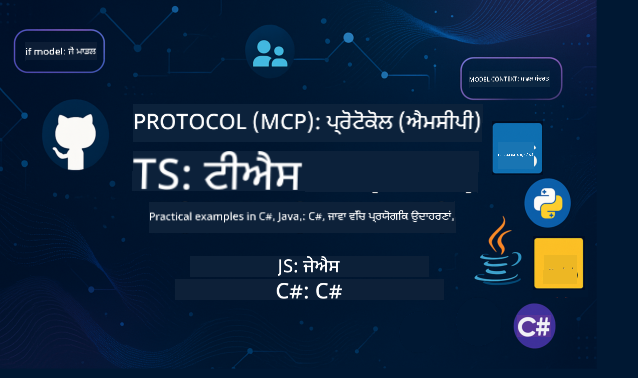

<!--
CO_OP_TRANSLATOR_METADATA:
{
  "original_hash": "866c8877136cb03e1efb9ad633a2f0a6",
  "translation_date": "2025-08-26T17:32:51+00:00",
  "source_file": "README.md",
  "language_code": "pa"
}
-->
 

ਇਹ ਸਰੋਤਾਂ ਨੂੰ ਵਰਤਣ ਦੀ ਸ਼ੁਰੂਆਤ ਕਰਨ ਲਈ ਹੇਠਾਂ ਦਿੱਤੇ ਕਦਮਾਂ ਦੀ ਪਾਲਣਾ ਕਰੋ:
1. **Repository ਨੂੰ Fork ਕਰੋ**: ਕਲਿਕ ਕਰੋ 
2. **Repository ਨੂੰ Clone ਕਰੋ**:   `git clone https://github.com/microsoft/mcp-for-beginners.git`
3. [**Azure AI Foundry Discord ਵਿੱਚ ਸ਼ਾਮਲ ਹੋਵੋ ਅਤੇ ਮਾਹਰਾਂ ਅਤੇ ਹੋਰ ਡਿਵੈਲਪਰਾਂ ਨਾਲ ਮਿਲੋ**](https://discord.com/invite/ByRwuEEgH4)

### 🌐 ਬਹੁ-ਭਾਸ਼ਾਈ ਸਹਾਇਤਾ

#### GitHub Action ਰਾਹੀਂ ਸਹਾਇਕ (ਆਟੋਮੈਟਿਕ ਅਤੇ ਹਮੇਸ਼ਾ ਅਪ-ਟੂ-ਡੇਟ)

 [ਅਰਬੀ](../ar/README.md) | [ਬੰਗਾਲੀ](../bn/README.md) | [ਬੁਲਗਾਰੀਆਈ](../bg/README.md) | [ਬਰਮੀ (ਮਿਆਂਮਾਰ)](../my/README.md) | [ਚੀਨੀ (ਸਰਲ)](../zh/README.md) | [ਚੀਨੀ (ਪਾਰੰਪਰਿਕ, ਹਾਂਗਕਾਂਗ)](../hk/README.md) | [ਚੀਨੀ (ਪਾਰੰਪਰਿਕ, ਮਕਾਉ)](../mo/README.md) | [ਚੀਨੀ (ਪਾਰੰਪਰਿਕ, ਤਾਈਵਾਨ)](../tw/README.md) | [ਕਰੋਏਸ਼ੀਆਈ](../hr/README.md) | [ਚੈਕ](../cs/README.md) | [ਡੈਨਿਸ਼](../da/README.md) | [ਡੱਚ](../nl/README.md) | [ਫਿਨਿਸ਼](../fi/README.md) | [ਫਰਾਂਸੀਸੀ](../fr/README.md) | [ਜਰਮਨ](../de/README.md) | [ਯੂਨਾਨੀ](../el/README.md) | [ਹਿਬਰੂ](../he/README.md) | [ਹਿੰਦੀ](../hi/README.md) | [ਹੰਗਰੀਆਈ](../hu/README.md) | [ਇੰਡੋਨੇਸ਼ੀਆਈ](../id/README.md) | [ਇਟਾਲਵੀ](../it/README.md) | [ਜਾਪਾਨੀ](../ja/README.md) | [ਕੋਰੀਆਈ](../ko/README.md) | [ਮਲੇ](../ms/README.md) | [ਮਰਾਠੀ](../mr/README.md) | [ਨੇਪਾਲੀ](../ne/README.md) | [ਨਾਰਵੇਜੀਅਨ](../no/README.md) | [ਫ਼ਾਰਸੀ (ਪਰਸ਼ੀਅਨ)](../fa/README.md) | [ਪੋਲਿਸ਼](../pl/README.md) | [ਪੁਰਤਗਾਲੀ (ਬ੍ਰਾਜ਼ੀਲ)](../br/README.md) | [ਪੁਰਤਗਾਲੀ (ਪੁਰਤਗਾਲ)](../pt/README.md) | [ਪੰਜਾਬੀ (ਗੁਰਮੁਖੀ)](./README.md) | [ਰੋਮਾਨੀਆਈ](../ro/README.md) | [ਰੂਸੀ](../ru/README.md) | [ਸਰਬੀਆਈ (ਸਿਰਿਲਿਕ)](../sr/README.md) | [ਸਲੋਵਾਕ](../sk/README.md) | [ਸਲੋਵੇਨੀਆਈ](../sl/README.md) | [ਸਪੇਨੀ](../es/README.md) | [ਸਵਾਹਿਲੀ](../sw/README.md) | [ਸਵੀਡਿਸ਼](../sv/README.md) | [ਟੈਗਾਲੋਗ (ਫਿਲੀਪੀਨੋ)](../tl/README.md) | [ਥਾਈ](../th/README.md) | [ਤੁਰਕੀ](../tr/README.md) | [ਯੂਕਰੇਨੀ](../uk/README.md) | [ਉਰਦੂ](../ur/README.md) | [ਵਿਯਤਨਾਮੀ](../vi/README.md)

# 🚀 ਮਾਡਲ ਕੌਂਟੈਕਸਟ ਪ੍ਰੋਟੋਕੋਲ (MCP) ਸ਼ੁਰੂਆਤੀ ਕੋਰਸ

## **C#, Java, JavaScript, Rust, Python, ਅਤੇ TypeScript ਵਿੱਚ ਹੱਥ-ਅਜ਼ਮਾਇਸ਼ ਕੋਡ ਉਦਾਹਰਣਾਂ ਨਾਲ MCP ਸਿੱਖੋ**

## 🧠 ਮਾਡਲ ਕੌਂਟੈਕਸਟ ਪ੍ਰੋਟੋਕੋਲ ਕੋਰਸ ਦਾ ਝਲਕ

**ਮਾਡਲ ਕੌਂਟੈਕਸਟ ਪ੍ਰੋਟੋਕੋਲ (MCP)** ਇੱਕ ਅਧੁਨਿਕ ਫਰੇਮਵਰਕ ਹੈ ਜੋ AI ਮਾਡਲਾਂ ਅਤੇ ਕਲਾਇੰਟ ਐਪਲੀਕੇਸ਼ਨਾਂ ਦੇ ਵਿਚਕਾਰ ਸੰਚਾਰ ਨੂੰ ਮਿਆਰੀ ਬਣਾਉਣ ਲਈ ਤਿਆਰ ਕੀਤਾ ਗਿਆ ਹੈ। ਇਹ ਖੁੱਲ੍ਹੇ ਸਰੋਤ ਵਾਲਾ ਕੋਰਸ ਇੱਕ ਢਾਂਚਾਬੱਧ ਸਿੱਖਣ ਦਾ ਰਸਤਾ ਪ੍ਰਦਾਨ ਕਰਦਾ ਹੈ, ਜਿਸ ਵਿੱਚ ਪ੍ਰਸਿੱਧ ਪ੍ਰੋਗਰਾਮਿੰਗ ਭਾਸ਼ਾਵਾਂ ਜਿਵੇਂ ਕਿ C#, Java, JavaScript, TypeScript, ਅਤੇ Python ਵਿੱਚ ਵਿਹੰਗਮ ਕੋਡ ਉਦਾਹਰਣਾਂ ਅਤੇ ਅਸਲ-ਜਗਤ ਦੇ ਕੇਸ ਸ਼ਾਮਲ ਹਨ।

ਚਾਹੇ ਤੁਸੀਂ ਇੱਕ AI ਡਿਵੈਲਪਰ ਹੋ, ਸਿਸਟਮ ਆਰਕੀਟੈਕਟ ਹੋ, ਜਾਂ ਸਾਫਟਵੇਅਰ ਇੰਜੀਨੀਅਰ ਹੋ, ਇਹ ਗਾਈਡ ਤੁਹਾਡੇ ਲਈ MCP ਦੇ ਮੂਲ ਸਿਧਾਂਤਾਂ ਅਤੇ ਲਾਗੂ ਕਰਨ ਦੀਆਂ ਰਣਨੀਤੀਆਂ ਨੂੰ ਮਾਹਰ ਬਣਾਉਣ ਲਈ ਇੱਕ ਸੰਪੂਰਨ ਸਰੋਤ ਹੈ।

## 🔗 ਅਧਿਕਾਰਤ MCP ਸਰੋਤ

- 📘 [MCP ਡੌਕਯੂਮੈਂਟੇਸ਼ਨ](https://modelcontextprotocol.io/) – ਵਿਸਥਾਰਿਤ ਟਿਊਟੋਰਿਅਲ ਅਤੇ ਯੂਜ਼ਰ ਗਾਈਡ  
- 📜 [MCP ਵਿਸ਼ੇਸ਼ਣ](https://modelcontextprotocol.io/docs/) – ਪ੍ਰੋਟੋਕੋਲ ਆਰਕੀਟੈਕਚਰ ਅਤੇ ਤਕਨੀਕੀ ਸੰਦਰਭ  
- 📜 [ਮੂਲ MCP ਵਿਸ਼ੇਸ਼ਣ](https://spec.modelcontextprotocol.io/) – ਪੁਰਾਣੇ ਤਕਨੀਕੀ ਸੰਦਰਭ (ਸ਼ਾਇਦ ਵਾਧੂ ਵੇਰਵੇ ਸ਼ਾਮਲ ਹੋਣ)  
- 🧑‍💻 [MCP GitHub Repository](https://github.com/modelcontextprotocol) – ਖੁੱਲ੍ਹੇ ਸਰੋਤ ਵਾਲੇ SDKs, ਟੂਲਜ਼, ਅਤੇ ਕੋਡ ਉਦਾਹਰਣ
- 🌐 [MCP ਕਮਿਊਨਿਟੀ](https://github.com/orgs/modelcontextprotocol/discussions) – ਚਰਚਾਵਾਂ ਵਿੱਚ ਸ਼ਾਮਲ ਹੋਵੋ ਅਤੇ ਕਮਿਊਨਿਟੀ ਵਿੱਚ ਯੋਗਦਾਨ ਦਿਓ

## 🧭 MCP ਕੋਰਸ ਝਲਕ

### 📚 ਪੂਰਾ ਕੋਰਸ ਢਾਂਚਾ

| ਮੌਡਿਊਲ | ਵਿਸ਼ਾ | ਵੇਰਵਾ | ਲਿੰਕ |
|--------|-------|-------------|------|
| **ਮੌਡਿਊਲ 1-3: ਮੂਲ ਸਿਧਾਂਤ** | | | |
| 00 | MCP ਦਾ ਪਰਿਚਯ | ਮਾਡਲ ਕੌਂਟੈਕਸਟ ਪ੍ਰੋਟੋਕੋਲ ਅਤੇ ਇਸ ਦੀ ਮਹੱਤਤਾ ਦਾ ਝਲਕ | [ਹੋਰ ਪੜ੍ਹੋ](./00-Introduction/README.md) |
| 01 | ਮੁੱਖ ਸਿਧਾਂਤਾਂ ਦੀ ਵਿਆਖਿਆ | MCP ਦੇ ਮੁੱਖ ਸਿਧਾਂਤਾਂ ਦੀ ਵਿਸਥਾਰਿਤ ਖੋਜ | [ਹੋਰ ਪੜ੍ਹੋ](./01-CoreConcepts/README.md) |
| 02 | MCP ਵਿੱਚ ਸੁਰੱਖਿਆ | ਸੁਰੱਖਿਆ ਖਤਰੇ ਅਤੇ ਸਭ ਤੋਂ ਵਧੀਆ ਅਭਿਆਸ | [ਹੋਰ ਪੜ੍ਹੋ](./02-Security/README.md) |
| 03 | MCP ਨਾਲ ਸ਼ੁਰੂਆਤ | ਵਾਤਾਵਰਣ ਸੈਟਅੱਪ, ਬੇਸਿਕ ਸਰਵਰ/ਕਲਾਇੰਟ, ਇੰਟੀਗ੍ਰੇਸ਼ਨ | [ਹੋਰ ਪੜ੍ਹੋ](./03-GettingStarted/README.md) |
| **ਮੌਡਿਊਲ 3: ਆਪਣਾ ਪਹਿਲਾ ਸਰਵਰ ਅਤੇ ਕਲਾਇੰਟ ਬਣਾਉਣਾ** | | | |
| 3.1 | ਪਹਿਲਾ ਸਰਵਰ | ਆਪਣਾ ਪਹਿਲਾ MCP ਸਰਵਰ ਬਣਾਓ | [ਗਾਈਡ](./03-GettingStarted/01-first-server/README.md) |
| 3.2 | ਪਹਿਲਾ ਕਲਾਇੰਟ | ਇੱਕ ਬੇਸਿਕ MCP ਕਲਾਇੰਟ ਵਿਕਸਿਤ ਕਰੋ | [ਗਾਈਡ](./03-GettingStarted/02-client/README.md) |
| 3.3 | LLM ਨਾਲ ਕਲਾਇੰਟ | ਵੱਡੇ ਭਾਸ਼ਾ ਮਾਡਲਾਂ ਨੂੰ ਸ਼ਾਮਲ ਕਰੋ | [ਗਾਈਡ](./03-GettingStarted/03-llm-client/README.md) |
| 3.4 | VS Code ਇੰਟੀਗ੍ਰੇਸ਼ਨ | VS Code ਵਿੱਚ MCP ਸਰਵਰਾਂ ਨੂੰ ਵਰਤੋ | [ਗਾਈਡ](./03-GettingStarted/04-vscode/README.md) |
| 3.5 | stdio ਸਰਵਰ | stdio ਟ੍ਰਾਂਸਪੋਰਟ ਵਰਤ ਕੇ ਸਰਵਰ ਬਣਾਓ | [ਗਾਈਡ](./03-GettingStarted/05-stdio-server/README.md) |
| 3.6 | HTTP ਸਟ੍ਰੀਮਿੰਗ | MCP ਵਿੱਚ HTTP ਸਟ੍ਰੀਮਿੰਗ ਲਾਗੂ ਕਰੋ | [ਗਾਈਡ](./03-GettingStarted/06-http-streaming/README.md) |
| 3.7 | AI ਟੂਲਕਿਟ | MCP ਨਾਲ AI ਟੂਲਕਿਟ ਵਰਤੋ | [ਗਾਈਡ](./03-GettingStarted/07-aitk/README.md) |
| 3.8 | ਟੈਸਟਿੰਗ | ਆਪਣੇ MCP ਸਰਵਰ ਲਾਗੂ ਕਰਨ ਦੀ ਜਾਂਚ ਕਰੋ | [ਗਾਈਡ](./03-GettingStarted/08-testing/README.md) |
| 3.9 | ਡਿਪਲੌਇਮੈਂਟ | MCP ਸਰਵਰਾਂ ਨੂੰ ਪ੍ਰੋਡਕਸ਼ਨ ਵਿੱਚ ਡਿਪਲੌਇ ਕਰੋ | [ਗਾਈਡ](./03-GettingStarted/09-deployment/README.md) |
| **ਮੌਡਿਊਲ 4-5: ਵਿਹੰਗਮ ਅਤੇ ਉੱਚ-ਪੱਧਰੀ** | | | |
| 04 | ਵਿਹੰਗਮ ਲਾਗੂਕਰਨ | SDKs, ਡੀਬੱਗਿੰਗ, ਟੈਸਟਿੰਗ, ਦੁਬਾਰਾ ਵਰਤਣਯੋਗ ਪ੍ਰੌੰਪਟ ਟੈਂਪਲੇਟ | [ਹੋਰ ਪੜ੍ਹੋ](./04-PracticalImplementation/README.md) |
| 05 | MCP ਵਿੱਚ ਉੱਚ-ਪੱਧਰੀ ਵਿਸ਼ੇ | ਮਲਟੀ-ਮੋਡਲ AI, ਸਕੇਲਿੰਗ, ਐਂਟਰਪ੍ਰਾਈਜ਼ ਵਰਤੋਂ | [ਹੋਰ ਪੜ੍ਹੋ](./05-AdvancedTopics/README.md) |
| 5.1 | Azure ਇੰਟੀਗ੍ਰੇਸ਼ਨ | MCP ਨੂੰ Azure ਨਾਲ ਜੋੜੋ | [ਗਾਈਡ](./05-AdvancedTopics/mcp-integration/README.md) |
| 5.2 | ਮਲਟੀ-ਮੋਡੈਲਿਟੀ | ਕਈ ਮੋਡੈਲਿਟੀ ਨਾਲ ਕੰਮ ਕਰੋ | [ਗਾਈਡ](./05-AdvancedTopics/mcp-multi-modality/README.md) |
| 5.3 | OAuth2 ਡੈਮੋ | OAuth2 ਪ੍ਰਮਾਣਿਕਤਾ ਲਾਗੂ ਕਰੋ | [ਗਾਈਡ](./05-AdvancedTopics/mcp-oauth2-demo/README.md) |
| 5.4 | ਰੂਟ ਕੌਂਟੈਕਸਟ | ਰੂਟ ਕੌਂਟੈਕਸਟ ਨੂੰ ਸਮਝੋ ਅਤੇ ਲਾਗੂ ਕਰੋ | [ਗਾਈਡ](./05-AdvancedTopics/mcp-root-contexts/README.md) |
| 5.5 | ਰੂਟਿੰਗ | MCP ਰੂਟਿੰਗ ਰਣਨੀਤੀਆਂ | [ਗਾਈਡ](./05-AdvancedTopics/mcp-routing/README.md) |
| 5.6 | ਸੈਂਪਲਿੰਗ | MCP ਵਿੱਚ ਸੈਂਪਲਿੰਗ ਤਕਨੀਕਾਂ | [ਗਾਈਡ](./05-AdvancedTopics/mcp-sampling/README.md) |
| 5.7 | ਸਕੇਲਿੰਗ | MCP ਲਾਗੂਕਰਨ ਨੂੰ ਸਕੇਲ ਕਰੋ | [ਗਾਈਡ](./05-AdvancedTopics/mcp-scaling/README.md) |
| 5.8 | ਸੁਰੱਖਿਆ | ਉੱਚ-ਪੱਧਰੀ ਸੁਰੱਖਿਆ ਵਿਚਾਰ | [ਗਾਈਡ](./05-AdvancedTopics/mcp-security/README.md) |
| 5.9 | ਵੈੱਬ ਖੋਜ | ਵੈੱਬ ਖੋਜ ਸਮਰੱਥਾ ਲਾਗੂ ਕਰੋ | [ਗਾਈਡ](./05-AdvancedTopics/web-search-mcp/README.md) |
| 5.10 | ਰੀਅਲਟਾਈਮ ਸਟ੍ਰੀਮਿੰਗ | ਰੀਅਲਟਾਈਮ ਸਟ੍ਰੀਮਿੰਗ ਫੰਕਸ਼ਨਲਿਟੀ ਬਣਾਓ | [ਗਾਈਡ](./05-AdvancedTopics/mcp-realtimestreaming/README.md) |
| 5.11 | ਰੀਅਲਟਾਈਮ ਖੋਜ | ਰੀਅਲਟਾਈਮ ਖੋਜ ਲਾਗੂ ਕਰੋ | [ਗਾਈਡ](./05-AdvancedTopics/mcp-realtimesearch/README.md) |
| 5.12 | Entra ID Auth | Microsoft Entra ID ਨਾਲ ਪ੍ਰਮਾਣਿਕਤਾ | [ਗਾਈਡ](./05-AdvancedTopics/mcp-security-entra/README.md) |
| 5.13 | Foundry ਇੰਟੀਗ੍ਰੇਸ਼ਨ | Azure AI Foundry ਨਾਲ ਜੋੜੋ | [ਗਾਈਡ](./05-AdvancedTopics/mcp-foundry-agent-integration/README.md) |
| 5.14 | ਕੌਂਟੈਕਸਟ ਇੰਜੀਨੀਅਰਿੰਗ | ਪ੍ਰਭਾਵਸ਼ਾਲੀ ਕੌਂਟੈਕਸਟ ਇੰਜੀਨੀਅਰਿੰਗ ਲਈ ਤਕਨੀਕਾਂ | [ਗਾਈਡ](./05-AdvancedTopics/mcp-contextengineering/README.md) |
| **ਮੌਡਿਊਲ 6-10: ਕਮਿਊਨਿਟੀ ਅਤੇ ਸਭ ਤੋਂ ਵਧੀਆ ਅਭਿਆਸ** | | | |
| 06 | ਕਮਿਊਨਿਟੀ ਯੋਗਦਾਨ | MCP ਪਰਿਸਰ ਵਿੱਚ ਯੋਗਦਾਨ ਦੇਣ ਦਾ ਤਰੀਕਾ | [ਗਾਈਡ](./06-CommunityContributions/README.md) |
| 07 | ਸ਼ੁਰੂਆਤੀ ਅਪਨਾਵਟ ਤੋਂ ਸਿੱਖਿਆ | ਅਸਲ-ਜਗਤ ਲਾਗੂਕਰਨ ਦੀਆਂ ਕਹਾਣੀਆਂ | [ਗਾਈਡ](./07-LessonsFromEarlyAdoption/README.md) |
| 08 | MCP ਲਈ ਸਭ ਤੋਂ ਵਧੀਆ ਅਭਿਆਸ | ਪ੍ਰਦਰਸ਼ਨ, ਫਾਲਟ-ਟੋਲਰੈਂਸ, ਲਚੀਲਾਪਨ | [ਗਾਈਡ](./08-BestPractices/README.md) |
| 09 | MCP ਕੇਸ ਅਧਿਐਨ | ਵਿਹੰਗਮ ਲਾਗੂਕਰਨ ਦੇ ਉਦਾਹਰਣ | [ਗਾਈਡ](./09-CaseStudy/README.md) |
| 10 | ਹੱਥ-ਅਜ਼ਮਾਇਸ਼ ਵਰਕਸ਼ਾਪ | AI ਟੂਲਕਿਟ ਨਾਲ ਇੱਕ MCP ਸਰਵਰ ਬਣਾਉਣਾ | [ਲੈਬ](./10-StreamliningAIWorkflowsBuildingAnMCPServerWithAIToolkit/README.md) |

### 💻 ਨਮੂਨਾ ਕੋਡ ਪ੍ਰੋਜੈਕਟ

#### ਬੇਸਿਕ MCP ਕੈਲਕੂਲੇਟਰ ਨਮੂਨੇ

| ਭਾਸ਼ਾ | ਵੇਰਵਾ | ਲਿੰਕ |
|----------|-------------|------|
| C# | MCP ਸਰਵਰ ਉਦਾਹਰਣ | [ਕੋਡ ਵੇਖੋ](./03-GettingStarted/samples/csharp/README.md) |
| Java | MCP ਕੈਲਕੂਲੇਟਰ | [ਕੋਡ ਵੇਖੋ](./03-GettingStarted/samples/java/calculator/README.md) |
| JavaScript | MCP ਡੈਮੋ | [ਕੋਡ ਵੇਖੋ](./03-GettingStarted/samples/javascript/README.md) |
| Python | MCP ਸਰਵਰ | [ਕੋ
| C# | ਉੱਚ ਪੱਧਰੀ ਨਮੂਨਾ | [View Code](./04-PracticalImplementation/samples/csharp/README.md) |
| ਜਾਵਾ ਵਿਦ ਸਪ੍ਰਿੰਗ | ਕੰਟੇਨਰ ਐਪ ਉਦਾਹਰਨ | [View Code](./04-PracticalImplementation/samples/java/containerapp/README.md) |
| ਜਾਵਾਸਕ੍ਰਿਪਟ | ਉੱਚ ਪੱਧਰੀ ਨਮੂਨਾ | [View Code](./04-PracticalImplementation/samples/javascript/README.md) |
| ਪਾਇਥਨ | ਜਟਿਲ ਇੰਪਲੀਮੈਂਟੇਸ਼ਨ | [View Code](../../04-PracticalImplementation/samples/python/READMEmd) |
| ਟਾਈਪਸਕ੍ਰਿਪਟ | ਕੰਟੇਨਰ ਨਮੂਨਾ | [View Code](./04-PracticalImplementation/samples/typescript/README.md) |

## 🎯 MCP ਸਿੱਖਣ ਲਈ ਪੂਰਵ ਸ਼ਰਤਾਂ

ਇਸ ਪਾਠਕ੍ਰਮ ਦਾ ਪੂਰਾ ਲਾਭ ਲੈਣ ਲਈ, ਤੁਹਾਨੂੰ ਇਹਨਾਂ ਦੀ ਜਾਣਕਾਰੀ ਹੋਣੀ ਚਾਹੀਦੀ ਹੈ:

- ਘੱਟੋ-ਘੱਟ ਇੱਕ ਭਾਸ਼ਾ ਵਿੱਚ ਪ੍ਰੋਗ੍ਰਾਮਿੰਗ ਦਾ ਮੂਲ ਗਿਆਨ: C#, ਜਾਵਾ, ਜਾਵਾਸਕ੍ਰਿਪਟ, ਪਾਇਥਨ, ਜਾਂ ਟਾਈਪਸਕ੍ਰਿਪਟ  
- ਕਲਾਇੰਟ-ਸਰਵਰ ਮਾਡਲ ਅਤੇ APIs ਦੀ ਸਮਝ  
- REST ਅਤੇ HTTP ਸੰਕਲਪਾਂ ਨਾਲ ਜਾਣੂ ਹੋਣਾ  
- (ਵਿਕਲਪਿਕ) AI/ML ਸੰਕਲਪਾਂ ਦਾ ਪਿਛੋਕੜ  

- ਸਹਾਇਤਾ ਲਈ ਸਾਡੇ ਕਮਿਊਨਿਟੀ ਚਰਚਿਆਂ ਵਿੱਚ ਸ਼ਾਮਲ ਹੋਣਾ  

## 📚 ਅਧਿਐਨ ਗਾਈਡ ਅਤੇ ਸਰੋਤ

ਇਹ ਰਿਪੋਜ਼ਟਰੀ ਤੁਹਾਨੂੰ ਪ੍ਰਭਾਵਸ਼ਾਲੀ ਢੰਗ ਨਾਲ ਸਿੱਖਣ ਵਿੱਚ ਮਦਦ ਕਰਨ ਲਈ ਕਈ ਸਰੋਤ ਪ੍ਰਦਾਨ ਕਰਦੀ ਹੈ:

### ਅਧਿਐਨ ਗਾਈਡ

ਇੱਕ ਵਿਸਤ੍ਰਿਤ [ਅਧਿਐਨ ਗਾਈਡ](./study_guide.md) ਉਪਲਬਧ ਹੈ ਜੋ ਤੁਹਾਨੂੰ ਇਸ ਰਿਪੋਜ਼ਟਰੀ ਨੂੰ ਪ੍ਰਭਾਵਸ਼ਾਲੀ ਢੰਗ ਨਾਲ ਵਰਤਣ ਵਿੱਚ ਮਦਦ ਕਰਦੀ ਹੈ। ਇਸ ਵਿੱਚ ਸ਼ਾਮਲ ਹੈ:

- ਸਾਰੇ ਕਵਰ ਕੀਤੇ ਗਏ ਵਿਸ਼ਿਆਂ ਦਾ ਵਿਜੁਅਲ ਮੈਪ  
- ਹਰ ਰਿਪੋਜ਼ਟਰੀ ਸੈਕਸ਼ਨ ਦੀ ਵਿਸਤ੍ਰਿਤ ਵਿਵਰਣ  
- ਨਮੂਨਾ ਪ੍ਰੋਜੈਕਟਾਂ ਨੂੰ ਵਰਤਣ ਲਈ ਦਿਸ਼ਾ-ਨਿਰਦੇਸ਼  
- ਵੱਖ-ਵੱਖ ਹੁਨਰ ਪੱਧਰਾਂ ਲਈ ਸਿਫਾਰਸ਼ੀ ਸਿੱਖਣ ਮਾਰਗ  
- ਤੁਹਾਡੇ ਸਿੱਖਣ ਦੇ ਯਾਤਰਾ ਨੂੰ ਪੂਰਾ ਕਰਨ ਲਈ ਵਾਧੂ ਸਰੋਤ  

### ਚੇਂਜਲਾਗ

ਅਸੀਂ ਇੱਕ ਵਿਸਤ੍ਰਿਤ [ਚੇਂਜਲਾਗ](./changelog.md) ਰੱਖਦੇ ਹਾਂ ਜੋ ਪਾਠਕ੍ਰਮ ਸਮੱਗਰੀ ਵਿੱਚ ਸਾਰੇ ਮਹੱਤਵਪੂਰਨ ਅਪਡੇਟਾਂ ਨੂੰ ਟਰੈਕ ਕਰਦਾ ਹੈ, ਜਿਸ ਵਿੱਚ ਸ਼ਾਮਲ ਹਨ:

- ਨਵੀਂ ਸਮੱਗਰੀ ਦੇ ਸ਼ਾਮਲ ਹੋਣ  
- ਸਾਂਚੇ ਵਿੱਚ ਬਦਲਾਅ  
- ਫੀਚਰ ਸੁਧਾਰ  
- ਦਸਤਾਵੇਜ਼ੀ ਅਪਡੇਟ  

## 🛠️ ਇਸ ਪਾਠਕ੍ਰਮ ਨੂੰ ਪ੍ਰਭਾਵਸ਼ਾਲੀ ਢੰਗ ਨਾਲ ਕਿਵੇਂ ਵਰਤਣਾ ਹੈ

ਇਸ ਗਾਈਡ ਵਿੱਚ ਹਰ ਪਾਠ ਵਿੱਚ ਸ਼ਾਮਲ ਹੈ:

1. MCP ਸੰਕਲਪਾਂ ਦੀ ਸਪਸ਼ਟ ਵਿਆਖਿਆ  
2. ਕਈ ਭਾਸ਼ਾਵਾਂ ਵਿੱਚ ਲਾਈਵ ਕੋਡ ਉਦਾਹਰਨਾਂ  
3. ਅਸਲੀ MCP ਐਪਲੀਕੇਸ਼ਨ ਬਣਾਉਣ ਲਈ ਅਭਿਆਸ  
4. ਉੱਚ ਪੱਧਰੀ ਸਿੱਖਣ ਵਾਲਿਆਂ ਲਈ ਵਾਧੂ ਸਰੋਤ  

## ਇਵੈਂਟਸ

### [MCP ਡਿਵ ਡੇਜ਼ ਜੁਲਾਈ 2025](https://developer.microsoft.com/en-us/reactor/series/S-1563/)
#### [➡️ਮੰਗ 'ਤੇ ਦੇਖੋ - MCP ਡਿਵ ਡੇਜ਼](https://developer.microsoft.com/en-us/reactor/series/S-1563/)
MCP ਡਿਵ ਡੇਜ਼ ਲਈ ਤਿਆਰ ਹੋ ਜਾਓ, ਇੱਕ ਵਰਚੁਅਲ ਇਵੈਂਟ ਜੋ ਮਾਡਲ ਕਾਂਟੈਕਸਟ ਪ੍ਰੋਟੋਕੋਲ (MCP) ਨੂੰ ਸਮਰਪਿਤ ਹੈ — ਇੱਕ ਉਭਰਦਾ ਹੋਇਆ ਮਿਆਰ ਜੋ AI ਮਾਡਲਾਂ ਅਤੇ ਉਹਨਾਂ ਦੇ ਭਰੋਸੇ ਵਾਲੇ ਟੂਲਾਂ ਨੂੰ ਜੋੜਦਾ ਹੈ। ਇਹ ਦੋ ਦਿਨ ਤਕਨੀਕੀ ਜਾਣਕਾਰੀ, ਕਮਿਊਨਿਟੀ ਕਨੈਕਸ਼ਨ, ਅਤੇ ਹੱਥ-ਅਨੁਭਵ ਸਿੱਖਣ ਲਈ ਸਮਰਪਿਤ ਹਨ।  
ਤੁਸੀਂ ਸਾਡੇ ਇਵੈਂਟ ਪੇਜ 'ਤੇ ਰਜਿਸਟਰ ਕਰਕੇ MCP ਡਿਵ ਡੇਜ਼ ਦੇਖ ਸਕਦੇ ਹੋ: https://aka.ms/mcpdevdays।  

#### [ਦਿਨ 1: MCP ਉਤਪਾਦਕਤਾ, ਡਿਵਟੂਲਜ਼, ਅਤੇ ਕਮਿਊਨਿਟੀ](https://developer.microsoft.com/en-us/reactor/series/S-1563/)

ਇਹ ਡਿਵੈਲਪਰਾਂ ਨੂੰ ਆਪਣੇ ਡਿਵੈਲਪਰ ਵਰਕਫਲੋ ਵਿੱਚ MCP ਵਰਤਣ ਲਈ ਸਮਰਪਿਤ ਹੈ ਅਤੇ ਸ਼ਾਨਦਾਰ MCP ਕਮਿਊਨਿਟੀ ਦਾ ਜਸ਼ਨ ਮਨਾਉਂਦਾ ਹੈ। ਸਾਡੇ ਨਾਲ ਕਮਿਊਨਿਟੀ ਮੈਂਬਰ ਅਤੇ ਸਾਥੀ ਜਿਵੇਂ ਕਿ Arcade, Block, Okta, ਅਤੇ Neon ਸ਼ਾਮਲ ਹੋਣਗੇ।  
ਅਸਲੀ ਦੁਨੀਆ ਦੇ ਡੈਮੋਜ਼: VS Code, Visual Studio, GitHub Copilot, ਅਤੇ ਪ੍ਰਸਿੱਧ ਕਮਿਊਨਿਟੀ ਟੂਲ  
ਪ੍ਰਯੋਗਕਰਤਾ, ਸੰਦਰਭ-ਚਲਿਤ ਡਿਵ ਵਰਕਫਲੋਜ਼  
ਕਮਿਊਨਿਟੀ-ਨੇਤ੍ਰਿਤ ਸੈਸ਼ਨ ਅਤੇ ਅੰਦਰੂਨੀ ਜਾਣਕਾਰੀ  
ਚਾਹੇ ਤੁਸੀਂ MCP ਨਾਲ ਸ਼ੁਰੂਆਤ ਕਰ ਰਹੇ ਹੋ ਜਾਂ ਇਸ ਨਾਲ ਪਹਿਲਾਂ ਹੀ ਕੰਮ ਕਰ ਰਹੇ ਹੋ, ਦਿਨ 1 ਪ੍ਰੇਰਣਾ ਅਤੇ ਕਾਰਗਰ ਸਿੱਖਣ ਲਈ ਸੈਟ ਕਰੇਗਾ।  

#### [ਦਿਨ 2: ਵਿਸ਼ਵਾਸ ਨਾਲ MCP ਸਰਵਰ ਬਣਾਓ](https://developer.microsoft.com/en-us/reactor/series/S-1563/)

ਇਹ MCP ਬਿਲਡਰਾਂ ਲਈ ਹੈ। ਅਸੀਂ MCP ਸਰਵਰ ਬਣਾਉਣ ਅਤੇ ਉਹਨਾਂ ਨੂੰ AI ਵਰਕਫਲੋਜ਼ ਵਿੱਚ ਸ਼ਾਮਲ ਕਰਨ ਲਈ ਕਾਰਗਰਣੀ ਰਣਨੀਤੀਆਂ ਅਤੇ ਸਭ ਤੋਂ ਵਧੀਆ ਅਭਿਆਸਾਂ ਵਿੱਚ ਡੂੰਘਾਈ ਵਿੱਚ ਜਾਵਾਂਗੇ।  

#### ਵਿਸ਼ਿਆਂ ਵਿੱਚ ਸ਼ਾਮਲ ਹਨ:

- MCP ਸਰਵਰ ਬਣਾਉਣਾ ਅਤੇ ਉਹਨਾਂ ਨੂੰ ਏਜੰਟ ਅਨੁਭਵਾਂ ਵਿੱਚ ਸ਼ਾਮਲ ਕਰਨਾ  
- ਪ੍ਰਾਂਪਟ-ਚਲਿਤ ਵਿਕਾਸ  
- ਸੁਰੱਖਿਆ ਦੇ ਸਭ ਤੋਂ ਵਧੀਆ ਅਭਿਆਸ  
- Functions, ACA, ਅਤੇ API Management ਵਰਗੇ ਬਿਲਡਿੰਗ ਬਲਾਕਾਂ ਦੀ ਵਰਤੋਂ  
- ਰਜਿਸਟਰੀ ਅਲਾਈਨਮੈਂਟ ਅਤੇ ਟੂਲਿੰਗ (1P + 3P)  

ਜੇ ਤੁਸੀਂ ਡਿਵੈਲਪਰ, ਟੂਲ ਬਿਲਡਰ, ਜਾਂ AI ਪ੍ਰੋਡਕਟ ਸਟ੍ਰੈਟਜਿਸਟ ਹੋ, ਤਾਂ ਇਹ ਦਿਨ ਤੁਹਾਨੂੰ ਸਕੇਲਬਲ, ਸੁਰੱਖਿਅਤ, ਅਤੇ ਭਵਿੱਖ-ਤਿਆਰ MCP ਹੱਲ ਬਣਾਉਣ ਲਈ ਲੋੜੀਂਦੀ ਜਾਣਕਾਰੀ ਦੇਵੇਗਾ।  

### MCP ਬੂਟ ਕੈਂਪ ਅਗਸਤ 2025  
ਇੰਟੈਂਸਿਵ ਵੀਡੀਓ ਸੈਸ਼ਨਾਂ ਵਿੱਚ ਸਿੱਖੋ ਕਿ ਕਿਵੇਂ MCP ਸਰਵਰ ਬਣਾਉਣੇ ਹਨ, VS Code ਨਾਲ ਇੰਟਿਗ੍ਰੇਟ ਕਰਨਾ ਹੈ, ਅਤੇ MCP ਫਾਰ ਬਿਗਿਨਰਜ਼ ਪਾਠਕ੍ਰਮ ਦੇ ਸਮੱਗਰੀ ਦੇ ਆਧਾਰ 'ਤੇ Azure 'ਤੇ ਪੇਸ਼ੇਵਰ ਢੰਗ ਨਾਲ ਡਿਪਲੋਇ ਕਰਨਾ ਹੈ। ਪ੍ਰਯੋਗਕਰਤਾ ਹੁਨਰਾਂ ਨਾਲ ਦੂਰ ਜਾਓ ਜੋ ਵੱਡੀਆਂ ਕੰਪਨੀਆਂ ਪਹਿਲਾਂ ਹੀ ਵਰਤ ਰਹੀਆਂ ਹਨ।  

#### [➡️ਮੰਗ 'ਤੇ ਦੇਖੋ MCP ਬੂਟਕੈਂਪ | ਅੰਗਰੇਜ਼ੀ](https://developer.microsoft.com/en-us/reactor/series/s-1568/)  
#### [➡️ਮੰਗ 'ਤੇ ਦੇਖੋ MCP ਬੂਟਕੈਂਪ | ਬ੍ਰਾਜ਼ੀਲ](https://developer.microsoft.com/en-us/reactor/series/S-1566/)  
#### [➡️ਮੰਗ 'ਤੇ ਦੇਖੋ MCP ਬੂਟਕੈਂਪ | ਸਪੈਨਿਸ਼](https://developer.microsoft.com/en-us/reactor/series/S-1567/)  

## 🌟 ਕਮਿਊਨਿਟੀ ਦਾ ਧੰਨਵਾਦ

ਮਾਈਕਰੋਸਾਫਟ ਵੈਲਿਊਡ ਪ੍ਰੋਫੈਸ਼ਨਲ [ਸ਼ਿਵਮ ਗੋਯਲ](https://www.linkedin.com/in/shivam2003/) ਦਾ ਮਹੱਤਵਪੂਰਨ ਕੋਡ ਨਮੂਨਿਆਂ ਵਿੱਚ ਯੋਗਦਾਨ ਲਈ ਧੰਨਵਾਦ।  

## 📜 ਲਾਇਸੈਂਸ ਜਾਣਕਾਰੀ

ਇਹ ਸਮੱਗਰੀ **MIT ਲਾਇਸੈਂਸ** ਅਧੀਨ ਲਾਇਸੈਂਸ ਕੀਤੀ ਗਈ ਹੈ। ਸ਼ਰਤਾਂ ਅਤੇ ਨਿਯਮਾਂ ਲਈ, [LICENSE](../../LICENSE) ਵੇਖੋ।  

## 🤝 ਯੋਗਦਾਨ ਦੇ ਨਿਯਮ

ਇਹ ਪ੍ਰੋਜੈਕਟ ਯੋਗਦਾਨਾਂ ਅਤੇ ਸੁਝਾਵਾਂ ਦਾ ਸਵਾਗਤ ਕਰਦਾ ਹੈ। ਜ਼ਿਆਦਾਤਰ ਯੋਗਦਾਨਾਂ ਲਈ ਤੁਹਾਨੂੰ ਇੱਕ  
Contributor License Agreement (CLA) 'ਤੇ ਸਹੀ ਕਰਨੀ ਪਵੇਗੀ ਜੋ ਇਹ ਘੋਸ਼ਣਾ ਕਰਦੀ ਹੈ ਕਿ ਤੁਹਾਡੇ ਕੋਲ ਅਧਿਕਾਰ ਹਨ, ਅਤੇ ਅਸਲ ਵਿੱਚ, ਸਾਨੂੰ ਤੁਹਾਡੇ ਯੋਗਦਾਨ ਨੂੰ ਵਰਤਣ ਦੇ ਅਧਿਕਾਰ ਦਿੰਦੇ ਹੋ। ਵੇਰਵਿਆਂ ਲਈ, <https://cla.opensource.microsoft.com> 'ਤੇ ਜਾਓ।  

ਜਦੋਂ ਤੁਸੀਂ ਇੱਕ ਪੁਲ ਰਿਕਵੈਸਟ ਦਾਖਲ ਕਰਦੇ ਹੋ, ਇੱਕ CLA ਬੋਟ ਸਵੈਚਾਲਿਤ ਤੌਰ 'ਤੇ ਇਹ ਨਿਰਧਾਰਤ ਕਰੇਗਾ ਕਿ ਕੀ ਤੁਹਾਨੂੰ CLA ਪ੍ਰਦਾਨ ਕਰਨ ਦੀ ਲੋੜ ਹੈ ਅਤੇ PR ਨੂੰ ਸਹੀ ਢੰਗ ਨਾਲ ਸਜਾਵੇਗਾ (ਜਿਵੇਂ ਕਿ ਸਥਿਤੀ ਚੈੱਕ, ਟਿੱਪਣੀ)। ਬੋਟ ਦੁਆਰਾ ਪ੍ਰਦਾਨ ਕੀਤੇ ਦਿਸ਼ਾ-ਨਿਰਦੇਸ਼ਾਂ ਦੀ ਪਾਲਣਾ ਕਰੋ। ਤੁਹਾਨੂੰ ਸਿਰਫ ਇੱਕ ਵਾਰ ਸਾਰੇ ਰਿਪੋਜ਼ਟਰੀਜ਼ ਵਿੱਚ ਇਹ ਕਰਨ ਦੀ ਲੋੜ ਹੈ ਜੋ ਸਾਡੇ CLA ਦੀ ਵਰਤੋਂ ਕਰਦੇ ਹਨ।  

ਇਸ ਪ੍ਰੋਜੈਕਟ ਨੇ [ਮਾਈਕਰੋਸਾਫਟ ਓਪਨ ਸੋਰਸ ਕੋਡ ਆਫ ਕੰਡਕਟ](https://opensource.microsoft.com/codeofconduct/) ਅਪਨਾਇਆ ਹੈ।  
ਹੋਰ ਜਾਣਕਾਰੀ ਲਈ [ਕੋਡ ਆਫ ਕੰਡਕਟ FAQ](https://opensource.microsoft.com/codeofconduct/faq/) ਵੇਖੋ ਜਾਂ [opencode@microsoft.com](mailto:opencode@microsoft.com) 'ਤੇ ਸੰਪਰਕ ਕਰੋ।  

## 📂 ਰਿਪੋਜ਼ਟਰੀ ਸਟ੍ਰਕਚਰ

ਰਿਪੋਜ਼ਟਰੀ ਇਸ ਤਰ੍ਹਾਂ ਆਯੋਜਿਤ ਹੈ:

- **ਮੁੱਖ ਪਾਠਕ੍ਰਮ (00-10)**: ਦਸ ਲਗਾਤਾਰ ਮਾਡਿਊਲਾਂ ਵਿੱਚ ਆਯੋਜਿਤ ਮੁੱਖ ਸਮੱਗਰੀ  
- **images/**: ਪਾਠਕ੍ਰਮ ਵਿੱਚ ਵਰਤੇ ਗਏ ਡਾਇਗ੍ਰਾਮ ਅਤੇ ਚਿੱਤਰ  
- **translations/**: ਆਟੋਮੈਟਿਕ ਅਨੁਵਾਦਾਂ ਨਾਲ ਬਹੁਭਾਸ਼ਾਈ ਸਹਾਇਤਾ  
- **translated_images/**: ਡਾਇਗ੍ਰਾਮ ਅਤੇ ਚਿੱਤਰਾਂ ਦੇ ਸਥਾਨਕਕ੍ਰਿਤ ਸੰਸਕਰਣ  
- **study_guide.md**: ਰਿਪੋਜ਼ਟਰੀ ਨੂੰ ਨੈਵੀਗੇਟ ਕਰਨ ਲਈ ਵਿਸਤ੍ਰਿਤ ਗਾਈਡ  
- **changelog.md**: ਪਾਠਕ੍ਰਮ ਸਮੱਗਰੀ ਵਿੱਚ ਸਾਰੇ ਮਹੱਤਵਪੂਰਨ ਬਦਲਾਅ ਦਾ ਰਿਕਾਰਡ  
- **mcp.json**: MCP ਵਿਸ਼ੇਸ਼ਤਾ ਲਈ ਕਨਫਿਗਰੇਸ਼ਨ ਫਾਈਲ  
- **CODE_OF_CONDUCT.md, LICENSE, SECURITY.md, SUPPORT.md**: ਪ੍ਰੋਜੈਕਟ ਗਵਰਨੈਂਸ ਦਸਤਾਵੇਜ਼  

## 🎒 ਹੋਰ ਕੋਰਸ

ਸਾਡੀ ਟੀਮ ਹੋਰ ਕੋਰਸ ਪ੍ਰੋਡਿਊਸ ਕਰਦੀ ਹੈ! ਵੇਖੋ:

- [AI Agents For Beginners](https://github.com/microsoft/ai-agents-for-beginners?WT.mc_id=academic-105485-koreyst)  
- [Generative AI for Beginners using .NET](https://github.com/microsoft/Generative-AI-for-beginners-dotnet?WT.mc_id=academic-105485-koreyst)  
- [Generative AI for Beginners using JavaScript](https://github.com/microsoft/generative-ai-with-javascript?WT.mc_id=academic-105485-koreyst)  
- [Generative AI for Beginners](https://github.com/microsoft/generative-ai-for-beginners?WT.mc_id=academic-105485-koreyst)  
- [Generative AI for Beginners using Java](https://github.com/microsoft/generative-ai-for-beginners-java?WT.mc_id=academic-105485-koreyst)  
- [ML for Beginners](https://aka.ms/ml-beginners?WT.mc_id=academic-105485-koreyst)  
- [Data Science for Beginners](https://aka.ms/datascience-beginners?WT.mc_id=academic-105485-koreyst)  
- [AI for Beginners](https://aka.ms/ai-beginners?WT.mc_id=academic-105485-koreyst)  
- [Cybersecurity for Beginners](https://github.com/microsoft/Security-101?WT.mc_id=academic-96948-sayoung)  
- [Web Dev for Beginners](https://aka.ms/webdev-beginners?WT.mc_id=academic-105485-koreyst)  
- [IoT for Beginners](https://aka.ms/iot-beginners?WT.mc_id=academic-105485-koreyst)  
- [XR Development for Beginners](https://github.com/microsoft/xr-development-for-beginners?WT.mc_id=academic-105485-koreyst)  
- [Mastering GitHub Copilot for AI Paired Programming](https://aka.ms/GitHubCopilotAI?WT.mc_id=academic-105485-koreyst)  
- [Mastering GitHub Copilot for C#/.NET Developers](https://github.com/microsoft/mastering-github-copilot-for-dotnet-csharp-developers?WT.mc_id=academic-105485-koreyst)  
- [Choose Your Own Copilot Adventure](https://github.com/microsoft/CopilotAdventures?WT.mc_id=academic-105485-koreyst)  

## ™️ ਟ੍ਰੇਡਮਾਰਕ ਨੋਟਿਸ

ਇਸ ਪ੍ਰੋਜੈਕਟ ਵਿੱਚ ਪ੍ਰੋਜੈਕਟਾਂ, ਉਤਪਾਦਾਂ, ਜਾਂ ਸੇਵਾਵਾਂ ਲਈ ਟ੍ਰੇਡਮਾਰਕ ਜਾਂ ਲੋਗੋ ਸ਼ਾਮਲ ਹੋ ਸਕਦੇ ਹਨ।  
ਮਾਈਕਰੋਸਾਫਟ ਟ੍ਰੇਡਮਾਰਕਾਂ ਜਾਂ ਲੋਗੋਜ਼ ਦੀ ਅਧਿਕ੍ਰਿਤ ਵਰਤੋਂ [ਮਾਈਕਰੋਸਾਫਟ ਦੇ ਟ੍ਰੇਡਮਾਰਕ ਅਤੇ ਬ੍ਰਾਂਡ ਗਾਈਡਲਾਈਨਜ਼](https://www.microsoft.com/legal/intellectualproperty/trademarks/usage/general) ਦੀ ਪਾਲਣਾ ਕਰਨੀ ਚਾਹੀਦੀ ਹੈ।  
ਮਾਈਕਰੋਸਾਫਟ ਟ੍ਰੇਡਮਾਰਕਾਂ ਜਾਂ ਲੋਗੋਜ਼ ਦੀ ਸੋਧੀ ਹੋਈ ਸੰਸਕਰਣਾਂ ਵਿੱਚ ਵਰਤੋਂ ਗਲਤਫਹਮੀ ਪੈਦਾ ਨਹੀਂ ਕਰਨੀ ਚਾਹੀਦੀ ਜਾਂ ਮਾਈਕਰੋਸਾਫਟ ਦੀ ਪ੍ਰਾਯੋਜਕਤਾ ਦਾ ਸੰਕੇਤ ਨਹੀਂ ਦੇਣਾ ਚਾਹੀਦਾ।  
ਕਿਸੇ ਵੀ ਤੀਜੇ ਪੱਖ ਦੇ ਟ੍ਰੇਡਮਾਰਕਾਂ ਜਾਂ ਲੋਗੋਜ਼ ਦੀ ਵਰਤੋਂ ਉਹਨਾਂ ਤੀਜੇ ਪੱਖਾਂ ਦੀਆਂ ਨੀਤੀਆਂ ਦੇ ਅਧੀਨ ਹੈ।  

---

**ਅਸਵੀਕਰਤੀ**:  
ਇਹ ਦਸਤਾਵੇਜ਼ AI ਅਨੁਵਾਦ ਸੇਵਾ [Co-op Translator](https://github.com/Azure/co-op-translator) ਦੀ ਵਰਤੋਂ ਕਰਕੇ ਅਨੁਵਾਦ ਕੀਤਾ ਗਿਆ ਹੈ। ਜਦੋਂ ਕਿ ਅਸੀਂ ਸਹੀਤਾ ਲਈ ਯਤਨਸ਼ੀਲ ਹਾਂ, ਕਿਰਪਾ ਕਰਕੇ ਧਿਆਨ ਦਿਓ ਕਿ ਸਵੈਚਾਲਿਤ ਅਨੁਵਾਦਾਂ ਵਿੱਚ ਗਲਤੀਆਂ ਜਾਂ ਅਸੁਚੀਤਤਾਵਾਂ ਹੋ ਸਕਦੀਆਂ ਹਨ। ਮੂਲ ਦਸਤਾਵੇਜ਼ ਨੂੰ ਇਸਦੀ ਮੂਲ ਭਾਸ਼ਾ ਵਿੱਚ ਅਧਿਕਾਰਤ ਸਰੋਤ ਮੰਨਿਆ ਜਾਣਾ ਚਾਹੀਦਾ ਹੈ। ਮਹੱਤਵਪੂਰਨ ਜਾਣਕਾਰੀ ਲਈ, ਪੇਸ਼ੇਵਰ ਮਨੁੱਖੀ ਅਨੁਵਾਦ ਦੀ ਸਿਫਾਰਸ਼ ਕੀਤੀ ਜਾਂਦੀ ਹੈ। ਇਸ ਅਨੁਵਾਦ ਦੀ ਵਰਤੋਂ ਤੋਂ ਪੈਦਾ ਹੋਣ ਵਾਲੇ ਕਿਸੇ ਵੀ ਗਲਤ ਫਹਿਮੀ ਜਾਂ ਗਲਤ ਵਿਆਖਿਆ ਲਈ ਅਸੀਂ ਜ਼ਿੰਮੇਵਾਰ ਨਹੀਂ ਹਾਂ।