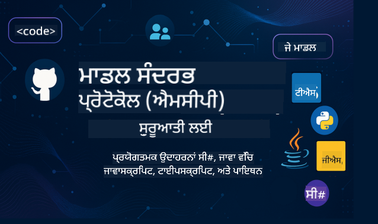

<!--
CO_OP_TRANSLATOR_METADATA:
{
  "original_hash": "2a21391378c12ecfef50f866329dfde0",
  "translation_date": "2025-05-17T05:22:51+00:00",
  "source_file": "README.md",
  "language_code": "pa"
}
-->

ਇਹ ਸਾਧਨ ਦੀ ਵਰਤੋਂ ਸ਼ੁਰੂ ਕਰਨ ਲਈ ਇਹਨਾਂ ਕਦਮਾਂ ਦੀ ਪਾਲਣਾ ਕਰੋ:
1. **Repository ਨੂੰ Fork ਕਰੋ**: ਕਲਿਕ ਕਰੋ 
2. **Repository ਨੂੰ Clone ਕਰੋ**:   `git clone https://github.com/microsoft/mcp-for-beginners.git`
3. [**Microsoft Azure AI Foundry Discord ਵਿੱਚ ਸ਼ਾਮਿਲ ਹੋਵੋ ਅਤੇ ਮਾਹਿਰਾਂ ਅਤੇ ਸਾਥੀ ਵਿਕਾਸਕਾਰਾਂ ਨਾਲ ਮਿਲੋ**](https://discord.com/invite/ByRwuEEgH4)

### 🌐 ਬਹੁ-ਭਾਸ਼ਾਈ ਸਹਾਇਤਾ

#### GitHub Action ਰਾਹੀਂ ਸਹਾਇਤਿਤ (ਸਵੈਚਾਲਿਤ ਅਤੇ ਸਦਾ-ਅਪ-ਟੂ-ਡੇਟ)
[ਫਰਾਂਸਿਸੀ](../fr/README.md) | [ਸਪੇਨੀ](../es/README.md) | [ਜਰਮਨ](../de/README.md) | [ਰੂਸੀ](../ru/README.md) | [ਅਰਬੀ](../ar/README.md) | [ਫ਼ਾਰਸੀ (ਪਰਸੀ)](../fa/README.md) | [ਉਰਦੂ](../ur/README.md) | [ਚੀਨੀ (ਸਰਲ)](../zh/README.md) | [ਚੀਨੀ (ਪਾਰੰਪਰਿਕ, ਮਕਾਉ)](../mo/README.md) | [ਚੀਨੀ (ਪਾਰੰਪਰਿਕ, ਹਾਂਗ ਕਾਂਗ)](../hk/README.md) | [ਚੀਨੀ (ਪਾਰੰਪਰਿਕ, ਤਾਈਵਾਨ)](../tw/README.md) | [ਜਾਪਾਨੀ](../ja/README.md) | [ਕੋਰੀਆਈ](../ko/README.md) | [ਹਿੰਦੀ](../hi/README.md) | [ਬੰਗਾਲੀ](../bn/README.md) | [ਮਰਾਠੀ](../mr/README.md) | [ਨੇਪਾਲੀ](../ne/README.md) | [ਪੰਜਾਬੀ (ਗੁਰਮੁਖੀ)](./README.md) | [ਪੁਰਤਗਾਲੀ (ਪੁਰਤਗਾਲ)](../pt/README.md) | [ਪੁਰਤਗਾਲੀ (ਬ੍ਰਾਜ਼ੀਲ)](../br/README.md) | [ਇਟਾਲਵੀ](../it/README.md) | [ਪੋਲੈਂਡੀ](../pl/README.md) | [ਤੁਰਕੀ](../tr/README.md) | [ਯੂਨਾਨੀ](../el/README.md) | [ਥਾਈ](../th/README.md) | [ਸਵੀਡਿਸ਼](../sv/README.md) | [ਡੈਨਿਸ਼](../da/README.md) | [ਨਾਰਵੇਜੀ](../no/README.md) | [ਫਿਨਲੈਂਡੀ](../fi/README.md) | [ਡੱਚ](../nl/README.md) | [ਹਿਬਰੂ](../he/README.md) | [ਵਿਯਤਨਾਮੀ](../vi/README.md) | [ਇੰਡੋਨੇਸ਼ੀਆਈ](../id/README.md) | [ਮਲਾਈ](../ms/README.md) | [ਟੈਗਾਲੋਗ (ਫਿਲਿਪੀਨੋ)](../tl/README.md) | [ਸਵਾਹਿਲੀ](../sw/README.md) | [ਹੰਗਰੀ](../hu/README.md) | [ਚੈਕ](../cs/README.md) | [ਸਲੋਵਾਕ](../sk/README.md) | [ਰੋਮਾਨੀ](../ro/README.md) | [ਬੁਲਗਾਰੀਆਈ](../bg/README.md) | [ਸਰਬੀ (ਸਿਰਿਲਿਕ)](../sr/README.md) | [ਕਰੋਏਸ਼ੀਆਈ](../hr/README.md) | [ਸਲੋਵੇਨੀਆਈ](../sl/README.md)
# 🚀 ਨਵੀਂ ਸ਼ੁਰੂਆਤ ਕਰਨ ਵਾਲਿਆਂ ਲਈ ਮਾਡਲ ਕਾਂਟੈਕਸਟ ਪ੍ਰੋਟੋਕੋਲ (MCP) ਕਰੀਕੂਲਮ ਦੀ ਅਲਟੀਮੇਟ ਗਾਈਡ

## **C#, Java, JavaScript, Python, ਅਤੇ TypeScript ਵਿੱਚ ਹੱਥੋਂ-ਹੱਥ ਕੋਡ ਉਦਾਹਰਨਾਂ ਨਾਲ MCP ਸਿੱਖੋ**

## 🧠 ਮਾਡਲ ਕਾਂਟੈਕਸਟ ਪ੍ਰੋਟੋਕੋਲ ਕਰੀਕੂਲਮ ਦੀ ਝਲਕ

**ਮਾਡਲ ਕਾਂਟੈਕਸਟ ਪ੍ਰੋਟੋਕੋਲ (MCP)** ਇੱਕ ਅਧੁਨਿਕ ਫਰੇਮਵਰਕ ਹੈ ਜੋ AI ਮਾਡਲਾਂ ਅਤੇ ਕਲਾਇੰਟ ਐਪਲੀਕੇਸ਼ਨਾਂ ਦੇ ਵਿਚਕਾਰ ਸੰਵਾਦਾਂ ਨੂੰ ਮਿਆਰੀਕ੍ਰਿਤ ਕਰਨ ਲਈ ਤਿਆਰ ਕੀਤਾ ਗਿਆ ਹੈ। ਇਹ ਖੁੱਲ੍ਹਾ-ਸਰੋਤ ਕਰੀਕੂਲਮ ਇੱਕ ਢਾਂਚਬੱਧ ਸਿੱਖਣ ਦਾ ਮਾਰਗ ਪ੍ਰਦਾਨ ਕਰਦਾ ਹੈ, ਜਿਸ ਵਿੱਚ C#, Java, JavaScript, TypeScript, ਅਤੇ Python ਸਮੇਤ ਲੋਕਪ੍ਰਿਯ ਪ੍ਰੋਗ੍ਰਾਮਿੰਗ ਭਾਸ਼ਾਵਾਂ ਵਿੱਚ ਵਿਹੰਗਮ ਕੋਡਿੰਗ ਉਦਾਹਰਨਾਂ ਅਤੇ ਅਸਲ-ਜਗਤ ਦੇ ਵਰਤਮਾਨ ਮੁਦਿਆਂ ਦੇ ਨਾਲ ਪੂਰੀ ਸਿੱਖਣ ਦੀ ਯਾਤਰਾ ਸ਼ਾਮਲ ਹੈ।

ਚਾਹੇ ਤੁਸੀਂ ਇੱਕ AI ਵਿਕਾਸਕ, ਸਿਸਟਮ ਆਰਕੀਟੈਕਟ, ਜਾਂ ਸੌਫਟਵੇਅਰ ਇੰਜੀਨੀਅਰ ਹੋਵੋ, ਇਹ ਗਾਈਡ MCP ਮੁੱਢਲੀ ਗੁਣਾਂ ਅਤੇ ਲਾਗੂ ਕਰਨ ਦੀਆਂ ਰਣਨੀਤੀਆਂ 'ਤੇ ਪੂਰੀ ਜਾਣਕਾਰੀ ਦਾ ਸਰੋਤ ਹੈ।

## 🔗 ਅਧਿਕਾਰਤ MCP ਸਰੋਤ

- 📘 [MCP ਦਸਤਾਵੇਜ਼](https://modelcontextprotocol.io/) – ਵਿਸਤ੍ਰਿਤ ਟਿਊਟੋਰੀਅਲ ਅਤੇ ਉਪਭੋਗਤਾ ਮਾਰਗਦਰਸ਼ਕ  
- 📜 [MCP ਵਿਸ਼ੇਸ਼ਤਾ](https://spec.modelcontextprotocol.io/) – ਪ੍ਰੋਟੋਕੋਲ ਆਰਕੀਟੈਕਚਰ ਅਤੇ ਤਕਨੀਕੀ ਸੰਦਰਭ  
- 🧑‍💻 [MCP GitHub ਰਿਪੋਜ਼ਟਰੀ](https://github.com/modelcontextprotocol) – ਖੁੱਲ੍ਹੇ-ਸਰੋਤ SDKs, ਟੂਲਜ਼, ਅਤੇ ਕੋਡ ਉਦਾਹਰਨਾਂ  

## 🧭 ਪੂਰਾ MCP ਕਰੀਕੂਲਮ ਢਾਂਚਾ

### 📌 [MCP ਦਾ ਪਰੀਚਯ](./00-Introduction/README.md)

- ਮਾਡਲ ਕਾਂਟੈਕਸਟ ਪ੍ਰੋਟੋਕੋਲ ਕੀ ਹੈ?
- AI ਪਾਈਪਲਾਈਨਾਂ ਵਿੱਚ ਮਿਆਰੀਕ੍ਰਿਤ ਕਰਨ ਦਾ ਮਹੱਤਵ ਕਿਉਂ ਹੈ
- MCP ਦੇ ਵਰਤਮਾਨ ਮਾਮਲੇ ਅਤੇ ਫਾਇਦੇ

### 🧩 [ਮੁੱਖ ਅਵਧਾਰਨਾਵਾਂ ਦੀ ਵਿਆਖਿਆ](./01-CoreConcepts/README.md)

- MCP ਵਿੱਚ ਕਲਾਇੰਟ-ਸਰਵਰ ਆਰਕੀਟੈਕਚਰ ਨੂੰ ਸਮਝਣਾ
- ਪ੍ਰੋਟੋਕੋਲ ਦੇ ਮੁੱਖ ਹਿੱਸੇ: ਬੇਨਤੀ, ਜਵਾਬ, ਅਤੇ ਸਕੀਮਾ
- MCP ਸੁਨੇਹੇ ਅਤੇ ਡਾਟਾ ਅਦਲ-ਬਦਲ ਦੇ ਪੈਟਰਨ

### 🔐 [MCP ਵਿੱਚ ਸੁਰੱਖਿਆ](./02-Security/readme.md)

- MCP-ਅਧਾਰਿਤ ਸਿਸਟਮਾਂ ਵਿੱਚ ਸੁਰੱਖਿਆ ਖਤਰੇ ਦੀ ਪਹਿਚਾਣ
- ਲਾਗੂ ਕਰਨ ਦੀ ਸੁਰੱਖਿਆ ਲਈ ਤਕਨੀਕਾਂ ਅਤੇ ਚੰਗੀਆਂ ਅਭਿਆਸ

### 🚀 [MCP ਨਾਲ ਸ਼ੁਰੂਆਤ](./03-GettingStarted/README.md)

- ਵਾਤਾਵਰਣ ਸੈਟਅਪ ਅਤੇ ਸੰਰਚਨਾ
- ਬੁਨਿਆਦੀ MCP ਸਰਵਰ ਅਤੇ ਕਲਾਇੰਟ ਬਣਾਉਣਾ
- ਮੌਜੂਦਾ ਐਪਲੀਕੇਸ਼ਨਾਂ ਨਾਲ MCP ਨੂੰ ਜੋੜਨਾ

#### 🧮 MCP ਕੈਲਕੂਲੇਟਰ ਨਮੂਨਾ ਪ੍ਰੋਜੈਕਟ:

  
<strong>ਭਾਸ਼ਾ ਦੁਆਰਾ ਕੋਡ ਲਾਗੂ ਕਰਨ ਦੀ ਖੋਜ ਕਰੋ</strong>

  - [C# MCP ਸਰਵਰ ਉਦਾਹਰਨ](./03-GettingStarted/samples/csharp/README.md)
  - [Java MCP ਕੈਲਕੂਲੇਟਰ](./03-GettingStarted/samples/java/calculator/README.md)
  - [JavaScript MCP ਡੈਮੋ](./03-GettingStarted/samples/javascript/README.md)
  - [Python MCP ਸਰਵਰ](../../03-GettingStarted/samples/python/mcp_calculator_server.py)
  - [TypeScript MCP ਉਦਾਹਰਨ](./03-GettingStarted/samples/typescript/README.md)

### 🛠️ [ਵਿਹੰਗਮ ਲਾਗੂਕਰਨ](./04-PracticalImplementation/README.md)

- ਵੱਖ-ਵੱਖ ਭਾਸ਼ਾਵਾਂ ਵਿੱਚ SDKs ਦੀ ਵਰਤੋਂ
- ਡੀਬੱਗਿੰਗ, ਟੈਸਟਿੰਗ, ਅਤੇ ਪ੍ਰਮਾਣਿਕਤਾ
- ਦੁਹਰਾਉਣਯੋਗ ਪ੍ਰਾਪਟ ਟੈਂਪਲੇਟ ਅਤੇ ਵਰਕਫਲੋ ਬਣਾਉਣਾ

#### 💡 MCP ਉੱਚ-ਪੱਧਰੀ ਕੈਲਕੂਲੇਟਰ ਪ੍ਰੋਜੈਕਟ:

  
<strong>ਉੱਚ-ਪੱਧਰੀ ਨਮੂਨਾਂ ਦੀ ਖੋਜ ਕਰੋ</strong>

  - [ਉੱਚ-ਪੱਧਰੀ C# ਨਮੂਨਾ](./04-PracticalImplementation/samples/csharp/README.md)
  - [Java ਕੰਟੇਨਰ ਐਪ ਉਦਾਹਰਨ](./04-PracticalImplementation/samples/java/containerapp/README.md)
  - [JavaScript ਉੱਚ-ਪੱਧਰੀ ਨਮੂਨਾ](./04-PracticalImplementation/samples/javascript/README.md)
  - [Python ਜਟਿਲ ਲਾਗੂਕਰਨ](../../04-PracticalImplementation/samples/python/mcp_sample.py)
  - [TypeScript ਕੰਟੇਨਰ ਨਮੂਨਾ](./04-PracticalImplementation/samples/typescript/README.md)

### 🎓 [MCP ਵਿੱਚ ਉੱਚ-ਪੱਧਰੀ ਵਿਸ਼ੇ](./05-AdvancedTopics/README.md)

- ਮਲਟੀ-ਮੋਡਲ AI ਵਰਕਫਲੋ ਅਤੇ ਵਧੇਰੇ ਵਰਤਮਾਨ
- ਸੁਰੱਖਿਅਤ ਵਧੇਰੇ ਰਣਨੀਤੀਆਂ
- ਵਿਸ਼ਾਲ ਉਪਕਰਮ ਵਿੱਚ MCP

### 🌍 [ਸਮੁਦਾਇਕ ਯੋਗਦਾਨ](./06-CommunityContributions/README.md)

- ਕੋਡ ਅਤੇ ਦਸਤਾਵੇਜ਼ ਵਿੱਚ ਯੋਗਦਾਨ ਕਿਵੇਂ ਦਿਓ
- GitHub ਦੁਆਰਾ ਸਹਿਯੋਗ
- ਸਮੁਦਾਇਕ-ਚਲਾਏ ਗਏ ਸੁਧਾਰ ਅਤੇ ਪ੍ਰਤੀਕਰਮ

### 📈 [ਸ਼ੁਰੂਆਤੀ ਅਪਨਾਵਤ ਤੋਂ ਅੰਤਰਦ੍ਰਿਸ਼ਟੀ](./07-CaseStudies/README.md)

- ਅਸਲ-ਜਗਤ ਦੀ ਲਾਗੂਕਰਨ ਅਤੇ ਕੀ ਕੰਮ ਕੀਤਾ
- MCP-ਅਧਾਰਿਤ ਹੱਲ ਬਣਾਉਣਾ ਅਤੇ ਤਿਆਰ ਕਰਨਾ
- ਰੁਝਾਨ ਅਤੇ ਭਵਿੱਖ ਦੀ ਯੋਜਨਾ

### 📏 [MCP ਲਈ ਚੰਗੇ ਅਭਿਆਸ](./08-BestPractices/README.md)

- ਪ੍ਰਦਰਸ਼ਨ ਟਿਊਨਿੰਗ ਅਤੇ ਸਧਾਰਨ
- ਦੋਸ਼-ਸਹਿਣਸ਼ੀਲ MCP ਸਿਸਟਮਾਂ ਨੂੰ ਡਿਜ਼ਾਈਨ ਕਰਨਾ
- ਟੈਸਟਿੰਗ ਅਤੇ ਸਹਿਣਸ਼ੀਲਤਾ ਰਣਨੀਤੀਆਂ

### 📊 [MCP ਕੇਸ ਸਟੱਡੀ](./09-CaseStudy/Readme.md)

- MCP ਹੱਲ ਆਰਕੀਟੈਕਚਰ ਵਿੱਚ ਗਹਿਰਾਈ ਨਾਲ ਜਾਣਕਾਰੀ
- ਤਿਆਰੀ ਨਕਸ਼ੇ ਅਤੇ ਜੁੜਨ ਦੀਆਂ ਟਿਪਾਂ
- ਵਿਆਖਿਆਤਮਕ ਡਾਇਗ੍ਰਾਮ ਅਤੇ ਪ੍ਰੋਜੈਕਟ ਦੀ ਖੋਜ

## 🎯 MCP ਸਿੱਖਣ ਲਈ ਪੂਰਵ-ਆਵਸ਼ਕਤਾਵਾਂ

ਇਸ ਕਰੀਕੂਲਮ ਦਾ ਵਧੇਰੇ ਲਾਭ ਪ੍ਰਾਪਤ ਕਰਨ ਲਈ ਤੁਹਾਨੂੰ:

- C#, Java, ਜਾਂ Python ਦੀ ਬੁਨਿਆਦੀ ਜਾਣਕਾਰੀ ਹੋਣੀ ਚਾਹੀਦੀ ਹੈ
- ਕਲਾਇੰਟ-ਸਰਵਰ ਮਾਡਲ ਅਤੇ APIs ਦੀ ਸਮਝ ਹੋਣੀ ਚਾਹੀਦੀ ਹੈ
- (ਵਿਕਲਪਿਕ) ਮਸ਼ੀਨ ਲਰਨਿੰਗ ਅਵਧਾਰਨਾਵਾਂ ਨਾਲ ਜਾਣ-ਪਛਾਣ ਹੋਣੀ ਚਾਹੀਦੀ ਹੈ

## 🛠️ ਇਸ ਕਰੀਕੂਲਮ ਨੂੰ ਪ੍ਰਭਾਵਸ਼ਾਲੀ ਤਰੀਕੇ ਨਾਲ ਕਿਵੇਂ ਵਰਤਣਾ ਹੈ

ਇਸ ਗਾਈਡ ਵਿੱਚ ਹਰ ਪਾਠ ਸ਼ਾਮਲ ਹੈ:

1. MCP ਅਵਧਾਰਨਾਵਾਂ ਦੀ ਸਪਸ਼ਟ ਵਿਆਖਿਆ  
2. ਕਈ ਭਾਸ਼ਾਵਾਂ ਵਿੱਚ ਲਾਈਵ ਕੋਡ ਉਦਾਹਰਨਾਂ  
3. ਅਸਲ MCP ਐਪਲੀਕੇਸ਼ਨ ਬਣਾਉਣ ਲਈ ਅਭਿਆਸ  
4. ਉੱਚ-ਪੱਧਰੀ ਸਿੱਖਿਆਰਥੀਆਂ ਲਈ ਵਾਧੂ ਸਰੋਤ  

## 📜 ਲਾਇਸੈਂਸ ਜਾਣਕਾਰੀ

ਇਹ ਸਮੱਗਰੀ **MIT ਲਾਇਸੈਂਸ** ਦੇ ਤਹਿਤ ਲਾਇਸੈਂਸ ਕੀਤੀ ਗਈ ਹੈ। ਸ਼ਰਤਾਂ ਅਤੇ ਨਿਯਮਾਂ ਲਈ, [LICENSE](../../LICENSE) ਵੇਖੋ।

## 🤝 ਯੋਗਦਾਨ ਮਾਰਗਦਰਸ਼ਕ

ਇਹ ਪ੍ਰੋਜੈਕਟ ਯੋਗਦਾਨ ਅਤੇ ਸੁਝਾਅਾਂ ਨੂੰ ਸਵਾਗਤ ਕਰਦਾ ਹੈ। ਜ਼ਿਆਦਾਤਰ ਯੋਗਦਾਨਾਂ ਨੂੰ ਤੁਹਾਨੂੰ ਇੱਕ
ਯੋਗਦਾਨ ਲਾਇਸੈਂਸ ਸਮਝੌਤੇ (CLA) 'ਤੇ ਸਹਿਮਤ ਹੋਣ ਦੀ ਲੋੜ ਹੈ ਜਿਸ ਵਿੱਚ ਤੁਹਾਨੂੰ ਇਹ ਘੋਸ਼ਣਾ ਕਰਨੀ ਹੈ ਕਿ ਤੁਹਾਡੇ ਕੋਲ ਯੋਗਦਾਨ ਦੇ ਅਧਿਕਾਰ ਹਨ ਅਤੇ ਤੁਸੀਂ ਸਾਡੇ ਲਈ
ਤੁਹਾਡਾ ਯੋਗਦਾਨ ਵਰਤਣ ਦੇ ਅਧਿਕਾਰ ਪ੍ਰਦਾਨ ਕਰਦੇ ਹੋ। ਵਿਸਤ੍ਰਿਤ ਜਾਣਕਾਰੀ ਲਈ, <https://cla.opensource.microsoft.com> 'ਤੇ ਜਾਓ।

ਜਦੋਂ ਤੁਸੀਂ ਇੱਕ ਪੂਲ ਅਨੁਰੋਧ ਜਮ੍ਹਾਂ ਕਰਦੇ ਹੋ, ਇੱਕ CLA ਬੋਟ ਸਵੈਚਾਲਕ ਤਰੀਕੇ ਨਾਲ ਇਹ ਨਿਰਧਾਰਤ ਕਰੇਗਾ ਕਿ ਕੀ ਤੁਹਾਨੂੰ CLA ਪ੍ਰਦਾਨ ਕਰਨ ਦੀ ਲੋੜ ਹੈ
ਅਤੇ PR ਨੂੰ ਸਹੀ ਤਰੀਕੇ ਨਾਲ ਸਜਾਵਟ ਕਰੇਗਾ (ਉਦਾਹਰਨ ਲਈ, ਸਥਿਤੀ ਚੈੱਕ, ਟਿੱਪਣੀ)। ਬੋਟ ਦੁਆਰਾ ਦਿੱਤੀਆਂ ਹਦਾਇਤਾਂ ਨੂੰ ਅਨੁਸਰਣ ਕਰੋ।
ਤੁਹਾਨੂੰ ਸਾਡੇ CLA ਨੂੰ ਵਰਤ ਰਹੇ ਸਾਰੇ ਰਿਪੋਜ਼ਟਰੀਜ਼ ਵਿੱਚ ਸਿਰਫ ਇੱਕ ਵਾਰ ਇਹ ਕਰਨ ਦੀ ਲੋੜ ਹੈ।

ਇਸ ਪ੍ਰੋਜੈਕਟ ਨੇ [Microsoft ਖੁੱਲ੍ਹਾ ਸਰੋਤ ਕੋਡ ਆਚਰਣ](https://opensource.microsoft.com/codeofconduct/) ਨੂੰ ਅਪਨਾਇਆ ਹੈ।
ਵਿਸਤ੍ਰਿਤ ਜਾਣਕਾਰੀ ਲਈ [Code of Conduct FAQ](https://opensource.microsoft.com/codeofconduct/faq/) ਜਾਂ
ਕੋਈ ਵਾਧੂ ਸਵਾਲ ਜਾਂ ਟਿੱਪਣੀ ਲਈ [opencode@microsoft.com](mailto:opencode@microsoft.com) ਨਾਲ ਸੰਪਰਕ ਕਰੋ।

## ™️ ਟਰੇਡਮਾਰਕ ਨੋਟਿਸ

ਇਸ ਪ੍ਰੋਜੈਕਟ ਵਿੱਚ ਪ੍ਰੋਜੈਕਟਾਂ, ਉਤਪਾਦਾਂ, ਜਾਂ ਸੇਵਾਵਾਂ ਲਈ ਟਰੇਡਮਾਰਕ ਜਾਂ ਲੋਗੋ ਸ਼ਾਮਲ ਹੋ ਸਕਦੇ ਹਨ। Microsoft
ਟਰੇਡਮਾਰਕ ਜਾਂ ਲੋਗੋ ਦੀ ਅਧਿਕਾਰਤ ਵਰਤੋਂ [Microsoft's Trademark & Brand Guidelines](https://www.microsoft.com/legal/intellectualproperty/trademarks/usage/general) ਦਾ ਪਾਲਣ ਕਰਨਾ ਚਾਹੀਦਾ ਹੈ।
ਇਸ ਪ੍ਰੋਜੈਕਟ ਦੇ ਸੰਸ਼ੋਧਿਤ ਸੰਸਕਰਣਾਂ ਵਿੱਚ Microsoft ਟਰੇਡਮਾਰਕ ਜਾਂ ਲੋਗੋ ਦੀ ਵਰਤੋਂ ਕੋਈ ਗੁੰਝਲ ਨਹੀਂ ਪੈਦਾ ਕਰਨੀ ਚਾਹੀਦੀ ਹੈ ਜਾਂ Microsoft ਪ੍ਰਾਯੋਜਨ ਦਾ ਇਸ਼ਾਰਾ ਨਹੀਂ ਕਰਨੀ ਚਾਹੀਦੀ ਹੈ।
ਕਿਸੇ ਵੀ ਤੀਸਰੇ ਪੱਖ ਦੇ ਟਰੇਡਮਾਰਕ ਜਾਂ ਲੋਗੋ ਦੀ ਵਰਤੋਂ ਉਹਨਾਂ ਤੀਸਰੇ ਪੱਖ ਦੇ ਨੀਤੀਆਂ ਦੇ ਅਧੀਨ ਹੈ।

**ਅਸਵੀਕਰਤੀ**:  
ਇਹ ਦਸਤਾਵੇਜ਼ AI ਅਨੁਵਾਦ ਸੇਵਾ [Co-op Translator](https://github.com/Azure/co-op-translator) ਦੀ ਵਰਤੋਂ ਕਰਕੇ ਅਨੁਵਾਦ ਕੀਤਾ ਗਿਆ ਹੈ। ਜਦੋਂ ਕਿ ਅਸੀਂ ਸ਼ੁੱਧਤਾ ਲਈ ਯਤਨਸ਼ੀਲ ਹਾਂ, ਕਿਰਪਾ ਕਰਕੇ ਧਿਆਨ ਵਿੱਚ ਰੱਖੋ ਕਿ ਸਵੈਚਾਲਿਤ ਅਨੁਵਾਦਾਂ ਵਿੱਚ ਗਲਤੀਆਂ ਜਾਂ ਅਸੁੱਰਤਾਵਾਂ ਹੋ ਸਕਦੀਆਂ ਹਨ। ਇਸ ਦੀ ਮੂਲ ਭਾਸ਼ਾ ਵਿੱਚ ਮੂਲ ਦਸਤਾਵੇਜ਼ ਨੂੰ ਅਧਿਕਾਰਤ ਸਰੋਤ ਮੰਨਿਆ ਜਾਣਾ ਚਾਹੀਦਾ ਹੈ। ਗੰਭੀਰ ਜਾਣਕਾਰੀ ਲਈ, ਪੇਸ਼ੇਵਰ ਮਨੁੱਖੀ ਅਨੁਵਾਦ ਦੀ ਸਿਫਾਰਸ਼ ਕੀਤੀ ਜਾਂਦੀ ਹੈ। ਇਸ ਅਨੁਵਾਦ ਦੀ ਵਰਤੋਂ ਤੋਂ ਪੈਦਾ ਹੋਣ ਵਾਲੀਆਂ ਕਿਸੇ ਵੀ ਗਲਤਫਹਿਮੀਆਂ ਜਾਂ ਗਲਤ ਵਿਆਖਿਆਵਾਂ ਲਈ ਅਸੀਂ ਜ਼ਿੰਮੇਵਾਰ ਨਹੀਂ ਹਾਂ।