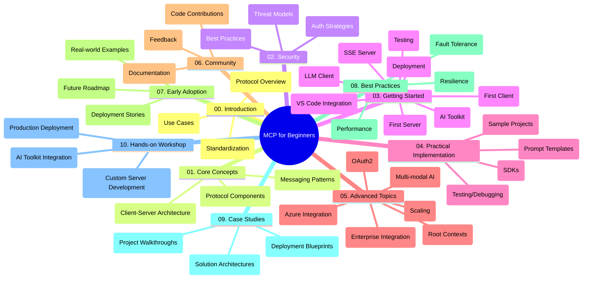

<!--
CO_OP_TRANSLATOR_METADATA:
{
  "original_hash": "a607d4febc94caee9a12b77795f7fc9a",
  "translation_date": "2025-07-13T15:13:01+00:00",
  "source_file": "study_guide.md",
  "language_code": "pa"
}
-->
# Model Context Protocol (MCP) for Beginners - ਅਧਿਐਨ ਮਾਰਗਦਰਸ਼ਿਕਾ

ਇਹ ਅਧਿਐਨ ਮਾਰਗਦਰਸ਼ਿਕਾ "Model Context Protocol (MCP) for Beginners" ਕੋਰਸ ਲਈ ਰਿਪੋਜ਼ਟਰੀ ਦੀ ਬਣਤਰ ਅਤੇ ਸਮੱਗਰੀ ਦਾ ਇੱਕ ਝਲਕ ਪ੍ਰਦਾਨ ਕਰਦੀ ਹੈ। ਇਸ ਮਾਰਗਦਰਸ਼ਿਕਾ ਦੀ ਵਰਤੋਂ ਕਰਕੇ ਤੁਸੀਂ ਰਿਪੋਜ਼ਟਰੀ ਵਿੱਚ ਸੁਚੱਜੇ ਤਰੀਕੇ ਨਾਲ ਨੈਵੀਗੇਟ ਕਰ ਸਕਦੇ ਹੋ ਅਤੇ ਉਪਲਬਧ ਸਰੋਤਾਂ ਦਾ ਪੂਰਾ ਲਾਭ ਉਠਾ ਸਕਦੇ ਹੋ।

## ਰਿਪੋਜ਼ਟਰੀ ਦਾ ਝਲਕ

Model Context Protocol (MCP) ਇੱਕ ਮਿਆਰੀ ਢਾਂਚਾ ਹੈ ਜੋ AI ਮਾਡਲਾਂ ਅਤੇ ਕਲਾਇੰਟ ਐਪਲੀਕੇਸ਼ਨਾਂ ਵਿਚਕਾਰ ਇੰਟਰੈਕਸ਼ਨਾਂ ਲਈ ਬਣਾਇਆ ਗਿਆ ਹੈ। ਇਹ ਰਿਪੋਜ਼ਟਰੀ C#, Java, JavaScript, Python, ਅਤੇ TypeScript ਵਿੱਚ ਹੱਥੋਂ-ਹੱਥ ਕੋਡ ਉਦਾਹਰਣਾਂ ਸਮੇਤ ਇੱਕ ਵਿਸਤ੍ਰਿਤ ਕੋਰਸ ਪ੍ਰਦਾਨ ਕਰਦੀ ਹੈ, ਜੋ AI ਡਿਵੈਲਪਰਾਂ, ਸਿਸਟਮ ਆਰਕੀਟੈਕਟਾਂ ਅਤੇ ਸਾਫਟਵੇਅਰ ਇੰਜੀਨੀਅਰਾਂ ਲਈ ਤਿਆਰ ਕੀਤਾ ਗਿਆ ਹੈ।

## ਵਿਜ਼ੂਅਲ ਕੋਰਸ ਨਕਸ਼ਾ

## ਰਿਪੋਜ਼ਟਰੀ ਦੀ ਬਣਤਰ

ਰਿਪੋਜ਼ਟਰੀ ਨੂੰ ਦਸ ਮੁੱਖ ਭਾਗਾਂ ਵਿੱਚ ਵੰਡਿਆ ਗਿਆ ਹੈ, ਜਿਹੜੇ MCP ਦੇ ਵੱਖ-ਵੱਖ ਪਹਲੂਆਂ 'ਤੇ ਧਿਆਨ ਕੇਂਦਰਿਤ ਕਰਦੇ ਹਨ:

1. **ਪ੍ਰਸਤਾਵਨਾ (00-Introduction/)**
   - Model Context Protocol ਦਾ ਜਾਇਜ਼ਾ
   - AI ਪਾਈਪਲਾਈਨਾਂ ਵਿੱਚ ਮਿਆਰੀਕਰਨ ਦੀ ਮਹੱਤਤਾ
   - ਪ੍ਰਯੋਗਿਕ ਮਾਮਲੇ ਅਤੇ ਲਾਭ

2. **ਮੁੱਖ ਧਾਰਣਾਵਾਂ (01-CoreConcepts/)**
   - ਕਲਾਇੰਟ-ਸਰਵਰ ਆਰਕੀਟੈਕਚਰ
   - ਮੁੱਖ ਪ੍ਰੋਟੋਕੋਲ ਘਟਕ
   - MCP ਵਿੱਚ ਮੈਸੇਜਿੰਗ ਪੈਟਰਨ

3. **ਸੁਰੱਖਿਆ (02-Security/)**
   - MCP-ਅਧਾਰਿਤ ਸਿਸਟਮਾਂ ਵਿੱਚ ਸੁਰੱਖਿਆ ਖ਼ਤਰੇ
   - ਸੁਰੱਖਿਆ ਲਈ ਵਧੀਆ ਅਮਲ
   - ਪ੍ਰਮਾਣਿਕਤਾ ਅਤੇ ਅਧਿਕਾਰਣ ਰਣਨੀਤੀਆਂ

4. **ਸ਼ੁਰੂਆਤ (03-GettingStarted/)**
   - ਵਾਤਾਵਰਣ ਸੈਟਅੱਪ ਅਤੇ ਸੰਰਚਨਾ
   - ਬੁਨਿਆਦੀ MCP ਸਰਵਰ ਅਤੇ ਕਲਾਇੰਟ ਬਣਾਉਣਾ
   - ਮੌਜੂਦਾ ਐਪਲੀਕੇਸ਼ਨਾਂ ਨਾਲ ਇੰਟੀਗ੍ਰੇਸ਼ਨ
   - ਪਹਿਲਾ ਸਰਵਰ, ਪਹਿਲਾ ਕਲਾਇੰਟ, LLM ਕਲਾਇੰਟ, VS Code ਇੰਟੀਗ੍ਰੇਸ਼ਨ, SSE ਸਰਵਰ, AI Toolkit, ਟੈਸਟਿੰਗ ਅਤੇ ਡਿਪਲੋਇਮੈਂਟ ਲਈ ਉਪ-ਭਾਗ

5. **ਵਿਆਵਹਾਰਿਕ ਲਾਗੂਕਰਨ (04-PracticalImplementation/)**
   - ਵੱਖ-ਵੱਖ ਪ੍ਰੋਗ੍ਰਾਮਿੰਗ ਭਾਸ਼ਾਵਾਂ ਵਿੱਚ SDKs ਦੀ ਵਰਤੋਂ
   - ਡੀਬੱਗਿੰਗ, ਟੈਸਟਿੰਗ ਅਤੇ ਵੈਰੀਫਿਕੇਸ਼ਨ ਤਕਨੀਕਾਂ
   - ਦੁਬਾਰਾ ਵਰਤੋਂਯੋਗ ਪ੍ਰਾਂਪਟ ਟੈਮਪਲੇਟ ਅਤੇ ਵਰਕਫਲੋਜ਼ ਬਣਾਉਣਾ
   - ਲਾਗੂਕਰਨ ਉਦਾਹਰਣਾਂ ਸਮੇਤ ਨਮੂਨਾ ਪ੍ਰੋਜੈਕਟ

6. **ਉੱਨਤ ਵਿਸ਼ੇ (05-AdvancedTopics/)**
   - ਮਲਟੀ-ਮੋਡਲ AI ਵਰਕਫਲੋਜ਼ ਅਤੇ ਵਿਸਤਾਰਯੋਗਤਾ
   - ਸੁਰੱਖਿਅਤ ਸਕੇਲਿੰਗ ਰਣਨੀਤੀਆਂ
   - MCP ਦਾ ਉਦਯੋਗਿਕ ਪਰਿਵੇਸ਼ ਵਿੱਚ ਇਸਤੇਮਾਲ
   - ਵਿਸ਼ੇਸ਼ ਵਿਸ਼ੇ ਜਿਵੇਂ Azure ਇੰਟੀਗ੍ਰੇਸ਼ਨ, ਮਲਟੀ-ਮੋਡੈਲਿਟੀ, OAuth2, ਰੂਟ ਕਾਂਟੈਕਸਟ, ਰਾਊਟਿੰਗ, ਸੈਂਪਲਿੰਗ, ਸਕੇਲਿੰਗ, ਸੁਰੱਖਿਆ, ਵੈੱਬ ਖੋਜ ਇੰਟੀਗ੍ਰੇਸ਼ਨ ਅਤੇ ਸਟ੍ਰੀਮਿੰਗ

7. **ਕਮਿਊਨਿਟੀ ਯੋਗਦਾਨ (06-CommunityContributions/)**
   - ਕੋਡ ਅਤੇ ਦਸਤਾਵੇਜ਼ੀਕਰਨ ਵਿੱਚ ਯੋਗਦਾਨ ਦੇਣ ਦਾ ਤਰੀਕਾ
   - GitHub ਰਾਹੀਂ ਸਹਿਯੋਗ
   - ਕਮਿਊਨਿਟੀ-ਚਲਿਤ ਸੁਧਾਰ ਅਤੇ ਫੀਡਬੈਕ

8. **ਸ਼ੁਰੂਆਤੀ ਅਪਣਾਉਣ ਤੋਂ ਸਿੱਖਿਆ (07-LessonsfromEarlyAdoption/)**
   - ਅਸਲੀ ਦੁਨੀਆ ਦੇ ਲਾਗੂਕਰਨ ਅਤੇ ਸਫਲਤਾ ਕਹਾਣੀਆਂ
   - MCP-ਅਧਾਰਿਤ ਹੱਲਾਂ ਦਾ ਨਿਰਮਾਣ ਅਤੇ ਡਿਪਲੋਇਮੈਂਟ
   - ਰੁਝਾਨ ਅਤੇ ਭਵਿੱਖ ਦਾ ਰੋਡਮੈਪ

9. **ਵਧੀਆ ਅਮਲ (08-BestPractices/)**
   - ਪ੍ਰਦਰਸ਼ਨ ਸੁਧਾਰ ਅਤੇ ਅਪਟੀਮਾਈਜ਼ੇਸ਼ਨ
   - ਫਾਲਟ-ਟੋਲਰੈਂਟ MCP ਸਿਸਟਮਾਂ ਦੀ ਡਿਜ਼ਾਈਨਿੰਗ
   - ਟੈਸਟਿੰਗ ਅਤੇ ਲਚੀਲਾਪਣ ਰਣਨੀਤੀਆਂ

10. **ਕੇਸ ਅਧਿਐਨ (09-CaseStudy/)**
    - MCP ਹੱਲਾਂ ਦੀਆਂ ਡੂੰਘੀਆਂ ਵਿਸ਼ਲੇਸ਼ਣਾਂ
    - ਡਿਪਲੋਇਮੈਂਟ ਬਲੂਪ੍ਰਿੰਟ ਅਤੇ ਇੰਟੀਗ੍ਰੇਸ਼ਨ ਟਿੱਪਸ
    - ਟਿੱਪਣੀ ਕੀਤੀਆਂ ਡਾਇਗ੍ਰਾਮਾਂ ਅਤੇ ਪ੍ਰੋਜੈਕਟ ਵਾਕਥਰੂਜ਼

11. **ਹੱਥੋਂ-ਹੱਥ ਵਰਕਸ਼ਾਪ (10-StreamliningAIWorkflowsBuildingAnMCPServerWithAIToolkit/)**
    - MCP ਨੂੰ Microsoft ਦੇ AI Toolkit ਨਾਲ ਜੋੜ ਕੇ ਵਿਸਤ੍ਰਿਤ ਹੱਥੋਂ-ਹੱਥ ਵਰਕਸ਼ਾਪ
    - AI ਮਾਡਲਾਂ ਨੂੰ ਅਸਲੀ ਦੁਨੀਆ ਦੇ ਟੂਲਾਂ ਨਾਲ ਜੋੜਨ ਵਾਲੀਆਂ ਸਮਾਰਟ ਐਪਲੀਕੇਸ਼ਨਾਂ ਦਾ ਨਿਰਮਾਣ
    - ਮੂਲਭੂਤ ਤੱਤ, ਕਸਟਮ ਸਰਵਰ ਵਿਕਾਸ ਅਤੇ ਉਤਪਾਦਨ ਡਿਪਲੋਇਮੈਂਟ ਰਣਨੀਤੀਆਂ ਸਮੇਤ ਪ੍ਰਯੋਗਿਕ ਮਾਡਿਊਲ

## ਨਮੂਨਾ ਪ੍ਰੋਜੈਕਟ

ਰਿਪੋਜ਼ਟਰੀ ਵਿੱਚ ਕਈ ਨਮੂਨਾ ਪ੍ਰੋਜੈਕਟ ਸ਼ਾਮਲ ਹਨ ਜੋ ਵੱਖ-ਵੱਖ ਪ੍ਰੋਗ੍ਰਾਮਿੰਗ ਭਾਸ਼ਾਵਾਂ ਵਿੱਚ MCP ਲਾਗੂਕਰਨ ਦਿਖਾਉਂਦੇ ਹਨ:

### ਬੁਨਿਆਦੀ MCP ਕੈਲਕੁਲੇਟਰ ਨਮੂਨੇ
- C# MCP ਸਰਵਰ ਉਦਾਹਰਣ
- Java MCP ਕੈਲਕੁਲੇਟਰ
- JavaScript MCP ਡੈਮੋ
- Python MCP ਸਰਵਰ
- TypeScript MCP ਉਦਾਹਰਣ

### ਉੱਨਤ MCP ਕੈਲਕੁਲੇਟਰ ਪ੍ਰੋਜੈਕਟ
- ਉੱਨਤ C# ਨਮੂਨਾ
- Java ਕੰਟੇਨਰ ਐਪ ਉਦਾਹਰਣ
- JavaScript ਉੱਨਤ ਨਮੂਨਾ
- Python ਜਟਿਲ ਲਾਗੂਕਰਨ
- TypeScript ਕੰਟੇਨਰ ਨਮੂਨਾ

## ਵਾਧੂ ਸਰੋਤ

ਰਿਪੋਜ਼ਟਰੀ ਵਿੱਚ ਸਹਾਇਕ ਸਰੋਤ ਸ਼ਾਮਲ ਹਨ:

- **Images ਫੋਲਡਰ**: ਕੋਰਸ ਦੌਰਾਨ ਵਰਤੇ ਗਏ ਡਾਇਗ੍ਰਾਮ ਅਤੇ ਚਿੱਤਰ
- **Translations**: ਦਸਤਾਵੇਜ਼ੀਕਰਨ ਦੇ ਆਟੋਮੈਟਿਕ ਅਨੁਵਾਦਾਂ ਨਾਲ ਬਹੁ-ਭਾਸ਼ਾਈ ਸਹਾਇਤਾ
- **ਅਧਿਕਾਰਿਕ MCP ਸਰੋਤ**:
  - [MCP Documentation](https://modelcontextprotocol.io/)
  - [MCP Specification](https://spec.modelcontextprotocol.io/)
  - [MCP GitHub Repository](https://github.com/modelcontextprotocol)

## ਇਸ ਰਿਪੋਜ਼ਟਰੀ ਦੀ ਵਰਤੋਂ ਕਿਵੇਂ ਕਰੀਏ

1. **ਕ੍ਰਮਵਾਰ ਸਿੱਖਿਆ**: ਇੱਕ ਢਾਂਚੇਵਾਰ ਸਿੱਖਣ ਲਈ ਅਧਿਆਇ 00 ਤੋਂ 10 ਤੱਕ ਕ੍ਰਮਵਾਰ ਪੜ੍ਹੋ।
2. **ਭਾਸ਼ਾ-ਵਿਸ਼ੇਸ਼ ਧਿਆਨ**: ਜੇ ਤੁਸੀਂ ਕਿਸੇ ਖਾਸ ਪ੍ਰੋਗ੍ਰਾਮਿੰਗ ਭਾਸ਼ਾ ਵਿੱਚ ਰੁਚੀ ਰੱਖਦੇ ਹੋ, ਤਾਂ ਆਪਣੇ ਮਨਪਸੰਦ ਭਾਸ਼ਾ ਵਿੱਚ ਲਾਗੂਕਰਨ ਲਈ ਨਮੂਨਾ ਡਾਇਰੈਕਟਰੀਜ਼ ਵੇਖੋ।
3. **ਵਿਆਵਹਾਰਿਕ ਲਾਗੂਕਰਨ**: ਆਪਣੇ ਵਾਤਾਵਰਣ ਨੂੰ ਸੈਟਅੱਪ ਕਰਨ ਅਤੇ ਪਹਿਲਾ MCP ਸਰਵਰ ਅਤੇ ਕਲਾਇੰਟ ਬਣਾਉਣ ਲਈ "Getting Started" ਭਾਗ ਨਾਲ ਸ਼ੁਰੂ ਕਰੋ।
4. **ਉੱਨਤ ਖੋਜ**: ਬੁਨਿਆਦੀ ਜਾਣਕਾਰੀ ਪ੍ਰਾਪਤ ਕਰਨ ਤੋਂ ਬਾਅਦ, ਆਪਣੇ ਗਿਆਨ ਨੂੰ ਵਧਾਉਣ ਲਈ ਉੱਨਤ ਵਿਸ਼ਿਆਂ ਵਿੱਚ ਡੁੱਬਕੀ ਲਗਾਓ।
5. **ਕਮਿਊਨਿਟੀ ਸਹਿਯੋਗ**: ਮਾਹਿਰਾਂ ਅਤੇ ਹੋਰ ਡਿਵੈਲਪਰਾਂ ਨਾਲ ਜੁੜਨ ਲਈ [Azure AI Foundry Discord](https://discord.com/invite/ByRwuEEgH4) ਵਿੱਚ ਸ਼ਾਮਿਲ ਹੋਵੋ।

## ਯੋਗਦਾਨ ਦੇਣਾ

ਇਹ ਰਿਪੋਜ਼ਟਰੀ ਕਮਿਊਨਿਟੀ ਤੋਂ ਯੋਗਦਾਨਾਂ ਦਾ ਸਵਾਗਤ ਕਰਦੀ ਹੈ। ਯੋਗਦਾਨ ਦੇਣ ਲਈ Community Contributions ਭਾਗ ਵਿੱਚ ਦਿੱਤੇ ਗਏ ਨਿਰਦੇਸ਼ਾਂ ਨੂੰ ਵੇਖੋ।

---

*ਇਹ ਅਧਿਐਨ ਮਾਰਗਦਰਸ਼ਿਕਾ 11 ਜੂਨ, 2025 ਨੂੰ ਬਣਾਈ ਗਈ ਸੀ ਅਤੇ ਉਸ ਸਮੇਂ ਤੱਕ ਰਿਪੋਜ਼ਟਰੀ ਦਾ ਇੱਕ ਝਲਕ ਪ੍ਰਦਾਨ ਕਰਦੀ ਹੈ। ਰਿਪੋਜ਼ਟਰੀ ਦੀ ਸਮੱਗਰੀ ਉਸ ਤੋਂ ਬਾਅਦ ਅੱਪਡੇਟ ਹੋ ਸਕਦੀ ਹੈ।*

**ਅਸਵੀਕਾਰੋਪਣ**:  
ਇਹ ਦਸਤਾਵੇਜ਼ AI ਅਨੁਵਾਦ ਸੇਵਾ [Co-op Translator](https://github.com/Azure/co-op-translator) ਦੀ ਵਰਤੋਂ ਕਰਕੇ ਅਨੁਵਾਦਿਤ ਕੀਤਾ ਗਿਆ ਹੈ। ਜਦੋਂ ਕਿ ਅਸੀਂ ਸਹੀਅਤ ਲਈ ਕੋਸ਼ਿਸ਼ ਕਰਦੇ ਹਾਂ, ਕਿਰਪਾ ਕਰਕੇ ਧਿਆਨ ਰੱਖੋ ਕਿ ਸਵੈਚਾਲਿਤ ਅਨੁਵਾਦਾਂ ਵਿੱਚ ਗਲਤੀਆਂ ਜਾਂ ਅਸਮਰਥਤਾਵਾਂ ਹੋ ਸਕਦੀਆਂ ਹਨ। ਮੂਲ ਦਸਤਾਵੇਜ਼ ਆਪਣੀ ਮੂਲ ਭਾਸ਼ਾ ਵਿੱਚ ਪ੍ਰਮਾਣਿਕ ਸਰੋਤ ਮੰਨਿਆ ਜਾਣਾ ਚਾਹੀਦਾ ਹੈ। ਮਹੱਤਵਪੂਰਨ ਜਾਣਕਾਰੀ ਲਈ, ਪੇਸ਼ੇਵਰ ਮਨੁੱਖੀ ਅਨੁਵਾਦ ਦੀ ਸਿਫਾਰਸ਼ ਕੀਤੀ ਜਾਂਦੀ ਹੈ। ਇਸ ਅਨੁਵਾਦ ਦੀ ਵਰਤੋਂ ਤੋਂ ਉਤਪੰਨ ਕਿਸੇ ਵੀ ਗਲਤਫਹਿਮੀ ਜਾਂ ਗਲਤ ਵਿਆਖਿਆ ਲਈ ਅਸੀਂ ਜ਼ਿੰਮੇਵਾਰ ਨਹੀਂ ਹਾਂ।