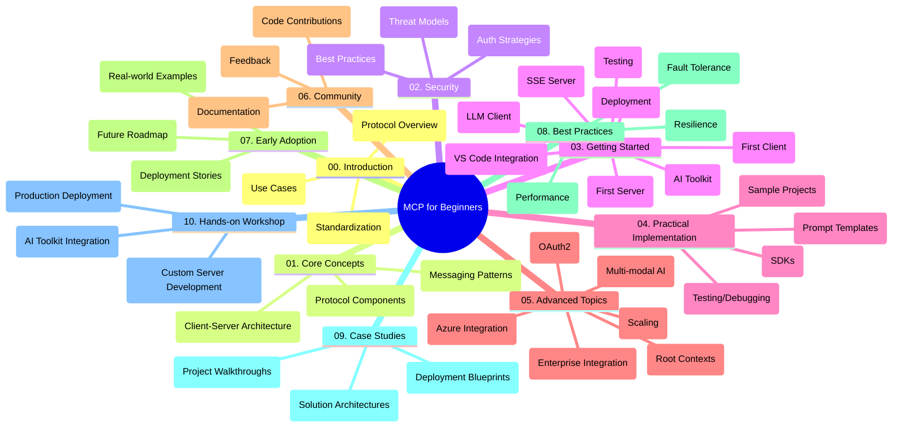

<!--
CO_OP_TRANSLATOR_METADATA:
{
  "original_hash": "a607d4febc94caee9a12b77795f7fc9a",
  "translation_date": "2025-06-11T16:41:37+00:00",
  "source_file": "study_guide.md",
  "language_code": "pa"
}
-->
# Model Context Protocol (MCP) for Beginners - ਅਧਿਐਨ ਗਾਈਡ

ਇਹ ਅਧਿਐਨ ਗਾਈਡ "Model Context Protocol (MCP) for Beginners" ਕੋਰਸ ਲਈ ਰਿਪੋਜ਼ਟਰੀ ਦੀ ਸੰਰਚਨਾ ਅਤੇ ਸਮੱਗਰੀ ਦਾ ਸਰਵੇਖਣ ਪ੍ਰਦਾਨ ਕਰਦੀ ਹੈ। ਇਸ ਗਾਈਡ ਦੀ ਵਰਤੋਂ ਕਰਕੇ ਰਿਪੋਜ਼ਟਰੀ ਵਿੱਚ ਸਹੀ ਤਰੀਕੇ ਨਾਲ ਨੈਵੀਗੇਟ ਕਰੋ ਅਤੇ ਉਪਲਬਧ ਸਾਧਨਾਂ ਦਾ ਪੂਰਾ ਲਾਭ ਉਠਾਓ।

## ਰਿਪੋਜ਼ਟਰੀ ਦਾ ਸਰਵੇਖਣ

Model Context Protocol (MCP) ਇੱਕ ਮਿਆਰੀਕ੍ਰਿਤ ਫਰੇਮਵਰਕ ਹੈ ਜੋ AI ਮਾਡਲਾਂ ਅਤੇ ਕਲਾਇੰਟ ਐਪਲੀਕੇਸ਼ਨਾਂ ਦੇ ਵਿਚਕਾਰ ਇੰਟਰਐਕਸ਼ਨ ਲਈ ਬਣਾਇਆ ਗਿਆ ਹੈ। ਇਹ ਰਿਪੋਜ਼ਟਰੀ C#, Java, JavaScript, Python, ਅਤੇ TypeScript ਵਿੱਚ ਹੱਥੋਂ-ਹੱਥ ਕੋਡ ਉਦਾਹਰਨਾਂ ਦੇ ਨਾਲ ਇੱਕ ਵਿਆਪਕ ਕੋਰਸ ਮੁਹੱਈਆ ਕਰਵਾਉਂਦੀ ਹੈ, ਜੋ AI ਵਿਕਾਸਕਾਰਾਂ, ਸਿਸਟਮ ਆਰਕੀਟੈਕਟਾਂ ਅਤੇ ਸੌਫਟਵੇਅਰ ਇੰਜੀਨੀਅਰਾਂ ਲਈ ਬਣਾਇਆ ਗਿਆ ਹੈ।

## ਵਿਜ਼ੂਅਲ ਕੋਰਸ ਨਕਸ਼ਾ

## ਰਿਪੋਜ਼ਟਰੀ ਦੀ ਸੰਰਚਨਾ

ਰਿਪੋਜ਼ਟਰੀ ਨੂੰ ਦਸ ਮੁੱਖ ਹਿੱਸਿਆਂ ਵਿੱਚ ਵੰਡਿਆ ਗਿਆ ਹੈ, ਜਿਹੜੇ MCP ਦੇ ਵੱਖ-ਵੱਖ ਪਹਲੂਆਂ 'ਤੇ ਧਿਆਨ ਕੇਂਦ੍ਰਿਤ ਕਰਦੇ ਹਨ:

1. **Introduction (00-Introduction/)**
   - Model Context Protocol ਦਾ ਜਾਇਜ਼ਾ
   - AI ਪਾਈਪਲਾਈਨਾਂ ਵਿੱਚ ਮਿਆਰੀਕਰਨ ਕਿਉਂ ਜਰੂਰੀ ਹੈ
   - ਪ੍ਰਯੋਗਿਕ ਮਾਮਲੇ ਅਤੇ ਫਾਇਦੇ

2. **Core Concepts (01-CoreConcepts/)**
   - ਕਲਾਇੰਟ-ਸਰਵਰ ਆਰਕੀਟੈਕਚਰ
   - ਮੁੱਖ ਪ੍ਰੋਟੋਕਾਲ ਘਟਕ
   - MCP ਵਿੱਚ ਮੈਸੇਜਿੰਗ ਪੈਟਰਨ

3. **Security (02-Security/)**
   - MCP-ਅਧਾਰਿਤ ਸਿਸਟਮਾਂ ਵਿੱਚ ਸੁਰੱਖਿਆ ਖਤਰੇ
   - ਸੁਰੱਖਿਆ ਲਾਗੂ ਕਰਨ ਲਈ ਸਰਵੋਤਮ ਅਭਿਆਸ
   - ਪ੍ਰਮਾਣਿਕਤਾ ਅਤੇ ਅਧਿਕਾਰਣ ਰਣਨੀਤੀਆਂ

4. **Getting Started (03-GettingStarted/)**
   - ਵਾਤਾਵਰਣ ਸੈਟਅਪ ਅਤੇ ਸੰਰਚਨਾ
   - ਬੁਨਿਆਦੀ MCP ਸਰਵਰ ਅਤੇ ਕਲਾਇੰਟ ਬਣਾਉਣਾ
   - ਮੌਜੂਦਾ ਐਪਲੀਕੇਸ਼ਨਾਂ ਨਾਲ ਇੰਟੀਗ੍ਰੇਸ਼ਨ
   - ਪਹਿਲਾ ਸਰਵਰ, ਪਹਿਲਾ ਕਲਾਇੰਟ, LLM ਕਲਾਇੰਟ, VS Code ਇੰਟੀਗ੍ਰੇਸ਼ਨ, SSE ਸਰਵਰ, AI Toolkit, ਟੈਸਟਿੰਗ ਅਤੇ ਡਿਪਲੋਇਮੈਂਟ ਲਈ ਉਪ-ਹਿੱਸੇ

5. **Practical Implementation (04-PracticalImplementation/)**
   - ਵੱਖ-ਵੱਖ ਪ੍ਰੋਗ੍ਰਾਮਿੰਗ ਭਾਸ਼ਾਵਾਂ ਵਿੱਚ SDKs ਦੀ ਵਰਤੋਂ
   - ਡੀਬੱਗਿੰਗ, ਟੈਸਟਿੰਗ ਅਤੇ ਵੈਧਤਾ ਪ੍ਰਕਿਰਿਆਵਾਂ
   - ਦੁਬਾਰਾ ਵਰਤਣ ਯੋਗ ਪ੍ਰਾਂਪਟ ਟੈਮਪਲੇਟ ਅਤੇ ਵਰਕਫਲੋ ਬਣਾਉਣਾ
   - ਲਾਗੂ ਕਰਨ ਵਾਲੇ ਉਦਾਹਰਨਾਂ ਸਮੇਤ ਨਮੂਨਾ ਪ੍ਰੋਜੈਕਟ

6. **Advanced Topics (05-AdvancedTopics/)**
   - ਬਹੁ-ਮਾਡਲ AI ਵਰਕਫਲੋ ਅਤੇ ਵਿਸਥਾਰਯੋਗਤਾ
   - ਸੁਰੱਖਿਅਤ ਸਕੇਲਿੰਗ ਰਣਨੀਤੀਆਂ
   - ਉਦਯੋਗਿਕ ਪ੍ਰਣਾਲੀਆਂ ਵਿੱਚ MCP
   - ਖਾਸ ਵਿਸ਼ੇ ਜਿਵੇਂ Azure ਇੰਟੀਗ੍ਰੇਸ਼ਨ, ਬਹੁ-ਮਾਡਲਤਾ, OAuth2, root contexts, ਰਾਊਟਿੰਗ, ਸੈਂਪਲਿੰਗ, ਸਕੇਲਿੰਗ, ਸੁਰੱਖਿਆ, ਵੈੱਬ ਖੋਜ ਇੰਟੀਗ੍ਰੇਸ਼ਨ ਅਤੇ ਸਟ੍ਰੀਮਿੰਗ।

7. **Community Contributions (06-CommunityContributions/)**
   - ਕੋਡ ਅਤੇ ਦਸਤਾਵੇਜ਼ੀਕਰਨ ਵਿੱਚ ਯੋਗਦਾਨ ਦੇਣ ਦਾ ਤਰੀਕਾ
   - GitHub ਰਾਹੀਂ ਸਹਿਯੋਗ
   - ਕਮਿਊਨਿਟੀ-ਚਲਾਏ ਗਏ ਸੁਧਾਰ ਅਤੇ ਫੀਡਬੈਕ

8. **Lessons from Early Adoption (07-LessonsfromEarlyAdoption/)**
   - ਅਸਲ ਜ਼ਿੰਦਗੀ ਦੇ ਲਾਗੂ ਕਰਨ ਅਤੇ ਸਫਲਤਾ ਦੀਆਂ ਕਹਾਣੀਆਂ
   - MCP-ਅਧਾਰਿਤ ਹੱਲਾਂ ਦਾ ਨਿਰਮਾਣ ਅਤੇ ਡਿਪਲੋਇਮੈਂਟ
   - ਰੁਝਾਨ ਅਤੇ ਭਵਿੱਖ ਦਾ ਰੋਡਮੈਪ

9. **Best Practices (08-BestPractices/)**
   - ਪ੍ਰਦਰਸ਼ਨ ਸੁਧਾਰ ਅਤੇ ਅਪਟੀਮਾਈਜ਼ੇਸ਼ਨ
   - ਫਾਲਟ-ਟੋਲਰੈਂਟ MCP ਸਿਸਟਮਾਂ ਦੀ ਡਿਜ਼ਾਈਨਿੰਗ
   - ਟੈਸਟਿੰਗ ਅਤੇ ਲਚੀਲਾਪਣ ਰਣਨੀਤੀਆਂ

10. **Case Studies (09-CaseStudy/)**
    - MCP ਹੱਲਾਂ ਦੀਆਂ ਡੂੰਘੀਆਂ ਵਿਸ਼ਲੇਸ਼ਣਾਂ
    - ਡਿਪਲੋਇਮੈਂਟ ਬਲੂਪ੍ਰਿੰਟ ਅਤੇ ਇੰਟੀਗ੍ਰੇਸ਼ਨ ਟਿਪਸ
    - ਟਿੱਪਣੀ ਕੀਤੀਆਂ ਡਾਇਗ੍ਰਾਮਾਂ ਅਤੇ ਪ੍ਰੋਜੈਕਟ ਵਾਕਥਰੂਜ਼

11. **Hands-on Workshop (10-StreamliningAIWorkflowsBuildingAnMCPServerWithAIToolkit/)**
    - MCP ਨੂੰ Microsoft ਦੇ AI Toolkit ਨਾਲ ਮਿਲਾ ਕੇ ਇੱਕ ਵਿਸ਼ਤਰੀਤ ਹੱਥੋਂ-ਹੱਥ ਵਰਕਸ਼ਾਪ
    - AI ਮਾਡਲਾਂ ਨੂੰ ਅਸਲੀ ਦੁਨੀਆ ਦੇ ਟੂਲਾਂ ਨਾਲ ਜੋੜਦੇ ਹੋਏ ਸਮਾਰਟ ਐਪਲੀਕੇਸ਼ਨਾਂ ਦਾ ਨਿਰਮਾਣ
    - ਮੂਲ ਭਾਗ, ਕਸਟਮ ਸਰਵਰ ਵਿਕਾਸ ਅਤੇ ਉਤਪਾਦਨ ਡਿਪਲੋਇਮੈਂਟ ਰਣਨੀਤੀਆਂ ਕਵਰ ਕਰਨ ਵਾਲੇ ਪ੍ਰੈਕਟਿਕਲ ਮੋਡੀਊਲ

## ਨਮੂਨਾ ਪ੍ਰੋਜੈਕਟ

ਰਿਪੋਜ਼ਟਰੀ ਵਿੱਚ ਵੱਖ-ਵੱਖ ਪ੍ਰੋਗ੍ਰਾਮਿੰਗ ਭਾਸ਼ਾਵਾਂ ਵਿੱਚ MCP ਲਾਗੂ ਕਰਨ ਵਾਲੇ ਕਈ ਨਮੂਨਾ ਪ੍ਰੋਜੈਕਟ ਸ਼ਾਮਿਲ ਹਨ:

### ਬੁਨਿਆਦੀ MCP ਕੈਲਕੂਲੇਟਰ ਨਮੂਨੇ
- C# MCP ਸਰਵਰ ਉਦਾਹਰਨ
- Java MCP ਕੈਲਕੂਲੇਟਰ
- JavaScript MCP ਡੈਮੋ
- Python MCP ਸਰਵਰ
- TypeScript MCP ਉਦਾਹਰਨ

### ਅਗਲੇ ਪੱਧਰ ਦੇ MCP ਕੈਲਕੂਲੇਟਰ ਪ੍ਰੋਜੈਕਟ
- ਅਗਲੇ ਪੱਧਰ ਦਾ C# ਨਮੂਨਾ
- Java ਕੰਟੇਨਰ ਐਪ ਉਦਾਹਰਨ
- JavaScript ਅਗਲੇ ਪੱਧਰ ਦਾ ਨਮੂਨਾ
- Python ਜਟਿਲ ਲਾਗੂ ਕਰਨ ਵਾਲਾ
- TypeScript ਕੰਟੇਨਰ ਨਮੂਨਾ

## ਵਾਧੂ ਸਾਧਨ

ਰਿਪੋਜ਼ਟਰੀ ਵਿੱਚ ਸਹਾਇਕ ਸਾਧਨ ਸ਼ਾਮਿਲ ਹਨ:

- **Images ਫੋਲਡਰ**: ਕੋਰਸ ਦੌਰਾਨ ਵਰਤੇ ਗਏ ਡਾਇਗ੍ਰਾਮ ਅਤੇ ਚਿੱਤਰ
- **Translations**: ਦਸਤਾਵੇਜ਼ੀਕਰਨ ਦੀਆਂ ਆਟੋਮੈਟਿਕ ਅਨੁਵਾਦਾਂ ਨਾਲ ਬਹੁ-ਭਾਸ਼ਾਈ ਸਹਾਇਤਾ
- **ਅਧਿਕਾਰਤ MCP ਸਾਧਨ**:
  - [MCP Documentation](https://modelcontextprotocol.io/)
  - [MCP Specification](https://spec.modelcontextprotocol.io/)
  - [MCP GitHub Repository](https://github.com/modelcontextprotocol)

## ਇਸ ਰਿਪੋਜ਼ਟਰੀ ਦੀ ਵਰਤੋਂ ਕਿਵੇਂ ਕਰੀਏ

1. **ਕ੍ਰਮਵਾਰ ਸਿੱਖਣਾ**: ਇੱਕ ਢਾਂਚਾ ਬਣਾ ਕੇ ਸਿੱਖਣ ਲਈ ਅਧਿਆਇ 00 ਤੋਂ 10 ਤੱਕ ਕ੍ਰਮਵਾਰ ਪੜ੍ਹੋ।
2. **ਭਾਸ਼ਾ-ਵਿਸ਼ੇਸ਼ ਧਿਆਨ**: ਜੇ ਤੁਸੀਂ ਕਿਸੇ ਖਾਸ ਪ੍ਰੋਗ੍ਰਾਮਿੰਗ ਭਾਸ਼ਾ ਵਿੱਚ ਰੁਚੀ ਰੱਖਦੇ ਹੋ, ਤਾਂ ਆਪਣੇ ਮਨਪਸੰਦ ਭਾਸ਼ਾ ਵਿੱਚ ਲਾਗੂ ਕਰਨ ਵਾਲੇ ਨਮੂਨਾ ਡਾਇਰੈਕਟਰੀਜ਼ ਨੂੰ ਵੇਖੋ।
3. **ਪ੍ਰਯੋਗਿਕ ਲਾਗੂ ਕਰਨਾ**: ਆਪਣੇ ਵਾਤਾਵਰਣ ਦੀ ਸੈਟਅਪ ਕਰਨ ਅਤੇ ਆਪਣਾ ਪਹਿਲਾ MCP ਸਰਵਰ ਅਤੇ ਕਲਾਇੰਟ ਬਣਾਉਣ ਲਈ "Getting Started" ਹਿੱਸੇ ਨਾਲ ਸ਼ੁਰੂ ਕਰੋ।
4. **ਉੱਚ ਪੱਧਰ ਦੀ ਖੋਜ**: ਬੁਨਿਆਦੀ ਗੱਲਾਂ ਵਿੱਚ ਸਹੂਲਤ ਮਿਲਣ ਮਗਰੋਂ, ਆਪਣਾ ਗਿਆਨ ਵਧਾਉਣ ਲਈ ਅਗਲੇ ਪੱਧਰ ਦੇ ਵਿਸ਼ਿਆਂ ਵਿੱਚ ਡੁੱਬਕੀ ਲਗਾਓ।
5. **ਕਮਿਊਨਿਟੀ ਨਾਲ ਜੁੜੋ**: ਮਾਹਿਰਾਂ ਅਤੇ ਹੋਰ ਵਿਕਾਸਕਾਰਾਂ ਨਾਲ ਜੁੜਨ ਲਈ [Azure AI Foundry Discord](https://discord.com/invite/ByRwuEEgH4) ਵਿੱਚ ਸ਼ਾਮਿਲ ਹੋਵੋ।

## ਯੋਗਦਾਨ ਦੇਣਾ

ਇਹ ਰਿਪੋਜ਼ਟਰੀ ਕਮਿਊਨਿਟੀ ਤੋਂ ਯੋਗਦਾਨਾਂ ਦਾ ਸਵਾਗਤ ਕਰਦੀ ਹੈ। ਯੋਗਦਾਨ ਦੇਣ ਲਈ Community Contributions ਹਿੱਸਾ ਵੇਖੋ।

---

*ਇਹ ਅਧਿਐਨ ਗਾਈਡ 11 ਜੂਨ, 2025 ਨੂੰ ਤਿਆਰ ਕੀਤੀ ਗਈ ਸੀ ਅਤੇ ਉਸ ਸਮੇਂ ਰਿਪੋਜ਼ਟਰੀ ਦਾ ਸਰਵੇਖਣ ਪ੍ਰਦਾਨ ਕਰਦੀ ਹੈ। ਰਿਪੋਜ਼ਟਰੀ ਦੀ ਸਮੱਗਰੀ ਉਸ ਤੋਂ ਬਾਅਦ ਅੱਪਡੇਟ ਹੋ ਸਕਦੀ ਹੈ।*

**ਅਸਵੀਕਾਰੋਪੱਤਰ**:  
ਇਹ ਦਸਤਾਵੇਜ਼ AI ਅਨੁਵਾਦ ਸੇਵਾ [Co-op Translator](https://github.com/Azure/co-op-translator) ਦੀ ਵਰਤੋਂ ਨਾਲ ਅਨੁਵਾਦ ਕੀਤਾ ਗਿਆ ਹੈ। ਜਦੋਂ ਕਿ ਅਸੀਂ ਸਹੀਤਾ ਲਈ ਕੋਸ਼ਿਸ਼ ਕਰਦੇ ਹਾਂ, ਕਿਰਪਾ ਕਰਕੇ ਧਿਆਨ ਰੱਖੋ ਕਿ ਸਵੈਚਾਲਿਤ ਅਨੁਵਾਦਾਂ ਵਿੱਚ ਗਲਤੀਆਂ ਜਾਂ ਅਸਮਰਥਤਾਵਾਂ ਹੋ ਸਕਦੀਆਂ ਹਨ। ਮੂਲ ਦਸਤਾਵੇਜ਼ ਆਪਣੇ ਮੂਲ ਭਾਸ਼ਾ ਵਿੱਚ ਹੀ ਪ੍ਰਮਾਣਿਕ ਸਰੋਤ ਮੰਨਿਆ ਜਾਣਾ ਚਾਹੀਦਾ ਹੈ। ਜਰੂਰੀ ਜਾਣਕਾਰੀ ਲਈ ਪੇਸ਼ੇਵਰ ਮਨੁੱਖੀ ਅਨੁਵਾਦ ਦੀ ਸਿਫ਼ਾਰਸ਼ ਕੀਤੀ ਜਾਂਦੀ ਹੈ। ਅਸੀਂ ਇਸ ਅਨੁਵਾਦ ਦੀ ਵਰਤੋਂ ਕਰਕੇ ਪੈਦਾ ਹੋਣ ਵਾਲੀਆਂ ਕਿਸੇ ਵੀ ਗਲਤਫਹਿਮੀਆਂ ਜਾਂ ਭ੍ਰਮਾਂ ਲਈ ਜ਼ਿੰਮੇਵਾਰ ਨਹੀਂ ਹਾਂ।