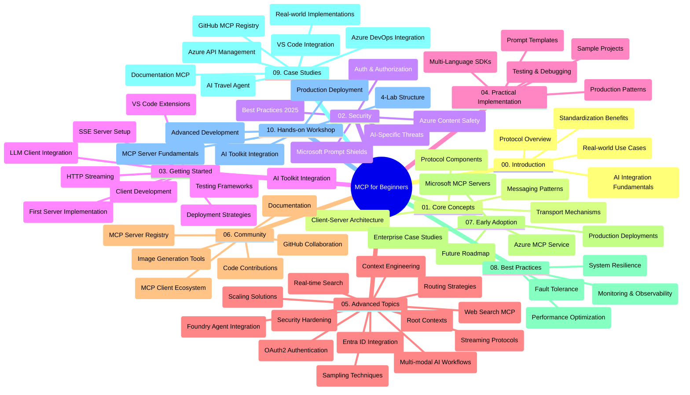

<!--
CO_OP_TRANSLATOR_METADATA:
{
  "original_hash": "719117a0a5f34ade7b5dfb61ee06fb13",
  "translation_date": "2025-09-26T18:11:55+00:00",
  "source_file": "study_guide.md",
  "language_code": "pa"
}
-->
# ਮਾਡਲ ਕਾਂਟੈਕਸਟ ਪ੍ਰੋਟੋਕੋਲ (MCP) ਲਈ ਸ਼ੁਰੂਆਤੀ ਗਾਈਡ - ਅਧਿਐਨ ਗਾਈਡ

ਇਹ ਅਧਿਐਨ ਗਾਈਡ "ਮਾਡਲ ਕਾਂਟੈਕਸਟ ਪ੍ਰੋਟੋਕੋਲ (MCP) ਲਈ ਸ਼ੁਰੂਆਤੀ" ਪਾਠਕ੍ਰਮ ਲਈ ਰਿਪੋਜ਼ਟਰੀ ਦੀ ਬਣਾਵਟ ਅਤੇ ਸਮੱਗਰੀ ਦਾ ਜਾਇਜ਼ਾ ਦਿੰਦੀ ਹੈ। ਇਸ ਗਾਈਡ ਦੀ ਵਰਤੋਂ ਰਿਪੋਜ਼ਟਰੀ ਨੂੰ ਕੁਸ਼ਲਤਾਪੂਰਵਕ ਨੇਵੀਗੇਟ ਕਰਨ ਅਤੇ ਉਪਲਬਧ ਸਰੋਤਾਂ ਦਾ ਪੂਰਾ ਲਾਭ ਲੈਣ ਲਈ ਕਰੋ।

## ਰਿਪੋਜ਼ਟਰੀ ਦਾ ਜਾਇਜ਼ਾ

ਮਾਡਲ ਕਾਂਟੈਕਸਟ ਪ੍ਰੋਟੋਕੋਲ (MCP) ਇੱਕ ਮਿਆਰੀ ਫਰੇਮਵਰਕ ਹੈ ਜੋ AI ਮਾਡਲਾਂ ਅਤੇ ਕਲਾਇੰਟ ਐਪਲੀਕੇਸ਼ਨਾਂ ਦੇ ਵਿਚਕਾਰ ਸੰਚਾਰ ਲਈ ਬਣਾਇਆ ਗਿਆ ਹੈ। ਸ਼ੁਰੂਆਤ ਵਿੱਚ Anthropic ਦੁਆਰਾ ਬਣਾਇਆ ਗਿਆ, MCP ਹੁਣ ਵੱਡੇ MCP ਸਮੁਦਾਇ ਦੁਆਰਾ ਅਧਿਕਾਰਤ GitHub ਸੰਗਠਨ ਰਾਹੀਂ ਸੰਭਾਲਿਆ ਜਾਂਦਾ ਹੈ। ਇਹ ਰਿਪੋਜ਼ਟਰੀ ਹੱਥ-ਅਭਿਆਸ ਕੋਡ ਉਦਾਹਰਣਾਂ ਦੇ ਨਾਲ ਇੱਕ ਵਿਸਤ੍ਰਿਤ ਪਾਠਕ੍ਰਮ ਪ੍ਰਦਾਨ ਕਰਦੀ ਹੈ, ਜੋ ਕਿ C#, Java, JavaScript, Python, ਅਤੇ TypeScript ਵਿੱਚ ਹੈ। ਇਹ ਖਾਸ ਤੌਰ 'ਤੇ AI ਡਿਵੈਲਪਰਾਂ, ਸਿਸਟਮ ਆਰਕੀਟੈਕਟਾਂ, ਅਤੇ ਸੌਫਟਵੇਅਰ ਇੰਜੀਨੀਅਰਾਂ ਲਈ ਡਿਜ਼ਾਈਨ ਕੀਤਾ ਗਿਆ ਹੈ।

## ਵਿਜ਼ੂਅਲ ਪਾਠਕ੍ਰਮ ਨਕਸ਼ਾ

## ਰਿਪੋਜ਼ਟਰੀ ਦੀ ਬਣਾਵਟ

ਰਿਪੋਜ਼ਟਰੀ ਦਸ ਮੁੱਖ ਭਾਗਾਂ ਵਿੱਚ ਵਿਭਾਜਿਤ ਹੈ, ਜਿਹਨਾਂ ਵਿੱਚੋਂ ਹਰ ਇੱਕ MCP ਦੇ ਵੱਖ-ਵੱਖ ਪਹਲੂਆਂ 'ਤੇ ਧਿਆਨ ਕੇਂਦਰਿਤ ਕਰਦਾ ਹੈ:

1. **ਪ੍ਰਸਤਾਵਨਾ (00-Introduction/)**
   - ਮਾਡਲ ਕਾਂਟੈਕਸਟ ਪ੍ਰੋਟੋਕੋਲ ਦਾ ਜਾਇਜ਼ਾ
   - AI ਪਾਈਪਲਾਈਨਾਂ ਵਿੱਚ ਮਿਆਰੀਕਰਨ ਕਿਉਂ ਮਹੱਤਵਪੂਰਨ ਹੈ
   - ਵਿਹਾਰਕ ਵਰਤੋਂ ਦੇ ਕੇਸ ਅਤੇ ਲਾਭ

2. **ਮੁੱਖ ਧਾਰਨਾਵਾਂ (01-CoreConcepts/)**
   - ਕਲਾਇੰਟ-ਸਰਵਰ ਆਰਕੀਟੈਕਚਰ
   - ਪ੍ਰੋਟੋਕੋਲ ਦੇ ਮੁੱਖ ਹਿੱਸੇ
   - MCP ਵਿੱਚ ਸੁਨੇਹਾ ਭੇਜਣ ਦੇ ਪੈਟਰਨ

3. **ਸੁਰੱਖਿਆ (02-Security/)**
   - MCP-ਅਧਾਰਿਤ ਸਿਸਟਮਾਂ ਵਿੱਚ ਸੁਰੱਖਿਆ ਖਤਰੇ
   - ਸੁਰੱਖਿਆ ਕਾਰਜਾਂ ਨੂੰ ਲਾਗੂ ਕਰਨ ਲਈ ਸਭ ਤੋਂ ਵਧੀਆ ਤਰੀਕੇ
   - ਪ੍ਰਮਾਣਿਕਤਾ ਅਤੇ ਅਧਿਕਾਰਣ ਰਣਨੀਤੀਆਂ
   - **ਵਿਸਤ੍ਰਿਤ ਸੁਰੱਖਿਆ ਦਸਤਾਵੇਜ਼**:
     - MCP ਸੁਰੱਖਿਆ ਦੇ ਸਭ ਤੋਂ ਵਧੀਆ ਤਰੀਕੇ 2025
     - Azure ਸਮੱਗਰੀ ਸੁਰੱਖਿਆ ਲਾਗੂ ਕਰਨ ਦੀ ਗਾਈਡ
     - MCP ਸੁਰੱਖਿਆ ਨਿਯੰਤਰਣ ਅਤੇ ਤਕਨੀਕਾਂ
     - MCP ਦੇ ਸਭ ਤੋਂ ਵਧੀਆ ਤਰੀਕੇ ਲਈ ਤੁਰੰਤ ਸੰਦਰਭ
   - **ਮੁੱਖ ਸੁਰੱਖਿਆ ਵਿਸ਼ੇ**:
     - ਪ੍ਰੌਮਪਟ ਇੰਜੈਕਸ਼ਨ ਅਤੇ ਟੂਲ ਪੌਇਜ਼ਨਿੰਗ ਹਮਲੇ
     - ਸੈਸ਼ਨ ਹਾਈਜੈਕਿੰਗ ਅਤੇ ਗਲਤ ਡਿਪਟੀ ਸਮੱਸਿਆਵਾਂ
     - ਟੋਕਨ ਪਾਸਥਰੂ ਘਾਟ
     - ਅਤਿ ਅਧਿਕਾਰ ਅਤੇ ਪਹੁੰਚ ਨਿਯੰਤਰਣ
     - AI ਘਟਕਾਂ ਲਈ ਸਪਲਾਈ ਚੇਨ ਸੁਰੱਖਿਆ
     - Microsoft Prompt Shields ਇੰਟੀਗ੍ਰੇਸ਼ਨ

4. **ਸ਼ੁਰੂਆਤ (03-GettingStarted/)**
   - ਵਾਤਾਵਰਣ ਸੈਟਅੱਪ ਅਤੇ ਸੰਰਚਨਾ
   - ਬੁਨਿਆਦੀ MCP ਸਰਵਰ ਅਤੇ ਕਲਾਇੰਟ ਬਣਾਉਣਾ
   - ਮੌਜੂਦਾ ਐਪਲੀਕੇਸ਼ਨਾਂ ਨਾਲ ਇੰਟੀਗ੍ਰੇਸ਼ਨ
   - ਸ਼ਾਮਲ ਭਾਗ:
     - ਪਹਿਲਾ ਸਰਵਰ ਲਾਗੂ ਕਰਨਾ
     - ਕਲਾਇੰਟ ਵਿਕਾਸ
     - LLM ਕਲਾਇੰਟ ਇੰਟੀਗ੍ਰੇਸ਼ਨ
     - VS Code ਇੰਟੀਗ੍ਰੇਸ਼ਨ
     - ਸਰਵਰ-ਸੈਂਟ ਇਵੈਂਟਸ (SSE) ਸਰਵਰ
     - HTTP ਸਟ੍ਰੀਮਿੰਗ
     - AI ਟੂਲਕਿਟ ਇੰਟੀਗ੍ਰੇਸ਼ਨ
     - ਟੈਸਟਿੰਗ ਰਣਨੀਤੀਆਂ
     - ਡਿਪਲੋਇਮੈਂਟ ਗਾਈਡਲਾਈਨਜ਼

5. **ਵਿਹਾਰਕ ਲਾਗੂਕਰਨ (04-PracticalImplementation/)**
   - ਵੱਖ-ਵੱਖ ਪ੍ਰੋਗ੍ਰਾਮਿੰਗ ਭਾਸ਼ਾਵਾਂ ਵਿੱਚ SDK ਦੀ ਵਰਤੋਂ
   - ਡਿਬੱਗਿੰਗ, ਟੈਸਟਿੰਗ, ਅਤੇ ਵੈਧਤਾ ਤਕਨੀਕਾਂ
   - ਦੁਬਾਰਾ ਵਰਤਣਯੋਗ ਪ੍ਰੌਮਪਟ ਟੈਂਪਲੇਟ ਅਤੇ ਵਰਕਫਲੋ ਬਣਾਉਣਾ
   - ਲਾਗੂਕਰਨ ਦੇ ਉਦਾਹਰਣਾਂ ਨਾਲ ਨਮੂਨਾ ਪ੍ਰੋਜੈਕਟ

6. **ਉੱਚ ਪੱਧਰੀ ਵਿਸ਼ੇ (05-AdvancedTopics/)**
   - ਕਾਂਟੈਕਸਟ ਇੰਜੀਨੀਅਰਿੰਗ ਤਕਨੀਕਾਂ
   - Foundry ਏਜੰਟ ਇੰਟੀਗ੍ਰੇਸ਼ਨ
   - ਮਲਟੀ-ਮੋਡਲ AI ਵਰਕਫਲੋਜ਼
   - OAuth2 ਪ੍ਰਮਾਣਿਕਤਾ ਡੈਮੋ
   - ਰੀਅਲ-ਟਾਈਮ ਖੋਜ ਸਮਰੱਥਾਵਾਂ
   - ਰੀਅਲ-ਟਾਈਮ ਸਟ੍ਰੀਮਿੰਗ
   - ਰੂਟ ਕਾਂਟੈਕਸਟ ਲਾਗੂਕਰਨ
   - ਰੂਟਿੰਗ ਰਣਨੀਤੀਆਂ
   - ਸੈਂਪਲਿੰਗ ਤਕਨੀਕਾਂ
   - ਸਕੇਲਿੰਗ ਪਹੁੰਚ
   - ਸੁਰੱਖਿਆ ਵਿਚਾਰ
   - Entra ID ਸੁਰੱਖਿਆ ਇੰਟੀਗ੍ਰੇਸ਼ਨ
   - ਵੈੱਬ ਖੋਜ ਇੰਟੀਗ੍ਰੇਸ਼ਨ

7. **ਸਮੁਦਾਇ ਯੋਗਦਾਨ (06-CommunityContributions/)**
   - ਕੋਡ ਅਤੇ ਦਸਤਾਵੇਜ਼ ਵਿੱਚ ਯੋਗਦਾਨ ਦੇਣ ਦਾ ਤਰੀਕਾ
   - GitHub ਰਾਹੀਂ ਸਹਿਯੋਗ
   - ਸਮੁਦਾਇ-ਚਲਿਤ ਸੁਧਾਰ ਅਤੇ ਪ੍ਰਤੀਕਿਰਿਆ
   - ਵੱਖ-ਵੱਖ MCP ਕਲਾਇੰਟਾਂ ਦੀ ਵਰਤੋਂ (Claude Desktop, Cline, VSCode)
   - ਪ੍ਰਸਿੱਧ MCP ਸਰਵਰਾਂ ਨਾਲ ਕੰਮ ਕਰਨਾ, ਜਿਵੇਂ ਕਿ ਚਿੱਤਰ ਜਨਰੇਸ਼ਨ

8. **ਪਹਿਲੇ ਅਪਨਾਵੇ ਤੋਂ ਸਿੱਖਿਆ (07-LessonsfromEarlyAdoption/)**
   - ਅਸਲ ਦੁਨੀਆ ਦੇ ਲਾਗੂਕਰਨ ਅਤੇ ਸਫਲਤਾ ਕਹਾਣੀਆਂ
   - MCP-ਅਧਾਰਿਤ ਹੱਲ ਬਣਾਉਣਾ ਅਤੇ ਡਿਪਲੋਇ ਕਰਨਾ
   - ਰੁਝਾਨ ਅਤੇ ਭਵਿੱਖ ਦਾ ਰੋਡਮੈਪ
   - **Microsoft MCP ਸਰਵਰ ਗਾਈਡ**: 10 ਉਤਪਾਦਨ-ਤਿਆਰ Microsoft MCP ਸਰਵਰਾਂ ਲਈ ਵਿਸਤ੍ਰਿਤ ਗਾਈਡ, ਜਿਸ ਵਿੱਚ ਸ਼ਾਮਲ ਹਨ:
     - Microsoft Learn Docs MCP Server
     - Azure MCP Server (15+ ਵਿਸ਼ੇਸ਼ ਕਨੈਕਟਰ)
     - GitHub MCP Server
     - Azure DevOps MCP Server
     - MarkItDown MCP Server
     - SQL Server MCP Server
     - Playwright MCP Server
     - Dev Box MCP Server
     - Azure AI Foundry MCP Server
     - Microsoft 365 Agents Toolkit MCP Server

9. **ਸਭ ਤੋਂ ਵਧੀਆ ਤਰੀਕੇ (08-BestPractices/)**
   - ਪ੍ਰਦਰਸ਼ਨ ਟਿਊਨਿੰਗ ਅਤੇ ਅਨੁਕੂਲਤਾ
   - ਫਾਲਟ-ਟੋਲਰੈਂਟ MCP ਸਿਸਟਮ ਡਿਜ਼ਾਈਨ ਕਰਨਾ
   - ਟੈਸਟਿੰਗ ਅਤੇ ਲਚੀਲਾਪਨ ਰਣਨੀਤੀਆਂ

10. **ਕੇਸ ਅਧਿਐਨ (09-CaseStudy/)**
    - **ਸੱਤ ਵਿਸਤ੍ਰਿਤ ਕੇਸ ਅਧਿਐਨ** ਜੋ ਵੱਖ-ਵੱਖ ਸਥਿਤੀਆਂ ਵਿੱਚ MCP ਦੀ ਬਹੁਮੁਖੀਤਾ ਦਿਖਾਉਂਦੇ ਹਨ:
    - **Azure AI ਟਰੈਵਲ ਏਜੰਟਸ**: Azure OpenAI ਅਤੇ AI ਖੋਜ ਨਾਲ ਬਹੁ-ਏਜੰਟ ਆਰਕੇਸਟ੍ਰੇਸ਼ਨ
    - **Azure DevOps ਇੰਟੀਗ੍ਰੇਸ਼ਨ**: YouTube ਡਾਟਾ ਅਪਡੇਟਸ ਨਾਲ ਵਰਕਫਲੋ ਪ੍ਰਕਿਰਿਆਵਾਂ ਨੂੰ ਆਟੋਮੇਟ ਕਰਨਾ
    - **ਰੀਅਲ-ਟਾਈਮ ਦਸਤਾਵੇਜ਼ ਪ੍ਰਾਪਤੀ**: ਸਟ੍ਰੀਮਿੰਗ HTTP ਨਾਲ Python ਕਨਸੋਲ ਕਲਾਇੰਟ
    - **ਇੰਟਰਐਕਟਿਵ ਅਧਿਐਨ ਯੋਜਨਾ ਜਨਰੇਟਰ**: ਚੈਨਲਿਟ ਵੈੱਬ ਐਪ ਨਾਲ ਗੱਲਬਾਤੀ AI
    - **ਇਨ-ਐਡੀਟਰ ਦਸਤਾਵੇਜ਼**: GitHub Copilot ਵਰਕਫਲੋਜ਼ ਨਾਲ VS Code ਇੰਟੀਗ੍ਰੇਸ਼ਨ
    - **Azure API ਪ੍ਰਬੰਧਨ**: ਐਂਟਰਪ੍ਰਾਈਜ਼ API ਇੰਟੀਗ੍ਰੇਸ਼ਨ ਨਾਲ MCP ਸਰਵਰ ਬਣਾਉਣਾ
    - **GitHub MCP ਰਜਿਸਟਰੀ**: ਪਰਿਸਰ ਵਿਕਾਸ ਅਤੇ ਏਜੰਟਿਕ ਇੰਟੀਗ੍ਰੇਸ਼ਨ ਪਲੇਟਫਾਰਮ
    - ਐਂਟਰਪ੍ਰਾਈਜ਼ ਇੰਟੀਗ੍ਰੇਸ਼ਨ, ਡਿਵੈਲਪਰ ਉਤਪਾਦਕਤਾ, ਅਤੇ ਪਰਿਸਰ ਵਿਕਾਸ ਨੂੰ ਕਵਰ ਕਰਨ ਵਾਲੇ ਲਾਗੂਕਰਨ ਦੇ ਉਦਾਹਰਣ

11. **ਹੱਥ-ਅਭਿਆਸ ਵਰਕਸ਼ਾਪ (10-StreamliningAIWorkflowsBuildingAnMCPServerWithAIToolkit/)**
    - MCP ਨੂੰ AI ਟੂਲਕਿਟ ਨਾਲ ਜੋੜਨ ਵਾਲਾ ਵਿਸਤ੍ਰਿਤ ਹੱਥ-ਅਭਿਆਸ ਵਰਕਸ਼ਾਪ
    - AI ਮਾਡਲਾਂ ਨੂੰ ਅਸਲ ਦੁਨੀਆ ਦੇ ਟੂਲਾਂ ਨਾਲ ਜੋੜਨ ਵਾਲੀਆਂ ਸਮਰੱਥ ਐਪਲੀਕੇਸ਼ਨਾਂ ਦਾ ਨਿਰਮਾਣ
    - ਮੂਲ ਤੱਤਾਂ, ਕਸਟਮ ਸਰਵਰ ਵਿਕਾਸ, ਅਤੇ ਉਤਪਾਦਨ ਡਿਪਲੋਇਮੈਂਟ ਰਣਨੀਤੀਆਂ ਨੂੰ ਕਵਰ ਕਰਨ ਵਾਲੇ ਵਿਹਾਰਕ ਮੋਡੀਊਲ
    - **ਲੈਬ ਬਣਾਵਟ**:
      - ਲੈਬ 1: MCP ਸਰਵਰ ਦੇ ਮੂਲ ਤੱਤ
      - ਲੈਬ 2: ਉੱਚ ਪੱਧਰੀ MCP ਸਰਵਰ ਵਿਕਾਸ
      - ਲੈਬ 3: AI ਟੂਲਕਿਟ ਇੰਟੀਗ੍ਰੇਸ਼ਨ
      - ਲੈਬ 4: ਉਤਪਾਦਨ ਡਿਪਲੋਇਮੈਂਟ ਅਤੇ ਸਕੇਲਿੰਗ
    - ਕਦਮ-ਦਰ-ਕਦਮ ਨਿਰਦੇਸ਼ਾਂ ਨਾਲ ਲੈਬ-ਅਧਾਰਿਤ ਸਿੱਖਣ ਦਾ ਪਹੁੰਚ

## ਵਾਧੂ ਸਰੋਤ

ਰਿਪੋਜ਼ਟਰੀ ਵਿੱਚ ਸਹਾਇਕ ਸਰੋਤ ਸ਼ਾਮਲ ਹਨ:

- **ਚਿੱਤਰਾਂ ਦਾ ਫੋਲਡਰ**: ਪਾਠਕ੍ਰਮ ਵਿੱਚ ਵਰਤੇ ਗਏ ਡਾਇਗ੍ਰਾਮ ਅਤੇ ਚਿੱਤਰ ਸ਼ਾਮਲ ਹਨ
- **ਅਨੁਵਾਦ**: ਦਸਤਾਵੇਜ਼ਾਂ ਦੇ ਆਟੋਮੈਟਿਕ ਅਨੁਵਾਦ ਨਾਲ ਬਹੁ-ਭਾਸ਼ਾਈ ਸਹਾਇਤਾ
- **ਅਧਿਕਾਰਤ MCP ਸਰੋਤ**:
  - [MCP ਦਸਤਾਵੇਜ਼](https://modelcontextprotocol.io/)
  - [MCP ਵਿਸ਼ੇਸ਼ਤਾ](https://spec.modelcontextprotocol.io/)
  - [MCP GitHub ਰਿਪੋਜ਼ਟਰੀ](https://github.com/modelcontextprotocol)

## ਇਸ ਰਿਪੋਜ਼ਟਰੀ ਦੀ ਵਰਤੋਂ ਕਿਵੇਂ ਕਰਨੀ ਹੈ

1. **ਕ੍ਰਮਬੱਧ ਸਿੱਖਿਆ**: ਇੱਕ ਢਾਂਚੇਬੱਧ ਸਿੱਖਣ ਦੇ ਅਨੁਭਵ ਲਈ ਅਨੁਕ੍ਰਮ ਵਿੱਚ ਅਧਿਆਇ (00 ਤੋਂ 10 ਤੱਕ) ਦੀ ਪਾਲਣਾ ਕਰੋ।
2. **ਭਾਸ਼ਾ-ਵਿਸ਼ੇਸ਼ ਧਿਆਨ**: ਜੇ ਤੁਸੀਂ ਕਿਸੇ ਖਾਸ ਪ੍ਰੋਗ੍ਰਾਮਿੰਗ ਭਾਸ਼ਾ ਵਿੱਚ ਰੁਚੀ ਰੱਖਦੇ ਹੋ, ਤਾਂ ਆਪਣੇ ਪਸੰਦੀਦਾ ਭਾਸ਼ਾ ਵਿੱਚ ਲਾਗੂਕਰਨ ਲਈ ਨਮੂਨਾ ਡਾਇਰੈਕਟਰੀਆਂ ਦੀ ਪੜਚੋਲ ਕਰੋ।
3. **ਵਿਹਾਰਕ ਲਾਗੂਕਰਨ**: "Getting Started" ਭਾਗ ਨਾਲ ਸ਼ੁਰੂ ਕਰੋ ਤਾਂ ਜੋ ਆਪਣਾ ਵਾਤਾਵਰਣ ਸੈਟਅੱਪ ਕਰੋ ਅਤੇ ਆਪਣਾ ਪਹਿਲਾ MCP ਸਰਵਰ ਅਤੇ ਕਲਾਇੰਟ ਬਣਾਓ।
4. **ਉੱਚ ਪੱਧਰੀ ਖੋਜ**: ਜਦੋਂ ਬੁਨਿਆਦੀਆਂ ਨਾਲ ਆਰਾਮਦਾਇਕ ਹੋ ਜਾਓ, ਤਾਂ ਉੱਚ ਪੱਧਰੀ ਵਿਸ਼ਿਆਂ ਵਿੱਚ ਡੁੱਬੋ ਤਾਂ ਜੋ ਆਪਣਾ ਗਿਆਨ ਵਧਾ ਸਕੋ।
5. **ਸਮੁਦਾਇ ਸਹਿਭਾਗਤਾ**: GitHub ਚਰਚਾਵਾਂ ਅਤੇ Discord ਚੈਨਲਾਂ ਰਾਹੀਂ MCP ਸਮੁਦਾਇ ਵਿੱਚ ਸ਼ਾਮਲ ਹੋਵੋ ਤਾਂ ਜੋ ਮਾਹਰਾਂ ਅਤੇ ਹੋਰ ਡਿਵੈਲਪਰਾਂ ਨਾਲ ਜੁੜ ਸਕੋ।

## MCP ਕਲਾਇੰਟ ਅਤੇ ਟੂਲ

ਪਾਠਕ੍ਰਮ ਵੱਖ-ਵੱਖ MCP ਕਲਾਇੰਟਾਂ ਅਤੇ ਟੂਲਾਂ ਨੂੰ ਕਵਰ ਕਰਦਾ ਹੈ:

1. **ਅਧਿਕਾਰਤ ਕਲਾਇੰਟ**:
   - Visual Studio Code
   - MCP in Visual Studio Code
   - Claude Desktop
   - Claude in VSCode
   - Claude API

2. **ਸਮੁਦਾਇ ਕਲਾਇੰਟ**:
   - Cline (ਟਰਮੀਨਲ-ਅਧਾਰਿਤ)
   - Cursor (ਕੋਡ ਐਡੀਟਰ)
   - ChatMCP
   - Windsurf

3. **MCP ਪ੍ਰਬੰਧਨ ਟੂਲ**:
   - MCP CLI
   - MCP Manager
   - MCP Linker
   - MCP Router

## ਪ੍ਰਸਿੱਧ MCP ਸਰਵਰ

ਰਿਪੋਜ਼ਟਰੀ ਵੱਖ-ਵੱਖ MCP ਸਰਵਰਾਂ ਨੂੰ ਪੇਸ਼ ਕਰਦੀ ਹੈ, ਜਿਸ ਵਿੱਚ ਸ਼ਾਮਲ ਹਨ:

1. **ਅਧਿਕਾਰਤ Microsoft MCP ਸਰਵਰ**:
   - Microsoft Learn Docs MCP Server
   - Azure MCP Server (15+ ਵਿਸ਼ੇਸ਼ ਕਨੈਕਟਰ)
   - GitHub MCP Server
   - Azure DevOps MCP Server
   - MarkItDown MCP Server
   - SQL Server MCP Server
   - Playwright MCP Server
   - Dev Box MCP Server
   - Azure AI Foundry MCP Server
   - Microsoft 365 Agents Toolkit MCP Server

2. **ਅਧਿਕਾਰਤ ਰਿਫਰੈਂਸ ਸਰਵਰ**:
   - Filesystem
   - Fetch
   - Memory
   - Sequential Thinking

3. **ਚਿੱਤਰ ਜਨਰੇਸ਼ਨ**:
   - Azure OpenAI DALL-E 3
   - Stable Diffusion WebUI
   - Replicate

4. **ਵਿਕਾਸ ਟੂਲ**:
   - Git MCP
   - Terminal Control
   - Code Assistant

5. **ਵਿਸ਼ੇਸ਼ਤਾਵਾਂ ਵਾਲੇ ਸਰਵਰ**:
   - Salesforce
   - Microsoft Teams
   - Jira & Confluence

## ਯੋਗਦਾਨ

ਇਹ ਰਿਪੋਜ਼ਟਰੀ ਸਮੁਦਾਇ ਤੋਂ ਯੋਗਦਾਨਾਂ ਦਾ ਸਵਾਗਤ ਕਰਦੀ ਹੈ। MCP ਪਰਿਸਰ ਵਿੱਚ ਪ੍ਰਭਾਵਸ਼ਾਲੀ ਤਰੀਕੇ ਨਾਲ ਯੋਗਦਾਨ ਦੇਣ ਲਈ Community Contributions ਭਾਗ ਵੇਖੋ।

## ਬਦਲਾਅ ਲਾਗ

| ਮਿਤੀ | ਬਦਲਾਅ |
|------|---------|
| 26 ਸਤੰਬਰ, 2025 | - 09-CaseStudy ਭਾਗ ਵਿੱਚ GitHub MCP ਰਜਿਸਟਰੀ ਕੇਸ ਅਧਿਐਨ ਸ਼ਾਮਲ ਕੀਤਾ - ਸੱਤ ਵਿਸਤ੍ਰਿਤ ਕੇਸ ਅਧਿਐਨ ਦਰਸਾਉਣ ਲਈ ਕੇਸ ਅਧਿਐਨ ਅਪਡੇਟ ਕੀਤੇ - ਲਾਗੂਕਰਨ ਦੇ ਵਿਸ਼ੇਸ਼ ਵੇਰਵਿਆਂ ਨਾਲ ਕੇਸ ਅਧਿਐਨ ਦਾ ਵਰਣਨ ਵਧਾਇਆ - GitHub MCP ਰਜਿਸਟਰੀ ਨੂੰ ਸ਼ਾਮਲ ਕਰਨ ਲਈ ਵਿਜ਼ੂਅਲ ਪਾਠਕ੍ਰਮ ਨਕਸ਼ਾ ਅਪਡੇਟ ਕੀਤਾ - ਪਰਿਸਰ ਵਿਕਾਸ 'ਤੇ ਧਿਆਨ ਕੇਂਦਰਿਤ ਕਰਨ ਲਈ ਅਧਿਐਨ ਗਾਈਡ ਬਣਾਵਟ ਨੂੰ ਦੁਬਾਰਾ ਬਣਾਇਆ |
| 18 ਜੁਲਾਈ, 2025 | - Microsoft MCP Servers Guide ਸ਼ਾਮਲ ਕਰਨ ਲਈ ਰਿਪੋਜ਼ਟਰੀ ਬਣਾਵਟ ਅਪਡੇਟ ਕੀਤੀ - 10 ਉਤਪਾਦਨ-ਤਿਆਰ Microsoft MCP ਸਰਵਰਾਂ ਦੀ ਵਿਸਤ੍ਰਿਤ ਸੂਚੀ ਸ਼ਾਮਲ ਕੀਤੀ - ਅਧਿਕਾਰਤ Microsoft MCP ਸਰਵਰਾਂ ਨਾਲ ਪ੍ਰਸਿੱਧ MCP ਸਰਵਰ ਭਾਗ ਨੂੰ ਵਧਾਇਆ - ਅਸਲ ਫਾਈਲ ਉਦਾਹਰਣਾਂ ਨਾਲ ਕੇਸ ਅਧਿਐਨ ਭਾਗ ਅਪਡੇਟ ਕੀਤਾ - ਹੱਥ-ਅਭਿਆਸ ਵਰਕਸ਼ਾਪ ਲਈ ਲੈਬ ਬਣਾਵਟ ਵੇਰਵੇ ਸ਼ਾਮਲ ਕੀਤੇ |
| 16 ਜ

---

