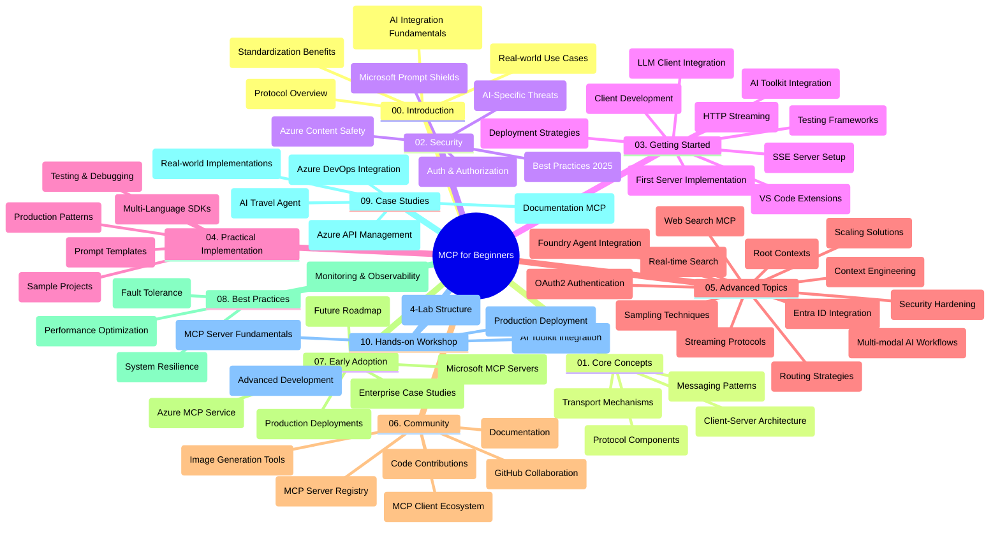

<!--
CO_OP_TRANSLATOR_METADATA:
{
  "original_hash": "e2c6ed897fa98fa08e0146101776c7ff",
  "translation_date": "2025-07-18T09:37:36+00:00",
  "source_file": "study_guide.md",
  "language_code": "pa"
}
-->
# Model Context Protocol (MCP) for Beginners - ਅਧਿਐਨ ਮਾਰਗਦਰਸ਼ਿਕਾ

ਇਹ ਅਧਿਐਨ ਮਾਰਗਦਰਸ਼ਿਕਾ "Model Context Protocol (MCP) for Beginners" ਕੋਰਸ ਲਈ ਰਿਪੋਜ਼ਟਰੀ ਦੀ ਬਣਤਰ ਅਤੇ ਸਮੱਗਰੀ ਦਾ ਇੱਕ ਝਲਕ ਪ੍ਰਦਾਨ ਕਰਦੀ ਹੈ। ਇਸ ਮਾਰਗਦਰਸ਼ਿਕਾ ਦੀ ਵਰਤੋਂ ਕਰਕੇ ਤੁਸੀਂ ਰਿਪੋਜ਼ਟਰੀ ਵਿੱਚ ਸੁਚੱਜੇ ਤਰੀਕੇ ਨਾਲ ਨੈਵੀਗੇਟ ਕਰ ਸਕਦੇ ਹੋ ਅਤੇ ਉਪਲਬਧ ਸਰੋਤਾਂ ਦਾ ਪੂਰਾ ਲਾਭ ਉਠਾ ਸਕਦੇ ਹੋ।

## ਰਿਪੋਜ਼ਟਰੀ ਦਾ ਝਲਕ

Model Context Protocol (MCP) ਇੱਕ ਮਿਆਰੀ ਢਾਂਚਾ ਹੈ ਜੋ AI ਮਾਡਲਾਂ ਅਤੇ ਕਲਾਇੰਟ ਐਪਲੀਕੇਸ਼ਨਾਂ ਵਿਚਕਾਰ ਇੰਟਰੈਕਸ਼ਨ ਲਈ ਬਣਾਇਆ ਗਿਆ ਹੈ। ਇਹ ਪਹਿਲਾਂ Anthropic ਵੱਲੋਂ ਤਿਆਰ ਕੀਤਾ ਗਿਆ ਸੀ, ਹੁਣ MCP ਕਮਿਊਨਿਟੀ ਦੁਆਰਾ ਅਧਿਕਾਰਕ GitHub ਸੰਗਠਨ ਰਾਹੀਂ ਸੰਭਾਲਿਆ ਜਾਂਦਾ ਹੈ। ਇਹ ਰਿਪੋਜ਼ਟਰੀ C#, Java, JavaScript, Python, ਅਤੇ TypeScript ਵਿੱਚ ਹੱਥੋਂ-ਹੱਥ ਕੋਡ ਉਦਾਹਰਣਾਂ ਸਮੇਤ ਇੱਕ ਵਿਸਤ੍ਰਿਤ ਕੋਰਸ ਪ੍ਰਦਾਨ ਕਰਦੀ ਹੈ, ਜੋ AI ਡਿਵੈਲਪਰਾਂ, ਸਿਸਟਮ ਆਰਕੀਟੈਕਟਾਂ ਅਤੇ ਸਾਫਟਵੇਅਰ ਇੰਜੀਨੀਅਰਾਂ ਲਈ ਬਣਾਇਆ ਗਿਆ ਹੈ।

## ਵਿਜ਼ੂਅਲ ਕੋਰਸ ਨਕਸ਼ਾ

## ਰਿਪੋਜ਼ਟਰੀ ਦੀ ਬਣਤਰ

ਰਿਪੋਜ਼ਟਰੀ ਨੂੰ ਦਸ ਮੁੱਖ ਭਾਗਾਂ ਵਿੱਚ ਵੰਡਿਆ ਗਿਆ ਹੈ, ਜਿਹੜੇ MCP ਦੇ ਵੱਖ-ਵੱਖ ਪਹਲੂਆਂ 'ਤੇ ਧਿਆਨ ਕੇਂਦਰਿਤ ਕਰਦੇ ਹਨ:

1. **Introduction (00-Introduction/)**
   - Model Context Protocol ਦਾ ਜਾਇਜ਼ਾ
   - AI ਪਾਈਪਲਾਈਨਾਂ ਵਿੱਚ ਮਿਆਰੀਕਰਨ ਦੀ ਮਹੱਤਤਾ
   - ਪ੍ਰਯੋਗਿਕ ਮਾਮਲੇ ਅਤੇ ਲਾਭ

2. **Core Concepts (01-CoreConcepts/)**
   - ਕਲਾਇੰਟ-ਸਰਵਰ ਆਰਕੀਟੈਕਚਰ
   - ਮੁੱਖ ਪ੍ਰੋਟੋਕੋਲ ਘਟਕ
   - MCP ਵਿੱਚ ਮੈਸੇਜਿੰਗ ਪੈਟਰਨ

3. **Security (02-Security/)**
   - MCP-ਅਧਾਰਿਤ ਸਿਸਟਮਾਂ ਵਿੱਚ ਸੁਰੱਖਿਆ ਖ਼ਤਰੇ
   - ਸੁਰੱਖਿਆ ਲਈ ਸਰਵੋਤਮ ਅਭਿਆਸ
   - ਪ੍ਰਮਾਣਿਕਤਾ ਅਤੇ ਅਧਿਕਾਰਣ ਰਣਨੀਤੀਆਂ
   - **ਵਿਆਪਕ ਸੁਰੱਖਿਆ ਦਸਤਾਵੇਜ਼**:
     - MCP Security Best Practices 2025
     - Azure Content Safety Implementation Guide
     - MCP Security Controls and Techniques
     - MCP Best Practices Quick Reference
   - **ਮੁੱਖ ਸੁਰੱਖਿਆ ਵਿਸ਼ੇ**:
     - ਪ੍ਰਾਂਪਟ ਇੰਜੈਕਸ਼ਨ ਅਤੇ ਟੂਲ ਪੋਇਜ਼ਨਿੰਗ ਹਮਲੇ
     - ਸੈਸ਼ਨ ਹਾਈਜੈਕਿੰਗ ਅਤੇ ਗਲਤ ਡਿਊਟੀ ਸਮੱਸਿਆਵਾਂ
     - ਟੋਕਨ ਪਾਸਥਰੂ ਕਮਜ਼ੋਰੀਆਂ
     - ਅਤਿਰਿਕਤ ਅਧਿਕਾਰ ਅਤੇ ਪਹੁੰਚ ਨਿਯੰਤਰਣ
     - AI ਘਟਕਾਂ ਲਈ ਸਪਲਾਈ ਚੇਨ ਸੁਰੱਖਿਆ
     - Microsoft Prompt Shields ਇੰਟੀਗ੍ਰੇਸ਼ਨ

4. **Getting Started (03-GettingStarted/)**
   - ਵਾਤਾਵਰਣ ਸੈਟਅੱਪ ਅਤੇ ਸੰਰਚਨਾ
   - ਬੁਨਿਆਦੀ MCP ਸਰਵਰ ਅਤੇ ਕਲਾਇੰਟ ਬਣਾਉਣਾ
   - ਮੌਜੂਦਾ ਐਪਲੀਕੇਸ਼ਨਾਂ ਨਾਲ ਇੰਟੀਗ੍ਰੇਸ਼ਨ
   - ਸ਼ਾਮਲ ਹਿੱਸੇ:
     - ਪਹਿਲਾ ਸਰਵਰ ਇੰਪਲੀਮੈਂਟੇਸ਼ਨ
     - ਕਲਾਇੰਟ ਵਿਕਾਸ
     - LLM ਕਲਾਇੰਟ ਇੰਟੀਗ੍ਰੇਸ਼ਨ
     - VS Code ਇੰਟੀਗ੍ਰੇਸ਼ਨ
     - Server-Sent Events (SSE) ਸਰਵਰ
     - HTTP ਸਟ੍ਰੀਮਿੰਗ
     - AI Toolkit ਇੰਟੀਗ੍ਰੇਸ਼ਨ
     - ਟੈਸਟਿੰਗ ਰਣਨੀਤੀਆਂ
     - ਡਿਪਲੋਇਮੈਂਟ ਗਾਈਡਲਾਈਨਜ਼

5. **Practical Implementation (04-PracticalImplementation/)**
   - ਵੱਖ-ਵੱਖ ਪ੍ਰੋਗ੍ਰਾਮਿੰਗ ਭਾਸ਼ਾਵਾਂ ਵਿੱਚ SDK ਦੀ ਵਰਤੋਂ
   - ਡੀਬੱਗਿੰਗ, ਟੈਸਟਿੰਗ ਅਤੇ ਵੈਰੀਫਿਕੇਸ਼ਨ ਤਕਨੀਕਾਂ
   - ਦੁਬਾਰਾ ਵਰਤੋਂਯੋਗ ਪ੍ਰਾਂਪਟ ਟੈਂਪਲੇਟ ਅਤੇ ਵਰਕਫਲੋ ਬਣਾਉਣਾ
   - ਉਦਾਹਰਣ ਪ੍ਰੋਜੈਕਟਾਂ ਸਮੇਤ ਇੰਪਲੀਮੈਂਟੇਸ਼ਨ

6. **Advanced Topics (05-AdvancedTopics/)**
   - ਸੰਦਰਭ ਇੰਜੀਨੀਅਰਿੰਗ ਤਕਨੀਕਾਂ
   - Foundry ਏਜੰਟ ਇੰਟੀਗ੍ਰੇਸ਼ਨ
   - ਮਲਟੀ-ਮੋਡਲ AI ਵਰਕਫਲੋਜ਼
   - OAuth2 ਪ੍ਰਮਾਣਿਕਤਾ ਡੈਮੋਜ਼
   - ਰੀਅਲ-ਟਾਈਮ ਖੋਜ ਸਮਰੱਥਾ
   - ਰੀਅਲ-ਟਾਈਮ ਸਟ੍ਰੀਮਿੰਗ
   - ਰੂਟ ਸੰਦਰਭਾਂ ਦੀ ਇੰਪਲੀਮੈਂਟੇਸ਼ਨ
   - ਰਾਊਟਿੰਗ ਰਣਨੀਤੀਆਂ
   - ਸੈਂਪਲਿੰਗ ਤਕਨੀਕਾਂ
   - ਸਕੇਲਿੰਗ ਪਹੁੰਚਾਂ
   - ਸੁਰੱਖਿਆ ਵਿਚਾਰ
   - Entra ID ਸੁਰੱਖਿਆ ਇੰਟੀਗ੍ਰੇਸ਼ਨ
   - ਵੈੱਬ ਖੋਜ ਇੰਟੀਗ੍ਰੇਸ਼ਨ

7. **Community Contributions (06-CommunityContributions/)**
   - ਕੋਡ ਅਤੇ ਦਸਤਾਵੇਜ਼ ਵਿੱਚ ਯੋਗਦਾਨ ਦੇਣ ਦਾ ਤਰੀਕਾ
   - GitHub ਰਾਹੀਂ ਸਹਿਯੋਗ
   - ਕਮਿਊਨਿਟੀ-ਚਲਾਏ ਗਏ ਸੁਧਾਰ ਅਤੇ ਫੀਡਬੈਕ
   - ਵੱਖ-ਵੱਖ MCP ਕਲਾਇੰਟਾਂ ਦੀ ਵਰਤੋਂ (Claude Desktop, Cline, VSCode)
   - ਪ੍ਰਸਿੱਧ MCP ਸਰਵਰਾਂ ਨਾਲ ਕੰਮ ਕਰਨਾ ਜਿਵੇਂ ਕਿ ਇਮੇਜ ਜਨਰੇਸ਼ਨ

8. **Lessons from Early Adoption (07-LessonsfromEarlyAdoption/)**
   - ਅਸਲੀ ਦੁਨੀਆ ਦੇ ਇੰਪਲੀਮੈਂਟੇਸ਼ਨ ਅਤੇ ਸਫਲਤਾ ਕਹਾਣੀਆਂ
   - MCP-ਅਧਾਰਿਤ ਹੱਲਾਂ ਦਾ ਨਿਰਮਾਣ ਅਤੇ ਡਿਪਲੋਇਮੈਂਟ
   - ਰੁਝਾਨ ਅਤੇ ਭਵਿੱਖ ਦਾ ਰੋਡਮੈਪ
   - **Microsoft MCP Servers Guide**: 10 ਪ੍ਰੋਡਕਸ਼ਨ-ਤਿਆਰ Microsoft MCP ਸਰਵਰਾਂ ਦੀ ਵਿਸਤ੍ਰਿਤ ਮਾਰਗਦਰਸ਼ਿਕਾ, ਜਿਸ ਵਿੱਚ ਸ਼ਾਮਲ ਹਨ:
     - Microsoft Learn Docs MCP Server
     - Azure MCP Server (15+ ਵਿਸ਼ੇਸ਼ ਕਨੈਕਟਰ)
     - GitHub MCP Server
     - Azure DevOps MCP Server
     - MarkItDown MCP Server
     - SQL Server MCP Server
     - Playwright MCP Server
     - Dev Box MCP Server
     - Azure AI Foundry MCP Server
     - Microsoft 365 Agents Toolkit MCP Server

9. **Best Practices (08-BestPractices/)**
   - ਪ੍ਰਦਰਸ਼ਨ ਟਿਊਨਿੰਗ ਅਤੇ ਅਪਟੀਮਾਈਜ਼ੇਸ਼ਨ
   - ਫਾਲਟ-ਟੋਲਰੈਂਟ MCP ਸਿਸਟਮ ਡਿਜ਼ਾਈਨ
   - ਟੈਸਟਿੰਗ ਅਤੇ ਲਚੀਲਾਪਣ ਰਣਨੀਤੀਆਂ

10. **Case Studies (09-CaseStudy/)**
    - Azure API Management ਇੰਟੀਗ੍ਰੇਸ਼ਨ ਉਦਾਹਰਣ
    - ਟ੍ਰੈਵਲ ਏਜੰਟ ਇੰਪਲੀਮੈਂਟੇਸ਼ਨ ਉਦਾਹਰਣ
    - Azure DevOps ਇੰਟੀਗ੍ਰੇਸ਼ਨ ਨਾਲ YouTube ਅੱਪਡੇਟਸ
    - ਦਸਤਾਵੇਜ਼ MCP ਇੰਪਲੀਮੈਂਟੇਸ਼ਨ ਉਦਾਹਰਣ
    - ਵਿਸਤ੍ਰਿਤ ਦਸਤਾਵੇਜ਼ ਸਮੇਤ ਇੰਪਲੀਮੈਂਟੇਸ਼ਨ ਉਦਾਹਰਣ

11. **Hands-on Workshop (10-StreamliningAIWorkflowsBuildingAnMCPServerWithAIToolkit/)**
    - MCP ਅਤੇ AI Toolkit ਨੂੰ ਮਿਲਾ ਕੇ ਵਿਸਤ੍ਰਿਤ ਹੱਥੋਂ-ਹੱਥ ਵਰਕਸ਼ਾਪ
    - ਬੁੱਧੀਮਾਨ ਐਪਲੀਕੇਸ਼ਨਾਂ ਦਾ ਨਿਰਮਾਣ ਜੋ AI ਮਾਡਲਾਂ ਨੂੰ ਅਸਲੀ ਦੁਨੀਆ ਦੇ ਟੂਲਾਂ ਨਾਲ ਜੋੜਦਾ ਹੈ
    - ਮੂਲਭੂਤ, ਕਸਟਮ ਸਰਵਰ ਵਿਕਾਸ ਅਤੇ ਪ੍ਰੋਡਕਸ਼ਨ ਡਿਪਲੋਇਮੈਂਟ ਰਣਨੀਤੀਆਂ ਨੂੰ ਕਵਰ ਕਰਨ ਵਾਲੇ ਪ੍ਰਯੋਗਿਕ ਮਾਡਿਊਲ
    - **ਲੈਬ ਬਣਤਰ**:
      - ਲੈਬ 1: MCP ਸਰਵਰ ਮੂਲਭੂਤ
      - ਲੈਬ 2: ਅਡਵਾਂਸ MCP ਸਰਵਰ ਵਿਕਾਸ
      - ਲੈਬ 3: AI Toolkit ਇੰਟੀਗ੍ਰੇਸ਼ਨ
      - ਲੈਬ 4: ਪ੍ਰੋਡਕਸ਼ਨ ਡਿਪਲੋਇਮੈਂਟ ਅਤੇ ਸਕੇਲਿੰਗ
    - ਲੈਬ-ਆਧਾਰਿਤ ਸਿੱਖਣ ਦੀ ਪদ্ধਤੀ ਨਾਲ ਕਦਮ-ਦਰ-ਕਦਮ ਹਦਾਇਤਾਂ

## ਵਾਧੂ ਸਰੋਤ

ਰਿਪੋਜ਼ਟਰੀ ਵਿੱਚ ਸਹਾਇਕ ਸਰੋਤ ਸ਼ਾਮਲ ਹਨ:

- **Images ਫੋਲਡਰ**: ਕੋਰਸ ਦੌਰਾਨ ਵਰਤੇ ਗਏ ਡਾਇਗ੍ਰਾਮ ਅਤੇ ਚਿੱਤਰ
- **Translations**: ਦਸਤਾਵੇਜ਼ਾਂ ਦੇ ਆਟੋਮੈਟਿਕ ਅਨੁਵਾਦਾਂ ਸਮੇਤ ਬਹੁ-ਭਾਸ਼ਾਈ ਸਹਾਇਤਾ
- **ਅਧਿਕਾਰਕ MCP ਸਰੋਤ**:
  - [MCP Documentation](https://modelcontextprotocol.io/)
  - [MCP Specification](https://spec.modelcontextprotocol.io/)
  - [MCP GitHub Repository](https://github.com/modelcontextprotocol)

## ਇਸ ਰਿਪੋਜ਼ਟਰੀ ਦੀ ਵਰਤੋਂ ਕਿਵੇਂ ਕਰੀਏ

1. **ਕ੍ਰਮਵਾਰ ਸਿੱਖਣਾ**: ਅਧਿਆਇ 00 ਤੋਂ 10 ਤੱਕ ਕ੍ਰਮਵਾਰ ਪੜ੍ਹੋ ਤਾਂ ਜੋ ਸੰਗਠਿਤ ਸਿੱਖਣ ਦਾ ਅਨੁਭਵ ਮਿਲੇ।
2. **ਭਾਸ਼ਾ-ਵਿਸ਼ੇਸ਼ ਧਿਆਨ**: ਜੇ ਤੁਸੀਂ ਕਿਸੇ ਖਾਸ ਪ੍ਰੋਗ੍ਰਾਮਿੰਗ ਭਾਸ਼ਾ ਵਿੱਚ ਰੁਚੀ ਰੱਖਦੇ ਹੋ, ਤਾਂ ਆਪਣੇ ਮਨਪਸੰਦ ਭਾਸ਼ਾ ਵਿੱਚ ਇੰਪਲੀਮੈਂਟੇਸ਼ਨ ਲਈ ਸੈਂਪਲ ਡਾਇਰੈਕਟਰੀਜ਼ ਵੇਖੋ।
3. **ਪ੍ਰਯੋਗਿਕ ਇੰਪਲੀਮੈਂਟੇਸ਼ਨ**: "Getting Started" ਭਾਗ ਨਾਲ ਸ਼ੁਰੂ ਕਰੋ, ਆਪਣਾ ਵਾਤਾਵਰਣ ਸੈਟਅੱਪ ਕਰੋ ਅਤੇ ਆਪਣਾ ਪਹਿਲਾ MCP ਸਰਵਰ ਅਤੇ ਕਲਾਇੰਟ ਬਣਾਓ।
4. **ਅਡਵਾਂਸ ਖੋਜ**: ਬੁਨਿਆਦੀ ਜਾਣਕਾਰੀ ਪ੍ਰਾਪਤ ਕਰਨ ਤੋਂ ਬਾਅਦ, ਅਡਵਾਂਸ ਵਿਸ਼ਿਆਂ ਵਿੱਚ ਡੁੱਬਕੀ ਲਗਾਓ ਤਾਂ ਜੋ ਆਪਣਾ ਗਿਆਨ ਵਧਾ ਸਕੋ।
5. **ਕਮਿਊਨਿਟੀ ਸਹਿਭਾਗ**: MCP ਕਮਿਊਨਿਟੀ ਵਿੱਚ GitHub ਚਰਚਾ ਅਤੇ Discord ਚੈਨਲਾਂ ਰਾਹੀਂ ਸ਼ਾਮਿਲ ਹੋਵੋ ਅਤੇ ਮਾਹਿਰਾਂ ਅਤੇ ਹੋਰ ਡਿਵੈਲਪਰਾਂ ਨਾਲ ਜੁੜੋ।

## MCP ਕਲਾਇੰਟ ਅਤੇ ਟੂਲ

ਕੋਰਸ ਵਿੱਚ ਵੱਖ-ਵੱਖ MCP ਕਲਾਇੰਟ ਅਤੇ ਟੂਲ ਕਵਰ ਕੀਤੇ ਗਏ ਹਨ:

1. **ਅਧਿਕਾਰਕ ਕਲਾਇੰਟ**:
   - Visual Studio Code
   - MCP in Visual Studio Code
   - Claude Desktop
   - Claude in VSCode
   - Claude API

2. **ਕਮਿਊਨਿਟੀ ਕਲਾਇੰਟ**:
   - Cline (ਟਰਮੀਨਲ-ਆਧਾਰਿਤ)
   - Cursor (ਕੋਡ ਐਡੀਟਰ)
   - ChatMCP
   - Windsurf

3. **MCP ਪ੍ਰਬੰਧਨ ਟੂਲ**:
   - MCP CLI
   - MCP Manager
   - MCP Linker
   - MCP Router

## ਪ੍ਰਸਿੱਧ MCP ਸਰਵਰ

ਰਿਪੋਜ਼ਟਰੀ ਵਿੱਚ ਵੱਖ-ਵੱਖ MCP ਸਰਵਰਾਂ ਦਾ ਪਰਿਚਯ ਦਿੱਤਾ ਗਿਆ ਹੈ, ਜਿਨ੍ਹਾਂ ਵਿੱਚ ਸ਼ਾਮਲ ਹਨ:

1. **ਅਧਿਕਾਰਕ Microsoft MCP ਸਰਵਰ**:
   - Microsoft Learn Docs MCP Server
   - Azure MCP Server (15+ ਵਿਸ਼ੇਸ਼ ਕਨੈਕਟਰ)
   - GitHub MCP Server
   - Azure DevOps MCP Server
   - MarkItDown MCP Server
   - SQL Server MCP Server
   - Playwright MCP Server
   - Dev Box MCP Server
   - Azure AI Foundry MCP Server
   - Microsoft 365 Agents Toolkit MCP Server

2. **ਅਧਿਕਾਰਕ ਰੈਫਰੈਂਸ ਸਰਵਰ**:
   - Filesystem
   - Fetch
   - Memory
   - Sequential Thinking

3. **ਇਮੇਜ ਜਨਰੇਸ਼ਨ**:
   - Azure OpenAI DALL-E 3
   - Stable Diffusion WebUI
   - Replicate

4. **ਡਿਵੈਲਪਮੈਂਟ ਟੂਲ**:
   - Git MCP
   - Terminal Control
   - Code Assistant

5. **ਵਿਸ਼ੇਸ਼ ਸਰਵਰ**:
   - Salesforce
   - Microsoft Teams
   - Jira & Confluence

## ਯੋਗਦਾਨ ਦੇਣਾ

ਇਹ ਰਿਪੋਜ਼ਟਰੀ ਕਮਿਊਨਿਟੀ ਤੋਂ ਯੋਗਦਾਨਾਂ ਦਾ ਸਵਾਗਤ ਕਰਦਾ ਹੈ। MCP ਪਰਿਸਰ ਵਿੱਚ ਪ੍ਰਭਾਵਸ਼ਾਲੀ ਯੋਗਦਾਨ ਦੇਣ ਲਈ Community Contributions ਭਾਗ ਵਿੱਚ ਦਿੱਤੇ ਗਏ ਨਿਰਦੇਸ਼ਾਂ ਨੂੰ ਦੇਖੋ।

## ਚੇਂਜਲੌਗ

| ਮਿਤੀ | ਬਦਲਾਅ |
|------|---------|
| 18 ਜੁਲਾਈ, 2025 | - Microsoft MCP Servers Guide ਸ਼ਾਮਲ ਕਰਕੇ ਰਿਪੋਜ਼ਟਰੀ ਬਣਤਰ ਅਪਡੇਟ ਕੀਤੀ ਗਈ - 10 ਪ੍ਰੋਡਕਸ਼ਨ-ਤਿਆਰ Microsoft MCP ਸਰਵਰਾਂ ਦੀ ਵਿਸਤ੍ਰਿਤ ਸੂਚੀ ਸ਼ਾਮਲ ਕੀਤੀ ਗਈ - ਪ੍ਰਸਿੱਧ MCP ਸਰਵਰ ਭਾਗ ਵਿੱਚ ਅਧਿਕਾਰਕ Microsoft MCP ਸਰਵਰ ਸ਼ਾਮਲ ਕੀਤੇ ਗਏ - Case Studies ਭਾਗ ਵਿੱਚ ਅਸਲੀ ਫਾਈਲ ਉਦਾਹਰਣ ਸ਼ਾਮਲ ਕੀਤੇ ਗਏ - Hands-on Workshop ਲਈ ਲੈਬ ਬਣਤਰ ਦੇ ਵੇਰਵੇ ਸ਼ਾਮਲ ਕੀਤੇ ਗਏ |
| 16 ਜੁਲਾਈ, 2025 | - ਮੌਜੂਦਾ ਸਮੱਗਰੀ ਨੂੰ ਦਰਸਾਉਂਦੇ ਹੋਏ ਰਿਪੋਜ਼ਟਰੀ ਬਣਤਰ ਅਪਡੇਟ ਕੀਤੀ ਗਈ - MCP Clients and Tools ਭਾਗ ਸ਼ਾਮਲ ਕੀਤਾ ਗਿਆ - ਪ੍ਰਸਿੱਧ MCP ਸਰਵਰ ਭਾਗ ਸ਼ਾਮਲ ਕੀਤਾ ਗਿਆ - ਵਿਜ਼ੂਅਲ ਕੋਰਸ ਨਕਸ਼ਾ ਅਪਡੇਟ ਕੀਤਾ ਗਿਆ - ਅਡਵਾਂਸ ਵਿਸ਼ਿਆਂ ਵਿੱਚ ਸਾਰੇ ਵਿਸ਼ੇਸ਼ ਖੇਤਰ ਸ਼ਾਮਲ ਕੀਤੇ ਗਏ - Case Studies ਨੂੰ ਅਸਲੀ ਉਦਾਹਰਣਾਂ ਨਾਲ ਅਪਡੇਟ ਕੀਤਾ ਗਿਆ - MCP ਦੀ ਸ਼ੁਰੂਆਤ Anthropic ਵੱਲੋਂ ਹੋਣ ਦੀ ਸਪਸ਼ਟੀਕਰਨ ਕੀਤੀ ਗਈ |
| 11 ਜੂਨ, 2025 | - ਅਧਿਐਨ ਮਾਰਗਦਰਸ਼ਿਕਾ ਦੀ ਸ਼ੁਰੂਆਤੀ ਰਚਨਾ - ਵਿਜ਼ੂਅਲ ਕੋਰਸ ਨਕਸ਼ਾ ਸ਼ਾਮਲ ਕੀਤਾ ਗਿਆ - ਰਿਪੋਜ਼ਟਰੀ ਬਣਤਰ ਦਾ ਖਾਕਾ ਦਿੱਤਾ ਗਿਆ - ਸੈਂਪਲ ਪ੍ਰੋਜੈਕਟ ਅਤੇ ਵਾਧੂ ਸਰੋਤ ਸ਼ਾਮਲ ਕੀਤੇ ਗਏ |

---

*ਇਹ ਅਧਿਐਨ ਮਾਰਗਦਰਸ਼ਿਕਾ 18 ਜੁਲਾਈ, 2025 ਨੂੰ ਅਪਡੇਟ ਕੀਤੀ ਗਈ ਸੀ ਅਤੇ ਉਸ ਮਿਤੀ ਤੱਕ ਰਿਪੋਜ਼ਟਰੀ ਦਾ ਇੱਕ ਝਲਕ ਪ੍ਰਦਾਨ ਕਰਦੀ ਹੈ। ਇਸ ਮਿਤੀ ਤੋਂ ਬਾਅਦ ਰਿਪੋਜ਼ਟਰੀ ਦੀ ਸਮੱਗਰੀ ਅਪਡੇਟ ਹੋ ਸਕਦੀ ਹੈ।*

**ਅਸਵੀਕਾਰੋਪਣ**:  
ਇਹ ਦਸਤਾਵੇਜ਼ AI ਅਨੁਵਾਦ ਸੇਵਾ [Co-op Translator](https://github.com/Azure/co-op-translator) ਦੀ ਵਰਤੋਂ ਕਰਕੇ ਅਨੁਵਾਦਿਤ ਕੀਤਾ ਗਿਆ ਹੈ। ਜਦੋਂ ਕਿ ਅਸੀਂ ਸਹੀਅਤ ਲਈ ਕੋਸ਼ਿਸ਼ ਕਰਦੇ ਹਾਂ, ਕਿਰਪਾ ਕਰਕੇ ਧਿਆਨ ਰੱਖੋ ਕਿ ਸਵੈਚਾਲਿਤ ਅਨੁਵਾਦਾਂ ਵਿੱਚ ਗਲਤੀਆਂ ਜਾਂ ਅਸਮਰਥਤਾਵਾਂ ਹੋ ਸਕਦੀਆਂ ਹਨ। ਮੂਲ ਦਸਤਾਵੇਜ਼ ਆਪਣੀ ਮੂਲ ਭਾਸ਼ਾ ਵਿੱਚ ਪ੍ਰਮਾਣਿਕ ਸਰੋਤ ਮੰਨਿਆ ਜਾਣਾ ਚਾਹੀਦਾ ਹੈ। ਮਹੱਤਵਪੂਰਨ ਜਾਣਕਾਰੀ ਲਈ, ਪੇਸ਼ੇਵਰ ਮਨੁੱਖੀ ਅਨੁਵਾਦ ਦੀ ਸਿਫਾਰਸ਼ ਕੀਤੀ ਜਾਂਦੀ ਹੈ। ਅਸੀਂ ਇਸ ਅਨੁਵਾਦ ਦੀ ਵਰਤੋਂ ਤੋਂ ਉਤਪੰਨ ਕਿਸੇ ਵੀ ਗਲਤਫਹਿਮੀ ਜਾਂ ਗਲਤ ਵਿਆਖਿਆ ਲਈ ਜ਼ਿੰਮੇਵਾਰ ਨਹੀਂ ਹਾਂ।