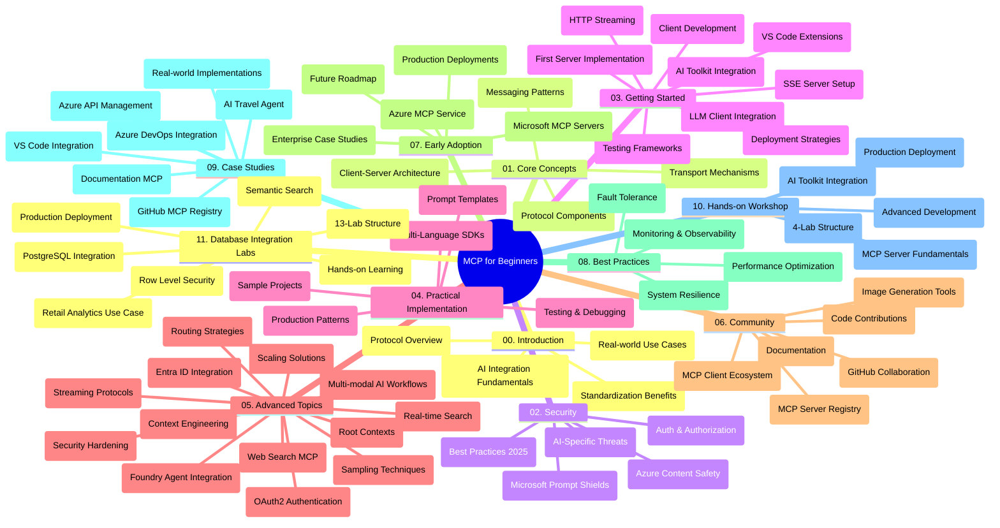

<!--
CO_OP_TRANSLATOR_METADATA:
{
  "original_hash": "aa1ce97bc694b08faf3018bab6d275b9",
  "translation_date": "2025-09-30T16:12:46+00:00",
  "source_file": "study_guide.md",
  "language_code": "pa"
}
-->
# ਮਾਡਲ ਕਾਂਟੈਕਸਟ ਪ੍ਰੋਟੋਕੋਲ (MCP) ਸ਼ੁਰੂਆਤੀ ਲਈ - ਅਧਿਐਨ ਗਾਈਡ

ਇਹ ਅਧਿਐਨ ਗਾਈਡ "ਮਾਡਲ ਕਾਂਟੈਕਸਟ ਪ੍ਰੋਟੋਕੋਲ (MCP) ਸ਼ੁਰੂਆਤੀ ਲਈ" ਪਾਠਕ੍ਰਮ ਲਈ ਰਿਪੋਜ਼ਟਰੀ ਦੀ ਬਣਤਰ ਅਤੇ ਸਮੱਗਰੀ ਦਾ ਜਾਇਜ਼ਾ ਦਿੰਦੀ ਹੈ। ਇਸ ਗਾਈਡ ਦੀ ਵਰਤੋਂ ਰਿਪੋਜ਼ਟਰੀ ਨੂੰ ਕੁਸ਼ਲਤਾਪੂਰਵਕ ਨੇਵੀਗੇਟ ਕਰਨ ਅਤੇ ਉਪਲਬਧ ਸਰੋਤਾਂ ਦਾ ਵਧੇਰੇ ਲਾਭ ਲੈਣ ਲਈ ਕਰੋ।

## ਰਿਪੋਜ਼ਟਰੀ ਦਾ ਜਾਇਜ਼ਾ

ਮਾਡਲ ਕਾਂਟੈਕਸਟ ਪ੍ਰੋਟੋਕੋਲ (MCP) AI ਮਾਡਲ ਅਤੇ ਕਲਾਇੰਟ ਐਪਲੀਕੇਸ਼ਨਾਂ ਦੇ ਵਿਚਕਾਰ ਸੰਚਾਰ ਲਈ ਇੱਕ ਮਿਆਰੀ ਫਰੇਮਵਰਕ ਹੈ। ਸ਼ੁਰੂ ਵਿੱਚ Anthropic ਦੁਆਰਾ ਬਣਾਇਆ ਗਿਆ, MCP ਹੁਣ ਵਿਆਪਕ MCP ਕਮਿਊਨਿਟੀ ਦੁਆਰਾ ਅਧਿਕਾਰਤ GitHub ਸੰਗਠਨ ਰਾਹੀਂ ਸੰਭਾਲਿਆ ਜਾਂਦਾ ਹੈ। ਇਹ ਰਿਪੋਜ਼ਟਰੀ C#, Java, JavaScript, Python, ਅਤੇ TypeScript ਵਿੱਚ ਹੱਥ-ਅਨੁਭਵ ਕੋਡ ਉਦਾਹਰਨਾਂ ਨਾਲ ਇੱਕ ਵਿਸਤ੍ਰਿਤ ਪਾਠਕ੍ਰਮ ਪ੍ਰਦਾਨ ਕਰਦੀ ਹੈ, ਜੋ AI ਡਿਵੈਲਪਰਾਂ, ਸਿਸਟਮ ਆਰਕੀਟੈਕਟਾਂ, ਅਤੇ ਸਾਫਟਵੇਅਰ ਇੰਜੀਨੀਅਰਾਂ ਲਈ ਡਿਜ਼ਾਈਨ ਕੀਤਾ ਗਿਆ ਹੈ।

## ਵਿਜ਼ੁਅਲ ਪਾਠਕ੍ਰਮ ਨਕਸ਼ਾ

## ਰਿਪੋਜ਼ਟਰੀ ਦੀ ਬਣਤਰ

ਰਿਪੋਜ਼ਟਰੀ ਨੂੰ ਗਿਆਰਾਂ ਮੁੱਖ ਭਾਗਾਂ ਵਿੱਚ ਵੰਡਿਆ ਗਿਆ ਹੈ, ਜਿਹੜੇ MCP ਦੇ ਵੱਖ-ਵੱਖ ਪਹਲੂਆਂ 'ਤੇ ਧਿਆਨ ਕੇਂਦਰਿਤ ਕਰਦੇ ਹਨ:

1. **ਪ੍ਰਸਤਾਵਨਾ (00-Introduction/)**
   - ਮਾਡਲ ਕਾਂਟੈਕਸਟ ਪ੍ਰੋਟੋਕੋਲ ਦਾ ਜਾਇਜ਼ਾ
   - AI ਪਾਈਪਲਾਈਨਾਂ ਵਿੱਚ ਮਿਆਰੀਕਰਨ ਕਿਉਂ ਮਹੱਤਵਪੂਰਨ ਹੈ
   - ਵਿਹਾਰਕ ਉਪਯੋਗਤਾ ਅਤੇ ਲਾਭ

2. **ਮੁੱਖ ਧਾਰਨਾਵਾਂ (01-CoreConcepts/)**
   - ਕਲਾਇੰਟ-ਸਰਵਰ ਆਰਕੀਟੈਕਚਰ
   - ਮੁੱਖ ਪ੍ਰੋਟੋਕੋਲ ਘਟਕ
   - MCP ਵਿੱਚ ਸੁਨੇਹਾ ਪੈਟਰਨ

3. **ਸੁਰੱਖਿਆ (02-Security/)**
   - MCP-ਅਧਾਰਿਤ ਸਿਸਟਮਾਂ ਵਿੱਚ ਸੁਰੱਖਿਆ ਖਤਰੇ
   - ਲਾਗੂ ਕਰਨ ਲਈ ਸੁਰੱਖਿਆ ਦੇ ਸਰੋਤ
   - ਪ੍ਰਮਾਣਿਕਤਾ ਅਤੇ ਅਧਿਕਾਰਣ ਰਣਨੀਤੀਆਂ
   - **ਵਿਸਤ੍ਰਿਤ ਸੁਰੱਖਿਆ ਦਸਤਾਵੇਜ਼**:
     - MCP ਸੁਰੱਖਿਆ ਦੇ ਸਰੋਤ 2025
     - Azure ਸਮੱਗਰੀ ਸੁਰੱਖਿਆ ਲਾਗੂ ਕਰਨ ਦੀ ਗਾਈਡ
     - MCP ਸੁਰੱਖਿਆ ਨਿਯੰਤਰਣ ਅਤੇ ਤਕਨੀਕਾਂ
     - MCP ਸਰੋਤ ਤੇਜ਼ ਸੰਕੇਤ
   - **ਮੁੱਖ ਸੁਰੱਖਿਆ ਵਿਸ਼ੇ**:
     - ਪ੍ਰੋਮਪਟ ਇੰਜੈਕਸ਼ਨ ਅਤੇ ਟੂਲ ਪੌਇਜ਼ਨਿੰਗ ਹਮਲੇ
     - ਸੈਸ਼ਨ ਹਾਈਜੈਕਿੰਗ ਅਤੇ ਗਲਤ ਡਿਪਟੀ ਸਮੱਸਿਆਵਾਂ
     - ਟੋਕਨ ਪਾਸਥਰੂ ਭਰਮ
     - ਅਤਿ ਅਧਿਕਾਰ ਅਤੇ ਪਹੁੰਚ ਨਿਯੰਤਰਣ
     - AI ਘਟਕਾਂ ਲਈ ਸਪਲਾਈ ਚੇਨ ਸੁਰੱਖਿਆ
     - Microsoft ਪ੍ਰੋਮਪਟ ਸ਼ੀਲਡਸ ਇੰਟੀਗ੍ਰੇਸ਼ਨ

4. **ਸ਼ੁਰੂਆਤ (03-GettingStarted/)**
   - ਵਾਤਾਵਰਣ ਸੈਟਅੱਪ ਅਤੇ ਸੰਰਚਨਾ
   - ਬੁਨਿਆਦੀ MCP ਸਰਵਰ ਅਤੇ ਕਲਾਇੰਟ ਬਣਾਉਣਾ
   - ਮੌਜੂਦਾ ਐਪਲੀਕੇਸ਼ਨਾਂ ਨਾਲ ਇੰਟੀਗ੍ਰੇਸ਼ਨ
   - ਸ਼ਾਮਲ ਭਾਗ:
     - ਪਹਿਲਾ ਸਰਵਰ ਲਾਗੂ ਕਰਨਾ
     - ਕਲਾਇੰਟ ਵਿਕਾਸ
     - LLM ਕਲਾਇੰਟ ਇੰਟੀਗ੍ਰੇਸ਼ਨ
     - VS ਕੋਡ ਇੰਟੀਗ੍ਰੇਸ਼ਨ
     - ਸਰਵਰ-ਸੈਂਟ ਇਵੈਂਟਸ (SSE) ਸਰਵਰ
     - HTTP ਸਟ੍ਰੀਮਿੰਗ
     - AI ਟੂਲਕਿਟ ਇੰਟੀਗ੍ਰੇਸ਼ਨ
     - ਟੈਸਟਿੰਗ ਰਣਨੀਤੀਆਂ
     - ਡਿਪਲੌਇਮੈਂਟ ਦਿਸ਼ਾ-ਨਿਰਦੇਸ਼

5. **ਵਿਹਾਰਕ ਲਾਗੂ ਕਰਨਾ (04-PracticalImplementation/)**
   - ਵੱਖ-ਵੱਖ ਪ੍ਰੋਗਰਾਮਿੰਗ ਭਾਸ਼ਾਵਾਂ ਵਿੱਚ SDK ਦੀ ਵਰਤੋਂ
   - ਡਿਬੱਗਿੰਗ, ਟੈਸਟਿੰਗ, ਅਤੇ ਵੈਧਤਾ ਤਕਨੀਕਾਂ
   - ਦੁਬਾਰਾ ਵਰਤਣਯੋਗ ਪ੍ਰੋਮਪਟ ਟੈਂਪਲੇਟ ਅਤੇ ਵਰਕਫਲੋ ਬਣਾਉਣਾ
   - ਲਾਗੂ ਕਰਨ ਦੇ ਉਦਾਹਰਨਾਂ ਨਾਲ ਨਮੂਨਾ ਪ੍ਰੋਜੈਕਟ

6. **ਉੱਚਤਮ ਵਿਸ਼ੇ (05-AdvancedTopics/)**
   - ਕਾਂਟੈਕਸਟ ਇੰਜੀਨੀਅਰਿੰਗ ਤਕਨੀਕਾਂ
   - Foundry ਏਜੰਟ ਇੰਟੀਗ੍ਰੇਸ਼ਨ
   - ਮਲਟੀ-ਮੋਡਲ AI ਵਰਕਫਲੋ
   - OAuth2 ਪ੍ਰਮਾਣਿਕਤਾ ਡੈਮੋ
   - ਰੀਅਲ-ਟਾਈਮ ਖੋਜ ਸਮਰੱਥਾ
   - ਰੀਅਲ-ਟਾਈਮ ਸਟ੍ਰੀਮਿੰਗ
   - ਰੂਟ ਕਾਂਟੈਕਸਟ ਲਾਗੂ ਕਰਨਾ
   - ਰੂਟਿੰਗ ਰਣਨੀਤੀਆਂ
   - ਸੈਂਪਲਿੰਗ ਤਕਨੀਕਾਂ
   - ਸਕੇਲਿੰਗ ਪਹੁੰਚ
   - ਸੁਰੱਖਿਆ ਵਿਚਾਰ
   - Entra ID ਸੁਰੱਖਿਆ ਇੰਟੀਗ੍ਰੇਸ਼ਨ
   - ਵੈੱਬ ਖੋਜ ਇੰਟੀਗ੍ਰੇਸ਼ਨ

7. **ਕਮਿਊਨਿਟੀ ਯੋਗਦਾਨ (06-CommunityContributions/)**
   - ਕੋਡ ਅਤੇ ਦਸਤਾਵੇਜ਼ ਵਿੱਚ ਯੋਗਦਾਨ ਦੇਣ ਦਾ ਤਰੀਕਾ
   - GitHub ਰਾਹੀਂ ਸਹਿਯੋਗ
   - ਕਮਿਊਨਿਟੀ-ਚਲਿਤ ਸੁਧਾਰ ਅਤੇ ਪ੍ਰਤੀਕ੍ਰਿਆ
   - ਵੱਖ-ਵੱਖ MCP ਕਲਾਇੰਟਾਂ ਦੀ ਵਰਤੋਂ (Claude Desktop, Cline, VSCode)
   - ਪ੍ਰਸਿੱਧ MCP ਸਰਵਰਾਂ ਨਾਲ ਕੰਮ ਕਰਨਾ ਜਿਵੇਂ ਕਿ ਚਿੱਤਰ ਜਨਰੇਸ਼ਨ

8. **ਸ਼ੁਰੂਆਤੀ ਅਪਨਾਉਣ ਤੋਂ ਸਿੱਖਿਆ (07-LessonsfromEarlyAdoption/)**
   - ਅਸਲ-ਦੁਨੀਆ ਲਾਗੂ ਕਰਨ ਅਤੇ ਸਫਲਤਾ ਦੀਆਂ ਕਹਾਣੀਆਂ
   - MCP-ਅਧਾਰਿਤ ਹੱਲ ਬਣਾਉਣਾ ਅਤੇ ਡਿਪਲੌਇਮੈਂਟ
   - ਰੁਝਾਨ ਅਤੇ ਭਵਿੱਖ ਦਾ ਰੋਡਮੈਪ
   - **Microsoft MCP ਸਰਵਰ ਗਾਈਡ**: 10 ਉਤਪਾਦਨ-ਤਿਆਰ Microsoft MCP ਸਰਵਰਾਂ ਲਈ ਵਿਸਤ੍ਰਿਤ ਗਾਈਡ, ਜਿਸ ਵਿੱਚ ਸ਼ਾਮਲ ਹਨ:
     - Microsoft Learn Docs MCP Server
     - Azure MCP Server (15+ ਵਿਸ਼ੇਸ਼ ਕਨੈਕਟਰ)
     - GitHub MCP Server
     - Azure DevOps MCP Server
     - MarkItDown MCP Server
     - SQL Server MCP Server
     - Playwright MCP Server
     - Dev Box MCP Server
     - Azure AI Foundry MCP Server
     - Microsoft 365 Agents Toolkit MCP Server

9. **ਸਰੋਤ ਤੇਜ਼ ਸੰਕੇਤ (08-BestPractices/)**
   - ਪ੍ਰਦਰਸ਼ਨ ਟਿਊਨਿੰਗ ਅਤੇ ਅਨੁਕੂਲਤਾ
   - ਫਾਲਟ-ਟੋਲਰੈਂਟ MCP ਸਿਸਟਮ ਡਿਜ਼ਾਈਨ ਕਰਨਾ
   - ਟੈਸਟਿੰਗ ਅਤੇ ਲਚਕਦਾਰ ਰਣਨੀਤੀਆਂ

10. **ਕੇਸ ਸਟਡੀਜ਼ (09-CaseStudy/)**
    - **ਸੱਤ ਵਿਸਤ੍ਰਿਤ ਕੇਸ ਸਟਡੀਜ਼** ਜੋ ਵੱਖ-ਵੱਖ ਸਥਿਤੀਆਂ ਵਿੱਚ MCP ਦੀ ਬਹੁਮੁਖੀਤਾ ਦਿਖਾਉਂਦੀਆਂ ਹਨ:
    - **Azure AI Travel Agents**: Azure OpenAI ਅਤੇ AI Search ਨਾਲ ਮਲਟੀ-ਏਜੰਟ ਆਰਕਸਟਰੈਸ਼ਨ
    - **Azure DevOps ਇੰਟੀਗ੍ਰੇਸ਼ਨ**: YouTube ਡੇਟਾ ਅਪਡੇਟਸ ਨਾਲ ਵਰਕਫਲੋ ਪ੍ਰਕਿਰਿਆਵਾਂ ਨੂੰ ਆਟੋਮੈਟ ਕਰਨਾ
    - **ਰੀਅਲ-ਟਾਈਮ ਦਸਤਾਵੇਜ਼ ਪ੍ਰਾਪਤੀ**: ਸਟ੍ਰੀਮਿੰਗ HTTP ਨਾਲ Python ਕਨਸੋਲ ਕਲਾਇੰਟ
    - **ਇੰਟਰਐਕਟਿਵ ਅਧਿਐਨ ਯੋਜਨਾ ਜਨਰੇਟਰ**: ਚੈਨਲਿਟ ਵੈੱਬ ਐਪ ਨਾਲ ਗੁਫਤਗੂ AI
    - **ਇਨ-ਐਡੀਟਰ ਦਸਤਾਵੇਜ਼**: GitHub Copilot ਵਰਕਫਲੋਜ਼ ਨਾਲ VS ਕੋਡ ਇੰਟੀਗ੍ਰੇਸ਼ਨ
    - **Azure API ਮੈਨੇਜਮੈਂਟ**: MCP ਸਰਵਰ ਬਣਾਉਣ ਨਾਲ ਐਨਟਰਪ੍ਰਾਈਜ਼ API ਇੰਟੀਗ੍ਰੇਸ਼ਨ
    - **GitHub MCP ਰਜਿਸਟਰੀ**: ਪਾਰਿਸਥਿਤਿਕੀ ਵਿਕਾਸ ਅਤੇ ਏਜੰਟਿਕ ਇੰਟੀਗ੍ਰੇਸ਼ਨ ਪਲੇਟਫਾਰਮ
    - ਐਨਟਰਪ੍ਰਾਈਜ਼ ਇੰਟੀਗ੍ਰੇਸ਼ਨ, ਡਿਵੈਲਪਰ ਉਤਪਾਦਕਤਾ, ਅਤੇ ਪਾਰਿਸਥਿਤਿਕੀ ਵਿਕਾਸ ਨੂੰ ਕਵਰ ਕਰਨ ਵਾਲੇ ਲਾਗੂ ਕਰਨ ਦੇ ਉਦਾਹਰਨ

11. **ਹੱਥ-ਅਨੁਭਵ ਵਰਕਸ਼ਾਪ (10-StreamliningAIWorkflowsBuildingAnMCPServerWithAIToolkit/)**
    - MCP ਨੂੰ AI ਟੂਲਕਿਟ ਨਾਲ ਜੋੜਦੇ ਹੋਏ ਵਿਸਤ੍ਰਿਤ ਹੱਥ-ਅਨੁਭਵ ਵਰਕਸ਼ਾਪ
    - AI ਮਾਡਲਾਂ ਨੂੰ ਅਸਲ-ਦੁਨੀਆ ਦੇ ਟੂਲਾਂ ਨਾਲ ਜੋੜਦੇ ਹੋਏ ਬੁੱਧੀਮਾਨ ਐਪਲੀਕੇਸ਼ਨ ਬਣਾਉਣਾ
    - ਮੂਲਭੂਤ, ਕਸਟਮ ਸਰਵਰ ਵਿਕਾਸ, ਅਤੇ ਉਤਪਾਦਨ ਡਿਪਲੌਇਮੈਂਟ ਰਣਨੀਤੀਆਂ ਨੂੰ ਕਵਰ ਕਰਨ ਵਾਲੇ ਵਿਹਾਰਕ ਮੌਡਿਊਲ
    - **ਲੈਬ ਬਣਤਰ**:
      - ਲੈਬ 1: MCP ਸਰਵਰ ਮੂਲਭੂਤ
      - ਲੈਬ 2: ਉੱਚਤਮ MCP ਸਰਵਰ ਵਿਕਾਸ
      - ਲੈਬ 3: AI ਟੂਲਕਿਟ ਇੰਟੀਗ੍ਰੇਸ਼ਨ
      - ਲੈਬ 4: ਉਤਪਾਦਨ ਡਿਪਲੌਇਮੈਂਟ ਅਤੇ ਸਕੇਲਿੰਗ
    - ਕਦਮ-ਦਰ-ਕਦਮ ਦਿਸ਼ਾ-ਨਿਰਦੇਸ਼ਾਂ ਨਾਲ ਲੈਬ-ਅਧਾਰਿਤ ਸਿੱਖਣ ਦਾ ਦ੍ਰਿਸ਼ਟੀਕੋਣ

12. **MCP ਸਰਵਰ ਡੇਟਾਬੇਸ ਇੰਟੀਗ੍ਰੇਸ਼ਨ ਲੈਬਜ਼ (11-MCPServerHandsOnLabs/)**
    - **ਉਤਪਾਦਨ-ਤਿਆਰ MCP ਸਰਵਰਾਂ ਲਈ 13-ਲੈਬ ਸਿੱਖਣ ਪਾਠ** PostgreSQL ਇੰਟੀਗ੍ਰੇਸ਼ਨ ਨਾਲ
    - **Zava ਰਿਟੇਲ ਉਪਯੋਗਤਾ** ਦੀ ਵਰਤੋਂ ਕਰਦੇ ਹੋਏ ਅਸਲ-ਦੁਨੀਆ ਰਿਟੇਲ ਵਿਸ਼ਲੇਸ਼ਣ ਲਾਗੂ ਕਰਨਾ
    - **ਐਨਟਰਪ੍ਰਾਈਜ਼-ਗ੍ਰੇਡ ਪੈਟਰਨ** ਜਿਵੇਂ ਕਿ Row Level Security (RLS), ਸੈਮੈਂਟਿਕ ਖੋਜ, ਅਤੇ ਮਲਟੀ-ਟੈਨੈਂਟ ਡੇਟਾ ਪਹੁੰਚ
    - **ਪੂਰੀ ਲੈਬ ਬਣਤਰ**:
      - **ਲੈਬਜ਼ 00-03: ਮੂਲਭੂਤ** - ਪ੍ਰਸਤਾਵਨਾ, ਆਰਕੀਟੈਕਚਰ, ਸੁਰੱਖਿਆ, ਵਾਤਾਵਰਣ ਸੈਟਅੱਪ
      - **ਲੈਬਜ਼ 04-06: MCP ਸਰਵਰ ਬਣਾਉਣਾ** - ਡੇਟਾਬੇਸ ਡਿਜ਼ਾਈਨ, MCP ਸਰਵਰ ਲਾਗੂ ਕਰਨਾ, ਟੂਲ ਵਿਕਾਸ
      - **ਲੈਬਜ਼ 07-09: ਉੱਚਤਮ ਵਿਸ਼ੇਸ਼ਤਾਵਾਂ** - ਸੈਮੈਂਟਿਕ ਖੋਜ, ਟੈਸਟਿੰਗ ਅਤੇ ਡਿਬੱਗਿੰਗ, VS ਕੋਡ ਇੰਟੀਗ੍ਰੇਸ਼ਨ
      - **ਲੈਬਜ਼ 10-12: ਉਤਪਾਦਨ ਅਤੇ ਸਰੋਤ ਤੇਜ਼ ਸੰਕੇਤ** - ਡਿਪਲੌਇਮੈਂਟ, ਨਿਗਰਾਨੀ, ਅਨੁਕੂਲਤਾ
    - **ਕਵਰ ਕੀਤੀਆਂ ਤਕਨੀਕਾਂ**: FastMCP ਫਰੇਮਵਰਕ, PostgreSQL, Azure OpenAI, Azure Container Apps, Application Insights
    - **ਸਿੱਖਣ ਦੇ ਨਤੀਜੇ**: ਉਤਪਾਦਨ-ਤਿਆਰ MCP ਸਰਵਰ, ਡੇਟਾਬੇਸ ਇੰਟੀਗ੍ਰੇਸ਼ਨ ਪੈਟਰਨ, AI-ਚਾਲਤ ਵਿਸ਼ਲੇਸ਼ਣ, ਐਨਟਰਪ੍ਰਾਈਜ਼ ਸੁਰੱਖਿਆ

## ਵਾਧੂ ਸਰੋਤ

ਰਿਪੋਜ਼ਟਰੀ ਵਿੱਚ ਸਹਾਇਕ ਸਰੋਤ ਸ਼ਾਮਲ ਹਨ:

- **ਚਿੱਤਰਾਂ ਫੋਲਡਰ**: ਪਾਠਕ੍ਰਮ ਵਿੱਚ ਵਰਤੇ ਗਏ ਡਾਇਗ੍ਰਾਮ ਅਤੇ ਚਿੱਤਰਾਂ ਸ਼ਾਮਲ ਹਨ
- **ਅਨੁਵਾਦ**: ਦਸਤਾਵੇਜ਼ਾਂ ਦੇ ਆਟੋਮੈਟਿਕ ਅਨੁਵਾਦ ਨਾਲ ਬਹੁ-ਭਾਸ਼ਾ ਸਹਾਇਤਾ
- **ਅਧਿਕਾਰਤ MCP ਸਰੋਤ**:
  - [MCP ਦਸਤਾਵੇਜ਼](https://modelcontextprotocol.io/)
  - [MCP ਵਿਸ਼ੇਸ਼ਤਾ](https://spec.modelcontextprotocol.io/)
  - [MCP GitHub ਰਿਪੋਜ਼ਟਰੀ](https://github.com/modelcontextprotocol)

## ਇਸ ਰਿਪੋਜ਼ਟਰੀ ਦੀ ਵਰਤੋਂ ਕਿਵੇਂ ਕਰਨੀ ਹੈ

1. **ਕ੍ਰਮਵਾਰ ਸਿੱਖਣਾ**: ਇੱਕ ਸੰਰਚਿਤ ਸਿੱਖਣ ਅਨੁਭਵ ਲਈ ਅਧਿਆਇ 00 ਤੋਂ 11 ਤੱਕ ਕ੍ਰਮਵਾਰ ਪਾਲਣਾ ਕਰੋ।
2. **ਭਾਸ਼ਾ-ਵਿਸ਼ੇਸ਼ ਧਿਆਨ**: ਜੇ ਤੁਸੀਂ ਕਿਸੇ ਵਿਸ਼ੇਸ਼ ਪ੍ਰੋਗਰਾਮਿੰਗ ਭਾਸ਼ਾ ਵਿੱਚ ਦਿਲਚਸਪੀ ਰੱਖਦੇ ਹੋ, ਤਾਂ ਆਪਣੇ ਪਸੰਦੀਦਾ ਭਾਸ਼ਾ ਵਿੱਚ ਲਾਗੂ ਕਰਨ ਲਈ ਨਮੂਨਾ ਡਾਇਰੈਕਟਰੀਜ਼ ਦੀ ਖੋਜ ਕਰੋ।
3. **ਵਿਹਾਰਕ ਲਾਗੂ ਕਰਨਾ**: "ਸ਼ੁਰੂਆਤ" ਭਾਗ ਨਾਲ ਸ਼ੁਰੂ ਕਰੋ ਤਾਂ ਜੋ ਆਪਣਾ ਵਾਤਾਵਰਣ ਸੈਟਅੱਪ ਕਰ ਸਕੋ ਅਤੇ ਆਪਣਾ ਪਹਿਲਾ MCP ਸਰਵਰ ਅਤੇ ਕਲਾਇੰਟ ਬਣਾਉ।
4. **ਉੱਚਤਮ ਖੋਜ**: ਜਦੋਂ ਬੁਨਿਆਦੀਆਂ ਨਾਲ ਆਰਾਮਦਾਇਕ ਹੋ ਜਾਓ, ਤਾਂ ਆਪਣਾ ਗਿਆਨ ਵਧਾਉਣ ਲਈ ਉੱਚਤਮ ਵਿਸ਼ਿਆਂ ਵਿੱਚ ਡੁੱਬੋ।
5. **ਕਮਿਊਨਿਟੀ ਸਹਿਭਾਗ**: GitHub ਚਰਚਾ ਅਤੇ Discord ਚੈਨਲਾਂ ਰਾਹੀਂ MCP ਕਮਿਊਨਿਟੀ ਵਿੱਚ ਸ਼ਾਮਲ ਹੋਵੋ ਤਾਂ ਜੋ ਮਾਹਰਾਂ ਅਤੇ ਸਾਥੀ ਡਿਵੈਲਪਰਾਂ ਨਾਲ ਜੁੜ ਸਕੋ।

## MCP ਕਲਾਇੰਟ ਅਤੇ ਟੂਲ

ਪਾਠਕ੍ਰਮ ਵੱਖ-ਵੱਖ MCP ਕਲਾਇੰਟਾਂ ਅਤੇ ਟੂਲਾਂ ਨੂੰ ਕਵਰ ਕਰਦਾ ਹੈ:

1. **ਅਧਿਕਾਰਤ ਕਲਾਇੰਟ**:
   - Visual Studio Code 
   - MCP Visual Studio Code ਵਿੱਚ
   - Claude Desktop
   - Claude VSCode ਵਿੱਚ 
   - Claude API

2. **ਕਮਿਊਨਿਟੀ ਕਲਾਇੰਟ**:
   - Cline (ਟਰਮੀਨਲ-ਅਧਾਰਿਤ)
   - Cursor (ਕੋਡ ਐਡੀਟਰ)
   - ChatMCP
   - Windsurf

3. **MCP ਮੈਨੇਜਮੈਂਟ ਟੂਲ**:
   - MCP CLI
   - MCP ਮੈਨੇਜਰ
   - MCP ਲਿੰਕਰ
   - MCP ਰਾਊਟਰ

## ਪ੍ਰਸਿੱਧ MCP ਸਰਵਰ

ਰਿਪੋਜ਼ਟਰੀ ਵੱਖ-ਵੱਖ MCP ਸਰਵਰਾਂ ਨੂੰ ਪੇਸ਼ ਕਰਦੀ ਹੈ, ਜਿਸ ਵਿੱਚ ਸ਼ਾਮਲ ਹਨ:

1. **ਅਧਿਕਾਰਤ Microsoft MCP ਸਰਵਰ**:
   - Microsoft Learn Docs MCP Server
   - Azure MCP Server (15+ ਵਿਸ਼ੇਸ਼ ਕਨੈਕਟਰ)
   - GitHub MCP Server
   - Azure DevOps MCP Server
   - MarkItDown MCP Server
   - SQL Server MCP Server
   - Playwright MCP Server
   - Dev Box MCP Server
   - Azure AI Foundry MCP Server
   - Microsoft 365 Agents Toolkit MCP Server

2. **ਅਧਿਕਾਰਤ ਰਿਫਰੈਂਸ ਸਰਵਰ**:
   - Filesystem
   - Fetch
   - Memory
   - Sequential Thinking

3. **ਚਿੱਤਰ ਜਨਰੇਸ਼ਨ**:
   - Azure OpenAI DALL-E 3
   - Stable

---

**ਅਸਵੀਕਰਤਾ**:  
ਇਹ ਦਸਤਾਵੇਜ਼ AI ਅਨੁਵਾਦ ਸੇਵਾ [Co-op Translator](https://github.com/Azure/co-op-translator) ਦੀ ਵਰਤੋਂ ਕਰਕੇ ਅਨੁਵਾਦ ਕੀਤਾ ਗਿਆ ਹੈ। ਜਦੋਂ ਕਿ ਅਸੀਂ ਸਹੀ ਹੋਣ ਦੀ ਕੋਸ਼ਿਸ਼ ਕਰਦੇ ਹਾਂ, ਕਿਰਪਾ ਕਰਕੇ ਧਿਆਨ ਦਿਓ ਕਿ ਸਵੈਚਾਲਿਤ ਅਨੁਵਾਦਾਂ ਵਿੱਚ ਗਲਤੀਆਂ ਜਾਂ ਅਸੁਚੱਜੇਪਣ ਹੋ ਸਕਦੇ ਹਨ। ਇਸ ਦੀ ਮੂਲ ਭਾਸ਼ਾ ਵਿੱਚ ਮੌਜੂਦ ਅਸਲ ਦਸਤਾਵੇਜ਼ ਨੂੰ ਅਧਿਕਾਰਤ ਸਰੋਤ ਮੰਨਿਆ ਜਾਣਾ ਚਾਹੀਦਾ ਹੈ। ਮਹੱਤਵਪੂਰਨ ਜਾਣਕਾਰੀ ਲਈ, ਪੇਸ਼ੇਵਰ ਮਨੁੱਖੀ ਅਨੁਵਾਦ ਦੀ ਸਿਫਾਰਸ਼ ਕੀਤੀ ਜਾਂਦੀ ਹੈ। ਅਸੀਂ ਇਸ ਅਨੁਵਾਦ ਦੀ ਵਰਤੋਂ ਤੋਂ ਪੈਦਾ ਹੋਣ ਵਾਲੇ ਕਿਸੇ ਵੀ ਗਲਤ ਫਹਿਮੀ ਜਾਂ ਗਲਤ ਵਿਆਖਿਆ ਲਈ ਜ਼ਿੰਮੇਵਾਰ ਨਹੀਂ ਹਾਂ।