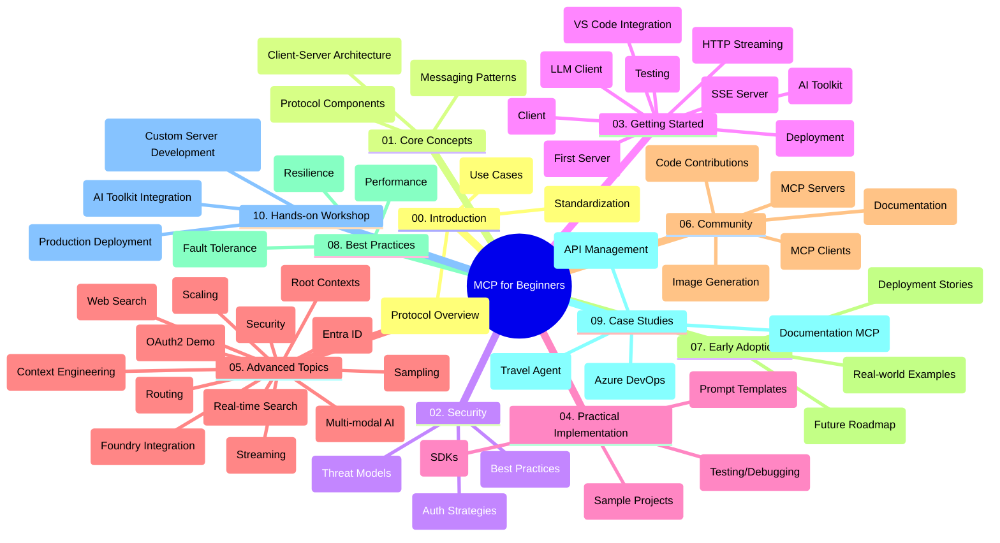

<!--
CO_OP_TRANSLATOR_METADATA:
{
  "original_hash": "5f321ea583cf087a94e47ee74c62b504",
  "translation_date": "2025-07-17T05:27:49+00:00",
  "source_file": "study_guide.md",
  "language_code": "pa"
}
-->
# Model Context Protocol (MCP) for Beginners - ਅਧਿਐਨ ਮਾਰਗਦਰਸ਼ਿਕਾ

ਇਹ ਅਧਿਐਨ ਮਾਰਗਦਰਸ਼ਿਕਾ "Model Context Protocol (MCP) for Beginners" ਕਰਿਕੁਲਮ ਲਈ ਰਿਪੋਜ਼ਟਰੀ ਦੀ ਬਣਤਰ ਅਤੇ ਸਮੱਗਰੀ ਦਾ ਇੱਕ ਝਲਕ ਪ੍ਰਦਾਨ ਕਰਦੀ ਹੈ। ਇਸ ਮਾਰਗਦਰਸ਼ਿਕਾ ਦੀ ਵਰਤੋਂ ਕਰਕੇ ਤੁਸੀਂ ਰਿਪੋਜ਼ਟਰੀ ਵਿੱਚ ਸੁਚੱਜੇ ਤਰੀਕੇ ਨਾਲ ਨੈਵੀਗੇਟ ਕਰ ਸਕਦੇ ਹੋ ਅਤੇ ਉਪਲਬਧ ਸਰੋਤਾਂ ਦਾ ਪੂਰਾ ਲਾਭ ਉਠਾ ਸਕਦੇ ਹੋ।

## ਰਿਪੋਜ਼ਟਰੀ ਦਾ ਝਲਕ

Model Context Protocol (MCP) AI ਮਾਡਲਾਂ ਅਤੇ ਕਲਾਇੰਟ ਐਪਲੀਕੇਸ਼ਨਾਂ ਵਿਚਕਾਰ ਇੰਟਰੈਕਸ਼ਨਾਂ ਲਈ ਇੱਕ ਮਿਆਰੀ ਢਾਂਚਾ ਹੈ। ਇਹ ਪਹਿਲਾਂ Anthropic ਵੱਲੋਂ ਬਣਾਇਆ ਗਿਆ ਸੀ, ਹੁਣ MCP ਕਮਿਊਨਿਟੀ ਦੁਆਰਾ ਅਧਿਕਾਰਕ GitHub ਸੰਗਠਨ ਰਾਹੀਂ ਸੰਭਾਲਿਆ ਜਾਂਦਾ ਹੈ। ਇਹ ਰਿਪੋਜ਼ਟਰੀ C#, Java, JavaScript, Python, ਅਤੇ TypeScript ਵਿੱਚ ਹੱਥੋਂ-ਹੱਥ ਕੋਡ ਉਦਾਹਰਣਾਂ ਸਮੇਤ ਇੱਕ ਵਿਸਤ੍ਰਿਤ ਕਰਿਕੁਲਮ ਪ੍ਰਦਾਨ ਕਰਦੀ ਹੈ, ਜੋ AI ਡਿਵੈਲਪਰਾਂ, ਸਿਸਟਮ ਆਰਕੀਟੈਕਟਾਂ ਅਤੇ ਸਾਫਟਵੇਅਰ ਇੰਜੀਨੀਅਰਾਂ ਲਈ ਬਣਾਇਆ ਗਿਆ ਹੈ।

## ਵਿਜ਼ੂਅਲ ਕਰਿਕੁਲਮ ਨਕਸ਼ਾ

## ਰਿਪੋਜ਼ਟਰੀ ਦੀ ਬਣਤਰ

ਰਿਪੋਜ਼ਟਰੀ ਨੂੰ ਦਸ ਮੁੱਖ ਭਾਗਾਂ ਵਿੱਚ ਵੰਡਿਆ ਗਿਆ ਹੈ, ਜਿਹੜੇ MCP ਦੇ ਵੱਖ-ਵੱਖ ਪਹਲੂਆਂ 'ਤੇ ਧਿਆਨ ਕੇਂਦਰਿਤ ਕਰਦੇ ਹਨ:

1. **Introduction (00-Introduction/)**
   - Model Context Protocol ਦਾ ਜਾਇਜ਼ਾ
   - AI ਪਾਈਪਲਾਈਨਾਂ ਵਿੱਚ ਮਿਆਰੀਕਰਨ ਦੀ ਮਹੱਤਤਾ
   - ਪ੍ਰਯੋਗਿਕ ਕੇਸ ਅਤੇ ਲਾਭ

2. **Core Concepts (01-CoreConcepts/)**
   - ਕਲਾਇੰਟ-ਸਰਵਰ ਆਰਕੀਟੈਕਚਰ
   - ਮੁੱਖ ਪ੍ਰੋਟੋਕੋਲ ਘਟਕ
   - MCP ਵਿੱਚ ਮੈਸੇਜਿੰਗ ਪੈਟਰਨ

3. **Security (02-Security/)**
   - MCP-ਅਧਾਰਿਤ ਸਿਸਟਮਾਂ ਵਿੱਚ ਸੁਰੱਖਿਆ ਖ਼ਤਰੇ
   - ਸੁਰੱਖਿਆ ਲਈ ਸਰਵੋਤਮ ਅਭਿਆਸ
   - ਪ੍ਰਮਾਣਿਕਤਾ ਅਤੇ ਅਧਿਕਾਰਣ ਰਣਨੀਤੀਆਂ

4. **Getting Started (03-GettingStarted/)**
   - ਵਾਤਾਵਰਣ ਸੈਟਅੱਪ ਅਤੇ ਸੰਰਚਨਾ
   - ਬੁਨਿਆਦੀ MCP ਸਰਵਰ ਅਤੇ ਕਲਾਇੰਟ ਬਣਾਉਣਾ
   - ਮੌਜੂਦਾ ਐਪਲੀਕੇਸ਼ਨਾਂ ਨਾਲ ਇੰਟੀਗ੍ਰੇਸ਼ਨ
   - ਸ਼ਾਮਲ ਹਿੱਸੇ:
     - ਪਹਿਲਾ ਸਰਵਰ ਇੰਪਲੀਮੈਂਟੇਸ਼ਨ
     - ਕਲਾਇੰਟ ਵਿਕਾਸ
     - LLM ਕਲਾਇੰਟ ਇੰਟੀਗ੍ਰੇਸ਼ਨ
     - VS Code ਇੰਟੀਗ੍ਰੇਸ਼ਨ
     - Server-Sent Events (SSE) ਸਰਵਰ
     - HTTP ਸਟ੍ਰੀਮਿੰਗ
     - AI Toolkit ਇੰਟੀਗ੍ਰੇਸ਼ਨ
     - ਟੈਸਟਿੰਗ ਰਣਨੀਤੀਆਂ
     - ਡਿਪਲੋਇਮੈਂਟ ਦਿਸ਼ਾ-ਨਿਰਦੇਸ਼

5. **Practical Implementation (04-PracticalImplementation/)**
   - ਵੱਖ-ਵੱਖ ਪ੍ਰੋਗ੍ਰਾਮਿੰਗ ਭਾਸ਼ਾਵਾਂ ਵਿੱਚ SDK ਦੀ ਵਰਤੋਂ
   - ਡੀਬੱਗਿੰਗ, ਟੈਸਟਿੰਗ ਅਤੇ ਵੈਰੀਫਿਕੇਸ਼ਨ ਤਕਨੀਕਾਂ
   - ਦੁਬਾਰਾ ਵਰਤਣ ਯੋਗ ਪ੍ਰਾਂਪਟ ਟੈਮਪਲੇਟ ਅਤੇ ਵਰਕਫਲੋਜ਼ ਤਿਆਰ ਕਰਨਾ
   - ਇੰਪਲੀਮੈਂਟੇਸ਼ਨ ਉਦਾਹਰਣਾਂ ਸਮੇਤ ਨਮੂਨਾ ਪ੍ਰੋਜੈਕਟ

6. **Advanced Topics (05-AdvancedTopics/)**
   - ਸੰਦਰਭ ਇੰਜੀਨੀਅਰਿੰਗ ਤਕਨੀਕਾਂ
   - Foundry ਏਜੰਟ ਇੰਟੀਗ੍ਰੇਸ਼ਨ
   - ਮਲਟੀ-ਮੋਡਲ AI ਵਰਕਫਲੋਜ਼
   - OAuth2 ਪ੍ਰਮਾਣਿਕਤਾ ਡੈਮੋਜ਼
   - ਰੀਅਲ-ਟਾਈਮ ਖੋਜ ਸਮਰੱਥਾਵਾਂ
   - ਰੀਅਲ-ਟਾਈਮ ਸਟ੍ਰੀਮਿੰਗ
   - ਰੂਟ ਸੰਦਰਭਾਂ ਦੀ ਇੰਪਲੀਮੈਂਟੇਸ਼ਨ
   - ਰਾਊਟਿੰਗ ਰਣਨੀਤੀਆਂ
   - ਸੈਂਪਲਿੰਗ ਤਕਨੀਕਾਂ
   - ਸਕੇਲਿੰਗ ਪਹੁੰਚਾਂ
   - ਸੁਰੱਖਿਆ ਸੰਬੰਧੀ ਵਿਚਾਰ
   - Entra ID ਸੁਰੱਖਿਆ ਇੰਟੀਗ੍ਰੇਸ਼ਨ
   - ਵੈੱਬ ਖੋਜ ਇੰਟੀਗ੍ਰੇਸ਼ਨ

7. **Community Contributions (06-CommunityContributions/)**
   - ਕੋਡ ਅਤੇ ਦਸਤਾਵੇਜ਼ੀਕਰਨ ਵਿੱਚ ਯੋਗਦਾਨ ਦੇਣ ਦਾ ਤਰੀਕਾ
   - GitHub ਰਾਹੀਂ ਸਹਿਯੋਗ
   - ਕਮਿਊਨਿਟੀ-ਚਲਿਤ ਸੁਧਾਰ ਅਤੇ ਫੀਡਬੈਕ
   - ਵੱਖ-ਵੱਖ MCP ਕਲਾਇੰਟਾਂ ਦੀ ਵਰਤੋਂ (Claude Desktop, Cline, VSCode)
   - ਪ੍ਰਸਿੱਧ MCP ਸਰਵਰਾਂ ਨਾਲ ਕੰਮ ਕਰਨਾ, ਜਿਸ ਵਿੱਚ ਇਮੇਜ ਜਨਰੇਸ਼ਨ ਵੀ ਸ਼ਾਮਲ ਹੈ

8. **Lessons from Early Adoption (07-LessonsfromEarlyAdoption/)**
   - ਅਸਲੀ ਦੁਨੀਆ ਦੇ ਇੰਪਲੀਮੈਂਟੇਸ਼ਨ ਅਤੇ ਸਫਲਤਾ ਕਹਾਣੀਆਂ
   - MCP-ਅਧਾਰਿਤ ਹੱਲਾਂ ਦਾ ਨਿਰਮਾਣ ਅਤੇ ਡਿਪਲੋਇਮੈਂਟ
   - ਰੁਝਾਨ ਅਤੇ ਭਵਿੱਖ ਦਾ ਰੋਡਮੈਪ

9. **Best Practices (08-BestPractices/)**
   - ਪ੍ਰਦਰਸ਼ਨ ਸੁਧਾਰ ਅਤੇ ਅਪਟੀਮਾਈਜ਼ੇਸ਼ਨ
   - ਫਾਲਟ-ਟੋਲਰੈਂਟ MCP ਸਿਸਟਮਾਂ ਦੀ ਡਿਜ਼ਾਈਨਿੰਗ
   - ਟੈਸਟਿੰਗ ਅਤੇ ਲਚੀਲਾਪਣ ਰਣਨੀਤੀਆਂ

10. **Case Studies (09-CaseStudy/)**
    - ਕੇਸ ਸਟਡੀ: Azure API Management ਇੰਟੀਗ੍ਰੇਸ਼ਨ
    - ਕੇਸ ਸਟਡੀ: ਟ੍ਰੈਵਲ ਏਜੰਟ ਇੰਪਲੀਮੈਂਟੇਸ਼ਨ
    - ਕੇਸ ਸਟਡੀ: Azure DevOps ਦਾ YouTube ਨਾਲ ਇੰਟੀਗ੍ਰੇਸ਼ਨ
    - ਵਿਸਥਾਰਪੂਰਵਕ ਦਸਤਾਵੇਜ਼ੀਕਰਨ ਸਮੇਤ ਇੰਪਲੀਮੈਂਟੇਸ਼ਨ ਉਦਾਹਰਣਾਂ

11. **Hands-on Workshop (10-StreamliningAIWorkflowsBuildingAnMCPServerWithAIToolkit/)**
    - MCP ਅਤੇ AI Toolkit ਨੂੰ ਮਿਲਾ ਕੇ ਵਿਸਤ੍ਰਿਤ ਹੱਥੋਂ-ਹੱਥ ਵਰਕਸ਼ਾਪ
    - ਬੁੱਧੀਮਾਨ ਐਪਲੀਕੇਸ਼ਨਾਂ ਦਾ ਨਿਰਮਾਣ ਜੋ AI ਮਾਡਲਾਂ ਨੂੰ ਅਸਲੀ ਦੁਨੀਆ ਦੇ ਟੂਲਾਂ ਨਾਲ ਜੋੜਦਾ ਹੈ
    - ਮੂਲਭੂਤ, ਕਸਟਮ ਸਰਵਰ ਵਿਕਾਸ ਅਤੇ ਉਤਪਾਦਨ ਡਿਪਲੋਇਮੈਂਟ ਰਣਨੀਤੀਆਂ ਨੂੰ ਕਵਰ ਕਰਨ ਵਾਲੇ ਪ੍ਰਯੋਗਿਕ ਮਾਡਿਊਲ
    - ਲੈਬ-ਆਧਾਰਿਤ ਸਿੱਖਣ ਦੀ ਪদ্ধਤੀ ਨਾਲ ਕਦਮ-ਦਰ-ਕਦਮ ਹਦਾਇਤਾਂ

## ਵਾਧੂ ਸਰੋਤ

ਰਿਪੋਜ਼ਟਰੀ ਵਿੱਚ ਸਹਾਇਕ ਸਰੋਤ ਸ਼ਾਮਲ ਹਨ:

- **Images ਫੋਲਡਰ**: ਕਰਿਕੁਲਮ ਵਿੱਚ ਵਰਤੇ ਗਏ ਡਾਇਗ੍ਰਾਮ ਅਤੇ ਚਿੱਤਰ
- **Translations**: ਦਸਤਾਵੇਜ਼ੀਕਰਨ ਦੇ ਆਟੋਮੈਟਿਕ ਅਨੁਵਾਦਾਂ ਸਮੇਤ ਬਹੁ-ਭਾਸ਼ਾਈ ਸਹਾਇਤਾ
- **ਅਧਿਕਾਰਕ MCP ਸਰੋਤ**:
  - [MCP Documentation](https://modelcontextprotocol.io/)
  - [MCP Specification](https://spec.modelcontextprotocol.io/)
  - [MCP GitHub Repository](https://github.com/modelcontextprotocol)

## ਇਸ ਰਿਪੋਜ਼ਟਰੀ ਦੀ ਵਰਤੋਂ ਕਿਵੇਂ ਕਰੀਏ

1. **ਕ੍ਰਮਵਾਰ ਸਿੱਖਣਾ**: ਇੱਕ ਢਾਂਚੇਵਾਰ ਸਿੱਖਣ ਦੇ ਤਜਰਬੇ ਲਈ ਅਧਿਆਇ 00 ਤੋਂ 10 ਤੱਕ ਕ੍ਰਮਵਾਰ ਪੜ੍ਹੋ।
2. **ਭਾਸ਼ਾ-ਵਿਸ਼ੇਸ਼ ਧਿਆਨ**: ਜੇ ਤੁਸੀਂ ਕਿਸੇ ਖਾਸ ਪ੍ਰੋਗ੍ਰਾਮਿੰਗ ਭਾਸ਼ਾ ਵਿੱਚ ਰੁਚੀ ਰੱਖਦੇ ਹੋ, ਤਾਂ ਆਪਣੇ ਮਨਪਸੰਦ ਭਾਸ਼ਾ ਵਿੱਚ ਇੰਪਲੀਮੈਂਟੇਸ਼ਨਾਂ ਲਈ ਸੈਂਪਲ ਡਾਇਰੈਕਟਰੀਜ਼ ਦੀ ਜਾਂਚ ਕਰੋ।
3. **ਪ੍ਰਯੋਗਿਕ ਇੰਪਲੀਮੈਂਟੇਸ਼ਨ**: ਆਪਣੇ ਵਾਤਾਵਰਣ ਨੂੰ ਸੈਟਅੱਪ ਕਰਨ ਅਤੇ ਆਪਣਾ ਪਹਿਲਾ MCP ਸਰਵਰ ਅਤੇ ਕਲਾਇੰਟ ਬਣਾਉਣ ਲਈ "Getting Started" ਭਾਗ ਨਾਲ ਸ਼ੁਰੂ ਕਰੋ।
4. **ਉੱਚ-ਸਤਹ ਦੀ ਖੋਜ**: ਬੁਨਿਆਦੀ ਜਾਣਕਾਰੀ ਵਿੱਚ ਪੱਕੇ ਹੋਣ ਤੋਂ ਬਾਅਦ, ਆਪਣੇ ਗਿਆਨ ਨੂੰ ਵਧਾਉਣ ਲਈ ਅਡਵਾਂਸਡ ਟਾਪਿਕਸ ਵਿੱਚ ਡੁੱਬਕੀ ਲਗਾਓ।
5. **ਕਮਿਊਨਿਟੀ ਸਹਿਯੋਗ**: MCP ਕਮਿਊਨਿਟੀ ਵਿੱਚ ਸ਼ਾਮਿਲ ਹੋਵੋ, GitHub ਚਰਚਾਵਾਂ ਅਤੇ Discord ਚੈਨਲਾਂ ਰਾਹੀਂ ਮਾਹਿਰਾਂ ਅਤੇ ਹੋਰ ਡਿਵੈਲਪਰਾਂ ਨਾਲ ਜੁੜੋ।

## MCP ਕਲਾਇੰਟ ਅਤੇ ਟੂਲ

ਕਰਿਕੁਲਮ ਵਿੱਚ ਵੱਖ-ਵੱਖ MCP ਕਲਾਇੰਟ ਅਤੇ ਟੂਲ ਕਵਰ ਕੀਤੇ ਗਏ ਹਨ:

1. **ਅਧਿਕਾਰਕ ਕਲਾਇੰਟ**:
   - Visual Studio Code
   - MCP in Visual Studio Code
   - Claude Desktop
   - Claude in VSCode
   - Claude API

2. **ਕਮਿਊਨਿਟੀ ਕਲਾਇੰਟ**:
   - Cline (ਟਰਮੀਨਲ-ਆਧਾਰਿਤ)
   - Cursor (ਕੋਡ ਐਡੀਟਰ)
   - ChatMCP
   - Windsurf

3. **MCP ਪ੍ਰਬੰਧਨ ਟੂਲ**:
   - MCP CLI
   - MCP Manager
   - MCP Linker
   - MCP Router

## ਪ੍ਰਸਿੱਧ MCP ਸਰਵਰ

ਰਿਪੋਜ਼ਟਰੀ ਵਿੱਚ ਵੱਖ-ਵੱਖ MCP ਸਰਵਰਾਂ ਦਾ ਪਰਿਚਯ ਦਿੱਤਾ ਗਿਆ ਹੈ, ਜਿਨ੍ਹਾਂ ਵਿੱਚ ਸ਼ਾਮਲ ਹਨ:

1. **ਅਧਿਕਾਰਕ ਰੈਫਰੈਂਸ ਸਰਵਰ**:
   - Filesystem
   - Fetch
   - Memory
   - Sequential Thinking

2. **ਇਮੇਜ ਜਨਰੇਸ਼ਨ**:
   - Azure OpenAI DALL-E 3
   - Stable Diffusion WebUI
   - Replicate

3. **ਡਿਵੈਲਪਮੈਂਟ ਟੂਲ**:
   - Git MCP
   - Terminal Control
   - Code Assistant

4. **ਖਾਸ ਸਰਵਰ**:
   - Salesforce
   - Microsoft Teams
   - Jira & Confluence

## ਯੋਗਦਾਨ

ਇਹ ਰਿਪੋਜ਼ਟਰੀ ਕਮਿਊਨਿਟੀ ਤੋਂ ਯੋਗਦਾਨਾਂ ਦਾ ਸਵਾਗਤ ਕਰਦੀ ਹੈ। MCP ਪਰਿਸਰ ਵਿੱਚ ਪ੍ਰਭਾਵਸ਼ਾਲੀ ਯੋਗਦਾਨ ਦੇਣ ਲਈ Community Contributions ਭਾਗ ਵਿੱਚ ਦਿੱਤੇ ਗਏ ਦਿਸ਼ਾ-ਨਿਰਦੇਸ਼ਾਂ ਨੂੰ ਵੇਖੋ।

## ਚੇਂਜਲੌਗ

| Date | Changes |
|------|---------|
| July 16, 2025 | - ਮੌਜੂਦਾ ਸਮੱਗਰੀ ਨੂੰ ਦਰਸਾਉਂਦੇ ਹੋਏ ਰਿਪੋਜ਼ਟਰੀ ਬਣਤਰ ਅਪਡੇਟ ਕੀਤੀ ਗਈ - MCP Clients ਅਤੇ Tools ਭਾਗ ਸ਼ਾਮਲ ਕੀਤਾ ਗਿਆ - ਪ੍ਰਸਿੱਧ MCP ਸਰਵਰਾਂ ਦਾ ਭਾਗ ਸ਼ਾਮਲ ਕੀਤਾ ਗਿਆ - ਸਾਰੇ ਮੌਜੂਦਾ ਵਿਸ਼ਿਆਂ ਨਾਲ ਵਿਜ਼ੂਅਲ ਕਰਿਕੁਲਮ ਨਕਸ਼ਾ ਅਪਡੇਟ ਕੀਤਾ ਗਿਆ - ਸਾਰੇ ਖਾਸ ਖੇਤਰਾਂ ਨਾਲ ਅਡਵਾਂਸਡ ਟਾਪਿਕਸ ਭਾਗ ਨੂੰ ਸੁਧਾਰਿਆ ਗਿਆ - ਅਸਲੀ ਉਦਾਹਰਣਾਂ ਨੂੰ ਦਰਸਾਉਂਦੇ ਹੋਏ ਕੇਸ ਸਟਡੀਜ਼ ਅਪਡੇਟ ਕੀਤੀਆਂ ਗਈਆਂ - MCP ਦੀ ਸ਼ੁਰੂਆਤ Anthropic ਵੱਲੋਂ ਬਣਾਈ ਜਾਣ ਦੀ ਸਪਸ਼ਟੀਕਰਨ ਕੀਤੀ ਗਈ |
| June 11, 2025 | - ਅਧਿਐਨ ਮਾਰਗਦਰਸ਼ਿਕਾ ਦੀ ਸ਼ੁਰੂਆਤੀ ਰਚਨਾ - ਵਿਜ਼ੂਅਲ ਕਰਿਕੁਲਮ ਨਕਸ਼ਾ ਸ਼ਾਮਲ ਕੀਤਾ ਗਿਆ - ਰਿਪੋਜ਼ਟਰੀ ਬਣਤਰ ਦਾ ਖਾਕਾ ਦਿੱਤਾ ਗਿਆ - ਨਮੂਨਾ ਪ੍ਰੋਜੈਕਟ ਅਤੇ ਵਾਧੂ ਸਰੋਤ ਸ਼ਾਮਲ ਕੀਤੇ ਗਏ |

---

*ਇਹ ਅਧਿਐਨ ਮਾਰਗਦਰਸ਼ਿਕਾ 16 ਜੁਲਾਈ, 2025 ਨੂੰ ਅਪਡੇਟ ਕੀਤੀ ਗਈ ਸੀ ਅਤੇ ਉਸ ਤਾਰੀਖ ਤੱਕ ਦੀ ਰਿਪੋਜ਼ਟਰੀ ਦਾ ਝਲਕ ਪ੍ਰਦਾਨ ਕਰਦੀ ਹੈ। ਇਸ ਤਾਰੀਖ ਤੋਂ ਬਾਅਦ ਰਿਪੋਜ਼ਟਰੀ ਸਮੱਗਰੀ ਅਪਡੇਟ ਹੋ ਸਕਦੀ ਹੈ।*

**ਅਸਵੀਕਾਰੋਪੱਤਰ**:  
ਇਹ ਦਸਤਾਵੇਜ਼ AI ਅਨੁਵਾਦ ਸੇਵਾ [Co-op Translator](https://github.com/Azure/co-op-translator) ਦੀ ਵਰਤੋਂ ਕਰਕੇ ਅਨੁਵਾਦਿਤ ਕੀਤਾ ਗਿਆ ਹੈ। ਜਦੋਂ ਕਿ ਅਸੀਂ ਸਹੀਤਾ ਲਈ ਕੋਸ਼ਿਸ਼ ਕਰਦੇ ਹਾਂ, ਕਿਰਪਾ ਕਰਕੇ ਧਿਆਨ ਰੱਖੋ ਕਿ ਸਵੈਚਾਲਿਤ ਅਨੁਵਾਦਾਂ ਵਿੱਚ ਗਲਤੀਆਂ ਜਾਂ ਅਸਮਰਥਤਾਵਾਂ ਹੋ ਸਕਦੀਆਂ ਹਨ। ਮੂਲ ਦਸਤਾਵੇਜ਼ ਆਪਣੀ ਮੂਲ ਭਾਸ਼ਾ ਵਿੱਚ ਪ੍ਰਮਾਣਿਕ ਸਰੋਤ ਮੰਨਿਆ ਜਾਣਾ ਚਾਹੀਦਾ ਹੈ। ਮਹੱਤਵਪੂਰਨ ਜਾਣਕਾਰੀ ਲਈ, ਪੇਸ਼ੇਵਰ ਮਨੁੱਖੀ ਅਨੁਵਾਦ ਦੀ ਸਿਫਾਰਸ਼ ਕੀਤੀ ਜਾਂਦੀ ਹੈ। ਇਸ ਅਨੁਵਾਦ ਦੀ ਵਰਤੋਂ ਤੋਂ ਉਤਪੰਨ ਕਿਸੇ ਵੀ ਗਲਤਫਹਿਮੀ ਜਾਂ ਗਲਤ ਵਿਆਖਿਆ ਲਈ ਅਸੀਂ ਜ਼ਿੰਮੇਵਾਰ ਨਹੀਂ ਹਾਂ।