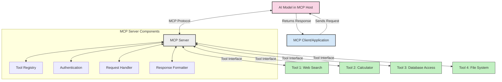
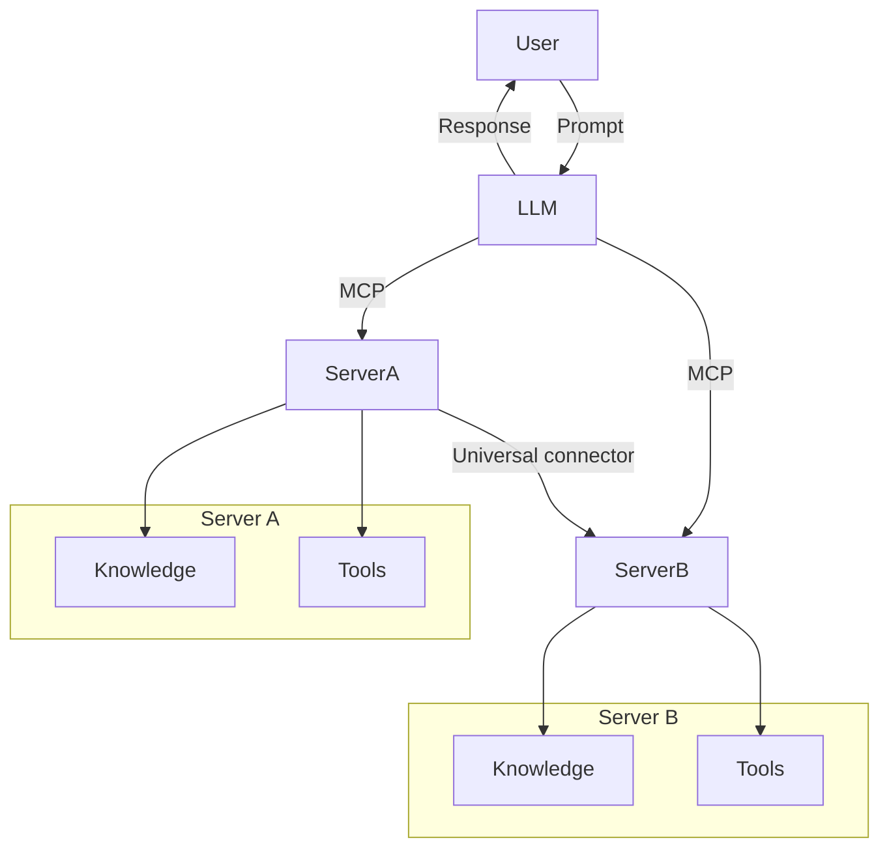

<!--
CO_OP_TRANSLATOR_METADATA:
{
  "original_hash": "cf84f987e1b771d2201408e110dfd2db",
  "translation_date": "2025-05-20T16:55:34+00:00",
  "source_file": "00-Introduction/README.md",
  "language_code": "pl"
}
-->
# Wprowadzenie do Model Context Protocol (MCP): Dlaczego ma znaczenie dla skalowalnych aplikacji AI

Aplikacje generatywnej AI to duży krok naprzód, ponieważ często pozwalają użytkownikowi na interakcję z aplikacją za pomocą naturalnych poleceń językowych. Jednak wraz z inwestowaniem większej ilości czasu i zasobów w takie aplikacje, warto upewnić się, że można łatwo integrować funkcjonalności i zasoby w sposób umożliwiający ich rozbudowę, obsługę więcej niż jednego modelu oraz zarządzanie ich złożonością. Krótko mówiąc, budowanie aplikacji Gen AI jest na początku proste, ale w miarę rozwoju i wzrostu złożoności trzeba zacząć definiować architekturę i najprawdopodobniej oprzeć się na standardzie, aby mieć pewność, że aplikacje są tworzone w spójny sposób. Tu właśnie wkracza MCP, aby uporządkować sprawy i zapewnić standard.

---

## **🔍 Czym jest Model Context Protocol (MCP)?**

**Model Context Protocol (MCP)** to **otwarty, ustandaryzowany interfejs**, który pozwala dużym modelom językowym (LLM) na płynną współpracę z zewnętrznymi narzędziami, API i źródłami danych. Zapewnia spójną architekturę, która rozszerza funkcjonalność modeli AI poza dane treningowe, umożliwiając tworzenie inteligentniejszych, skalowalnych i bardziej responsywnych systemów AI.

---

## **🎯 Dlaczego standaryzacja w AI jest ważna**

W miarę jak aplikacje generatywnej AI stają się coraz bardziej złożone, kluczowe jest przyjęcie standardów zapewniających **skalowalność, rozszerzalność** i **łatwość utrzymania**. MCP odpowiada na te potrzeby poprzez:

- Ujednolicenie integracji modeli z narzędziami
- Ograniczenie kruchych, jednorazowych rozwiązań niestandardowych
- Umożliwienie współistnienia wielu modeli w jednym ekosystemie

---

## **📚 Cele nauki**

Po przeczytaniu tego artykułu będziesz potrafił:

- Zdefiniować **Model Context Protocol (MCP)** i jego zastosowania
- Zrozumieć, jak MCP standaryzuje komunikację model-narzędzie
- Wskazać kluczowe elementy architektury MCP
- Poznać przykłady zastosowań MCP w kontekście biznesowym i deweloperskim

---

## **💡 Dlaczego Model Context Protocol (MCP) to przełom**

### **🔗 MCP rozwiązuje problem fragmentacji w interakcjach AI**

Przed MCP integracja modeli z narzędziami wymagała:

- Dedykowanego kodu dla każdej pary narzędzie-model
- Niestandardowych API dla każdego dostawcy
- Częstych przerw spowodowanych aktualizacjami
- Słabej skalowalności wraz ze wzrostem liczby narzędzi

### **✅ Korzyści ze standaryzacji MCP**

| **Korzyść**             | **Opis**                                                                 |
|-------------------------|---------------------------------------------------------------------------|
| Interoperacyjność       | LLM działają bezproblemowo z narzędziami różnych dostawców                |
| Spójność                | Jednolite zachowanie na różnych platformach i narzędziach                 |
| Ponowne użycie          | Narzędzia stworzone raz mogą być wykorzystywane w różnych projektach      |
| Przyspieszenie rozwoju  | Skrócenie czasu tworzenia dzięki ustandaryzowanym, plug-and-play interfejsom |

---

## **🧱 Przegląd architektury MCP na wysokim poziomie**

MCP opiera się na **modelu klient-serwer**, gdzie:

- **MCP Hosts** uruchamiają modele AI
- **MCP Clients** inicjują żądania
- **MCP Servers** dostarczają kontekst, narzędzia i możliwości

### **Kluczowe elementy:**

- **Resources** – statyczne lub dynamiczne dane dla modeli  
- **Prompts** – zdefiniowane wcześniej przepływy do sterowanego generowania  
- **Tools** – wykonywalne funkcje, takie jak wyszukiwanie, obliczenia  
- **Sampling** – zachowanie agentowe poprzez rekurencyjne interakcje

---

## Jak działają MCP Servers

Serwery MCP działają w następujący sposób:

- **Przepływ żądań**:  
    1. MCP Client wysyła żądanie do modelu AI uruchomionego na MCP Host.  
    2. Model AI rozpoznaje moment, kiedy potrzebuje zewnętrznych narzędzi lub danych.  
    3. Model komunikuje się z MCP Server używając ustandaryzowanego protokołu.

- **Funkcjonalność MCP Servera**:  
    - Rejestr narzędzi: utrzymuje katalog dostępnych narzędzi i ich możliwości.  
    - Uwierzytelnianie: weryfikuje uprawnienia do korzystania z narzędzi.  
    - Obsługa żądań: przetwarza przychodzące żądania narzędzi od modelu.  
    - Formatowanie odpowiedzi: strukturyzuje wyniki narzędzi w formacie zrozumiałym dla modelu.

- **Wykonanie narzędzi**:  
    - Serwer kieruje żądania do odpowiednich zewnętrznych narzędzi  
    - Narzędzia wykonują swoje specjalistyczne funkcje (wyszukiwanie, obliczenia, zapytania do baz danych itp.)  
    - Wyniki są zwracane do modelu w spójnym formacie.

- **Zakończenie odpowiedzi**:  
    - Model AI włącza wyniki narzędzi do swojej odpowiedzi.  
    - Końcowa odpowiedź jest przesyłana z powrotem do aplikacji-klienta.

## 👨‍💻 Jak zbudować MCP Server (z przykładami)

Serwery MCP pozwalają rozszerzyć możliwości LLM, dostarczając dane i funkcjonalności.

Chcesz spróbować? Oto przykłady tworzenia prostego MCP servera w różnych językach:

- **Przykład Python**: https://github.com/modelcontextprotocol/python-sdk

- **Przykład TypeScript**: https://github.com/modelcontextprotocol/typescript-sdk

- **Przykład Java**: https://github.com/modelcontextprotocol/java-sdk

- **Przykład C#/.NET**: https://github.com/modelcontextprotocol/csharp-sdk

## 🌍 Przykłady zastosowań MCP w praktyce

MCP umożliwia szeroki zakres zastosowań, rozszerzając możliwości AI:

| **Zastosowanie**            | **Opis**                                                                   |
|-----------------------------|---------------------------------------------------------------------------|
| Integracja danych w przedsiębiorstwach | Łączenie LLM z bazami danych, CRM lub narzędziami wewnętrznymi      |
| Systemy agentowe AI          | Umożliwienie autonomicznym agentom dostępu do narzędzi i procesów decyzyjnych |
| Aplikacje multimodalne       | Łączenie narzędzi tekstowych, obrazowych i dźwiękowych w jednej aplikacji AI |
| Integracja danych w czasie rzeczywistym | Dostarczanie na żywo danych do interakcji AI dla dokładniejszych, aktualnych wyników |

### 🧠 MCP = Uniwersalny standard dla interakcji AI

Model Context Protocol (MCP) działa jako uniwersalny standard dla interakcji AI, podobnie jak USB-C ustandaryzował fizyczne połączenia urządzeń. W świecie AI MCP zapewnia spójny interfejs, pozwalając modelom (klientom) na płynną integrację z zewnętrznymi narzędziami i dostawcami danych (serwerami). Eliminuje to potrzebę stosowania różnorodnych, niestandardowych protokołów dla każdego API czy źródła danych.

W ramach MCP narzędzie zgodne z MCP (zwane MCP serverem) działa według jednolitego standardu. Serwery te mogą udostępniać listę oferowanych narzędzi lub akcji i wykonywać je na żądanie agenta AI. Platformy agentów AI wspierające MCP potrafią wykrywać dostępne narzędzia na serwerach i wywoływać je poprzez ten standardowy protokół.

### 💡 Ułatwia dostęp do wiedzy

Poza udostępnianiem narzędzi, MCP ułatwia dostęp do wiedzy. Pozwala aplikacjom dostarczać kontekst dużym modelom językowym (LLM) poprzez łączenie ich z różnymi źródłami danych. Na przykład MCP server może reprezentować repozytorium dokumentów firmy, umożliwiając agentom pobieranie potrzebnych informacji na żądanie. Inny serwer może obsługiwać konkretne działania, jak wysyłanie maili czy aktualizacja rekordów. Z perspektywy agenta to po prostu narzędzia – jedne zwracają dane (kontekst wiedzy), inne wykonują akcje. MCP sprawnie zarządza oboma typami.

Agent łączący się z MCP serverem automatycznie poznaje dostępne możliwości i dane serwera dzięki ustandaryzowanemu formatowi. Ta standaryzacja pozwala na dynamiczną dostępność narzędzi. Na przykład dodanie nowego MCP servera do systemu agenta sprawia, że jego funkcje są natychmiast dostępne, bez konieczności dalszej personalizacji instrukcji agenta.

Ta uproszczona integracja odpowiada schematowi przedstawionemu na diagramie mermaid, gdzie serwery dostarczają zarówno narzędzia, jak i wiedzę, zapewniając płynną współpracę między systemami.

### 👉 Przykład: Skalowalne rozwiązanie agentowe

## 🔐 Praktyczne korzyści z MCP

Oto praktyczne korzyści wynikające z używania MCP:

- **Aktualność**: Modele mogą korzystać z najświeższych informacji poza danymi treningowymi  
- **Rozszerzenie możliwości**: Modele mogą wykorzystywać specjalistyczne narzędzia do zadań, do których nie były trenowane  
- **Zmniejszenie halucynacji**: Zewnętrzne źródła danych dostarczają faktograficznej podstawy  
- **Prywatność**: Wrażliwe dane mogą pozostawać w bezpiecznym środowisku, zamiast być osadzane w promptach

## 📌 Kluczowe wnioski

Najważniejsze punkty dotyczące MCP:

- **MCP** standaryzuje sposób, w jaki modele AI komunikują się z narzędziami i danymi  
- Promuje **rozszerzalność, spójność i interoperacyjność**  
- MCP pomaga **skrócić czas tworzenia, zwiększyć niezawodność i rozszerzyć możliwości modeli**  
- Architektura klient-serwer **umożliwia elastyczne, rozbudowywalne aplikacje AI**

## 🧠 Ćwiczenie

Pomyśl o aplikacji AI, którą chciałbyś stworzyć.

- Jakie **zewnętrzne narzędzia lub dane** mogłyby rozszerzyć jej możliwości?  
- W jaki sposób MCP może uczynić integrację **prostszą i bardziej niezawodną**?

## Dodatkowe zasoby

- [MCP GitHub Repository](https://github.com/modelcontextprotocol)

## Co dalej

Następny rozdział: [Chapter 1: Core Concepts](/01-CoreConcepts/README.md)

**Zastrzeżenie**:  
Niniejszy dokument został przetłumaczony przy użyciu automatycznej usługi tłumaczeniowej AI [Co-op Translator](https://github.com/Azure/co-op-translator). Mimo że dokładamy starań, aby tłumaczenie było jak najbardziej precyzyjne, prosimy mieć na uwadze, że automatyczne tłumaczenia mogą zawierać błędy lub nieścisłości. Oryginalny dokument w języku źródłowym powinien być uznawany za źródło wiarygodne. W przypadku informacji o kluczowym znaczeniu zaleca się skorzystanie z profesjonalnego tłumaczenia wykonanego przez człowieka. Nie ponosimy odpowiedzialności za jakiekolwiek nieporozumienia lub błędne interpretacje wynikające z korzystania z tego tłumaczenia.