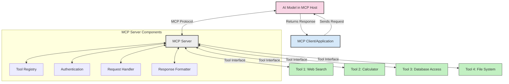
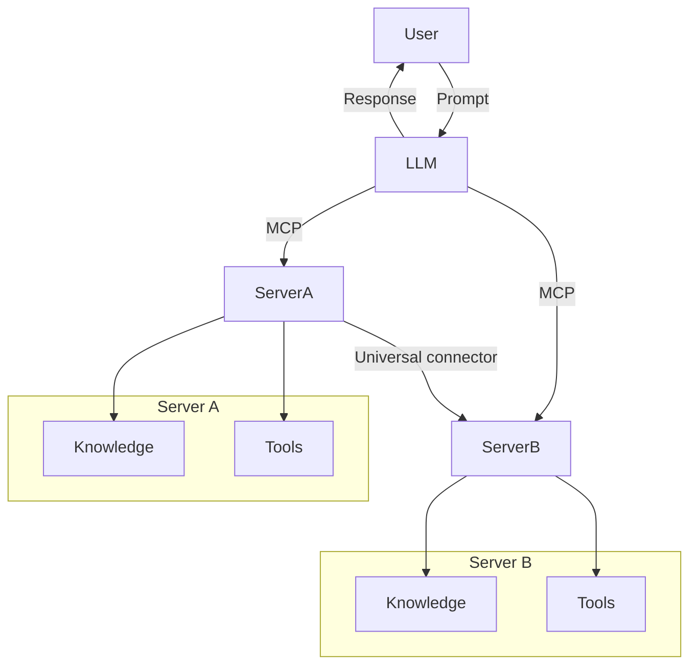

<!--
CO_OP_TRANSLATOR_METADATA:
{
  "original_hash": "1d88dee994dcbb3fa52c271d0c0817b5",
  "translation_date": "2025-05-20T21:22:11+00:00",
  "source_file": "00-Introduction/README.md",
  "language_code": "pl"
}
-->
# Wprowadzenie do Model Context Protocol (MCP): Dlaczego ma znaczenie dla skalowalnych aplikacji AI

Aplikacje generatywnej sztucznej inteligencji to duży krok naprzód, ponieważ często pozwalają użytkownikowi na interakcję z aplikacją za pomocą naturalnych poleceń językowych. Jednak wraz z inwestowaniem większej ilości czasu i zasobów w takie aplikacje, chcesz mieć pewność, że łatwo zintegrujesz funkcjonalności i zasoby w sposób umożliwiający rozbudowę, obsługę więcej niż jednego modelu oraz radzenie sobie z różnymi niuansami modeli. Krótko mówiąc, tworzenie aplikacji Gen AI jest na początku proste, ale w miarę ich rozwoju i zwiększania złożoności, trzeba zacząć definiować architekturę i prawdopodobnie polegać na standardzie, który zapewni spójność budowanych aplikacji. Tu właśnie wkracza MCP, aby uporządkować sprawy i dostarczyć standard.

---

## **🔍 Czym jest Model Context Protocol (MCP)?**

**Model Context Protocol (MCP)** to **otwarty, ustandaryzowany interfejs**, który pozwala dużym modelom językowym (LLM) na płynną współpracę z zewnętrznymi narzędziami, API i źródłami danych. Zapewnia spójną architekturę, która rozszerza funkcjonalność modeli AI poza dane, na których były trenowane, umożliwiając tworzenie inteligentniejszych, skalowalnych i bardziej responsywnych systemów AI.

---

## **🎯 Dlaczego standaryzacja w AI jest ważna**

W miarę jak aplikacje generatywnej AI stają się coraz bardziej złożone, kluczowe jest przyjęcie standardów, które zapewnią **skalowalność, rozszerzalność** i **łatwość utrzymania**. MCP odpowiada na te potrzeby poprzez:

- Ujednolicenie integracji modeli z narzędziami
- Ograniczenie kruchych, jednorazowych rozwiązań niestandardowych
- Umożliwienie współistnienia wielu modeli w jednym ekosystemie

---

## **📚 Cele nauki**

Po przeczytaniu tego artykułu będziesz potrafił:

- Zdefiniować **Model Context Protocol (MCP)** i jego zastosowania
- Zrozumieć, jak MCP ustandaryzował komunikację między modelem a narzędziami
- Wskazać kluczowe elementy architektury MCP
- Poznać praktyczne zastosowania MCP w środowiskach korporacyjnych i deweloperskich

---

## **💡 Dlaczego Model Context Protocol (MCP) to przełom**

### **🔗 MCP rozwiązuje problem fragmentacji w interakcjach AI**

Przed MCP integracja modeli z narzędziami wymagała:

- Niestandardowego kodu dla każdej pary narzędzie-model
- Niestandardowych API dla każdego dostawcy
- Częstych przerw spowodowanych aktualizacjami
- Słabej skalowalności przy rosnącej liczbie narzędzi

### **✅ Korzyści ze standaryzacji MCP**

| **Korzyść**              | **Opis**                                                                        |
|--------------------------|---------------------------------------------------------------------------------|
| Interoperacyjność        | LLM współpracują bezproblemowo z narzędziami różnych dostawców                 |
| Spójność                 | Jednolite zachowanie na różnych platformach i narzędziach                      |
| Ponowne użycie           | Narzędzia stworzone raz mogą być wykorzystywane w wielu projektach i systemach  |
| Przyspieszenie rozwoju   | Skrócenie czasu tworzenia dzięki ustandaryzowanym, plug-and-play interfejsom   |

---

## **🧱 Ogólny przegląd architektury MCP**

MCP opiera się na **modelu klient-serwer**, gdzie:

- **MCP Hosts** uruchamiają modele AI
- **MCP Clients** inicjują żądania
- **MCP Servers** dostarczają kontekst, narzędzia i możliwości

### **Kluczowe komponenty:**

- **Resources** – statyczne lub dynamiczne dane dla modeli  
- **Prompts** – zdefiniowane wcześniej scenariusze do sterowanej generacji  
- **Tools** – wykonywalne funkcje, takie jak wyszukiwanie, obliczenia  
- **Sampling** – zachowanie agentów poprzez rekurencyjne interakcje

---

## Jak działają serwery MCP

Serwery MCP działają w następujący sposób:

- **Przepływ żądań**:  
    1. MCP Client wysyła żądanie do modelu AI działającego na MCP Host.  
    2. Model AI rozpoznaje, kiedy potrzebuje zewnętrznych narzędzi lub danych.  
    3. Model komunikuje się z MCP Server za pomocą ustandaryzowanego protokołu.

- **Funkcjonalności MCP Server**:  
    - Rejestr narzędzi: utrzymuje katalog dostępnych narzędzi i ich możliwości.  
    - Autoryzacja: weryfikuje uprawnienia do dostępu do narzędzi.  
    - Obsługa żądań: przetwarza przychodzące zapytania o narzędzia od modelu.  
    - Formatowanie odpowiedzi: strukturyzuje wyniki narzędzi w formacie zrozumiałym dla modelu.

- **Wykonanie narzędzi**:  
    - Serwer kieruje żądania do odpowiednich zewnętrznych narzędzi.  
    - Narzędzia wykonują swoje specjalistyczne funkcje (wyszukiwanie, obliczenia, zapytania do baz danych itp.)  
    - Wyniki są zwracane do modelu w spójnym formacie.

- **Zakończenie odpowiedzi**:  
    - Model AI włącza wyniki narzędzi do swojej odpowiedzi.  
    - Końcowa odpowiedź jest wysyłana z powrotem do aplikacji klienckiej.

## 👨‍💻 Jak zbudować serwer MCP (z przykładami)

Serwery MCP pozwalają rozszerzać możliwości LLM, dostarczając dane i funkcjonalności.

Chcesz spróbować? Oto przykłady tworzenia prostego serwera MCP w różnych językach:

- **Przykład w Pythonie**: https://github.com/modelcontextprotocol/python-sdk

- **Przykład w TypeScript**: https://github.com/modelcontextprotocol/typescript-sdk

- **Przykład w Javie**: https://github.com/modelcontextprotocol/java-sdk

- **Przykład w C#/.NET**: https://github.com/modelcontextprotocol/csharp-sdk

## 🌍 Przykłady zastosowań MCP w praktyce

MCP umożliwia szerokie zastosowania, rozszerzając możliwości AI:

| **Zastosowanie**            | **Opis**                                                                        |
|----------------------------|---------------------------------------------------------------------------------|
| Integracja danych w przedsiębiorstwie | Łączenie LLM z bazami danych, CRM lub narzędziami wewnętrznymi          |
| Agentowe systemy AI         | Umożliwienie autonomicznym agentom dostępu do narzędzi i procesów decyzyjnych  |
| Aplikacje multimodalne      | Łączenie narzędzi tekstowych, obrazowych i audio w jednej zunifikowanej aplikacji AI |
| Integracja danych w czasie rzeczywistym | Dostarczanie aktualnych danych do interakcji AI dla dokładniejszych wyników |

### 🧠 MCP = Uniwersalny standard dla interakcji AI

Model Context Protocol (MCP) działa jak uniwersalny standard dla interakcji AI, podobnie jak USB-C ustandaryzował fizyczne połączenia urządzeń. W świecie AI MCP zapewnia spójny interfejs, pozwalając modelom (klientom) na płynną integrację z zewnętrznymi narzędziami i dostawcami danych (serwerami). Eliminuje to potrzebę stosowania różnych, niestandardowych protokołów dla każdego API czy źródła danych.

W ramach MCP narzędzie kompatybilne z MCP (zwane MCP serverem) przestrzega jednolitego standardu. Serwery te mogą wymieniać listę oferowanych narzędzi lub działań oraz wykonywać je na żądanie agenta AI. Platformy agentowe wspierające MCP mogą odkrywać dostępne narzędzia na serwerach i wywoływać je za pomocą tego standardowego protokołu.

### 💡 Ułatwia dostęp do wiedzy

Poza udostępnianiem narzędzi, MCP ułatwia także dostęp do wiedzy. Pozwala aplikacjom dostarczać kontekst dużym modelom językowym (LLM) poprzez łączenie ich z różnymi źródłami danych. Na przykład serwer MCP może reprezentować repozytorium dokumentów firmy, umożliwiając agentom pobieranie odpowiednich informacji na żądanie. Inny serwer może obsługiwać konkretne akcje, takie jak wysyłanie e-maili czy aktualizowanie rekordów. Z perspektywy agenta są to po prostu narzędzia — niektóre zwracają dane (kontekst wiedzy), inne wykonują działania. MCP efektywnie zarządza oboma typami.

Agent łączący się z serwerem MCP automatycznie poznaje dostępne możliwości serwera i dostępne dane dzięki standardowemu formatowi. Ta standaryzacja umożliwia dynamiczną dostępność narzędzi. Na przykład dodanie nowego serwera MCP do systemu agenta sprawia, że jego funkcje są od razu dostępne bez konieczności dalszej personalizacji instrukcji agenta.

Tak uproszczona integracja odpowiada schematowi przedstawionemu na diagramie mermaid, gdzie serwery dostarczają zarówno narzędzia, jak i wiedzę, zapewniając płynną współpracę między systemami.

### 👉 Przykład: Skalowalne rozwiązanie agenta

## 🔐 Praktyczne korzyści MCP

Oto praktyczne zalety stosowania MCP:

- **Aktualność**: Modele mają dostęp do najświeższych informacji wykraczających poza dane treningowe  
- **Rozszerzenie możliwości**: Modele mogą korzystać ze specjalistycznych narzędzi do zadań, do których nie były trenowane  
- **Zmniejszenie halucynacji**: Zewnętrzne źródła danych dostarczają oparcia faktograficznego  
- **Prywatność**: Wrażliwe dane mogą pozostać w bezpiecznych środowiskach zamiast być osadzane w promptach

## 📌 Najważniejsze wnioski

Kluczowe punkty dotyczące MCP:

- **MCP** ustandaryzował sposób, w jaki modele AI współpracują z narzędziami i danymi  
- Promuje **rozszerzalność, spójność i interoperacyjność**  
- MCP pomaga **skrócić czas rozwoju, zwiększyć niezawodność i rozszerzyć możliwości modeli**  
- Architektura klient-serwer **umożliwia tworzenie elastycznych, rozszerzalnych aplikacji AI**

## 🧠 Ćwiczenie

Pomyśl o aplikacji AI, którą chciałbyś stworzyć.

- Jakie **zewnętrzne narzędzia lub dane** mogłyby zwiększyć jej możliwości?  
- W jaki sposób MCP może uczynić integrację **prostszą i bardziej niezawodną**?

## Dodatkowe zasoby

- [MCP GitHub Repository](https://github.com/modelcontextprotocol)

## Co dalej

Dalej: [Chapter 1: Core Concepts](/01-CoreConcepts/README.md)

**Zastrzeżenie**:  
Niniejszy dokument został przetłumaczony za pomocą usługi tłumaczenia AI [Co-op Translator](https://github.com/Azure/co-op-translator). Mimo że dokładamy starań, aby tłumaczenie było jak najdokładniejsze, prosimy pamiętać, że automatyczne tłumaczenia mogą zawierać błędy lub nieścisłości. Oryginalny dokument w języku źródłowym należy traktować jako wiarygodne źródło informacji. W przypadku istotnych informacji zalecane jest skorzystanie z profesjonalnego tłumaczenia wykonanego przez człowieka. Nie ponosimy odpowiedzialności za jakiekolwiek nieporozumienia lub błędne interpretacje wynikające z korzystania z tego tłumaczenia.