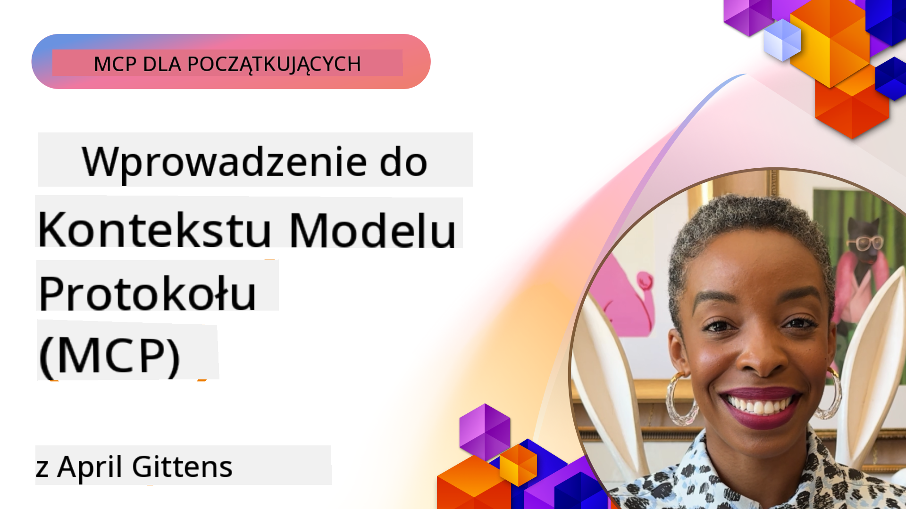
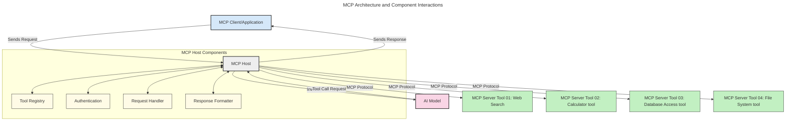
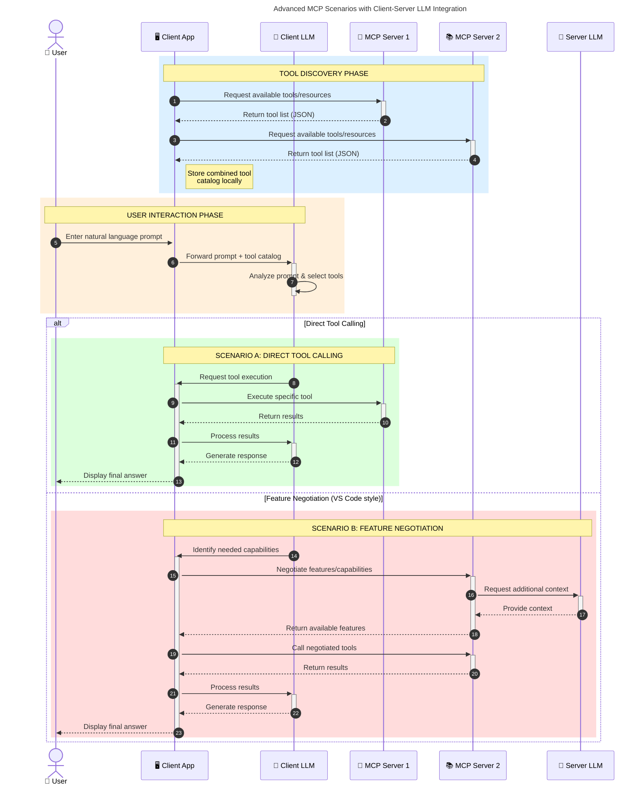

<!--
CO_OP_TRANSLATOR_METADATA:
{
  "original_hash": "0df1ee78a6dd8300f3a040ca5b411c2e",
  "translation_date": "2025-08-12T08:14:00+00:00",
  "source_file": "00-Introduction/README.md",
  "language_code": "pl"
}
-->
# Wprowadzenie do Model Context Protocol (MCP): Dlaczego jest ważny dla skalowalnych aplikacji AI

_(Kliknij obrazek powyżej, aby obejrzeć wideo z tej lekcji)_

Generatywne aplikacje AI to ogromny krok naprzód, ponieważ często pozwalają użytkownikowi na interakcję z aplikacją za pomocą naturalnych językowych poleceń. Jednakże, gdy inwestujesz więcej czasu i zasobów w takie aplikacje, chcesz mieć pewność, że możesz łatwo integrować funkcjonalności i zasoby w sposób umożliwiający ich łatwe rozszerzanie, obsługę więcej niż jednego modelu oraz zarządzanie różnymi niuansami modeli. Krótko mówiąc, budowanie aplikacji Gen AI jest łatwe na początku, ale w miarę ich rozwoju i wzrostu złożoności, konieczne staje się zdefiniowanie architektury, a prawdopodobnie także oparcie się na standardzie, aby zapewnić spójność budowy aplikacji. W tym miejscu pojawia się MCP, które organizuje procesy i dostarcza standard.

---

## **🔍 Czym jest Model Context Protocol (MCP)?**

**Model Context Protocol (MCP)** to **otwarty, ustandaryzowany interfejs**, który umożliwia bezproblemową interakcję dużych modeli językowych (LLM) z zewnętrznymi narzędziami, API i źródłami danych. Zapewnia spójną architekturę, która rozszerza funkcjonalność modeli AI poza ich dane treningowe, umożliwiając tworzenie inteligentniejszych, skalowalnych i bardziej responsywnych systemów AI.

---

## **🎯 Dlaczego standaryzacja w AI jest ważna**

W miarę jak aplikacje generatywne AI stają się coraz bardziej złożone, kluczowe jest przyjęcie standardów, które zapewnią **skalowalność, rozszerzalność, łatwość utrzymania** oraz **uniknięcie uzależnienia od jednego dostawcy**. MCP odpowiada na te potrzeby poprzez:

- Ujednolicenie integracji modeli z narzędziami
- Redukcję kruchych, jednorazowych rozwiązań
- Umożliwienie współistnienia wielu modeli od różnych dostawców w jednym ekosystemie

**Note:** Chociaż MCP przedstawia się jako otwarty standard, nie ma planów jego standaryzacji przez istniejące organizacje, takie jak IEEE, IETF, W3C, ISO czy inne.

---

## **📚 Cele nauki**

Po przeczytaniu tego artykułu będziesz w stanie:

- Zdefiniować **Model Context Protocol (MCP)** i jego przypadki użycia
- Zrozumieć, jak MCP standaryzuje komunikację między modelami a narzędziami
- Zidentyfikować kluczowe komponenty architektury MCP
- Zbadać rzeczywiste zastosowania MCP w kontekstach biznesowych i deweloperskich

---

## **💡 Dlaczego Model Context Protocol (MCP) to przełom**

### **🔗 MCP rozwiązuje problem fragmentacji w interakcjach AI**

Przed MCP integracja modeli z narzędziami wymagała:

- Pisania niestandardowego kodu dla każdej pary narzędzie-model
- Korzystania z niestandardowych API dla każdego dostawcy
- Częstych awarii spowodowanych aktualizacjami
- Słabej skalowalności przy dodawaniu kolejnych narzędzi

### **✅ Korzyści ze standaryzacji MCP**

| **Korzyść**               | **Opis**                                                                       |
|---------------------------|-------------------------------------------------------------------------------|
| Interoperacyjność         | LLM współpracują bezproblemowo z narzędziami różnych dostawców                |
| Spójność                  | Jednolite zachowanie na różnych platformach i narzędziach                    |
| Reużywalność              | Narzędzia stworzone raz mogą być używane w różnych projektach i systemach     |
| Przyspieszenie rozwoju    | Skrócenie czasu tworzenia dzięki standaryzowanym, gotowym interfejsom         |

---

## **🧱 Przegląd architektury MCP na wysokim poziomie**

MCP opiera się na modelu **klient-serwer**, gdzie:

- **Hosty MCP** uruchamiają modele AI
- **Klienci MCP** inicjują żądania
- **Serwery MCP** dostarczają kontekst, narzędzia i możliwości

### **Kluczowe komponenty:**

- **Zasoby** – Statyczne lub dynamiczne dane dla modeli  
- **Prompty** – Zdefiniowane wcześniej przepływy pracy dla ukierunkowanego generowania  
- **Narzędzia** – Wykonywalne funkcje, takie jak wyszukiwanie, obliczenia  
- **Sampling** – Zachowanie agentów poprzez rekurencyjne interakcje  

---

## Jak działają serwery MCP

Serwery MCP działają w następujący sposób:

- **Przepływ żądania**:
    1. Żądanie jest inicjowane przez użytkownika końcowego lub oprogramowanie działające w jego imieniu.
    2. **Klient MCP** wysyła żądanie do **Hosta MCP**, który zarządza środowiskiem uruchomieniowym modelu AI.
    3. **Model AI** otrzymuje prompt użytkownika i może zażądać dostępu do zewnętrznych narzędzi lub danych za pomocą jednego lub więcej wywołań narzędzi.
    4. **Host MCP**, a nie sam model, komunikuje się z odpowiednim **Serwerem MCP** za pomocą ustandaryzowanego protokołu.
- **Funkcjonalność Hosta MCP**:
    - **Rejestr narzędzi**: Utrzymuje katalog dostępnych narzędzi i ich możliwości.
    - **Autoryzacja**: Weryfikuje uprawnienia do dostępu do narzędzi.
    - **Obsługa żądań**: Przetwarza przychodzące żądania narzędzi od modelu.
    - **Formatowanie odpowiedzi**: Strukturyzuje wyniki narzędzi w formacie zrozumiałym dla modelu.
- **Wykonanie na serwerze MCP**:
    - **Host MCP** kieruje wywołania narzędzi do jednego lub więcej **Serwerów MCP**, z których każdy udostępnia wyspecjalizowane funkcje (np. wyszukiwanie, obliczenia, zapytania do bazy danych).
    - **Serwery MCP** wykonują swoje operacje i zwracają wyniki do **Hosta MCP** w spójnym formacie.
    - **Host MCP** formatuje i przekazuje te wyniki do **Modelu AI**.
- **Zakończenie odpowiedzi**:
    - **Model AI** włącza wyniki narzędzi do ostatecznej odpowiedzi.
    - **Host MCP** wysyła tę odpowiedź z powrotem do **Klienta MCP**, który dostarcza ją użytkownikowi końcowemu lub wywołującemu oprogramowaniu.

## 👨‍💻 Jak zbudować serwer MCP (z przykładami)

Serwery MCP pozwalają na rozszerzenie możliwości LLM poprzez dostarczanie danych i funkcjonalności.

Gotowy, by spróbować? Oto SDK dla różnych języków/stosów z przykładami tworzenia prostych serwerów MCP:

- **Python SDK**: https://github.com/modelcontextprotocol/python-sdk

- **TypeScript SDK**: https://github.com/modelcontextprotocol/typescript-sdk

- **Java SDK**: https://github.com/modelcontextprotocol/java-sdk

- **C#/.NET SDK**: https://github.com/modelcontextprotocol/csharp-sdk

---

## 🌍 Przykłady zastosowań MCP w rzeczywistości

MCP umożliwia szeroki zakres zastosowań, rozszerzając możliwości AI:

| **Zastosowanie**           | **Opis**                                                                      |
|----------------------------|------------------------------------------------------------------------------|
| Integracja danych w firmie | Połączenie LLM z bazami danych, CRM lub wewnętrznymi narzędziami             |
| Systemy agentowe AI        | Umożliwienie autonomicznym agentom dostępu do narzędzi i przepływów decyzyjnych |
| Aplikacje multimodalne     | Łączenie tekstu, obrazów i dźwięku w jednej aplikacji AI                     |
| Integracja danych w czasie rzeczywistym | Wprowadzanie aktualnych danych do interakcji AI dla bardziej precyzyjnych wyników |

### 🧠 MCP = Uniwersalny standard dla interakcji AI

Model Context Protocol (MCP) działa jak uniwersalny standard dla interakcji AI, podobnie jak USB-C ustandaryzował fizyczne połączenia urządzeń. W świecie AI MCP zapewnia spójny interfejs, umożliwiając modelom (klientom) bezproblemową integrację z zewnętrznymi narzędziami i dostawcami danych (serwerami). Eliminuje to potrzebę tworzenia różnorodnych, niestandardowych protokołów dla każdego API czy źródła danych.

---

### 🔄 Zaawansowane scenariusze MCP z integracją LLM po stronie klienta

---

## 📌 Kluczowe wnioski

- **MCP** standaryzuje sposób, w jaki modele AI współpracują z narzędziami i danymi
- Promuje **rozszerzalność, spójność i interoperacyjność**
- MCP pomaga **skrócić czas rozwoju, poprawić niezawodność i rozszerzyć możliwości modeli**
- Architektura klient-serwer **umożliwia elastyczne, skalowalne aplikacje AI**

---

## 🧠 Ćwiczenie

Pomyśl o aplikacji AI, którą chciałbyś zbudować.

- Jakie **zewnętrzne narzędzia lub dane** mogłyby zwiększyć jej możliwości?
- W jaki sposób MCP może uprościć i uczynić integrację **bardziej niezawodną**?

---

## Dodatkowe zasoby

- [Repozytorium MCP na GitHubie](https://github.com/modelcontextprotocol)

---

## Co dalej

Następny krok: [Rozdział 1: Podstawowe pojęcia](../01-CoreConcepts/README.md)

**Zastrzeżenie**:  
Ten dokument został przetłumaczony za pomocą usługi tłumaczenia AI [Co-op Translator](https://github.com/Azure/co-op-translator). Chociaż dokładamy wszelkich starań, aby zapewnić poprawność tłumaczenia, prosimy pamiętać, że automatyczne tłumaczenia mogą zawierać błędy lub nieścisłości. Oryginalny dokument w jego rodzimym języku powinien być uznawany za autorytatywne źródło. W przypadku informacji o kluczowym znaczeniu zaleca się skorzystanie z profesjonalnego tłumaczenia przez człowieka. Nie ponosimy odpowiedzialności za jakiekolwiek nieporozumienia lub błędne interpretacje wynikające z użycia tego tłumaczenia.