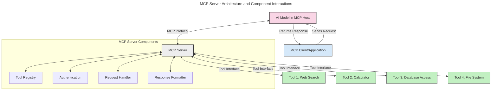
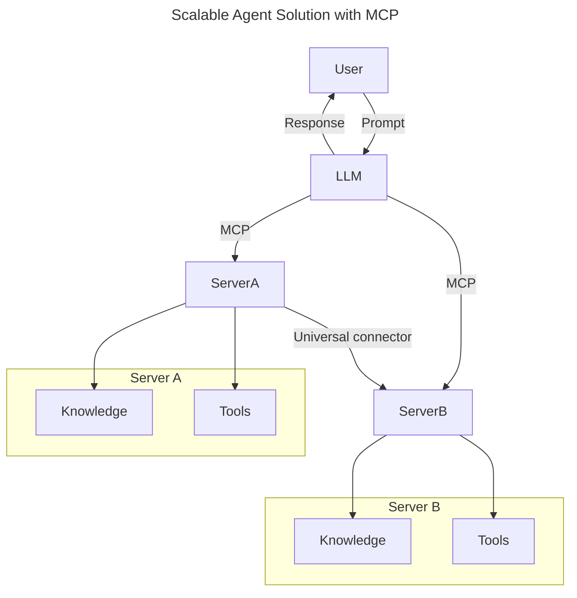
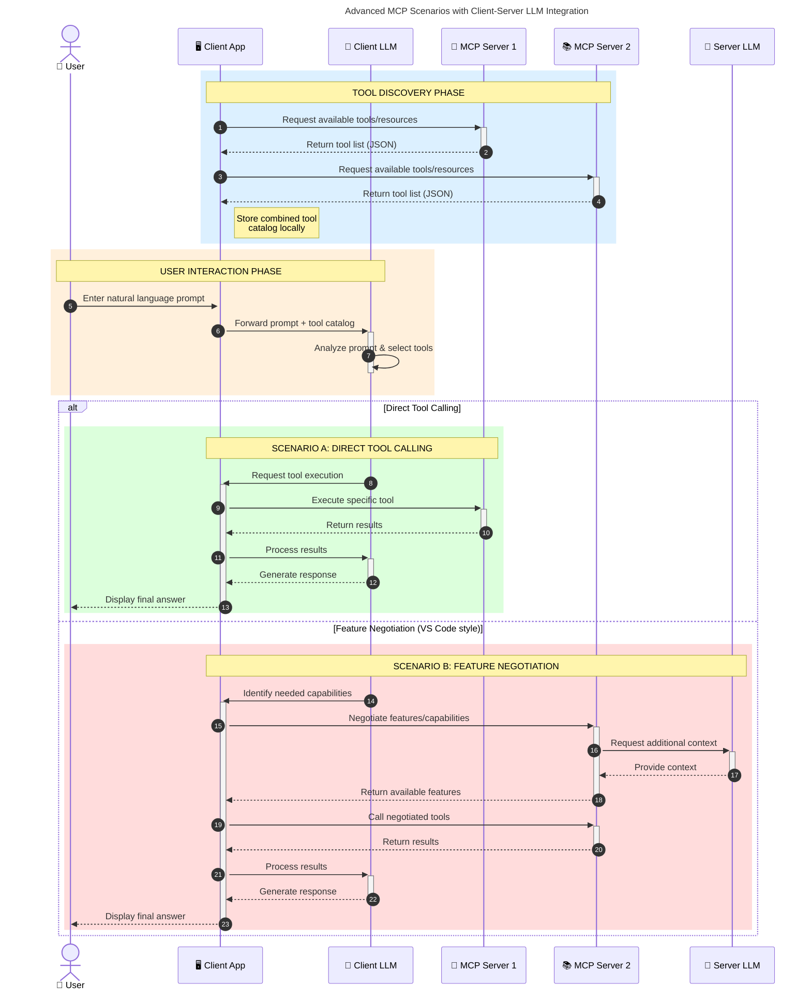

<!--
CO_OP_TRANSLATOR_METADATA:
{
  "original_hash": "2bbbcded256d46a24e3f448384a2b4a2",
  "translation_date": "2025-07-29T01:30:04+00:00",
  "source_file": "00-Introduction/README.md",
  "language_code": "pl"
}
-->
# Wprowadzenie do Model Context Protocol (MCP): Dlaczego jest ważny dla skalowalnych aplikacji AI

_(Kliknij obrazek powyżej, aby obejrzeć wideo z tej lekcji)_

Aplikacje generatywnej AI to ogromny krok naprzód, ponieważ często pozwalają użytkownikowi na interakcję z aplikacją za pomocą naturalnych poleceń językowych. Jednak wraz z rosnącymi inwestycjami czasu i zasobów w takie aplikacje, warto upewnić się, że można łatwo integrować funkcjonalności i zasoby w sposób umożliwiający ich łatwe rozszerzanie, obsługę więcej niż jednego modelu oraz radzenie sobie z różnymi niuansami modeli. Krótko mówiąc, budowanie aplikacji Gen AI jest łatwe na początku, ale w miarę ich rozwoju i zwiększania złożoności, konieczne staje się zdefiniowanie architektury i prawdopodobnie oparcie się na standardzie, aby zapewnić spójność budowy aplikacji. W tym miejscu pojawia się MCP, które organizuje procesy i dostarcza standard.

---

## **🔍 Czym jest Model Context Protocol (MCP)?**

**Model Context Protocol (MCP)** to **otwarty, standaryzowany interfejs**, który umożliwia płynną interakcję dużych modeli językowych (LLM) z zewnętrznymi narzędziami, API i źródłami danych. Zapewnia spójną architekturę, która rozszerza funkcjonalność modeli AI poza ich dane treningowe, umożliwiając tworzenie inteligentniejszych, skalowalnych i bardziej responsywnych systemów AI.

---

## **🎯 Dlaczego standaryzacja w AI jest ważna**

W miarę jak aplikacje generatywnej AI stają się coraz bardziej złożone, kluczowe jest przyjęcie standardów, które zapewnią **skalowalność, rozszerzalność** i **łatwość utrzymania**. MCP odpowiada na te potrzeby poprzez:

- Ujednolicenie integracji modeli z narzędziami
- Redukcję kruchych, jednorazowych rozwiązań
- Umożliwienie współistnienia wielu modeli w jednym ekosystemie

---

## **📚 Cele nauki**

Po przeczytaniu tego artykułu będziesz w stanie:

- Zdefiniować **Model Context Protocol (MCP)** i jego zastosowania
- Zrozumieć, jak MCP standaryzuje komunikację między modelami a narzędziami
- Zidentyfikować kluczowe elementy architektury MCP
- Poznać rzeczywiste zastosowania MCP w kontekstach biznesowych i deweloperskich

---

## **💡 Dlaczego Model Context Protocol (MCP) zmienia zasady gry**

### **🔗 MCP rozwiązuje problem fragmentacji w interakcjach AI**

Przed MCP integracja modeli z narzędziami wymagała:

- Pisania niestandardowego kodu dla każdej pary narzędzie-model
- Korzystania z niestandardowych API od różnych dostawców
- Częstych awarii spowodowanych aktualizacjami
- Słabej skalowalności przy dodawaniu kolejnych narzędzi

### **✅ Korzyści ze standaryzacji MCP**

| **Korzyść**               | **Opis**                                                                       |
|---------------------------|-------------------------------------------------------------------------------|
| Interoperacyjność         | LLM współpracują płynnie z narzędziami od różnych dostawców                   |
| Spójność                  | Jednolite zachowanie na różnych platformach i narzędziach                    |
| Reużywalność              | Narzędzia stworzone raz mogą być używane w różnych projektach i systemach     |
| Przyspieszenie rozwoju    | Skrócenie czasu tworzenia dzięki standaryzowanym, gotowym interfejsom         |

---

## **🧱 Przegląd architektury MCP na wysokim poziomie**

MCP opiera się na **modelu klient-serwer**, gdzie:

- **Hosty MCP** uruchamiają modele AI
- **Klienci MCP** inicjują żądania
- **Serwery MCP** dostarczają kontekst, narzędzia i funkcje

### **Kluczowe elementy:**

- **Zasoby** – Statyczne lub dynamiczne dane dla modeli  
- **Prompty** – Zdefiniowane wcześniej przepływy pracy dla ukierunkowanego generowania  
- **Narzędzia** – Wykonywalne funkcje, takie jak wyszukiwanie, obliczenia  
- **Sampling** – Zachowanie agentów poprzez rekurencyjne interakcje  

---

## Jak działają serwery MCP

Serwery MCP działają w następujący sposób:

- **Przepływ żądań**:  
    1. Klient MCP wysyła żądanie do modelu AI uruchomionego w hoście MCP.  
    2. Model AI identyfikuje, kiedy potrzebuje zewnętrznych narzędzi lub danych.  
    3. Model komunikuje się z serwerem MCP za pomocą standaryzowanego protokołu.  

- **Funkcjonalność serwera MCP**:  
    - Rejestr narzędzi: Utrzymuje katalog dostępnych narzędzi i ich funkcji.  
    - Uwierzytelnianie: Weryfikuje uprawnienia do korzystania z narzędzi.  
    - Obsługa żądań: Przetwarza przychodzące żądania narzędzi od modelu.  
    - Formatowanie odpowiedzi: Strukturyzuje wyniki narzędzi w formacie zrozumiałym dla modelu.  

- **Wykonywanie narzędzi**:  
    - Serwer kieruje żądania do odpowiednich zewnętrznych narzędzi  
    - Narzędzia wykonują swoje specjalistyczne funkcje (wyszukiwanie, obliczenia, zapytania do bazy danych itp.)  
    - Wyniki są zwracane do modelu w spójnym formacie.  

- **Ukończenie odpowiedzi**:  
    - Model AI włącza wyniki narzędzi do swojej odpowiedzi.  
    - Ostateczna odpowiedź jest wysyłana z powrotem do aplikacji klienckiej.  

## 👨‍💻 Jak zbudować serwer MCP (z przykładami)

Serwery MCP pozwalają na rozszerzenie możliwości LLM poprzez dostarczanie danych i funkcji.  

Gotowy, by spróbować? Oto przykłady tworzenia prostego serwera MCP w różnych językach:

- **Przykład w Pythonie**: https://github.com/modelcontextprotocol/python-sdk  
- **Przykład w TypeScript**: https://github.com/modelcontextprotocol/typescript-sdk  
- **Przykład w Javie**: https://github.com/modelcontextprotocol/java-sdk  
- **Przykład w C#/.NET**: https://github.com/modelcontextprotocol/csharp-sdk  

---

## 🌍 Rzeczywiste zastosowania MCP

MCP umożliwia szeroki zakres zastosowań poprzez rozszerzenie możliwości AI:

| **Zastosowanie**            | **Opis**                                                                      |
|-----------------------------|------------------------------------------------------------------------------|
| Integracja danych w firmie  | Połączenie LLM z bazami danych, CRM lub wewnętrznymi narzędziami             |
| Systemy agentowe AI         | Umożliwienie autonomicznym agentom dostępu do narzędzi i przepływów decyzyjnych |
| Aplikacje multimodalne      | Łączenie tekstu, obrazów i dźwięku w jednej zintegrowanej aplikacji AI       |
| Integracja danych w czasie rzeczywistym | Wprowadzenie aktualnych danych do interakcji AI dla bardziej precyzyjnych wyników |

### 🧠 MCP = Uniwersalny standard dla interakcji AI

Model Context Protocol (MCP) działa jak uniwersalny standard dla interakcji AI, podobnie jak USB-C ujednolicił fizyczne połączenia urządzeń. W świecie AI MCP zapewnia spójny interfejs, umożliwiając modelom (klientom) płynną integrację z zewnętrznymi narzędziami i dostawcami danych (serwerami). Eliminuje to potrzebę tworzenia różnorodnych, niestandardowych protokołów dla każdego API lub źródła danych.

W ramach MCP narzędzie zgodne z MCP (nazywane serwerem MCP) przestrzega ujednoliconego standardu. Te serwery mogą wymieniać listę dostępnych narzędzi lub działań, które oferują, i wykonywać te działania na żądanie agenta AI. Platformy agentów AI obsługujące MCP są w stanie odkrywać dostępne narzędzia z serwerów i wywoływać je za pomocą tego standardowego protokołu.

### 💡 Ułatwia dostęp do wiedzy

Oprócz oferowania narzędzi MCP ułatwia również dostęp do wiedzy. Umożliwia aplikacjom dostarczanie kontekstu dużym modelom językowym (LLM) poprzez łączenie ich z różnymi źródłami danych. Na przykład serwer MCP może reprezentować repozytorium dokumentów firmy, umożliwiając agentom pobieranie odpowiednich informacji na żądanie. Inny serwer może obsługiwać konkretne działania, takie jak wysyłanie e-maili lub aktualizowanie rekordów. Z perspektywy agenta są to po prostu narzędzia, z których może korzystać—niektóre narzędzia zwracają dane (kontekst wiedzy), podczas gdy inne wykonują działania. MCP efektywnie zarządza obiema funkcjami.

Agent łączący się z serwerem MCP automatycznie dowiaduje się o dostępnych możliwościach i danych serwera w standardowym formacie. Ta standaryzacja umożliwia dynamiczną dostępność narzędzi. Na przykład dodanie nowego serwera MCP do systemu agenta sprawia, że jego funkcje stają się natychmiast dostępne bez konieczności dalszej personalizacji instrukcji agenta.

Ten usprawniony proces integracji jest zgodny z przepływem przedstawionym na diagramie mermaid, gdzie serwery dostarczają zarówno narzędzia, jak i wiedzę, zapewniając płynną współpracę między systemami.

### 👉 Przykład: Skalowalne rozwiązanie agentowe

### 🔄 Zaawansowane scenariusze MCP z integracją LLM po stronie klienta

Poza podstawową architekturą MCP istnieją zaawansowane scenariusze, w których zarówno klient, jak i serwer zawierają LLM, umożliwiając bardziej zaawansowane interakcje:

---

## 🔐 Praktyczne korzyści z MCP

Oto praktyczne korzyści wynikające z użycia MCP:

- **Aktualność**: Modele mogą uzyskiwać dostęp do aktualnych informacji poza swoimi danymi treningowymi  
- **Rozszerzenie możliwości**: Modele mogą korzystać ze specjalistycznych narzędzi do zadań, do których nie zostały przeszkolone  
- **Zmniejszenie halucynacji**: Zewnętrzne źródła danych zapewniają oparcie w faktach  
- **Prywatność**: Wrażliwe dane mogą pozostać w bezpiecznym środowisku zamiast być osadzane w promptach  

---

## 📌 Kluczowe wnioski

Oto kluczowe wnioski dotyczące korzystania z MCP:

- **MCP** standaryzuje sposób, w jaki modele AI współpracują z narzędziami i danymi  
- Promuje **rozszerzalność, spójność i interoperacyjność**  
- MCP pomaga **skrócić czas tworzenia, poprawić niezawodność i rozszerzyć możliwości modeli**  
- Architektura klient-serwer **umożliwia elastyczne, rozszerzalne aplikacje AI**  

---

## 🧠 Ćwiczenie

Pomyśl o aplikacji AI, którą chciałbyś zbudować.

- Jakie **zewnętrzne narzędzia lub dane** mogłyby zwiększyć jej możliwości?  
- W jaki sposób MCP mogłoby uczynić integrację **prostszą i bardziej niezawodną**?  

---

## Dodatkowe zasoby

- [Repozytorium MCP na GitHubie](https://github.com/modelcontextprotocol)

---

## Co dalej

Dalej: [Rozdział 1: Podstawowe pojęcia](../01-CoreConcepts/README.md)

**Zastrzeżenie**:  
Ten dokument został przetłumaczony za pomocą usługi tłumaczenia AI [Co-op Translator](https://github.com/Azure/co-op-translator). Chociaż staramy się zapewnić dokładność, prosimy pamiętać, że automatyczne tłumaczenia mogą zawierać błędy lub nieścisłości. Oryginalny dokument w jego rodzimym języku powinien być uznawany za autorytatywne źródło. W przypadku informacji krytycznych zaleca się skorzystanie z profesjonalnego tłumaczenia przez człowieka. Nie ponosimy odpowiedzialności za jakiekolwiek nieporozumienia lub błędne interpretacje wynikające z użycia tego tłumaczenia.