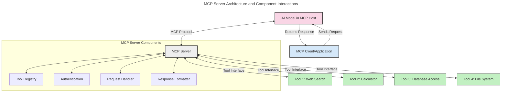
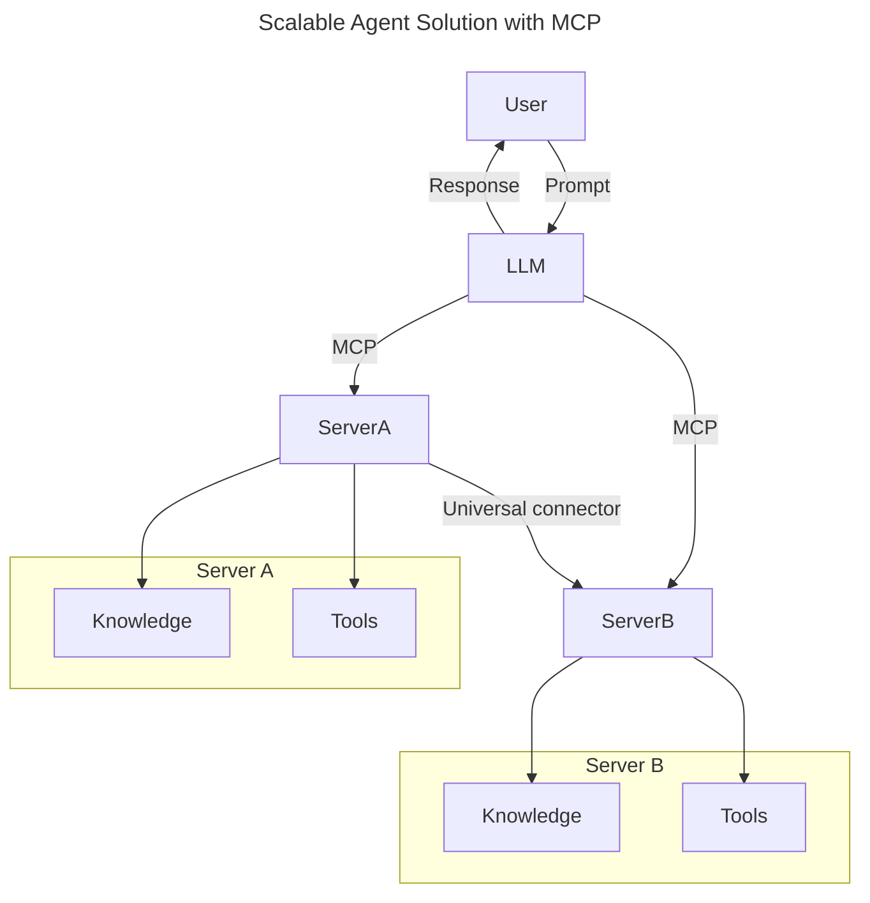
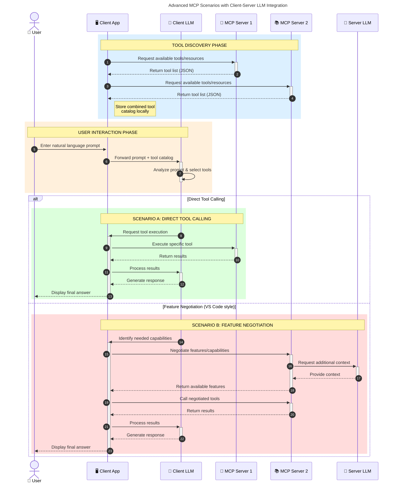

<!--
CO_OP_TRANSLATOR_METADATA:
{
  "original_hash": "105c2ddbb77bc38f7e9df009e1b06e45",
  "translation_date": "2025-07-13T15:32:11+00:00",
  "source_file": "00-Introduction/README.md",
  "language_code": "pl"
}
-->
# Wprowadzenie do Model Context Protocol (MCP): Dlaczego jest ważny dla skalowalnych aplikacji AI

Aplikacje generatywnej AI to duży krok naprzód, ponieważ często pozwalają użytkownikowi na interakcję z aplikacją za pomocą naturalnych poleceń językowych. Jednak wraz z inwestowaniem coraz większej ilości czasu i zasobów w takie aplikacje, chcesz mieć pewność, że łatwo zintegrujesz funkcjonalności i zasoby w sposób umożliwiający ich rozbudowę, obsługę wielu modeli jednocześnie oraz radzenie sobie z różnymi niuansami modeli. Krótko mówiąc, budowanie aplikacji Gen AI jest na początku proste, ale w miarę ich rozwoju i rosnącej złożoności, musisz zacząć definiować architekturę i prawdopodobnie polegać na standardzie, który zapewni spójność w budowie aplikacji. Właśnie tutaj pojawia się MCP, który porządkuje sprawy i dostarcza standard.

---

## **🔍 Czym jest Model Context Protocol (MCP)?**

**Model Context Protocol (MCP)** to **otwarty, ustandaryzowany interfejs**, który pozwala dużym modelom językowym (LLM) na płynną współpracę z zewnętrznymi narzędziami, API i źródłami danych. Zapewnia spójną architekturę, która rozszerza funkcjonalność modeli AI poza dane treningowe, umożliwiając tworzenie inteligentniejszych, skalowalnych i bardziej responsywnych systemów AI.

---

## **🎯 Dlaczego standaryzacja w AI jest ważna**

W miarę jak aplikacje generatywnej AI stają się coraz bardziej złożone, kluczowe jest przyjęcie standardów zapewniających **skalowalność, rozszerzalność** i **łatwość utrzymania**. MCP odpowiada na te potrzeby poprzez:

- Ujednolicenie integracji modeli z narzędziami
- Ograniczenie kruchych, jednorazowych rozwiązań
- Umożliwienie współistnienia wielu modeli w jednym ekosystemie

---

## **📚 Cele nauki**

Po przeczytaniu tego artykułu będziesz potrafił:

- Zdefiniować **Model Context Protocol (MCP)** i jego zastosowania
- Zrozumieć, jak MCP standaryzuje komunikację model-narzędzie
- Wymienić kluczowe elementy architektury MCP
- Poznać przykłady zastosowań MCP w środowiskach korporacyjnych i deweloperskich

---

## **💡 Dlaczego Model Context Protocol (MCP) to przełom**

### **🔗 MCP rozwiązuje problem fragmentacji w interakcjach AI**

Przed MCP integracja modeli z narzędziami wymagała:

- Pisania niestandardowego kodu dla każdej pary narzędzie-model
- Korzystania z niestandardowych API dla każdego dostawcy
- Częstych przerw spowodowanych aktualizacjami
- Słabej skalowalności przy rosnącej liczbie narzędzi

### **✅ Korzyści ze standaryzacji MCP**

| **Korzyść**              | **Opis**                                                                       |
|--------------------------|--------------------------------------------------------------------------------|
| Interoperacyjność        | LLM współpracują bezproblemowo z narzędziami różnych dostawców                |
| Spójność                 | Jednolite zachowanie na różnych platformach i narzędziach                     |
| Ponowne użycie           | Narzędzia stworzone raz mogą być wykorzystywane w wielu projektach i systemach |
| Przyspieszenie rozwoju   | Skrócenie czasu tworzenia dzięki standardowym, gotowym do użycia interfejsom  |

---

## **🧱 Przegląd architektury MCP na wysokim poziomie**

MCP opiera się na **modelu klient-serwer**, gdzie:

- **MCP Hosts** uruchamiają modele AI
- **MCP Clients** inicjują zapytania
- **MCP Servers** dostarczają kontekst, narzędzia i możliwości

### **Kluczowe komponenty:**

- **Resources** – statyczne lub dynamiczne dane dla modeli  
- **Prompts** – zdefiniowane wcześniej przepływy pracy do sterowanego generowania  
- **Tools** – wykonywalne funkcje, takie jak wyszukiwanie, obliczenia  
- **Sampling** – zachowanie agentowe poprzez rekurencyjne interakcje

---

## Jak działają serwery MCP

Serwery MCP działają w następujący sposób:

- **Przepływ zapytań**:  
    1. MCP Client wysyła zapytanie do modelu AI działającego na MCP Host.  
    2. Model AI rozpoznaje, kiedy potrzebuje zewnętrznych narzędzi lub danych.  
    3. Model komunikuje się z MCP Server za pomocą ustandaryzowanego protokołu.

- **Funkcje MCP Server**:  
    - Rejestr narzędzi: utrzymuje katalog dostępnych narzędzi i ich możliwości.  
    - Uwierzytelnianie: weryfikuje uprawnienia do dostępu do narzędzi.  
    - Obsługa zapytań: przetwarza przychodzące żądania narzędzi od modelu.  
    - Formatowanie odpowiedzi: strukturyzuje wyniki narzędzi w formacie zrozumiałym dla modelu.

- **Wykonanie narzędzi**:  
    - Serwer kieruje zapytania do odpowiednich zewnętrznych narzędzi  
    - Narzędzia wykonują swoje specjalistyczne funkcje (wyszukiwanie, obliczenia, zapytania do baz danych itp.)  
    - Wyniki są zwracane do modelu w spójnym formacie.

- **Zakończenie odpowiedzi**:  
    - Model AI włącza wyniki narzędzi do swojej odpowiedzi.  
    - Ostateczna odpowiedź jest wysyłana z powrotem do aplikacji klienckiej.

## 👨‍💻 Jak zbudować serwer MCP (z przykładami)

Serwery MCP pozwalają rozszerzyć możliwości LLM, dostarczając dane i funkcjonalności.

Chcesz spróbować? Oto przykłady tworzenia prostego serwera MCP w różnych językach:

- **Przykład w Pythonie**: https://github.com/modelcontextprotocol/python-sdk

- **Przykład w TypeScript**: https://github.com/modelcontextprotocol/typescript-sdk

- **Przykład w Javie**: https://github.com/modelcontextprotocol/java-sdk

- **Przykład w C#/.NET**: https://github.com/modelcontextprotocol/csharp-sdk

## 🌍 Przykłady zastosowań MCP w praktyce

MCP umożliwia szeroki zakres zastosowań, rozszerzając możliwości AI:

| **Zastosowanie**           | **Opis**                                                                       |
|----------------------------|--------------------------------------------------------------------------------|
| Integracja danych w firmie  | Łączenie LLM z bazami danych, CRM lub narzędziami wewnętrznymi                 |
| Systemy agentowe AI        | Umożliwienie autonomicznym agentom dostępu do narzędzi i przepływów decyzyjnych|
| Aplikacje multimodalne     | Łączenie narzędzi tekstowych, obrazowych i audio w jednej zunifikowanej aplikacji AI |
| Integracja danych w czasie rzeczywistym | Dostarczanie na żywo danych do interakcji AI dla dokładniejszych i aktualnych wyników |

### 🧠 MCP = Uniwersalny standard dla interakcji AI

Model Context Protocol (MCP) działa jak uniwersalny standard dla interakcji AI, podobnie jak USB-C ustandaryzował fizyczne połączenia urządzeń. W świecie AI MCP zapewnia spójny interfejs, pozwalający modelom (klientom) na bezproblemową integrację z zewnętrznymi narzędziami i dostawcami danych (serwerami). Dzięki temu nie ma potrzeby tworzenia różnych, niestandardowych protokołów dla każdego API czy źródła danych.

W ramach MCP narzędzie kompatybilne z MCP (zwane serwerem MCP) działa według jednolitego standardu. Serwery te mogą udostępniać listę oferowanych narzędzi lub akcji oraz wykonywać je na żądanie agenta AI. Platformy agentów AI wspierające MCP potrafią wykrywać dostępne narzędzia na serwerach i wywoływać je za pomocą tego standardowego protokołu.

### 💡 Ułatwia dostęp do wiedzy

Poza udostępnianiem narzędzi, MCP ułatwia także dostęp do wiedzy. Pozwala aplikacjom dostarczać kontekst dużym modelom językowym (LLM) poprzez łączenie ich z różnymi źródłami danych. Na przykład serwer MCP może reprezentować repozytorium dokumentów firmy, umożliwiając agentom pobieranie potrzebnych informacji na żądanie. Inny serwer może obsługiwać konkretne akcje, takie jak wysyłanie e-maili czy aktualizacja rekordów. Z perspektywy agenta to po prostu narzędzia, które może wykorzystać — niektóre zwracają dane (kontekst wiedzy), inne wykonują akcje. MCP efektywnie zarządza oboma przypadkami.

Agent łączący się z serwerem MCP automatycznie poznaje dostępne możliwości i dane serwera dzięki standardowemu formatowi. Ta standaryzacja umożliwia dynamiczną dostępność narzędzi. Na przykład dodanie nowego serwera MCP do systemu agenta sprawia, że jego funkcje są od razu dostępne bez konieczności dalszej modyfikacji instrukcji agenta.

Tak uproszczona integracja odpowiada schematowi przedstawionemu na diagramie mermaid, gdzie serwery dostarczają zarówno narzędzia, jak i wiedzę, zapewniając płynną współpracę między systemami.

### 👉 Przykład: Skalowalne rozwiązanie agentowe

### 🔄 Zaawansowane scenariusze MCP z integracją LLM po stronie klienta

Poza podstawową architekturą MCP istnieją zaawansowane scenariusze, w których zarówno klient, jak i serwer zawierają LLM, co umożliwia bardziej złożone interakcje:

## 🔐 Praktyczne korzyści MCP

Oto praktyczne zalety korzystania z MCP:

- **Aktualność**: Modele mają dostęp do najnowszych informacji poza danymi treningowymi  
- **Rozszerzenie możliwości**: Modele mogą korzystać ze specjalistycznych narzędzi do zadań, do których nie były trenowane  
- **Zmniejszenie halucynacji**: Zewnętrzne źródła danych zapewniają oparcie w faktach  
- **Prywatność**: Wrażliwe dane mogą pozostać w bezpiecznym środowisku, zamiast być osadzane w promptach

## 📌 Najważniejsze wnioski

Oto kluczowe wnioski dotyczące MCP:

- **MCP** standaryzuje sposób, w jaki modele AI komunikują się z narzędziami i danymi  
- Promuje **rozszerzalność, spójność i interoperacyjność**  
- MCP pomaga **skrócić czas tworzenia, zwiększyć niezawodność i rozszerzyć możliwości modeli**  
- Architektura klient-serwer **umożliwia elastyczne i rozbudowywalne aplikacje AI**

## 🧠 Ćwiczenie

Pomyśl o aplikacji AI, którą chciałbyś stworzyć.

- Jakie **zewnętrzne narzędzia lub dane** mogłyby zwiększyć jej możliwości?  
- W jaki sposób MCP może uczynić integrację **prostszą i bardziej niezawodną**?

## Dodatkowe zasoby

- [MCP GitHub Repository](https://github.com/modelcontextprotocol)

## Co dalej

Następny rozdział: [Chapter 1: Core Concepts](../01-CoreConcepts/README.md)

**Zastrzeżenie**:  
Niniejszy dokument został przetłumaczony za pomocą usługi tłumaczenia AI [Co-op Translator](https://github.com/Azure/co-op-translator). Mimo że dążymy do jak największej dokładności, prosimy mieć na uwadze, że tłumaczenia automatyczne mogą zawierać błędy lub nieścisłości. Oryginalny dokument w języku źródłowym powinien być uznawany za źródło autorytatywne. W przypadku informacji o kluczowym znaczeniu zalecane jest skorzystanie z profesjonalnego tłumaczenia wykonanego przez człowieka. Nie ponosimy odpowiedzialności za jakiekolwiek nieporozumienia lub błędne interpretacje wynikające z korzystania z tego tłumaczenia.