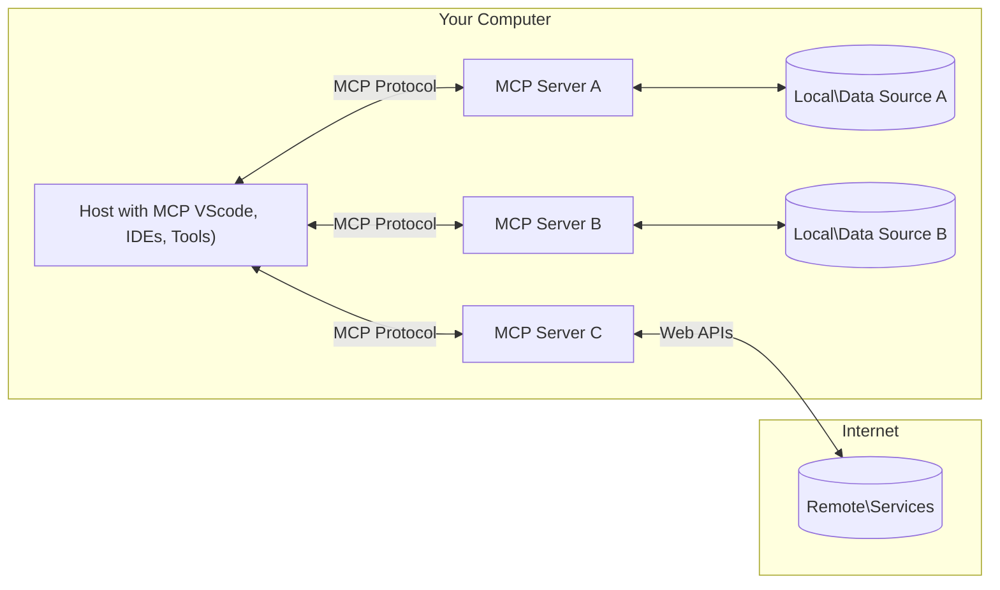

<!--
CO_OP_TRANSLATOR_METADATA:
{
  "original_hash": "b3b4a6ad10c3c0edbf7fa7cfa0ec496b",
  "translation_date": "2025-07-02T07:12:19+00:00",
  "source_file": "01-CoreConcepts/README.md",
  "language_code": "pl"
}
-->
# 📖 Podstawowe koncepcje MCP: Opanowanie Model Context Protocol dla integracji AI

[Model Context Protocol (MCP)](https://github.com/modelcontextprotocol) to potężne, ustandaryzowane ramy, które optymalizują komunikację między dużymi modelami językowymi (LLM) a zewnętrznymi narzędziami, aplikacjami i źródłami danych. Ten przewodnik zoptymalizowany pod kątem SEO przeprowadzi Cię przez kluczowe koncepcje MCP, zapewniając zrozumienie architektury klient-serwer, podstawowych komponentów, mechanizmów komunikacji oraz najlepszych praktyk implementacyjnych.

## Przegląd

Ta lekcja omawia podstawową architekturę i komponenty, które tworzą ekosystem Model Context Protocol (MCP). Poznasz architekturę klient-serwer, kluczowe elementy oraz mechanizmy komunikacji, które napędzają interakcje MCP.

## 👩‍🎓 Kluczowe cele nauki

Po ukończeniu tej lekcji będziesz potrafił:

- Zrozumieć architekturę klient-serwer MCP.
- Zidentyfikować role i obowiązki Hostów, Klientów i Serwerów.
- Przeanalizować główne cechy, które czynią MCP elastyczną warstwą integracyjną.
- Poznać przepływ informacji w ekosystemie MCP.
- Zdobyć praktyczne umiejętności dzięki przykładom kodu w .NET, Java, Python i JavaScript.

## 🔎 Architektura MCP: Głębsze spojrzenie

Ekosystem MCP opiera się na modelu klient-serwer. Ta modułowa struktura pozwala aplikacjom AI na efektywną interakcję z narzędziami, bazami danych, API i zasobami kontekstowymi. Rozbijmy tę architekturę na jej podstawowe elementy.

U podstaw MCP leży architektura klient-serwer, gdzie aplikacja hostująca może łączyć się z wieloma serwerami:



- **MCP Hosts**: Programy takie jak VSCode, Claude Desktop, IDE lub narzędzia AI, które chcą uzyskać dostęp do danych przez MCP
- **MCP Clients**: Klienci protokołu utrzymujący połączenia 1:1 z serwerami
- **MCP Servers**: Lekkie programy udostępniające konkretne funkcje za pomocą ustandaryzowanego Model Context Protocol
- **Lokalne źródła danych**: Pliki, bazy danych i usługi na Twoim komputerze, do których serwery MCP mają bezpieczny dostęp
- **Zdalne usługi**: Zewnętrzne systemy dostępne przez internet, z którymi serwery MCP mogą się łączyć przez API.

Protokół MCP to rozwijający się standard — najnowsze aktualizacje znajdziesz w [specyfikacji protokołu](https://modelcontextprotocol.io/specification/2025-06-18/).

### 1. Hosty

W Model Context Protocol (MCP) Hosty pełnią kluczową rolę jako główny interfejs, przez który użytkownicy wchodzą w interakcję z protokołem. Hosty to aplikacje lub środowiska, które inicjują połączenia z serwerami MCP, aby uzyskać dostęp do danych, narzędzi i promptów. Przykłady Hostów to zintegrowane środowiska programistyczne (IDE) jak Visual Studio Code, narzędzia AI takie jak Claude Desktop lub niestandardowe agenty stworzone do konkretnych zadań.

**Hosty** to aplikacje LLM, które inicjują połączenia. Ich zadania to:

- Uruchamianie lub interakcja z modelami AI w celu generowania odpowiedzi.
- Inicjowanie połączeń z serwerami MCP.
- Zarządzanie przepływem rozmowy i interfejsem użytkownika.
- Kontrola uprawnień i ograniczeń bezpieczeństwa.
- Obsługa zgody użytkownika na udostępnianie danych i wykonywanie narzędzi.

### 2. Klienci

Klienci to kluczowe komponenty ułatwiające interakcję między Hostami a serwerami MCP. Działają jako pośrednicy, umożliwiając Hostom dostęp i wykorzystanie funkcji oferowanych przez serwery MCP. Odgrywają ważną rolę w zapewnieniu płynnej komunikacji i efektywnej wymiany danych w architekturze MCP.

**Klienci** to konektory w aplikacji hostującej. Ich zadania to:

- Wysyłanie zapytań do serwerów z promptami/instrukcjami.
- Negocjowanie możliwości z serwerami.
- Zarządzanie żądaniami wykonania narzędzi od modeli.
- Przetwarzanie i wyświetlanie odpowiedzi użytkownikom.

### 3. Serwery

Serwery odpowiadają za obsługę żądań od klientów MCP i dostarczanie odpowiednich odpowiedzi. Zarządzają różnymi operacjami, takimi jak pobieranie danych, wykonywanie narzędzi i generowanie promptów. Zapewniają, że komunikacja między klientami a Hostami jest efektywna i niezawodna, utrzymując integralność procesu interakcji.

**Serwery** to usługi dostarczające kontekst i funkcje. Ich zadania to:

- Rejestrowanie dostępnych funkcji (zasobów, promptów, narzędzi)
- Odbieranie i wykonywanie wywołań narzędzi od klienta
- Dostarczanie informacji kontekstowych wzbogacających odpowiedzi modelu
- Zwracanie wyników do klienta
- Utrzymywanie stanu w trakcie interakcji, jeśli jest to potrzebne

Serwery mogą być tworzone przez każdego, kto chce rozszerzyć możliwości modelu o specjalistyczną funkcjonalność.

### 4. Funkcje serwera

Serwery w Model Context Protocol (MCP) dostarczają podstawowe elementy umożliwiające bogate interakcje między klientami, hostami i modelami językowymi. Funkcje te mają na celu zwiększenie możliwości MCP poprzez oferowanie uporządkowanego kontekstu, narzędzi i promptów.

Serwery MCP mogą oferować następujące funkcje:

#### 📑 Zasoby

Zasoby w Model Context Protocol (MCP) obejmują różne typy kontekstu i danych, które mogą być wykorzystywane przez użytkowników lub modele AI. Należą do nich:

- **Dane kontekstowe**: Informacje i kontekst, z których użytkownicy lub modele AI mogą korzystać do podejmowania decyzji i wykonywania zadań.
- **Bazy wiedzy i repozytoria dokumentów**: Zbiory danych strukturalnych i niestrukturalnych, takie jak artykuły, podręczniki i prace naukowe, dostarczające cennych informacji.
- **Lokalne pliki i bazy danych**: Dane przechowywane lokalnie na urządzeniach lub w bazach danych, dostępne do przetwarzania i analizy.
- **API i usługi internetowe**: Zewnętrzne interfejsy i usługi oferujące dodatkowe dane i funkcje, umożliwiające integrację z różnymi zasobami i narzędziami online.

Przykładem zasobu może być schemat bazy danych lub plik, do którego dostęp można uzyskać w następujący sposób:

```text
file://log.txt
database://schema
```

### 🤖 Prompt’y

Prompt’y w Model Context Protocol (MCP) obejmują różne predefiniowane szablony i wzorce interakcji, zaprojektowane w celu usprawnienia pracy użytkowników i poprawy komunikacji. Należą do nich:

- **Szablony wiadomości i workflow**: Wstępnie ustrukturyzowane wiadomości i procesy, które prowadzą użytkowników przez określone zadania i interakcje.
- **Predefiniowane wzorce interakcji**: Standardowe sekwencje działań i odpowiedzi, które ułatwiają spójną i efektywną komunikację.
- **Specjalistyczne szablony rozmów**: Dostosowywalne szablony przeznaczone do konkretnych typów konwersacji, zapewniające odpowiednie i kontekstowe interakcje.

Szablon promptu może wyglądać tak:

```markdown
Generate a product slogan based on the following {{product}} with the following {{keywords}}
```

#### ⛏️ Narzędzia

Narzędzia w Model Context Protocol (MCP) to funkcje, które model AI może wykonać, aby zrealizować konkretne zadania. Narzędzia te mają na celu zwiększenie możliwości modelu AI poprzez zapewnienie uporządkowanych i niezawodnych operacji. Kluczowe aspekty to:

- **Funkcje do wykonania przez model AI**: Narzędzia to wykonywalne funkcje, które model AI może wywołać, aby zrealizować różne zadania.
- **Unikalna nazwa i opis**: Każde narzędzie ma odrębną nazwę oraz szczegółowy opis wyjaśniający jego cel i funkcjonalność.
- **Parametry i wyniki**: Narzędzia przyjmują określone parametry i zwracają uporządkowane wyniki, zapewniając spójność i przewidywalność efektów.
- **Funkcje dyskretne**: Narzędzia realizują konkretne funkcje, takie jak wyszukiwanie w sieci, obliczenia czy zapytania do bazy danych.

Przykład narzędzia może wyglądać tak:

```typescript
server.tool(
  "GetProducts",
  {
    pageSize: z.string().optional(),
    pageCount: z.string().optional()
  }, () => {
    // return results from API
  }
)
```

## Funkcje klienta

W Model Context Protocol (MCP) klienci oferują serwerom kilka kluczowych funkcji, które zwiększają ogólną funkcjonalność i interakcję w protokole. Jedną z wyróżniających się funkcji jest Sampling.

### 👉 Sampling

- **Agentowe zachowania inicjowane przez serwer**: Klienci umożliwiają serwerom autonomiczne inicjowanie określonych działań lub zachowań, zwiększając dynamiczne możliwości systemu.
- **Rekurencyjne interakcje LLM**: Ta funkcja pozwala na rekurencyjne interakcje z dużymi modelami językowymi (LLM), umożliwiając bardziej złożone i iteracyjne przetwarzanie zadań.
- **Żądanie dodatkowych uzupełnień modelu**: Serwery mogą prosić o dodatkowe uzupełnienia od modelu, zapewniając, że odpowiedzi są pełne i kontekstowo adekwatne.

## Przepływ informacji w MCP

Model Context Protocol (MCP) definiuje uporządkowany przepływ informacji między hostami, klientami, serwerami i modelami. Zrozumienie tego przepływu pomaga wyjaśnić, jak przetwarzane są żądania użytkowników oraz jak zewnętrzne narzędzia i dane są integrowane z odpowiedziami modelu.

- **Host inicjuje połączenie**  
  Aplikacja hostująca (np. IDE lub interfejs czatu) nawiązuje połączenie z serwerem MCP, zwykle przez STDIO, WebSocket lub inny obsługiwany transport.

- **Negocjacja możliwości**  
  Klient (wbudowany w hosta) i serwer wymieniają informacje o wspieranych funkcjach, narzędziach, zasobach i wersjach protokołu. Zapewnia to, że obie strony rozumieją, jakie możliwości są dostępne podczas sesji.

- **Żądanie użytkownika**  
  Użytkownik wchodzi w interakcję z hostem (np. wpisuje prompt lub polecenie). Host zbiera te dane i przekazuje je do klienta do przetworzenia.

- **Użycie zasobu lub narzędzia**  
  - Klient może poprosić serwer o dodatkowy kontekst lub zasoby (np. pliki, wpisy w bazie danych lub artykuły z bazy wiedzy), aby wzbogacić rozumienie modelu.
  - Jeśli model stwierdzi, że potrzebne jest narzędzie (np. do pobrania danych, wykonania obliczeń lub wywołania API), klient wysyła żądanie wywołania narzędzia do serwera, podając nazwę narzędzia i parametry.

- **Wykonanie przez serwer**  
  Serwer odbiera żądanie zasobu lub narzędzia, wykonuje niezbędne operacje (np. uruchamia funkcję, wykonuje zapytanie do bazy danych lub pobiera plik) i zwraca wyniki do klienta w uporządkowanym formacie.

- **Generowanie odpowiedzi**  
  Klient integruje odpowiedzi serwera (dane zasobów, wyniki narzędzi itp.) w trwającą interakcję z modelem. Model wykorzystuje te informacje do wygenerowania kompleksowej i kontekstowo adekwatnej odpowiedzi.

- **Prezentacja wyniku**  
  Host otrzymuje końcowy wynik od klienta i prezentuje go użytkownikowi, często obejmując zarówno wygenerowany tekst modelu, jak i wyniki wywołań narzędzi lub wyszukiwań zasobów.

Ten przepływ umożliwia MCP wspieranie zaawansowanych, interaktywnych i świadomych kontekstu aplikacji AI, łącząc modele z zewnętrznymi narzędziami i źródłami danych.

## Szczegóły protokołu

MCP (Model Context Protocol) opiera się na [JSON-RPC 2.0](https://www.jsonrpc.org/), zapewniając ustandaryzowany, niezależny od języka format wiadomości do komunikacji między hostami, klientami i serwerami. Ta podstawa umożliwia niezawodne, uporządkowane i rozszerzalne interakcje na różnych platformach i w różnych językach programowania.

### Kluczowe cechy protokołu

MCP rozszerza JSON-RPC 2.0 o dodatkowe konwencje dotyczące wywoływania narzędzi, dostępu do zasobów i zarządzania promptami. Obsługuje wiele warstw transportu (STDIO, WebSocket, SSE) i umożliwia bezpieczną, rozszerzalną i niezależną od języka komunikację między komponentami.

#### 🧢 Protokół bazowy

- **Format wiadomości JSON-RPC**: Wszystkie żądania i odpowiedzi korzystają ze specyfikacji JSON-RPC 2.0, zapewniając spójną strukturę wywołań metod, parametrów, wyników i obsługi błędów.
- **Połączenia stanowe**: Sesje MCP utrzymują stan przez wiele żądań, wspierając kontynuowane rozmowy, akumulację kontekstu i zarządzanie zasobami.
- **Negocjacja możliwości**: Podczas nawiązywania połączenia klienci i serwery wymieniają informacje o wspieranych funkcjach, wersjach protokołu, dostępnych narzędziach i zasobach. Dzięki temu obie strony rozumieją swoje możliwości i mogą się dostosować.

#### ➕ Dodatkowe narzędzia

Poniżej przedstawiono dodatkowe narzędzia i rozszerzenia protokołu, które MCP oferuje, by poprawić doświadczenie programistów i umożliwić zaawansowane scenariusze:

- **Opcje konfiguracyjne**: MCP pozwala na dynamiczną konfigurację parametrów sesji, takich jak uprawnienia do narzędzi, dostęp do zasobów i ustawienia modelu, dostosowane do każdej interakcji.
- **Śledzenie postępu**: Operacje długotrwałe mogą raportować postęp, co umożliwia responsywne interfejsy użytkownika i lepsze doświadczenie podczas złożonych zadań.
- **Anulowanie żądań**: Klienci mogą anulować trwające żądania, pozwalając użytkownikom przerwać operacje, które nie są już potrzebne lub trwają zbyt długo.
- **Raportowanie błędów**: Ustandaryzowane komunikaty i kody błędów pomagają diagnozować problemy, obsługiwać awarie w sposób łagodny i dostarczać użyteczne informacje zwrotne dla użytkowników i programistów.
- **Logowanie**: Zarówno klienci, jak i serwery mogą generować uporządkowane logi do celów audytu, debugowania i monitorowania interakcji protokołu.

Dzięki tym funkcjom MCP zapewnia solidną, bezpieczną i elastyczną komunikację między modelami językowymi a zewnętrznymi narzędziami i źródłami danych.

### 🔐 Aspekty bezpieczeństwa

Implementacje MCP powinny przestrzegać kilku kluczowych zasad bezpieczeństwa, aby zapewnić bezpieczne i godne zaufania interakcje:

- **Zgoda i kontrola użytkownika**: Użytkownicy muszą wyrazić wyraźną zgodę przed uzyskaniem dostępu do danych lub wykonaniem operacji. Powinni mieć jasną kontrolę nad tym, jakie dane są udostępniane i które działania są autoryzowane, wspieraną przez intuicyjne interfejsy do przeglądu i zatwierdzania działań.

- **Prywatność danych**: Dane użytkownika powinny być udostępniane wyłącznie za wyraźną zgodą i chronione odpowiednimi mechanizmami kontroli dostępu. Implementacje MCP muszą zabezpieczać przed nieautoryzowanym przesyłaniem danych i zapewniać ochronę prywatności we wszystkich interakcjach.

- **Bezpieczeństwo narzędzi**: Przed wywołaniem jakiegokolwiek narzędzia

**Zastrzeżenie**:  
Niniejszy dokument został przetłumaczony przy użyciu usługi tłumaczenia AI [Co-op Translator](https://github.com/Azure/co-op-translator). Chociaż dążymy do jak największej dokładności, prosimy pamiętać, że tłumaczenia automatyczne mogą zawierać błędy lub nieścisłości. Oryginalny dokument w języku źródłowym powinien być uznawany za źródło wiarygodne. W przypadku informacji o kluczowym znaczeniu zalecane jest skorzystanie z profesjonalnego tłumaczenia wykonanego przez człowieka. Nie ponosimy odpowiedzialności za jakiekolwiek nieporozumienia lub błędne interpretacje wynikające z korzystania z tego tłumaczenia.