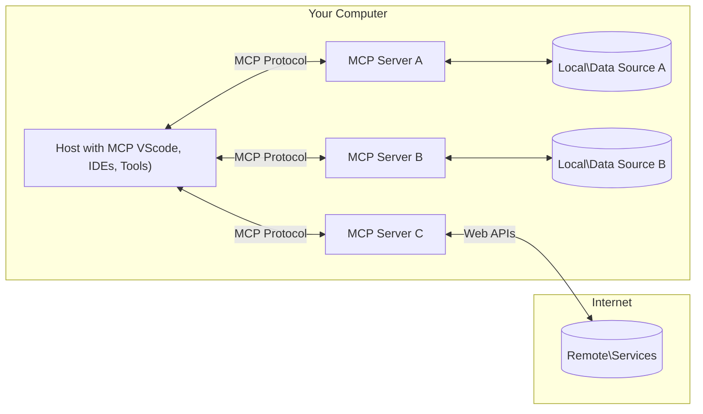

<!--
CO_OP_TRANSLATOR_METADATA:
{
  "original_hash": "2222cbf8a23394076ef76c616b65aede",
  "translation_date": "2025-07-29T01:31:43+00:00",
  "source_file": "01-CoreConcepts/README.md",
  "language_code": "pl"
}
-->
# 📖 MCP Kluczowe Koncepcje: Opanowanie Protokółu Kontekstu Modelu dla Integracji AI

[](https://youtu.be/earDzWGtE84)

_(Kliknij obrazek powyżej, aby obejrzeć wideo z tej lekcji)_

[Model Context Protocol (MCP)](https://github.com/modelcontextprotocol) to potężne, znormalizowane ramy, które optymalizują komunikację między dużymi modelami językowymi (LLM) a zewnętrznymi narzędziami, aplikacjami i źródłami danych. Ten przewodnik zoptymalizowany pod kątem SEO przeprowadzi Cię przez kluczowe koncepcje MCP, zapewniając zrozumienie jego architektury klient-serwer, podstawowych komponentów, mechanizmów komunikacji i najlepszych praktyk wdrożeniowych.

## Przegląd

Ta lekcja bada podstawową architekturę i komponenty, które tworzą ekosystem Model Context Protocol (MCP). Dowiesz się o architekturze klient-serwer, kluczowych elementach i mechanizmach komunikacji, które napędzają interakcje MCP.

## 👩‍🎓 Kluczowe Cele Nauki

Po ukończeniu tej lekcji będziesz:

- Rozumieć architekturę klient-serwer MCP.
- Identyfikować role i obowiązki Hostów, Klientów i Serwerów.
- Analizować kluczowe cechy, które czynią MCP elastyczną warstwą integracyjną.
- Poznawać przepływ informacji w ekosystemie MCP.
- Zdobywać praktyczne wskazówki dzięki przykładom kodu w .NET, Java, Python i JavaScript.

## 🔎 Architektura MCP: Głębsze Spojrzenie

Ekosystem MCP opiera się na modelu klient-serwer. Ta modułowa struktura pozwala aplikacjom AI efektywnie współpracować z narzędziami, bazami danych, API i zasobami kontekstowymi. Rozłóżmy tę architekturę na jej podstawowe komponenty.

W swojej istocie MCP stosuje architekturę klient-serwer, gdzie aplikacja hostująca może łączyć się z wieloma serwerami:



- **Hosty MCP**: Programy takie jak VSCode, Claude Desktop, IDE czy narzędzia AI, które chcą uzyskać dostęp do danych za pomocą MCP.
- **Klienci MCP**: Klienci protokołu, którzy utrzymują połączenia 1:1 z serwerami.
- **Serwery MCP**: Lekkie programy, które udostępniają określone funkcje za pomocą znormalizowanego Model Context Protocol.
- **Lokalne Źródła Danych**: Pliki, bazy danych i usługi na Twoim komputerze, do których serwery MCP mogą bezpiecznie uzyskać dostęp.
- **Zdalne Usługi**: Zewnętrzne systemy dostępne przez internet, z którymi serwery MCP mogą się łączyć za pomocą API.

Protokół MCP jest standardem ewoluującym – najnowsze aktualizacje specyfikacji można znaleźć [tutaj](https://modelcontextprotocol.io/specification/2025-06-18/).

### 1. Hosty

W Model Context Protocol (MCP) Hosty odgrywają kluczową rolę jako główny interfejs, za pomocą którego użytkownicy wchodzą w interakcję z protokołem. Hosty to aplikacje lub środowiska, które inicjują połączenia z serwerami MCP, aby uzyskać dostęp do danych, narzędzi i podpowiedzi. Przykłady Hostów to zintegrowane środowiska programistyczne (IDE) jak Visual Studio Code, narzędzia AI jak Claude Desktop czy agenci stworzeni do określonych zadań.

**Hosty** to aplikacje LLM, które inicjują połączenia. Ich zadania to:

- Wykonywanie lub interakcja z modelami AI w celu generowania odpowiedzi.
- Inicjowanie połączeń z serwerami MCP.
- Zarządzanie przepływem rozmowy i interfejsem użytkownika.
- Kontrola uprawnień i ograniczeń bezpieczeństwa.
- Obsługa zgody użytkownika na udostępnianie danych i wykonywanie narzędzi.

### 2. Klienci

Klienci są kluczowymi komponentami, które ułatwiają interakcję między Hostami a serwerami MCP. Działają jako pośrednicy, umożliwiając Hostom dostęp do funkcji oferowanych przez serwery MCP. Odgrywają kluczową rolę w zapewnieniu płynnej komunikacji i efektywnej wymiany danych w architekturze MCP.

**Klienci** to łączniki w aplikacji hostującej. Ich zadania to:

- Wysyłanie żądań do serwerów z podpowiedziami/instrukcjami.
- Negocjowanie możliwości z serwerami.
- Zarządzanie żądaniami wykonania narzędzi od modeli.
- Przetwarzanie i wyświetlanie odpowiedzi użytkownikom.

### 3. Serwery

Serwery są odpowiedzialne za obsługę żądań od klientów MCP i dostarczanie odpowiednich odpowiedzi. Zarządzają różnymi operacjami, takimi jak pobieranie danych, wykonywanie narzędzi i generowanie podpowiedzi. Serwery zapewniają, że komunikacja między klientami a Hostami jest efektywna i niezawodna, utrzymując integralność procesu interakcji.

**Serwery** to usługi dostarczające kontekst i funkcje. Ich zadania to:

- Rejestrowanie dostępnych funkcji (zasobów, podpowiedzi, narzędzi).
- Odbieranie i wykonywanie wywołań narzędzi od klienta.
- Dostarczanie informacji kontekstowych w celu ulepszenia odpowiedzi modelu.
- Zwracanie wyników do klienta.
- Utrzymywanie stanu w trakcie interakcji, jeśli to konieczne.

Serwery mogą być tworzone przez każdego, aby rozszerzyć możliwości modelu o specjalistyczne funkcje.

### 4. Funkcje Serwera

Serwery w Model Context Protocol (MCP) dostarczają podstawowych elementów umożliwiających bogate interakcje między klientami, Hostami i modelami językowymi. Funkcje te zostały zaprojektowane, aby zwiększyć możliwości MCP, oferując ustrukturyzowany kontekst, narzędzia i podpowiedzi.

Serwery MCP mogą oferować następujące funkcje:

#### 📑 Zasoby

Zasoby w Model Context Protocol (MCP) obejmują różne typy kontekstu i danych, które mogą być wykorzystywane przez użytkowników lub modele AI. Obejmują one:

- **Dane Kontekstowe**: Informacje i kontekst, które użytkownicy lub modele AI mogą wykorzystać do podejmowania decyzji i realizacji zadań.
- **Bazy Wiedzy i Repozytoria Dokumentów**: Kolekcje danych strukturalnych i niestrukturalnych, takich jak artykuły, podręczniki i prace badawcze, które dostarczają cennych informacji.
- **Lokalne Pliki i Bazy Danych**: Dane przechowywane lokalnie na urządzeniach lub w bazach danych, dostępne do przetwarzania i analizy.
- **API i Usługi Webowe**: Zewnętrzne interfejsy i usługi oferujące dodatkowe dane i funkcje, umożliwiające integrację z różnymi zasobami online i narzędziami.

Przykładem zasobu może być schemat bazy danych lub plik, do którego można uzyskać dostęp w następujący sposób:

```text
file://log.txt
database://schema
```

### 🤖 Podpowiedzi

Podpowiedzi w Model Context Protocol (MCP) obejmują różne predefiniowane szablony i wzorce interakcji zaprojektowane w celu usprawnienia przepływu pracy użytkownika i komunikacji. Obejmują one:

- **Szablonowe Wiadomości i Przepływy Pracy**: Wstępnie zdefiniowane wiadomości i procesy, które prowadzą użytkowników przez określone zadania i interakcje.
- **Predefiniowane Wzorce Interakcji**: Standardowe sekwencje działań i odpowiedzi, które ułatwiają spójną i efektywną komunikację.
- **Specjalistyczne Szablony Rozmów**: Dostosowywalne szablony zaprojektowane dla określonych typów rozmów, zapewniające odpowiednie i kontekstowe interakcje.

Szablon podpowiedzi może wyglądać następująco:

```markdown
Generate a product slogan based on the following {{product}} with the following {{keywords}}
```

#### ⛏️ Narzędzia

Narzędzia w Model Context Protocol (MCP) to funkcje, które model AI może wykonać w celu realizacji określonych zadań. Narzędzia te zostały zaprojektowane, aby zwiększyć możliwości modelu AI, oferując ustrukturyzowane i niezawodne operacje. Kluczowe aspekty obejmują:

- **Funkcje do wykonania przez model AI**: Narzędzia to funkcje, które model AI może wywołać w celu realizacji różnych zadań.
- **Unikalna Nazwa i Opis**: Każde narzędzie ma unikalną nazwę i szczegółowy opis wyjaśniający jego cel i funkcjonalność.
- **Parametry i Wyniki**: Narzędzia akceptują określone parametry i zwracają ustrukturyzowane wyniki, zapewniając spójne i przewidywalne rezultaty.
- **Funkcje Dyskretne**: Narzędzia wykonują dyskretne funkcje, takie jak wyszukiwanie w sieci, obliczenia i zapytania do bazy danych.

Przykładowe narzędzie może wyglądać następująco:

```typescript
server.tool(
  "GetProducts",
  {
    pageSize: z.string().optional(),
    pageCount: z.string().optional()
  }, () => {
    // return results from API
  }
)
```

## Funkcje Klienta

W Model Context Protocol (MCP) klienci oferują kilka kluczowych funkcji serwerom, zwiększając ogólną funkcjonalność i interakcję w ramach protokołu. Jedną z wyróżniających się funkcji jest Sampling.

### 👉 Sampling

- **Zachowania Agentowe Inicjowane przez Serwer**: Klienci umożliwiają serwerom autonomiczne inicjowanie określonych działań lub zachowań, zwiększając dynamiczne możliwości systemu.
- **Rekursywne Interakcje z LLM**: Ta funkcja pozwala na rekurencyjne interakcje z dużymi modelami językowymi (LLM), umożliwiając bardziej złożone i iteracyjne przetwarzanie zadań.
- **Żądanie Dodatkowych Uzupełnień Modelu**: Serwery mogą żądać dodatkowych uzupełnień od modelu, zapewniając, że odpowiedzi są dokładne i kontekstowo odpowiednie.

## Przepływ Informacji w MCP

Model Context Protocol (MCP) definiuje ustrukturyzowany przepływ informacji między Hostami, klientami, serwerami i modelami. Zrozumienie tego przepływu pomaga wyjaśnić, jak przetwarzane są żądania użytkowników i jak zewnętrzne narzędzia oraz dane są integrowane w odpowiedziach modelu.

- **Host Inicjuje Połączenie**  
  Aplikacja hostująca (np. IDE lub interfejs czatu) nawiązuje połączenie z serwerem MCP, zazwyczaj za pomocą STDIO, WebSocket lub innego obsługiwanego transportu.

- **Negocjacja Możliwości**  
  Klient (osadzony w Hoście) i serwer wymieniają informacje o obsługiwanych funkcjach, narzędziach, zasobach i wersjach protokołu. Zapewnia to, że obie strony rozumieją dostępne możliwości sesji.

- **Żądanie Użytkownika**  
  Użytkownik wchodzi w interakcję z Hostem (np. wprowadza podpowiedź lub polecenie). Host zbiera te dane wejściowe i przekazuje je do klienta do przetworzenia.

- **Wykorzystanie Zasobów lub Narzędzi**  
  - Klient może zażądać dodatkowego kontekstu lub zasobów od serwera (np. plików, wpisów w bazie danych lub artykułów z bazy wiedzy), aby wzbogacić zrozumienie modelu.
  - Jeśli model uzna, że potrzebne jest narzędzie (np. do pobrania danych, wykonania obliczeń lub wywołania API), klient wysyła żądanie wywołania narzędzia do serwera, określając nazwę narzędzia i parametry.

- **Wykonanie przez Serwer**  
  Serwer odbiera żądanie zasobu lub narzędzia, wykonuje niezbędne operacje (np. uruchomienie funkcji, zapytanie do bazy danych lub pobranie pliku) i zwraca wyniki do klienta w ustrukturyzowanym formacie.

- **Generowanie Odpowiedzi**  
  Klient integruje odpowiedzi serwera (dane zasobów, wyniki narzędzi itp.) w trwającą interakcję modelu. Model wykorzystuje te informacje do wygenerowania kompleksowej i kontekstowo odpowiedniej odpowiedzi.

- **Prezentacja Wyniku**  
  Host odbiera końcowy wynik od klienta i prezentuje go użytkownikowi, często zawierając zarówno wygenerowany tekst modelu, jak i wszelkie wyniki z wykonania narzędzi lub wyszukiwania zasobów.

Ten przepływ umożliwia MCP wspieranie zaawansowanych, interaktywnych i kontekstowo świadomych aplikacji AI poprzez bezproblemowe łączenie modeli z zewnętrznymi narzędziami i źródłami danych.

## Szczegóły Protokołu

MCP (Model Context Protocol) jest zbudowany na bazie [JSON-RPC 2.0](https://www.jsonrpc.org/), zapewniając znormalizowany, niezależny od języka format komunikacji między Hostami, klientami i serwerami. Ta podstawa umożliwia niezawodne, ustrukturyzowane i rozszerzalne interakcje na różnych platformach i w różnych językach programowania.

### Kluczowe Funkcje Protokołu

MCP rozszerza JSON-RPC 2.0 o dodatkowe konwencje dotyczące wywoływania narzędzi, dostępu do zasobów i zarządzania podpowiedziami. Obsługuje wiele warstw transportowych (STDIO, WebSocket, SSE) i umożliwia bezpieczną, rozszerzalną i niezależną od języka komunikację między komponentami.

#### 🧢 Podstawowy Protokół

- **Format Wiadomości JSON-RPC**: Wszystkie żądania i odpowiedzi korzystają ze specyfikacji JSON-RPC 2.0, zapewniając spójną strukturę dla wywołań metod, parametrów, wyników i obsługi błędów.
- **Połączenia Stanowe**: Sesje MCP utrzymują stan w trakcie wielu żądań, wspierając trwające rozmowy, akumulację kontekstu i zarządzanie zasobami.
- **Negocjacja Możliwości**: Podczas nawiązywania połączenia klienci i serwery wymieniają informacje o obsługiwanych funkcjach, wersjach protokołu, dostępnych narzędziach i zasobach. Zapewnia to, że obie strony rozumieją swoje możliwości i mogą się odpowiednio dostosować.

#### ➕ Dodatkowe Narzędzia

Poniżej przedstawiono niektóre dodatkowe narzędzia i rozszerzenia protokołu, które MCP oferuje w celu poprawy doświadczenia deweloperów i umożliwienia zaawansowanych scenariuszy:

- **Opcje Konfiguracji**: MCP pozwala na dynamiczną konfigurację parametrów sesji, takich jak uprawnienia narzędzi, dostęp do zasobów i ustawienia modelu, dostosowane do każdej interakcji.
- **Śledzenie Postępu**: Operacje długotrwałe mogą raportować aktualizacje postępu, umożliwiając responsywne interfejsy użytkownika i lepsze doświadczenie użytkownika podczas złożonych zadań.
- **Anulowanie Żądań**: Klienci mogą anulować żądania w trakcie realizacji, pozwalając użytkownikom przerwać operacje, które nie są już potrzebne lub trwają zbyt długo.
- **Raportowanie Błędów**: Znormalizowane komunikaty o błędach i kody pomagają diagnozować problemy, obsługiwać awarie w sposób łagodny i dostarczać użytkownikom oraz deweloperom użyteczne informacje zwrotne.
- **Logowanie**: Zarówno klienci, jak i serwery mogą emitować ustrukturyzowane logi do celów audytu, debugowania i monitorowania interakcji protokołu.

Dzięki wykorzystaniu tych funkcji protokołu MCP zapewnia solidną, bezpieczną i elastyczną komunikację między modelami językowymi a zewnętrznymi narzędziami lub źródłami danych.

### 🔐 Rozważania Dotyczące Bezpieczeństwa

Implementacje MCP powinny przestrzegać kilku kluczowych zasad bezpieczeństwa, aby zapewnić bezpieczne i godne zaufania interakcje:

- **Zgoda i Kontrola Użytkownika**: Użytk
```javascript
// Using the official Model Context Protocol SDK
import { McpServer } from "@modelcontextprotocol/sdk/server/mcp.js";
import { StdioServerTransport } from "@modelcontextprotocol/sdk/server/stdio.js";
import { z } from "zod"; // For parameter validation

// Create an MCP server
const server = new McpServer({
  name: "Weather MCP Server",
  version: "1.0.0"
});

// Define a weather tool
server.tool(
  "weatherTool",
  {
    location: z.string().describe("The location to get weather for")
  },
  async ({ location }) => {
    // This would normally call a weather API
    // Simplified for demonstration
    const weatherData = await getWeatherData(location);
    
    return {
      content: [
        { 
          type: "text", 
          text: `Temperature: ${weatherData.temperature}°F, Conditions: ${weatherData.conditions}, Location: ${weatherData.location}` 
        }
      ]
    };
  }
);

// Define a forecast tool
server.tool(
  "forecastTool",
  {
    location: z.string(),
    days: z.number().default(3).describe("Number of days for forecast")
  },
  async ({ location, days }) => {
    // This would normally call a weather API
    // Simplified for demonstration
    const forecast = await getForecastData(location, days);
    
    return {
      content: [
        { 
          type: "text", 
          text: `${days}-day forecast for ${location}: ${JSON.stringify(forecast)}` 
        }
      ]
    };
  }
);

// Helper functions
async function getWeatherData(location) {
  // Simulate API call
  return {
    temperature: 72.5,
    conditions: "Sunny",
    location: location
  };
}

async function getForecastData(location, days) {
  // Simulate API call
  return Array.from({ length: days }, (_, i) => ({
    day: i + 1,
    temperature: 70 + Math.floor(Math.random() * 10),
    conditions: i % 2 === 0 ? "Sunny" : "Partly Cloudy"
  }));
}

// Connect the server using stdio transport
const transport = new StdioServerTransport();
server.connect(transport).catch(console.error);

console.log("Weather MCP Server started");
```

Ten przykład JavaScript pokazuje, jak stworzyć klienta MCP, który łączy się z serwerem, wysyła zapytanie i przetwarza odpowiedź, w tym wszelkie wywołania narzędzi, które zostały wykonane.

## Bezpieczeństwo i autoryzacja

MCP zawiera kilka wbudowanych koncepcji i mechanizmów do zarządzania bezpieczeństwem i autoryzacją w całym protokole:

1. **Kontrola uprawnień narzędzi**:  
   Klienci mogą określić, z których narzędzi model może korzystać podczas sesji. Zapewnia to dostęp wyłącznie do narzędzi, które zostały wyraźnie autoryzowane, zmniejszając ryzyko niezamierzonych lub niebezpiecznych operacji. Uprawnienia mogą być konfigurowane dynamicznie na podstawie preferencji użytkownika, polityk organizacyjnych lub kontekstu interakcji.

2. **Uwierzytelnianie**:  
   Serwery mogą wymagać uwierzytelnienia przed udzieleniem dostępu do narzędzi, zasobów lub operacji wrażliwych. Może to obejmować klucze API, tokeny OAuth lub inne schematy uwierzytelniania. Odpowiednie uwierzytelnienie zapewnia, że tylko zaufani klienci i użytkownicy mogą korzystać z funkcji serwera.

3. **Walidacja**:  
   Walidacja parametrów jest wymagana dla wszystkich wywołań narzędzi. Każde narzędzie definiuje oczekiwane typy, formaty i ograniczenia dla swoich parametrów, a serwer weryfikuje przychodzące żądania zgodnie z tymi wymaganiami. Zapobiega to przesyłaniu nieprawidłowych lub złośliwych danych do implementacji narzędzi i pomaga utrzymać integralność operacji.

4. **Ograniczenie liczby żądań**:  
   Aby zapobiec nadużyciom i zapewnić sprawiedliwe wykorzystanie zasobów serwera, serwery MCP mogą wdrażać ograniczenia liczby żądań dla wywołań narzędzi i dostępu do zasobów. Limity mogą być stosowane na poziomie użytkownika, sesji lub globalnie, chroniąc przed atakami typu odmowa usługi (DoS) lub nadmiernym zużyciem zasobów.

Dzięki połączeniu tych mechanizmów MCP zapewnia bezpieczną podstawę do integracji modeli językowych z zewnętrznymi narzędziami i źródłami danych, jednocześnie dając użytkownikom i programistom szczegółową kontrolę nad dostępem i wykorzystaniem.

## Wiadomości protokołu

Komunikacja MCP wykorzystuje strukturalne wiadomości JSON, aby ułatwić jasne i niezawodne interakcje między klientami, serwerami i modelami. Główne typy wiadomości obejmują:

- **Żądanie klienta**  
   Wysyłane przez klienta do serwera, zazwyczaj zawiera:
   - Zapytanie lub polecenie użytkownika
   - Historię rozmowy dla kontekstu
   - Konfigurację narzędzi i uprawnienia
   - Dodatkowe metadane lub informacje o sesji

- **Odpowiedź modelu**  
   Zwracana przez model (za pośrednictwem klienta), zawiera:
   - Wygenerowany tekst lub odpowiedź na podstawie zapytania i kontekstu
   - Opcjonalne instrukcje wywołania narzędzi, jeśli model uzna, że narzędzie powinno zostać użyte
   - Odniesienia do zasobów lub dodatkowego kontekstu, jeśli jest to potrzebne

- **Żądanie narzędzia**  
   Wysyłane przez klienta do serwera, gdy narzędzie musi zostać uruchomione. Wiadomość zawiera:
   - Nazwę narzędzia do wywołania
   - Parametry wymagane przez narzędzie (zweryfikowane zgodnie ze schematem narzędzia)
   - Informacje kontekstowe lub identyfikatory do śledzenia żądania

- **Odpowiedź narzędzia**  
   Zwracana przez serwer po wykonaniu narzędzia. Wiadomość dostarcza:
   - Wyniki wykonania narzędzia (strukturalne dane lub treść)
   - Wszelkie błędy lub informacje o statusie, jeśli wywołanie narzędzia się nie powiodło
   - Opcjonalnie dodatkowe metadane lub logi związane z wykonaniem

Te strukturalne wiadomości zapewniają, że każdy krok w przepływie pracy MCP jest jasny, możliwy do śledzenia i rozszerzalny, wspierając zaawansowane scenariusze, takie jak rozmowy wieloetapowe, łańcuchy narzędzi i solidne zarządzanie błędami.

## Kluczowe informacje

- MCP wykorzystuje architekturę klient-serwer do łączenia modeli z zewnętrznymi funkcjami
- Ekosystem składa się z klientów, hostów, serwerów, narzędzi i źródeł danych
- Komunikacja może odbywać się za pomocą STDIO, SSE lub WebSockets
- Narzędzia są podstawowymi jednostkami funkcjonalności udostępnianymi modelom
- Strukturalne protokoły komunikacyjne zapewniają spójne interakcje

## Ćwiczenie

Zaprojektuj proste narzędzie MCP, które byłoby przydatne w Twojej dziedzinie. Określ:
1. Jaką nazwę miałoby narzędzie
2. Jakie parametry by przyjmowało
3. Jakie wyniki by zwracało
4. Jak model mógłby używać tego narzędzia do rozwiązywania problemów użytkownika


---

## Co dalej

Dalej: [Rozdział 2: Bezpieczeństwo](../02-Security/README.md)

**Zastrzeżenie**:  
Ten dokument został przetłumaczony za pomocą usługi tłumaczenia AI [Co-op Translator](https://github.com/Azure/co-op-translator). Chociaż dokładamy wszelkich starań, aby tłumaczenie było precyzyjne, prosimy pamiętać, że automatyczne tłumaczenia mogą zawierać błędy lub nieścisłości. Oryginalny dokument w jego rodzimym języku powinien być uznawany za źródło autorytatywne. W przypadku informacji o kluczowym znaczeniu zaleca się skorzystanie z profesjonalnego tłumaczenia przez człowieka. Nie ponosimy odpowiedzialności za jakiekolwiek nieporozumienia lub błędne interpretacje wynikające z użycia tego tłumaczenia.