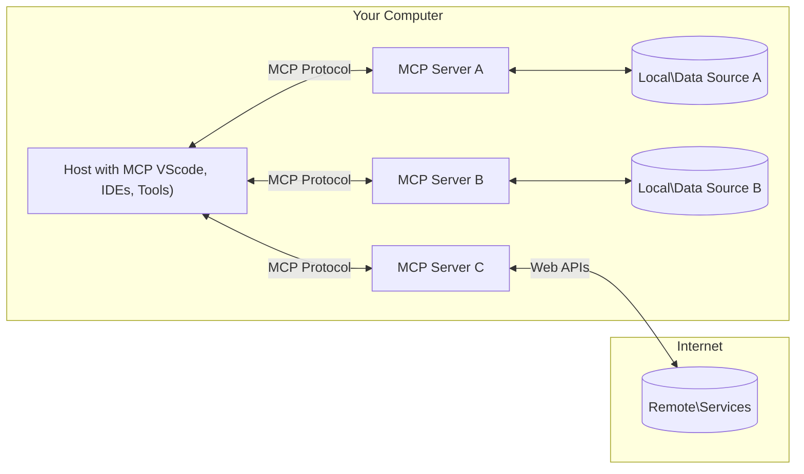

<!--
CO_OP_TRANSLATOR_METADATA:
{
  "original_hash": "355b12a5970c5c9e6db0bee970c751ba",
  "translation_date": "2025-07-04T17:09:37+00:00",
  "source_file": "01-CoreConcepts/README.md",
  "language_code": "pl"
}
-->
# 📖 Podstawowe Koncepcje MCP: Opanowanie Model Context Protocol dla Integracji AI

[Model Context Protocol (MCP)](https://github.com/modelcontextprotocol) to potężne, ustandaryzowane ramy, które optymalizują komunikację między dużymi modelami językowymi (LLM) a zewnętrznymi narzędziami, aplikacjami i źródłami danych. Ten przewodnik zoptymalizowany pod kątem SEO przeprowadzi Cię przez kluczowe koncepcje MCP, zapewniając zrozumienie architektury klient-serwer, podstawowych komponentów, mechanizmów komunikacji oraz najlepszych praktyk implementacyjnych.

## Przegląd

Ta lekcja omawia podstawową architekturę i komponenty tworzące ekosystem Model Context Protocol (MCP). Poznasz architekturę klient-serwer, kluczowe elementy oraz mechanizmy komunikacji, które napędzają interakcje MCP.

## 👩‍🎓 Kluczowe Cele Nauki

Po ukończeniu tej lekcji będziesz potrafił:

- Zrozumieć architekturę klient-serwer MCP.
- Zidentyfikować role i obowiązki Hostów, Klientów i Serwerów.
- Przeanalizować podstawowe cechy, które czynią MCP elastyczną warstwą integracyjną.
- Poznać przepływ informacji w ekosystemie MCP.
- Zdobyć praktyczną wiedzę dzięki przykładom kodu w .NET, Java, Python i JavaScript.

## 🔎 Architektura MCP: Głębsze Spojrzenie

Ekosystem MCP opiera się na modelu klient-serwer. Ta modułowa struktura pozwala aplikacjom AI efektywnie współdziałać z narzędziami, bazami danych, API i zasobami kontekstowymi. Rozbijmy tę architekturę na jej podstawowe komponenty.

W swojej istocie MCP stosuje architekturę klient-serwer, gdzie aplikacja hostująca może łączyć się z wieloma serwerami:



- **MCP Hosts**: Programy takie jak VSCode, Claude Desktop, IDE lub narzędzia AI, które chcą uzyskać dostęp do danych przez MCP
- **MCP Clients**: Klienci protokołu utrzymujący połączenia 1:1 z serwerami
- **MCP Servers**: Lekkie programy, które udostępniają konkretne funkcje za pomocą ustandaryzowanego Model Context Protocol
- **Lokalne Źródła Danych**: Pliki, bazy danych i usługi na Twoim komputerze, do których serwery MCP mają bezpieczny dostęp
- **Zdalne Usługi**: Zewnętrzne systemy dostępne przez internet, z którymi serwery MCP łączą się przez API.

Protokół MCP to rozwijający się standard — najnowsze aktualizacje znajdziesz w [specyfikacji protokołu](https://modelcontextprotocol.io/specification/2025-06-18/)

### 1. Hosty

W Model Context Protocol (MCP) Hosty odgrywają kluczową rolę jako główny interfejs, przez który użytkownicy wchodzą w interakcję z protokołem. Hosty to aplikacje lub środowiska inicjujące połączenia z serwerami MCP, aby uzyskać dostęp do danych, narzędzi i promptów. Przykładami Hostów są zintegrowane środowiska programistyczne (IDE) takie jak Visual Studio Code, narzędzia AI jak Claude Desktop czy niestandardowe agenty stworzone do konkretnych zadań.

**Hosty** to aplikacje LLM, które inicjują połączenia. One:

- Wykonują lub współdziałają z modelami AI, generując odpowiedzi.
- Inicjują połączenia z serwerami MCP.
- Zarządzają przepływem rozmowy i interfejsem użytkownika.
- Kontrolują uprawnienia i ograniczenia bezpieczeństwa.
- Obsługują zgodę użytkownika na udostępnianie danych i wykonywanie narzędzi.

### 2. Klienci

Klienci to kluczowe komponenty ułatwiające interakcję między Hostami a serwerami MCP. Działają jako pośrednicy, umożliwiając Hostom dostęp i korzystanie z funkcji oferowanych przez serwery MCP. Pełnią ważną rolę w zapewnieniu płynnej komunikacji i efektywnej wymiany danych w architekturze MCP.

**Klienci** to konektory w aplikacji hosta. Oni:

- Wysyłają żądania do serwerów z promptami/instrukcjami.
- Negocjują możliwości z serwerami.
- Zarządzają żądaniami wykonania narzędzi od modeli.
- Przetwarzają i wyświetlają odpowiedzi użytkownikom.

### 3. Serwery

Serwery odpowiadają za obsługę żądań od klientów MCP i dostarczanie odpowiednich odpowiedzi. Zarządzają różnymi operacjami, takimi jak pobieranie danych, wykonywanie narzędzi i generowanie promptów. Serwery zapewniają, że komunikacja między klientami a Hostami jest efektywna i niezawodna, utrzymując integralność procesu interakcji.

**Serwery** to usługi dostarczające kontekst i funkcje. One:

- Rejestrują dostępne funkcje (zasoby, prompt, narzędzia)
- Odbierają i wykonują wywołania narzędzi od klienta
- Dostarczają informacje kontekstowe wzbogacające odpowiedzi modelu
- Zwracają wyniki do klienta
- Utrzymują stan podczas interakcji, gdy jest to potrzebne

Serwery mogą być tworzone przez każdego, kto chce rozszerzyć możliwości modelu o specjalistyczną funkcjonalność.

### 4. Funkcje Serwera

Serwery w Model Context Protocol (MCP) dostarczają podstawowe elementy umożliwiające bogate interakcje między klientami, hostami i modelami językowymi. Funkcje te mają na celu zwiększenie możliwości MCP poprzez oferowanie ustrukturyzowanego kontekstu, narzędzi i promptów.

Serwery MCP mogą oferować dowolne z następujących funkcji:

#### 📑 Zasoby

Zasoby w Model Context Protocol (MCP) obejmują różne typy kontekstu i danych, które mogą być wykorzystywane przez użytkowników lub modele AI. Należą do nich:

- **Dane kontekstowe**: Informacje i kontekst, które użytkownicy lub modele AI mogą wykorzystać do podejmowania decyzji i realizacji zadań.
- **Bazy wiedzy i repozytoria dokumentów**: Zbiory danych strukturalnych i niestrukturalnych, takie jak artykuły, podręczniki i prace naukowe, dostarczające cennych informacji.
- **Lokalne pliki i bazy danych**: Dane przechowywane lokalnie na urządzeniach lub w bazach danych, dostępne do przetwarzania i analizy.
- **API i usługi sieciowe**: Zewnętrzne interfejsy i usługi oferujące dodatkowe dane i funkcje, umożliwiające integrację z różnymi zasobami i narzędziami online.

Przykładem zasobu może być schemat bazy danych lub plik, do którego można uzyskać dostęp w następujący sposób:

```text
file://log.txt
database://schema
```

### 🤖 Prompty

Prompty w Model Context Protocol (MCP) obejmują różne predefiniowane szablony i wzorce interakcji, zaprojektowane, aby usprawnić przepływ pracy użytkownika i poprawić komunikację. Należą do nich:

- **Szablonowe wiadomości i procesy**: Wstępnie ustrukturyzowane wiadomości i procesy, które prowadzą użytkowników przez konkretne zadania i interakcje.
- **Predefiniowane wzorce interakcji**: Standardowe sekwencje działań i odpowiedzi, które ułatwiają spójną i efektywną komunikację.
- **Specjalistyczne szablony rozmów**: Dostosowywalne szablony przeznaczone do określonych typów konwersacji, zapewniające odpowiednie i kontekstowe interakcje.

Szablon promptu może wyglądać tak:

```markdown
Generate a product slogan based on the following {{product}} with the following {{keywords}}
```

#### ⛏️ Narzędzia

Narzędzia w Model Context Protocol (MCP) to funkcje, które model AI może wykonać, aby zrealizować konkretne zadania. Narzędzia te mają na celu zwiększenie możliwości modelu AI poprzez dostarczanie ustrukturyzowanych i niezawodnych operacji. Kluczowe aspekty to:

- **Funkcje do wykonania przez model AI**: Narzędzia to wykonywalne funkcje, które model AI może wywołać, aby zrealizować różne zadania.
- **Unikalna nazwa i opis**: Każde narzędzie ma unikalną nazwę oraz szczegółowy opis wyjaśniający jego cel i funkcjonalność.
- **Parametry i wyniki**: Narzędzia przyjmują określone parametry i zwracają ustrukturyzowane wyniki, zapewniając spójne i przewidywalne efekty.
- **Funkcje dyskretne**: Narzędzia wykonują konkretne funkcje, takie jak wyszukiwanie w sieci, obliczenia czy zapytania do bazy danych.

Przykładowe narzędzie może wyglądać tak:

```typescript
server.tool(
  "GetProducts",
  {
    pageSize: z.string().optional(),
    pageCount: z.string().optional()
  }, () => {
    // return results from API
  }
)
```

## Funkcje Klienta

W Model Context Protocol (MCP) klienci oferują serwerom kilka kluczowych funkcji, które zwiększają ogólną funkcjonalność i interakcję w protokole. Jedną z wyróżniających się funkcji jest Sampling.

### 👉 Sampling

- **Agentowe zachowania inicjowane przez serwer**: Klienci umożliwiają serwerom autonomiczne inicjowanie określonych działań lub zachowań, zwiększając dynamiczne możliwości systemu.
- **Rekurencyjne interakcje z LLM**: Ta funkcja pozwala na rekurencyjne interakcje z dużymi modelami językowymi (LLM), umożliwiając bardziej złożone i iteracyjne przetwarzanie zadań.
- **Żądanie dodatkowych uzupełnień modelu**: Serwery mogą prosić o dodatkowe uzupełnienia od modelu, zapewniając, że odpowiedzi są wyczerpujące i kontekstowo adekwatne.

## Przepływ Informacji w MCP

Model Context Protocol (MCP) definiuje ustrukturyzowany przepływ informacji między hostami, klientami, serwerami i modelami. Zrozumienie tego przepływu pomaga wyjaśnić, jak przetwarzane są żądania użytkowników oraz jak zewnętrzne narzędzia i dane są integrowane z odpowiedziami modelu.

- **Host inicjuje połączenie**  
  Aplikacja hostująca (np. IDE lub interfejs czatu) nawiązuje połączenie z serwerem MCP, zwykle przez STDIO, WebSocket lub inny obsługiwany transport.

- **Negocjacja możliwości**  
  Klient (osadzony w hoście) i serwer wymieniają informacje o obsługiwanych funkcjach, narzędziach, zasobach i wersjach protokołu. Zapewnia to, że obie strony rozumieją dostępne możliwości sesji.

- **Żądanie użytkownika**  
  Użytkownik wchodzi w interakcję z hostem (np. wpisuje prompt lub polecenie). Host zbiera to wejście i przekazuje je do klienta do przetworzenia.

- **Użycie zasobu lub narzędzia**  
  - Klient może poprosić serwer o dodatkowy kontekst lub zasoby (np. pliki, wpisy w bazie danych lub artykuły z bazy wiedzy), aby wzbogacić zrozumienie modelu.
  - Jeśli model uzna, że potrzebne jest narzędzie (np. do pobrania danych, wykonania obliczeń lub wywołania API), klient wysyła do serwera żądanie wywołania narzędzia, podając nazwę narzędzia i parametry.

- **Wykonanie przez serwer**  
  Serwer odbiera żądanie zasobu lub narzędzia, wykonuje niezbędne operacje (np. uruchamia funkcję, wykonuje zapytanie do bazy danych lub pobiera plik) i zwraca wyniki do klienta w ustrukturyzowanym formacie.

- **Generowanie odpowiedzi**  
  Klient integruje odpowiedzi serwera (dane zasobów, wyniki narzędzi itp.) z trwającą interakcją modelu. Model wykorzystuje te informacje do wygenerowania kompleksowej i kontekstowo adekwatnej odpowiedzi.

- **Prezentacja wyniku**  
  Host otrzymuje ostateczny wynik od klienta i prezentuje go użytkownikowi, często zawierając zarówno tekst wygenerowany przez model, jak i wyniki wykonania narzędzi lub wyszukiwania zasobów.

Ten przepływ umożliwia MCP wspieranie zaawansowanych, interaktywnych i świadomych kontekstu aplikacji AI poprzez płynne łączenie modeli z zewnętrznymi narzędziami i źródłami danych.

## Szczegóły Protokołu

MCP (Model Context Protocol) opiera się na [JSON-RPC 2.0](https://www.jsonrpc.org/), dostarczając ustandaryzowany, niezależny od języka format wiadomości do komunikacji między hostami, klientami i serwerami. Ta podstawa umożliwia niezawodne, ustrukturyzowane i rozszerzalne interakcje na różnych platformach i w różnych językach programowania.

### Kluczowe Funkcje Protokołu

MCP rozszerza JSON-RPC 2.0 o dodatkowe konwencje dotyczące wywoływania narzędzi, dostępu do zasobów i zarządzania promptami. Obsługuje wiele warstw transportu (STDIO, WebSocket, SSE) i umożliwia bezpieczną, rozszerzalną oraz niezależną od języka komunikację między komponentami.

#### 🧢 Protokół Bazowy

- **Format wiadomości JSON-RPC**: Wszystkie żądania i odpowiedzi korzystają ze specyfikacji JSON-RPC 2.0, zapewniając spójną strukturę wywołań metod, parametrów, wyników i obsługi błędów.
- **Połączenia stanowe**: Sesje MCP utrzymują stan przez wiele żądań, wspierając trwające rozmowy, akumulację kontekstu i zarządzanie zasobami.
- **Negocjacja możliwości**: Podczas nawiązywania połączenia klienci i serwery wymieniają informacje o obsługiwanych funkcjach, wersjach protokołu, dostępnych narzędziach i zasobach. Zapewnia to wzajemne zrozumienie możliwości i możliwość dostosowania.

#### ➕ Dodatkowe Narzędzia

Poniżej kilka dodatkowych narzędzi i rozszerzeń protokołu, które MCP oferuje, aby poprawić doświadczenie deweloperskie i umożliwić zaawansowane scenariusze:

- **Opcje konfiguracji**: MCP pozwala na dynamiczną konfigurację parametrów sesji, takich jak uprawnienia narzędzi, dostęp do zasobów i ustawienia modelu, dostosowane do każdej interakcji.
- **Śledzenie postępu**: Operacje długotrwałe mogą raportować aktualizacje postępu, umożliwiając responsywne interfejsy użytkownika i lepsze doświadczenie podczas złożonych zadań.
- **Anulowanie żądań**: Klienci mogą anulować trwające żądania, pozwalając użytkownikom przerwać operacje, które nie są już potrzebne lub trwają zbyt długo.
- **Raportowanie błędów**: Ustandaryzowane komunikaty i kody błędów pomagają diagnozować problemy, obsługiwać awarie w sposób łagodny i dostarczać użyteczne informacje zwrotne użytkownikom i deweloperom.
- **Logowanie**: Zarówno klienci, jak i serwery mogą generować ustrukturyzowane logi do audytu, debugowania i monitorowania interakcji protokołu.

Wykorzystując te funkcje protokołu, MCP zapewnia solidną, bezpieczną i elastyczną komunikację między modelami językowymi a zewnętrznymi narzędziami lub źródłami danych.

### 🔐 Aspekty Bezpieczeństwa

Implementacje MCP powinny przestrzegać kilku kluczowych zasad bezpieczeństwa, aby zapewnić bezpieczne i godne zaufania interakcje:

- **Zgoda i kontrola użytkownika**: Użytkownicy muszą wyrazić wyraźną zgodę przed uzyskaniem dostępu do danych lub wykonaniem operacji. Powinni mieć jasną kontrolę nad tym, jakie dane są udostępniane i które działania są autoryzowane, wspieraną przez intuicyjne interfejsy do przeglądu i zatwierdzania działań.

- **Prywatność danych**: Dane użytkownika powinny być udostępniane tylko za wyraźną zgodą i chronione odpowiednimi mechanizmami kontroli dostępu. Implementacje MCP muszą zabezpieczać przed nieautoryzowanym przesyłaniem danych i zapewniać ochronę prywatności we wszystkich interakcjach.

- **Bez
MCP zawiera kilka wbudowanych koncepcji i mechanizmów zarządzania bezpieczeństwem i autoryzacją w całym protokole:

1. **Kontrola uprawnień narzędzi**:  
  Klienci mogą określić, z których narzędzi model może korzystać podczas sesji. Zapewnia to dostęp tylko do wyraźnie autoryzowanych narzędzi, co zmniejsza ryzyko niezamierzonych lub niebezpiecznych operacji. Uprawnienia można konfigurować dynamicznie, w zależności od preferencji użytkownika, polityk organizacyjnych lub kontekstu interakcji.

2. **Uwierzytelnianie**:  
  Serwery mogą wymagać uwierzytelnienia przed udzieleniem dostępu do narzędzi, zasobów lub wrażliwych operacji. Może to obejmować klucze API, tokeny OAuth lub inne schematy uwierzytelniania. Właściwe uwierzytelnianie gwarantuje, że tylko zaufani klienci i użytkownicy mogą korzystać z funkcji po stronie serwera.

3. **Walidacja**:  
  Walidacja parametrów jest wymagana przy każdym wywołaniu narzędzia. Każde narzędzie definiuje oczekiwane typy, formaty i ograniczenia dla swoich parametrów, a serwer weryfikuje przychodzące żądania zgodnie z tymi zasadami. Zapobiega to przekazywaniu niepoprawnych lub złośliwych danych do implementacji narzędzi i pomaga utrzymać integralność operacji.

4. **Ograniczanie liczby wywołań (Rate Limiting)**:  
  Aby zapobiec nadużyciom i zapewnić sprawiedliwe korzystanie z zasobów serwera, serwery MCP mogą wprowadzać ograniczenia liczby wywołań narzędzi i dostępu do zasobów. Limity mogą być stosowane na użytkownika, sesję lub globalnie, co chroni przed atakami typu denial-of-service lub nadmiernym zużyciem zasobów.

Łącząc te mechanizmy, MCP zapewnia bezpieczną podstawę do integracji modeli językowych z zewnętrznymi narzędziami i źródłami danych, jednocześnie dając użytkownikom i deweloperom precyzyjną kontrolę nad dostępem i użytkowaniem.

## Wiadomości protokołu

Komunikacja MCP wykorzystuje ustrukturyzowane wiadomości w formacie JSON, aby umożliwić jasne i niezawodne interakcje między klientami, serwerami i modelami. Główne typy wiadomości to:

- **Żądanie klienta**  
  Wysyłane z klienta do serwera, zazwyczaj zawiera:
  - Polecenie lub zapytanie użytkownika
  - Historię rozmowy dla kontekstu
  - Konfigurację narzędzi i uprawnienia
  - Dodatkowe metadane lub informacje o sesji

- **Odpowiedź modelu**  
  Zwracana przez model (za pośrednictwem klienta), zawiera:
  - Wygenerowany tekst lub uzupełnienie na podstawie zapytania i kontekstu
  - Opcjonalne instrukcje wywołania narzędzia, jeśli model uzna, że należy je wywołać
  - Odniesienia do zasobów lub dodatkowego kontekstu w razie potrzeby

- **Żądanie narzędzia**  
  Wysyłane z klienta do serwera, gdy trzeba wykonać narzędzie. Ta wiadomość zawiera:
  - Nazwę narzędzia do wywołania
  - Parametry wymagane przez narzędzie (zweryfikowane względem schematu narzędzia)
  - Informacje kontekstowe lub identyfikatory do śledzenia żądania

- **Odpowiedź narzędzia**  
  Zwracana przez serwer po wykonaniu narzędzia. Ta wiadomość zawiera:
  - Wyniki wykonania narzędzia (ustrukturyzowane dane lub treść)
  - Ewentualne błędy lub informacje o statusie, jeśli wywołanie narzędzia się nie powiodło
  - Opcjonalnie dodatkowe metadane lub logi związane z wykonaniem

Te ustrukturyzowane wiadomości zapewniają, że każdy etap w przepływie MCP jest jasny, możliwy do śledzenia i rozszerzalny, wspierając zaawansowane scenariusze, takie jak wieloetapowe rozmowy, łączenie narzędzi i solidne obsługiwanie błędów.

## Najważniejsze informacje

- MCP wykorzystuje architekturę klient-serwer do łączenia modeli z zewnętrznymi funkcjonalnościami
- Ekosystem składa się z klientów, hostów, serwerów, narzędzi i źródeł danych
- Komunikacja może odbywać się przez STDIO, SSE lub WebSockets
- Narzędzia to podstawowe jednostki funkcjonalności udostępniane modelom
- Ustrukturyzowane protokoły komunikacyjne zapewniają spójne interakcje

## Ćwiczenie

Zaprojektuj proste narzędzie MCP, które byłoby przydatne w Twojej dziedzinie. Określ:
1. Jaką nazwę miałoby narzędzie
2. Jakie parametry by przyjmowało
3. Jakie wyniki by zwracało
4. Jak model mógłby używać tego narzędzia do rozwiązywania problemów użytkowników


---

## Co dalej

Następny rozdział: [Chapter 2: Security](../02-Security/README.md)

**Zastrzeżenie**:  
Niniejszy dokument został przetłumaczony za pomocą usługi tłumaczenia AI [Co-op Translator](https://github.com/Azure/co-op-translator). Mimo że dążymy do jak największej dokładności, prosimy mieć na uwadze, że automatyczne tłumaczenia mogą zawierać błędy lub nieścisłości. Oryginalny dokument w języku źródłowym powinien być uznawany za źródło autorytatywne. W przypadku informacji o kluczowym znaczeniu zalecane jest skorzystanie z profesjonalnego tłumaczenia wykonanego przez człowieka. Nie ponosimy odpowiedzialności za jakiekolwiek nieporozumienia lub błędne interpretacje wynikające z korzystania z tego tłumaczenia.