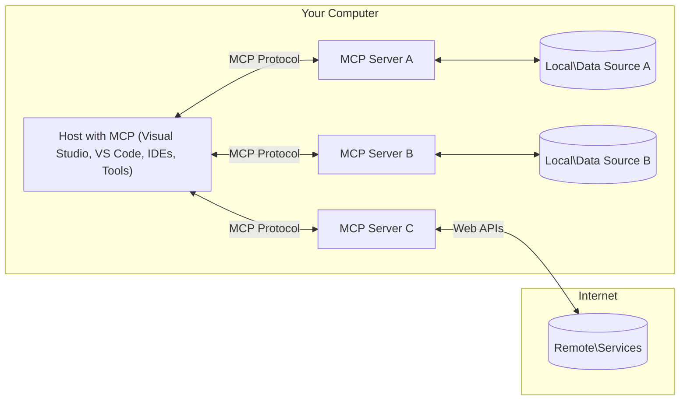

<!--
CO_OP_TRANSLATOR_METADATA:
{
  "original_hash": "904b59de1de9264801242d90a42cdd9d",
  "translation_date": "2025-09-05T10:57:44+00:00",
  "source_file": "01-CoreConcepts/README.md",
  "language_code": "pl"
}
-->
# MCP Podstawowe Koncepcje: Opanowanie Protokółu Kontekstowego Modelu dla Integracji AI

[](https://youtu.be/earDzWGtE84)

_(Kliknij obrazek powyżej, aby obejrzeć wideo z tej lekcji)_

[Model Context Protocol (MCP)](https://github.com/modelcontextprotocol) to potężne, znormalizowane ramy, które optymalizują komunikację między dużymi modelami językowymi (LLM) a zewnętrznymi narzędziami, aplikacjami i źródłami danych.  
Ten przewodnik przeprowadzi Cię przez podstawowe koncepcje MCP. Dowiesz się o jego architekturze klient-serwer, kluczowych komponentach, mechanice komunikacji i najlepszych praktykach wdrożeniowych.

- **Wyraźna zgoda użytkownika**: Wszystkie operacje i dostęp do danych wymagają wyraźnej zgody użytkownika przed ich wykonaniem. Użytkownicy muszą dokładnie rozumieć, jakie dane będą dostępne i jakie działania zostaną podjęte, z możliwością szczegółowego zarządzania uprawnieniami i autoryzacjami.

- **Ochrona prywatności danych**: Dane użytkownika są ujawniane wyłącznie za jego wyraźną zgodą i muszą być chronione przez solidne mechanizmy kontroli dostępu przez cały cykl interakcji. Implementacje muszą zapobiegać nieautoryzowanemu przesyłaniu danych i utrzymywać ścisłe granice prywatności.

- **Bezpieczeństwo wykonywania narzędzi**: Każde wywołanie narzędzia wymaga wyraźnej zgody użytkownika oraz jasnego zrozumienia funkcjonalności narzędzia, parametrów i potencjalnych skutków. Solidne granice bezpieczeństwa muszą zapobiegać niezamierzonym, niebezpiecznym lub złośliwym działaniom narzędzi.

- **Bezpieczeństwo warstwy transportowej**: Wszystkie kanały komunikacyjne powinny korzystać z odpowiednich mechanizmów szyfrowania i uwierzytelniania. Połączenia zdalne powinny implementować bezpieczne protokoły transportowe i właściwe zarządzanie poświadczeniami.

#### Wytyczne dotyczące wdrożenia:

- **Zarządzanie uprawnieniami**: Wdrożenie systemów uprawnień o wysokiej szczegółowości, które pozwalają użytkownikom kontrolować dostęp do serwerów, narzędzi i zasobów  
- **Uwierzytelnianie i autoryzacja**: Korzystanie z bezpiecznych metod uwierzytelniania (OAuth, klucze API) z odpowiednim zarządzaniem tokenami i ich wygaśnięciem  
- **Walidacja danych wejściowych**: Walidacja wszystkich parametrów i danych wejściowych zgodnie z określonymi schematami, aby zapobiec atakom typu injection  
- **Rejestrowanie audytowe**: Prowadzenie kompleksowych logów wszystkich operacji w celu monitorowania bezpieczeństwa i zgodności

## Przegląd

Ta lekcja bada podstawową architekturę i komponenty, które tworzą ekosystem Model Context Protocol (MCP). Dowiesz się o architekturze klient-serwer, kluczowych komponentach i mechanizmach komunikacji, które napędzają interakcje MCP.

## Kluczowe cele nauki

Po ukończeniu tej lekcji będziesz:

- Rozumieć architekturę klient-serwer MCP.  
- Identyfikować role i odpowiedzialności Hostów, Klientów i Serwerów.  
- Analizować kluczowe cechy, które czynią MCP elastyczną warstwą integracyjną.  
- Poznawać przepływ informacji w ekosystemie MCP.  
- Zdobywać praktyczne wskazówki dzięki przykładom kodu w .NET, Java, Python i JavaScript.

## Architektura MCP: Szczegółowe spojrzenie

Ekosystem MCP opiera się na modelu klient-serwer. Ta modułowa struktura pozwala aplikacjom AI efektywnie współpracować z narzędziami, bazami danych, API i zasobami kontekstowymi. Rozłóżmy tę architekturę na jej kluczowe komponenty.

W swojej istocie MCP stosuje architekturę klient-serwer, gdzie aplikacja hostująca może łączyć się z wieloma serwerami:



- **Hosty MCP**: Programy takie jak VSCode, Claude Desktop, IDE czy narzędzia AI, które chcą uzyskać dostęp do danych za pomocą MCP  
- **Klienci MCP**: Klienci protokołu utrzymujący połączenia 1:1 z serwerami  
- **Serwery MCP**: Lekkie programy, które udostępniają określone funkcje za pomocą znormalizowanego Model Context Protocol  
- **Lokalne źródła danych**: Pliki, bazy danych i usługi na Twoim komputerze, do których serwery MCP mogą bezpiecznie uzyskać dostęp  
- **Usługi zdalne**: Zewnętrzne systemy dostępne przez internet, z którymi serwery MCP mogą się łączyć za pomocą API.

Protokół MCP to ewoluujący standard wykorzystujący wersjonowanie oparte na dacie (format YYYY-MM-DD). Obecna wersja protokołu to **2025-06-18**. Najnowsze aktualizacje specyfikacji protokołu znajdziesz [tutaj](https://modelcontextprotocol.io/specification/2025-06-18/).

### 1. Hosty

W Model Context Protocol (MCP) **Hosty** to aplikacje AI, które pełnią rolę głównego interfejsu, za pomocą którego użytkownicy wchodzą w interakcję z protokołem. Hosty koordynują i zarządzają połączeniami z wieloma serwerami MCP, tworząc dedykowanych klientów MCP dla każdego połączenia z serwerem. Przykłady Hostów to:

- **Aplikacje AI**: Claude Desktop, Visual Studio Code, Claude Code  
- **Środowiska programistyczne**: IDE i edytory kodu z integracją MCP  
- **Aplikacje niestandardowe**: Dedykowane agenty AI i narzędzia  

**Hosty** to aplikacje, które koordynują interakcje z modelami AI. Ich zadania to:

- **Orkiestracja modeli AI**: Wykonywanie lub interakcja z LLM w celu generowania odpowiedzi i koordynacji przepływów pracy AI  
- **Zarządzanie połączeniami klientów**: Tworzenie i utrzymywanie jednego klienta MCP na każde połączenie z serwerem MCP  
- **Kontrola interfejsu użytkownika**: Obsługa przepływu rozmowy, interakcji użytkownika i prezentacji odpowiedzi  
- **Egzekwowanie bezpieczeństwa**: Zarządzanie uprawnieniami, ograniczeniami bezpieczeństwa i uwierzytelnianiem  
- **Obsługa zgody użytkownika**: Zarządzanie zgodą użytkownika na udostępnianie danych i wykonywanie narzędzi  

### 2. Klienci

**Klienci** to kluczowe komponenty, które utrzymują dedykowane połączenia jeden-do-jednego między Hostami a serwerami MCP. Każdy klient MCP jest inicjowany przez Host w celu połączenia się z określonym serwerem MCP, zapewniając uporządkowane i bezpieczne kanały komunikacji. Wielu klientów umożliwia Hostom jednoczesne łączenie się z wieloma serwerami.

**Klienci** to komponenty łączące w aplikacji hostującej. Ich zadania to:

- **Komunikacja protokołowa**: Wysyłanie żądań JSON-RPC 2.0 do serwerów z podpowiedziami i instrukcjami  
- **Negocjacja możliwości**: Ustalanie obsługiwanych funkcji i wersji protokołu z serwerami podczas inicjalizacji  
- **Wykonywanie narzędzi**: Zarządzanie żądaniami wykonania narzędzi od modeli i przetwarzanie odpowiedzi  
- **Aktualizacje w czasie rzeczywistym**: Obsługa powiadomień i aktualizacji w czasie rzeczywistym od serwerów  
- **Przetwarzanie odpowiedzi**: Przetwarzanie i formatowanie odpowiedzi serwera do wyświetlenia użytkownikom  

### 3. Serwery

**Serwery** to programy, które dostarczają kontekst, narzędzia i możliwości klientom MCP. Mogą działać lokalnie (na tym samym urządzeniu co Host) lub zdalnie (na platformach zewnętrznych) i są odpowiedzialne za obsługę żądań klientów oraz dostarczanie ustrukturyzowanych odpowiedzi. Serwery udostępniają określone funkcje za pomocą znormalizowanego Model Context Protocol.

**Serwery** to usługi dostarczające kontekst i możliwości. Ich zadania to:

- **Rejestracja funkcji**: Rejestrowanie i udostępnianie dostępnych prymitywów (zasobów, podpowiedzi, narzędzi) klientom  
- **Przetwarzanie żądań**: Odbieranie i wykonywanie wywołań narzędzi, żądań zasobów i podpowiedzi od klientów  
- **Dostarczanie kontekstu**: Udostępnianie informacji kontekstowych i danych w celu ulepszenia odpowiedzi modelu  
- **Zarządzanie stanem**: Utrzymywanie stanu sesji i obsługa interakcji stanowych, gdy jest to wymagane  
- **Powiadomienia w czasie rzeczywistym**: Wysyłanie powiadomień o zmianach możliwości i aktualizacjach do połączonych klientów  

Serwery mogą być rozwijane przez dowolnego użytkownika w celu rozszerzenia możliwości modeli o specjalistyczne funkcje i obsługują zarówno lokalne, jak i zdalne scenariusze wdrożenia.

### 4. Prymitywy serwera

Serwery w Model Context Protocol (MCP) dostarczają trzy podstawowe **prymitywy**, które definiują fundamentalne elementy budulcowe dla bogatych interakcji między klientami, hostami i modelami językowymi. Te prymitywy określają rodzaje informacji kontekstowych i działań dostępnych za pośrednictwem protokołu.

Serwery MCP mogą udostępniać dowolną kombinację następujących trzech podstawowych prymitywów:

#### Zasoby

**Zasoby** to źródła danych dostarczające informacji kontekstowych aplikacjom AI. Reprezentują one statyczne lub dynamiczne treści, które mogą ulepszyć zrozumienie i podejmowanie decyzji przez model:

- **Dane kontekstowe**: Ustrukturyzowane informacje i kontekst do konsumpcji przez model AI  
- **Bazy wiedzy**: Repozytoria dokumentów, artykuły, podręczniki i prace badawcze  
- **Lokalne źródła danych**: Pliki, bazy danych i informacje systemowe  
- **Dane zewnętrzne**: Odpowiedzi API, usługi internetowe i dane zdalnych systemów  
- **Treści dynamiczne**: Dane w czasie rzeczywistym, które aktualizują się w zależności od warunków zewnętrznych  

Zasoby są identyfikowane za pomocą URI i obsługują odkrywanie za pomocą metod `resources/list` oraz pobieranie za pomocą `resources/read`:

```text
file://documents/project-spec.md
database://production/users/schema
api://weather/current
```

#### Podpowiedzi

**Podpowiedzi** to wielokrotnego użytku szablony, które pomagają strukturyzować interakcje z modelami językowymi. Dostarczają one znormalizowane wzorce interakcji i szablony przepływów pracy:

- **Interakcje oparte na szablonach**: Wstępnie ustrukturyzowane wiadomości i rozpoczęcia rozmów  
- **Szablony przepływów pracy**: Znormalizowane sekwencje dla typowych zadań i interakcji  
- **Przykłady few-shot**: Szablony oparte na przykładach do instrukcji dla modelu  
- **Podpowiedzi systemowe**: Podstawowe podpowiedzi definiujące zachowanie i kontekst modelu  
- **Szablony dynamiczne**: Podpowiedzi z parametrami dostosowującymi się do określonych kontekstów  

Podpowiedzi obsługują podstawianie zmiennych i mogą być odkrywane za pomocą `prompts/list` oraz pobierane za pomocą `prompts/get`:

```markdown
Generate a {{task_type}} for {{product}} targeting {{audience}} with the following requirements: {{requirements}}
```

#### Narzędzia

**Narzędzia** to wykonywalne funkcje, które modele AI mogą wywoływać w celu wykonania określonych działań. Reprezentują one "czasowniki" ekosystemu MCP, umożliwiając modelom interakcję z zewnętrznymi systemami:

- **Funkcje wykonywalne**: Oddzielne operacje, które modele mogą wywoływać z określonymi parametrami  
- **Integracja z systemami zewnętrznymi**: Wywołania API, zapytania do baz danych, operacje na plikach, obliczenia  
- **Unikalna tożsamość**: Każde narzędzie ma unikalną nazwę, opis i schemat parametrów  
- **Ustrukturyzowane I/O**: Narzędzia akceptują zweryfikowane parametry i zwracają ustrukturyzowane, typowane odpowiedzi  
- **Możliwości działania**: Umożliwiają modelom wykonywanie rzeczywistych działań i pobieranie danych na żywo  

Narzędzia są definiowane za pomocą JSON Schema do walidacji parametrów, odkrywane za pomocą `tools/list` i wykonywane za pomocą `tools/call`:

```typescript
server.tool(
  "search_products", 
  {
    query: z.string().describe("Search query for products"),
    category: z.string().optional().describe("Product category filter"),
    max_results: z.number().default(10).describe("Maximum results to return")
  }, 
  async (params) => {
    // Execute search and return structured results
    return await productService.search(params);
  }
);
```

## Prymitywy klienta

W Model Context Protocol (MCP) **klienci** mogą udostępniać prymitywy, które umożliwiają serwerom żądanie dodatkowych możliwości od aplikacji hostującej. Te prymitywy po stronie klienta pozwalają na bogatsze, bardziej interaktywne implementacje serwerów, które mogą uzyskać dostęp do możliwości modeli AI i interakcji użytkownika.

### Próbkowanie

**Próbkowanie** pozwala serwerom żądać uzupełnień modelu językowego od aplikacji AI klienta. Ten prymityw umożliwia serwerom dostęp do możliwości LLM bez wbudowywania własnych zależności modelowych:

- **Dostęp niezależny od modelu**: Serwery mogą żądać uzupełnień bez uwzględniania SDK LLM lub zarządzania dostępem do modelu  
- **AI inicjowane przez serwer**: Umożliwia serwerom autonomiczne generowanie treści za pomocą modelu AI klienta  
- **Rekurencyjne interakcje LLM**: Obsługuje złożone scenariusze, w których serwery potrzebują pomocy AI do przetwarzania  
- **Generowanie treści dynamicznych**: Pozwala serwerom tworzyć odpowiedzi kontekstowe za pomocą modelu hosta  

Próbkowanie jest inicjowane za pomocą metody `sampling/complete`, gdzie serwery wysyłają żądania uzupełnień do klientów.

### Elicytacja  

**Elicytacja** umożliwia serwerom żądanie dodatkowych informacji lub potwierdzenia od użytkowników za pośrednictwem interfejsu klienta:

- **Żądania danych od użytkownika**: Serwery mogą prosić o dodatkowe informacje potrzebne do wykonania narzędzi  
- **Dialogi potwierdzające**: Żądanie zgody użytkownika na operacje wrażliwe lub mające duży wpływ  
- **Interaktywne przepływy pracy**: Umożliwienie serwerom tworzenia krok po kroku interakcji z użytkownikiem  
- **Dynamiczne zbieranie parametrów**: Zbieranie brakujących lub opcjonalnych parametrów podczas wykonywania narzędzi  

Żądania elicytacji są realizowane za pomocą metody `elicitation/request`, aby zbierać dane wejściowe użytkownika za pośrednictwem interfejsu klienta.

### Rejestrowanie

**Rejestrowanie** pozwala serwerom wysyłać ustrukturyzowane komunikaty logowania do klientów w celu debugowania, monitorowania i widoczności operacyjnej:

- **Wsparcie debugowania**: Umożliwia serwerom dostarczanie szczegółowych logów wykonania w celu rozwiązywania problemów  
- **Monitorowanie operacyjne**: Wysyłanie aktualizacji statusu i metryk wydajności do klientów  
- **Raportowanie błędów**: Dostarczanie szczegółowego kontekstu błędów i informacji diagnostycznych  
- **Ślady audytowe**: Tworzenie kompleksowych logów operacji serwera i podejmowanych decyzji  

Komunikaty logowania są wysyłane do klientów, aby zapewnić przejrzystość operacji serwera i ułatwić debugowanie.

## Przepływ informacji w MCP

Model Context Protocol (MCP) definiuje ustrukturyzowany przepływ informacji między hostami, klientami, serwerami i modelami. Zrozumienie tego przepływu pomaga wyjaśnić, jak przetwarzane są żądania użytkownika i jak nar
- **JSON-RPC 2.0 Protocol**: Cała komunikacja wykorzystuje standardowy format wiadomości JSON-RPC 2.0 do wywołań metod, odpowiedzi i powiadomień  
- **Zarządzanie cyklem życia**: Obsługuje inicjalizację połączenia, negocjację możliwości oraz zakończenie sesji między klientami a serwerami  
- **Prymitywy serwera**: Umożliwia serwerom dostarczanie podstawowej funkcjonalności za pomocą narzędzi, zasobów i szablonów  
- **Prymitywy klienta**: Umożliwia serwerom żądanie próbkowania z LLM, pozyskiwanie danych od użytkownika oraz wysyłanie wiadomości logów  
- **Powiadomienia w czasie rzeczywistym**: Obsługuje asynchroniczne powiadomienia o dynamicznych aktualizacjach bez konieczności odpytywania  

#### Kluczowe funkcje:

- **Negocjacja wersji protokołu**: Wykorzystuje wersjonowanie oparte na dacie (YYYY-MM-DD), aby zapewnić kompatybilność  
- **Odkrywanie możliwości**: Klienci i serwery wymieniają informacje o obsługiwanych funkcjach podczas inicjalizacji  
- **Sesje stanowe**: Utrzymuje stan połączenia w wielu interakcjach, zapewniając ciągłość kontekstu  

### Warstwa transportowa

**Warstwa transportowa** zarządza kanałami komunikacyjnymi, formatowaniem wiadomości i uwierzytelnianiem między uczestnikami MCP:

#### Obsługiwane mechanizmy transportowe:

1. **Transport STDIO**:
   - Wykorzystuje standardowe strumienie wejścia/wyjścia do bezpośredniej komunikacji procesów  
   - Optymalny dla procesów lokalnych na tej samej maszynie, bez obciążenia sieciowego  
   - Często używany w lokalnych implementacjach serwera MCP  

2. **Transport HTTP z możliwością strumieniowania**:
   - Wykorzystuje HTTP POST do wiadomości od klienta do serwera  
   - Opcjonalne zdarzenia wysyłane przez serwer (SSE) do strumieniowania od serwera do klienta  
   - Umożliwia komunikację zdalną z serwerami przez sieci  
   - Obsługuje standardowe uwierzytelnianie HTTP (tokeny dostępu, klucze API, niestandardowe nagłówki)  
   - MCP zaleca OAuth dla bezpiecznego uwierzytelniania opartego na tokenach  

#### Abstrakcja transportu:

Warstwa transportowa abstrahuje szczegóły komunikacji od warstwy danych, umożliwiając stosowanie tego samego formatu wiadomości JSON-RPC 2.0 we wszystkich mechanizmach transportowych. Dzięki tej abstrakcji aplikacje mogą płynnie przełączać się między serwerami lokalnymi a zdalnymi.

### Zagadnienia bezpieczeństwa

Implementacje MCP muszą przestrzegać kilku kluczowych zasad bezpieczeństwa, aby zapewnić bezpieczne, godne zaufania i zabezpieczone interakcje we wszystkich operacjach protokołu:

- **Zgoda i kontrola użytkownika**: Użytkownicy muszą wyrazić wyraźną zgodę przed uzyskaniem dostępu do danych lub wykonaniem operacji. Powinni mieć jasną kontrolę nad tym, jakie dane są udostępniane i jakie działania są autoryzowane, wspierane przez intuicyjne interfejsy użytkownika do przeglądania i zatwierdzania aktywności.

- **Prywatność danych**: Dane użytkownika powinny być ujawniane tylko za wyraźną zgodą i muszą być chronione odpowiednimi kontrolami dostępu. Implementacje MCP muszą zapobiegać nieautoryzowanej transmisji danych i zapewniać ochronę prywatności we wszystkich interakcjach.

- **Bezpieczeństwo narzędzi**: Przed użyciem jakiegokolwiek narzędzia wymagana jest wyraźna zgoda użytkownika. Użytkownicy powinni mieć jasne zrozumienie funkcjonalności każdego narzędzia, a solidne granice bezpieczeństwa muszą być egzekwowane, aby zapobiec niezamierzonym lub niebezpiecznym operacjom narzędzi.

Przestrzegając tych zasad bezpieczeństwa, MCP zapewnia zaufanie użytkowników, ochronę prywatności i bezpieczeństwo we wszystkich interakcjach protokołu, jednocześnie umożliwiając zaawansowane integracje AI.

## Przykłady kodu: Kluczowe komponenty

Poniżej znajdują się przykłady kodu w kilku popularnych językach programowania, które ilustrują, jak zaimplementować kluczowe komponenty serwera MCP i narzędzi.

### Przykład .NET: Tworzenie prostego serwera MCP z narzędziami

Oto praktyczny przykład kodu w .NET, który pokazuje, jak zaimplementować prosty serwer MCP z niestandardowymi narzędziami. Przykład demonstruje, jak definiować i rejestrować narzędzia, obsługiwać żądania oraz łączyć serwer za pomocą Model Context Protocol.

```csharp
using System;
using System.Threading.Tasks;
using ModelContextProtocol.Server;
using ModelContextProtocol.Server.Transport;
using ModelContextProtocol.Server.Tools;

public class WeatherServer
{
    public static async Task Main(string[] args)
    {
        // Create an MCP server
        var server = new McpServer(
            name: "Weather MCP Server",
            version: "1.0.0"
        );
        
        // Register our custom weather tool
        server.AddTool<string, WeatherData>("weatherTool", 
            description: "Gets current weather for a location",
            execute: async (location) => {
                // Call weather API (simplified)
                var weatherData = await GetWeatherDataAsync(location);
                return weatherData;
            });
        
        // Connect the server using stdio transport
        var transport = new StdioServerTransport();
        await server.ConnectAsync(transport);
        
        Console.WriteLine("Weather MCP Server started");
        
        // Keep the server running until process is terminated
        await Task.Delay(-1);
    }
    
    private static async Task<WeatherData> GetWeatherDataAsync(string location)
    {
        // This would normally call a weather API
        // Simplified for demonstration
        await Task.Delay(100); // Simulate API call
        return new WeatherData { 
            Temperature = 72.5,
            Conditions = "Sunny",
            Location = location
        };
    }
}

public class WeatherData
{
    public double Temperature { get; set; }
    public string Conditions { get; set; }
    public string Location { get; set; }
}
```

### Przykład Java: Komponenty serwera MCP

Ten przykład demonstruje ten sam serwer MCP i rejestrację narzędzi, co powyższy przykład .NET, ale zaimplementowany w Javie.

```java
import io.modelcontextprotocol.server.McpServer;
import io.modelcontextprotocol.server.McpToolDefinition;
import io.modelcontextprotocol.server.transport.StdioServerTransport;
import io.modelcontextprotocol.server.tool.ToolExecutionContext;
import io.modelcontextprotocol.server.tool.ToolResponse;

public class WeatherMcpServer {
    public static void main(String[] args) throws Exception {
        // Create an MCP server
        McpServer server = McpServer.builder()
            .name("Weather MCP Server")
            .version("1.0.0")
            .build();
            
        // Register a weather tool
        server.registerTool(McpToolDefinition.builder("weatherTool")
            .description("Gets current weather for a location")
            .parameter("location", String.class)
            .execute((ToolExecutionContext ctx) -> {
                String location = ctx.getParameter("location", String.class);
                
                // Get weather data (simplified)
                WeatherData data = getWeatherData(location);
                
                // Return formatted response
                return ToolResponse.content(
                    String.format("Temperature: %.1f°F, Conditions: %s, Location: %s", 
                    data.getTemperature(), 
                    data.getConditions(), 
                    data.getLocation())
                );
            })
            .build());
        
        // Connect the server using stdio transport
        try (StdioServerTransport transport = new StdioServerTransport()) {
            server.connect(transport);
            System.out.println("Weather MCP Server started");
            // Keep server running until process is terminated
            Thread.currentThread().join();
        }
    }
    
    private static WeatherData getWeatherData(String location) {
        // Implementation would call a weather API
        // Simplified for example purposes
        return new WeatherData(72.5, "Sunny", location);
    }
}

class WeatherData {
    private double temperature;
    private String conditions;
    private String location;
    
    public WeatherData(double temperature, String conditions, String location) {
        this.temperature = temperature;
        this.conditions = conditions;
        this.location = location;
    }
    
    public double getTemperature() {
        return temperature;
    }
    
    public String getConditions() {
        return conditions;
    }
    
    public String getLocation() {
        return location;
    }
}
```

### Przykład Python: Budowanie serwera MCP

Ten przykład wykorzystuje fastmcp, więc upewnij się, że najpierw go zainstalujesz:

```python
pip install fastmcp
```  
Przykład kodu:

```python
#!/usr/bin/env python3
import asyncio
from fastmcp import FastMCP
from fastmcp.transports.stdio import serve_stdio

# Create a FastMCP server
mcp = FastMCP(
    name="Weather MCP Server",
    version="1.0.0"
)

@mcp.tool()
def get_weather(location: str) -> dict:
    """Gets current weather for a location."""
    return {
        "temperature": 72.5,
        "conditions": "Sunny",
        "location": location
    }

# Alternative approach using a class
class WeatherTools:
    @mcp.tool()
    def forecast(self, location: str, days: int = 1) -> dict:
        """Gets weather forecast for a location for the specified number of days."""
        return {
            "location": location,
            "forecast": [
                {"day": i+1, "temperature": 70 + i, "conditions": "Partly Cloudy"}
                for i in range(days)
            ]
        }

# Register class tools
weather_tools = WeatherTools()

# Start the server
if __name__ == "__main__":
    asyncio.run(serve_stdio(mcp))
```

### Przykład JavaScript: Tworzenie serwera MCP

Ten przykład pokazuje, jak utworzyć serwer MCP w JavaScript i zarejestrować dwa narzędzia związane z pogodą.

```javascript
// Using the official Model Context Protocol SDK
import { McpServer } from "@modelcontextprotocol/sdk/server/mcp.js";
import { StdioServerTransport } from "@modelcontextprotocol/sdk/server/stdio.js";
import { z } from "zod"; // For parameter validation

// Create an MCP server
const server = new McpServer({
  name: "Weather MCP Server",
  version: "1.0.0"
});

// Define a weather tool
server.tool(
  "weatherTool",
  {
    location: z.string().describe("The location to get weather for")
  },
  async ({ location }) => {
    // This would normally call a weather API
    // Simplified for demonstration
    const weatherData = await getWeatherData(location);
    
    return {
      content: [
        { 
          type: "text", 
          text: `Temperature: ${weatherData.temperature}°F, Conditions: ${weatherData.conditions}, Location: ${weatherData.location}` 
        }
      ]
    };
  }
);

// Define a forecast tool
server.tool(
  "forecastTool",
  {
    location: z.string(),
    days: z.number().default(3).describe("Number of days for forecast")
  },
  async ({ location, days }) => {
    // This would normally call a weather API
    // Simplified for demonstration
    const forecast = await getForecastData(location, days);
    
    return {
      content: [
        { 
          type: "text", 
          text: `${days}-day forecast for ${location}: ${JSON.stringify(forecast)}` 
        }
      ]
    };
  }
);

// Helper functions
async function getWeatherData(location) {
  // Simulate API call
  return {
    temperature: 72.5,
    conditions: "Sunny",
    location: location
  };
}

async function getForecastData(location, days) {
  // Simulate API call
  return Array.from({ length: days }, (_, i) => ({
    day: i + 1,
    temperature: 70 + Math.floor(Math.random() * 10),
    conditions: i % 2 === 0 ? "Sunny" : "Partly Cloudy"
  }));
}

// Connect the server using stdio transport
const transport = new StdioServerTransport();
server.connect(transport).catch(console.error);

console.log("Weather MCP Server started");
```

Ten przykład JavaScript demonstruje, jak utworzyć klient MCP, który łączy się z serwerem, wysyła zapytanie i przetwarza odpowiedź, w tym wszelkie wywołania narzędzi.

## Bezpieczeństwo i autoryzacja

MCP zawiera kilka wbudowanych koncepcji i mechanizmów zarządzania bezpieczeństwem i autoryzacją w całym protokole:

1. **Kontrola uprawnień narzędzi**:  
   Klienci mogą określić, które narzędzia model może używać podczas sesji. Zapewnia to dostęp wyłącznie do narzędzi wyraźnie autoryzowanych, zmniejszając ryzyko niezamierzonych lub niebezpiecznych operacji. Uprawnienia mogą być konfigurowane dynamicznie na podstawie preferencji użytkownika, polityk organizacyjnych lub kontekstu interakcji.

2. **Uwierzytelnianie**:  
   Serwery mogą wymagać uwierzytelnienia przed udzieleniem dostępu do narzędzi, zasobów lub wrażliwych operacji. Może to obejmować klucze API, tokeny OAuth lub inne schematy uwierzytelniania. Odpowiednie uwierzytelnianie zapewnia, że tylko zaufani klienci i użytkownicy mogą wywoływać funkcje serwera.

3. **Walidacja**:  
   Walidacja parametrów jest egzekwowana dla wszystkich wywołań narzędzi. Każde narzędzie definiuje oczekiwane typy, formaty i ograniczenia dla swoich parametrów, a serwer weryfikuje przychodzące żądania zgodnie z tymi wymaganiami. Zapobiega to przesyłaniu nieprawidłowych lub złośliwych danych do implementacji narzędzi i pomaga utrzymać integralność operacji.

4. **Ograniczenie liczby żądań**:  
   Aby zapobiec nadużyciom i zapewnić sprawiedliwe wykorzystanie zasobów serwera, serwery MCP mogą wdrażać ograniczenia liczby żądań dla wywołań narzędzi i dostępu do zasobów. Ograniczenia mogą być stosowane na użytkownika, sesję lub globalnie, pomagając chronić przed atakami typu odmowa usługi lub nadmiernym zużyciem zasobów.

Łącząc te mechanizmy, MCP zapewnia bezpieczną podstawę do integracji modeli językowych z zewnętrznymi narzędziami i źródłami danych, jednocześnie dając użytkownikom i programistom szczegółową kontrolę nad dostępem i wykorzystaniem.

## Wiadomości protokołu i przepływ komunikacji

Komunikacja MCP wykorzystuje strukturalne wiadomości **JSON-RPC 2.0**, aby ułatwić jasne i niezawodne interakcje między hostami, klientami i serwerami. Protokół definiuje specyficzne wzorce wiadomości dla różnych typów operacji:

### Podstawowe typy wiadomości:

#### **Wiadomości inicjalizacyjne**
- **Żądanie `initialize`**: Ustanawia połączenie i negocjuje wersję protokołu oraz możliwości  
- **Odpowiedź `initialize`**: Potwierdza obsługiwane funkcje i informacje o serwerze  
- **`notifications/initialized`**: Sygnalizuje, że inicjalizacja została zakończona i sesja jest gotowa  

#### **Wiadomości odkrywania**
- **Żądanie `tools/list`**: Odkrywa dostępne narzędzia na serwerze  
- **Żądanie `resources/list`**: Wyświetla dostępne zasoby (źródła danych)  
- **Żądanie `prompts/list`**: Pobiera dostępne szablony zapytań  

#### **Wiadomości wykonawcze**  
- **Żądanie `tools/call`**: Wykonuje określone narzędzie z podanymi parametrami  
- **Żądanie `resources/read`**: Pobiera zawartość z określonego zasobu  
- **Żądanie `prompts/get`**: Pobiera szablon zapytania z opcjonalnymi parametrami  

#### **Wiadomości po stronie klienta**
- **Żądanie `sampling/complete`**: Serwer żąda ukończenia LLM od klienta  
- **`elicitation/request`**: Serwer żąda danych wejściowych od użytkownika za pośrednictwem interfejsu klienta  
- **Wiadomości logowania**: Serwer wysyła strukturalne wiadomości logów do klienta  

#### **Wiadomości powiadomień**
- **`notifications/tools/list_changed`**: Serwer powiadamia klienta o zmianach w narzędziach  
- **`notifications/resources/list_changed`**: Serwer powiadamia klienta o zmianach w zasobach  
- **`notifications/prompts/list_changed`**: Serwer powiadamia klienta o zmianach w szablonach zapytań  

### Struktura wiadomości:

Wszystkie wiadomości MCP są zgodne z formatem JSON-RPC 2.0 i zawierają:  
- **Wiadomości żądania**: Zawierają `id`, `method` i opcjonalne `params`  
- **Wiadomości odpowiedzi**: Zawierają `id` oraz `result` lub `error`  
- **Wiadomości powiadomień**: Zawierają `method` i opcjonalne `params` (bez `id` ani oczekiwanej odpowiedzi)  

Ta strukturalna komunikacja zapewnia niezawodne, śledzalne i rozszerzalne interakcje, wspierając zaawansowane scenariusze, takie jak aktualizacje w czasie rzeczywistym, łańcuchy narzędzi i solidne zarządzanie błędami.

## Kluczowe wnioski

- **Architektura**: MCP wykorzystuje architekturę klient-serwer, w której hosty zarządzają wieloma połączeniami klientów z serwerami  
- **Uczestnicy**: Ekosystem obejmuje hosty (aplikacje AI), klientów (łączniki protokołu) i serwery (dostawców możliwości)  
- **Mechanizmy transportowe**: Komunikacja obsługuje STDIO (lokalnie) i HTTP z możliwością strumieniowania z opcjonalnym SSE (zdalnie)  
- **Podstawowe prymitywy**: Serwery udostępniają narzędzia (funkcje wykonawcze), zasoby (źródła danych) i szablony zapytań (templates)  
- **Prymitywy klienta**: Serwery mogą żądać próbkowania (ukończenia LLM), pozyskiwania danych (wejście użytkownika) i logowania od klientów  
- **Podstawa protokołu**: Zbudowany na JSON-RPC 2.0 z wersjonowaniem opartym na dacie (obecnie: 2025-06-18)  
- **Możliwości w czasie rzeczywistym**: Obsługuje powiadomienia o dynamicznych aktualizacjach i synchronizację w czasie rzeczywistym  
- **Bezpieczeństwo przede wszystkim**: Wyraźna zgoda użytkownika, ochrona prywatności danych i bezpieczny transport są kluczowymi wymaganiami  

## Ćwiczenie

Zaprojektuj proste narzędzie MCP, które byłoby przydatne w Twojej dziedzinie. Zdefiniuj:  
1. Jakie byłoby jego nazwa  
2. Jakie parametry by przyjmowało  
3. Jakie dane wyjściowe by zwracało  
4. Jak model mógłby używać tego narzędzia do rozwiązywania problemów użytkownika  

---

## Co dalej

Dalej: [Rozdział 2: Bezpieczeństwo](../02-Security/README.md)  

---

**Zastrzeżenie**:  
Ten dokument został przetłumaczony za pomocą usługi tłumaczeniowej AI [Co-op Translator](https://github.com/Azure/co-op-translator). Chociaż dokładamy wszelkich starań, aby zapewnić poprawność tłumaczenia, prosimy pamiętać, że automatyczne tłumaczenia mogą zawierać błędy lub nieścisłości. Oryginalny dokument w jego rodzimym języku powinien być uznawany za wiarygodne źródło. W przypadku informacji o kluczowym znaczeniu zaleca się skorzystanie z profesjonalnego tłumaczenia przez człowieka. Nie ponosimy odpowiedzialności za jakiekolwiek nieporozumienia lub błędne interpretacje wynikające z użycia tego tłumaczenia.