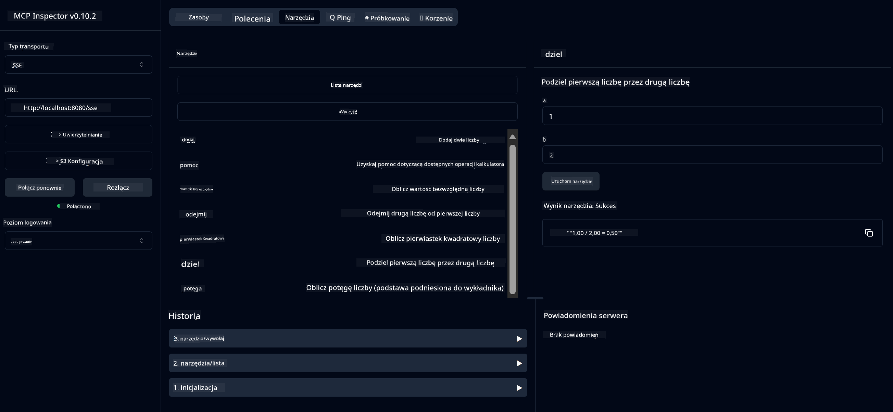

<!--
CO_OP_TRANSLATOR_METADATA:
{
  "original_hash": "ed9cab32cc67c12d8969b407aa47100a",
  "translation_date": "2025-07-13T17:54:15+00:00",
  "source_file": "03-GettingStarted/01-first-server/solution/java/README.md",
  "language_code": "pl"
}
-->
# Podstawowa usługa kalkulatora MCP

Ta usługa udostępnia podstawowe operacje kalkulatora za pomocą Model Context Protocol (MCP) wykorzystując Spring Boot z transportem WebFlux. Została zaprojektowana jako prosty przykład dla początkujących uczących się implementacji MCP.

Więcej informacji znajdziesz w dokumentacji referencyjnej [MCP Server Boot Starter](https://docs.spring.io/spring-ai/reference/api/mcp/mcp-server-boot-starter-docs.html).


## Korzystanie z usługi

Usługa udostępnia następujące endpointy API przez protokół MCP:

- `add(a, b)`: Dodaj dwie liczby
- `subtract(a, b)`: Odejmij drugą liczbę od pierwszej
- `multiply(a, b)`: Pomnóż dwie liczby
- `divide(a, b)`: Podziel pierwszą liczbę przez drugą (z kontrolą dzielenia przez zero)
- `power(base, exponent)`: Oblicz potęgę liczby
- `squareRoot(number)`: Oblicz pierwiastek kwadratowy (z kontrolą liczb ujemnych)
- `modulus(a, b)`: Oblicz resztę z dzielenia
- `absolute(number)`: Oblicz wartość bezwzględną

## Zależności

Projekt wymaga następujących kluczowych zależności:

```xml
<dependency>
    <groupId>org.springframework.ai</groupId>
    <artifactId>spring-ai-starter-mcp-server-webflux</artifactId>
</dependency>
```

## Budowanie projektu

Zbuduj projekt używając Maven:
```bash
./mvnw clean install -DskipTests
```

## Uruchamianie serwera

### Za pomocą Java

```bash
java -jar target/calculator-server-0.0.1-SNAPSHOT.jar
```

### Korzystanie z MCP Inspector

MCP Inspector to przydatne narzędzie do interakcji z usługami MCP. Aby użyć go z tą usługą kalkulatora:

1. **Zainstaluj i uruchom MCP Inspector** w nowym oknie terminala:
   ```bash
   npx @modelcontextprotocol/inspector
   ```

2. **Otwórz interfejs webowy** klikając w URL wyświetlony przez aplikację (zazwyczaj http://localhost:6274)

3. **Skonfiguruj połączenie**:
   - Ustaw typ transportu na "SSE"
   - Ustaw URL na endpoint SSE działającego serwera: `http://localhost:8080/sse`
   - Kliknij "Connect"

4. **Korzystaj z narzędzi**:
   - Kliknij "List Tools", aby zobaczyć dostępne operacje kalkulatora
   - Wybierz narzędzie i kliknij "Run Tool", aby wykonać operację



**Zastrzeżenie**:  
Niniejszy dokument został przetłumaczony przy użyciu usługi tłumaczenia AI [Co-op Translator](https://github.com/Azure/co-op-translator). Chociaż dokładamy starań, aby tłumaczenie było jak najbardziej precyzyjne, prosimy mieć na uwadze, że automatyczne tłumaczenia mogą zawierać błędy lub nieścisłości. Oryginalny dokument w języku źródłowym powinien być uznawany za źródło autorytatywne. W przypadku informacji o kluczowym znaczeniu zalecane jest skorzystanie z profesjonalnego tłumaczenia wykonanego przez człowieka. Nie ponosimy odpowiedzialności za jakiekolwiek nieporozumienia lub błędne interpretacje wynikające z korzystania z tego tłumaczenia.