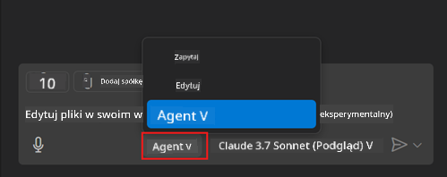
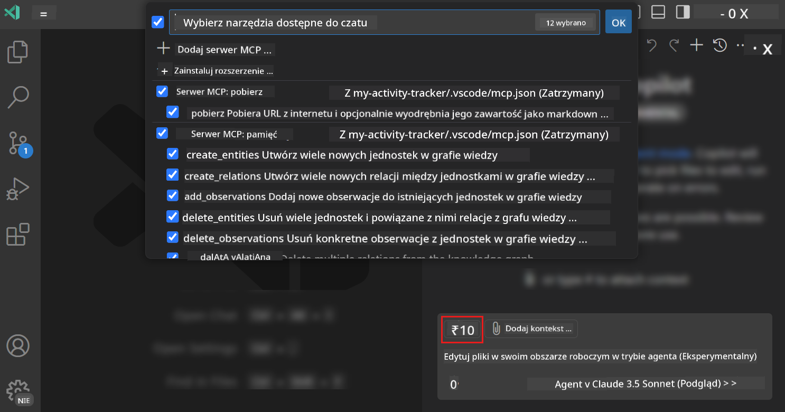
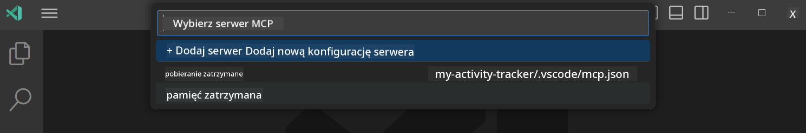
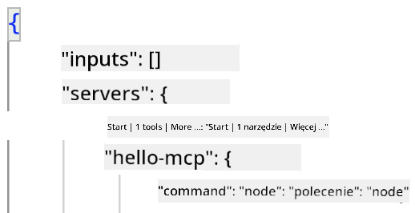
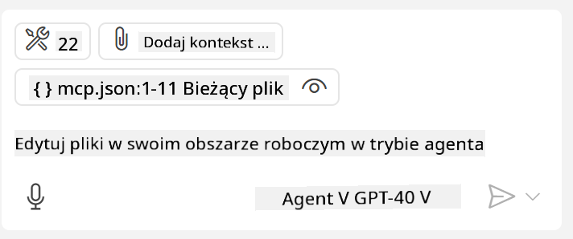

<!--
CO_OP_TRANSLATOR_METADATA:
{
  "original_hash": "d940b5e0af75e3a3a4d1c3179120d1d9",
  "translation_date": "2025-08-26T17:41:58+00:00",
  "source_file": "03-GettingStarted/04-vscode/README.md",
  "language_code": "pl"
}
-->
# Konsumowanie serwera w trybie Agenta GitHub Copilot

Visual Studio Code i GitHub Copilot mogą działać jako klient i korzystać z serwera MCP. Dlaczego mielibyśmy to robić, możesz zapytać? Otóż oznacza to, że wszystkie funkcje serwera MCP mogą być teraz używane bezpośrednio w Twoim IDE. Wyobraź sobie, że dodajesz na przykład serwer MCP GitHuba – pozwoliłoby to na kontrolowanie GitHuba za pomocą poleceń w języku naturalnym, zamiast wpisywania konkretnych komend w terminalu. Albo pomyśl o czymkolwiek, co mogłoby poprawić Twoje doświadczenie jako dewelopera, a wszystko to kontrolowane za pomocą języka naturalnego. Teraz widzisz, jakie to wygodne, prawda?

## Przegląd

Ta lekcja omawia, jak używać Visual Studio Code i trybu Agenta GitHub Copilot jako klienta dla Twojego serwera MCP.

## Cele nauki

Po ukończeniu tej lekcji będziesz w stanie:

- Korzystać z serwera MCP za pomocą Visual Studio Code.
- Uruchamiać funkcje, takie jak narzędzia, za pomocą GitHub Copilot.
- Konfigurować Visual Studio Code, aby znajdować i zarządzać swoim serwerem MCP.

## Użycie

Możesz kontrolować swój serwer MCP na dwa sposoby:

- Interfejs użytkownika – zobaczysz, jak to zrobić w dalszej części tego rozdziału.
- Terminal – możliwe jest kontrolowanie serwera z terminala za pomocą polecenia `code`:

  Aby dodać serwer MCP do swojego profilu użytkownika, użyj opcji wiersza poleceń `--add-mcp` i podaj konfigurację serwera w formacie JSON, np. {\"name\":\"server-name\",\"command\":...}.

  ```
  code --add-mcp "{\"name\":\"my-server\",\"command\": \"uvx\",\"args\": [\"mcp-server-fetch\"]}"
  ```

### Zrzuty ekranu





Omówmy teraz, jak korzystać z interfejsu wizualnego w kolejnych sekcjach.

## Podejście

Oto, jak należy podejść do tego zadania na wysokim poziomie:

- Skonfiguruj plik, aby znaleźć swój serwer MCP.
- Uruchom/połącz się z serwerem, aby wyświetlić listę jego funkcji.
- Korzystaj z tych funkcji za pomocą interfejsu czatu GitHub Copilot.

Świetnie, teraz gdy rozumiemy przepływ, spróbujmy użyć serwera MCP w Visual Studio Code w ramach ćwiczenia.

## Ćwiczenie: Konsumowanie serwera

W tym ćwiczeniu skonfigurujemy Visual Studio Code, aby znaleźć Twój serwer MCP, dzięki czemu będzie można z niego korzystać za pomocą interfejsu czatu GitHub Copilot.

### -0- Wstępny krok: włącz wykrywanie serwera MCP

Może być konieczne włączenie wykrywania serwerów MCP.

1. Przejdź do `File -> Preferences -> Settings` w Visual Studio Code.

1. Wyszukaj "MCP" i włącz `chat.mcp.discovery.enabled` w pliku settings.json.

### -1- Utwórz plik konfiguracyjny

Rozpocznij od utworzenia pliku konfiguracyjnego w katalogu głównym swojego projektu. Potrzebujesz pliku o nazwie MCP.json, który umieścisz w folderze .vscode. Powinno to wyglądać tak:

```text
.vscode
|-- mcp.json
```

Następnie zobaczmy, jak dodać wpis serwera.

### -2- Skonfiguruj serwer

Dodaj następującą zawartość do pliku *mcp.json*:

```json
{
    "inputs": [],
    "servers": {
       "hello-mcp": {
           "command": "node",
           "args": [
               "build/index.js"
           ]
       }
    }
}
```

Powyżej znajduje się prosty przykład uruchamiania serwera napisanego w Node.js. Dla innych środowisk wskaż odpowiednie polecenie do uruchamiania serwera za pomocą `command` i `args`.

### -3- Uruchom serwer

Teraz, gdy dodałeś wpis, uruchom serwer:

1. Znajdź swój wpis w pliku *mcp.json* i upewnij się, że widzisz ikonę "play":

    

1. Kliknij ikonę "play". Powinieneś zobaczyć, że ikona narzędzi w GitHub Copilot Chat zwiększa liczbę dostępnych narzędzi. Jeśli klikniesz tę ikonę narzędzi, zobaczysz listę zarejestrowanych narzędzi. Możesz zaznaczać/odznaczać każde narzędzie w zależności od tego, czy chcesz, aby GitHub Copilot używał ich jako kontekstu:

  

1. Aby uruchomić narzędzie, wpisz polecenie, które pasuje do opisu jednego z Twoich narzędzi, na przykład takie jak "dodaj 22 do 1":

  

  Powinieneś zobaczyć odpowiedź "23".

## Zadanie

Spróbuj dodać wpis serwera do pliku *mcp.json* i upewnij się, że możesz uruchomić/zatrzymać serwer. Upewnij się również, że możesz komunikować się z narzędziami na swoim serwerze za pomocą interfejsu czatu GitHub Copilot.

## Rozwiązanie

[Rozwiązanie](./solution/README.md)

## Kluczowe wnioski

Najważniejsze wnioski z tego rozdziału to:

- Visual Studio Code to świetny klient, który pozwala korzystać z wielu serwerów MCP i ich narzędzi.
- Interfejs czatu GitHub Copilot to sposób interakcji z serwerami.
- Możesz prosić użytkownika o dane wejściowe, takie jak klucze API, które mogą być przekazywane do serwera MCP podczas konfigurowania wpisu w pliku *mcp.json*.

## Przykłady

- [Kalkulator w Javie](../samples/java/calculator/README.md)
- [Kalkulator w .Net](../../../../03-GettingStarted/samples/csharp)
- [Kalkulator w JavaScript](../samples/javascript/README.md)
- [Kalkulator w TypeScript](../samples/typescript/README.md)
- [Kalkulator w Pythonie](../../../../03-GettingStarted/samples/python)

## Dodatkowe zasoby

- [Dokumentacja Visual Studio](https://code.visualstudio.com/docs/copilot/chat/mcp-servers)

## Co dalej

- Następny rozdział: [Tworzenie serwera stdio](../05-stdio-server/README.md)

---

**Zastrzeżenie**:  
Ten dokument został przetłumaczony za pomocą usługi tłumaczenia AI [Co-op Translator](https://github.com/Azure/co-op-translator). Chociaż dokładamy wszelkich starań, aby tłumaczenie było precyzyjne, prosimy pamiętać, że automatyczne tłumaczenia mogą zawierać błędy lub nieścisłości. Oryginalny dokument w jego rodzimym języku powinien być uznawany za wiarygodne źródło. W przypadku informacji krytycznych zaleca się skorzystanie z profesjonalnego tłumaczenia wykonanego przez człowieka. Nie ponosimy odpowiedzialności za jakiekolwiek nieporozumienia lub błędne interpretacje wynikające z korzystania z tego tłumaczenia.