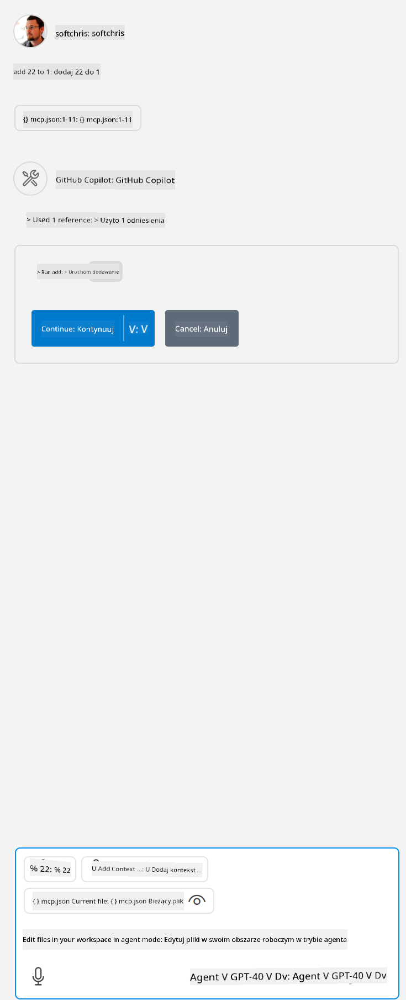

<!--
CO_OP_TRANSLATOR_METADATA:
{
  "original_hash": "5ef8f5821c1a04f7b1fc4f15098ecab8",
  "translation_date": "2025-07-13T19:42:21+00:00",
  "source_file": "03-GettingStarted/04-vscode/solution/README.md",
  "language_code": "pl"
}
-->
To odpowiada uruchomieniu polecenia w ten sposób: `node build/index.js`.

- Zmień wpis serwera tak, aby wskazywał na absolutną ścieżkę do Twojego pliku serwera oraz zawierał pełne polecenie potrzebne do uruchomienia serwera, w zależności od wybranego środowiska uruchomieniowego i lokalizacji serwera.

## Korzystanie z funkcji na serwerze

- Kliknij ikonę `play`, gdy dodasz plik *mcp.json* do folderu *./vscode*,

    Zauważ, że ikona narzędzi zmieni się, zwiększając liczbę dostępnych narzędzi. Ikona narzędzi znajduje się tuż nad polem czatu w GitHub Copilot.

## Uruchom narzędzie

- Wpisz w oknie czatu polecenie pasujące do opisu Twojego narzędzia. Na przykład, aby wywołać narzędzie `add`, wpisz coś w stylu "add 3 to 20".

    Powinieneś zobaczyć narzędzie pojawiające się nad polem tekstowym czatu, zachęcające do wybrania go i uruchomienia, tak jak na tym obrazku:

    

    Wybranie narzędzia powinno zwrócić wynik liczbowy "23", jeśli Twoje polecenie było podobne do podanego wcześniej.

**Zastrzeżenie**:  
Niniejszy dokument został przetłumaczony przy użyciu usługi tłumaczenia AI [Co-op Translator](https://github.com/Azure/co-op-translator). Chociaż dokładamy starań, aby tłumaczenie było jak najbardziej precyzyjne, prosimy mieć na uwadze, że automatyczne tłumaczenia mogą zawierać błędy lub nieścisłości. Oryginalny dokument w języku źródłowym należy traktować jako źródło wiarygodne i nadrzędne. W przypadku informacji o kluczowym znaczeniu zalecane jest skorzystanie z profesjonalnego tłumaczenia wykonanego przez człowieka. Nie ponosimy odpowiedzialności za jakiekolwiek nieporozumienia lub błędne interpretacje wynikające z korzystania z tego tłumaczenia.