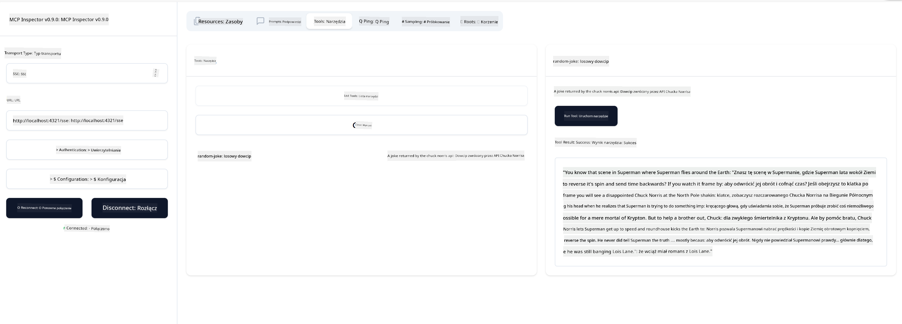

<!--
CO_OP_TRANSLATOR_METADATA:
{
  "original_hash": "a8831b194cb5ece750355e99434b7154",
  "translation_date": "2025-07-17T18:33:19+00:00",
  "source_file": "03-GettingStarted/05-sse-server/README.md",
  "language_code": "pl"
}
-->
# Serwer SSE

SSE (Server Sent Events) to standard umożliwiający strumieniowanie danych z serwera do klienta, pozwalający serwerom na przesyłanie aktualizacji w czasie rzeczywistym do klientów przez HTTP. Jest to szczególnie przydatne w aplikacjach wymagających aktualizacji na żywo, takich jak czaty, powiadomienia czy strumienie danych w czasie rzeczywistym. Twój serwer może być również używany przez wielu klientów jednocześnie, ponieważ działa na serwerze, który może być uruchomiony na przykład w chmurze.

## Przegląd

Ta lekcja omawia, jak zbudować i korzystać z serwerów SSE.

## Cele nauki

Po zakończeniu tej lekcji będziesz potrafił:

- Zbudować serwer SSE.
- Debugować serwer SSE za pomocą Inspektora.
- Korzystać z serwera SSE w Visual Studio Code.

## SSE, jak to działa

SSE to jeden z dwóch obsługiwanych typów transportu. W poprzednich lekcjach widziałeś już użycie pierwszego, czyli stdio. Różnice są następujące:

- SSE wymaga obsługi dwóch rzeczy: połączenia i wiadomości.
- Ponieważ jest to serwer, który może działać gdziekolwiek, musisz to uwzględnić w pracy z narzędziami takimi jak Inspector i Visual Studio Code. Oznacza to, że zamiast wskazywać, jak uruchomić serwer, wskazujesz punkt końcowy, gdzie można nawiązać połączenie. Zobacz poniższy przykład kodu:

### TypeScript

```typescript
app.get("/sse", async (_: Request, res: Response) => {
    const transport = new SSEServerTransport('/messages', res);
    transports[transport.sessionId] = transport;
    res.on("close", () => {
        delete transports[transport.sessionId];
    });
    await server.connect(transport);
});

app.post("/messages", async (req: Request, res: Response) => {
    const sessionId = req.query.sessionId as string;
    const transport = transports[sessionId];
    if (transport) {
        await transport.handlePostMessage(req, res);
    } else {
        res.status(400).send('No transport found for sessionId');
    }
});
```

W powyższym kodzie:

- `/sse` jest ustawioną trasą. Gdy zostanie wykonane żądanie do tej trasy, tworzona jest nowa instancja transportu, a serwer *łączy się* za pomocą tego transportu.
- `/messages` to trasa obsługująca przychodzące wiadomości.

### Python

```python
mcp = FastMCP("My App")

@mcp.tool()
def add(a: int, b: int) -> int:
    """Add two numbers"""
    return a + b

# Mount the SSE server to the existing ASGI server
app = Starlette(
    routes=[
        Mount('/', app=mcp.sse_app()),
    ]
)

```

W powyższym kodzie:

- Tworzymy instancję serwera ASGI (konkretnie używając Starlette) i montujemy domyślną trasę `/`.

  Za kulisami trasy `/sse` i `/messages` są skonfigurowane do obsługi połączeń i wiadomości odpowiednio. Reszta aplikacji, jak dodawanie funkcji czy narzędzi, działa tak samo jak w serwerach stdio.

### .NET    

```csharp
    var builder = WebApplication.CreateBuilder(args);
    builder.Services
        .AddMcpServer()
        .WithTools<Tools>();


    builder.Services.AddHttpClient();

    var app = builder.Build();

    app.MapMcp();
    ```

    Istnieją dwie metody, które pomagają przejść od serwera WWW do serwera obsługującego SSE:

    - `AddMcpServer` – ta metoda dodaje funkcjonalności.
    - `MapMcp` – ta metoda dodaje trasy takie jak `/SSE` i `/messages`.
```

Now that we know a little bit more about SSE, let's build an SSE server next.

## Exercise: Creating an SSE Server

To create our server, we need to keep two things in mind:

- We need to use a web server to expose endpoints for connection and messages.
- Build our server like we normally do with tools, resources and prompts when we were using stdio.

### -1- Create a server instance

To create our server, we use the same types as with stdio. However, for the transport, we need to choose SSE.

### TypeScript

```typescript
import { Request, Response } from "express";
import express from "express";
import { McpServer } from "@modelcontextprotocol/sdk/server/mcp.js";
import { SSEServerTransport } from "@modelcontextprotocol/sdk/server/sse.js";

const server = new McpServer({
  name: "example-server",
  version: "1.0.0"
});

const app = express();

const transports: {[sessionId: string]: SSEServerTransport} = {};
```

In the preceding code we've:

- Created a server instance.
- Defined an app using the web framework express.
- Created a transports variable that we will use to store incoming connections.

### Python

```python
from starlette.applications import Starlette
from starlette.routing import Mount, Host
from mcp.server.fastmcp import FastMCP


mcp = FastMCP("My App")
```

In the preceding code we've:

- Imported the libraries we're going to need with Starlette (an ASGI framework) being pulled in.
- Created an MCP server instance `mcp`.

### .NET

```csharp
var builder = WebApplication.CreateBuilder(args);
builder.Services
    .AddMcpServer();


builder.Services.AddHttpClient();

var app = builder.Build();

// TODO: add routes 
```

At this point, we've:

- Created a web app
- Added support for MCP features through `AddMcpServer`.

Let's add the needed routes next.

### -2- Add routes

Let's add routes next that handle the connection and incoming messages:

### TypeScript

```typescript
app.get("/sse", async (_: Request, res: Response) => {
  const transport = new SSEServerTransport('/messages', res);
  transports[transport.sessionId] = transport;
  res.on("close", () => {
    delete transports[transport.sessionId];
  });
  await server.connect(transport);
});

app.post("/messages", async (req: Request, res: Response) => {
  const sessionId = req.query.sessionId as string;
  const transport = transports[sessionId];
  if (transport) {
    await transport.handlePostMessage(req, res);
  } else {
    res.status(400).send('No transport found for sessionId');
  }
});

app.listen(3001);
```

In the preceding code we've defined:

- An `/sse` route that instantiates a transport of type SSE and ends up calling `connect` on the MCP server.
- A `/messages` route that takes care of incoming messages.

### Python

```python
app = Starlette(
    routes=[
        Mount('/', app=mcp.sse_app()),
    ]
)
```

In the preceding code we've:

- Created an ASGI app instance using the Starlette framework. As part of that we passes `mcp.sse_app()` to it's list of routes. That ends up mounting an `/sse` and `/messages` route on the app instance.

### .NET

```csharp
var builder = WebApplication.CreateBuilder(args);
builder.Services
    .AddMcpServer();

builder.Services.AddHttpClient();

var app = builder.Build();

app.MapMcp();
```

We've added one line of code at the end `add.MapMcp()` this means we now have routes `/SSE` and `/messages`. 

Let's add capabilties to the server next.

### -3- Adding server capabilities

Now that we've got everything SSE specific defined, let's add server capabilities like tools, prompts and resources.

### TypeScript

```typescript
server.tool("random-joke", "A joke returned by the chuck norris api", {},
  async () => {
    const response = await fetch("https://api.chucknorris.io/jokes/random");
    const data = await response.json();

    return {
      content: [
        {
          type: "text",
          text: data.value
        }
      ]
    };
  }
);
```

Here's how you can add a tool for example. This specific tool creates a tool call "random-joke" that calls a Chuck Norris API and returns a JSON response.

### Python

```python
@mcp.tool()
def add(a: int, b: int) -> int:
    """Add two numbers"""
    return a + b
```

Now your server has one tool.

### TypeScript

```typescript
// server-sse.ts
import { Request, Response } from "express";
import express from "express";
import { McpServer } from "@modelcontextprotocol/sdk/server/mcp.js";
import { SSEServerTransport } from "@modelcontextprotocol/sdk/server/sse.js";

// Utwórz serwer MCP
const server = new McpServer({
  name: "example-server",
  version: "1.0.0",
});

const app = express();

const transports: { [sessionId: string]: SSEServerTransport } = {};

app.get("/sse", async (_: Request, res: Response) => {
  const transport = new SSEServerTransport("/messages", res);
  transports[transport.sessionId] = transport;
  res.on("close", () => {
    delete transports[transport.sessionId];
  });
  await server.connect(transport);
});

app.post("/messages", async (req: Request, res: Response) => {
  const sessionId = req.query.sessionId as string;
  const transport = transports[sessionId];
  if (transport) {
    await transport.handlePostMessage(req, res);
  } else {
    res.status(400).send("No transport found for sessionId");
  }
});

server.tool("random-joke", "A joke returned by the chuck norris api", {}, async () => {
  const response = await fetch("https://api.chucknorris.io/jokes/random");
  const data = await response.json();

  return {
    content: [
      {
        type: "text",
        text: data.value,
      },
    ],
  };
});

app.listen(3001);
```

### Python

```python
from starlette.applications import Starlette
from starlette.routing import Mount, Host
from mcp.server.fastmcp import FastMCP


mcp = FastMCP("My App")

@mcp.tool()
def add(a: int, b: int) -> int:
    """Add two numbers"""
    return a + b

# Montujemy serwer SSE do istniejącego serwera ASGI
app = Starlette(
    routes=[
        Mount('/', app=mcp.sse_app()),
    ]
)
```

### .NET

1. Let's create some tools first, for this we will create a file *Tools.cs* with the following content:

  ```csharp
  using System.ComponentModel;
  using System.Text.Json;
  using ModelContextProtocol.Server;

  namespace server;

  [McpServerToolType]
  public sealed class Tools
  {

      public Tools()
      {
      
      }

      [McpServerTool, Description("Add two numbers together.")]
      public async Task<string> AddNumbers(
          [Description("The first number")] int a,
          [Description("The second number")] int b)
      {
          return (a + b).ToString();
      }

  }
  ```

  Here we've added the following:

  - Created a class `Tools` with the decorator `McpServerToolType`.
  - Defined a tool `AddNumbers` by decorating the method with `McpServerTool`. We've also provided parameters and an implementation.

1. Let's leverage the `Tools` class we just created:

  ```csharp
  var builder = WebApplication.CreateBuilder(args);
  builder.Services
      .AddMcpServer()
      .WithTools<Tools>();


  builder.Services.AddHttpClient();

  var app = builder.Build();

  app.MapMcp();
  ```

  We've added a call to `WithTools` that specifies `Tools` as the class containing the tools. That's it, we're ready.

Great, we have a server using SSE, let's take it for a spin next.

## Exercise: Debugging an SSE Server with Inspector

Inspector is a great tool that we saw in a previous lesson [Creating your first server](/03-GettingStarted/01-first-server/README.md). Let's see if we can use the Inspector even here:

### -1- Running the inspector

To run the inspector, you first must have an SSE server running, so let's do that next:

1. Run the server 

    ### TypeScript

    ```sh
    tsx && node ./build/server-sse.ts
    ```

    ### Python

    ```sh
    uvicorn server:app
    ```

    Note how we use the executable `uvicorn` that's installed when we typed `pip install "mcp[cli]"`. Typing `server:app` means we're trying to run a file `server.py` and for it to have a Starlette instance called `app`. 

    ### .NET

    ```sh
    dotnet run
    ```

    This should start the server. To interface with it you need a new terminal.

1. Run the inspector

    > ![NOTE]
    > Run this in a separate terminal window than the server is running in. Also note, you need to adjust the below command to fit the URL where your server runs.

    ```sh
    npx @modelcontextprotocol/inspector --cli http://localhost:8000/sse --method tools/list
    ```

    Uruchomienie inspektora wygląda tak samo we wszystkich środowiskach uruchomieniowych. Zwróć uwagę, że zamiast podawać ścieżkę do serwera i polecenie uruchomienia serwera, podajemy URL, pod którym serwer działa, oraz określamy trasę `/sse`.

### -2- Wypróbowanie narzędzia

Połącz się z serwerem, wybierając SSE z listy rozwijanej i wpisz adres URL, pod którym działa twój serwer, na przykład http:localhost:4321/sse. Następnie kliknij przycisk „Connect”. Jak wcześniej, wybierz listę narzędzi, wybierz narzędzie i podaj wartości wejściowe. Powinieneś zobaczyć wynik podobny do poniższego:



Świetnie, potrafisz pracować z inspektorem, zobaczmy teraz, jak pracować z Visual Studio Code.

## Zadanie

Spróbuj rozbudować swój serwer o dodatkowe funkcje. Zobacz [tę stronę](https://api.chucknorris.io/), aby na przykład dodać narzędzie wywołujące API. To ty decydujesz, jak ma wyglądać serwer. Powodzenia :)

## Rozwiązanie

[Rozwiązanie](./solution/README.md) Oto możliwe rozwiązanie z działającym kodem.

## Najważniejsze wnioski

Najważniejsze wnioski z tego rozdziału to:

- SSE to drugi obsługiwany transport obok stdio.
- Aby obsługiwać SSE, musisz zarządzać przychodzącymi połączeniami i wiadomościami za pomocą frameworka webowego.
- Możesz używać zarówno Inspektora, jak i Visual Studio Code do korzystania z serwera SSE, tak jak z serwerów stdio. Zwróć uwagę, że różni się to nieco między stdio a SSE. W przypadku SSE musisz osobno uruchomić serwer, a następnie uruchomić narzędzie inspektora. W przypadku inspektora istnieją też różnice, ponieważ musisz podać URL.

## Przykłady

- [Java Calculator](../samples/java/calculator/README.md)
- [.Net Calculator](../../../../03-GettingStarted/samples/csharp)
- [JavaScript Calculator](../samples/javascript/README.md)
- [TypeScript Calculator](../samples/typescript/README.md)
- [Python Calculator](../../../../03-GettingStarted/samples/python)

## Dodatkowe zasoby

- [SSE](https://developer.mozilla.org/en-US/docs/Web/API/Server-sent_events)

## Co dalej

- Następny: [HTTP Streaming with MCP (Streamable HTTP)](../06-http-streaming/README.md)

**Zastrzeżenie**:  
Niniejszy dokument został przetłumaczony przy użyciu automatycznej usługi tłumaczeniowej AI [Co-op Translator](https://github.com/Azure/co-op-translator). Mimo że dokładamy starań, aby tłumaczenie było jak najbardziej precyzyjne, prosimy mieć na uwadze, że tłumaczenia automatyczne mogą zawierać błędy lub nieścisłości. Oryginalny dokument w języku źródłowym należy traktować jako źródło wiążące. W przypadku informacji o kluczowym znaczeniu zalecane jest skorzystanie z profesjonalnego tłumaczenia wykonanego przez człowieka. Nie ponosimy odpowiedzialności za jakiekolwiek nieporozumienia lub błędne interpretacje wynikające z korzystania z tego tłumaczenia.