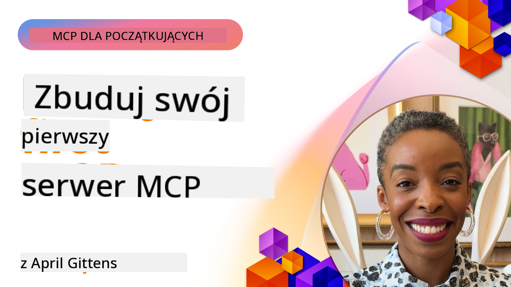

<!--
CO_OP_TRANSLATOR_METADATA:
{
  "original_hash": "858362ce0118de3fec0f9114bf396101",
  "translation_date": "2025-07-29T01:33:22+00:00",
  "source_file": "03-GettingStarted/README.md",
  "language_code": "pl"
}
-->
## Pierwsze kroki  

_(Kliknij obrazek powyżej, aby obejrzeć wideo do tej lekcji)_

Ta sekcja składa się z kilku lekcji:

- **1 Twój pierwszy serwer** – w tej pierwszej lekcji nauczysz się, jak stworzyć swój pierwszy serwer i przetestować go za pomocą narzędzia inspektora, które jest cennym sposobem na testowanie i debugowanie serwera, [do lekcji](01-first-server/README.md)

- **2 Klient** – w tej lekcji dowiesz się, jak napisać klienta, który może połączyć się z Twoim serwerem, [do lekcji](02-client/README.md)

- **3 Klient z LLM** – jeszcze lepszym sposobem na napisanie klienta jest dodanie do niego LLM, aby mógł „negocjować” z Twoim serwerem, co ma robić, [do lekcji](03-llm-client/README.md)

- **4 Konsumowanie serwera w trybie GitHub Copilot Agent w Visual Studio Code** – tutaj przyjrzymy się uruchamianiu naszego serwera MCP w Visual Studio Code, [do lekcji](04-vscode/README.md)

- **5 Konsumowanie z SSE (Server Sent Events)** – SSE to standard przesyłania strumieniowego z serwera do klienta, który pozwala serwerom na przesyłanie aktualizacji w czasie rzeczywistym do klientów przez HTTP, [do lekcji](05-sse-server/README.md)

- **6 HTTP Streaming z MCP (Streamable HTTP)** – dowiedz się więcej o nowoczesnym przesyłaniu strumieniowym HTTP, powiadomieniach o postępach i o tym, jak wdrażać skalowalne serwery i klientów MCP w czasie rzeczywistym za pomocą Streamable HTTP, [do lekcji](06-http-streaming/README.md)

- **7 Wykorzystanie AI Toolkit dla VSCode** do konsumowania i testowania klientów oraz serwerów MCP, [do lekcji](07-aitk/README.md)

- **8 Testowanie** – tutaj skupimy się szczególnie na tym, jak testować serwer i klienta na różne sposoby, [do lekcji](08-testing/README.md)

- **9 Wdrażanie** – ten rozdział omówi różne sposoby wdrażania rozwiązań MCP, [do lekcji](09-deployment/README.md)

Model Context Protocol (MCP) to otwarty protokół, który standaryzuje sposób, w jaki aplikacje dostarczają kontekst do LLM. Pomyśl o MCP jak o porcie USB-C dla aplikacji AI – zapewnia on ustandaryzowany sposób łączenia modeli AI z różnymi źródłami danych i narzędziami.

## Cele nauki

Po ukończeniu tej lekcji będziesz w stanie:

- Skonfigurować środowiska programistyczne dla MCP w językach C#, Java, Python, TypeScript i JavaScript
- Budować i wdrażać podstawowe serwery MCP z niestandardowymi funkcjami (zasoby, podpowiedzi i narzędzia)
- Tworzyć aplikacje hostujące, które łączą się z serwerami MCP
- Testować i debugować implementacje MCP
- Zrozumieć typowe problemy z konfiguracją i ich rozwiązania
- Łączyć swoje implementacje MCP z popularnymi usługami LLM

## Konfigurowanie środowiska MCP

Zanim zaczniesz pracę z MCP, ważne jest, aby przygotować środowisko programistyczne i zrozumieć podstawowy przepływ pracy. Ta sekcja poprowadzi Cię przez początkowe kroki konfiguracji, aby zapewnić płynny start z MCP.

### Wymagania wstępne

Przed rozpoczęciem pracy z MCP upewnij się, że masz:

- **Środowisko programistyczne**: Dla wybranego języka (C#, Java, Python, TypeScript lub JavaScript)
- **IDE/Edytor**: Visual Studio, Visual Studio Code, IntelliJ, Eclipse, PyCharm lub dowolny nowoczesny edytor kodu
- **Menedżery pakietów**: NuGet, Maven/Gradle, pip lub npm/yarn
- **Klucze API**: Dla dowolnych usług AI, które planujesz używać w aplikacjach hostujących

### Oficjalne SDK

W nadchodzących rozdziałach zobaczysz rozwiązania zbudowane przy użyciu języków Python, TypeScript, Java i .NET. Oto wszystkie oficjalnie wspierane SDK.

MCP udostępnia oficjalne SDK dla wielu języków:
- [C# SDK](https://github.com/modelcontextprotocol/csharp-sdk) – Utrzymywane we współpracy z Microsoft
- [Java SDK](https://github.com/modelcontextprotocol/java-sdk) – Utrzymywane we współpracy z Spring AI
- [TypeScript SDK](https://github.com/modelcontextprotocol/typescript-sdk) – Oficjalna implementacja TypeScript
- [Python SDK](https://github.com/modelcontextprotocol/python-sdk) – Oficjalna implementacja Python
- [Kotlin SDK](https://github.com/modelcontextprotocol/kotlin-sdk) – Oficjalna implementacja Kotlin
- [Swift SDK](https://github.com/modelcontextprotocol/swift-sdk) – Utrzymywane we współpracy z Loopwork AI
- [Rust SDK](https://github.com/modelcontextprotocol/rust-sdk) – Oficjalna implementacja Rust

## Kluczowe wnioski

- Konfiguracja środowiska programistycznego MCP jest prosta dzięki SDK specyficznym dla języka
- Budowanie serwerów MCP polega na tworzeniu i rejestrowaniu narzędzi z jasnymi schematami
- Klienci MCP łączą się z serwerami i modelami, aby korzystać z rozszerzonych możliwości
- Testowanie i debugowanie są kluczowe dla niezawodnych implementacji MCP
- Opcje wdrażania obejmują zarówno lokalny rozwój, jak i rozwiązania chmurowe

## Ćwiczenia praktyczne

Mamy zestaw przykładów, które uzupełniają ćwiczenia, które zobaczysz we wszystkich rozdziałach tej sekcji. Dodatkowo każdy rozdział zawiera własne ćwiczenia i zadania.

- [Kalkulator w Javie](./samples/java/calculator/README.md)
- [Kalkulator w .Net](../../../03-GettingStarted/samples/csharp)
- [Kalkulator w JavaScript](./samples/javascript/README.md)
- [Kalkulator w TypeScript](./samples/typescript/README.md)
- [Kalkulator w Pythonie](../../../03-GettingStarted/samples/python)

## Dodatkowe zasoby

- [Budowanie agentów za pomocą Model Context Protocol na platformie Azure](https://learn.microsoft.com/azure/developer/ai/intro-agents-mcp)
- [Zdalny MCP z Azure Container Apps (Node.js/TypeScript/JavaScript)](https://learn.microsoft.com/samples/azure-samples/mcp-container-ts/mcp-container-ts/)
- [.NET OpenAI MCP Agent](https://learn.microsoft.com/samples/azure-samples/openai-mcp-agent-dotnet/openai-mcp-agent-dotnet/)

## Co dalej

Następne: [Tworzenie swojego pierwszego serwera MCP](01-first-server/README.md)

**Zastrzeżenie**:  
Ten dokument został przetłumaczony za pomocą usługi tłumaczenia AI [Co-op Translator](https://github.com/Azure/co-op-translator). Chociaż dokładamy wszelkich starań, aby tłumaczenie było precyzyjne, prosimy pamiętać, że automatyczne tłumaczenia mogą zawierać błędy lub nieścisłości. Oryginalny dokument w jego rodzimym języku powinien być uznawany za autorytatywne źródło. W przypadku informacji o kluczowym znaczeniu zaleca się skorzystanie z profesjonalnego tłumaczenia przez człowieka. Nie ponosimy odpowiedzialności za jakiekolwiek nieporozumienia lub błędne interpretacje wynikające z użycia tego tłumaczenia.