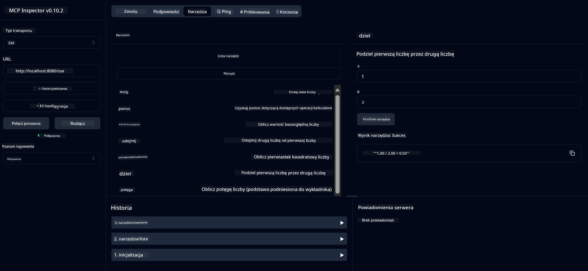

<!--
CO_OP_TRANSLATOR_METADATA:
{
  "original_hash": "13231e9951b68efd9df8c56bd5cdb27e",
  "translation_date": "2025-07-13T22:26:21+00:00",
  "source_file": "03-GettingStarted/samples/java/calculator/README.md",
  "language_code": "pl"
}
-->
# Basic Calculator MCP Service

Ta usługa udostępnia podstawowe operacje kalkulatora za pomocą Model Context Protocol (MCP) wykorzystując Spring Boot z transportem WebFlux. Została zaprojektowana jako prosty przykład dla początkujących uczących się implementacji MCP.

Więcej informacji znajdziesz w dokumentacji referencyjnej [MCP Server Boot Starter](https://docs.spring.io/spring-ai/reference/api/mcp/mcp-server-boot-starter-docs.html).

## Przegląd

Usługa prezentuje:
- Obsługę SSE (Server-Sent Events)
- Automatyczną rejestrację narzędzi za pomocą adnotacji `@Tool` z Spring AI
- Podstawowe funkcje kalkulatora:
  - Dodawanie, odejmowanie, mnożenie, dzielenie
  - Potęgowanie i pierwiastek kwadratowy
  - Moduł (reszta z dzielenia) i wartość bezwzględna
  - Funkcję pomocy opisującą operacje

## Funkcje

Ta usługa kalkulatora oferuje następujące możliwości:

1. **Podstawowe działania arytmetyczne**:
   - Dodawanie dwóch liczb
   - Odejmowanie jednej liczby od drugiej
   - Mnożenie dwóch liczb
   - Dzielenie jednej liczby przez drugą (z kontrolą dzielenia przez zero)

2. **Zaawansowane operacje**:
   - Potęgowanie (podnoszenie podstawy do wykładnika)
   - Obliczanie pierwiastka kwadratowego (z kontrolą liczb ujemnych)
   - Obliczanie reszty z dzielenia (moduł)
   - Obliczanie wartości bezwzględnej

3. **System pomocy**:
   - Wbudowana funkcja pomocy wyjaśniająca dostępne operacje

## Korzystanie z usługi

Usługa udostępnia następujące endpointy API przez protokół MCP:

- `add(a, b)`: Dodaj dwie liczby
- `subtract(a, b)`: Odejmij drugą liczbę od pierwszej
- `multiply(a, b)`: Pomnóż dwie liczby
- `divide(a, b)`: Podziel pierwszą liczbę przez drugą (z kontrolą dzielenia przez zero)
- `power(base, exponent)`: Oblicz potęgę liczby
- `squareRoot(number)`: Oblicz pierwiastek kwadratowy (z kontrolą liczb ujemnych)
- `modulus(a, b)`: Oblicz resztę z dzielenia
- `absolute(number)`: Oblicz wartość bezwzględną
- `help()`: Pobierz informacje o dostępnych operacjach

## Klient testowy

Prosty klient testowy znajduje się w pakiecie `com.microsoft.mcp.sample.client`. Klasa `SampleCalculatorClient` demonstruje dostępne operacje usługi kalkulatora.

## Korzystanie z klienta LangChain4j

Projekt zawiera przykład klienta LangChain4j w `com.microsoft.mcp.sample.client.LangChain4jClient`, który pokazuje, jak zintegrować usługę kalkulatora z LangChain4j i modelami GitHub:

### Wymagania wstępne

1. **Konfiguracja tokena GitHub**:
   
   Aby korzystać z modeli AI GitHub (np. phi-4), potrzebujesz osobistego tokena dostępu GitHub:

   a. Przejdź do ustawień konta GitHub: https://github.com/settings/tokens
   
   b. Kliknij "Generate new token" → "Generate new token (classic)"
   
   c. Nadaj tokenowi opisową nazwę
   
   d. Wybierz następujące zakresy:
      - `repo` (pełna kontrola nad prywatnymi repozytoriami)
      - `read:org` (odczyt członkostwa w organizacjach i zespołach, odczyt projektów organizacji)
      - `gist` (tworzenie gistów)
      - `user:email` (dostęp do adresów e-mail użytkownika (tylko do odczytu))
   
   e. Kliknij "Generate token" i skopiuj nowy token
   
   f. Ustaw go jako zmienną środowiskową:
      
      Na Windows:
      ```
      set GITHUB_TOKEN=your-github-token
      ```
      
      Na macOS/Linux:
      ```bash
      export GITHUB_TOKEN=your-github-token
      ```

   g. Aby ustawić na stałe, dodaj go do zmiennych środowiskowych w ustawieniach systemu

2. Dodaj zależność LangChain4j GitHub do projektu (już zawarta w pom.xml):
   ```xml
   <dependency>
       <groupId>dev.langchain4j</groupId>
       <artifactId>langchain4j-github</artifactId>
       <version>${langchain4j.version}</version>
   </dependency>
   ```

3. Upewnij się, że serwer kalkulatora działa na `localhost:8080`

### Uruchamianie klienta LangChain4j

Przykład demonstruje:
- Połączenie z serwerem MCP kalkulatora przez transport SSE
- Użycie LangChain4j do stworzenia chatbota korzystającego z operacji kalkulatora
- Integrację z modelami AI GitHub (obecnie model phi-4)

Klient wysyła następujące przykładowe zapytania, aby pokazać działanie:
1. Obliczenie sumy dwóch liczb
2. Znalezienie pierwiastka kwadratowego liczby
3. Uzyskanie informacji pomocy o dostępnych operacjach kalkulatora

Uruchom przykład i sprawdź konsolę, aby zobaczyć, jak model AI wykorzystuje narzędzia kalkulatora do odpowiedzi na zapytania.

### Konfiguracja modelu GitHub

Klient LangChain4j jest skonfigurowany do użycia modelu phi-4 GitHub z następującymi ustawieniami:

```java
ChatLanguageModel model = GitHubChatModel.builder()
    .apiKey(System.getenv("GITHUB_TOKEN"))
    .timeout(Duration.ofSeconds(60))
    .modelName("phi-4")
    .logRequests(true)
    .logResponses(true)
    .build();
```

Aby użyć innych modeli GitHub, wystarczy zmienić parametr `modelName` na inny obsługiwany model (np. "claude-3-haiku-20240307", "llama-3-70b-8192" itd.).

## Zależności

Projekt wymaga następujących kluczowych zależności:

```xml
<!-- For MCP Server -->
<dependency>
    <groupId>org.springframework.ai</groupId>
    <artifactId>spring-ai-starter-mcp-server-webflux</artifactId>
</dependency>

<!-- For LangChain4j integration -->
<dependency>
    <groupId>dev.langchain4j</groupId>
    <artifactId>langchain4j-mcp</artifactId>
    <version>${langchain4j.version}</version>
</dependency>

<!-- For GitHub models support -->
<dependency>
    <groupId>dev.langchain4j</groupId>
    <artifactId>langchain4j-github</artifactId>
    <version>${langchain4j.version}</version>
</dependency>
```

## Budowanie projektu

Zbuduj projekt za pomocą Maven:
```bash
./mvnw clean install -DskipTests
```

## Uruchamianie serwera

### Korzystając z Java

```bash
java -jar target/calculator-server-0.0.1-SNAPSHOT.jar
```

### Korzystając z MCP Inspector

MCP Inspector to przydatne narzędzie do interakcji z usługami MCP. Aby użyć go z tą usługą kalkulatora:

1. **Zainstaluj i uruchom MCP Inspector** w nowym oknie terminala:
   ```bash
   npx @modelcontextprotocol/inspector
   ```

2. **Otwórz interfejs webowy** klikając w wyświetlony adres URL (zazwyczaj http://localhost:6274)

3. **Skonfiguruj połączenie**:
   - Ustaw typ transportu na "SSE"
   - Ustaw URL na endpoint SSE działającego serwera: `http://localhost:8080/sse`
   - Kliknij "Connect"

4. **Korzystaj z narzędzi**:
   - Kliknij "List Tools", aby zobaczyć dostępne operacje kalkulatora
   - Wybierz narzędzie i kliknij "Run Tool", aby wykonać operację



### Korzystając z Dockera

Projekt zawiera Dockerfile do wdrożenia w kontenerze:

1. **Zbuduj obraz Dockera**:
   ```bash
   docker build -t calculator-mcp-service .
   ```

2. **Uruchom kontener Dockera**:
   ```bash
   docker run -p 8080:8080 calculator-mcp-service
   ```

To spowoduje:
- Zbudowanie wieloetapowego obrazu Dockera z Maven 3.9.9 i Eclipse Temurin 24 JDK
- Utworzenie zoptymalizowanego obrazu kontenera
- Udostępnienie usługi na porcie 8080
- Uruchomienie usługi kalkulatora MCP wewnątrz kontenera

Po uruchomieniu kontenera możesz uzyskać dostęp do usługi pod adresem `http://localhost:8080`.

## Rozwiązywanie problemów

### Najczęstsze problemy z tokenem GitHub

1. **Problemy z uprawnieniami tokena**: Jeśli otrzymujesz błąd 403 Forbidden, sprawdź, czy token ma odpowiednie uprawnienia zgodnie z wymaganiami.

2. **Token nie znaleziony**: Jeśli pojawia się błąd "No API key found", upewnij się, że zmienna środowiskowa GITHUB_TOKEN jest poprawnie ustawiona.

3. **Ograniczenia limitów**: API GitHub ma limity zapytań. Jeśli napotkasz błąd limitu (kod statusu 429), odczekaj kilka minut przed ponowną próbą.

4. **Wygasanie tokena**: Tokeny GitHub mogą wygasać. Jeśli po pewnym czasie pojawią się błędy uwierzytelniania, wygeneruj nowy token i zaktualizuj zmienną środowiskową.

Jeśli potrzebujesz dalszej pomocy, sprawdź [dokumentację LangChain4j](https://github.com/langchain4j/langchain4j) lub [dokumentację API GitHub](https://docs.github.com/en/rest).

**Zastrzeżenie**:  
Niniejszy dokument został przetłumaczony przy użyciu usługi tłumaczenia AI [Co-op Translator](https://github.com/Azure/co-op-translator). Mimo że dążymy do dokładności, prosimy mieć na uwadze, że automatyczne tłumaczenia mogą zawierać błędy lub nieścisłości. Oryginalny dokument w języku źródłowym powinien być uznawany za źródło autorytatywne. W przypadku informacji krytycznych zalecane jest skorzystanie z profesjonalnego tłumaczenia wykonanego przez człowieka. Nie ponosimy odpowiedzialności za jakiekolwiek nieporozumienia lub błędne interpretacje wynikające z korzystania z tego tłumaczenia.