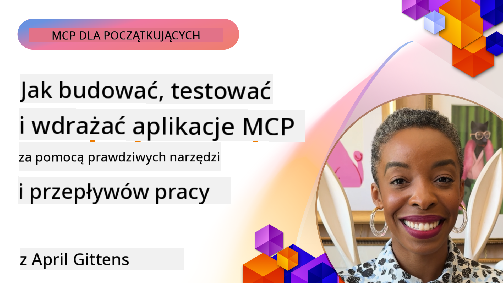
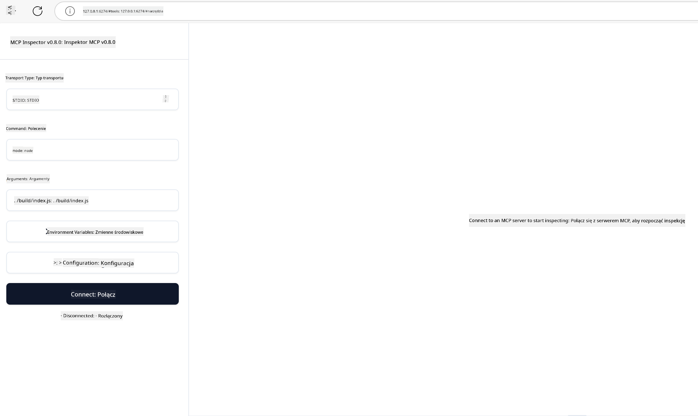

<!--
CO_OP_TRANSLATOR_METADATA:
{
  "original_hash": "83efa75a69bc831277263a6f1ae53669",
  "translation_date": "2025-08-11T11:31:46+00:00",
  "source_file": "04-PracticalImplementation/README.md",
  "language_code": "pl"
}
-->
# Praktyczne wdrożenie

[](https://youtu.be/vCN9-mKBDfQ)

_(Kliknij obrazek powyżej, aby obejrzeć wideo z tej lekcji)_

Praktyczne wdrożenie to moment, w którym moc Model Context Protocol (MCP) staje się namacalna. Choć zrozumienie teorii i architektury MCP jest ważne, prawdziwa wartość pojawia się, gdy zastosujesz te koncepcje do budowy, testowania i wdrażania rozwiązań, które rozwiązują rzeczywiste problemy. Ten rozdział łączy wiedzę koncepcyjną z praktycznym rozwojem, prowadząc Cię przez proces tworzenia aplikacji opartych na MCP.

Niezależnie od tego, czy tworzysz inteligentnych asystentów, integrujesz AI z procesami biznesowymi, czy budujesz niestandardowe narzędzia do przetwarzania danych, MCP zapewnia elastyczną podstawę. Jego niezależny od języka projekt oraz oficjalne SDK dla popularnych języków programowania sprawiają, że jest dostępny dla szerokiego grona programistów. Korzystając z tych SDK, możesz szybko prototypować, iterować i skalować swoje rozwiązania na różnych platformach i w różnych środowiskach.

W kolejnych sekcjach znajdziesz praktyczne przykłady, przykładowy kod i strategie wdrażania, które pokazują, jak zaimplementować MCP w C#, Javie z Spring, TypeScript, JavaScript i Pythonie. Dowiesz się również, jak debugować i testować serwery MCP, zarządzać API oraz wdrażać rozwiązania w chmurze za pomocą Azure. Te praktyczne zasoby zostały zaprojektowane, aby przyspieszyć naukę i pomóc Ci pewnie budować solidne aplikacje MCP gotowe do produkcji.

## Przegląd

Ta lekcja koncentruje się na praktycznych aspektach wdrażania MCP w różnych językach programowania. Zbadamy, jak korzystać z SDK MCP w C#, Javie z Spring, TypeScript, JavaScript i Pythonie, aby budować solidne aplikacje, debugować i testować serwery MCP oraz tworzyć zasoby, szablony i narzędzia wielokrotnego użytku.

## Cele nauki

Po zakończeniu tej lekcji będziesz w stanie:

- Wdrażać rozwiązania MCP za pomocą oficjalnych SDK w różnych językach programowania
- Systematycznie debugować i testować serwery MCP
- Tworzyć i używać funkcji serwera (Zasoby, Szablony, Narzędzia)
- Projektować efektywne przepływy pracy MCP dla złożonych zadań
- Optymalizować wdrożenia MCP pod kątem wydajności i niezawodności

## Oficjalne zasoby SDK

Model Context Protocol oferuje oficjalne SDK dla wielu języków:

- [C# SDK](https://github.com/modelcontextprotocol/csharp-sdk)
- [Java z Spring SDK](https://github.com/modelcontextprotocol/java-sdk) **Uwaga:** wymaga zależności od [Project Reactor](https://projectreactor.io). (Zobacz [dyskusję w issue 246](https://github.com/orgs/modelcontextprotocol/discussions/246).)
- [TypeScript SDK](https://github.com/modelcontextprotocol/typescript-sdk)
- [Python SDK](https://github.com/modelcontextprotocol/python-sdk)
- [Kotlin SDK](https://github.com/modelcontextprotocol/kotlin-sdk)

## Praca z SDK MCP

Ta sekcja zawiera praktyczne przykłady wdrażania MCP w różnych językach programowania. Przykładowy kod znajdziesz w katalogu `samples`, zorganizowanym według języka.

### Dostępne przykłady

Repozytorium zawiera [przykładowe wdrożenia](../../../04-PracticalImplementation/samples) w następujących językach:

- [C#](./samples/csharp/README.md)
- [Java z Spring](./samples/java/containerapp/README.md)
- [TypeScript](./samples/typescript/README.md)
- [JavaScript](./samples/javascript/README.md)
- [Python](./samples/python/README.md)

Każdy przykład demonstruje kluczowe koncepcje MCP i wzorce wdrożenia dla danego języka i ekosystemu.

## Podstawowe funkcje serwera

Serwery MCP mogą implementować dowolną kombinację tych funkcji:

### Zasoby

Zasoby dostarczają kontekst i dane dla użytkownika lub modelu AI:

- Repozytoria dokumentów
- Bazy wiedzy
- Źródła danych strukturalnych
- Systemy plików

### Szablony

Szablony to wiadomości i przepływy pracy dla użytkowników:

- Predefiniowane szablony rozmów
- Wzorce interakcji prowadzących
- Specjalistyczne struktury dialogowe

### Narzędzia

Narzędzia to funkcje, które model AI może wykonać:

- Narzędzia do przetwarzania danych
- Integracje zewnętrznych API
- Zdolności obliczeniowe
- Funkcjonalność wyszukiwania

## Przykładowe wdrożenia: Implementacja w C#

Oficjalne repozytorium SDK C# zawiera kilka przykładów wdrożeń, które pokazują różne aspekty MCP:

- **Podstawowy klient MCP**: Prosty przykład pokazujący, jak stworzyć klienta MCP i wywołać narzędzia
- **Podstawowy serwer MCP**: Minimalna implementacja serwera z podstawową rejestracją narzędzi
- **Zaawansowany serwer MCP**: Serwer o pełnej funkcjonalności z rejestracją narzędzi, uwierzytelnianiem i obsługą błędów
- **Integracja z ASP.NET**: Przykłady pokazujące integrację z ASP.NET Core
- **Wzorce implementacji narzędzi**: Różne wzorce implementacji narzędzi o różnym poziomie złożoności

SDK MCP dla C# jest w wersji preview i API mogą ulec zmianie. Będziemy na bieżąco aktualizować ten blog w miarę rozwoju SDK.

### Kluczowe funkcje

- [C# MCP Nuget ModelContextProtocol](https://www.nuget.org/packages/ModelContextProtocol)
- Budowanie [pierwszego serwera MCP](https://devblogs.microsoft.com/dotnet/build-a-model-context-protocol-mcp-server-in-csharp/).

Pełne przykłady implementacji w C# znajdziesz w [oficjalnym repozytorium przykładów SDK C#](https://github.com/modelcontextprotocol/csharp-sdk)

## Przykładowe wdrożenie: Implementacja w Javie z Spring

SDK Java z Spring oferuje solidne opcje wdrożenia MCP z funkcjami klasy enterprise.

### Kluczowe funkcje

- Integracja z Spring Framework
- Silne bezpieczeństwo typów
- Obsługa programowania reaktywnego
- Kompleksowa obsługa błędów

Pełny przykład implementacji w Javie z Spring znajdziesz w [Java z Spring sample](samples/java/containerapp/README.md) w katalogu przykładów.

## Przykładowe wdrożenie: Implementacja w JavaScript

SDK JavaScript zapewnia lekkie i elastyczne podejście do wdrożenia MCP.

### Kluczowe funkcje

- Obsługa Node.js i przeglądarek
- API oparte na Promise
- Łatwa integracja z Express i innymi frameworkami
- Obsługa WebSocket dla strumieniowania

Pełny przykład implementacji w JavaScript znajdziesz w [JavaScript sample](samples/javascript/README.md) w katalogu przykładów.

## Przykładowe wdrożenie: Implementacja w Pythonie

SDK Python oferuje podejście zgodne z filozofią Pythona do wdrożenia MCP z doskonałą integracją z frameworkami ML.

### Kluczowe funkcje

- Obsługa async/await z asyncio
- Integracja z FastAPI
- Prosta rejestracja narzędzi
- Natywna integracja z popularnymi bibliotekami ML

Pełny przykład implementacji w Pythonie znajdziesz w [Python sample](samples/python/README.md) w katalogu przykładów.

## Zarządzanie API

Azure API Management to świetne rozwiązanie do zabezpieczenia serwerów MCP. Pomysł polega na umieszczeniu instancji Azure API Management przed serwerem MCP i pozwoleniu jej na obsługę funkcji, które mogą być potrzebne, takich jak:

- ograniczanie liczby żądań
- zarządzanie tokenami
- monitorowanie
- równoważenie obciążenia
- bezpieczeństwo

### Przykład Azure

Oto przykład Azure, który pokazuje, jak [stworzyć serwer MCP i zabezpieczyć go za pomocą Azure API Management](https://github.com/Azure-Samples/remote-mcp-apim-functions-python).

Zobacz, jak wygląda przepływ autoryzacji na poniższym obrazku:


Na powyższym obrazku dzieje się następujące:

- Uwierzytelnianie/autoryzacja odbywa się za pomocą Microsoft Entra.
- Azure API Management działa jako brama i używa polityk do kierowania i zarządzania ruchem.
- Azure Monitor rejestruje wszystkie żądania do dalszej analizy.

#### Przepływ autoryzacji

Przyjrzyjmy się bardziej szczegółowo przepływowi autoryzacji:


#### Specyfikacja autoryzacji MCP

Dowiedz się więcej o [specyfikacji autoryzacji MCP](https://modelcontextprotocol.io/specification/2025-03-26/basic/authorization#2-10-third-party-authorization-flow)

## Wdrażanie zdalnego serwera MCP na Azure

Zobaczmy, czy możemy wdrożyć wspomniany wcześniej przykład:

1. Sklonuj repozytorium

    ```bash
    git clone https://github.com/Azure-Samples/remote-mcp-apim-functions-python.git
    cd remote-mcp-apim-functions-python
    ```

1. Zarejestruj dostawcę zasobów `Microsoft.App`.

   - Jeśli używasz Azure CLI, uruchom `az provider register --namespace Microsoft.App --wait`.
   - Jeśli używasz Azure PowerShell, uruchom `Register-AzResourceProvider -ProviderNamespace Microsoft.App`. Następnie uruchom `(Get-AzResourceProvider -ProviderNamespace Microsoft.App).RegistrationState` po pewnym czasie, aby sprawdzić, czy rejestracja została zakończona.

1. Uruchom ten [azd](https://aka.ms/azd) polecenie, aby przygotować usługę zarządzania API, aplikację funkcji (z kodem) i wszystkie inne wymagane zasoby Azure

    ```shell
    azd up
    ```

    To polecenie powinno wdrożyć wszystkie zasoby chmurowe na Azure.

### Testowanie serwera za pomocą MCP Inspector

1. W **nowym oknie terminala** zainstaluj i uruchom MCP Inspector

    ```shell
    npx @modelcontextprotocol/inspector
    ```

    Powinieneś zobaczyć interfejs podobny do:

    

1. Kliknij CTRL, aby załadować aplikację MCP Inspector z adresu URL wyświetlanego przez aplikację (np. [http://127.0.0.1:6274/#resources](http://127.0.0.1:6274/#resources))
1. Ustaw typ transportu na `SSE`
1. Ustaw URL na działający punkt końcowy SSE zarządzania API wyświetlany po `azd up` i **Połącz**:

    ```shell
    https://<apim-servicename-from-azd-output>.azure-api.net/mcp/sse
    ```

1. **Lista narzędzi**. Kliknij narzędzie i **Uruchom narzędzie**.

Jeśli wszystkie kroki się powiodły, powinieneś być teraz połączony z serwerem MCP i być w stanie wywołać narzędzie.

## Serwery MCP dla Azure

[Remote-mcp-functions](https://github.com/Azure-Samples/remote-mcp-functions-dotnet): Ten zestaw repozytoriów to szablon szybkiego startu do budowy i wdrażania niestandardowych zdalnych serwerów MCP (Model Context Protocol) za pomocą Azure Functions z Pythonem, C# .NET lub Node/TypeScript.

Przykłady oferują kompletne rozwiązanie, które pozwala programistom na:

- Budowanie i uruchamianie lokalnie: Tworzenie i debugowanie serwera MCP na lokalnym komputerze
- Wdrażanie na Azure: Łatwe wdrażanie w chmurze za pomocą prostego polecenia azd up
- Połączenie z klientami: Połączenie z serwerem MCP z różnych klientów, w tym trybu agenta Copilot w VS Code i narzędzia MCP Inspector

### Kluczowe funkcje

- Bezpieczeństwo od podstaw: Serwer MCP jest zabezpieczony za pomocą kluczy i HTTPS
- Opcje uwierzytelniania: Obsługuje OAuth za pomocą wbudowanego uwierzytelniania i/lub zarządzania API
- Izolacja sieci: Umożliwia izolację sieci za pomocą Azure Virtual Networks (VNET)
- Architektura bezserwerowa: Wykorzystuje Azure Functions do skalowalnego, zdarzeniowego wykonania
- Rozwój lokalny: Kompleksowe wsparcie dla lokalnego rozwoju i debugowania
- Proste wdrażanie: Uproszczony proces wdrażania na Azure

Repozytorium zawiera wszystkie niezbędne pliki konfiguracyjne, kod źródłowy i definicje infrastruktury, aby szybko rozpocząć pracę z gotowym do produkcji wdrożeniem serwera MCP.

- [Azure Remote MCP Functions Python](https://github.com/Azure-Samples/remote-mcp-functions-python) - Przykładowa implementacja MCP za pomocą Azure Functions z Pythonem

- [Azure Remote MCP Functions .NET](https://github.com/Azure-Samples/remote-mcp-functions-dotnet) - Przykładowa implementacja MCP za pomocą Azure Functions z C# .NET

- [Azure Remote MCP Functions Node/Typescript](https://github.com/Azure-Samples/remote-mcp-functions-typescript) - Przykładowa implementacja MCP za pomocą Azure Functions z Node/TypeScript.

## Kluczowe wnioski

- SDK MCP dostarczają narzędzia specyficzne dla języka do wdrażania solidnych rozwiązań MCP
- Proces debugowania i testowania jest kluczowy dla niezawodnych aplikacji MCP
- Wielokrotnego użytku szablony interakcji umożliwiają spójne interakcje AI
- Dobrze zaprojektowane przepływy pracy mogą organizować złożone zadania za pomocą wielu narzędzi
- Wdrażanie rozwiązań MCP wymaga uwzględnienia bezpieczeństwa, wydajności i obsługi błędów

## Ćwiczenie

Zaprojektuj praktyczny przepływ pracy MCP, który rozwiązuje rzeczywisty problem w Twojej dziedzinie:

1. Zidentyfikuj 3-4 narzędzia, które byłyby przydatne do rozwiązania tego problemu
2. Stwórz diagram przepływu pracy pokazujący, jak te narzędzia współdziałają
3. Zaimplementuj podstawową wersję jednego z narzędzi w preferowanym przez Ciebie języku
4. Stwórz szablon interakcji, który pomoże modelowi efektywnie korzystać z Twojego narzędzia

## Dodatkowe zasoby

---

Dalej: [Zaawansowane tematy](../05-AdvancedTopics/README.md)

**Zastrzeżenie**:  
Ten dokument został przetłumaczony za pomocą usługi tłumaczenia AI [Co-op Translator](https://github.com/Azure/co-op-translator). Chociaż dokładamy wszelkich starań, aby zapewnić poprawność tłumaczenia, prosimy pamiętać, że automatyczne tłumaczenia mogą zawierać błędy lub nieścisłości. Oryginalny dokument w jego rodzimym języku powinien być uznawany za autorytatywne źródło. W przypadku informacji o kluczowym znaczeniu zaleca się skorzystanie z profesjonalnego tłumaczenia przez człowieka. Nie ponosimy odpowiedzialności za jakiekolwiek nieporozumienia lub błędne interpretacje wynikające z korzystania z tego tłumaczenia.